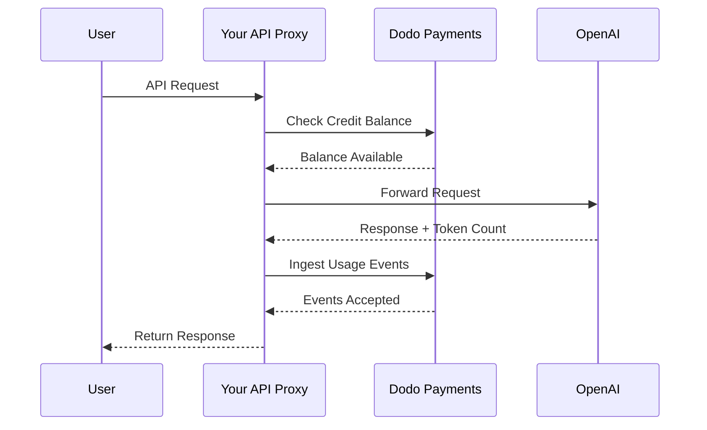
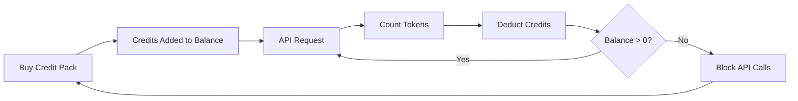

OpenAIs Abrechnungsmodell ist der Maßstab für KI-Unternehmen. Es kombiniert vorausbezahlte Fiat-Guthaben für die API-Nutzung mit Pauschalabonnements für Endverbraucherprodukte. Dieser hybride Ansatz sorgt für vorhersehbare Einnahmen, während Entwickler ihre Nutzung reibungslos skalieren können.

## Warum OpenAIs Modell der Standard ist

Die KI-Branche steht vor einzigartigen Herausforderungen, die die traditionelle SaaS-Abrechnung nicht immer adressiert. OpenAIs Modell löst mehrere dieser Probleme gleichzeitig.

1. **Vorhersehbare Einnahmen und geringes Risiko**: Durch die Anforderung vorausbezahlter Guthaben für die API-Nutzung eliminiert OpenAI das Risiko, dass Nutzer riesige Rechnungen anhäufen, die sie nicht bezahlen können. Sie erhalten das Geld im Voraus und der Nutzer erhält den Service während der Nutzung.
2. **Skalierbarkeit für Entwickler**: Eine \$5-Aufladung ist eine niedrige Einstiegshürde. Wenn ihre Anwendung wächst, können Entwickler Aufladungen automatisieren oder größere Pakete erwerben. Der Start ist nahezu reibungslos, aber die Wachstumsmöglichkeiten sind unbegrenzt.
3. **Nutzerpsychologie**: Die Nennung von Guthaben in Fiat-Währung (USD) anstelle abstrakter „Tokens“ oder „Punkte“ macht den Wert klar. Es fühlt sich wie ein Bankkonto für KI-Dienste an, was Vertrauen schafft und es Unternehmen erleichtert, zu budgetieren.

## Wie OpenAI abrechnet

OpenAI betreibt zwei unterschiedliche Abrechnungsmodelle, die verschiedene Nutzerbedürfnisse abdecken.

1. **API (Pay-as-you-go)**: Die API verwendet vorausbezahlte, in Fiat-Währung denominierten Credits. Nutzer laden ihre Konten mit \$5, \$10, \$50 oder mehr auf. Diese Credits zeigen einen Dollarwert an, haben aber außerhalb von OpenAI keinen Geldwert. OpenAI berechnet pro Token mit unterschiedlichen Tarifen für Eingabe- und Ausgabetoken. Guthaben verfallen nie, und wenn das Guthaben eines Nutzers \$0 erreicht, schlagen seine API-Aufrufe sofort fehl.
2. **ChatGPT Plus, Team und Enterprise**: Dies sind Pauschalabonnements. ChatGPT Plus kostet \$20 pro Monat, während der Team-Tarif \$25 pro Nutzer und Monat beträgt. Diese Pläne haben weiche Nutzungslimits, bei denen Nutzer zu einem kleineren Modell herabgestuft werden, anstatt blockiert zu werden.
3. **Ausgabenbasierte Tarifstufen**: Mit zunehmenden Gesamtausgaben über die Zeit schalten Sie höhere API-Ratenlimits frei. Dies ist ein vertrauensbasiertes Zugangsskalierungssystem, das direkt an Ihre Abrechnungshistorie geknüpft ist.

| Modell | Preisgestaltung | Eingangstoken | Ausgangstoken |
| :--- | :--- | :--- | :--- |
| GPT-4o | Nutzungsabhängig | \$2.50 / 1M | \$10.00 / 1M |
| GPT-4o-mini | Nutzungsabhängig | \$0.15 / 1M | \$0.60 / 1M |
| o1 | Nutzungsabhängig | \$15.00 / 1M | \$60.00 / 1M |

| Plan | Preis | Typ |
| :--- | :--- | :--- |
| Kostenlos | \$0 | Eingeschränkter Zugriff |
| Plus | \$20 / Mo | Abonnement mit weichen Limits |
| Team | \$25 / Nutzer / Mo | Sitzbezogenes Abonnement |
| Enterprise | Individuell | Abrechnung per Rechnung |
## Was es einzigartig macht

OpenAIs Abrechnungsstrategie weist mehrere Schlüsselfaktoren auf, die sie für KI-Dienste effektiv macht.

- **In Fiat denominiertes Guthaben**: Guthaben wirken wie Geld, weil sie in USD angegeben sind. Das macht die Preisgestaltung transparent und leicht verständlich für Entwickler.
- **Keine Ablaufzeiten**: Nie verfallende Kontostände reduzieren den „Nutze es oder verliere es“-Druck. Nutzer fühlen sich wohl dabei, größere Beträge aufzuladen, weil sie wissen, dass der Wert nicht verschwindet.
- **Multidimensionale Messung**: Eingangs- und Ausgangstoken werden separat verfolgt, aber vom gleichen Guthabenkonto abgezogen. Dadurch kann OpenAI teure Ausgangstoken anders bepreisen als günstigere Eingangstoken.
- **Vertrauensebenen**: Die Verknüpfung der Ratenlimits mit den Gesamtausgaben ermutigt Nutzer, auf der Plattform zu bleiben und belohnt langfristige Kunden mit besserer Performance.
## Strategische Vorteile

Dieses Modell erzeugt einen mächtigen Kreislauf. Niedrige Einstiegskosten locken Entwickler an. Vorausbezahlte Guthaben liefern sofortige Liquidität. Nutzungsabhängige Skalierung sorgt dafür, dass OpenAI erfolgreich ist, wenn die Entwickler erfolgreich sind. Die Abonnementseite bietet eine stabile, vorhersehbare Umsatzbasis von Nicht-Entwicklern.

## Dies mit Dodo Payments umsetzen

Sie können OpenAIs Abrechnungsmodell mit Dodo Payments reproduzieren. Wir verwenden Credit-Based Billing für die API und standardmäßige Abonnements für die ChatGPT Plus-Seite.

<Steps>
  <Step title="Create a Fiat Credit Entitlement">
    Beginnen Sie damit, in Ihrem Dodo Payments-Dashboard eine Kreditberechtigung zu erstellen. Dies fungiert als zentrales Guthaben für Ihre Nutzer.

    * **Kreditart:** Fiat Credits (USD)
    * **Ablaufdatum:** Nie
    * **Übertrag:** Nicht nötig (da sie nie verfallen)
    * **Überziehung:** Deaktiviert

    Das Deaktivieren von Überziehungen stellt sicher, dass API-Aufrufe fehlschlagen, sobald das Guthaben \$0 erreicht, ganz wie bei OpenAI.
  </Step>

  <Step title="Create Top-Up Products">
    Erstellen Sie Einmalzahlung-Produkte für verschiedene Guthabenpakete. Sie können Optionen über \$5, \$10, \$50 und \$100 anbieten. Verknüpfen Sie Ihre Fiat-Guthabenberechtigung mit jedem Produkt.

    Legen Sie die ausgegebenen Credits pro Produkt in Cents fest. Für ein \$50-Paket vergeben Sie 5000 Credits.

    ```typescript
    import DodoPayments from 'dodopayments';

    const client = new DodoPayments({
      bearerToken: process.env.DODO_PAYMENTS_API_KEY,
    });

    const session = await client.checkoutSessions.create({
      product_cart: [
        { product_id: 'prod_credit_pack_50', quantity: 1 }
      ],
      customer: { email: 'developer@example.com' },
      return_url: 'https://yourapp.com/dashboard'
    });
    ```

  </Step>

  <Step title="Create Usage Meters">
    Erstellen Sie zwei separate Meters, um die Token-Nutzung zu verfolgen.

    * `llm.input_tokens`: Summe-Aggregation auf der `tokens`-Eigenschaft.
    * `llm.output_tokens`: Summe-Aggregation auf der `tokens`-Eigenschaft.

    Verknüpfen Sie beide Meters mit Ihrer Fiat-Guthabenberechtigung. Sie müssen die „Meter units per credit“ für jede konfigurieren.

    ### Berechnung der Meter-Einheiten pro Kredit

    Um OpenAIs GPT-4o-Preise (\$2.50 pro 1M Eingangstoken) abzubilden, müssen Sie berechnen, wie viele Token \$1 (100 Cents) entsprechen.

    * **Eingangstoken:** 1.000.000 Token / \$2.50 = 400.000 Token pro \$1.
    * **Ausgangstoken:** 1.000.000 Token / \$10.00 = 100.000 Token pro \$1.

    Im Dodo-Dashboard würden Sie die „Meter units per credit“ auf 400.000 für Eingang und 100.000 für Ausgang setzen.
  </Step>

  <Step title="Send Usage Events">
    Senden Sie nach jeder LLM-Anfrage die Nutzungsdaten an Dodo Payments. Sie können sowohl Eingangs- als auch Ausgangsereignisse in einer einzigen Anfrage senden.

    ```typescript
    await client.usageEvents.ingest({
      events: [{
        event_id: `req_${requestId}`,
        customer_id: customerId,
        event_name: 'llm.input_tokens',
        timestamp: new Date().toISOString(),
        metadata: {
          model: 'gpt-4o',
          tokens: 1500
        }
      }, {
        event_id: `req_${requestId}_out`,
        customer_id: customerId,
        event_name: 'llm.output_tokens',
        timestamp: new Date().toISOString(),
        metadata: {
          model: 'gpt-4o',
          tokens: 800
        }
      }]
    });
    ```

  </Step>

  <Step title="Handle Balance Depletion">
    Sie sollten das Guthaben des Nutzers überprüfen, bevor Sie eine API-Anfrage verarbeiten. Wenn das Guthaben null oder negativ ist, geben Sie einen 402-Fehler zurück.

    ```typescript
    async function checkCreditsBeforeRequest(customerId: string) {
      const balance = await client.creditEntitlements.balances.retrieve(customerId, {
        credit_entitlement_id: 'credit_entitlement_id',
      });

      if (balance.available <= 0) {
        throw new Error('Insufficient credits. Please top up your account.');
      }
    }
    ```

    ### Umgang mit Webhooks für niedrigen Kontostand

    Warten Sie nicht, bis der Nutzer \$0 erreicht, um ihn zu benachrichtigen. Verwenden Sie Webhooks, um eine E-Mail oder In-App-Benachrichtigung auszulösen, wenn sein Guthaben unter einen bestimmten Schwellenwert fällt.

    ```typescript
    import DodoPayments from 'dodopayments';
    import express from 'express';

    const app = express();
    app.use(express.raw({ type: 'application/json' }));

    const client = new DodoPayments({
      bearerToken: process.env.DODO_PAYMENTS_API_KEY,
      webhookKey: process.env.DODO_PAYMENTS_WEBHOOK_KEY,
    });

    app.post('/webhooks/dodo', async (req, res) => {
      try {
        const event = client.webhooks.unwrap(req.body.toString(), {
          headers: {
            'webhook-id': req.headers['webhook-id'] as string,
            'webhook-signature': req.headers['webhook-signature'] as string,
            'webhook-timestamp': req.headers['webhook-timestamp'] as string,
          },
        });

        if (event.type === 'credit.balance_low') {
          const { customer_id, available_balance } = event.data;
          await sendLowBalanceEmail(customer_id, available_balance);
        }

        res.json({ received: true });
      } catch (error) {
        res.status(401).json({ error: 'Invalid signature' });
      }
    });
    ```

    <Tip>
      OpenAI sendet diese E-Mails, wenn das Guthaben eines Nutzers fast erschöpft ist, sodass er Zeit zum Aufladen hat, ohne dass der Service unterbrochen wird.
    </Tip>
  </Step>

  <Step title="Build the ChatGPT Subscription Side (Optional)">
    Wenn Sie ein Abonnement wie ChatGPT Plus anbieten möchten, erstellen Sie ein separates Abonnementprodukt in Dodo Payments. Diese benötigen keine Kreditberechtigungen.

    Für einen Team-Tarif verwenden Sie sitzbasierte Abrechnung, indem Sie Add-ons für jeden zusätzlichen Nutzer hinzufügen.

    ```typescript
    const session = await client.checkoutSessions.create({
      product_cart: [
        { product_id: 'prod_plus_subscription', quantity: 1 }
      ],
      customer: { email: 'user@example.com' },
      return_url: 'https://yourapp.com/billing'
    });
    ```

    ### Implementierung weicher Limits

    Um OpenAIs weiche Limits zu replizieren, können Sie die Nutzung Ihrer Abonnementnutzer mit denselben Meters verfolgen, jedoch ohne sie mit einer Kreditberechtigung zu verknüpfen. Prüfen Sie in Ihrer Anwendungslogik die Nutzung für den aktuellen Abrechnungszeitraum.

    ```typescript
    async function checkSubscriptionUsage(customerId: string) {
      const usage = await getUsageForCurrentPeriod(customerId);
      
      if (usage > SOFT_CAP_THRESHOLD) {
        // Route to a smaller model instead of blocking
        return 'gpt-4o-mini';
      }
      
      return 'gpt-4o';
    }
    ```

  </Step>
</Steps>

## Beschleunigen mit dem LLM Ingestion Blueprint

Die obigen Schritte zeigen, wie man Nutzungsereignisse manuell konstruiert und sendet. Für Produktionseinsätze bietet das [LLM Ingestion Blueprint](/developer-resources/ingestion-blueprints/llm) automatisches Token-Tracking, das Ihren OpenAI-Client direkt umschließt.

```bash
npm install @dodopayments/ingestion-blueprints
```

```typescript
import { createLLMTracker } from '@dodopayments/ingestion-blueprints';
import OpenAI from 'openai';

const openai = new OpenAI({ apiKey: process.env.OPENAI_API_KEY });

const tracker = createLLMTracker({
  apiKey: process.env.DODO_PAYMENTS_API_KEY,
  environment: 'live_mode',
  eventName: 'llm.chat_completion',
});

const trackedClient = tracker.wrap({
  client: openai,
  customerId: customerId,
});

// Every API call now automatically tracks token usage
const response = await trackedClient.chat.completions.create({
  model: 'gpt-4o',
  messages: [{ role: 'user', content: prompt }],
});

// inputTokens, outputTokens, and totalTokens are sent automatically
console.log('Tokens used:', response.usage);
```

Das Blueprint erfasst `inputTokens`, `outputTokens` und `totalTokens` aus jeder API-Antwort und sendet sie als Ereignismetadaten. Konfigurieren Sie Ihren Meter, um auf der entsprechenden Token-Eigenschaft zu aggregieren.

<Tip>
Das LLM Blueprint unterstützt OpenAI, Anthropic, Groq, Google Gemini, OpenRouter und das Vercel AI SDK. Siehe die [vollständige Blueprint-Dokumentation](/developer-resources/ingestion-blueprints/llm) für anbieterspezifische Beispiele und erweiterte Konfiguration.
</Tip>

## Umsetzung ausgabenbasierter Tarifstufen

OpenAIs Tarifstufen sind ein mächtiges Mittel zur Kapazitätsverwaltung. Sie können dies umsetzen, indem Sie die gesamten Lebenszeitausgaben eines Kunden verfolgen.

1. **Lebenszeitausgaben verfolgen:** Hören Sie auf `payment.succeeded`-Webhooks und aktualisieren Sie ein `total_spend`-Feld in Ihrer Datenbank für diesen Kunden.
2. **Stufen definieren:** Erstellen Sie eine Zuordnung von Ausgabenbeträgen zu Ratenlimits.
   * Stufe 1: \$0 - \$50 Ausgaben -> 3 RPM
   * Stufe 2: \$50 - \$250 Ausgaben -> 10 RPM
   * Stufe 3: \$250+ Ausgaben -> 50 RPM
3. **Limits durchsetzen:** Prüfen Sie in Ihrer API-Middleware die Stufe des Kunden und erzwingen Sie das entsprechende Ratenlimit.

```typescript
async function getRateLimitForCustomer(customerId: string) {
  const customer = await db.customers.findUnique({ where: { id: customerId } });
  const totalSpend = customer.total_spend;

  if (totalSpend >= 25000) return TIER_3_LIMITS; // $250.00
  if (totalSpend >= 5000) return TIER_2_LIMITS;  // $50.00
  return TIER_1_LIMITS;
}
```

## Vollständiges Implementierungsbeispiel: Der API-Proxy

In einem realen Szenario haben Sie wahrscheinlich einen API-Proxy, der zwischen Ihren Nutzern und dem LLM-Anbieter sitzt. Dieser Proxy übernimmt Authentifizierung, Guthabenprüfungen und Nutzungsberichte.



```typescript
import DodoPayments from 'dodopayments';
import OpenAI from 'openai';

const client = new DodoPayments({
  bearerToken: process.env.DODO_PAYMENTS_API_KEY,
});
const openai = new OpenAI({ apiKey: process.env.OPENAI_API_KEY });

export async function handleApiRequest(req, res) {
  const { customerId, prompt, model } = req.body;

  try {
    // 1. Check credit balance
    const balance = await client.creditEntitlements.balances.retrieve(customerId, {
      credit_entitlement_id: 'credit_entitlement_id',
    });

    if (balance.available <= 0) {
      return res.status(402).json({ error: 'Insufficient credits. Please top up.' });
    }

    // 2. Call OpenAI
    const completion = await openai.chat.completions.create({
      model: model,
      messages: [{ role: 'user', content: prompt }],
    });

    const { prompt_tokens, completion_tokens } = completion.usage;

    // 3. Ingest usage events to Dodo
    await client.usageEvents.ingest({
      events: [
        {
          event_id: `req_${completion.id}_in`,
          customer_id: customerId,
          event_name: 'llm.input_tokens',
          timestamp: new Date().toISOString(),
          metadata: { model, tokens: prompt_tokens }
        },
        {
          event_id: `req_${completion.id}_out`,
          customer_id: customerId,
          event_name: 'llm.output_tokens',
          timestamp: new Date().toISOString(),
          metadata: { model, tokens: completion_tokens }
        }
      ]
    });

    // 4. Return response to user
    res.json(completion);

  } catch (error) {
    console.error('API Error:', error);
    res.status(500).json({ error: 'Internal server error' });
  }
}
```

## Umgang mit Randfällen

Beim Aufbau eines so komplexen Abrechnungssystems wie dem von OpenAI stoßen Sie auf mehrere Randfälle, die sorgfältig behandelt werden müssen.

### Race Conditions

Wenn ein Nutzer ein sehr niedriges Guthaben hat und mehrere Anfragen gleichzeitig sendet, könnte er sein Kreditlimit überschreiten, bevor das erste Ereignis verarbeitet wird. Um dies zu verhindern, können Sie einen kleinen „Puffer“ implementieren oder während der Anfrage ein verteiltes Lock auf dem Guthaben des Kunden verwenden.

### Latenz bei der Ereignisintegration

Dodo Payments verarbeitet Ereignisse asynchron. Das bedeutet, dass es eine leichte Verzögerung zwischen einem API-Aufruf und der Kreditabbuchung geben kann. Für die meisten Anwendungsfälle ist dies akzeptabel. Wenn Sie eine strikte Echtzeit-Durchsetzung benötigen, können Sie einen lokalen Cache des Nutzerkontostands führen und ihn optimistisch aktualisieren.

### Rückerstattungsabwicklung

Wenn Sie einen Guthabenpaket-Kauf rückerstatten, übernimmt Dodo Payments die Kreditberechtigung automatisch, falls konfiguriert. Sie sollten jedoch sicherstellen, dass Ihre Anwendungslogik diese Änderung sofort widerspiegelt, um zu verhindern, dass Nutzer Credits verwenden, die sie nicht mehr besitzen.

### Unterstützung mehrerer Modelle

Wenn Sie mehrere Modelle mit unterschiedlichen Preisen unterstützen, haben Sie zwei Optionen:
1. **Separate Meters:** Erstellen Sie separate Meters für jedes Modell (z. B. `gpt-4o.input_tokens`, `gpt-4o-mini.input_tokens`).
2. **Gewichtete Ereignisse:** Verwenden Sie einen einzigen Meter, multiplizieren Sie jedoch den `tokens`-Wert mit einem Gewicht, bevor Sie ihn an Dodo senden. Beispielsweise können Sie für GPT-4o, das 10-mal teurer ist als GPT-4o-mini, 10-mal so viele Tokens für GPT-4o-Anfragen senden.

OpenAI verwendet intern den separaten Meter-Ansatz, um klare Nutzungsaufzeichnungen pro Modell zu führen.

## Architekturüberblick



Die Meters verfolgen Tokens und ziehen den entsprechenden Wert vom Guthabenkonto des Nutzers basierend auf Ihren konfigurierten Tarifen ab.

## Fazit

Die Replikation von OpenAIs Abrechnungsmodell mit Dodo Payments bietet Ihnen das Beste aus beiden Welten: die Flexibilität nutzungsbasierter Abrechnung und die Vorhersehbarkeit vorausbezahlter Guthaben. Wenn Sie dieser Anleitung folgen, können Sie ein Abrechnungssystem aufbauen, das mit Ihren Nutzern skaliert und gleichzeitig Ihre Margen schützt.

Ob Sie nun das nächste große LLM oder ein Nischen-KI-Tool entwickeln, diese Muster helfen Ihnen, ein professionelles, entwicklerfreundliches Erlebnis zu schaffen. Dieser Ansatz stellt sicher, dass Ihre Abrechnungsinfrastruktur genauso skalierbar und zuverlässig ist wie die KI-Modelle, die Sie Ihren Kunden liefern.

## Wichtige verwendete Dodo-Funktionen

Entdecken Sie die Funktionen, die diese Umsetzung möglich machen.

<CardGroup cols={2}>
  <Card title="Credit-Based Billing" icon="coins" href="/features/credit-based-billing">
    Verwalten Sie vorausbezahlte Fiat-Guthaben und Berechtigungen für Ihre Nutzer.
  </Card>
  <Card title="Usage-Based Billing" icon="chart-line" href="/features/usage-based-billing/introduction">
    Verfolgen Sie granulare Nutzung wie Tokens und rechnen Sie sie in Echtzeit ab.
  </Card>
  <Card title="One-Time Payments" icon="credit-card" href="/features/one-time-payment-products">
    Verkaufen Sie Guthabenpakete und Aufladungen mit einem einfachen Checkout-Prozess.
  </Card>
  <Card title="Event Ingestion" icon="bolt" href="/features/usage-based-billing/event-ingestion">
    Senden Sie problemlos hochvolumige Nutzungsdaten an Dodo Payments.
  </Card>
  <Card title="Webhooks" icon="webhook" href="/developer-resources/webhooks/intents/credit">
    Bleiben Sie über Änderungen des Guthabenkontos und Warnungen bei niedrigem Guthaben informiert.
  </Card>
  <Card title="LLM Ingestion Blueprint" icon="brain-circuit" href="/developer-resources/ingestion-blueprints/llm">
    Automatisches Token-Tracking für OpenAI und andere LLM-Anbieter.
  </Card>
</CardGroup>
