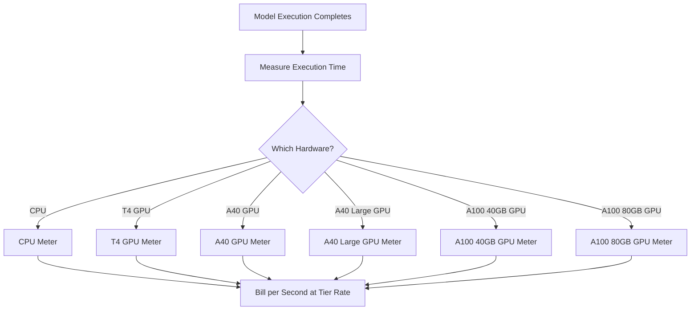

Replicate ist eine Plattform zum Ausführen von Open-Source-Machine-Learning-Modellen in der Cloud. Ihr Abrechnungsmodell ist eines der reinsten Beispiele für nutzungsbasierte Preise in der KI-Branche. Es gibt keine monatliche Abonnementgebühr und keinen Pauschalpreis pro Modelllauf. Stattdessen berechnen sie genau die Menge an Rechenzeit, die verbraucht wurde, bis auf die Sekunde genau, mit variierenden Preisen je nach zugrunde liegender Hardware.

Dieser Ansatz funktioniert gut für KI-Workloads, da die Ausführungszeiten unvorhersehbar sind. Ein einzelner Benutzer kann ein leichtgewichtiges Modell für einige Sekunden oder ein massives generatives Modell für mehrere Minuten ausführen. Indem die Kosten an Rechenressourcen statt am Modell selbst festgemacht werden, hält Replicate die Preisgestaltung transparent und skalierbar.

## Wie Replicate abrechnet

Die Preisgestaltung von Replicate ist von dem spezifischen Modell entkoppelt, das ausgeführt wird. Ob du ein Bild mit SDXL generierst oder Llama 3 ausführst, die Abrechnung richtet sich nach der Hardware-Stufe und der Ausführungsdauer. Das erlaubt ihnen, Tausende Open-Source-Modelle zu hosten, ohne für jedes einen eigenen Preisplan zu benötigen.

| Hardware | Preis pro Sekunde | Preis pro Stunde |
| :--- | :--- | :--- |
| NVIDIA CPU | \$0.000100 | \$0.36 |
| NVIDIA T4 GPU | \$0.000225 | \$0.81 |
| NVIDIA A40 GPU | \$0.000575 | \$2.07 |
| NVIDIA A40 (Large) GPU | \$0.000725 | \$2.61 |
| NVIDIA A100 (40GB) GPU | \$0.001150 | \$4.14 |
| NVIDIA A100 (80GB) GPU | \$0.001400 | \$5.04 |



1. **Hardware-spezifische Preise**: Die Kosten pro Sekunde variieren je nach benötigten Rechenressourcen. Jede Hardware-Stufe hat einen anderen Preis.
2. **Reines nutzungsbasiertes Modell**: Es gibt keine monatlichen Gebühren, keine Zuschläge und keine Limits. Benutzer werden für die genaue Rechenzeit (z. B. „12,4 Sekunden auf einer A100“) statt pro Generierung abgerechnet.
3. **Pro-Sekunde-Granularität**: Traditionelle Cloud-Anbieter berechnen nach Stunde oder Minute, was bei kurzlebigen Aufgaben zu Verschwendung führt. Die Abrechnung pro Sekunde beseitigt diese Ineffizienz sowohl für kleine Experimente als auch für große Produktions-Workloads.

<Info>
Cold Starts sind ebenfalls abrechenbar. Die erste Anfrage an ein Modell benötigt oft 10-30 Sekunden, um das Modell in den Speicher zu laden. Diese Ladezeit wird zum gleichen Satz wie die Ausführungszeit berechnet.
</Info>
## Was es einzigartig macht

* **Hardware-spezifische Messung:** Dasselbe Modell kostet auf besserer Hardware mehr. Nutzer wählen zwischen Geschwindigkeit und Kosten. Eine T4-GPU eignet sich für nicht zeitkritische Aufgaben, während eine A100 Echtzeitanwendungen bewältigt.
* **Granularität pro Sekunde:** Die Abrechnung wird auf die Sekunde berechnet, sodass Nutzer nie für kurze Aufgaben überbezahlen.
* **Kein Abonnement:** Null Verpflichtung zum Start. Es skaliert unbegrenzt mit der Nutzung, was ideal für Startups und Entwickler ist, die verschiedene Modelle testen.
* **Modell-agnostisch:** Die Abrechnungslogik bleibt unabhängig vom Aufgabe-Typ (Bildgenerierung, Textverarbeitung, Audiotranskription oder Videosynthese) gleich. Das ermöglicht der Plattform, ein großes Modell-Ökosystem ohne komplexe Preislisten zu unterstützen.

## Das mit Dodo Payments nachbauen

Du kannst dieses Abrechnungsmodell mit den nutzungsbasierten Abrechnungsfunktionen von Dodo Payments nachbilden. Entscheidend ist, mehrere Metriken zu verwenden, um unterschiedliche Hardware-Stufen zu verfolgen und mit einem einzigen Produkt zu verknüpfen.

<Steps>
  <Step title="Create Usage Meters (One Per Hardware Class)">
    Erstelle getrennte Metriken für jede Hardware-Stufe. Jeder Hardware-Typ hat unterschiedliche Kosten pro Sekunde, sodass unabhängige Messungen Dodo erlauben, jede Stufe unterschiedlich zu bepreisen und detaillierte Abrechnungen bereitzustellen.

    | Meter-Name | Ereignisname | Aggregation | Eigenschaft |
    | :--- | :--- | :--- | :--- |
    | CPU Compute | `compute.cpu` | Summe | `execution_seconds` |
    | GPU T4 Compute | `compute.gpu_t4` | Summe | `execution_seconds` |
    | GPU A40 Compute | `compute.gpu_a40` | Summe | `execution_seconds` |
    | GPU A40 Large Compute | `compute.gpu_a40_large` | Summe | `execution_seconds` |
    | GPU A100 40GB Compute | `compute.gpu_a100_40` | Summe | `execution_seconds` |
    | GPU A100 80GB Compute | `compute.gpu_a100_80` | Summe | `execution_seconds` |

    Die `Sum`-Aggregation auf der `execution_seconds`-Eigenschaft berechnet die gesamte Rechenzeit pro Hardware-Stufe über den Abrechnungszeitraum.
  </Step>

  <Step title="Create a Usage-Based Product">
    Erstelle ein neues Produkt im Dodo Payments Dashboard:

    * **Preistyp:** Nutzungsbasierte Abrechnung
    * **Grundpreis:** \$0/Monat (keine Abonnementgebühr)
    * **Abrechnungsfrequenz:** Monatlich

    Hänge alle Metriken mit ihren Preis je Einheit an:

    | Meter | Preis pro Einheit (pro Sekunde) |
    | :--- | :--- |
    | compute.cpu | \$0.000100 |
    | compute.gpu_t4 | \$0.000225 |
    | compute.gpu_a40 | \$0.000575 |
    | compute.gpu_a40_large | \$0.000725 |
    | compute.gpu_a100_40 | \$0.001150 |
    | compute.gpu_a100_80 | \$0.001400 |

    Setze den **Freischwellenwert** für alle Metriken auf 0. Jede Sekunde Ausführung ist abrechenbar.
  </Step>

  <Step title="Send Usage Events">
    Sende Nutzungsereignisse an Dodo, sobald eine Modellausführung abgeschlossen ist. Füge für jede Vorhersage eine eindeutige `event_id` hinzu, um Idempotenz sicherzustellen.

    ```typescript
    import DodoPayments from 'dodopayments';

    type HardwareTier = 'cpu' | 'gpu_t4' | 'gpu_a40' | 'gpu_a40_large' | 'gpu_a100_40' | 'gpu_a100_80';

    const client = new DodoPayments({
      bearerToken: process.env.DODO_PAYMENTS_API_KEY,
    });

    async function trackModelExecution(
      customerId: string,
      modelId: string,
      hardware: HardwareTier,
      executionSeconds: number,
      predictionId: string
    ) {
      const eventName = `compute.${hardware}`;

      await client.usageEvents.ingest({
        events: [{
          event_id: `pred_${predictionId}`,
          customer_id: customerId,
          event_name: eventName,
          timestamp: new Date().toISOString(),
          metadata: {
            execution_seconds: executionSeconds,
            model_id: modelId,
            hardware: hardware
          }
        }]
      });
    }

    // Example: SDXL image generation on A100
    await trackModelExecution(
      'cus_abc123',
      'stability-ai/sdxl',
      'gpu_a100_80',
      8.3,  // 8.3 seconds of A100 time
      'pred_xyz789'
    );
    ```

  </Step>

  <Step title="Measure Execution Time Precisely">
    Umgebe deine Modellausführung mit präzisem Timing mithilfe von `performance.now()`. Runde für die Abrechnung auf das nächste Zehntel einer Sekunde.

    ```typescript
    async function runModelWithMetering(
      customerId: string,
      modelId: string,
      hardware: HardwareTier,
      input: Record<string, unknown>
    ) {
      const predictionId = `pred_${Date.now()}`;
      const startTime = performance.now();

      try {
        const result = await executeModel(modelId, input, hardware);
        const executionSeconds = (performance.now() - startTime) / 1000;
        const billedSeconds = Math.round(executionSeconds * 10) / 10;

        await trackModelExecution(
          customerId,
          modelId,
          hardware,
          billedSeconds,
          predictionId
        );

        return result;
      } catch (error) {
        // Still bill for compute time even on failure
        const executionSeconds = (performance.now() - startTime) / 1000;
        if (executionSeconds > 1) {
          await trackModelExecution(
            customerId,
            modelId,
            hardware,
            Math.round(executionSeconds * 10) / 10,
            predictionId
          );
        }
        throw error;
      }
    }
    ```

  </Step>

  <Step title="Create Checkout">
    Wenn sich ein Nutzer anmeldet, erstelle eine Checkout-Sitzung für das nutzungsbasierte Produkt. Dodo übernimmt automatisch wiederkehrende Abrechnung und Rechnungsstellung.

    ```typescript
    const session = await client.checkoutSessions.create({
      product_cart: [
        { product_id: 'prod_compute_payg', quantity: 1 }
      ],
      customer: { email: 'ml-engineer@company.com' },
      return_url: 'https://yourplatform.com/dashboard'
    });
    ```

  </Step>
</Steps>

## Beschleunigen mit dem Time Range Ingestion Blueprint

Der [Time Range Ingestion Blueprint](/developer-resources/ingestion-blueprints/time-range) vereinfacht das Tracking pro Sekunde. Erstelle eine Ingestion-Instanz pro Hardware-Stufe und verwende `trackTimeRange` für sauberere Ereigniseinreichungen.

```bash
npm install @dodopayments/ingestion-blueprints
```

```typescript
import { Ingestion, trackTimeRange } from '@dodopayments/ingestion-blueprints';

// Create one ingestion instance per hardware tier
function createHardwareIngestion(hardware: string) {
  return new Ingestion({
    apiKey: process.env.DODO_PAYMENTS_API_KEY,
    environment: 'live_mode',
    eventName: `compute.${hardware}`,
  });
}

const ingestions: Record<string, Ingestion> = {
  cpu: createHardwareIngestion('cpu'),
  gpu_t4: createHardwareIngestion('gpu_t4'),
  gpu_a40: createHardwareIngestion('gpu_a40'),
  gpu_a40_large: createHardwareIngestion('gpu_a40_large'),
  gpu_a100_40: createHardwareIngestion('gpu_a100_40'),
  gpu_a100_80: createHardwareIngestion('gpu_a100_80'),
};

// Track execution after a model run completes
const startTime = performance.now();
const result = await executeModel(modelId, input, hardware);
const durationMs = performance.now() - startTime;

await trackTimeRange(ingestions[hardware], {
  customerId: customerId,
  durationMs: durationMs,
  metadata: {
    model_id: modelId,
    hardware: hardware,
  },
});
```

Der Blueprint übernimmt die Formatierung der Dauer und den Aufbau von Ereignissen. In Kombination mit pro Hardware-Stufe angelegten Ingestion-Instanzen bildet dieses Muster klar Replicates Multi-Tier-Messung ab.

<Tip>
Für lang laufende Jobs kombiniere den Time Range Blueprint mit intervallbasiertem Heartbeat-Tracking. Sieh dir die [vollständige Blueprint-Dokumentation](/developer-resources/ingestion-blueprints/time-range) für fortgeschrittene Muster an.
</Tip>

## Kostenabschätzung für Nutzer

Da nutzungsbasierte Abrechnung unvorhersehbar sein kann, gib Nutzern vor dem Modelllauf Kostenschätzungen. Das reduziert unangenehme Überraschungen und schafft Vertrauen.

### Beispielhafte Kostenberechnungen

| Modell | Hardware | Durchschnittliche Zeit | Kosten pro Lauf |
| :--- | :--- | :--- | :--- |
| SDXL (Bild) | A100 80GB | ~8 Sek. | ~\$0.0112 |
| Llama 3 (Text) | A100 40GB | ~3 Sek. | ~\$0.0035 |
| Whisper (Audio) | GPU T4 | ~15 Sek. | ~\$0.0034 |

### Aufbau eines Kostenrechners

```typescript
function estimateCost(hardware: HardwareTier, estimatedSeconds: number): number {
  const rates: Record<HardwareTier, number> = {
    'cpu': 0.000100,
    'gpu_t4': 0.000225,
    'gpu_a40': 0.000575,
    'gpu_a40_large': 0.000725,
    'gpu_a100_40': 0.001150,
    'gpu_a100_80': 0.001400
  };

  return Number((rates[hardware] * estimatedSeconds).toFixed(4));
}

// Show the user before running: "This will cost approximately $0.0098"
const estimate = estimateCost('gpu_a100_80', 8.5);
```

## Enterprise: Reservierte Kapazität

Für Unternehmenskunden, die garantierte Verfügbarkeit und keine Cold Starts benötigen, bietet Replicate „Private Instances“ zu einem festen Stundensatz an.

Mit Dodo Payments modellierst du das als Abo-Produkt:

* **Produkttyp:** Abonnement
* **Preis:** Fester monatlicher Preis (z. B. „Reservierte A100-Instanz – \$500/Monat“)
* **Abrechnungszyklus:** Monatlich

Du kannst weiterhin Nutzungsereignisse für Monitoring und Analytics senden, aber das Abonnement deckt die Kosten ab. Wenn das Volumen eines Nutzers steigt, wird der Wechsel von Pay-as-you-go zu reservierter Kapazität oft kostengünstiger.

## Fortgeschritten: Heartbeat-Messung

Für Aufgaben, die mehrere Minuten oder Stunden dauern, ist das Senden eines einzelnen Ereignisses am Ende riskant. Wenn der Prozess abstürzt, gehen die Nutzungsdaten verloren. Eine bessere Methode ist, während der Ausführung alle 30-60 Sekunden Nutzungsereignisse zu senden.

```typescript
async function runLongTaskWithHeartbeat(
  customerId: string,
  modelId: string,
  hardware: HardwareTier
) {
  const predictionId = `pred_${Date.now()}`;
  let totalSeconds = 0;

  const heartbeatInterval = setInterval(async () => {
    try {
      await trackModelExecution(
        customerId,
        modelId,
        hardware,
        30,
        `${predictionId}_${totalSeconds}`
      );
      totalSeconds += 30;
    } catch (error) {
      console.error('Heartbeat tracking failed:', error, { predictionId, totalSeconds });
    }
  }, 30000);

  try {
    await executeLongTask();
  } finally {
    clearInterval(heartbeatInterval);
  }
}
```

## Wichtige genutzte Dodo-Funktionen

<CardGroup cols={2}>
  <Card title="Usage-Based Billing" icon="chart-line" href="/features/usage-based-billing/introduction">
    Richte Produkte ein, die sich nach dem Verbrauch richten.
  </Card>
  <Card title="Meters" icon="gauge" href="/features/usage-based-billing/meters">
    Definiere die Metriken, die du verfolgen und abrechnen möchtest.
  </Card>
  <Card title="Event Ingestion" icon="bolt" href="/features/usage-based-billing/event-ingestion">
    Sende Nutzungsdaten in Echtzeit an Dodo.
  </Card>
  <Card title="Subscriptions" icon="calendar" href="/features/subscription">
    Verwalte wiederkehrende Abrechnung für reservierte Kapazitäten und Enterprise-Pläne.
  </Card>
  <Card title="Time Range Blueprint" icon="clock" href="/developer-resources/ingestion-blueprints/time-range">
    Pro-Sekunde-Compute-Tracking mit Duration-Helpern.
  </Card>
</CardGroup>
