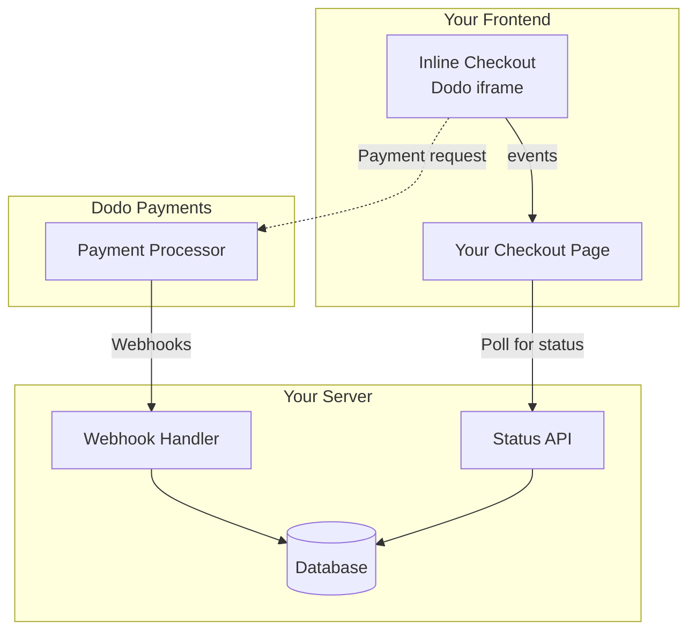

## Overview

Inline checkout lets you create fully integrated checkout experiences that blend seamlessly with your website or application. Unlike the [overlay checkout](/developer-resources/overlay-checkout), which opens as a modal on top of your page, inline checkout embeds the payment form directly into your page layout.

Using inline checkout, you can:

- Create checkout experiences that are fully integrated with your app or website
- Let Dodo Payments securely capture customer and payment information in an optimized checkout frame
- Display items, totals, and other information from Dodo Payments on your page
- Use SDK methods and events to build advanced checkout experiences

<Frame>
    
</Frame>

## How It Works

Inline checkout works by embedding a secure Dodo Payments frame into your website or app.

The checkout frame handles collecting customer information and capturing payment details. Your page displays the items list, totals, and options for changing what's on the checkout. The SDK lets your page and the checkout frame interact with each other.

Dodo Payments automatically creates a subscription when a checkout completes, ready for you to provision.

<Note>
The inline checkout frame securely handles all sensitive payment information, ensuring PCI compliance without additional certification on your end.
</Note>

## What Makes a Good Inline Checkout?

It's important that customers know who they're buying from, what they're buying, and how much they're paying.

To build an inline checkout that's compliant and optimized for conversion, your implementation must include:

<Frame caption="Example inline checkout layout showing required elements">
    
</Frame>

1. **Recurring information**: If recurring, how often it recurs and the total to pay on renewal. If a trial, how long the trial lasts.
2. **Item descriptions**: A description of what's being purchased.
3. **Transaction totals**: Transaction totals, including subtotal, total tax, and grand total. Be sure to include the currency too.
4. **Dodo Payments footer**: The full inline checkout frame, including the checkout footer that has information about Dodo Payments, our terms of sale, and our privacy policy.
5. **Refund policy**: A link to your refund policy, if it differs from the Dodo Payments standard refund policy.

<Warning>
Always display the complete inline checkout frame, including the footer. Removing or hiding legal information violates compliance requirements.
</Warning>

## Customer Journey

The checkout flow is determined by your checkout session configuration. Depending on how you configure the checkout session, customers will experience a checkout that may present all information on a single page or across multiple steps.

<Steps>
<Step title="Customer opens checkout">

You can open inline checkout by passing items or an existing transaction. Use the SDK to show and update on-page information, and SDK methods to update items based on customer interaction.
    

</Step>

<Step title="Customer enters their details">

Inline checkout first asks customers to enter their email address, select their country, and (where required) enter their ZIP or postal code. This step gathers all necessary information to determine taxes and available payment options.

You can prefill customer details and present saved addresses to streamline the experience.

</Step>

<Step title="Customer selects payment method">

After entering their details, customers are presented with available payment methods and the payment form. Options may include credit or debit card, PayPal, Apple Pay, Google Pay, and other local payment methods based on their location.

Display saved payment methods if available to speed up checkout.


</Step>

<Step title="Checkout completed">

Dodo Payments routes every payment to the best acquirer for that sale to get the best possible chance of success. Customers enter a success workflow that you can build.


</Step>

<Step title="Dodo Payments creates subscription">

Dodo Payments automatically creates a subscription for the customer, ready for you to provision. The payment method the customer used is held on file for renewals or subscription changes.


</Step>
</Steps>

## Quick Start

Get started with the Dodo Payments Inline Checkout in just a few lines of code:

```typescript
import { DodoPayments } from "dodopayments-checkout";

// Initialize the SDK for inline mode
DodoPayments.Initialize({
  mode: "test",
  displayType: "inline",
  onEvent: (event) => {
    console.log("Checkout event:", event);
  },
});

// Open checkout in a specific container
DodoPayments.Checkout.open({
  checkoutUrl: "https://test.dodopayments.com/session/cks_123",
  elementId: "dodo-inline-checkout" // ID of the container element
});
```

<Tip>
Ensure you have a container element with the corresponding `id` on your page: `<div id="dodo-inline-checkout"></div>`.
</Tip>

## Step-by-Step Integration Guide

<Steps>
<Step title="Install the SDK">

Install the Dodo Payments Checkout SDK:

<CodeGroup>

```bash npm
npm install dodopayments-checkout
```

```bash yarn
yarn add dodopayments-checkout
```

```bash pnpm
pnpm add dodopayments-checkout
```

</CodeGroup>

</Step>

<Step title="Initialize the SDK for Inline Display">

Initialize the SDK and specify `displayType: 'inline'`. You should also listen for the `checkout.breakdown` event to update your UI with real-time tax and total calculations.

```typescript
import { DodoPayments } from "dodopayments-checkout";

DodoPayments.Initialize({
  mode: "test",
  displayType: "inline",
  onEvent: (event) => {
    if (event.event_type === "checkout.breakdown") {
      const breakdown = event.data?.message;
      // Update your UI with breakdown.subTotal, breakdown.tax, breakdown.total, etc.
    }
  },
});
```

</Step>

<Step title="Create a Container Element">

Add an element to your HTML where the checkout frame will be injected:

```html
<div id="dodo-inline-checkout"></div>
```

</Step>

<Step title="Open the Checkout">

Call `DodoPayments.Checkout.open()` with the `checkoutUrl` and the `elementId` of your container:

```typescript
DodoPayments.Checkout.open({
  checkoutUrl: "https://test.dodopayments.com/session/cks_123",
  elementId: "dodo-inline-checkout"
});
```

</Step>

<Step title="Test Your Integration">

1. Start your development server:

```bash
npm run dev
```

2. Test the checkout flow:
   - Enter your email and address details in the inline frame.
   - Verify that your custom order summary updates in real-time.
   - Test the payment flow using test credentials.
   - Confirm redirects work correctly.

<Check>
You should see `checkout.breakdown` events logged in your browser console if you added a console log in the `onEvent` callback.
</Check>

</Step>

<Step title="Go Live">

When you're ready for production:

1. Change the mode to `'live'`:

```typescript
DodoPayments.Initialize({
  mode: "live",
  displayType: "inline",
  onEvent: (event) => {
    // Handle events
  }
});
```

2. Update your checkout URLs to use live checkout sessions from your backend.
3. Test the complete flow in production.

</Step>
</Steps>

## Complete React Example

This example demonstrates how to implement a custom order summary alongside the inline checkout, keeping them in sync using the `checkout.breakdown` event.

```tsx
"use client";

import { useEffect, useState } from 'react';
import { DodoPayments, CheckoutBreakdownData } from 'dodopayments-checkout';

export default function CheckoutPage() {
  const [breakdown, setBreakdown] = useState<Partial<CheckoutBreakdownData>>({});

  useEffect(() => {
    // 1. Initialize the SDK
    DodoPayments.Initialize({
      mode: 'test',
      displayType: 'inline',
      onEvent: (event) => {
        // 2. Listen for the 'checkout.breakdown' event
        if (event.event_type === "checkout.breakdown") {
          const message = event.data?.message as CheckoutBreakdownData;
          if (message) setBreakdown(message);
        }
      }
    });

    // 3. Open the checkout in the specified container
    DodoPayments.Checkout.open({
      checkoutUrl: 'https://test.dodopayments.com/session/cks_123',
      elementId: 'dodo-inline-checkout'
    });

    return () => DodoPayments.Checkout.close();
  }, []);

  const format = (amt: number | null | undefined, curr: string | null | undefined) => 
    amt != null && curr ? `${curr} ${(amt/100).toFixed(2)}` : '0.00';

  const currency = breakdown.currency ?? breakdown.finalTotalCurrency ?? '';

  return (
    <div className="flex flex-col md:flex-row min-h-screen">
      {/* Left Side - Checkout Form */}
      <div className="w-full md:w-1/2 flex items-center">
        <div id="dodo-inline-checkout" className='w-full' />
      </div>

      {/* Right Side - Custom Order Summary */}
      <div className="w-full md:w-1/2 p-8 bg-gray-50">
        <h2 className="text-2xl font-bold mb-4">Order Summary</h2>
        <div className="space-y-2">
          {breakdown.subTotal && (
            <div className="flex justify-between">
              <span>Subtotal</span>
              <span>{format(breakdown.subTotal, currency)}</span>
            </div>
          )}
          {breakdown.discount && (
            <div className="flex justify-between">
              <span>Discount</span>
              <span>{format(breakdown.discount, currency)}</span>
            </div>
          )}
          {breakdown.tax != null && (
            <div className="flex justify-between">
              <span>Tax</span>
              <span>{format(breakdown.tax, currency)}</span>
            </div>
          )}
          <hr />
          {(breakdown.finalTotal ?? breakdown.total) && (
            <div className="flex justify-between font-bold text-xl">
              <span>Total</span>
              <span>{format(breakdown.finalTotal ?? breakdown.total, breakdown.finalTotalCurrency ?? currency)}</span>
            </div>
          )}
        </div>
      </div>
    </div>
  );
}

```

## API Reference

### Configuration

#### Initialize Options

```typescript
interface InitializeOptions {
  mode: "test" | "live";
  displayType: "inline"; // Required for inline checkout
  onEvent: (event: CheckoutEvent) => void;
}
```

| Option | Type | Required | Description |
|--------|------|----------|-------------|
| `mode` | `"test" \| "live"` | Yes | Environment mode. |
| `displayType` | `"inline" \| "overlay"` | Yes | Must be set to `"inline"` to embed the checkout. |
| `onEvent` | `function` | Yes | Callback function for handling checkout events. |

#### Checkout Options

```typescript
export type FontSize = "xs" | "sm" | "md" | "lg" | "xl" | "2xl";
export type FontWeight = "normal" | "medium" | "bold" | "extraBold";

interface CheckoutOptions {
  checkoutUrl: string;
  elementId: string; // Required for inline checkout
  options?: {
    showTimer?: boolean;
    showSecurityBadge?: boolean;
    manualRedirect?: boolean;
    payButtonText?: string;
    fontSize?: FontSize;
    fontWeight?: FontWeight;
  };
}
```

| Option | Typ | Erforderlich | Beschreibung |
|--------|-----|-------------|--------------|
| `checkoutUrl` | `string` | Ja | URL der Checkout-Sitzung. |
| `elementId` | `string` | Ja | Das `id` des DOM-Elements, in dem der Checkout gerendert werden soll. |
| `options.showTimer` | `boolean` | Nein | Zeige oder verberge den Checkout-Timer. Standardmäßig `true`. Wenn deaktiviert, erhältst du das `checkout.link_expired`-Ereignis, wenn die Sitzung abläuft. |
| `options.showSecurityBadge` | `boolean` | Nein | Zeige oder verberge das Sicherheitsabzeichen. Standardmäßig `true`. |
| `options.manualRedirect` | `boolean` | Nein | Wenn aktiviert, leitet der Checkout nach dem Abschluss nicht automatisch weiter. Stattdessen erhältst du `checkout.status`- und `checkout.redirect_requested`-Ereignisse, um die Weiterleitung selbst zu verwalten. |
| `options.payButtonText` | `string` | Nein | Benutzerdefinierter Text, der auf der Bezahl-Schaltfläche angezeigt wird. |
| `options.fontSize` | `FontSize` | Nein | Globale Schriftgröße für den Checkout. |
| `options.fontWeight` | `FontWeight` | Nein | Globales Schriftgewicht für den Checkout. |

### Methods

#### Open Checkout

Opens the checkout frame in the specified container.

```typescript
DodoPayments.Checkout.open({
  checkoutUrl: "https://test.dodopayments.com/session/cks_123",
  elementId: "dodo-inline-checkout"
});
```

You can also pass additional options to customize the checkout behavior:

```typescript
DodoPayments.Checkout.open({
  checkoutUrl: "https://test.dodopayments.com/session/cks_123",
  elementId: "dodo-inline-checkout",
  options: {
    showTimer: false,
    showSecurityBadge: false,
    manualRedirect: true,
    payButtonText: "Pay Now",
  },
});
```

When using `manualRedirect`, handle the checkout completion in your `onEvent` callback:

```typescript
DodoPayments.Initialize({
  mode: "test",
  displayType: "inline",
  onEvent: (event) => {
    if (event.event_type === "checkout.status") {
      const status = event.data?.message?.status;
      // Handle status: "succeeded", "failed", or "processing"
    }
    if (event.event_type === "checkout.redirect_requested") {
      const redirectUrl = event.data?.message?.redirect_to;
      // Redirect the customer manually
      window.location.href = redirectUrl;
    }
    if (event.event_type === "checkout.link_expired") {
      // Handle expired checkout session
    }
  },
});
```

#### Close Checkout

Programmatically removes the checkout frame and cleans up event listeners.

```typescript
DodoPayments.Checkout.close();
```

#### Check Status

Returns whether the checkout frame is currently injected.

```typescript
const isOpen = DodoPayments.Checkout.isOpen();
// Returns: boolean
```

### Events

The SDK provides real-time events through the `onEvent` callback. For inline checkout, `checkout.breakdown` is particularly useful for syncing your UI.

| Event Type | Description |
|------------|-------------|
| `checkout.opened` | Checkout frame has been loaded. |
| `checkout.form_ready` | Checkout form is ready to receive user input. Useful for hiding loading states and showing the checkout UI. |
| `checkout.breakdown` | Fired when prices, taxes, or discounts are updated. |
| `checkout.customer_details_submitted` | Customer details have been submitted. |
| `checkout.pay_button_clicked` | Fired when the customer clicks the pay button. Useful for analytics and tracking conversion funnels. |
| `checkout.redirect` | Checkout will perform a redirect (e.g., to a bank page). |
| `checkout.error` | An error occurred during checkout. |
| `checkout.link_expired` | Fired when the checkout session expires. Only received when `showTimer` is set to `false`. |
| `checkout.status` | Fired when `manualRedirect` is enabled. Contains the checkout status (`succeeded`, `failed`, or `processing`). |
| `checkout.redirect_requested` | Fired when `manualRedirect` is enabled. Contains the URL to redirect the customer to. |

#### Checkout Breakdown Data

The `checkout.breakdown` event provides the following data:

```typescript
interface CheckoutBreakdownData {
  subTotal?: number;          // Amount in cents
  discount?: number;         // Amount in cents
  tax?: number;              // Amount in cents
  total?: number;            // Amount in cents
  currency?: string;         // e.g., "USD"
  finalTotal?: number;       // Final amount including adjustments
  finalTotalCurrency?: string; // Currency for the final total
}
```

#### Checkout Status Event Data

When `manualRedirect` is enabled, you receive the `checkout.status` event with the following data:

```typescript
interface CheckoutStatusEventData {
  message: {
    status?: "succeeded" | "failed" | "processing";
  };
}
```

#### Checkout Redirect Requested Event Data

When `manualRedirect` is enabled, you receive the `checkout.redirect_requested` event with the following data:

```typescript
interface CheckoutRedirectRequestedEventData {
  message: {
    redirect_to?: string;
  };
}
```

#### Understanding the Breakdown Event

The `checkout.breakdown` event is the primary way to keep your application's UI in sync with the Dodo Payments checkout state.

**When it fires:**
- **On initialization**: Immediately after the checkout frame is loaded and ready.
- **On address change**: Whenever the customer selects a country or enters a postal code that results in a tax recalculation.

**Field Details:**

| Field | Description |
|-------|-------------|
| `subTotal` | The sum of all line items in the session before any discounts or taxes are applied. |
| `discount` | The total value of all applied discounts. |
| `tax` | The calculated tax amount. In `inline` mode, this updates dynamically as the user interacts with the address fields. |
| `total` | The mathematical result of `subTotal - discount + tax` in the session's base currency. |
| `currency` | The ISO currency code (e.g., `"USD"`) for the standard subtotal, discount, and tax values. |
| `finalTotal` | The actual amount the customer is charged. This may include additional foreign exchange adjustments or local payment method fees that aren't part of the basic price breakdown. |
| `finalTotalCurrency` | The currency in which the customer is actually paying. This can differ from `currency` if purchasing power parity or local currency conversion is active. |

**Key Integration Tips:**

1.  **Currency Formatting**: Prices are always returned as integers in the smallest currency unit (e.g., cents for USD, yen for JPY). To display them, divide by 100 (or the appropriate power of 10) or use a formatting library like `Intl.NumberFormat`.
2.  **Handling Initial States**: When the checkout first loads, `tax` and `discount` may be `0` or `null` until the user provides their billing information or applies a code. Your UI should handle these states gracefully (e.g., showing a dash `—` or hiding the row).
3.  **The "Final Total" vs "Total"**: While `total` gives you the standard price calculation, `finalTotal` is the source of truth for the transaction. If `finalTotal` is present, it reflects exactly what will be charged to the customer's card, including any dynamic adjustments.
4.  **Real-time Feedback**: Use the `tax` field to show users that taxes are being calculated in real-time. This provides a "live" feel to your checkout page and reduces friction during the address entry step.

## Implementation Options

### Package Manager Installation

Install via npm, yarn, or pnpm as shown in the [Step-by-Step Integration Guide](#step-by-step-integration-guide).

### CDN Implementation

For quick integration without a build step, you can use our CDN:

```html
<!DOCTYPE html>
<html lang="en">
<head>
    <meta charset="UTF-8">
    <meta name="viewport" content="width=device-width, initial-scale=1.0">
    <title>Dodo Payments Inline Checkout</title>
    
    <!-- Load DodoPayments -->
    <script src="https://cdn.jsdelivr.net/npm/dodopayments-checkout@latest/dist/index.js"></script>
    <script>
        // Initialize the SDK
        DodoPaymentsCheckout.DodoPayments.Initialize({
            mode: "test",
            displayType: "inline",
            onEvent: (event) => {
                console.log('Checkout event:', event);
            }
        });
    </script>
</head>
<body>
    <div id="dodo-inline-checkout"></div>

    <script>
        // Open the checkout
        DodoPaymentsCheckout.DodoPayments.Checkout.open({
            checkoutUrl: "https://test.dodopayments.com/session/cks_123",
            elementId: "dodo-inline-checkout"
        });
    </script>
</body>
</html>
```

## Zahlungsmethode aktualisieren

Der Inline-Checkout unterstützt **Aktualisierungen der Zahlungsmethode** für Abonnements. Wenn ein Kunde seine Zahlungsmethode aktualisieren muss – sei es für ein aktives Abonnement oder um ein pausiertes Abonnement wieder zu aktivieren – kannst du den Aktualisierungsablauf direkt in deinem Seitenlayout rendern.

### Funktionsweise

1. Rufe die [Update Payment Method API](/features/subscription#update-payment-method-for-active-subscription) auf, um ein `payment_link` zu erhalten:

```typescript
const response = await client.subscriptions.updatePaymentMethod('sub_123', {
  type: 'new',
  return_url: 'https://example.com/return'
});
```

2. Gib das zurückgegebene `payment_link` als `checkoutUrl` weiter, um den Inline-Checkout zu öffnen:

```typescript
DodoPayments.Checkout.open({
  checkoutUrl: response.payment_link,
  elementId: "dodo-inline-checkout"
});
```

Das Inline-Frame rendert nur das Formular zur Erfassung der Zahlungsmethode. Kunden können neue Kartendaten eingeben oder eine gespeicherte Zahlungsmethode auswählen, ohne deine Seite zu verlassen.

### Für pausierte Abonnements

Beim Aktualisieren der Zahlungsmethode für ein Abonnement im `on_hold`-Status erstellt Dodo Payments automatisch eine Gebühr für ausstehende Zahlungen. Überwache die `payment.succeeded`- und `subscription.active`-Webhooks, um die Reaktivierung zu bestätigen.

```typescript
const response = await client.subscriptions.updatePaymentMethod('sub_123', {
  type: 'new',
  return_url: 'https://example.com/return'
});

if (response.payment_id) {
  // Charge created for remaining dues
  // Open inline checkout for payment collection
  DodoPayments.Checkout.open({
    checkoutUrl: response.payment_link,
    elementId: "dodo-inline-checkout"
  });
}
```

<Tip>
Du kannst auch eine bereits gespeicherte Zahlungsmethode verwenden, statt neue Daten zu erfassen, indem du `type: 'existing'` mit einer `payment_method_id` an die Update Payment Method API übermittelst.
</Tip>

## Fehlerbehandlung

Das SDK liefert detaillierte Fehlerinformationen über das Ereignissystem. Implementiere immer eine geeignete Fehlerbehandlung in deinem `onEvent`-Callback:

```typescript
DodoPayments.Initialize({
  mode: "test",
  displayType: "inline",
  onEvent: (event: CheckoutEvent) => {
    if (event.event_type === "checkout.error") {
      console.error("Checkout error:", event.data?.message);
      // Handle error appropriately
    }
  }
});
```

<Warning>
Behandle stets das `checkout.error`-Ereignis, um eine gute Benutzererfahrung zu gewährleisten, wenn Probleme auftreten.
</Warning>

## Beste Vorgehensweisen

1. **Responsives Design**: Sorge dafür, dass dein Container-Element ausreichend Breite und Höhe hat. Das iframe erweitert sich in der Regel, um seinen Container auszufüllen.
2. **Synchronisation**: Verwende das `checkout.breakdown`-Ereignis, um deine benutzerdefinierten Bestellübersichten oder Preistabellen mit dem abzugleichen, was der Nutzer im Checkout-Frame sieht.
3. **Skeleton-Zustände**: Zeige einen Ladeindikator in deinem Container, bis das `checkout.opened`-Ereignis ausgelöst wird.
4. **Aufräumen**: Rufe `DodoPayments.Checkout.close()` auf, wenn deine Komponente demontiert wird, um das iframe und die Ereignislistener zu bereinigen.

<Info>
Für Dark-Mode-Implementierungen wird empfohlen, `#0d0d0d` als Hintergrundfarbe zu verwenden, um eine optimale optische Integration mit dem Inline-Checkout-Frame zu gewährleisten.
</Info>

## Validierung des Zahlungsstatus

<Warning>
Verlasse dich nicht ausschließlich auf Inline-Checkout-Ereignisse, um den Zahlungsstatus zu bestimmen. Implementiere immer eine serverseitige Validierung mittels Webhooks und/oder Abfragen.
</Warning>

### Warum serverseitige Validierung unerlässlich ist

Während Inline-Checkout-Ereignisse wie `checkout.status` Echtzeit-Feedback bieten, sollten sie **nicht** deine einzige verlässliche Quelle für den Zahlungsstatus sein. Netzwerkprobleme, Browserabstürze oder das Schließen der Seite durch Benutzer können dazu führen, dass Ereignisse verloren gehen. Zur zuverlässigen Zahlungsvalidierung:

1. **Dein Server sollte auf Webhook-Ereignisse hören** – Dodo Payments sendet Webhooks für Änderungen des Zahlungsstatus
2. **Implementiere einen Polling-Mechanismus** – Dein Frontend sollte deinen Server nach Statusaktualisierungen abfragen
3. **Kombiniere beide Ansätze** – Nutze Webhooks als primäre Quelle und Polling als Fallback

### Empfohlene Architektur



### Implementierungsschritte

**1. Höre auf Checkout-Ereignisse** – Wenn der Nutzer auf Bezahlen klickt, beginne mit der Vorbereitung zur Überprüfung des Status:

```typescript
onEvent: (event) => {
  if (event.event_type === 'checkout.status') {
    // Start polling your server for confirmed status
    startPolling();
  }
}
```

**2. Frage deinen Server ab** – Erstelle einen Endpunkt, der deine Datenbank nach dem Zahlungsstatus durchsucht (aktualisiert durch Webhooks):

```typescript
// Poll every 2 seconds until status is confirmed
const interval = setInterval(async () => {
  const { status } = await fetch(`/api/payments/${paymentId}/status`).then(r => r.json());
  if (status === 'succeeded' || status === 'failed') {
    clearInterval(interval);
    handlePaymentResult(status);
  }
}, 2000);
```

**3. Behandle Webhooks serverseitig** – Aktualisiere deine Datenbank, wenn Dodo `payment.succeeded`- oder `payment.failed`-Webhooks sendet. Siehe unsere [Webhooks documentation](/developer-resources/webhooks) für Details.

### Behandlung von Weiterleitungen (3DS, Google Pay, UPI)

Beim Einsatz von `manualRedirect: true` erfordern bestimmte Zahlungsmethoden eine Weiterleitung des Nutzers von deiner Seite zur Authentifizierung:

- **3D Secure (3DS)** – Karten-Authentifizierung
- **Google Pay** – Wallet-Authentifizierung in einigen Abläufen
- **UPI** – Indische Zahlungsmethode mit Weiterleitung

Wenn eine Weiterleitung erforderlich ist, erhältst du das `checkout.redirect_requested`-Ereignis. Leite den Nutzer zur angegebenen URL weiter:

```typescript
if (event.event_type === 'checkout.redirect_requested') {
  const redirectUrl = event.data?.message?.redirect_to;
  // Save payment ID before redirect, then redirect
  sessionStorage.setItem('pendingPaymentId', paymentId);
  window.location.href = redirectUrl;
}
```

Nachdem die Authentifizierung abgeschlossen ist (Erfolg oder Misserfolg), kehrt der Nutzer zu deiner Seite zurück. **Gehe nicht davon aus, dass die Zahlung erfolgreich war, nur weil der Nutzer zurückgekehrt ist.** Stattdessen:

1. Prüfe, ob der Nutzer von einer Weiterleitung zurückkehrt (z. B. über `sessionStorage`)
2. Beginne, deinen Server nach dem bestätigten Zahlungsstatus abzufragen
3. Zeige einen "Zahlung wird überprüft…"-Status an, während du abfragst
4. Stelle die Erfolgs-/Fehleroberfläche basierend auf dem serverbestätigten Status dar

<Tip>
Verifiziere den Zahlungsstatus immer serverseitig nach Weiterleitungen. Die Rückkehr des Nutzers zu deiner Seite bedeutet nur, dass die Authentifizierung abgeschlossen ist – sie sagt nichts darüber aus, ob die Zahlung erfolgreich war oder fehlgeschlagen ist.
</Tip>

## Fehlerbehebung

<AccordionGroup>
<Accordion title="Checkout frame is not appearing">
- Überprüfe, ob `elementId` mit dem `id` eines `div` übereinstimmt, der tatsächlich im DOM vorhanden ist.
- Stelle sicher, dass `displayType: 'inline'` an `Initialize` übergeben wurde.
- Überprüfe, ob der `checkoutUrl` gültig ist.
</Accordion>

<Accordion title="Taxes are not updating in my UI">
- Stelle sicher, dass du auf das `checkout.breakdown`-Ereignis hörst.
- Steuern werden erst berechnet, nachdem der Nutzer ein gültiges Land und eine Postleitzahl im Checkout-Frame eingegeben hat.
</Accordion>
</AccordionGroup>

## Aktivierung digitaler Wallets

Für detaillierte Informationen zur Einrichtung von Apple Pay, Google Pay und anderen digitalen Wallets siehe die <a href="/features/payment-methods/digital-wallets">Digital Wallets</a>-Seite.

### Schnellstart für Apple Pay

<Steps>
<Step title="Download domain association file">
Lade die [Apple Pay domain association file](http://checkout.dodopayments.com/.well-known/apple-developer-merchantid-domain-association) herunter.
</Step>

<Step title="Request activation">
Sende eine E-Mail an **support@dodopayments.com** mit deiner Produktionsdomain-URL und forder die Aktivierung von Apple Pay an.
</Step>

<Step title="Test after confirmation">
Sobald bestätigt, überprüfe, ob Apple Pay im Checkout erscheint, und teste den vollständigen Ablauf.
</Step>
</Steps>

<Warning>
Apple Pay erfordert eine Domain-Verifizierung, bevor es in der Produktion erscheint. Kontaktiere den Support, bevor du in den Live-Betrieb gehst, wenn du Apple Pay anbieten möchtest.
</Warning>

## Browserunterstützung

Das Dodo Payments Checkout SDK unterstützt die folgenden Browser:

- Chrome (neueste Version)
- Firefox (neueste Version)
- Safari (neueste Version)
- Edge (neueste Version)
- IE11+

## Inline- vs. Overlay-Checkout

Wähle den passenden Checkout-Typ für deinen Anwendungsfall:

| Merkmal | Inline-Checkout | Overlay-Checkout |
|---------|------------------|-------------------|
| Integrationstiefe | Vollständig in die Seite eingebettet | Modal über der Seite |
| Layoutkontrolle | Volle Kontrolle | Eingeschränkt |
| Branding | Nahtlos | Getrennt von der Seite |
| Implementierungsaufwand | Höher | Geringer |
| Am besten geeignet für | Benutzerdefinierte Checkout-Seiten, hochkonvertierende Abläufe | Schnelle Integration, bestehende Seiten |

<Tip>
Verwende **Inline-Checkout**, wenn du maximale Kontrolle über das Checkout-Erlebnis und ein nahtloses Branding möchtest. Nutze **Overlay-Checkout** für eine schnellere Integration mit minimalen Änderungen an deinen bestehenden Seiten.
</Tip>

## Weitere Ressourcen

<CardGroup cols={2}>
<Card title="Overlay Checkout" icon="layer-group" href="/developer-resources/overlay-checkout">
    Verwende den Overlay-Checkout für eine schnelle modalbasierte Integration.
</Card>

<Card title="Checkout Sessions API" icon="code" href="/api-reference/checkout-sessions/create">
    Erstelle Checkout-Sitzungen, um deine Checkout-Erlebnisse anzutreiben.
</Card>

<Card title="Webhooks" icon="webhook" href="/developer-resources/webhooks">
    Verarbeite Zahlungsereignisse serverseitig mit Webhooks.
</Card>

<Card title="Integration Guide" icon="book" href="/developer-resources/integration-guide">
    Umfassende Anleitung zur Integration von Dodo Payments.
</Card>
</CardGroup>

Für weitere Unterstützung besuche unsere [Discord-Community](https://discord.gg/bYqAp4ayYh) oder kontaktiere unser Entwickler-Supportteam.
