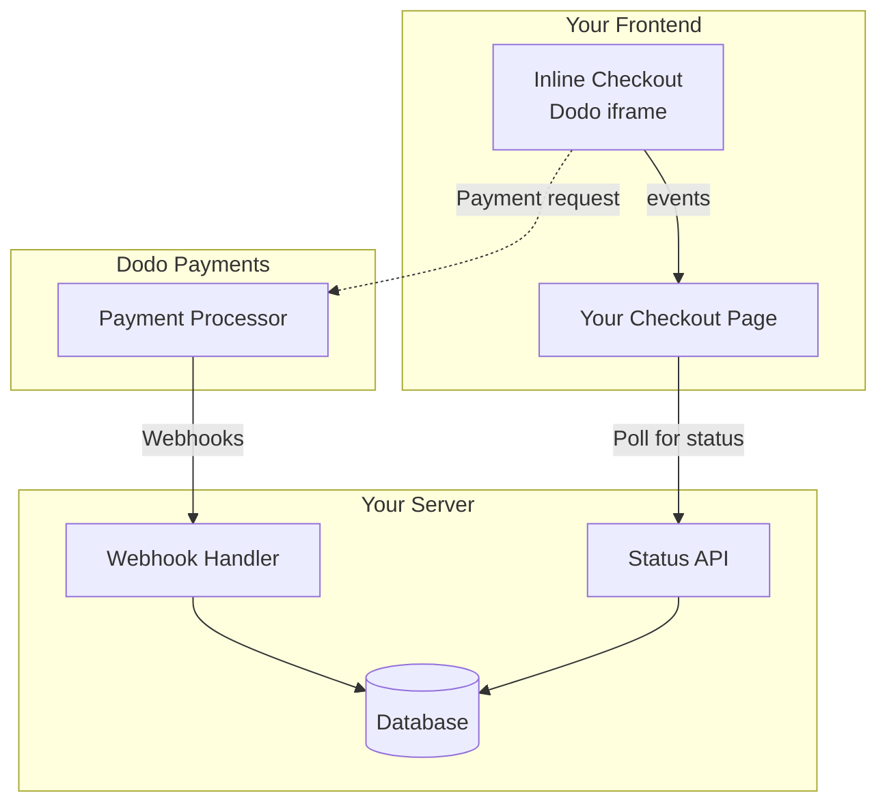

## Übersicht

Der Inline-Checkout ermöglicht es Ihnen, vollständig integrierte Checkout-Erlebnisse zu schaffen, die nahtlos mit Ihrer Website oder Anwendung verschmelzen. Im Gegensatz zum [Overlay-Checkout](/developer-resources/overlay-checkout), der als Modal über Ihrer Seite geöffnet wird, bettet der Inline-Checkout das Zahlungsformular direkt in Ihr Seitenlayout ein.

Mit dem Inline-Checkout können Sie:

- Checkout-Erlebnisse erstellen, die vollständig in Ihre App oder Website integriert sind
- Dodo Payments sicher die Kunden- und Zahlungsinformationen in einem optimierten Checkout-Rahmen erfassen lassen
- Artikel, Gesamtsummen und andere Informationen von Dodo Payments auf Ihrer Seite anzeigen
- SDK-Methoden und -Ereignisse verwenden, um fortschrittliche Checkout-Erlebnisse zu erstellen

<Frame>
    
</Frame>

## Funktionsweise

Der Inline-Checkout funktioniert, indem ein sicherer Dodo Payments-Rahmen in Ihre Website oder App eingebettet wird.

Der Checkout-Rahmen kümmert sich um das Sammeln von Kundeninformationen und das Erfassen von Zahlungsdetails. Ihre Seite zeigt die Artikelliste, Gesamtsummen und Optionen zum Ändern der Checkout-Inhalte an. Das SDK ermöglicht es Ihrer Seite und dem Checkout-Rahmen, miteinander zu interagieren.

Dodo Payments erstellt automatisch ein Abonnement, wenn ein Checkout abgeschlossen ist, bereit für Sie zur Bereitstellung.

<Note>
Der Inline-Checkout-Rahmen verarbeitet sicher alle sensiblen Zahlungsinformationen und gewährleistet die PCI-Konformität, ohne dass zusätzliche Zertifizierungen Ihrerseits erforderlich sind.
</Note>

## Was macht einen guten Inline-Checkout aus?

Es ist wichtig, dass die Kunden wissen, von wem sie kaufen, was sie kaufen und wie viel sie bezahlen.

Um einen Inline-Checkout zu erstellen, der konform und optimiert für Konversionen ist, muss Ihre Implementierung Folgendes enthalten:

<Frame caption="Beispiel für ein Inline-Checkout-Layout mit erforderlichen Elementen">
    
</Frame>

1. **Wiederkehrende Informationen**: Wenn es sich um wiederkehrende Zahlungen handelt, wie oft sie wiederkehren und der Gesamtbetrag bei der Erneuerung. Wenn es sich um eine Testversion handelt, wie lange die Testversion dauert.
2. **Artikelbeschreibungen**: Eine Beschreibung dessen, was gekauft wird.
3. **Transaktionssummen**: Transaktionssummen, einschließlich Zwischensumme, Gesamtsteuer und Gesamtsumme. Stellen Sie sicher, dass auch die Währung angegeben ist.
4. **Dodo Payments-Fußzeile**: Der vollständige Inline-Checkout-Rahmen, einschließlich der Checkout-Fußzeile, die Informationen über Dodo Payments, unsere Verkaufsbedingungen und unsere Datenschutzrichtlinie enthält.
5. **Rückerstattungsrichtlinie**: Ein Link zu Ihrer Rückerstattungsrichtlinie, falls diese von der Standard-Rückerstattungsrichtlinie von Dodo Payments abweicht.

<Warning>
Zeigen Sie immer den vollständigen Inline-Checkout-Rahmen, einschließlich der Fußzeile, an. Das Entfernen oder Verstecken von rechtlichen Informationen verstößt gegen die Compliance-Anforderungen.
</Warning>

## Kundenreise

Der Checkout-Fluss wird durch Ihre Konfiguration der Checkout-Sitzung bestimmt. Je nachdem, wie Sie die Checkout-Sitzung konfigurieren, erleben die Kunden einen Checkout, der möglicherweise alle Informationen auf einer einzigen Seite oder über mehrere Schritte hinweg präsentiert.

<Steps>
<Step title="Kunde öffnet den Checkout">

Sie können den Inline-Checkout öffnen, indem Sie Artikel oder eine vorhandene Transaktion übergeben. Verwenden Sie das SDK, um Informationen auf der Seite anzuzeigen und zu aktualisieren, und SDK-Methoden, um Artikel basierend auf der Interaktion des Kunden zu aktualisieren.
    

</Step>

<Step title="Kunde gibt seine Daten ein">

Der Inline-Checkout fordert die Kunden zunächst auf, ihre E-Mail-Adresse einzugeben, ihr Land auszuwählen und (wo erforderlich) ihre PLZ oder Postleitzahl einzugeben. Dieser Schritt sammelt alle notwendigen Informationen, um Steuern und verfügbare Zahlungsmethoden zu bestimmen.

Sie können die Kundendaten vorab ausfüllen und gespeicherte Adressen anzeigen, um das Erlebnis zu optimieren.

</Step>

<Step title="Kunde wählt Zahlungsmethode">

Nachdem sie ihre Daten eingegeben haben, werden den Kunden verfügbare Zahlungsmethoden und das Zahlungsformular angezeigt. Die Optionen können Kredit- oder Debitkarte, PayPal, Apple Pay, Google Pay und andere lokale Zahlungsmethoden basierend auf ihrem Standort umfassen.

Zeigen Sie gespeicherte Zahlungsmethoden an, wenn verfügbar, um den Checkout zu beschleunigen.


</Step>

<Step title="Checkout abgeschlossen">

Dodo Payments leitet jede Zahlung an den besten Acquirer für diesen Verkauf weiter, um die bestmögliche Erfolgsquote zu erzielen. Die Kunden gelangen in einen Erfolgsworkflow, den Sie erstellen können.


</Step>

<Step title="Dodo Payments erstellt Abonnement">

Dodo Payments erstellt automatisch ein Abonnement für den Kunden, bereit für Sie zur Bereitstellung. Die Zahlungsmethode, die der Kunde verwendet hat, wird für Erneuerungen oder Änderungen des Abonnements gespeichert.


</Step>
</Steps>

## Schnellstart

Starten Sie mit dem Dodo Payments Inline Checkout in nur wenigen Zeilen Code:

```typescript
import { DodoPayments } from "dodopayments-checkout";

// Initialize the SDK for inline mode
DodoPayments.Initialize({
  mode: "test",
  displayType: "inline",
  onEvent: (event) => {
    console.log("Checkout event:", event);
  },
});

// Open checkout in a specific container
DodoPayments.Checkout.open({
  checkoutUrl: "https://test.dodopayments.com/session/cks_123",
  elementId: "dodo-inline-checkout" // ID of the container element
});
```

<Tip>
Stellen Sie sicher, dass Sie ein Container-Element mit dem entsprechenden `id` auf Ihrer Seite haben: `<div id="dodo-inline-checkout"></div>`.
</Tip>

## Schritt-für-Schritt-Integrationsanleitung

<Steps>
<Step title="Installieren Sie das SDK">

Installieren Sie das Dodo Payments Checkout SDK:

<CodeGroup>

```bash npm
npm install dodopayments-checkout
```

```bash yarn
yarn add dodopayments-checkout
```

```bash pnpm
pnpm add dodopayments-checkout
```

</CodeGroup>

</Step>

<Step title="SDK für Inline-Anzeige initialisieren">

Initialisieren Sie das SDK und geben Sie `displayType: 'inline'` an. Sie sollten auch auf das `checkout.breakdown` Ereignis hören, um Ihre UI mit Echtzeit-Steuern und Gesamtrechnungen zu aktualisieren.

```typescript
import { DodoPayments } from "dodopayments-checkout";

DodoPayments.Initialize({
  mode: "test",
  displayType: "inline",
  onEvent: (event) => {
    if (event.event_type === "checkout.breakdown") {
      const breakdown = event.data?.message;
      // Update your UI with breakdown.subTotal, breakdown.tax, breakdown.total, etc.
    }
  },
});
```

</Step>

<Step title="Erstellen Sie ein Container-Element">

Fügen Sie ein Element zu Ihrem HTML hinzu, in das der Checkout-Rahmen eingefügt wird:

```html
<div id="dodo-inline-checkout"></div>
```

</Step>

<Step title="Öffnen Sie den Checkout">

Rufen Sie `DodoPayments.Checkout.open()` mit dem `checkoutUrl` und dem `elementId` Ihres Containers auf:

```typescript
DodoPayments.Checkout.open({
  checkoutUrl: "https://test.dodopayments.com/session/cks_123",
  elementId: "dodo-inline-checkout"
});
```

</Step>

<Step title="Testen Sie Ihre Integration">

1. Starten Sie Ihren Entwicklungsserver:

```bash
npm run dev
```

2. Testen Sie den Checkout-Fluss:
   - Geben Sie Ihre E-Mail- und Adressdaten im Inline-Rahmen ein.
   - Überprüfen Sie, ob Ihre benutzerdefinierte Bestellübersicht in Echtzeit aktualisiert wird.
   - Testen Sie den Zahlungsfluss mit Testanmeldeinformationen.
   - Bestätigen Sie, dass die Weiterleitungen korrekt funktionieren.

<Check>
Sie sollten `checkout.breakdown` Ereignisse in Ihrer Browser-Konsole protokolliert sehen, wenn Sie ein Konsolenprotokoll im `onEvent` Callback hinzugefügt haben.
</Check>

</Step>

<Step title="Live gehen">

Wenn Sie bereit für die Produktion sind:

1. Ändern Sie den Modus zu `'live'`:

```typescript
DodoPayments.Initialize({
  mode: "live",
  displayType: "inline",
  onEvent: (event) => {
    // Handle events
  }
});
```

2. Aktualisieren Sie Ihre Checkout-URLs, um Live-Checkout-Sitzungen von Ihrem Backend zu verwenden.
3. Testen Sie den gesamten Fluss in der Produktion.

</Step>
</Steps>

## Vollständiges React-Beispiel

Dieses Beispiel zeigt, wie man eine benutzerdefinierte Bestellübersicht neben dem Inline-Checkout implementiert, um sie mithilfe des `checkout.breakdown` Ereignisses synchron zu halten.

```tsx
"use client";

import { useEffect, useState } from 'react';
import { DodoPayments, CheckoutBreakdownData } from 'dodopayments-checkout';

export default function CheckoutPage() {
  const [breakdown, setBreakdown] = useState<Partial<CheckoutBreakdownData>>({});

  useEffect(() => {
    // 1. Initialize the SDK
    DodoPayments.Initialize({
      mode: 'test',
      displayType: 'inline',
      onEvent: (event) => {
        // 2. Listen for the 'checkout.breakdown' event
        if (event.event_type === "checkout.breakdown") {
          const message = event.data?.message as CheckoutBreakdownData;
          if (message) setBreakdown(message);
        }
      }
    });

    // 3. Open the checkout in the specified container
    DodoPayments.Checkout.open({
      checkoutUrl: 'https://test.dodopayments.com/session/cks_123',
      elementId: 'dodo-inline-checkout'
    });

    return () => DodoPayments.Checkout.close();
  }, []);

  const format = (amt: number | null | undefined, curr: string | null | undefined) => 
    amt != null && curr ? `${curr} ${(amt/100).toFixed(2)}` : '0.00';

  const currency = breakdown.currency ?? breakdown.finalTotalCurrency ?? '';

  return (
    <div className="flex flex-col md:flex-row min-h-screen">
      {/* Left Side - Checkout Form */}
      <div className="w-full md:w-1/2 flex items-center">
        <div id="dodo-inline-checkout" className='w-full' />
      </div>

      {/* Right Side - Custom Order Summary */}
      <div className="w-full md:w-1/2 p-8 bg-gray-50">
        <h2 className="text-2xl font-bold mb-4">Order Summary</h2>
        <div className="space-y-2">
          {breakdown.subTotal && (
            <div className="flex justify-between">
              <span>Subtotal</span>
              <span>{format(breakdown.subTotal, currency)}</span>
            </div>
          )}
          {breakdown.discount && (
            <div className="flex justify-between">
              <span>Discount</span>
              <span>{format(breakdown.discount, currency)}</span>
            </div>
          )}
          {breakdown.tax != null && (
            <div className="flex justify-between">
              <span>Tax</span>
              <span>{format(breakdown.tax, currency)}</span>
            </div>
          )}
          <hr />
          {(breakdown.finalTotal ?? breakdown.total) && (
            <div className="flex justify-between font-bold text-xl">
              <span>Total</span>
              <span>{format(breakdown.finalTotal ?? breakdown.total, breakdown.finalTotalCurrency ?? currency)}</span>
            </div>
          )}
        </div>
      </div>
    </div>
  );
}

```

## API-Referenz

### Konfiguration

#### Initialisierungsoptionen

```typescript
interface InitializeOptions {
  mode: "test" | "live";
  displayType: "inline"; // Required for inline checkout
  onEvent: (event: CheckoutEvent) => void;
}
```

| Option | Typ | Erforderlich | Beschreibung |
|--------|------|----------|-------------|
| `mode` | `"test" \| "live"` | Ja | Umgebungsmodus. |
| `displayType` | `"inline" \| "overlay"` | Ja | Muss auf `"inline"` gesetzt werden, um den Checkout einzubetten. |
| `onEvent` | `function` | Ja | Callback-Funktion zur Verarbeitung von Checkout-Ereignissen. |

#### Checkout-Optionen

```typescript
export type FontSize = "xs" | "sm" | "md" | "lg" | "xl" | "2xl";
export type FontWeight = "normal" | "medium" | "bold" | "extraBold";

interface CheckoutOptions {
  checkoutUrl: string;
  elementId: string; // Required for inline checkout
  options?: {
    showTimer?: boolean;
    showSecurityBadge?: boolean;
    manualRedirect?: boolean;
    themeConfig?: ThemeConfig;
    payButtonText?: string;
    fontSize?: FontSize;
    fontWeight?: FontWeight;
  };
}
```

| Option | Typ | Erforderlich | Beschreibung |
|--------|------|----------|-------------|
| `checkoutUrl` | `string` | Ja | Checkout-Sitzungs-URL. |
| `elementId` | `string` | Ja | Das `id` des DOM-Elements, in dem der Checkout gerendert werden soll. |
| `options.showTimer` | `boolean` | Nein | Zeigen oder verbergen Sie den Checkout-Timer. Standardmäßig auf `true`. Wenn deaktiviert, erhalten Sie das `checkout.link_expired` Ereignis, wenn die Sitzung abläuft. |
| `options.showSecurityBadge` | `boolean` | Nein | Zeigen oder verbergen Sie das Sicherheitsabzeichen. Standardmäßig auf `true`. |
| `options.manualRedirect` | `boolean` | Nein | Wenn aktiviert, wird der Checkout nach Abschluss nicht automatisch umgeleitet. Stattdessen erhalten Sie `checkout.status` und `checkout.redirect_requested` Ereignisse, um die Umleitung selbst zu handhaben. |
| `options.themeConfig` | `ThemeConfig` | Nein | Benutzerdefinierte Themenkonfiguration. |
| `options.payButtonText` | `string` | Nein | Benutzerdefinierter Text, der auf der Schaltfläche „Zahlen“ angezeigt wird. |
| `options.fontSize` | `FontSize` | Nein | Globale Schriftgröße für den Checkout. |
| `options.fontWeight` | `FontWeight` | Nein | Globale Schriftstärke für den Checkout. |

### Methoden

#### Checkout öffnen

Öffnet den Checkout-Rahmen im angegebenen Container.

```typescript
DodoPayments.Checkout.open({
  checkoutUrl: "https://test.dodopayments.com/session/cks_123",
  elementId: "dodo-inline-checkout"
});
```

Sie können auch zusätzliche Optionen übergeben, um das Checkout-Verhalten anzupassen:

```typescript
DodoPayments.Checkout.open({
  checkoutUrl: "https://test.dodopayments.com/session/cks_123",
  elementId: "dodo-inline-checkout",
  options: {
    showTimer: false,
    showSecurityBadge: false,
    manualRedirect: true,
    payButtonText: "Pay Now",
  },
});
```

Wenn Sie `manualRedirect` verwenden, behandeln Sie den Abschluss des Checkouts in Ihrem `onEvent` Callback:

```typescript
DodoPayments.Initialize({
  mode: "test",
  displayType: "inline",
  onEvent: (event) => {
    if (event.event_type === "checkout.status") {
      const status = event.data?.message?.status;
      // Handle status: "succeeded", "failed", or "processing"
    }
    if (event.event_type === "checkout.redirect_requested") {
      const redirectUrl = event.data?.message?.redirect_to;
      // Redirect the customer manually
      window.location.href = redirectUrl;
    }
    if (event.event_type === "checkout.link_expired") {
      // Handle expired checkout session
    }
  },
});
```

#### Checkout schließen

Entfernt programmgesteuert den Checkout-Rahmen und bereinigt die Ereignis-Listener.

```typescript
DodoPayments.Checkout.close();
```

#### Status überprüfen

Gibt zurück, ob der Checkout-Rahmen derzeit injiziert ist.

```typescript
const isOpen = DodoPayments.Checkout.isOpen();
// Returns: boolean
```

### Ereignisse

Das SDK bietet Echtzeitereignisse über den `onEvent` Callback. Für den Inline-Checkout ist `checkout.breakdown` besonders nützlich, um Ihre UI zu synchronisieren.

| Ereignistyp | Beschreibung |
|------------|-------------|
| `checkout.opened` | Checkout-Frame wurde geladen. |
| `checkout.breakdown` | Wird ausgelöst, wenn Preise, Steuern oder Rabatte aktualisiert werden. |
| `checkout.customer_details_submitted` | Kundendaten wurden übermittelt. |
| `checkout.pay_button_clicked` | Wird ausgelöst, wenn der Kunde auf die Schaltfläche „Zahlen“ klickt. Nützlich für Analysen und zur Verfolgung von Conversion-Trichtern. |
| `checkout.redirect` | Checkout wird eine Umleitung durchführen (z. B. zu einer Bankseite). |
| `checkout.error` | Ein Fehler ist während des Checkouts aufgetreten. |
| `checkout.link_expired` | Wird ausgelöst, wenn die Checkout-Sitzung abläuft. Wird nur empfangen, wenn `showTimer` auf `false` gesetzt ist. |
| `checkout.status` | Wird ausgelöst, wenn `manualRedirect` aktiviert ist. Enthält den Checkout-Status (`succeeded`, `failed` oder `processing`). |
| `checkout.redirect_requested` | Wird ausgelöst, wenn `manualRedirect` aktiviert ist. Enthält die URL, zu der der Kunde umgeleitet werden soll. |

#### Checkout-Daten zur Aufschlüsselung

Das `checkout.breakdown` Ereignis liefert die folgenden Daten:

```typescript
interface CheckoutBreakdownData {
  subTotal?: number;          // Amount in cents
  discount?: number;         // Amount in cents
  tax?: number;              // Amount in cents
  total?: number;            // Amount in cents
  currency?: string;         // e.g., "USD"
  finalTotal?: number;       // Final amount including adjustments
  finalTotalCurrency?: string; // Currency for the final total
}
```

#### Checkout-Status-Ereignisdaten

Wenn `manualRedirect` aktiviert ist, erhalten Sie das `checkout.status` Ereignis mit den folgenden Daten:

```typescript
interface CheckoutStatusEventData {
  message: {
    status?: "succeeded" | "failed" | "processing";
  };
}
```

#### Checkout-Umleitungsanforderungs-Ereignisdaten

Wenn `manualRedirect` aktiviert ist, erhalten Sie das `checkout.redirect_requested` Ereignis mit den folgenden Daten:

```typescript
interface CheckoutRedirectRequestedEventData {
  message: {
    redirect_to?: string;
  };
}
```

#### Verständnis des Aufschlüsselungsereignisses

Das `checkout.breakdown` Ereignis ist der primäre Weg, um die UI Ihrer Anwendung mit dem Checkout-Zustand von Dodo Payments synchron zu halten.

**Wann es ausgelöst wird:**
- **Bei der Initialisierung**: Sofort nachdem der Checkout-Rahmen geladen und bereit ist.
- **Bei Adressänderung**: Immer wenn der Kunde ein Land auswählt oder eine Postleitzahl eingibt, die zu einer Steuerneuberechnung führt.

**Feld Details:**

| Feld | Beschreibung |
|-------|-------------|
| `subTotal` | Die Summe aller Positionen in der Sitzung, bevor Rabatte oder Steuern angewendet werden. |
| `discount` | Der Gesamtwert aller angewendeten Rabatte. |
| `tax` | Der berechnete Steuerbetrag. Im `inline` Modus wird dies dynamisch aktualisiert, während der Benutzer mit den Adressfeldern interagiert. |
| `total` | Das mathematische Ergebnis von `subTotal - discount + tax` in der Basiswährung der Sitzung. |
| `currency` | Der ISO-Währungs-Code (z. B. `"USD"`) für die Standard-Zwischensumme, Rabatte und Steuerwerte. |
| `finalTotal` | Der tatsächliche Betrag, den der Kunde berechnet wird. Dies kann zusätzliche Anpassungen für den Devisenwechsel oder lokale Zahlungsmethoden enthalten, die nicht Teil der grundlegenden Preisaufstellung sind. |
| `finalTotalCurrency` | Die Währung, in der der Kunde tatsächlich bezahlt. Dies kann von `currency` abweichen, wenn Kaufkraftparität oder lokale Währungsumrechnung aktiv ist. |

**Wichtige Integrationstipps:**

1.  **Währungsformatierung**: Preise werden immer als Ganzzahlen in der kleinsten Währungseinheit (z. B. Cent für USD, Yen für JPY) zurückgegeben. Um sie anzuzeigen, teilen Sie durch 100 (oder die entsprechende Zehnerpotenz) oder verwenden Sie eine Formatierungsbibliothek wie `Intl.NumberFormat`.
2.  **Verarbeitung von Anfangszuständen**: Wenn der Checkout zum ersten Mal geladen wird, können `tax` und `discount` entweder `0` oder `null` sein, bis der Benutzer seine Rechnungsinformationen bereitstellt oder einen Code anwendet. Ihre UI sollte diese Zustände elegant handhaben (z. B. durch Anzeigen eines Strichs `—` oder durch Ausblenden der Zeile).
3.  **Der "Endbetrag" vs "Gesamt"**: Während `total` Ihnen die Standardpreisberechnung gibt, ist `finalTotal` die Quelle der Wahrheit für die Transaktion. Wenn `finalTotal` vorhanden ist, spiegelt es genau wider, was der Karte des Kunden berechnet wird, einschließlich aller dynamischen Anpassungen.
4.  **Echtzeit-Feedback**: Verwenden Sie das `tax` Feld, um den Benutzern zu zeigen, dass Steuern in Echtzeit berechnet werden. Dies verleiht Ihrer Checkout-Seite ein "live" Gefühl und reduziert die Reibung während des Schrittes zur Eingabe der Adresse.

## Implementierungsoptionen

### Installation über Paketmanager

Installieren Sie über npm, yarn oder pnpm wie im [Schritt-für-Schritt-Integrationsleitfaden](#step-by-step-integration-guide) gezeigt.

### CDN-Implementierung

Für eine schnelle Integration ohne Build-Schritt können Sie unser CDN verwenden:

```html
<!DOCTYPE html>
<html lang="en">
<head>
    <meta charset="UTF-8">
    <meta name="viewport" content="width=device-width, initial-scale=1.0">
    <title>Dodo Payments Inline Checkout</title>
    
    <!-- Load DodoPayments -->
    <script src="https://cdn.jsdelivr.net/npm/dodopayments-checkout@latest/dist/index.js"></script>
    <script>
        // Initialize the SDK
        DodoPaymentsCheckout.DodoPayments.Initialize({
            mode: "test",
            displayType: "inline",
            onEvent: (event) => {
                console.log('Checkout event:', event);
            }
        });
    </script>
</head>
<body>
    <div id="dodo-inline-checkout"></div>

    <script>
        // Open the checkout
        DodoPaymentsCheckout.DodoPayments.Checkout.open({
            checkoutUrl: "https://test.dodopayments.com/session/cks_123",
            elementId: "dodo-inline-checkout"
        });
    </script>
</body>
</html>
```

### Theme-Anpassung

Sie können das Erscheinungsbild des Checkouts anpassen, indem Sie ein `themeConfig` Objekt im `options` Parameter beim Öffnen des Checkouts übergeben. Die Themenkonfiguration unterstützt sowohl helle als auch dunkle Modi, sodass Sie Farben, Ränder, Texte, Schaltflächen und den Randradius anpassen können.

#### Grundlegende Themenkonfiguration

```typescript
DodoPayments.Checkout.open({
  checkoutUrl: "https://checkout.dodopayments.com/session/cks_123",
  options: {
    themeConfig: {
      light: {
        bgPrimary: "#FFFFFF",
        textPrimary: "#344054",
        buttonPrimary: "#A6E500",
      },
      dark: {
        bgPrimary: "#0D0D0D",
        textPrimary: "#FFFFFF",
        buttonPrimary: "#A6E500",
      },
      radius: "8px",
    },
  },
});
```

#### Vollständige Themenkonfiguration

Alle verfügbaren Themenattribute:

```typescript
DodoPayments.Checkout.open({
  checkoutUrl: "https://checkout.dodopayments.com/session/cks_123",
  options: {
    themeConfig: {
      light: {
        // Background colors
        bgPrimary: "#FFFFFF",        // Primary background color
        bgSecondary: "#F9FAFB",      // Secondary background color (e.g., tabs)
        
        // Border colors
        borderPrimary: "#D0D5DD",     // Primary border color
        borderSecondary: "#6B7280",  // Secondary border color
        inputFocusBorder: "#D0D5DD", // Input focus border color
        
        // Text colors
        textPrimary: "#344054",       // Primary text color
        textSecondary: "#6B7280",    // Secondary text color
        textPlaceholder: "#667085",  // Placeholder text color
        textError: "#D92D20",        // Error text color
        textSuccess: "#10B981",      // Success text color
        
        // Button colors
        buttonPrimary: "#A6E500",           // Primary button background
        buttonPrimaryHover: "#8CC500",      // Primary button hover state
        buttonTextPrimary: "#0D0D0D",       // Primary button text color
        buttonSecondary: "#F3F4F6",         // Secondary button background
        buttonSecondaryHover: "#E5E7EB",     // Secondary button hover state
        buttonTextSecondary: "#344054",     // Secondary button text color
      },
      dark: {
        // Background colors
        bgPrimary: "#0D0D0D",
        bgSecondary: "#1A1A1A",
        
        // Border colors
        borderPrimary: "#323232",
        borderSecondary: "#D1D5DB",
        inputFocusBorder: "#323232",
        
        // Text colors
        textPrimary: "#FFFFFF",
        textSecondary: "#909090",
        textPlaceholder: "#9CA3AF",
        textError: "#F97066",
        textSuccess: "#34D399",
        
        // Button colors
        buttonPrimary: "#A6E500",
        buttonPrimaryHover: "#8CC500",
        buttonTextPrimary: "#0D0D0D",
        buttonSecondary: "#2A2A2A",
        buttonSecondaryHover: "#3A3A3A",
        buttonTextSecondary: "#FFFFFF",
      },
      radius: "8px", // Border radius for inputs, buttons, and tabs
    },
  },
});
```

#### Nur im Lichtmodus

Wenn Sie nur das helle Thema anpassen möchten:

```typescript
DodoPayments.Checkout.open({
  checkoutUrl: "https://checkout.dodopayments.com/session/cks_123",
  options: {
    themeConfig: {
      light: {
        bgPrimary: "#FFFFFF",
        textPrimary: "#000000",
        buttonPrimary: "#0070F3",
      },
      radius: "12px",
    },
  },
});
```

#### Nur im Dunkelmodus

Wenn Sie nur das dunkle Thema anpassen möchten:

```typescript
DodoPayments.Checkout.open({
  checkoutUrl: "https://checkout.dodopayments.com/session/cks_123",
  options: {
    themeConfig: {
      dark: {
        bgPrimary: "#000000",
        textPrimary: "#FFFFFF",
        buttonPrimary: "#0070F3",
      },
      radius: "12px",
    },
  },
});
```

#### Teilweise Themenüberschreibung

Sie können nur bestimmte Eigenschaften überschreiben. Der Checkout verwendet Standardwerte für Eigenschaften, die Sie nicht angeben:

```typescript
DodoPayments.Checkout.open({
  checkoutUrl: "https://checkout.dodopayments.com/session/cks_123",
  options: {
    themeConfig: {
      light: {
        buttonPrimary: "#FF6B6B", // Only override primary button color
      },
      radius: "16px", // Override border radius
    },
  },
});
```

#### Themenkonfiguration mit anderen Optionen

Sie können die Themenkonfiguration mit anderen Checkout-Optionen kombinieren:

```typescript
DodoPayments.Checkout.open({
  checkoutUrl: "https://checkout.dodopayments.com/session/cks_123",
  options: {
    showTimer: true,
    showSecurityBadge: true,
    manualRedirect: false,
    themeConfig: {
      light: {
        bgPrimary: "#FFFFFF",
        buttonPrimary: "#A6E500",
      },
      dark: {
        bgPrimary: "#0D0D0D",
        buttonPrimary: "#A6E500",
      },
      radius: "8px",
    },
  },
});
```

#### TypeScript-Typen

Für TypeScript-Nutzer sind alle Typen der Themenkonfiguration exportiert:

```typescript
import { ThemeConfig, ThemeModeConfig } from "dodopayments-checkout";

const themeConfig: ThemeConfig = {
  light: {
    bgPrimary: "#FFFFFF",
    // ... other properties
  },
  dark: {
    bgPrimary: "#0D0D0D",
    // ... other properties
  },
  radius: "8px",
};
```

## Fehlerbehandlung

Das SDK bietet detaillierte Fehlermeldungen über das Ereignissystem. Implementieren Sie immer eine ordnungsgemäße Fehlerbehandlung in Ihrem `onEvent` Callback:

```typescript
DodoPayments.Initialize({
  mode: "test",
  displayType: "inline",
  onEvent: (event: CheckoutEvent) => {
    if (event.event_type === "checkout.error") {
      console.error("Checkout error:", event.data?.message);
      // Handle error appropriately
    }
  }
});
```

<Warning>
Behandeln Sie immer das `checkout.error` Ereignis, um eine gute Benutzererfahrung zu gewährleisten, wenn Probleme auftreten.
</Warning>

## Best Practices

1. **Responsive Design**: Stellen Sie sicher, dass Ihr Container-Element genügend Breite und Höhe hat. Das iframe wird typischerweise erweitert, um seinen Container auszufüllen.
2. **Synchronisation**: Verwenden Sie das `checkout.breakdown` Ereignis, um Ihre benutzerdefinierte Bestellübersicht oder Preistabellen mit dem, was der Benutzer im Checkout-Frame sieht, synchron zu halten.
3. **Skeleton States**: Zeigen Sie einen Ladeindikator in Ihrem Container an, bis das `checkout.opened` Ereignis ausgelöst wird.
4. **Cleanup**: Rufen Sie `DodoPayments.Checkout.close()` auf, wenn Ihre Komponente unmontiert wird, um das iframe und die Ereignis-Listener zu bereinigen.

<Info>
Für Implementierungen im Dunkelmodus wird empfohlen, `#0d0d0d` als Hintergrundfarbe für eine optimale visuelle Integration mit dem Inline-Checkout-Frame zu verwenden.
</Info>

## Zahlungsstatusvalidierung

<Warning>
Verlassen Sie sich nicht ausschließlich auf Inline-Checkout-Ereignisse, um den Zahlungserfolg oder -fehler zu bestimmen. Implementieren Sie immer eine serverseitige Validierung mithilfe von Webhooks und/oder Polling.
</Warning>

### Warum serverseitige Validierung wichtig ist

Während Inline-Checkout-Ereignisse wie `checkout.status` Echtzeit-Feedback bieten, sollten sie **nicht** Ihre einzige Quelle der Wahrheit für den Zahlungsstatus sein. Netzwerkprobleme, Browserabstürze oder Benutzer, die die Seite schließen, können dazu führen, dass Ereignisse verpasst werden. Um eine zuverlässige Zahlungsvalidierung sicherzustellen:

1. **Ihr Server sollte auf Webhook-Ereignisse hören** - Dodo Payments sendet Webhooks für Änderungen des Zahlungsstatus.
2. **Implementieren Sie einen Polling-Mechanismus** - Ihr Frontend sollte Ihren Server nach Statusaktualisierungen abfragen.
3. **Kombinieren Sie beide Ansätze** - Verwenden Sie Webhooks als primäre Quelle und Polling als Fallback.

### Empfohlene Architektur



### Implementierungsschritte

**1. Hören Sie auf Checkout-Ereignisse** - Wenn der Benutzer auf „Zahlen“ klickt, beginnen Sie mit der Vorbereitung zur Überprüfung des Status:

```typescript
onEvent: (event) => {
  if (event.event_type === 'checkout.status') {
    // Start polling your server for confirmed status
    startPolling();
  }
}
```

**2. Pollen Sie Ihren Server** - Erstellen Sie einen Endpunkt, der Ihre Datenbank nach dem Zahlungsstatus überprüft (aktualisiert durch Webhooks):

```typescript
// Poll every 2 seconds until status is confirmed
const interval = setInterval(async () => {
  const { status } = await fetch(`/api/payments/${paymentId}/status`).then(r => r.json());
  if (status === 'succeeded' || status === 'failed') {
    clearInterval(interval);
    handlePaymentResult(status);
  }
}, 2000);
```

**3. Behandeln Sie Webhooks serverseitig** - Aktualisieren Sie Ihre Datenbank, wenn Dodo `payment.succeeded` oder `payment.failed` Webhooks sendet. Siehe unsere [Webhook-Dokumentation](/developer-resources/webhooks) für Details.

### Behandlung von Umleitungen (3DS, Google Pay, UPI)

Bei der Verwendung von `manualRedirect: true` erfordern bestimmte Zahlungsmethoden, dass der Benutzer von Ihrer Seite zur Authentifizierung umgeleitet wird:

- **3D Secure (3DS)** - Kartenauthentifizierung
- **Google Pay** - Wallet-Authentifizierung in einigen Abläufen
- **UPI** - Indische Zahlungsmethode Umleitungen

Wenn eine Umleitung erforderlich ist, erhalten Sie das `checkout.redirect_requested` Ereignis. Leiten Sie den Benutzer zur bereitgestellten URL um:

```typescript
if (event.event_type === 'checkout.redirect_requested') {
  const redirectUrl = event.data?.message?.redirect_to;
  // Save payment ID before redirect, then redirect
  sessionStorage.setItem('pendingPaymentId', paymentId);
  window.location.href = redirectUrl;
}
```

Nach Abschluss der Authentifizierung (Erfolg oder Misserfolg) kehrt der Benutzer zu Ihrer Seite zurück. **Gehen Sie nicht davon aus, dass der Erfolg nur, weil der Benutzer zurückgekehrt ist.** Stattdessen:

1. Überprüfen Sie, ob der Benutzer von einer Umleitung zurückkehrt (z. B. über `sessionStorage`)
2. Beginnen Sie mit dem Polling Ihres Servers nach dem bestätigten Zahlungsstatus
3. Zeigen Sie einen "Zahlung wird überprüft..." Zustand während des Pollings an
4. Stellen Sie die UI für Erfolg/Misserfolg basierend auf dem serverbestätigten Status dar

<Tip>
Überprüfen Sie immer den Zahlungsstatus serverseitig nach Umleitungen. Die Rückkehr des Benutzers zu Ihrer Seite bedeutet nur, dass die Authentifizierung abgeschlossen ist – es zeigt nicht an, ob die Zahlung erfolgreich oder fehlgeschlagen ist.
</Tip>

## Fehlersuche

<AccordionGroup>
<Accordion title="Checkout-Frame wird nicht angezeigt">
- Überprüfen Sie, ob `elementId` mit dem `id` eines `div` übereinstimmt, das tatsächlich im DOM vorhanden ist.
- Stellen Sie sicher, dass `displayType: 'inline'` an `Initialize` übergeben wurde.
- Überprüfen Sie, ob das `checkoutUrl` gültig ist.
</Accordion>

<Accordion title="Steuern werden in meiner UI nicht aktualisiert">
- Stellen Sie sicher, dass Sie auf das `checkout.breakdown` Ereignis hören.
- Steuern werden nur berechnet, nachdem der Benutzer ein gültiges Land und eine Postleitzahl im Checkout-Frame eingegeben hat.
</Accordion>
</AccordionGroup>

## Aktivierung von Apple Pay

Apple Pay ermöglicht es Kunden, Zahlungen schnell und sicher mit ihren gespeicherten Zahlungsmethoden abzuschließen. Wenn aktiviert, können Kunden das Apple Pay-Modul direkt aus dem Checkout-Overlay auf unterstützten Geräten starten.

<Info>
Apple Pay wird auf iOS 17+, iPadOS 17+ und Safari 17+ auf macOS unterstützt.
</Info>

Um Apple Pay für Ihre Domain in der Produktion zu aktivieren, folgen Sie diesen Schritten:

<Steps>
<Step title="Laden Sie die Apple Pay-Domain-Zuordnungsdatei herunter und laden Sie sie hoch">

Laden Sie die [Apple Pay-Domain-Zuordnungsdatei](http://checkout.dodopayments.com/.well-known/apple-developer-merchantid-domain-association) herunter.

Laden Sie die Datei auf Ihren Webserver unter `/.well-known/apple-developer-merchantid-domain-association` hoch. Wenn Ihre Website beispielsweise unter `example.com` verfügbar ist, stellen Sie die Datei unter `https://example.com/well-known/apple-developer-merchantid-domain-association` zur Verfügung.

</Step>

<Step title="Fordern Sie die Aktivierung von Apple Pay an">

E-Mail **support@dodopayments.com** mit den folgenden Informationen:

- Ihre Produktions-Domain-URL (z. B. `https://example.com`)
- Anfrage zur Aktivierung von Apple Pay für Ihre Domain

<Check>
Sie erhalten innerhalb von 1-2 Werktagen eine Bestätigung, sobald Apple Pay für Ihre Domain aktiviert wurde.
</Check>

</Step>

<Step title="Überprüfen Sie die Verfügbarkeit von Apple Pay">

Nach Erhalt der Bestätigung testen Sie Apple Pay in Ihrem Checkout:

1. Öffnen Sie Ihren Checkout auf einem unterstützten Gerät (iOS 17+, iPadOS 17+ oder Safari 17+ auf macOS)
2. Überprüfen Sie, ob die Apple Pay-Schaltfläche als Zahlungsoption angezeigt wird
3. Testen Sie den vollständigen Zahlungsablauf

</Step>
</Steps>

<Warning>
Apple Pay muss für Ihre Domain aktiviert sein, bevor es als Zahlungsoption in der Produktion angezeigt wird. Kontaktieren Sie den Support, bevor Sie live gehen, wenn Sie Apple Pay anbieten möchten.
</Warning>

## Browserunterstützung

Das Dodo Payments Checkout SDK unterstützt die folgenden Browser:

- Chrome (neueste)
- Firefox (neueste)
- Safari (neueste)
- Edge (neueste)
- IE11+

## Inline- vs. Overlay-Checkout

Wählen Sie den richtigen Checkout-Typ für Ihren Anwendungsfall:

| Funktion | Inline-Checkout | Overlay-Checkout |
|---------|-----------------|------------------|
| Integrationstiefe | Vollständig in die Seite eingebettet | Modal über der Seite |
| Layoutkontrolle | Volle Kontrolle | Eingeschränkt |
| Branding | Nahtlos | Getrennt von der Seite |
| Implementierungsaufwand | Höher | Niedriger |
| Am besten geeignet für | Benutzerdefinierte Checkout-Seiten, hochkonvertierende Abläufe | Schnelle Integration, bestehende Seiten |

<Tip>
Verwenden Sie **Inline-Checkout**, wenn Sie maximale Kontrolle über das Checkout-Erlebnis und nahtloses Branding wünschen. Verwenden Sie **Overlay-Checkout** für eine schnellere Integration mit minimalen Änderungen an Ihren bestehenden Seiten.
</Tip>

## Verwandte Ressourcen

<CardGroup cols={2}>
<Card title="Overlay-Checkout" icon="layer-group" href="/developer-resources/overlay-checkout">
    Verwenden Sie den Overlay-Checkout für eine schnelle modalbasierte Integration.
</Card>

<Card title="Checkout-Sessions-API" icon="code" href="/api-reference/checkout-sessions/create">
    Erstellen Sie Checkout-Sitzungen, um Ihre Checkout-Erlebnisse zu unterstützen.
</Card>

<Card title="Webhooks" icon="webhook" href="/developer-resources/webhooks">
    Verarbeiten Sie Zahlungsereignisse serverseitig mit Webhooks.
</Card>

<Card title="Integrationsleitfaden" icon="book" href="/developer-resources/integration-guide">
    Vollständiger Leitfaden zur Integration von Dodo Payments.
</Card>
</CardGroup>

Für weitere Hilfe besuchen Sie unsere [Discord-Community](https://discord.gg/bYqAp4ayYh) oder kontaktieren Sie unser Entwickler-Support-Team.
