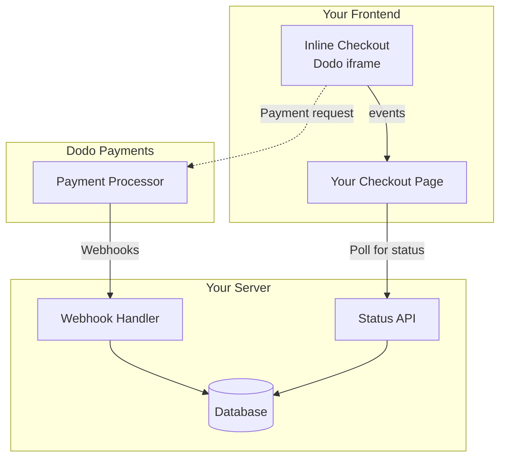

## Übersicht

Der Inline-Checkout ermöglicht es Ihnen, vollständig integrierte Checkout-Erlebnisse zu schaffen, die nahtlos mit Ihrer Website oder Anwendung verschmelzen. Im Gegensatz zum [Overlay-Checkout](/developer-resources/overlay-checkout), der als Modal über Ihrer Seite geöffnet wird, bettet der Inline-Checkout das Zahlungsformular direkt in Ihr Seitenlayout ein.

Mit dem Inline-Checkout können Sie:

- Checkout-Erlebnisse erstellen, die vollständig in Ihre App oder Website integriert sind
- Dodo Payments sicher die Kunden- und Zahlungsinformationen in einem optimierten Checkout-Rahmen erfassen lassen
- Artikel, Gesamtsummen und andere Informationen von Dodo Payments auf Ihrer Seite anzeigen
- SDK-Methoden und -Ereignisse verwenden, um fortschrittliche Checkout-Erlebnisse zu erstellen

<Frame>
    
</Frame>

## Funktionsweise

Der Inline-Checkout funktioniert, indem ein sicherer Dodo Payments-Rahmen in Ihre Website oder App eingebettet wird.

Der Checkout-Rahmen kümmert sich um das Sammeln von Kundeninformationen und das Erfassen von Zahlungsdetails. Ihre Seite zeigt die Artikelliste, Gesamtsummen und Optionen zum Ändern der Checkout-Inhalte an. Das SDK ermöglicht es Ihrer Seite und dem Checkout-Rahmen, miteinander zu interagieren.

Dodo Payments erstellt automatisch ein Abonnement, wenn ein Checkout abgeschlossen ist, bereit für Sie zur Bereitstellung.

<Note>
Der Inline-Checkout-Rahmen verarbeitet alle sensiblen Zahlungsinformationen sicher und gewährleistet die PCI-Konformität, ohne dass Sie zusätzliche Zertifizierungen durchführen müssen.
</Note>

## Was macht einen guten Inline-Checkout aus?

Es ist wichtig, dass die Kunden wissen, von wem sie kaufen, was sie kaufen und wie viel sie bezahlen.

Um einen Inline-Checkout zu erstellen, der konform und optimiert für Konversionen ist, muss Ihre Implementierung Folgendes enthalten:

{/* LOCKED_PATTERN_2c3203bfa100605bc2704d01e7dccd32 */}
    
</Frame>

1. **Wiederkehrende Informationen**: Wenn es sich um wiederkehrende Zahlungen handelt, wie oft sie wiederkehren und der Gesamtbetrag bei der Erneuerung. Wenn es sich um eine Testversion handelt, wie lange die Testversion dauert.
2. **Artikelbeschreibungen**: Eine Beschreibung dessen, was gekauft wird.
3. **Transaktionssummen**: Transaktionssummen, einschließlich Zwischensumme, Gesamtsteuer und Gesamtsumme. Stellen Sie sicher, dass auch die Währung angegeben ist.
4. **Dodo Payments-Fußzeile**: Der vollständige Inline-Checkout-Rahmen, einschließlich der Checkout-Fußzeile, die Informationen über Dodo Payments, unsere Verkaufsbedingungen und unsere Datenschutzrichtlinie enthält.
5. **Rückerstattungsrichtlinie**: Ein Link zu Ihrer Rückerstattungsrichtlinie, falls diese von der Standard-Rückerstattungsrichtlinie von Dodo Payments abweicht.

<Warning>
Zeigen Sie stets den gesamten Inline-Checkout-Rahmen einschließlich des Footers an. Das Entfernen oder Verstecken rechtlicher Informationen verstößt gegen Compliance-Anforderungen.
</Warning>

## Kundenreise

Der Checkout-Fluss wird durch Ihre Konfiguration der Checkout-Sitzung bestimmt. Je nachdem, wie Sie die Checkout-Sitzung konfigurieren, erleben die Kunden einen Checkout, der möglicherweise alle Informationen auf einer einzigen Seite oder über mehrere Schritte hinweg präsentiert.

<Steps>
{/* LOCKED_PATTERN_d5c5891a92fe908e4b310aff2fe906f3 */}

Sie können den Inline-Checkout öffnen, indem Sie Artikel oder eine vorhandene Transaktion übergeben. Verwenden Sie das SDK, um Informationen auf der Seite anzuzeigen und zu aktualisieren, und SDK-Methoden, um Artikel basierend auf der Interaktion des Kunden zu aktualisieren.
    

</Step>

{/* LOCKED_PATTERN_271a3373ec4ee2458dad7f9a80e26855 */}

Der Inline-Checkout fordert die Kunden zunächst auf, ihre E-Mail-Adresse einzugeben, ihr Land auszuwählen und (wo erforderlich) ihre PLZ oder Postleitzahl einzugeben. Dieser Schritt sammelt alle notwendigen Informationen, um Steuern und verfügbare Zahlungsmethoden zu bestimmen.

Sie können die Kundendaten vorab ausfüllen und gespeicherte Adressen anzeigen, um das Erlebnis zu optimieren.

</Step>

{/* LOCKED_PATTERN_1234bf83f7f396022f1c91c09356f654 */}

Nachdem sie ihre Daten eingegeben haben, werden den Kunden verfügbare Zahlungsmethoden und das Zahlungsformular angezeigt. Die Optionen können Kredit- oder Debitkarte, PayPal, Apple Pay, Google Pay und andere lokale Zahlungsmethoden basierend auf ihrem Standort umfassen.

Zeigen Sie gespeicherte Zahlungsmethoden an, wenn verfügbar, um den Checkout zu beschleunigen.


</Step>

{/* LOCKED_PATTERN_3250600b8fe70b0b1b5c169861bc3240 */}

Dodo Payments leitet jede Zahlung an den besten Acquirer für diesen Verkauf weiter, um die bestmögliche Erfolgsquote zu erzielen. Die Kunden gelangen in einen Erfolgsworkflow, den Sie erstellen können.


</Step>

{/* LOCKED_PATTERN_fe28b170edb53eebdbefd92e22425bda */}

Dodo Payments erstellt automatisch ein Abonnement für den Kunden, bereit für Sie zur Bereitstellung. Die Zahlungsmethode, die der Kunde verwendet hat, wird für Erneuerungen oder Änderungen des Abonnements gespeichert.


</Step>
</Steps>

## Schnellstart

Starten Sie mit dem Dodo Payments Inline Checkout in nur wenigen Zeilen Code:

```typescript
import { DodoPayments } from "dodopayments-checkout";

// Initialize the SDK for inline mode
DodoPayments.Initialize({
  mode: "test",
  displayType: "inline",
  onEvent: (event) => {
    console.log("Checkout event:", event);
  },
});

// Open checkout in a specific container
DodoPayments.Checkout.open({
  checkoutUrl: "https://test.dodopayments.com/session/cks_123",
  elementId: "dodo-inline-checkout" // ID of the container element
});
```

<Tip>
Stellen Sie sicher, dass Sie auf Ihrer Seite ein Containerelement mit dem entsprechenden `id` haben: `<div id="dodo-inline-checkout"></div>`.
</Tip>

## Schritt-für-Schritt-Integrationsanleitung

<Steps>
{/* LOCKED_PATTERN_776027320500bde6b99bac6bed1cc64d */}

Installieren Sie das Dodo Payments Checkout SDK:

<CodeGroup>

```bash npm
npm install dodopayments-checkout
```

```bash yarn
yarn add dodopayments-checkout
```

```bash pnpm
pnpm add dodopayments-checkout
```

</CodeGroup>

</Step>

Initialize the SDK and specify `displayType: 'inline'`. Sie sollten außerdem auf das `checkout.breakdown` Ereignis hören, um Ihre Benutzeroberfläche mit Echtzeitberechnungen für Steuern und Gesamtsummen zu aktualisieren.

```typescript
import { DodoPayments } from "dodopayments-checkout";

DodoPayments.Initialize({
  mode: "test",
  displayType: "inline",
  onEvent: (event) => {
    if (event.event_type === "checkout.breakdown") {
      const breakdown = event.data?.message;
      // Update your UI with breakdown.subTotal, breakdown.tax, breakdown.total, etc.
    }
  },
});
```

</Step>

{/* LOCKED_PATTERN_7ddf8b1f0258fda183d82c15a3096a03 */}

<Step title="Erstellen Sie ein Container-Element">

Fügen Sie ein Element zu Ihrem HTML hinzu, in das der Checkout-Rahmen eingefügt wird:

```html
<div id="dodo-inline-checkout"></div>
```

</Step>

{/* LOCKED_PATTERN_4817384312c2fcbac3336846aa45db8f */}

Call `DodoPayments.Checkout.open()` with the `checkoutUrl` and the `elementId` of your container:

```typescript
DodoPayments.Checkout.open({
  checkoutUrl: "https://test.dodopayments.com/session/cks_123",
  elementId: "dodo-inline-checkout"
});
```

</Step>

{/* LOCKED_PATTERN_97e1d34fe501fd0a9dd5e96c0a83886c */}

1. Starten Sie Ihren Entwicklungsserver:

```bash
npm run dev
```

2. Testen Sie den Checkout-Fluss:
   - Geben Sie Ihre E-Mail- und Adressdaten im Inline-Rahmen ein.
   - Überprüfen Sie, ob Ihre benutzerdefinierte Bestellübersicht in Echtzeit aktualisiert wird.
   - Testen Sie den Zahlungsfluss mit Testanmeldeinformationen.
   - Bestätigen Sie, dass die Weiterleitungen korrekt funktionieren.

<Check>
Sie sollten `checkout.breakdown` Ereignisse in Ihrer Browserkonsole protokolliert sehen, wenn Sie eine Konsolenausgabe im `onEvent` Callback hinzugefügt haben.
</Check>

</Step>

{/* LOCKED_PATTERN_b11a46166b3a72b09cb0a82966c3c591 */}

Wenn Sie bereit für die Produktion sind:

1. Ändern Sie den Modus auf `'live'`:

```typescript
DodoPayments.Initialize({
  mode: "live",
  displayType: "inline",
  onEvent: (event) => {
    // Handle events
  }
});
```

2. Aktualisieren Sie Ihre Checkout-URLs, um Live-Checkout-Sitzungen von Ihrem Backend zu verwenden.
3. Testen Sie den gesamten Fluss in der Produktion.

</Step>
</Steps>

## Vollständiges React-Beispiel

This example demonstrates how to implement a custom order summary alongside the inline checkout, keeping them in sync using the `checkout.breakdown` event.

```tsx
"use client";

import { useEffect, useState } from 'react';
import { DodoPayments, CheckoutBreakdownData } from 'dodopayments-checkout';

export default function CheckoutPage() {
  const [breakdown, setBreakdown] = useState<Partial<CheckoutBreakdownData>>({});

  useEffect(() => {
    // 1. Initialize the SDK
    DodoPayments.Initialize({
      mode: 'test',
      displayType: 'inline',
      onEvent: (event) => {
        // 2. Listen for the 'checkout.breakdown' event
        if (event.event_type === "checkout.breakdown") {
          const message = event.data?.message as CheckoutBreakdownData;
          if (message) setBreakdown(message);
        }
      }
    });

    // 3. Open the checkout in the specified container
    DodoPayments.Checkout.open({
      checkoutUrl: 'https://test.dodopayments.com/session/cks_123',
      elementId: 'dodo-inline-checkout'
    });

    return () => DodoPayments.Checkout.close();
  }, []);

  const format = (amt: number | null | undefined, curr: string | null | undefined) => 
    amt != null && curr ? `${curr} ${(amt/100).toFixed(2)}` : '0.00';

  const currency = breakdown.currency ?? breakdown.finalTotalCurrency ?? '';

  return (
    <div className="flex flex-col md:flex-row min-h-screen">
      {/* Left Side - Checkout Form */}
      <div className="w-full md:w-1/2 flex items-center">
        <div id="dodo-inline-checkout" className='w-full' />
      </div>

      {/* Right Side - Custom Order Summary */}
      <div className="w-full md:w-1/2 p-8 bg-gray-50">
        <h2 className="text-2xl font-bold mb-4">Order Summary</h2>
        <div className="space-y-2">
          {breakdown.subTotal && (
            <div className="flex justify-between">
              <span>Subtotal</span>
              <span>{format(breakdown.subTotal, currency)}</span>
            </div>
          )}
          {breakdown.discount && (
            <div className="flex justify-between">
              <span>Discount</span>
              <span>{format(breakdown.discount, currency)}</span>
            </div>
          )}
          {breakdown.tax != null && (
            <div className="flex justify-between">
              <span>Tax</span>
              <span>{format(breakdown.tax, currency)}</span>
            </div>
          )}
          <hr />
          {(breakdown.finalTotal ?? breakdown.total) && (
            <div className="flex justify-between font-bold text-xl">
              <span>Total</span>
              <span>{format(breakdown.finalTotal ?? breakdown.total, breakdown.finalTotalCurrency ?? currency)}</span>
            </div>
          )}
        </div>
      </div>
    </div>
  );
}

```

## API-Referenz

### Konfiguration

#### Initialisierungsoptionen

```typescript
interface InitializeOptions {
  mode: "test" | "live";
  displayType: "inline"; // Required for inline checkout
  onEvent: (event: CheckoutEvent) => void;
}
```

| Option | Typ | Erforderlich | Beschreibung |
|--------|------|----------|-------------|
| `mode` | `"test" \| "live"` | Yes | Umgebungsmodus. |
| `displayType` | `"inline" \| "overlay"` | Yes | Muss auf `"inline"` gesetzt sein, um den Checkout einzubetten. |
| `onEvent` | `function` | Yes | Callback-Funktion zur Verarbeitung von Checkout-Ereignissen. |

#### Checkout-Optionen

```typescript
export type FontSize = "xs" | "sm" | "md" | "lg" | "xl" | "2xl";
export type FontWeight = "normal" | "medium" | "bold" | "extraBold";

interface CheckoutOptions {
  checkoutUrl: string;
  elementId: string; // Required for inline checkout
  options?: {
    showTimer?: boolean;
    showSecurityBadge?: boolean;
    manualRedirect?: boolean;
    themeConfig?: ThemeConfig;
    payButtonText?: string;
    fontSize?: FontSize;
    fontWeight?: FontWeight;
  };
}
```

| Option | Typ | Erforderlich | Beschreibung |
|--------|------|----------|-------------|
| `checkoutUrl` | `string` | Yes | Checkout-Sitzungs-URL. |
| `elementId` | `string` | Yes | Die `id` des DOM-Elements, in dem der Checkout gerendert werden soll. |
| `options.showTimer` | `boolean` | No | Zeigt den Checkout-Timer an oder blendet ihn aus. Standardmäßig `true`. Wenn deaktiviert, erhalten Sie das `checkout.link_expired` Ereignis, wenn die Sitzung abläuft. |
| `options.showSecurityBadge` | `boolean` | No | Zeigt das Sicherheitssiegel an oder blendet es aus. Standardmäßig `true`. |
| `options.manualRedirect` | `boolean` | No | Wenn aktiviert, leitet der Checkout nach Abschluss nicht automatisch weiter. Stattdessen erhalten Sie `checkout.status` und `checkout.redirect_requested` Ereignisse, um die Weiterleitung selbst zu steuern. |
| `options.themeConfig` | `ThemeConfig` | No | Benutzerdefinierte Theme-Konfiguration. |
| `options.payButtonText` | `string` | No | Benutzerdefinierter Text für die Bezahl-Schaltfläche. |
| `options.fontSize` | `FontSize` | No | Globale Schriftgröße für den Checkout. |
| `options.fontWeight` | `FontWeight` | No | Globales Schriftgewicht für den Checkout. |

### Methoden

#### Checkout öffnen

Öffnet den Checkout-Rahmen im angegebenen Container.

```typescript
DodoPayments.Checkout.open({
  checkoutUrl: "https://test.dodopayments.com/session/cks_123",
  elementId: "dodo-inline-checkout"
});
```

Sie können auch zusätzliche Optionen übergeben, um das Checkout-Verhalten anzupassen:

```typescript
DodoPayments.Checkout.open({
  checkoutUrl: "https://test.dodopayments.com/session/cks_123",
  elementId: "dodo-inline-checkout",
  options: {
    showTimer: false,
    showSecurityBadge: false,
    manualRedirect: true,
    payButtonText: "Pay Now",
  },
});
```

When using `manualRedirect`, handle the checkout completion in your `onEvent` callback:

```typescript
DodoPayments.Initialize({
  mode: "test",
  displayType: "inline",
  onEvent: (event) => {
    if (event.event_type === "checkout.status") {
      const status = event.data?.message?.status;
      // Handle status: "succeeded", "failed", or "processing"
    }
    if (event.event_type === "checkout.redirect_requested") {
      const redirectUrl = event.data?.message?.redirect_to;
      // Redirect the customer manually
      window.location.href = redirectUrl;
    }
    if (event.event_type === "checkout.link_expired") {
      // Handle expired checkout session
    }
  },
});
```

#### Checkout schließen

Entfernt programmgesteuert den Checkout-Rahmen und bereinigt die Ereignis-Listener.

```typescript
DodoPayments.Checkout.close();
```

#### Status überprüfen

Gibt zurück, ob der Checkout-Rahmen derzeit injiziert ist.

```typescript
const isOpen = DodoPayments.Checkout.isOpen();
// Returns: boolean
```

### Ereignisse

Das SDK stellt Echtzeit-Ereignisse über das `onEvent` Callback bereit. Für Inline-Checkout ist `checkout.breakdown` besonders nützlich, um Ihre Benutzeroberfläche zu synchronisieren.

| Ereig-nistyp | Beschreibung |
|------------|-------------|
| `checkout.opened` | Der Checkout-Rahmen wurde geladen. |
| `checkout.form_ready` | Das Checkout-Formular ist bereit für Benutzereingaben. Nützlich, um Ladezustände auszublenden und die Checkout-Benutzeroberfläche anzuzeigen. |
| `checkout.breakdown` | Wird ausgelöst, wenn Preise, Steuern oder Rabatte aktualisiert werden. |
| `checkout.customer_details_submitted` | Kundendaten wurden übermittelt. |
| `checkout.pay_button_clicked` | Wird ausgelöst, wenn der Kunde auf die Bezahlen-Schaltfläche klickt. Nützlich für Analysen und das Verfolgen von Conversion-Funnels. |
| `checkout.redirect` | Der Checkout wird eine Weiterleitung durchführen (z. B. zu einer Bankseite). |
| `checkout.error` | Ein Fehler trat beim Checkout auf. |
| `checkout.link_expired` | Wird ausgelöst, wenn die Checkout-Sitzung abläuft. Wird nur empfangen, wenn `showTimer` auf `false` gesetzt ist. |
| `checkout.status` | Wird ausgelöst, wenn `manualRedirect` aktiviert ist. Enthält den Checkout-Status (`succeeded`, `failed` oder `processing`). |
| `checkout.redirect_requested` | Wird ausgelöst, wenn `manualRedirect` aktiviert ist. Enthält die URL, zu der der Kunde weitergeleitet werden soll. |

#### Checkout-Daten zur Aufschlüsselung

Das `checkout.breakdown` Ereignis stellt folgende Daten bereit:

```typescript
interface CheckoutBreakdownData {
  subTotal?: number;          // Amount in cents
  discount?: number;         // Amount in cents
  tax?: number;              // Amount in cents
  total?: number;            // Amount in cents
  currency?: string;         // e.g., "USD"
  finalTotal?: number;       // Final amount including adjustments
  finalTotalCurrency?: string; // Currency for the final total
}
```

#### Checkout-Status-Ereignisdaten

Wenn `manualRedirect` aktiviert ist, erhalten Sie das `checkout.status` Ereignis mit folgenden Daten:

```typescript
interface CheckoutStatusEventData {
  message: {
    status?: "succeeded" | "failed" | "processing";
  };
}
```

#### Checkout-Umleitungsanforderungs-Ereignisdaten

Wenn `manualRedirect` aktiviert ist, erhalten Sie das `checkout.redirect_requested` Ereignis mit folgenden Daten:

```typescript
interface CheckoutRedirectRequestedEventData {
  message: {
    redirect_to?: string;
  };
}
```

#### Verständnis des Aufschlüsselungsereignisses

Das `checkout.breakdown` Ereignis ist der Hauptweg, um die Benutzeroberfläche Ihrer Anwendung mit dem Checkout-Zustand von Dodo Payments zu synchronisieren.

**Wann es ausgelöst wird:**
- **Bei der Initialisierung**: Sofort nachdem der Checkout-Rahmen geladen und bereit ist.
- **Bei Adressänderung**: Immer wenn der Kunde ein Land auswählt oder eine Postleitzahl eingibt, die zu einer Steuerneuberechnung führt.

**Feld Details:**

| Feld | Beschreibung |
|-------|-------------|
| `subTotal` | Die Summe aller Positionen in der Sitzung, bevor Rabatte oder Steuern angewendet werden. |
| `discount` | Der Gesamtwert aller angewendeten Rabatte. |
| `tax` | Der berechnete Steuerbetrag. Im `inline` Modus wird dieser dynamisch aktualisiert, während der Benutzer mit den Adressfeldern interagiert. |
| `total` | Das mathematische Ergebnis von `subTotal - discount + tax` in der Basiswährung der Sitzung. |
| `currency` | Der ISO-Währungscode (z. B. `"USD"`) für Zwischensumme, Rabatt und Steuerwerte. |
| `finalTotal` | Der tatsächlich vom Kunden belastete Betrag. Dies kann zusätzliche Wechselkursanpassungen oder Gebühren für lokale Zahlungsmethoden enthalten, die nicht Teil der grundlegenden Preisaufstellung sind. |
| `finalTotalCurrency` | Die Währung, in der der Kunde tatsächlich bezahlt. Dies kann sich von `currency` unterscheiden, wenn Kaufkraftparität oder lokale Währungsumrechnung aktiv ist. |

**Wichtige Integrationstipps:**

1.  **Währungsformatierung**: Preise werden immer als Ganzzahlen in der kleinsten Währungseinheit zurückgegeben (z. B. Cent für USD, Yen für JPY). Um sie anzuzeigen, teilen Sie durch 100 (oder die passende Zehnerpotenz) oder verwenden Sie eine Formatierungsbibliothek wie `Intl.NumberFormat`.
2.  **Umgang mit Anfangszuständen**: Wenn der Checkout beim ersten Laden ist, können `tax` und `discount` entweder `0` oder `null` sein, bis der Benutzer seine Rechnungsinformationen angibt oder einen Code anwendet. Ihre UI sollte diese Zustände elegant behandeln (z. B. einen Gedankenstrich `—` anzeigen oder die Zeile ausblenden).
3.  **Die 'Finaltotal'- vs. 'Total'-Angabe**: Während `total` Ihnen die Standardpreisberechnung liefert, ist `finalTotal` die Quelle der Wahrheit für die Transaktion. Wenn `finalTotal` vorhanden ist, spiegelt es genau wider, was der Karte des Kunden belastet wird, einschließlich dynamischer Anpassungen.
4.  **Echtzeit-Feedback**: Verwenden Sie das Feld `tax`, um den Nutzern zu zeigen, dass Steuern in Echtzeit berechnet werden. Das sorgt für ein „live“-Gefühl auf Ihrer Checkout-Seite und reduziert Reibungsverluste während der Adresseingabe.

## Implementierungsoptionen

### Installation über Paketmanager

Installieren Sie über npm, yarn oder pnpm wie im [Schritt-für-Schritt-Integrationsleitfaden](#step-by-step-integration-guide) gezeigt.

### CDN-Implementierung

Für eine schnelle Integration ohne Build-Schritt können Sie unser CDN verwenden:

```html
<!DOCTYPE html>
<html lang="en">
<head>
    <meta charset="UTF-8">
    <meta name="viewport" content="width=device-width, initial-scale=1.0">
    <title>Dodo Payments Inline Checkout</title>
    
    <!-- Load DodoPayments -->
    <script src="https://cdn.jsdelivr.net/npm/dodopayments-checkout@latest/dist/index.js"></script>
    <script>
        // Initialize the SDK
        DodoPaymentsCheckout.DodoPayments.Initialize({
            mode: "test",
            displayType: "inline",
            onEvent: (event) => {
                console.log('Checkout event:', event);
            }
        });
    </script>
</head>
<body>
    <div id="dodo-inline-checkout"></div>

    <script>
        // Open the checkout
        DodoPaymentsCheckout.DodoPayments.Checkout.open({
            checkoutUrl: "https://test.dodopayments.com/session/cks_123",
            elementId: "dodo-inline-checkout"
        });
    </script>
</body>
</html>
```

### Theme-Anpassung

Sie können das Erscheinungsbild des Checkouts anpassen, indem Sie beim Öffnen des Checkouts ein `themeConfig` Objekt im `options` Parameter übergeben. Die Theme-Konfiguration unterstützt sowohl den Hell- als auch den Dunkelmodus und erlaubt es Ihnen, Farben, Rahmen, Texte, Schaltflächen und Eckradien zu konfigurieren.

<Info>
Dieser Abschnitt behandelt die **clientseitige** Theme-Konfiguration mit dem Checkout SDK. Sie können Themes auch **serverseitig** konfigurieren, wenn Sie eine Checkout-Sitzung über die API mit dem `theme_config` Parameter erstellen. Siehe [Checkout Theme Customization](/features/checkout#checkout-theme-customization) für die Konfiguration auf API-Ebene.
</Info>

#### Grundlegende Theme-Konfiguration

```typescript
DodoPayments.Checkout.open({
  checkoutUrl: "https://checkout.dodopayments.com/session/cks_123",
  options: {
    themeConfig: {
      light: {
        bgPrimary: "#FFFFFF",
        textPrimary: "#344054",
        buttonPrimary: "#A6E500",
      },
      dark: {
        bgPrimary: "#0D0D0D",
        textPrimary: "#FFFFFF",
        buttonPrimary: "#A6E500",
      },
      radius: "8px",
    },
  },
});
```

#### Vollständige Theme-Konfiguration

Alle verfügbaren Theme-Eigenschaften:

```typescript
DodoPayments.Checkout.open({
  checkoutUrl: "https://checkout.dodopayments.com/session/cks_123",
  options: {
    themeConfig: {
      light: {
        // Background colors
        bgPrimary: "#FFFFFF",        // Primary background color
        bgSecondary: "#F9FAFB",      // Secondary background color (e.g., tabs)
        
        // Border colors
        borderPrimary: "#D0D5DD",     // Primary border color
        borderSecondary: "#6B7280",  // Secondary border color
        inputFocusBorder: "#D0D5DD", // Input focus border color
        
        // Text colors
        textPrimary: "#344054",       // Primary text color
        textSecondary: "#6B7280",    // Secondary text color
        textPlaceholder: "#667085",  // Placeholder text color
        textError: "#D92D20",        // Error text color
        textSuccess: "#10B981",      // Success text color
        
        // Button colors
        buttonPrimary: "#A6E500",           // Primary button background
        buttonPrimaryHover: "#8CC500",      // Primary button hover state
        buttonTextPrimary: "#0D0D0D",       // Primary button text color
        buttonSecondary: "#F3F4F6",         // Secondary button background
        buttonSecondaryHover: "#E5E7EB",     // Secondary button hover state
        buttonTextSecondary: "#344054",     // Secondary button text color
      },
      dark: {
        // Background colors
        bgPrimary: "#0D0D0D",
        bgSecondary: "#1A1A1A",
        
        // Border colors
        borderPrimary: "#323232",
        borderSecondary: "#D1D5DB",
        inputFocusBorder: "#323232",
        
        // Text colors
        textPrimary: "#FFFFFF",
        textSecondary: "#909090",
        textPlaceholder: "#9CA3AF",
        textError: "#F97066",
        textSuccess: "#34D399",
        
        // Button colors
        buttonPrimary: "#A6E500",
        buttonPrimaryHover: "#8CC500",
        buttonTextPrimary: "#0D0D0D",
        buttonSecondary: "#2A2A2A",
        buttonSecondaryHover: "#3A3A3A",
        buttonTextSecondary: "#FFFFFF",
      },
      radius: "8px", // Border radius for inputs, buttons, and tabs
    },
  },
});
```

#### Nur Hellmodus

Wenn Sie nur das helle Theme anpassen möchten:

```typescript
DodoPayments.Checkout.open({
  checkoutUrl: "https://checkout.dodopayments.com/session/cks_123",
  options: {
    themeConfig: {
      light: {
        bgPrimary: "#FFFFFF",
        textPrimary: "#000000",
        buttonPrimary: "#0070F3",
      },
      radius: "12px",
    },
  },
});
```

#### Nur Dunkelmodus

Wenn Sie nur das dunkle Theme anpassen möchten:

```typescript
DodoPayments.Checkout.open({
  checkoutUrl: "https://checkout.dodopayments.com/session/cks_123",
  options: {
    themeConfig: {
      dark: {
        bgPrimary: "#000000",
        textPrimary: "#FFFFFF",
        buttonPrimary: "#0070F3",
      },
      radius: "12px",
    },
  },
});
```

#### Teilweise Theme-Überschreibung

Sie können nur bestimmte Eigenschaften überschreiben. Der Checkout verwendet für nicht angegebene Eigenschaften die Standardwerte:

```typescript
DodoPayments.Checkout.open({
  checkoutUrl: "https://checkout.dodopayments.com/session/cks_123",
  options: {
    themeConfig: {
      light: {
        buttonPrimary: "#FF6B6B", // Only override primary button color
      },
      radius: "16px", // Override border radius
    },
  },
});
```

#### Theme-Konfiguration mit weiteren Optionen

Sie können Theme-Konfiguration mit anderen Checkout-Optionen kombinieren:

```typescript
DodoPayments.Checkout.open({
  checkoutUrl: "https://checkout.dodopayments.com/session/cks_123",
  options: {
    showTimer: true,
    showSecurityBadge: true,
    manualRedirect: false,
    themeConfig: {
      light: {
        bgPrimary: "#FFFFFF",
        buttonPrimary: "#A6E500",
      },
      dark: {
        bgPrimary: "#0D0D0D",
        buttonPrimary: "#A6E500",
      },
      radius: "8px",
    },
  },
});
```

#### TypeScript-Typen

Für TypeScript-Anwender werden alle Theme-Konfigurationstypen exportiert:

```typescript
import { ThemeConfig, ThemeModeConfig } from "dodopayments-checkout";

const themeConfig: ThemeConfig = {
  light: {
    bgPrimary: "#FFFFFF",
    // ... other properties
  },
  dark: {
    bgPrimary: "#0D0D0D",
    // ... other properties
  },
  radius: "8px",
};
```

## Zahlungsmethode aktualisieren

Der Inline-Checkout unterstützt **Aktualisierungen von Zahlungsmethoden** für Abonnements. Wenn ein Kunde seine Zahlungsmethode aktualisieren muss – sei es für ein aktives Abonnement oder um ein pausiertes Abonnement wieder zu aktivieren – können Sie den Aktualisierungsfluss direkt in Ihrem Seitenlayout darstellen.

### So funktioniert es

1. Rufen Sie die [Update Payment Method API](/features/subscription#update-payment-method-for-active-subscription) auf, um ein `payment_link` zu erhalten:

```typescript
const response = await client.subscriptions.updatePaymentMethod('sub_123', {
  type: 'new',
  return_url: 'https://example.com/return'
});
```

2. Übergeben Sie das zurückgegebene `payment_link` als `checkoutUrl`, um den Inline-Checkout zu öffnen:

```typescript
DodoPayments.Checkout.open({
  checkoutUrl: response.payment_link,
  elementId: "dodo-inline-checkout"
});
```

Der Inline-Rahmen rendert nur das Formular zur Erfassung der Zahlungsmethode. Kunden können neue Kartendaten eingeben oder eine gespeicherte Zahlungsmethode auswählen, ohne Ihre Seite zu verlassen.

### Für pausierte Abonnements

Wenn die Zahlungsmethode für ein Abonnement im `on_hold` Status aktualisiert wird, erstellt Dodo Payments automatisch eine Belastung für ausstehende Beträge. Überwachen Sie die `payment.succeeded` und `subscription.active` Webhooks, um die Reaktivierung zu bestätigen.

```typescript
const response = await client.subscriptions.updatePaymentMethod('sub_123', {
  type: 'new',
  return_url: 'https://example.com/return'
});

if (response.payment_id) {
  // Charge created for remaining dues
  // Open inline checkout for payment collection
  DodoPayments.Checkout.open({
    checkoutUrl: response.payment_link,
    elementId: "dodo-inline-checkout"
  });
}
```

<Tip>
Sie können auch eine vorhandene gespeicherte Zahlungsmethode verwenden, anstatt neue Daten zu erfassen, indem Sie `type: 'existing'` mit einem `payment_method_id` an die Update Payment Method API übergeben.
</Tip>

## Fehlerbehandlung

Das SDK liefert detaillierte Fehlerinformationen über das Ereignissystem. Implementieren Sie stets eine angemessene Fehlerbehandlung in Ihrem `onEvent` Callback:

```typescript
DodoPayments.Initialize({
  mode: "test",
  displayType: "inline",
  onEvent: (event: CheckoutEvent) => {
    if (event.event_type === "checkout.error") {
      console.error("Checkout error:", event.data?.message);
      // Handle error appropriately
    }
  }
});
```

<Warning>
Behandeln Sie stets das `checkout.error` Ereignis, um eine gute Benutzererfahrung bei Problemen zu gewährleisten.
</Warning>

## Best Practices

1. **Responsives Design**: Stellen Sie sicher, dass Ihr Containerelement genügend Breite und Höhe hat. Das iframe dehnt sich in der Regel aus, um seinen Container auszufüllen.
2. **Synchronisation**: Verwenden Sie das `checkout.breakdown` Ereignis, um Ihre benutzerdefinierte Bestellübersicht oder Preistabellen mit dem zu synchronisieren, was der Nutzer im Checkout-Rahmen sieht.
3. **Skeleton-Zustände**: Zeigen Sie in Ihrem Container einen Ladeindikator, bis das `checkout.opened` Ereignis ausgelöst wird.
4. **Aufräumen**: Rufen Sie `DodoPayments.Checkout.close()` auf, wenn Ihre Komponente unmountet, um iframe und Ereignislistener zu bereinigen.

<Info>
Für Dark-Mode-Implementierungen empfiehlt es sich, `#0d0d0d` als Hintergrundfarbe zu verwenden, um eine optimale visuelle Integration mit dem Inline-Checkout-Rahmen zu erreichen.
</Info>

## Validierung des Zahlungsstatus

<Warning>
Verlassen Sie sich nicht ausschließlich auf Inline-Checkout-Ereignisse, um den Zahlungsstatus zu bestimmen. Implementieren Sie immer eine serverseitige Validierung mittels Webhooks und/oder Abfragen.
</Warning>

### Warum serverseitige Validierung entscheidend ist

Obwohl Inline-Checkout-Ereignisse wie `checkout.status` Echtzeit-Feedback liefern, sollten sie nicht Ihre einzige Quelle der Wahrheit für den Zahlungsstatus sein. Netzwerkprobleme, Browserabstürze oder ein Schließen der Seite durch den Nutzer können dazu führen, dass Ereignisse verloren gehen. Um eine zuverlässige Zahlungsvalidierung sicherzustellen:

1. **Ihr Server sollte auf Webhook-Ereignisse hören** – Dodo Payments sendet Webhooks bei Änderungen des Zahlungsstatus
2. **Implementieren Sie einen Abfrage-Mechanismus** – Ihr Frontend sollte Ihren Server regelmäßig nach Statusupdates abfragen
3. **Kombinieren Sie beide Ansätze** – Verwenden Sie Webhooks als primäre Quelle und Abfragen als Backup

### Empfohlene Architektur



### Implementierungsschritte

**1. Hören Sie auf Checkout-Ereignisse** – Wenn der Benutzer auf Bezahlen klickt, beginnen Sie mit der Vorbereitung, um den Status zu überprüfen:

```typescript
onEvent: (event) => {
  if (event.event_type === 'checkout.status') {
    // Start polling your server for confirmed status
    startPolling();
  }
}
```

**2. Fragen Sie Ihren Server ab** – Erstellen Sie einen Endpunkt, der Ihre Datenbank auf den Zahlungsstatus überprüft (aktualisiert durch Webhooks):

```typescript
// Poll every 2 seconds until status is confirmed
const interval = setInterval(async () => {
  const { status } = await fetch(`/api/payments/${paymentId}/status`).then(r => r.json());
  if (status === 'succeeded' || status === 'failed') {
    clearInterval(interval);
    handlePaymentResult(status);
  }
}, 2000);
```

**3. Handhaben Sie Webhooks serverseitig** – Aktualisieren Sie Ihre Datenbank, wenn Dodo `payment.succeeded` oder `payment.failed` Webhooks sendet. Siehe unsere [Webhooks documentation](/developer-resources/webhooks) für Details.

### Umgang mit Weiterleitungen (3DS, Google Pay, UPI)

Wenn Sie `manualRedirect: true` verwenden, erfordern bestimmte Zahlungsmethoden eine Weiterleitung des Nutzers von Ihrer Seite für die Authentifizierung:

- **3D Secure (3DS)** – Karten-Authentifizierung
- **Google Pay** – Wallet-Authentifizierung in einigen Abläufen
- **UPI** – Weiterleitungen für indische Zahlungsmethoden

Wenn eine Weiterleitung erforderlich ist, erhalten Sie das `checkout.redirect_requested` Ereignis. Leiten Sie den Nutzer zur angegebenen URL weiter:

```typescript
if (event.event_type === 'checkout.redirect_requested') {
  const redirectUrl = event.data?.message?.redirect_to;
  // Save payment ID before redirect, then redirect
  sessionStorage.setItem('pendingPaymentId', paymentId);
  window.location.href = redirectUrl;
}
```

Nachdem die Authentifizierung abgeschlossen ist (Erfolg oder Fehler), kehrt der Nutzer zu Ihrer Seite zurück. **Gehen Sie nicht davon aus, dass der Vorgang erfolgreich war, nur weil der Nutzer zurückgekehrt ist.** Stattdessen:

1. Prüfen Sie, ob der Nutzer von einer Weiterleitung zurückkehrt (z. B. über `sessionStorage`)
2. Beginnen Sie, Ihren Server nach dem bestätigten Zahlungsstatus abzufragen
3. Zeigen Sie während des Abfragens einen Zustand "Zahlung wird überprüft..." an
4. Zeigen Sie eine Erfolg-/Fehleranzeige basierend auf dem serverbestätigten Status an

<Tip>
Verifizieren Sie den Zahlungsstatus nach Weiterleitungen stets serverseitig. Dass der Nutzer zu Ihrer Seite zurückkehrt, bedeutet nur, dass die Authentifizierung abgeschlossen ist – es sagt nichts darüber aus, ob die Zahlung erfolgreich war oder nicht.
</Tip>

## Fehlerbehebung

<AccordionGroup>
{/* LOCKED_PATTERN_93cff808dfbc871be9b4fbc9b88bb642 */}
- Stellen Sie sicher, dass `elementId` mit der `id` eines `div` übereinstimmt, der tatsächlich im DOM existiert.
- Stellen Sie sicher, dass `displayType: 'inline'` an `Initialize` übergeben wurde.
- Prüfen Sie, dass `checkoutUrl` gültig ist.
</Accordion>

{/* LOCKED_PATTERN_05b89b97a7f9c53e2d9d7a4e480e2342 */}
- Stellen Sie sicher, dass Sie auf das `checkout.breakdown` Ereignis hören.
- Steuern werden erst berechnet, nachdem der Benutzer eine gültige Landes- und Postleitzahl im Checkout-Rahmen eingegeben hat.
</Accordion>
</AccordionGroup>

## Aktivierung von digitalen Wallets

Für ausführliche Informationen zur Einrichtung von Apple Pay, Google Pay und anderen digitalen Wallets siehe die <a href="/features/payment-methods/digital-wallets">Digital Wallets</a>-Seite.

### Schnelle Einrichtung von Apple Pay

<Steps>
{/* LOCKED_PATTERN_052fb22f687ef020f4d37c90a8329c23 */}
Download the [Apple Pay domain association file](http://checkout.dodopayments.com/.well-known/apple-developer-merchantid-domain-association).
</Step>

{/* LOCKED_PATTERN_3a44bb73d2b6657e3ef8dfb6df5437c3 */}
Senden Sie eine E-Mail an **support@dodopayments.com** mit Ihrer Produktionsdomain-URL und fordern Sie die Aktivierung von Apple Pay an.
</Step>

{/* LOCKED_PATTERN_f4cb4ca481d047ba1b29ad7a11be722d */}
Nachdem dies bestätigt wurde, überprüfen Sie, ob Apple Pay im Checkout erscheint, und testen Sie den kompletten Ablauf.
</Step>
</Steps>

<Warning>
Apple Pay erfordert eine Domain-Verifizierung, bevor es in der Produktion erscheint. Kontaktieren Sie den Support, bevor Sie live gehen, wenn Sie Apple Pay anbieten möchten.
</Warning>

## Browserunterstützung

Das Dodo Payments Checkout SDK unterstützt die folgenden Browser:

- Chrome (aktuell)
- Firefox (aktuell)
- Safari (aktuell)
- Edge (aktuell)
- IE11+

## Inline- vs. Overlay-Checkout

Wählen Sie den richtigen Checkout-Typ für Ihren Anwendungsfall:

| Funktion | Inline-Checkout | Overlay-Checkout |
|---------|-----------------|------------------|
| Integrationsgrad | Vollständig in die Seite eingebettet | Modal über der Seite |
| Layoutkontrolle | Volle Kontrolle | Begrenzt |
| Branding | Nahtlos | Vom Seiteninhalt getrennt |
| Implementierungsaufwand | Höher | Niedriger |
| Am besten geeignet für | Benutzerdefinierte Checkout-Seiten, Conversion-starke Abläufe | Schnelle Integration, bestehende Seiten |

<Tip>
Verwenden Sie **Inline-Checkout**, wenn Sie maximale Kontrolle über das Checkout-Erlebnis und nahtloses Branding wünschen. Verwenden Sie **Overlay-Checkout** für schnellere Integration mit minimalen Änderungen an bestehenden Seiten.
</Tip>

## Verwandte Ressourcen

<CardGroup cols={2}>
{/* LOCKED_PATTERN_03192cb7afa497d816218ee2e453c19b */}
    Verwenden Sie den Overlay-Checkout für eine schnelle, modalbasierte Integration.
</Card>

<Card title="Checkout Sessions API" icon="code" href="/api-reference/checkout-sessions/create">
    Erstellen Sie Checkout-Sitzungen, um Ihre Checkout-Erlebnisse zu ermöglichen.
</Card>

<Card title="Webhooks" icon="webhook" href="/developer-resources/webhooks">
    Behandeln Sie Zahlungsevents serverseitig mit Webhooks.
</Card>

{/* LOCKED_PATTERN_4389e7f71e1a171de8ea420860f91acc */}
    Vollständige Anleitung zur Integration von Dodo Payments.
</Card>
</CardGroup>

Für weitere Hilfe besuchen Sie unsere [Discord-Community](https://discord.gg/bYqAp4ayYh) oder kontaktieren Sie unser Entwickler-Supportteam.
