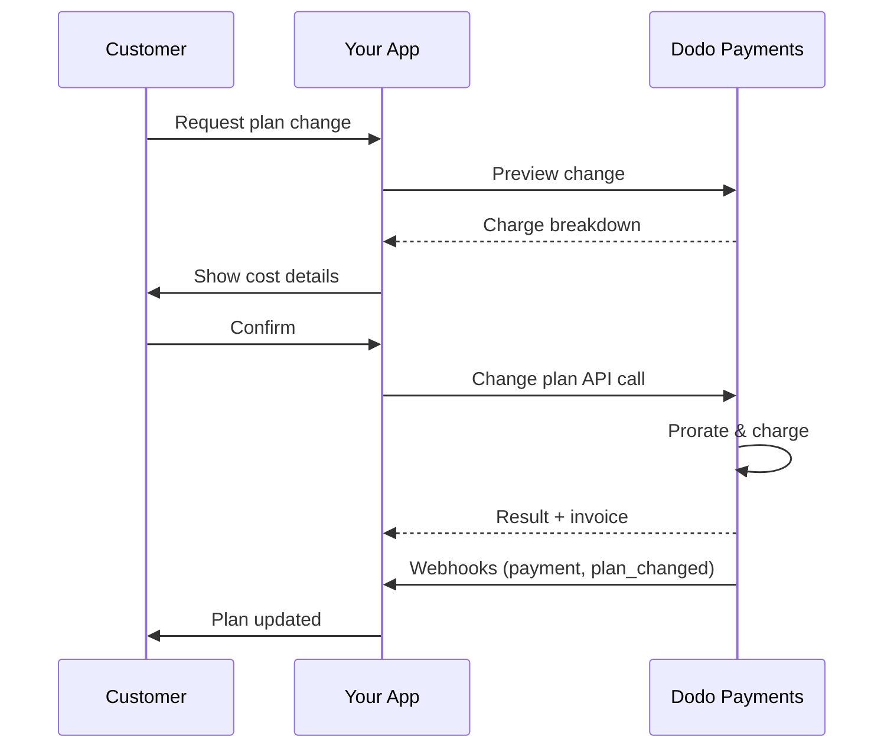
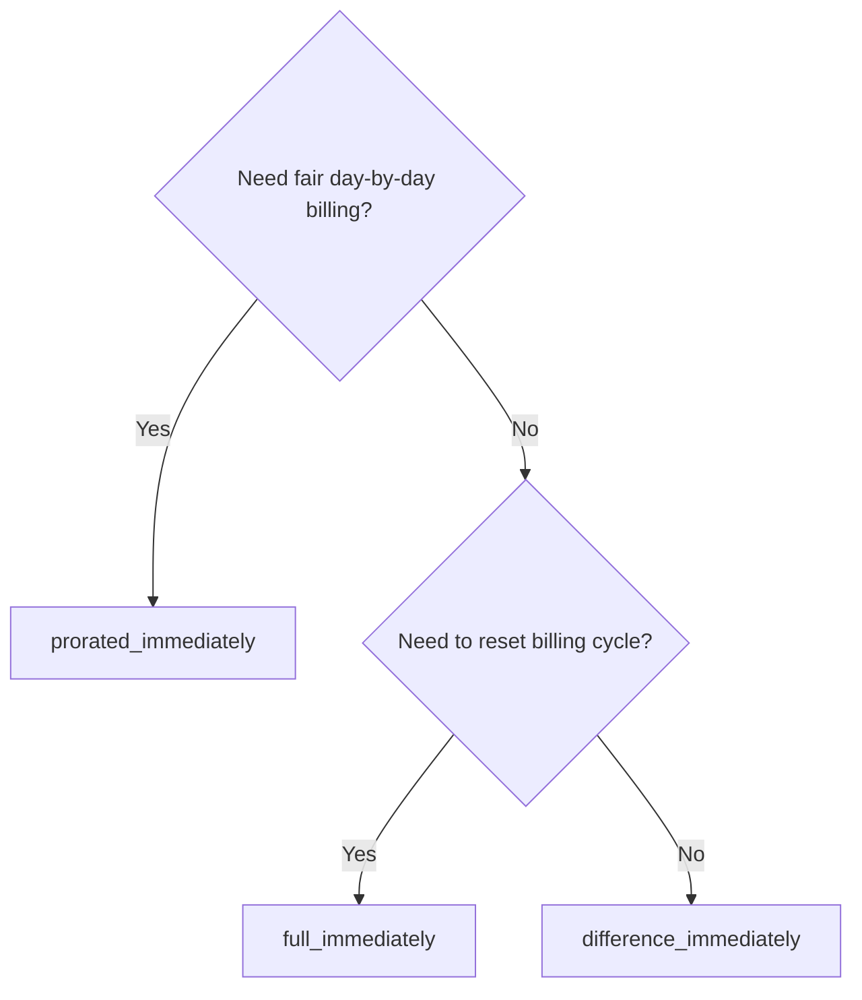
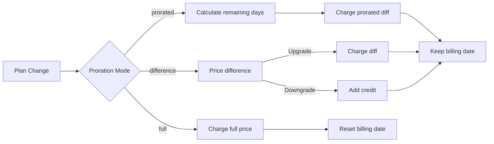

{/* LOCKED_PATTERN_6d744560e4135463c359b094ae69cd5f */}
{/* LOCKED_PATTERN_e019618386b2aca726eb1801e3e74076 */}
  Vollständige API-Dokumentation zum Aktualisieren von Abonnements.
</Card>
{/* LOCKED_PATTERN_1e8b2499d330dcc44e5e284a3600fd11 */}
  Prüfen Sie die Gebühren, bevor Sie den Plan wechseln.
</Card>
{/* LOCKED_PATTERN_782a37ccd4cc5a4159c5497e7f1d4c54 */}
  Schritt-für-Schritt-Einrichtung des Abonnements.
</Card>
</CardGroup>

## Was ist ein Upgrade oder Downgrade eines Abonnements?

Das Wechseln von Plänen ermöglicht es Ihnen, einen Kunden zwischen Abonnementstufen oder Mengen zu verschieben. Verwenden Sie es, um:
- Preise an Nutzung oder Funktionen anzupassen
- Vom Monats- zum Jahresplan zu wechseln (oder umgekehrt)
- Die Menge für sitzbasierte Produkte anzupassen

<Info>
Planänderungen können je nach gewähltem Prorationsmodus eine sofortige Abbuchung auslösen.
</Info>

## Wann man Planänderungen verwenden sollte

- Upgrade, wenn ein Kunde mehr Funktionen, Nutzung oder Sitzplätze benötigt
- Downgrade, wenn die Nutzung abnimmt
- Benutzer auf ein neues Produkt oder einen neuen Preis migrieren, ohne das Abonnement zu kündigen

## Ablauf der Planänderung



## Voraussetzungen

Bevor Sie Änderungen an Abonnementplänen implementieren, stellen Sie sicher, dass Sie:

- Ein Dodo Payments-Händlerkonto mit aktiven Abonnementprodukten haben
- API-Anmeldeinformationen (API-Schlüssel und Webhook-Geheimschlüssel) aus dem Dashboard haben
- Ein bestehendes aktives Abonnement zur Modifikation haben
- Einen Webhook-Endpunkt konfiguriert haben, um Abonnementereignisse zu verarbeiten

<Info>
Für detaillierte Einrichtungsanweisungen sehen Sie unseren [Integration Guide](/developer-resources/integration-guide#dashboard-setup).
</Info>

## Schritt-für-Schritt-Implementierungsleitfaden

Befolgen Sie diesen umfassenden Leitfaden, um Änderungen an Abonnementplänen in Ihrer Anwendung zu implementieren:

<Steps>
{/* LOCKED_PATTERN_b0d6d45bb453480975a9fb2d18d04caf */}
Bevor Sie implementieren, bestimmen Sie:
- Welche Abonnementprodukte in welche anderen geändert werden können
- Welcher Prorationsmodus zu Ihrem Geschäftsmodell passt
- Wie Sie fehlgeschlagene Planänderungen elegant behandeln
- Welche Webhook-Ereignisse Sie zur Zustandsverwaltung verfolgen müssen

<Tip>
Testen Sie Planänderungen gründlich im Testmodus, bevor Sie sie in der Produktion einsetzen.
</Tip>
</Step>

{/* LOCKED_PATTERN_44f780199a4b76d6c063b33d8f599e9a */}
Wählen Sie den Abrechnungsansatz, der zu Ihren Geschäftsanforderungen passt:

<Tabs>
<Tab title="prorated_immediately">
Ideal für: SaaS-Anwendungen, die faire Abrechnung für ungenutzte Zeit wünschen
- Berechnet den genauen proratisierten Betrag basierend auf der verbleibenden Zykluszeit
- Belastet den proratisierten Betrag basierend auf der noch verbleibenden Zeit im Zyklus
- Bietet transparente Abrechnung für Kunden
</Tab>

<Tab title="difference_immediately">
Ideal für: Klare Upgrade-/Downgrade-Szenarien
- Upgrade: Sofortige Differenz berechnen (z. B. $30→$80 = $50 berechnen)
- Downgrade: Restwert als Gutschrift für zukünftige Verlängerungen gutschreiben
- Vereinfacht Abrechnungslogik und Kundenkommunikation
</Tab>

<Tab title="full_immediately">
Ideal für: Wenn Sie den Abrechnungszyklus zurücksetzen möchten
- Belastet den vollen Betrag des neuen Plans sofort
- Ignoriert die verbleibende Zeit des alten Plans
- Nützlich für Übergänge von jährlich zu monatlich
</Tab>
</Tabs>
</Step>

{/* LOCKED_PATTERN_62685552c5becb87cfeddbb400a3e69b */}
Verwenden Sie die Change Plan API, um Abonnementdetails zu ändern:

<ParamField path="subscription_id" type="string" required>
Die ID des aktiven Abonnements, das geändert werden soll.
</ParamField>

<ParamField path="product_id" type="string" required>
Die neue Produkt-ID, auf die das Abonnement geändert wird.
</ParamField>

<ParamField path="quantity" type="integer" default="1">
Anzahl der Einheiten für den neuen Plan (bei sitzbasierter Preisgestaltung).
</ParamField>

<ParamField path="proration_billing_mode" type="string" required>
Wie die sofortige Abrechnung behandelt wird: `prorated_immediately`, `full_immediately` oder `difference_immediately`.
</ParamField>

<ParamField path="addons" type="array">
Optionale Add-ons für den neuen Plan. Wenn dieses Feld leer bleibt, werden vorhandene Add-ons entfernt.
</ParamField>

{/* LOCKED_PATTERN_dbe6ce0c854d65ccfe8e10a6cd58e3a8 */}
Steuert das Verhalten, wenn die Zahlung für die Planänderung fehlschlägt:
- `prevent_change`: Das Abonnement bleibt beim aktuellen Plan, bis die Zahlung erfolgreich ist
- `apply_change` (Standard): Planänderung wird sofort vorgenommen, unabhängig vom Zahlungsergebnis

Wenn nicht angegeben, wird die unternehmensweite Standardeinstellung verwendet.
</ParamField>
</Step>

{/* LOCKED_PATTERN_5c8c73c93c2f49c93ec60fbfa164dd3a */}
Richten Sie Webhook-Verarbeitungen ein, um Planänderungsergebnisse zu verfolgen:

- `subscription.active`: Planänderung erfolgreich, Abonnement aktualisiert
- `subscription.plan_changed`: Abonnementplan geändert (Upgrade/Downgrade/Add-on-Aktualisierung)
- `subscription.on_hold`: Planänderungsladung fehlgeschlagen, Abonnement pausiert
- `payment.succeeded`: Sofortige Abbuchung für Planänderung erfolgreich
- `payment.failed`: Sofortige Abbuchung fehlgeschlagen

<Warning>
Verifizieren Sie immer Webhook-Signaturen und implementieren Sie idempotente Ereignisverarbeitungen.
</Warning>
</Step>

{/* LOCKED_PATTERN_df7c84793753eaba82a0d637e200faa6 */}
Basierend auf Webhook-Ereignissen aktualisieren Sie Ihre Anwendung:
- Funktionen gewähren/entziehen basierend auf dem neuen Plan
- Kundendashboard mit neuen Planinformationen aktualisieren
- Bestätigungs-E-Mails zu Planänderungen senden
- Abrechnungsänderungen für Prüfzwecke protokollieren
</Step>

{/* LOCKED_PATTERN_bee75f9c04c9720f2dc211cbed62a7c6 */}
Testen Sie Ihre Implementierung gründlich:
- Testen Sie alle Prorationsmodi mit unterschiedlichen Szenarien
- Verifizieren Sie, dass die Webhook-Verarbeitung korrekt funktioniert
- Überwachen Sie Erfolgsraten von Planänderungen
- Richten Sie Alarme für fehlgeschlagene Planänderungen ein

<Check>
Ihre Implementierung für Planänderungen ist jetzt bereit für den Produktionseinsatz.
</Check>
</Step>
</Steps>

## Vorschau von Planänderungen

Bevor Sie sich für eine Planänderung entscheiden, nutzen Sie die Preview API, um Kunden genau zu zeigen, was ihnen in Rechnung gestellt wird:

<Tabs>
<Tab title="Node.js SDK">

```javascript
const preview = await client.subscriptions.previewChangePlan('sub_123', {
  product_id: 'prod_pro',
  quantity: 1,
  proration_billing_mode: 'prorated_immediately'
});

// Show customer the charge before confirming
console.log('Immediate charge:', preview.immediate_charge.summary);
console.log('New plan details:', preview.new_plan);
```

</Tab>

<Tab title="Python SDK">

```python
preview = client.subscriptions.preview_change_plan(
    subscription_id="sub_123",
    product_id="prod_pro",
    quantity=1,
    proration_billing_mode="prorated_immediately"
)

# Show customer the charge before confirming
print("Immediate charge:", preview.immediate_charge.summary)
print("New plan details:", preview.new_plan)
```

</Tab>
</Tabs>

<Tip>
Nutzen Sie die Preview API, um Bestätigungsdialoge zu erstellen, die Kunden den genauen Betrag zeigen, bevor sie eine Planänderung bestätigen.
</Tip>

## Change Plan API

Verwenden Sie die Change Plan API, um Produkt, Menge und Prorationsverhalten für ein aktives Abonnement zu ändern.

### Schnellstartbeispiele

<Tabs>
  <Tab title="Node.js SDK">

    ```javascript
    import DodoPayments from 'dodopayments';

    const client = new DodoPayments({
      bearerToken: process.env.DODO_PAYMENTS_API_KEY,
      environment: 'test_mode', // defaults to 'live_mode'
    });

    async function changePlan() {
      const result = await client.subscriptions.changePlan('sub_123', {
        product_id: 'prod_new',
        quantity: 3,
        proration_billing_mode: 'prorated_immediately',
        on_payment_failure: 'prevent_change', // Optional: control behavior on payment failure
      });
      console.log(result.status, result.invoice_id, result.payment_id);
    }

    changePlan();
    ```

  </Tab>
  <Tab title="Python SDK">

    ```python
    import os
    from dodopayments import DodoPayments

    client = DodoPayments(
        bearer_token=os.environ.get("DODO_PAYMENTS_API_KEY"),
        environment="test_mode",  # defaults to "live_mode"
    )

    result = client.subscriptions.change_plan(
        subscription_id="sub_123",
        product_id="prod_new",
        quantity=3,
        proration_billing_mode="prorated_immediately",
        on_payment_failure="prevent_change",  # Optional: control behavior on payment failure
    )
    print(result.status, result.get("invoice_id"), result.get("payment_id"))
    ```

  </Tab>
  <Tab title="Go SDK">

    ```go
    package main

    import (
      "context"
      "fmt"
      "github.com/dodopayments/dodopayments-go"
      "github.com/dodopayments/dodopayments-go/option"
    )

    func main() {
      client := dodopayments.NewClient(option.WithBearerToken("YOUR_TOKEN"))
      res, err := client.Subscriptions.ChangePlan(context.TODO(), dodopayments.SubscriptionChangePlanParams{
        SubscriptionID: dodopayments.F("sub_123"),
        ProductID:             dodopayments.F("prod_new"),
        Quantity:              dodopayments.F(int64(3)),
        ProrationBillingMode:  dodopayments.F(dodopayments.SubscriptionChangePlanParamsProrationBillingModeProratedImmediately),
        OnPaymentFailure:      dodopayments.F(dodopayments.OnPaymentFailurePreventChange), // Optional
      })
      if err != nil { panic(err) }
      fmt.Println(res.Status, res.InvoiceID, res.PaymentID)
    }
    ```

  </Tab>
  <Tab title="HTTP">

    ```bash
    curl -X POST "$DODO_API_BASE/subscriptions/sub_123/change-plan" \
      -H "Authorization: Bearer $DODO_PAYMENTS_API_KEY" \
      -H "Content-Type: application/json" \
      -d '{
        "product_id": "prod_new",
        "quantity": 3,
        "proration_billing_mode": "prorated_immediately",
        "on_payment_failure": "prevent_change"
      }'
    ```

  </Tab>
</Tabs>

```json Success
{
  "status": "processing",
  "subscription_id": "sub_123",
  "invoice_id": "inv_789",
  "payment_id": "pay_456",
  "proration_billing_mode": "prorated_immediately"
}
```

<Note>
Felder wie <code>invoice_id</code> und <code>payment_id</code> werden nur zurückgegeben, wenn während der Planänderung eine sofortige Abbuchung und/oder Rechnung erstellt wird. Verlassen Sie sich immer auf Webhook-Ereignisse (z. B. <code>payment.succeeded</code>, <code>subscription.plan_changed</code>), um Ergebnisse zu bestätigen.
</Note>

<Warning>
Wenn die sofortige Abbuchung fehlschlägt, kann sich das Abonnement in `subscription.on_hold` befinden, bis die Zahlung erfolgreich ist.
</Warning>

## Verwaltung von Add-ons

Beim Ändern von Abonnementplänen können Sie auch Add-ons anpassen:

```javascript
// Add addons to the new plan
await client.subscriptions.changePlan('sub_123', {
  product_id: 'prod_new',
  quantity: 1,
  proration_billing_mode: 'difference_immediately',
  addons: [
    { addon_id: 'addon_123', quantity: 2 }
  ]
});

// Remove all existing addons
await client.subscriptions.changePlan('sub_123', {
  product_id: 'prod_new',
  quantity: 1,
  proration_billing_mode: 'difference_immediately',
  addons: [] // Empty array removes all existing addons
});
```

<Info>
Add-ons werden in die Prorationsberechnung einbezogen und gemäß dem gewählten Prorationsmodus berechnet.
</Info>

## Prorationsmodi

Wählen Sie aus, wie der Kunde bei Planänderungen abgerechnet wird:

#### `prorated_immediately`
- Belastet die anteilige Differenz im aktuellen Zyklus
- Bei Testphasen wird sofort abgerechnet und sofort auf den neuen Plan gewechselt
- Downgrade: kann eine proratisierte Gutschrift erzeugen, die auf zukünftige Verlängerungen angewendet wird

#### `full_immediately`
- Belastet sofort den vollständigen Betrag des neuen Plans
- Ignoriert verbleibende Zeit des alten Plans

<Info>
Gutschriften, die durch Downgrades mit <code>difference_immediately</code> erzeugt werden, sind abonnementsgebunden und unterscheiden sich von <a href="/features/customer-credit">Customer Credits</a>. Sie werden automatisch auf zukünftige Verlängerungen desselben Abonnements angewendet und können nicht zwischen Abonnements übertragen werden.
</Info>

#### `difference_immediately`
- Upgrade: sofortige Belastung der Preis-Differenz zwischen altem und neuem Plan
- Downgrade: verbleibender Wert wird als interne Gutschrift auf das Abonnement hinzugefügt und bei Verlängerungen automatisch angewendet

| Feature | `prorated_immediately` | `difference_immediately` | `full_immediately` |
|---------|----------------------|------------------------|-------------------|
| **Upgrade charge** | Proportionale Differenz für verbleibende Tage | Volle Preisdifferenz zwischen den Plänen | Voller Preis des neuen Plans |
| **Downgrade credit** | Proportionale Gutschrift für verbleibende Tage | Volle Preisdifferenz als Gutschrift | Keine Gutschrift |
| **Billing cycle** | Unverändert | Unverändert | Setzt sich auf heute zurück |
| **Trial behavior** | Beendet Testphase, belastet sofort | Beendet Testphase, belastet sofort | Beendet Testphase, belastet vollen Betrag |
| **Best for** | Faire zeitbasierte Abrechnung | Einfache Upgrade/Downgrade-Berechnung | Zurücksetzen von Abrechnungszyklen |
| **Complexity** | Mittel (Tagesberechnung) | Niedrig (einfache Subtraktion) | Niedrig (volle Belastung) |



### Beispielsszenarien

Verwenden Sie diese konsistenten Zahlen:
- Aktueller Plan: **Basic** zu **$30/Monat**
- Upgrade-Ziel: **Pro** zu **$80/Monat**
- Downgrade-Ziel (von Pro): **Starter** zu **$20/Monat**
- Abrechnungszyklus: **30 Tage**, gestartet am **1. Januar**
- Planänderung erfolgt am **16. Januar** (15 Tage verbleibend, 15 Tage genutzt)

<AccordionGroup>
  {/* LOCKED_PATTERN_1a58b4dbcc060de029ff28c82c80a6fe */}

    ```
    Step 1: Calculate unused credit from current plan
      Unused days = 15 out of 30 days
      Credit = $30 × (15/30) = $15.00

    Step 2: Calculate prorated cost of new plan
      Remaining days = 15 out of 30 days
      New plan cost = $80 × (15/30) = $40.00

    Step 3: Calculate immediate charge
      Charge = New plan cost − Credit
      Charge = $40.00 − $15.00 = $25.00

    → Customer pays $25.00 now
    → Next renewal (Feb 1): $80.00/month
    ```

    ```javascript
    await client.subscriptions.changePlan('sub_123', {
      product_id: 'prod_pro',
      quantity: 1,
      proration_billing_mode: 'prorated_immediately'
    })
    ```

  </Accordion>

  {/* LOCKED_PATTERN_807a82fa1b52ee9a606ce1f9c1d8b613 */}

    ```
    Step 1: Calculate unused credit from current plan
      Unused days = 15 out of 30 days
      Credit = $80 × (15/30) = $40.00

    Step 2: Calculate prorated cost of new plan
      Remaining days = 15 out of 30 days
      New plan cost = $20 × (15/30) = $10.00

    Step 3: Calculate credit balance
      Credit = $40.00 − $10.00 = $30.00

    → No charge — $30.00 credit added to subscription
    → Credit auto-applies to future renewals
    → Next renewal (Feb 1): $20.00 − $30.00 credit = $0.00
    → Following renewal (Mar 1): $20.00 − $10.00 remaining credit = $10.00
    ```

    ```javascript
    await client.subscriptions.changePlan('sub_123', {
      product_id: 'prod_starter',
      quantity: 1,
      proration_billing_mode: 'prorated_immediately'
    })
    ```

  </Accordion>

  {/* LOCKED_PATTERN_67905dd0e892a1412bd0f1a567dd0a62 */}

    ```
    Immediate charge = New plan price − Old plan price
                     = $80 − $30
                     = $50.00

    → Customer pays $50.00 now (regardless of cycle position)
    → Next renewal (Feb 1): $80.00/month
    ```

    ```javascript
    await client.subscriptions.changePlan('sub_123', {
      product_id: 'prod_pro',
      quantity: 1,
      proration_billing_mode: 'difference_immediately'
    })
    ```

  </Accordion>

  {/* LOCKED_PATTERN_b17ed67d3062fadb798904adf781b844 */}

    ```
    Credit = Old plan price − New plan price
           = $80 − $20
           = $60.00

    → No charge — $60.00 credit added to subscription
    → Credit auto-applies to future renewals
    → Next renewal: $20.00 − $20.00 (from credit) = $0.00
    → Following renewal: $20.00 − $20.00 (from credit) = $0.00
    → Third renewal: $20.00 − $20.00 (from remaining credit) = $0.00
    ```

    ```javascript
    await client.subscriptions.changePlan('sub_123', {
      product_id: 'prod_starter',
      quantity: 1,
      proration_billing_mode: 'difference_immediately'
    })
    ```

  </Accordion>

  {/* LOCKED_PATTERN_0cb1a5657302a3970059ca925841dcd5 */}

    ```
    Immediate charge = Full new plan price = $80.00

    → Customer pays $80.00 now
    → No credit for unused time on old plan
    → Billing cycle resets to today (January 16)
    → Next renewal: February 16 at $80.00/month
    ```

    ```javascript
    await client.subscriptions.changePlan('sub_123', {
      product_id: 'prod_pro',
      quantity: 1,
      proration_billing_mode: 'full_immediately'
    })
    ```

  </Accordion>

  {/* LOCKED_PATTERN_6edab7762bdaeaf6cef5f85bafdb8832 */}

    ```
    Current: Basic plan ($30/month), no add-ons
    New: Pro plan ($80/month) + Extra Seats add-on ($10/seat × 3 seats = $30/month)
    Change on day 16 of 30 (15 days remaining)

    Step 1: Credit from current plan
      Credit = $30 × (15/30) = $15.00

    Step 2: Prorated cost of new plan + add-ons
      New plan = $80 × (15/30) = $40.00
      Add-ons = $30 × (15/30) = $15.00
      Total new = $55.00

    Step 3: Immediate charge
      Charge = $55.00 − $15.00 = $40.00

    → Customer pays $40.00 now
    → Next renewal: $80.00 + $30.00 = $110.00/month
    ```

    ```javascript
    await client.subscriptions.changePlan('sub_123', {
      product_id: 'prod_pro',
      quantity: 1,
      proration_billing_mode: 'prorated_immediately',
      addons: [
        { addon_id: 'addon_seats', quantity: 3 }
      ]
    })
    ```

  </Accordion>
</AccordionGroup>

### Wie jeder Modus die Abrechnung verarbeitet



<Tip>
Wählen Sie `prorated_immediately` für faire Zeitabrechnung; wählen Sie `full_immediately`, um die Abrechnung neu zu starten; verwenden Sie `difference_immediately` für einfache Upgrades und automatische Gutschriften bei Downgrades.
</Tip>

## Umgang mit Zahlungsausfällen

Steuern Sie, was passiert, wenn eine Planänderungzahlung fehlschlägt, mit dem Parameter `on_payment_failure`.

### Zahlungsfehlermodi

<Tabs>
{/* LOCKED_PATTERN_9a289e347ae0d2762cd8b5bae425d96d */}
**Verhalten**: Das Abonnement bleibt beim aktuellen Plan, bis die Zahlung erfolgreich ist.

- Die Planänderung wird als "ausstehend" markiert
- Der Kunde behält Zugriff auf seinen aktuellen Plan
- Das Abonnement wechselt erst nach erfolgreicher Zahlung in den Zustand `active`
- Nützlich, wenn Sie sicherstellen möchten, dass die Zahlung erfolgt, bevor Sie Upgrade-Funktionen freischalten

```javascript
await client.subscriptions.changePlan('sub_123', {
  product_id: 'prod_pro',
  quantity: 1,
  proration_billing_mode: 'prorated_immediately',
  on_payment_failure: 'prevent_change'
});
```

</Tab>

{/* LOCKED_PATTERN_389bf4efb62466ceba65070629169973 */}
**Verhalten**: Die Planänderung wird sofort vorgenommen, unabhängig vom Zahlungsergebnis.

- Die Planänderung wird angewendet, auch wenn die Zahlung fehlschlägt
- Der Kunde erhält sofortigen Zugriff auf den neuen Plan
- Das Abonnement kann sich bei Zahlungsfehlern in den Zustand `on_hold` bewegen
- Gut für nicht kritische Upgrades oder wenn Sie dem Kunden vertrauen

```javascript
await client.subscriptions.changePlan('sub_123', {
  product_id: 'prod_pro',
  quantity: 1,
  proration_billing_mode: 'prorated_immediately',
  on_payment_failure: 'apply_change' // This is the default
});
```

</Tab>
</Tabs>

<Info>
Wenn nicht angegeben, verwendet der Parameter `on_payment_failure` Ihre unternehmensweite Standardeinstellung, die im Dashboard konfiguriert ist.
</Info>

### Wann Sie jeden Modus verwenden sollten

| Szenario | Empfohlener Modus | Grund |
|----------|------------------|--------|
| Upgrade auf Premium-Funktionen | `prevent_change` | Stellen Sie die Zahlung sicher, bevor Sie Zugriff gewähren |
| Mengenerhöhung (mehr Sitzplätze) | `prevent_change` | Verhindern Sie Nutzung ohne Zahlung |
| Downgrades von Plänen | `apply_change` | Der Kunde reduziert seine Ausgaben |
| Vertrauenswürdige Unternehmenskunden | `apply_change` | Niedriges Risiko von Nichtzahlung |
| Von Testversion zu zahlendem Plan | `prevent_change` | Kritischer Zahlungszeitpunkt |

## Umgang mit Webhooks

Verfolgen Sie den Abonnementstatus über Webhooks, um Planänderungen und Zahlungen zu bestätigen.

### Ereignistypen, die Sie behandeln sollten
- `subscription.active`: Abonnement aktiviert
- `subscription.plan_changed`: Abonnementplan geändert (Upgrade/Downgrade/Add-on-Änderungen)
- `subscription.on_hold`: Abbuchung fehlgeschlagen, Abonnement pausiert
- `subscription.renewed`: Verlängerung erfolgreich
- `payment.succeeded`: Zahlung für Planänderung oder Verlängerung erfolgreich
- `payment.failed`: Zahlung fehlgeschlagen

<Info>
Wir empfehlen, Geschäftslogik aus Abonnementereignissen abzuleiten und Zahlungsevents für Bestätigung und Abgleich zu nutzen.
</Info>

### Signaturen verifizieren und Intents behandeln

<Tabs>
  <Tab title="Next.js Route Handler">

    ```javascript
    import { NextRequest, NextResponse } from 'next/server';
    
    export async function POST(req) {
      const webhookId = req.headers.get('webhook-id');
      const webhookSignature = req.headers.get('webhook-signature');
      const webhookTimestamp = req.headers.get('webhook-timestamp');
      const secret = process.env.DODO_WEBHOOK_SECRET;
    
      const payload = await req.text();
      // verifySignature is a placeholder – in production, use a Standard Webhooks library
      const { valid, event } = await verifySignature(
        payload,
        { id: webhookId, signature: webhookSignature, timestamp: webhookTimestamp },
        secret
      );
      if (!valid) return NextResponse.json({ error: 'Invalid signature' }, { status: 400 });
    
      switch (event.type) {
        case 'subscription.active':
          // mark subscription active in your DB
          break;
        case 'subscription.plan_changed':
          // refresh entitlements and reflect the new plan in your UI
          break;
        case 'subscription.on_hold':
          // notify user to update payment method
          break;
        case 'subscription.renewed':
          // extend access window
          break;
        case 'payment.succeeded':
          // reconcile payment for plan change
          break;
        case 'payment.failed':
          // log and alert
          break;
        default:
          // ignore unknown events
          break;
      }
    
      return NextResponse.json({ received: true });
    }
    ```

  </Tab>
  <Tab title="Express.js">

    ```javascript
    import express from 'express';
    
    const app = express();
    app.post('/webhooks/dodo', express.raw({ type: 'application/json' }), async (req, res) => {
      const webhookId = req.header('webhook-id');
      const webhookSignature = req.header('webhook-signature');
      const webhookTimestamp = req.header('webhook-timestamp');
      const secret = process.env.DODO_WEBHOOK_SECRET;
      const payload = req.body.toString('utf8');
    
      const { valid, event } = await verifySignature(
        payload,
        { id: webhookId, signature: webhookSignature, timestamp: webhookTimestamp },
        secret
      );
      if (!valid) return res.status(400).send('Invalid signature');
    
      // handle events like above
      res.json({ received: true });
    });
    
    app.listen(3000);
    ```

  </Tab>
</Tabs>

<Note>
Für detaillierte Payload-Schemata siehe die <a href="/developer-resources/webhooks/intents/subscription">Subscription-Webhooks</a> und <a href="/developer-resources/webhooks/intents/payment">Payment-Webhooks</a>.
</Note>

## Beste Praktiken

Folgen Sie diesen Empfehlungen für zuverlässige Planänderungen bei Abonnements:

### Planänderungsstrategie
- **Gründlich testen**: Testen Sie Planänderungen immer im Testmodus, bevor Sie sie produktiv schalten
- **Proration sorgfältig wählen**: Wählen Sie den Prorationsmodus, der zu Ihrem Geschäftsmodell passt
- **Fehler elegant behandeln**: Implementieren Sie ordnungsgemäße Fehlerbehandlung und Retry-Logik
- **Erfolgsraten überwachen**: Verfolgen Sie Erfolgs-/Fehlerraten von Planänderungen und analysieren Sie Probleme

### Webhook-Implementierung
- **Signaturen verifizieren**: Validieren Sie Webhook-Signaturen stets zur Sicherstellung der Authentizität
- **Idempotenz implementieren**: Behandeln Sie doppelte Webhook-Ereignisse elegant
- **Asynchron verarbeiten**: Blockieren Sie Webhook-Antworten nicht mit aufwändigen Operationen
- **Alles protokollieren**: Führen Sie detaillierte Logs für Debugging und Prüfzwecke

### Benutzererlebnis
- **Klar kommunizieren**: Informieren Sie Kunden über Abrechnungsänderungen und Zeitpunkte
- **Bestätigungen bereitstellen**: Senden Sie E-Mail-Bestätigungen für erfolgreiche Planänderungen
- **Edge-Fälle behandeln**: Berücksichtigen Sie Testzeiträume, Prorationen und fehlgeschlagene Zahlungen
- **UI sofort aktualisieren**: Zeigen Sie Planänderungen unmittelbar in Ihrer Anwendung an

## Häufige Probleme und Lösungen

Lösen Sie typische Probleme bei Planänderungen von Abonnements:

<AccordionGroup>
{/* LOCKED_PATTERN_112861435a085998aa537e347e24f368 */}
**Symptome**: API-Aufruf ist erfolgreich, aber das Abonnement bleibt im alten Plan

**Hauptursachen**:
- Webhook-Verarbeitung ist fehlgeschlagen oder verzögert
- Anwendungszustand wurde nach Empfang der Webhooks nicht aktualisiert
- Datenbanktransaktionen während der Zustandsaktualisierung sind problematisch

**Lösungen**:
- Implementieren Sie robuste Webhook-Verarbeitung mit Retry-Logik
- Verwenden Sie idempotente Operationen für Zustandsaktualisierungen
- Fügen Sie Überwachung hinzu, um verpasste Webhook-Ereignisse zu erkennen und zu melden
- Verifizieren Sie, dass Ihr Webhook-Endpunkt erreichbar ist und korrekt antwortet
</Accordion>

{/* LOCKED_PATTERN_653656c823b0f191581a523ab18f0f3f */}
**Symptome**: Kunde downgrades, sieht aber keine Gutschrift


**Hauptursachen**:
- Erwartungen an den Prorationsmodus: Downgrades schreiben den vollen Preisdifferenzbetrag mit `difference_immediately` gut, während `prorated_immediately` eine proratisierte Gutschrift basierend auf der verbleibenden Zeit erstellt
- Gutschriften sind abonnementspezifisch und nicht zwischen Abonnements transferierbar
- Gutschriftsaldo ist im Kundendashboard nicht sichtbar

**Lösungen**:
- Verwenden Sie `difference_immediately` für Downgrades, wenn Sie automatische Gutschriften wünschen
- Erklären Sie Kunden, dass Gutschriften auf zukünftige Verlängerungen desselben Abonnements angewendet werden
- Implementieren Sie ein Kundenportal, um Gutschriftsalden anzuzeigen
- Prüfen Sie die Vorschau der nächsten Rechnung, um angewendete Gutschriften zu sehen
</Accordion>

{/* LOCKED_PATTERN_1b0516ec68b4083dc4d6ae9b330f3f1a */}
**Symptome**: Webhook-Ereignisse werden wegen ungültiger Signatur abgelehnt

**Hauptursachen**:
- Falscher Webhook-Secret-Key
- Rohanforderungskörper wurde vor der Signaturprüfung verändert
- Falscher Signaturprüfalgorithmus

**Lösungen**:
- Vergewissern Sie sich, dass Sie den korrekten `DODO_WEBHOOK_SECRET` aus dem Dashboard verwenden
- Lesen Sie den Rohanforderungskörper, bevor Sie JSON-Parsing-Middleware einsetzen
- Verwenden Sie die standardmäßige Webhook-Verifizierungsbibliothek für Ihre Plattform
- Testen Sie die Signaturprüfung in der Entwicklungsumgebung

{/* LOCKED_PATTERN_638d7c911003cceda8c7d34ff8a2c381 */}
**Symptome**: API gibt 422 Unprocessable Entity zurück

**Hauptursachen**:
- Ungültige Abonnement-ID oder Produkt-ID
- Abonnement ist nicht im aktiven Zustand
- Fehlende erforderliche Parameter
- Produkt steht für Planänderungen nicht zur Verfügung

**Lösungen**:
- Stellen Sie sicher, dass das Abonnement existiert und aktiv ist
- Prüfen Sie, ob die Produkt-ID gültig und verfügbar ist
- Sorgen Sie dafür, dass alle erforderlichen Parameter übergeben werden
- Überprüfen Sie die API-Dokumentation bezüglich Parameteranforderungen
</Accordion>

{/* LOCKED_PATTERN_7917a64bf4b26c933f2e4649e9278a56 */}
**Symptome**: Planänderung läuft, aber die sofortige Abbuchung schlägt fehl

**Hauptursachen**:
- Nicht ausreichende Mittel auf der Zahlungsmethode des Kunden
- Zahlungsmethode ist abgelaufen oder ungültig
- Bank hat die Transaktion abgelehnt
- Betrugserkennung hat die Abbuchung blockiert

**Lösungen**:
- Behandeln Sie `payment.failed` Webhook-Ereignisse entsprechend
- Informieren Sie den Kunden, seine Zahlungsmethode zu aktualisieren
- Implementieren Sie Retry-Logik für temporäre Fehler
- Erwägen Sie, Planänderungen auch bei fehlgeschlagenen Sofortabbuchungen zuzulassen
</Accordion>

{/* LOCKED_PATTERN_20276630e99e95ac9f5cdd0b347713bb */}
**Symptome**: Planänderungsabbuchung schlägt fehl und das Abonnement wechselt in den Zustand `on_hold`

**Was passiert**:
Wenn eine Planänderungsabbuchung fehlschlägt, wird das Abonnement automatisch in den Zustand `on_hold` gesetzt. Das Abonnement wird nicht automatisch verlängert, bis die Zahlungsmethode aktualisiert wird.

**Lösung**: Aktualisieren Sie die Zahlungsmethode, um das Abonnement zu reaktivieren

Um ein Abonnement nach einem fehlgeschlagenen Planwechsel aus dem Zustand `on_hold` wieder zu aktivieren:

1. **Aktualisieren Sie die Zahlungsmethode** mit der Update Payment Method API
2. **Automatische Abbuchungserstellung**: Die API erstellt automatisch eine Abbuchung für ausstehende Beträge
3. **Rechnungserstellung**: Es wird eine Rechnung für die Abbuchung generiert
4. **Zahlungsabwicklung**: Die Zahlung wird mit der neuen Zahlungsmethode verarbeitet
5. **Reaktivierung**: Nach erfolgreicher Zahlung wird das Abonnement wieder in den Zustand `active` versetzt

<CodeGroup>

```javascript Node.js
// Reactivate subscription from on_hold after failed plan change
async function reactivateAfterFailedPlanChange(subscriptionId) {
  // Update payment method - automatically creates charge for remaining dues
  const response = await client.subscriptions.updatePaymentMethod(subscriptionId, {
    type: 'new',
    return_url: 'https://example.com/return'
  });
  
  if (response.payment_id) {
    console.log('Charge created for remaining dues:', response.payment_id);
    console.log('Payment link:', response.payment_link);
    
    // Redirect customer to payment_link to complete payment
    // Monitor webhooks for:
    // 1. payment.succeeded - charge succeeded
    // 2. subscription.active - subscription reactivated
  }
  
  return response;
}

// Or use existing payment method if available
async function reactivateWithExistingPaymentMethod(subscriptionId, paymentMethodId) {
  const response = await client.subscriptions.updatePaymentMethod(subscriptionId, {
    type: 'existing',
    payment_method_id: paymentMethodId
  });
  
  // Monitor webhooks for payment.succeeded and subscription.active
  return response;
}
```

```python Python
# Reactivate subscription from on_hold after failed plan change
def reactivate_after_failed_plan_change(subscription_id):
    # Update payment method - automatically creates charge for remaining dues
    response = client.subscriptions.update_payment_method(
        subscription_id=subscription_id,
        type="new",
        return_url="https://example.com/return"
    )
    
    if response.payment_id:
        print("Charge created for remaining dues:", response.payment_id)
        print("Payment link:", response.payment_link)
        
        # Redirect customer to payment_link to complete payment
        # Monitor webhooks for:
        # 1. payment.succeeded - charge succeeded
        # 2. subscription.active - subscription reactivated
    
    return response

# Or use existing payment method if available
def reactivate_with_existing_payment_method(subscription_id, payment_method_id):
    response = client.subscriptions.update_payment_method(
        subscription_id=subscription_id,
        type="existing",
        payment_method_id=payment_method_id
    )
    
    # Monitor webhooks for payment.succeeded and subscription.active
    return response
```

</CodeGroup>

**Webhook-Ereignisse, die zu überwachen sind**:
- `subscription.on_hold`: Abonnement pausiert (empfangen, wenn die Planänderungsabbuchung fehlschlägt)
- `payment.succeeded`: Zahlung für ausstehende Beträge erfolgreich (nach Aktualisierung der Zahlungsmethode)
- `subscription.active`: Abonnement nach erfolgreicher Zahlung reaktiviert

**Beste Praktiken**:
- Informieren Sie Kunden sofort, wenn eine Planänderungsabbuchung fehlschlägt
- Geben Sie klare Anweisungen, wie die Zahlungsmethode aktualisiert wird
- Überwachen Sie Webhook-Ereignisse, um den Reaktivierungsstatus zu verfolgen
- Erwägen Sie automatische Retry-Logik bei temporären Zahlungsfehlern

{/* LOCKED_PATTERN_d215ea1d00e95d5e9d5b4b6085f2443f */}
Sehen Sie sich die vollständige API-Dokumentation zum Aktualisieren von Zahlungsmethoden und zur Reaktivierung von Abonnements an.
</Card>
</Accordion>
</AccordionGroup>

## Testen Ihrer Implementierung

Befolgen Sie diese Schritte, um Ihre Implementierung von Planänderungen gründlich zu testen:

<Steps>
{/* LOCKED_PATTERN_f5ce79c6f425de558f6fdd6cea5793f5 */}
- Verwenden Sie Test-API-Schlüssel und Testprodukte
- Erstellen Sie Testabonnements mit verschiedenen Plantypen
- Konfigurieren Sie einen Test-Webhook-Endpunkt
- Richten Sie Überwachung und Protokollierung ein
</Step>

{/* LOCKED_PATTERN_3705b8701c8873992c57281c42adf8d6 */}
- Testen Sie `prorated_immediately` mit verschiedenen Positionen im Abrechnungszyklus
- Testen Sie `difference_immediately` für Upgrades und Downgrades
- Testen Sie `full_immediately`, um Abrechnungszyklen zurückzusetzen
- Verifizieren Sie, dass die Gutschriften korrekt berechnet werden
</Step>

{/* LOCKED_PATTERN_9fb1eaf73e8951f61d7daf19366cdfdf */}
- Verifizieren Sie, dass alle relevanten Webhook-Ereignisse empfangen werden
- Testen Sie die Signaturverifikation für Webhooks
- Behandeln Sie doppelte Webhook-Ereignisse elegant
- Testen Sie Szenarien mit Webhook-Verarbeitungsfehlern
</Step>

{/* LOCKED_PATTERN_7d448c9309210902a86e740b08deae34 */}
- Testen Sie mit ungültigen Abonnement-IDs
- Testen Sie mit abgelaufenen Zahlungsmethoden
- Testen Sie Netzwerkfehler und Timeouts
- Testen Sie mit unzureichenden Mitteln
</Step>

{/* LOCKED_PATTERN_099bec4eb7633497929a085e7b0160cd */}
- Richten Sie Warnungen für fehlgeschlagene Planänderungen ein
- Überwachen Sie die Webhook-Verarbeitungszeiten
- Verfolgen Sie Erfolgsraten von Planänderungen
- Überprüfen Sie Support-Tickets zu Planänderungsproblemen
</Step>
</Steps>

## Fehlerbehandlung

Behandeln Sie häufige API-Fehler elegant in Ihrer Implementierung:

### HTTP-Statuscodes

<AccordionGroup>
<Accordion title="200 OK">
Die Planänderungsanforderung wurde erfolgreich verarbeitet. Das Abonnement wird aktualisiert und die Zahlungsabwicklung gestartet.
</Accordion>

<Accordion title="400 Bad Request">
Ungültige Anforderungsparameter. Prüfen Sie, ob alle erforderlichen Felder angegeben und korrekt formatiert sind.
</Accordion>

{/* LOCKED_PATTERN_618fe88bddcc0059b0b92c4342a4dcfc */}
Ungültiger oder fehlender API-Schlüssel. Verifizieren Sie, dass Ihr `DODO_PAYMENTS_API_KEY` korrekt ist und über die richtigen Berechtigungen verfügt.
</Accordion>

<Accordion title="404 Not Found">
Abonnement-ID nicht gefunden oder gehört nicht zu Ihrem Konto.
</Accordion>

<Accordion title="422 Unprocessable Entity">
Das Abonnement kann nicht geändert werden (z. B. schon gekündigt, Produkt nicht verfügbar usw.).
</Accordion>

<Accordion title="500 Internal Server Error">
Serverfehler aufgetreten. Wiederholen Sie die Anfrage nach kurzer Verzögerung.
</Accordion>
</AccordionGroup>

### Fehlerantwortformat

```json
{
  "error": {
    "code": "subscription_not_found",
    "message": "The subscription with ID 'sub_123' was not found",
    "details": {
      "subscription_id": "sub_123"
    }
  }
}
```

## Nächste Schritte

- Überprüfen Sie die <a href="/api-reference/subscriptions/change-plan">Change Plan API</a>
- Erkunden Sie <a href="/features/customer-credit">Customer Credits</a>
- Implementieren Sie Alarme für `subscription.on_hold`
- Werfen Sie einen Blick auf unseren <a href="/developer-resources/webhooks">Webhook Integration Guide</a>
