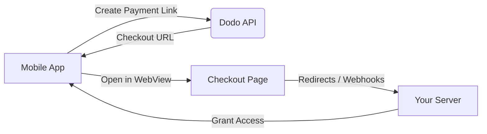

## Einführung

Dodo Payments ermöglicht Entwicklern den Verkauf digitaler Waren und Dienstleistungen in iOS-Apps und kümmert sich um komplexe Aspekte wie Steuerkonformität, Währungsumrechnung und Auszahlungen. Dieser umfassende Leitfaden beschreibt, wie Sie Dodo Payments in Ihre iOS-App integrieren, insbesondere für SaaS-Tools, Inhaltsabonnements und digitale Dienstleistungen.

## Übersicht

Dodo Payments fungiert als Ihr **Merchant of Record (MoR)** und verwaltet kritische Aspekte Ihres digitalen Geschäfts:

<Tabs>
{/* LOCKED_PATTERN_7b95db5ad22ff10e01a4218d7aa6d6be */}
- Steuererhebung und -abführung (MwSt, GST und andere regionale Steuern)
- Globale Zahlungen gemäß Richtlinien und lokalen Zahlungsmethoden
- Währungsumrechnung und Devisen
- Rückbelastungen und Betrugsprävention
- Rechnungsstellung und Belege für Endkunden
- Einhaltung regionaler Vorschriften
</Tab>

{/* LOCKED_PATTERN_da399a11cc5287c02436800c294d28be */}
- Eine einheitliche API für Web- und Mobilplattformen
- Unterstützung für In-App-Checkouts (UPI, Karten, Wallets, BNPL)
- Globale Auszahlungsunterstützung (Payoneer, Wise, lokale Banküberweisungen)
- Analyse- und Reporting-Dashboard
- Sichere Zahlungsabwicklung
</Tab>
</Tabs>

## Anwendungsfälle

<CardGroup cols={2}>
{/* LOCKED_PATTERN_25273516451e819dcf5729a5b31c3fb9 */}
- Premium-Inhalte oder Funktionszugriff
- Wiederkehrende Abrechnung mit flexiblen Optionen, kostenlose Testzeiträume, anteilige Abrechnung oder Upgrades und Downgrades
</Card>

{/* LOCKED_PATTERN_032df751886a698341277e548837215d */}
- Zugriff pro Kurs
- Bündelpakete für Inhalte
- Lebenslange oder erneuerbare Lizenzen
- Integration der Fortschrittsverfolgung
</Card>

{/* LOCKED_PATTERN_88cb7887605391efc00e89ceac393617 */}
- Einmalkäufe (PDFs, Musik, Tools)
- Lieferung digitaler Assets
- Verwaltung von Lizenzschlüsseln
</Card>

{/* LOCKED_PATTERN_53b689678a845fbab7f78be1484fe51d */}
- Software-as-a-Service-Abonnements
- Nutzungsbasierte Abrechnung
- Team- und Enterprise-Pläne
</Card>
</CardGroup>

## Integrationsablauf

Sie können Dodo Payments in Ihre App integrieren, indem Sie unsere gehostete Checkout- oder In-App-Browserlösung verwenden.

### Integrationsschritte

<Steps>
{/* LOCKED_PATTERN_eaf7186d297d5feae774885072c1deff */}
Der Prozess beginnt damit, dass die mobile App einen Zahlungslink erstellt, indem sie mit der Dodo-API interagiert.
</Step>

{/* LOCKED_PATTERN_b32fbf0225071fa4e66b7da8eafe9ef9 */}
Die Dodo-API antwortet, indem sie der mobilen App eine Checkout-URL zurückgibt.
</Step>

{/* LOCKED_PATTERN_d976b5e50a0a8a20a8206d907f16914f */}
Die mobile App öffnet dann diese Checkout-URL in einer WebView, wodurch der Benutzer zur Checkout-Seite geführt wird.
</Step>

{/* LOCKED_PATTERN_44d5bb8ba746348cda77bbdfc76b7fa5 */}
Nach Abschluss des Checkout-Prozesses kommuniziert die Checkout-Seite über Weiterleitungen oder Webhooks mit Ihrem Server.
</Step>

{/* LOCKED_PATTERN_5f4ad8be947cf24adc5f501029294d3c */}
Schließlich gewährt Ihr Server Zugriff auf den gekauften Inhalt oder Service und schließt so den Transaktionszyklus in der mobilen App ab.
</Step>
</Steps>

{/* LOCKED_PATTERN_b9b6430ebe2f8c301db006aee204f66d */}
Für einen vollständigen Entwicklerdurchlauf erkunden Sie unseren Mobile Integration Guide.
</Card>

## Regionale Verfügbarkeit

Dodo Payments ermöglicht alternative In-App-Kaufabläufe nur in App Store-Regionen, in denen Apple ausdrücklich externe Zahlungen erlaubt oder wo eine regulatorische oder gerichtliche Anordnung dies vorschreibt.

### Unterstützte Regionen

<AccordionGroup>
{/* LOCKED_PATTERN_2d6a072cfe841357c870b65ab28b5291 */}
Unterstützt, soweit dies durch aktuelle Gerichtsbeschlüsse und Apples aktualisierte Richtlinien zulässig ist.

- Verfügbar unter bestimmten gerichtlich angeordneten Bestimmungen
- Unterliegt Apples Einhaltung gesetzlicher Anforderungen
- Muss Apples Implementierungsrichtlinien folgen
</Accordion>

{/* LOCKED_PATTERN_4ec7a4d0b0e955daa950f2acd6b96083 */}
Unterstützt über Apples EU-Alternativbedingungen und das External Purchase Entitlement.

- Aktiviert über Apples EU-Alternativbedingungen
- Erfordert eine Genehmigung für das External Purchase Entitlement
- Muss den Anforderungen des EU-Digital Markets Act entsprechen
</Accordion>

{/* LOCKED_PATTERN_6bb22099c6c9aa7ba0a1c7dba319d124 */}
Unterstützt über das StoreKit External Purchase Entitlement für ausschließlich in Korea verfügbare Binaries.

- Verfügbar über das StoreKit External Purchase Entitlement
- Erfordert ein Korea-spezifisches App-Binary
- Muss den koreanischen Telekommunikationsgesetzen entsprechen
</Accordion>
</AccordionGroup>

<Warning>
Überprüfen und erfüllen Sie stets Apples regionsspezifische Berechtigungen und App Store Connect-Anforderungen, bevor Sie Dodo Payments für einen Storefront aktivieren. Die Nutzung alternativer Zahlungsabläufe in nicht unterstützten Regionen kann zur Ablehnung oder Entfernung Ihrer App führen.
</Warning>

<Note>
Für einige Geschäftsmodelle – wie Dienstleistungen oder bestimmte Content-Kategorien – kann Apple die Verwendung von In-App-Käufen (IAP) überhaupt nicht verlangen. Dodo Payments unterstützt auch diese Modelle. Überprüfen Sie stets die Klassifizierung Ihrer App und Apples aktuelle Richtlinien, um festzustellen, ob IAP für Ihren Anwendungsfall verpflichtend ist.
</Note>

### Mehr erfahren

Für eine detaillierte Aufschlüsselung globaler Richtlinien, rechtlicher Präzedenzfälle und strategischer Ansätze zur Umgehung von App Store-Gebühren, siehe unseren umfassenden Leitfaden:

{/* LOCKED_PATTERN_4c4ef7dc147bdbe9f5385b01ed7a302b */}
Erfahren Sie, wo und wie Sie alternative Zahlungsabläufe legal implementieren können, mit aktuellen regionalen Hinweisen und Compliance-Tipps.
</Card>