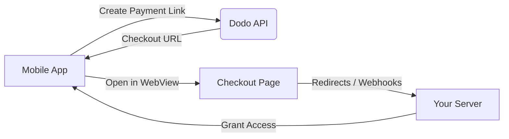

## Einführung

Dodo Payments ermöglicht Entwicklern den Verkauf digitaler Waren und Dienstleistungen in iOS-Apps und kümmert sich um komplexe Aspekte wie Steuerkonformität, Währungsumrechnung und Auszahlungen. Dieser umfassende Leitfaden beschreibt, wie Sie Dodo Payments in Ihre iOS-App integrieren, insbesondere für SaaS-Tools, Inhaltsabonnements und digitale Dienstleistungen.

## Übersicht

Dodo Payments fungiert als Ihr **Merchant of Record (MoR)** und verwaltet kritische Aspekte Ihres digitalen Geschäfts:

<Tabs>
<Tab title="Was wir übernehmen">
- Steuererhebung und -abführung (USt, GST und andere regionale Steuern)
- Globale Zahlungen gemäß Richtlinien und lokalen Zahlungsmethoden
- Währungsumrechnung und Devisenhandel
- Rückbuchungen und Betrugsprävention
- Rechnungsstellung und Quittungen für Endkunden
- Einhaltung regionaler Vorschriften
</Tab>

<Tab title="Was Sie erhalten">
- Eine einheitliche API für Web- und Mobilplattformen
- Unterstützung für In-App-Checkouts (UPI, Karten, Wallets, BNPL)
- Unterstützung für globale Auszahlungen (Payoneer, Wise, lokale Banküberweisungen)
- Analytik- und Reporting-Dashboard
- Sichere Zahlungsabwicklung
</Tab>
</Tabs>

## Anwendungsfälle

<CardGroup cols={2}>
<Card title="Abonnements" icon="repeat">
- Zugriff auf Premium-Inhalte oder -Funktionen
- Wiederkehrende Abrechnung mit flexiblen Optionen, kostenlose Testversionen, anteilige Abrechnung oder Upgrades und Downgrades
</Card>

<Card title="Kurse und Lernen" icon="graduation-cap">
- Zugang pro Kurs
- Bündelung von Inhalts-Paketen
- Lebenslange oder erneuerbare Lizenzen
- Integration zur Fortschrittsverfolgung
</Card>

<Card title="Digitale Downloads" icon="download">
- Einmalige Käufe (PDFs, Musik, Tools)
- Lieferung digitaler Assets
- Lizenzschlüsselverwaltung
</Card>

<Card title="SaaS-Tools" icon="screwdriver-wrench">
- Software-as-a-Service-Abonnements
- Nutzungsgestützte Abrechnung
- Team- und Unternehmenspläne
</Card>
</CardGroup>

## Integrationsablauf

Sie können Dodo Payments in Ihre App integrieren, indem Sie unsere gehostete Checkout- oder In-App-Browserlösung verwenden.

### Integrationsschritte

<Steps>
<Step title="Mobile App zu Dodo API">
Der Prozess beginnt damit, dass die mobile App einen Zahlungslink erstellt, indem sie mit der Dodo API interagiert.
</Step>

<Step title="Dodo API zu Mobile App">
Die Dodo API antwortet, indem sie eine Checkout-URL an die mobile App zurückgibt.
</Step>

<Step title="Mobile App zur Checkout-Seite">
Die mobile App öffnet dann diese Checkout-URL innerhalb eines WebViews, wodurch der Benutzer zur Checkout-Seite geleitet wird.
</Step>

<Step title="Checkout-Seite zu Ihrem Server">
Nach Abschluss des Checkout-Prozesses kommuniziert die Checkout-Seite über Weiterleitungen oder Webhooks mit Ihrem Server.
</Step>

<Step title="Ihr Server zu Mobile App">
Schließlich gewährt Ihr Server Zugriff auf die gekauften Inhalte oder Dienstleistungen und schließt den Transaktionszyklus in der mobilen App ab.
</Step>
</Steps>

<Card title="Mobile Integrationsleitfaden" icon="mobile" href="/developer-resources/mobile-integration">
Für eine vollständige Entwickleranleitung, erkunden Sie unseren Mobile Integrationsleitfaden.
</Card>

## Regionale Verfügbarkeit

Dodo Payments ermöglicht alternative In-App-Kaufabläufe nur in App Store-Regionen, in denen Apple ausdrücklich externe Zahlungen erlaubt oder wo eine regulatorische oder gerichtliche Anordnung dies vorschreibt.

### Unterstützte Regionen

<AccordionGroup>
<Accordion title="Vereinigte Staaten">
Unterstützt im Rahmen der aktuellen gerichtlichen Anordnungen und Apples aktualisierten Richtlinien.

- Verfügbar unter bestimmten gerichtlich angeordneten Bestimmungen
- Unterliegt der Einhaltung rechtlicher Anforderungen durch Apple
- Muss den Implementierungsrichtlinien von Apple folgen
</Accordion>

<Accordion title="Europäische Union (EU) App Store">
Unterstützt über Apples EU Alternative Terms und External Purchase Entitlement.

- Aktiviert durch Apples EU Alternative Terms
- Erfordert die Genehmigung des External Purchase Entitlement
- Muss den Anforderungen des EU-Digital Markets Act entsprechen
</Accordion>

<Accordion title="Südkorea">
Unterstützt über das StoreKit External Purchase Entitlement für Korea-spezifische Binärdateien.

- Verfügbar über das StoreKit External Purchase Entitlement
- Erfordert eine Korea-spezifische App-Binärdatei
- Muss den koreanischen Telekommunikationsgesetzen entsprechen
</Accordion>
</AccordionGroup>

<Warning>
Überprüfen Sie immer die regionalspezifischen Berechtigungen und Anforderungen von App Store Connect von Apple, bevor Sie Dodo Payments für einen Store aktivieren. Die Verwendung alternativer Zahlungsabläufe in nicht unterstützten Regionen kann zur Ablehnung oder Entfernung der App führen.
</Warning>

<Note>
Für einige Geschäftsmodelle - wie Dienstleistungen oder bestimmte Kategorien von Inhalten - kann Apple die Verwendung von In-App-Käufen (IAP) überhaupt nicht verlangen. Dodo Payments unterstützt auch diese Modelle. Überprüfen Sie immer die Klassifizierung Ihrer App und die neuesten Richtlinien von Apple, um festzustellen, ob IAP für Ihren Anwendungsfall obligatorisch ist.
</Note>

### Mehr erfahren

Für eine detaillierte Aufschlüsselung globaler Richtlinien, rechtlicher Präzedenzfälle und strategischer Ansätze zur Umgehung von App Store-Gebühren, siehe unseren umfassenden Leitfaden:

<Card title="Umgehung von App Store- & Play Store-Gebühren: Ein strategisches und rechtliches Handbuch" icon="shield-check" href="/features/bypassing-app-store-fees">
Erfahren Sie, wo und wie Sie alternative Zahlungsabläufe rechtlich implementieren können, mit aktuellen regionalen Leitfäden und Compliance-Tipps.
</Card>