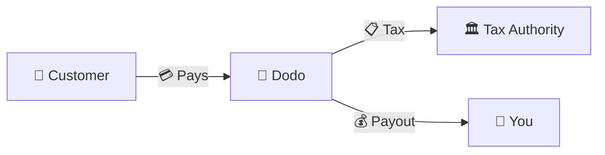
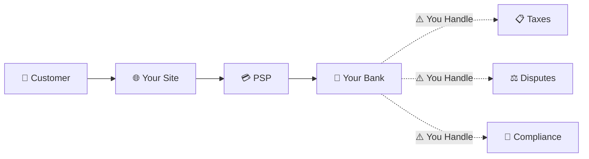
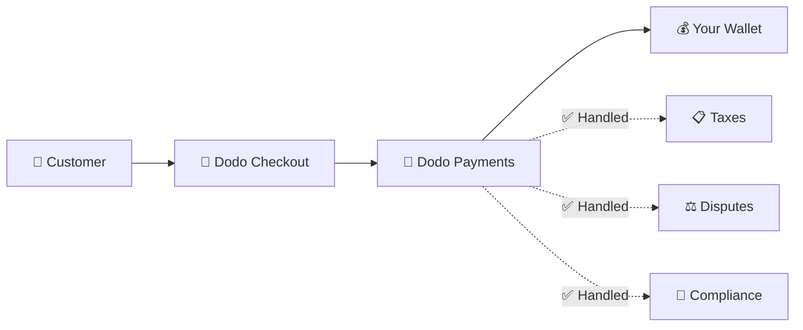
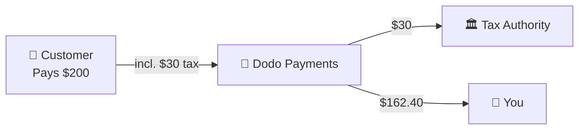

Dodo Payments agiert als **Merchant of Record (MoR)** — wir werden der rechtliche Verkäufer Ihrer digitalen Produkte und übernehmen die Verantwortung für Zahlungen, Steuern, Betrug und Compliance, damit Sie sich vollständig auf den Aufbau Ihres Produkts konzentrieren können.

<CardGroup cols={3}>
Steuer-Compliance wird automatisch gehandhabt
</Card>

{/* LOCKED_PATTERN_a7f32ee62695527a537b82d99f01c4bc */}
Karten, Wallets und lokale Zahlungsmethoden
</Card>

{/* LOCKED_PATTERN_cb6e35d755bb02c3f1254b1c5a9c4c73 */}
Wir erledigen sämtliche Überweisungen
</Card>
</CardGroup>

## Was ist ein Merchant of Record?

Ein **Merchant of Record** ist die rechtliche Einheit, die auf dem Kreditkartenabrechnungsbeleg Ihres Kunden erscheint und die Verantwortung für die Transaktion übernimmt. Wenn Sie Dodo Payments als Ihren MoR verwenden:

- **Wir sind der rechtliche Verkäufer** — Dodo erscheint auf Bankauszügen und Quittungen
- **Sie sind der Produktentwickler** — Sie erstellen, bepreisen und liefern Ihr Produkt
- **Wir kümmern uns um die Backoffice-Aufgaben** — Steuern, Streitigkeiten, Compliance und Abrechnungsunterstützung
- **Sie erhalten Nettobezahlungen** — Einnahmen werden direkt auf Ihr Konto überwiesen

<Note>
Stellen Sie sich einen Merchant of Record als ein globales Finanzteam vor, das Rechnungsstellung, Steuern und Abrechnung in jedem Land übernimmt — ohne dass Sie einen Finger rühren müssen.
</Note>

## Warum einen Merchant of Record verwenden?

Der Verkauf digitaler Produkte weltweit bedeutet, sich mit der Mehrwertsteuer in Europa, GST in Australien, Umsatzsteuer in den USA und unzähligen anderen Anforderungen auseinanderzusetzen. Jede Jurisdiktion hat unterschiedliche Regeln, Sätze, Schwellenwerte und Fristen für die Einreichung.

| Ihre Verantwortung | Ohne MoR | Mit Dodo als MoR |
|---------------------|:-----------:|:----------------:|
| VAT/GST Registrierung | ❌ Sie | ✅ Dodo |
| Steuerberechnung | ❌ Sie | ✅ Dodo |
| Steuererklärung & Abgabe | ❌ Sie | ✅ Dodo |
| Rückbuchungsrisiko | ❌ Sie | ✅ Dodo |
| PCI-Konformität | ❌ Sie | ✅ Dodo |
| Multi-Währungsunterstützung | ❌ Komplex | ✅ Integriert |
| Lokale Zahlungsmethoden | ❌ Jede integrieren | ✅ 30+ enthalten |

<Tip>
**Beispiel**: Verkaufen Sie einem französischen Kunden ein 50 €/Monat-Abonnement?

**Ohne MoR**: Registrieren Sie sich für die französische Mehrwertsteuer, berechnen Sie 60 € (20 % Mehrwertsteuer), reichen Sie vierteljährliche französische Erklärungen ein, kümmern Sie sich um Prüfungen — auf Französisch.

**Mit Dodo**: Wir erheben 60 €, führen 10 € Mehrwertsteuer an Frankreich ab und zahlen Ihnen 50 € abzüglich Gebühren. Sie schreiben Code.
</Tip>

## PSP vs. MoR: Wichtige Unterschiede

Es ist wichtig, den Unterschied zwischen einem **Zahlungsdienstleister** (wie Stripe) und einem **Merchant of Record** zu verstehen.

### Zahlungsdienstleister (PSP)

Ein PSP verarbeitet Transaktionen, lässt Sie jedoch als rechtlichen Verkäufer:

<Warning>
Bei einem PSP sind **Sie** für Steuerregistrierung, -einzug, -erklärung und -abführung in jeder Gerichtsbarkeit verantwortlich, in der Sie Kunden haben.
</Warning>

### Merchant of Record (Dodo)

Ein MoR wird der rechtliche Verkäufer und kümmert sich um die Compliance von Anfang bis Ende:

<Check>
Mit Dodo als MoR übernehmen wir Steuern, Streitfälle und Compliance. Sie erhalten Nettobeträge ohne Papierkram.
</Check>

### Vergleich nebeneinander

| Aspekt | PSP (Stripe, etc.) | MoR (Dodo) |
|--------|:------------------:|:----------:|
| Rechtlicher Verkäufer | Ihr Unternehmen | Dodo |
| Auf Kundenabrechnung | Ihr Name | Dodo |
| Steuerregistrierung | ❌ Sie | ✅ Dodo |
| Steuerberechnung | ❌ Sie | ✅ Dodo |
| Steuerabgabe | ❌ Sie | ✅ Dodo |
| Rückbuchungsrisiko | ❌ Sie | ✅ Dodo |
| PCI-Konformität | ❌ Sie | ✅ Dodo |
| Einrichtung für global | Komplex | Einfach |

<Info>
**Wichtig**: Sowohl PSPs als auch MoRs bearbeiten Zahlungsabwicklung. Der entscheidende Unterschied ist, **wer rechtlich verantwortlich** für steuerliche Compliance und Transaktionshaftung ist.
</Info>

## Wie Steuerkonformität funktioniert

Dodo kümmert sich automatisch um den gesamten Steuerlebenszyklus:

<Steps>
{/* LOCKED_PATTERN_9939f53f87faa28f5e85c7bcd4aa5d90 */}
Wir erkennen das Land des Kunden und bestimmen, welche Steuervorschriften gelten – MwSt., GST, Umsatzsteuer oder andere lokale Anforderungen.
</Step>

{/* LOCKED_PATTERN_70142fc485c0e1d535a43e599b490143 */}
Der korrekte Steuersatz wird anhand des Produkttyps, des Kundenstandorts und des B2B/B2C-Status berechnet. EU-Geschäftskunden mit gültigen Umsatzsteuer-Identifikationsnummern erhalten automatisch das Reverse-Charge-Verfahren.
</Step>

{/* LOCKED_PATTERN_44b82b1d71e9f255cf562f67916ee9b7 */}
Die Steuer wird beim Checkout klar angezeigt und erhoben. Kunden sehen genau, was sie bezahlen.
</Step>

{/* LOCKED_PATTERN_1a778e95cb3812007334c0b47194f9ac */}
Wir reichen Steuererklärungen ein und zahlen die erhobenen Steuern planmäßig an die zuständigen Behörden. Sie sehen nie ein Steuerformular.
</Step>
</Steps>

## Einnahmenfluss

So bewegt sich das Geld vom Kunden auf Ihr Konto:

### Beispiel für die Auszahlung aufgeschlüsselt

| Posten | Betrag |
|-----------|-------:|
| Kundenzahlung | 200,00 $ |
| Umsatzsteuer (15 % Mehrwertsteuer) | −30,00 $ |
| Dodo-Plattformgebühr (4 %) | −8,00 $ |
| Zahlungsabwicklung | −0,60 $ |
| **Ihre Auszahlung** | **162,40 $** |

## Wann MoR vs. PSP wählen

<Tabs>
{/* LOCKED_PATTERN_1d2e428d12b1ee53f2d946d9302bede1 */}
**Dodo Payments ist ideal, wenn Sie:**

- Digitale Produkte, SaaS oder Abonnements verkaufen
- Kunden in mehreren Ländern haben
- Steuerregistrierungskopfschmerzen vermeiden wollen
- Vorhersehbare, ausgelagerte Compliance bevorzugen
- Eine schnelle Markteinführung wichtiger als maximale Kontrolle ist
- Keine Streitfälle und Betrug verwalten möchten
</Tab>

{/* LOCKED_PATTERN_9020967e8e2c9a3ebc575f4072e18e76 */}
**Ein PSP könnte zu Ihnen passen, wenn Sie:**

- Hauptsächlich in einem Land tätig sind
- Eigene Finanz- und Compliance-Teams haben
- Absolute Kontrolle über die Checkout-UX benötigen
- Mit äußerst knappen Margen arbeiten
- Physische Güter verkaufen (MoRs konzentrieren sich auf Digitales)
</Tab>
</Tabs>

<Note>
Viele Unternehmen beginnen mit einem PSP und wechseln zu einem MoR, wenn sie international wachsen. Dodo bietet Migrationsunterstützung, um diesen Übergang nahtlos zu gestalten.
</Note>

## Häufig gestellte Fragen

<AccordionGroup>
{/* LOCKED_PATTERN_03db007d1397fc75cc7c059a12f7514d */}
Dodo Payments tritt als Händler auf. Wir fügen Ihre Produkt-/Markenreferenz dort ein, wo Zeichengrenzen es zulassen, und Kunden erhalten detaillierte Belege mit Ihren Produktinformationen.
</Accordion>

{/* LOCKED_PATTERN_14efbd55af6b9971cc9bb290118d1ce5 */}
Ja. Sie steuern Preisgestaltung, Branding, Produktlieferung und direkte Kommunikation. Dodo übernimmt die Abrechnungsmechanik, aber Kunden wissen, dass sie bei Ihnen kaufen. Ihre Marke erscheint prominent im Checkout, in E-Mails und Rechnungen.
</Accordion>

{/* LOCKED_PATTERN_5e87ff5ce15f8c25ec293008878ec1c8 */}
Bei B2B-Verkäufen in der EU können Kunden im Checkout ihre Umsatzsteuer-Identifikationsnummer eingeben. Wir validieren sie und wenden automatisch Reverse Charge an – die Steuer wird auf die Umsatzsteuererklärung des Käufers verlagert, statt erhoben zu werden.
</Accordion>

{/* LOCKED_PATTERN_828a96aed23c294d40585d542017c689 */}
Dodo agiert als Komplettlösung mithilfe unserer Zahlungsinfrastruktur. Diese Integration ermöglicht es uns, Steuer- und Betrugshaftung zu übernehmen. Wir arbeiten daran, zukünftig eine Integration mit anderen Zahlungsanbietern bereitzustellen.
</Accordion>

{/* LOCKED_PATTERN_7d718a1b657f28e952148f962ca6593e */}
Leiten Sie Rückerstattungen über Ihr Dashboard ein. Wir bearbeiten die Rückerstattung in der ursprünglichen Zahlungsmethode und Währung des Kunden. Steuerbeträge werden automatisch angepasst und abgestimmt.
</Accordion>

{/* LOCKED_PATTERN_dc7f113144600495109fc2c229c89f70 */}
Dodo übernimmt **Umsatzsteuern** (MwSt., GST, Sales Tax) bei Kundentransaktionen. Sie bleiben verantwortlich für die Einkommensteuer, Körperschaftsteuer und steuerlichen Verpflichtungen in Bezug auf die Auszahlungen, die Sie erhalten.
</Accordion>

{/* LOCKED_PATTERN_04ec30ba2875e1ca25e9a1ae1dcc112d */}
Wir akzeptieren Zahlungen aus über 220 Ländern und Regionen und bauen kontinuierlich aus. Sehen Sie die vollständige Liste:

{/* LOCKED_PATTERN_1baa59aa331aff639990872bb61046bd */}
Sehen Sie alle 220+ Länder und Regionen, in denen wir Zahlungen akzeptieren.
</Card>
</Accordion>
</AccordionGroup>

## Loslegen

<CardGroup cols={2}>
{/* LOCKED_PATTERN_a6e00712f4bf1e0645985bccec8d5def */}
Kostenlos anmelden und in wenigen Minuten globale Zahlungen akzeptieren.
</Card>

{/* LOCKED_PATTERN_d858044e80838a32f52c51b21b17f5eb */}
Detaillierter Vergleich mit Beispielen und Anwendungsfällen.
</Card>

{/* LOCKED_PATTERN_4e501d9df0a1b75ab7c08a16b87219c5 */}
Erfahren Sie, welche Unternehmen wir unterstützen.
</Card>

{/* LOCKED_PATTERN_6053eaa23d9fa4210c02c58e94af8536 */}
Erhalten Sie persönliche Beratung von unserem Team.
</Card>
</CardGroup>
