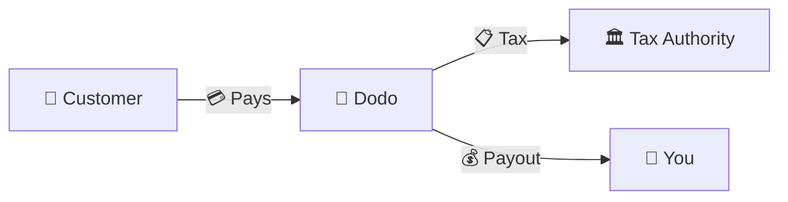
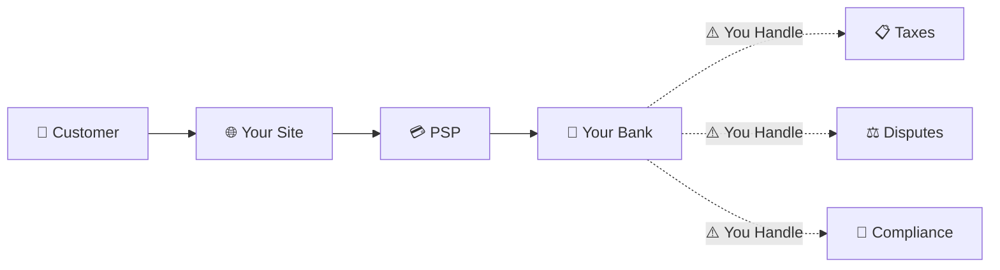
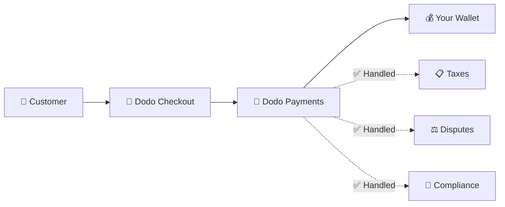
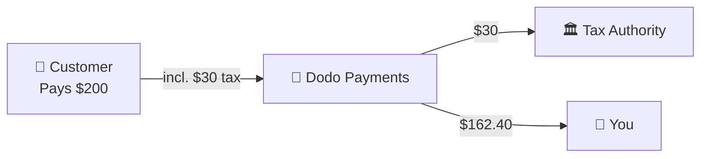

Dodo Payments agiert als **Merchant of Record (MoR)** — wir werden der rechtliche Verkäufer Ihrer digitalen Produkte und übernehmen die Verantwortung für Zahlungen, Steuern, Betrug und Compliance, damit Sie sich vollständig auf den Aufbau Ihres Produkts konzentrieren können.

<CardGroup cols={3}>
<Card title="220+ Regionen" icon="globe">
Steuerkonformität wird automatisch behandelt
</Card>

<Card title="30+ Zahlungsmethoden" icon="credit-card">
Karten, Wallets und lokale Methoden
</Card>

<Card title="Keine Steuererklärung" icon="file-invoice">
Wir kümmern uns um alle Abgaben
</Card>
</CardGroup>

## Was ist ein Merchant of Record?

Ein **Merchant of Record** ist die rechtliche Einheit, die auf dem Kreditkartenabrechnungsbeleg Ihres Kunden erscheint und die Verantwortung für die Transaktion übernimmt. Wenn Sie Dodo Payments als Ihren MoR verwenden:

- **Wir sind der rechtliche Verkäufer** — Dodo erscheint auf Bankauszügen und Quittungen
- **Sie sind der Produktentwickler** — Sie erstellen, bepreisen und liefern Ihr Produkt
- **Wir kümmern uns um die Backoffice-Aufgaben** — Steuern, Streitigkeiten, Compliance und Abrechnungsunterstützung
- **Sie erhalten Nettobezahlungen** — Einnahmen werden direkt auf Ihr Konto überwiesen

<Note>
Betrachten Sie einen Merchant of Record als ein globales Finanzteam, das Rechnungsstellung, Steuern und Abrechnung in jedem Land übernimmt — ohne dass Sie einen Finger rühren müssen.
</Note>

## Warum einen Merchant of Record verwenden?

Der Verkauf digitaler Produkte weltweit bedeutet, sich mit der Mehrwertsteuer in Europa, GST in Australien, Umsatzsteuer in den USA und unzähligen anderen Anforderungen auseinanderzusetzen. Jede Jurisdiktion hat unterschiedliche Regeln, Sätze, Schwellenwerte und Fristen für die Einreichung.

| Ihre Verantwortung | Ohne MoR | Mit Dodo als MoR |
|---------------------|:-----------:|:----------------:|
| VAT/GST Registrierung | ❌ Sie | ✅ Dodo |
| Steuerberechnung | ❌ Sie | ✅ Dodo |
| Steuererklärung & Abgabe | ❌ Sie | ✅ Dodo |
| Rückbuchungsrisiko | ❌ Sie | ✅ Dodo |
| PCI-Konformität | ❌ Sie | ✅ Dodo |
| Multi-Währungsunterstützung | ❌ Komplex | ✅ Integriert |
| Lokale Zahlungsmethoden | ❌ Jede integrieren | ✅ 30+ enthalten |

<Tip>
**Beispiel**: Verkaufen Sie ein Abonnement für 50 €/Monat an einen französischen Kunden?

**Ohne MoR**: Registrieren Sie sich für die französische Mehrwertsteuer, berechnen Sie 60 € (20 % Mehrwertsteuer), reichen Sie vierteljährliche französische Erklärungen ein, kümmern Sie sich um Prüfungen — auf Französisch.

**Mit Dodo**: Wir erheben 60 €, überweisen 10 € Mehrwertsteuer nach Frankreich und zahlen Ihnen 50 € abzüglich Gebühren. Sie schreiben Code.
</Tip>

## PSP vs. MoR: Wichtige Unterschiede

Es ist wichtig, den Unterschied zwischen einem **Zahlungsdienstleister** (wie Stripe) und einem **Merchant of Record** zu verstehen.

### Zahlungsdienstleister (PSP)

Ein PSP verarbeitet Transaktionen, lässt Sie jedoch als rechtlichen Verkäufer:

<Warning>
Mit einem PSP sind **Sie** verantwortlich für die Steuerregistrierung, -erhebung, -einreichung und -abgabe in jeder Jurisdiktion, in der Sie Kunden haben.
</Warning>

### Merchant of Record (Dodo)

Ein MoR wird der rechtliche Verkäufer und kümmert sich um die Compliance von Anfang bis Ende:

<Check>
Mit Dodo als MoR kümmern wir uns um Steuern, Streitigkeiten und Compliance. Sie erhalten Nettobezahlungen ohne Papierkram.
</Check>

### Vergleich nebeneinander

| Aspekt | PSP (Stripe, etc.) | MoR (Dodo) |
|--------|:------------------:|:----------:|
| Rechtlicher Verkäufer | Ihr Unternehmen | Dodo |
| Auf Kundenabrechnung | Ihr Name | Dodo |
| Steuerregistrierung | ❌ Sie | ✅ Dodo |
| Steuerberechnung | ❌ Sie | ✅ Dodo |
| Steuerabgabe | ❌ Sie | ✅ Dodo |
| Rückbuchungsrisiko | ❌ Sie | ✅ Dodo |
| PCI-Konformität | ❌ Sie | ✅ Dodo |
| Einrichtung für global | Komplex | Einfach |

<Info>
**Wichtig**: Sowohl PSPs als auch MoRs kümmern sich um die Zahlungsabwicklung. Der entscheidende Unterschied ist, **wer rechtlich verantwortlich** für die Steuerkonformität und die Haftung für Transaktionen ist.
</Info>

## Wie Steuerkonformität funktioniert

Dodo kümmert sich automatisch um den gesamten Steuerlebenszyklus:

<Steps>
<Step title="Kundenstandort">
Wir erkennen das Land des Kunden und bestimmen, welche Steuervorschriften gelten — Mehrwertsteuer, GST, Umsatzsteuer oder andere lokale Anforderungen.
</Step>

<Step title="Satzberechnung">
Der korrekte Steuersatz wird basierend auf Produkttyp, Kundenstandort und B2B/B2C-Status berechnet. EU-Geschäftskunden mit gültigen Mehrwertsteuernummern erhalten die Umkehrbesteuerung angewendet.
</Step>

<Step title="Erhebung an der Kasse">
Die Steuer wird klar angezeigt und an der Kasse erhoben. Kunden sehen genau, was sie bezahlen.
</Step>

<Step title="Einreichung & Abgabe">
Wir reichen Erklärungen ein und zahlen die erhobenen Steuern pünktlich an die zuständigen Behörden. Sie sehen niemals ein Steuerformular.
</Step>
</Steps>

## Einnahmenfluss

So bewegt sich das Geld vom Kunden auf Ihr Konto:

### Beispiel für die Auszahlung aufgeschlüsselt

| Posten | Betrag |
|-----------|-------:|
| Kundenzahlung | 200,00 $ |
| Umsatzsteuer (15 % Mehrwertsteuer) | −30,00 $ |
| Dodo-Plattformgebühr (4 %) | −8,00 $ |
| Zahlungsabwicklung | −0,60 $ |
| **Ihre Auszahlung** | **162,40 $** |

## Wann MoR vs. PSP wählen

<Tabs>
<Tab title="Wählen Sie Dodo (MoR)">
**Dodo Payments ist ideal, wenn Sie:**

- Digitale Produkte, SaaS oder Abonnements verkaufen
- Kunden in mehreren Ländern haben
- Steuerregistrierungsprobleme vermeiden möchten
- Vorhersehbare, ausgelagerte Compliance bevorzugen
- Geschwindigkeit auf den Markt über maximale Kontrolle schätzen
- Keine Streitigkeiten und Betrug verwalten möchten
</Tab>

<Tab title="Erwägen Sie einen PSP">
**Ein PSP könnte zu Ihnen passen, wenn Sie:**

- Hauptsächlich in einem Land tätig sind
- Über interne Finanz- und Compliance-Teams verfügen
- Absolute Kontrolle über das Checkout-UX benötigen
- Mit extrem dünnen Margen arbeiten
- Physische Waren verkaufen (MoRs konzentrieren sich auf digitale Produkte)
</Tab>
</Tabs>

<Note>
Viele Unternehmen beginnen mit einem PSP und wechseln zu einem MoR, wenn sie international skalieren. Dodo bietet Unterstützung bei der Migration, um diesen Übergang nahtlos zu gestalten.
</Note>

## Häufig gestellte Fragen

<AccordionGroup>
<Accordion title="Was erscheint auf dem Kreditkartenabrechnungsbeleg meines Kunden?">
Dodo Payments erscheint als der Händler. Wir fügen Ihre Produkt-/Markenreferenz hinzu, wo es die Zeichenbeschränkungen zulassen, und Kunden erhalten detaillierte Quittungen, die Ihre Produktinformationen zeigen.
</Accordion>

<Accordion title="Besitze ich weiterhin die Kundenbeziehung?">
Ja. Sie kontrollieren Preisgestaltung, Branding, Produktlieferung und direkte Kommunikation. Dodo kümmert sich um die Abrechnungsmechanik, aber die Kunden wissen, dass sie bei Ihnen kaufen. Ihre Marke erscheint prominent im Checkout, in E-Mails und Rechnungen.
</Accordion>

<Accordion title="Wie funktioniert die Umkehrbesteuerung bei B2B-Mehrwertsteuer?">
Bei B2B-Verkäufen in der EU können Kunden ihre Mehrwertsteuernummer an der Kasse eingeben. Wir validieren sie und wenden automatisch die Umkehrbesteuerung an — die Steuer wird auf die Mehrwertsteuererklärung des Käufers verschoben, anstatt erhoben zu werden.
</Accordion>

<Accordion title="Kann ich meinen eigenen Zahlungsanbieter verwenden?">
Dodo fungiert als vollständige Lösung unter Verwendung unserer Zahlungsinfrastruktur. Diese Integration ermöglicht es uns, die Steuer- und Betrugsverantwortung zu übernehmen. Wir arbeiten daran, in Zukunft eine Integration mit anderen Zahlungsanbietern anzubieten.
</Accordion>

<Accordion title="Wie funktionieren Rückerstattungen?">
Initiieren Sie Rückerstattungen von Ihrem Dashboard aus. Wir verarbeiten die Rückerstattung in der ursprünglichen Zahlungsmethode und Währung des Kunden. Steuerbeträge werden automatisch angepasst und abgeglichen.
</Accordion>

<Accordion title="Was ist mit meiner Einkommenssteuer?">
Dodo kümmert sich um **Umsatzsteuern** (Mehrwertsteuer, GST, Umsatzsteuer) auf Kunden Transaktionen. Sie bleiben verantwortlich für die Einkommenssteuer Ihres Unternehmens, Körperschaftsteuer und Steuerverpflichtungen auf die Zahlungen, die Sie erhalten.
</Accordion>

<Accordion title="In welche Länder kann ich verkaufen?">
Wir akzeptieren Zahlungen aus über 220 Ländern und Regionen mit kontinuierlicher Expansion. Sehen Sie die vollständige Liste:

<Card title="Unterstützte Regionen" icon="globe" href="/miscellaneous/list-of-countries-we-accept-payments-from">
Sehen Sie alle 220+ Länder und Regionen, aus denen wir Zahlungen akzeptieren.
</Card>
</Accordion>
</AccordionGroup>

## Loslegen

<CardGroup cols={2}>
<Card title="Konto erstellen" icon="rocket" href="https://app.dodopayments.com/signup">
Melden Sie sich kostenlos an und akzeptieren Sie globale Zahlungen in wenigen Minuten.
</Card>

<Card title="MoR vs PG Vertiefung" icon="scale-balanced" href="/features/mor-vs-pg">
Detaillierter Vergleich mit Beispielen und Anwendungsfällen.
</Card>

<Card title="Akzeptanzrichtlinie" icon="building-shield" href="/miscellaneous/merchant-acceptance">
Erfahren Sie, welche Unternehmen wir unterstützen.
</Card>

<Card title="Sprechen Sie mit uns" icon="envelope" href="mailto:founders@dodopayments.com">
Erhalten Sie persönliche Unterstützung von unserem Team.
</Card>
</CardGroup>
