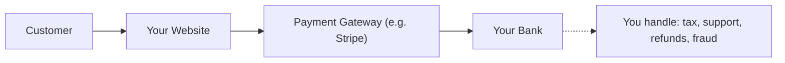
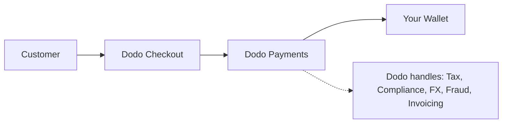

## Einführung

Dieser Leitfaden vergleicht das MoR-Modell mit dem traditionellen Payment Gateway-Ansatz und hilft Ihnen, die Vorteile zu verstehen, die Dodo Payments Ihrem Unternehmen bietet.

## Der Kernunterschied

| Funktion                          | MoR (Dodo Payments)         | Payment Gateway (Traditionelles PG)           |
|----------------------------------|--------------------------------------------|--------------------------------------------|
| Rechtlicher Verkäufer             | Dodo Payments (MoR)                        | Ihr Unternehmen                               |
| Steuererhebung & -abführung      | Von Dodo übernommen                            | Sie sind verantwortlich                        |
| Compliance & regulatorische Last  | Dodo übernimmt die Haftung                     | Sie kümmern sich um lokale Gesetze und Rückbuchungen      |
| Abrechnungswährung               | USD, EUR, INR und 25+ weitere unterstützt    | Hängt von Ihrem Händlerkonto ab           |
| Risikomanagement                 | Eingebaute Betrugs- und Rückbuchungsschutz   | Sie richten Ihre eigenen Tools ein (z. B. Stripe Radar) |
| Auszahlungen                     | Aggregierte und vereinfachte globale Auszahlungen   | Direkt vom PG an Sie, mit Bankeinrichtung     |

## Was es für Sie bedeutet

Mit **Dodo als MoR** werden wir der rechtliche Verkäufer für Ihre Kunden, was Ihnen ermöglicht:

- Die Einrichtung lokaler Einheiten zu überspringen
- Die Handhabung von Mehrwertsteuer, GST oder Verkaufssteuer zu vermeiden
- Mehr Zahlungsmethoden weltweit anzubieten
- Rechtliche Risiken zu reduzieren
- Schneller in neuen Märkten zu starten

<Note>
Stellen Sie sich vor, Sie verkaufen einem Nutzer in Frankreich ein digitales Abonnement. Mit Dodo Payments übernehmen wir die Zahlung, melden die Mehrwertsteuer an die französischen Behörden und überweisen Ihnen den Nettoumsatz. Keine Steuerprobleme. Keine Anwälte. Nur Wachstum.
</Note>

Darüber hinaus vereinfacht das MoR-Modell Ihr gesamtes Backoffice. Als Ihr MoR kümmert sich Dodo um die PCI-Compliance, Betrugserkennung, Währungsumrechnung und sogar um die Kundenabrechnung, sodass Ihr Team sich auf Produkt und Wachstum konzentrieren kann.

## Visueller Vergleich

**Umsatzfluss: Payment Gateway**

**Umsatzfluss: Merchant of Record (Dodo)**

## Warum es für SaaS- und digitale Unternehmen wichtig ist

Wenn Ihr Unternehmen wächst, kann die Verwaltung von Steuern, Compliance und globalen Zahlungspräferenzen überwältigend werden. Mit einem Payment Gateway sind Sie verantwortlich für:

- Mehrwertsteuer/GST-Registrierung und -einreichung in mehreren Jurisdiktionen
- Verwaltung von Währungsumrechnung und Rückbuchungen
- Bereitstellung lokalisierter Checkout- und Zahlungsmethoden

Mit Dodo Payments als Ihrem MoR:
- Erweitern Sie global, ohne lokale Einheiten einzurichten
- Steuern werden in Ihrem Namen berechnet, erhoben und abgeführt
- Sie erhalten Zugang zu einer Bibliothek von Zahlungsmethoden, die auf Ihre Kunden zugeschnitten sind
- Wir fungieren als Ihr rechtlicher Puffer und operativer Partner

<Tip>
„Betrachten Sie ein Zahlungs-Gateway als Tunnel. Stellen Sie sich nun den Merchant of Record als Tunnel, Zug, Fahrer und Ticketpersonal in einem vor.“
</Tip>

## Wer sollte MoR verwenden?

Dodo Payments ist perfekt für:
- SaaS- und digitale Produktunternehmen
- Indie-Schöpfer und Solopreneure
- Globale Unternehmen mit Kunden in über 100 Ländern
- Unternehmen, die Steuern und Compliance nicht intern verwalten möchten

Wenn Sie international expandieren, Abonnements verkaufen oder einfach nur betriebliche Kopfschmerzen reduzieren möchten, ist MoR die klügere Wahl.

## Wann stattdessen ein Payment Gateway verwenden

Es gibt Fälle, in denen die Verwendung eines reinen Payment Gateways sinnvoll sein könnte:
- Ihr Unternehmen operiert nur in einem Land
- Sie haben bereits interne Finanz- und Compliance-Ressourcen
- Sie benötigen vollständige Kontrolle über das Kundenerlebnis bei der Abrechnung
- Sie sind sehr kostenempfindlich mit dünnen Margen im großen Maßstab

<Note>
Für viele Startups mag ein Gateway zunächst ausreichen – doch mit zunehmender Komplexität kann ein Umstieg auf einen MoR Zeit sparen, Risiken reduzieren und das internationale Wachstum beschleunigen.
</Note>

## Warum Dodo Payments wählen

Dodo Payments bietet:
- Eine All-in-One-Lösung für Zahlungen, Steuern und Compliance
- Echtzeit-FX- und Multi-Währungsunterstützung
- Zugang zu über 30 Zahlungsmethoden
- Sitzbasierte Abrechnung, Abonnements und Einmalzahlungen
- Automatisierte Steuerabwicklung in über 150 Ländern
- Eingebaute Betrugsprävention und PCI-Compliance

Egal, ob Sie ein alleiniger Gründer oder ein wachsendes SaaS-Team sind, Dodo vereinfacht die Komplexität des globalen Verkaufs.

## Mehr erfahren

<CardGroup cols={2}>
{/* LOCKED_PATTERN_255f37658964531eef93d79ee5d8bb7a */}
Erfahren Sie, wie Dodo automatisch Preise in den lokalen Währungen Ihrer Kunden präsentiert
</Card>

{/* LOCKED_PATTERN_9bf5b254a8af251551af21558f3421ad */}
Entdecken Sie die über 30 Zahlungsmethoden, die über Dodo Payments verfügbar sind
</Card>
</CardGroup>

## Bereit zum Wechsel?

Schließen Sie sich über 3.000 digitalen Unternehmen an, die Dodo Payments nutzen, um global zu verkaufen, ohne Grenzen oder Engpässe.

<CardGroup cols={2}>
{/* LOCKED_PATTERN_2d2ae952f85e9d3c5861b83c7818a666 */}
Erstellen Sie noch heute Ihr Dodo Payments-Konto und beginnen Sie weltweit zu verkaufen
</Card>

{/* LOCKED_PATTERN_f3b5e9c6689a9ef5e4b14f5eeed286a7 */}
Erhalten Sie personalisierte Unterstützung von unserem Team
</Card>
</CardGroup>

<Tip>
Lassen Sie Dodo die schwierigen Aufgaben übernehmen – damit Sie sich darauf konzentrieren können, ein großartiges Produkt zu entwickeln.
</Tip>