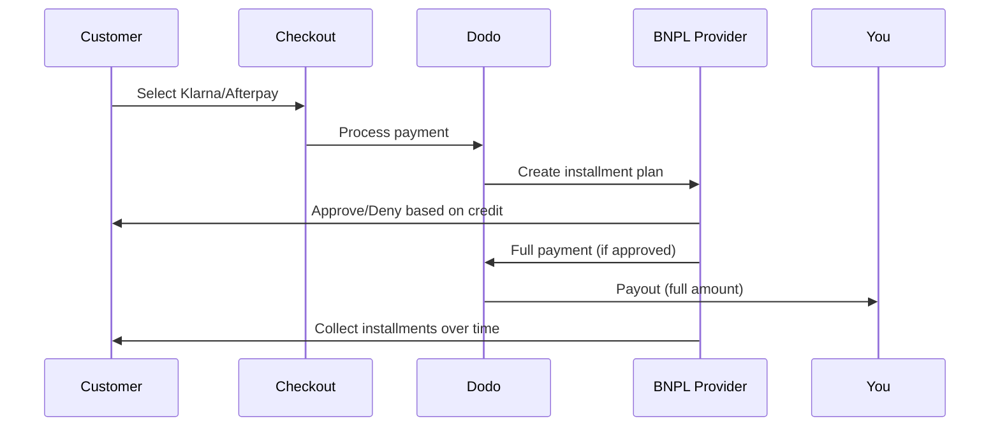

Jetzt kaufen, später bezahlen (BNPL) ermöglicht es Kunden, Käufe in zinsfreie Raten zu unterteilen, wodurch der durchschnittliche Bestellwert um 20-50% und die Conversion-Rate um 10-30% für berechtigte Transaktionen erhöht wird.

## Warum BNPL anbieten?

<CardGroup cols={3}>
<Card title="Höherer AOV" icon="chart-line">
Kunden geben mehr aus, wenn sie Zahlungen über die Zeit verteilen können. Der durchschnittliche Bestellwert steigt um 20-50%.
</Card>

<Card title="Bessere Conversion" icon="percent">
Entfernung von Zahlungsproblemen beim Checkout. Die Conversion-Raten verbessern sich um 10-30% bei hochpreisigen Artikeln.
</Card>

<Card title="Null Risiko" icon="shield-check">
BNPL-Anbieter übernehmen das Kreditrisiko und das Inkasso. Sie erhalten die volle Zahlung im Voraus.
</Card>
</CardGroup>

## Unterstützte Anbieter

### Klarna

| Funktion | Einzelheiten |
| :------ | :------ |
| **Verfügbarkeit** | USA + 19 europäische Länder |
| **Währungen** | USD, EUR, GBP, DKK, NOK, SEK, CZK, RON, PLN, CHF |
| **Mindestbetrag** | 50,01 USD (oder Äquivalent) |
| **Abonnements** | Nein |

**Unterstützte Länder:** Österreich, Belgien, Tschechische Republik, Dänemark, Finnland, Frankreich, Deutschland, Griechenland, Irland, Italien, Niederlande, Norwegen, Polen, Portugal, Rumänien, Spanien, Schweden, Schweiz, Vereinigtes Königreich, Vereinigte Staaten

**Zahlungsoptionen:**
- **In 4 Raten zahlen** — Aufteilen in 4 zinsfreie Zahlungen
- **In 30 Tagen zahlen** — Vollständige Zahlung fällig in 30 Tagen
- **Finanzierung** — Langfristige Ratenpläne

### Afterpay (Clearpay)

| Funktion | Einzelheiten |
| :------ | :------ |
| **Verfügbarkeit** | USA, UK |
| **Währungen** | USD, GBP |
| **Mindestbetrag** | 50,01 USD (oder Äquivalent) |
| **Abonnements** | Nein |

**Zahlungsoptionen:**
- **In 4 Raten zahlen** — 4 zinsfreie Zahlungen alle 2 Wochen

<Note>
Im Vereinigten Königreich operiert Afterpay als "Clearpay", verwendet jedoch denselben API-Typ (`afterpay_clearpay`).
</Note>

### Billie

| Funktion | Einzelheiten |
| :------ | :------ |
| **Verfügbarkeit** | Global |
| **Währungen** | GBP |
| **Mindestbetrag** | Keine |
| **Abonnements** | Nein |

**Über Billie:**
Billie ist eine B2B-Now-Pay-Later-Lösung, die Unternehmen ermöglicht, ihren Kunden flexible Zahlungsbedingungen anzubieten. Sie ist für Geschäftstransaktionen konzipiert, bei denen Käufer rechnungsbasierte Zahlungsoptionen benötigen.

**Zahlungsoptionen:**
- **Rechnungszahlung** — Zahlung innerhalb der vereinbarten Zahlungsbedingungen
- **Flexible Bedingungen** — Kundenfreundliche Zahlungspläne

## Konfiguration

### API-Methodentypen

| Typ | Anbieter |
| :--- | :------- |
| `klarna` | Klarna |
| `afterpay_clearpay` | Afterpay / Clearpay |
| `billie` | Billie (B2B) |

### Beispiel

```javascript
const session = await client.checkoutSessions.create({
  product_cart: [{ product_id: 'prod_123', quantity: 1 }],
  allowed_payment_method_types: [
    'klarna',
    'afterpay_clearpay',
    'credit',
    'debit'
  ],
  customer: {
    email: 'customer@example.com',
    name: 'Jane Smith'
  },
  billing_address: {
    country: 'US',
    zipcode: '10001'
  },
  return_url: 'https://example.com/success'
});
```

<Warning>
Fügen Sie immer `credit` und `debit` als Fallbacks hinzu. Nicht alle Kunden sind für BNPL berechtigt, und Transaktionen unter 50,01 USD qualify nicht.
</Warning>

## Mindesttransaktionsbetrag

**Sowohl Klarna als auch Afterpay erfordern einen Mindestbetrag von 50,01 USD** (oder Äquivalent in unterstützten Währungen).

Transaktionen unter diesem Schwellenwert:
- BNPL-Optionen erscheinen nicht an der Kasse
- Es wird kein Fehler ausgelöst — Optionen werden einfach nicht angezeigt
- Kartenzahlungen bleiben verfügbar

Dies ist das erwartete Verhalten. Schließen Sie BNPL nicht in `allowed_payment_method_types` für Produkte unter 50 USD ein.

## So funktionieren Ratenzahlungen



**Wichtige Punkte:**
- Sie erhalten die **volle Zahlung im Voraus** vom BNPL-Anbieter
- Der BNPL-Anbieter übernimmt **Kreditrisiko und Inkasso**
- Der Kunde zahlt direkt an den Anbieter über **4 Raten** (in der Regel)
- **Keine Rückbuchungen** aufgrund von Ratenfehlern — das ist das Risiko des Anbieters

## Testen

### Klarna Testdaten

Verwenden Sie diese Daten im Testmodus:

| Feld | Genehmigt | Abgelehnt |
| :---- | :------- | :----- |
| **Geburtsdatum** | 07-10-1970 | 07-10-1970 |
| **Vorname** | Test | Test |
| **Nachname** | Person-us | Person-us |
| **E-Mail** | customer@email.us | customer+denied@email.us |
| **Straße** | Amsterdam Ave | Amsterdam Ave |
| **Hausnummer** | 509 | 509 |
| **Stadt** | New York | New York |
| **Bundesstaat** | New York | New York |
| **Postleitzahl** | 10024-3941 | 10024-3941 |
| **Telefon** | +13106683312 | +13106354386 |

<Note>
Die Transaktion muss mindestens 50 USD betragen, damit Klarna als Option angezeigt wird.
</Note>

### Afterpay-Testen

<Steps>
<Step title="Wählen Sie Afterpay">
Wählen Sie Afterpay an der Kasse und klicken Sie auf Bezahlen.
</Step>

<Step title="Erfolgreiche Zahlung">
Verwenden Sie eine beliebige gültige E-Mail- und Versandadresse.
</Step>

<Step title="Fehlgeschlagene Authentifizierung">
Um einen Fehler zu testen: Schließen Sie das Afterpay-Modul auf der Weiterleitungsseite. Der Zahlungsstatus wechselt zu `requires_payment_method`.
</Step>
</Steps>

## Beste Praktiken

<AccordionGroup>
<Accordion title="Ziel hochpreisige Artikel">
BNPL funktioniert am besten für Produkte von 100-1000 USD. Das Wertversprechen von "Zahlung über Zeit" ist in diesem Bereich am überzeugendsten.
</Accordion>

<Accordion title="Installationsbeträge anzeigen">
"4 Zahlungen von 25 USD" ist überzeugender als "$100 mit Klarna". Zeigen Sie den Betrag pro Zahlung an, wenn möglich.
</Accordion>

<Accordion title="Zwingen Sie BNPL nicht für Produkte mit niedrigem Wert">
Unter 50 USD erscheint BNPL ohnehin nicht. Unter 100 USD bevorzugen die meisten Kunden Karten. Konzentrieren Sie die BNPL-Werbung auf hochpreisige Artikel.
</Accordion>

<Accordion title="Rechnungsadresse sammeln">
BNPL-Anbieter benötigen Rechnungsinformationen für Bonitätsprüfungen. Stellen Sie sicher, dassIhr Checkout vollständige Adressdetails erfasst.
</Accordion>

<Accordion title="Klare Erwartungen setzen">
Die Kunden sollten verstehen, dass sie einen Kreditvertrag mit Klarna/Afterpay eingehen, nicht mit Ihnen.
</Accordion>
</AccordionGroup>

## Einschränkungen

### Keine Abonnements
BNPL-Zahlungsmethoden **unterstützen keine wiederkehrenden Zahlungen**. Für Abonnementprodukte verwenden Sie Karten oder andere wiederkehrend kompatible Methoden.

### Kreditbasierte Genehmigung
BNPL-Anbieter führen sofortige Bonitätsprüfungen durch. Nicht alle Kunden werden genehmigt. Genehmigungsraten variieren nach:
- Kreditgeschichte des Kunden beim Anbieter
- Transaktionsbetrag
- Standort des Kunden

### Währungsbeschränkungen
| Anbieter | Währungen |
| :------- | :--------- |
| Klarna | USD, EUR, GBP, DKK, NOK, SEK, CZK, RON, PLN, CHF |
| Afterpay | USD, GBP |

## Fehlersuche

<AccordionGroup>
<Accordion title="BNPL erscheint nicht an der Kasse">
**Überprüfen Sie:**
1. Transaktionsbetrag mindestens 50,01 USD?
2. Befindet sich der Kundenstandort im unterstützten Land?
3. Währung wird vom BNPL-Anbieter unterstützt?
4. Ist die BNPL-Methode in `allowed_payment_method_types` enthalten?

**Lösung:** Am häufigsten liegt die Transaktion unter dem Mindestbetrag. Überprüfen Sie, ob der Betrag die Schwelle von 50,01 USD erfüllt.
</Accordion>

<Accordion title="Kunde von BNPL-Anbieter abgelehnt">
**Ursachen:**
- Unzureichende Kreditgeschichte beim Anbieter
- Zu viele aktive Ratenpläne
- Fehlgeschlagene Identitätsüberprüfung

**Lösung:** Dies ist für einige Kunden zu erwarten. Stellen Sie sicher, dass Karten-Fallbacks verfügbar sind. Zeigen Sie keine spezifischen Ablehnungsgründe an.
</Accordion>

<Accordion title="Zahlung hängt in der Warteschlange fest">
**Ursache:** Der Kunde hat den Authentifizierungsprozess beim BNPL-Anbieter nicht abgeschlossen.

**Lösung:** Die Zahlung läuft ab und schlägt fehl. Der Kunde kann es erneut versuchen oder eine andere Methode verwenden.
</Accordion>
</AccordionGroup>

## Verwandte Seiten

<CardGroup cols={2}>
<Card title="Übersicht der Zahlungsmethoden" icon="credit-card" href="/features/payment-methods">
Alle unterstützten Zahlungsmethoden anzeigen.
</Card>

<Card title="Checkout-Anleitung" icon="book" href="/developer-resources/checkout-session">
Vollständige Anleitung zur Implementierung des Checkouts.
</Card>

<Card title="Testprozess" icon="flask" href="/miscellaneous/testing-process">
Alle Testdaten für Zahlungsmethoden.
</Card>

<Card title="Adaptive Währung" icon="globe" href="/features/adaptive-currency">
Währungsunterstützung und -umrechnung.
</Card>
</CardGroup>