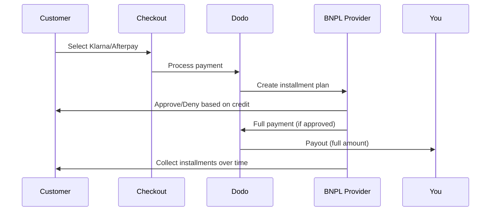

Jetzt kaufen, später bezahlen (BNPL) ermöglicht es Kunden, Käufe in zinsfreie Raten zu unterteilen, wodurch der durchschnittliche Bestellwert um 20-50% und die Conversion-Rate um 10-30% für berechtigte Transaktionen erhöht wird.

## Warum BNPL anbieten?

<CardGroup cols={3}>
{/* LOCKED_PATTERN_b97f9be1eb159e011a6342413e37bd80 */}
Kunden geben mehr aus, wenn sie Zahlungen über die Zeit verteilen können. Der durchschnittliche Bestellwert steigt um 20–50 %.
</Card>

{/* LOCKED_PATTERN_b8dc04ad87db956cb850399b43c82817 */}
Entfernung von Zahlungsreibung beim Checkout. Die Conversion-Rate verbessert sich um 10–30 % bei hochpreisigen Artikeln.
</Card>

{/* LOCKED_PATTERN_e1c4683cab6a6bdfa91140cb62e2921c */}
BNPL-Anbieter übernehmen das Kreditrisiko und Inkasso. Sie erhalten die volle Zahlung im Voraus.
</Card>
</CardGroup>

## Unterstützte Anbieter

### Klarna

| Funktion | Einzelheiten |
| :------ | :------ |
| **Verfügbarkeit** | USA + 19 europäische Länder |
| **Währungen** | USD, EUR, GBP, DKK, NOK, SEK, CZK, RON, PLN, CHF |
| **Mindestbetrag** | 50,01 USD (oder Äquivalent) |
| **Abonnements** | Nein |

**Unterstützte Länder:** Österreich, Belgien, Tschechische Republik, Dänemark, Finnland, Frankreich, Deutschland, Griechenland, Irland, Italien, Niederlande, Norwegen, Polen, Portugal, Rumänien, Spanien, Schweden, Schweiz, Vereinigtes Königreich, Vereinigte Staaten

**Zahlungsoptionen:**
- **In 4 Raten zahlen** — Aufteilen in 4 zinsfreie Zahlungen
- **In 30 Tagen zahlen** — Vollständige Zahlung fällig in 30 Tagen
- **Finanzierung** — Langfristige Ratenpläne

### Afterpay (Clearpay)

| Funktion | Einzelheiten |
| :------ | :------ |
| **Verfügbarkeit** | USA, UK |
| **Währungen** | USD, GBP |
| **Mindestbetrag** | 50,01 USD (oder Äquivalent) |
| **Abonnements** | Nein |

**Zahlungsoptionen:**
- **In 4 Raten zahlen** — 4 zinsfreie Zahlungen alle 2 Wochen

<Note>
Im Vereinigten Königreich tritt Afterpay unter dem Namen „Clearpay“ auf, verwendet aber denselben API-Typ (`afterpay_clearpay`).
</Note>

### Billie

| Funktion | Einzelheiten |
| :------ | :------ |
| **Verfügbarkeit** | Global |
| **Währungen** | GBP |
| **Mindestbetrag** | Keine |
| **Abonnements** | Nein |

**Über Billie:**
Billie ist eine B2B-Now-Pay-Later-Lösung, die Unternehmen ermöglicht, ihren Kunden flexible Zahlungsbedingungen anzubieten. Sie ist für Geschäftstransaktionen konzipiert, bei denen Käufer rechnungsbasierte Zahlungsoptionen benötigen.

**Zahlungsoptionen:**
- **Rechnungszahlung** — Zahlung innerhalb der vereinbarten Zahlungsbedingungen
- **Flexible Bedingungen** — Kundenfreundliche Zahlungspläne

## Konfiguration

### API-Methodentypen

| Typ | Anbieter |
| :--- | :------- |
| `klarna` | Klarna |
| `afterpay_clearpay` | Afterpay / Clearpay |
| `billie` | Billie (B2B) |

### Beispiel

```javascript
const session = await client.checkoutSessions.create({
  product_cart: [{ product_id: 'prod_123', quantity: 1 }],
  allowed_payment_method_types: [
    'klarna',
    'afterpay_clearpay',
    'credit',
    'debit'
  ],
  customer: {
    email: 'customer@example.com',
    name: 'Jane Smith'
  },
  billing_address: {
    country: 'US',
    zipcode: '10001'
  },
  return_url: 'https://example.com/success'
});
```

<Warning>
Fügen Sie immer `credit` und `debit` als Fallbacks ein. Nicht alle Kunden sind für BNPL berechtigt, und Transaktionen unter $50,01 qualifizieren sich nicht.
</Warning>

## Mindesttransaktionsbetrag

**Sowohl Klarna als auch Afterpay erfordern einen Mindestbetrag von 50,01 USD** (oder Äquivalent in unterstützten Währungen).

Transaktionen unter diesem Schwellenwert:
- BNPL-Optionen erscheinen nicht an der Kasse
- Es wird kein Fehler ausgelöst — Optionen werden einfach nicht angezeigt
- Kartenzahlungen bleiben verfügbar

Dies ist erwartetes Verhalten. Nehmen Sie BNPL nicht in `allowed_payment_method_types` für Produkte unter $50 auf.

## So funktionieren Ratenzahlungen



**Wichtige Punkte:**
- Sie erhalten die **volle Zahlung im Voraus** vom BNPL-Anbieter
- Der BNPL-Anbieter übernimmt **Kreditrisiko und Inkasso**
- Der Kunde zahlt direkt an den Anbieter über **4 Raten** (in der Regel)
- **Keine Rückbuchungen** aufgrund von Ratenfehlern — das ist das Risiko des Anbieters

## Testen

### Klarna Testdaten

Verwenden Sie diese Daten im Testmodus:

| Feld | Genehmigt | Abgelehnt |
| :---- | :------- | :----- |
| **Geburtsdatum** | 07-10-1970 | 07-10-1970 |
| **Vorname** | Test | Test |
| **Nachname** | Person-us | Person-us |
| **E-Mail** | customer@email.us | customer+denied@email.us |
| **Straße** | Amsterdam Ave | Amsterdam Ave |
| **Hausnummer** | 509 | 509 |
| **Stadt** | New York | New York |
| **Bundesstaat** | New York | New York |
| **Postleitzahl** | 10024-3941 | 10024-3941 |
| **Telefon** | +13106683312 | +13106354386 |

<Note>
Die Transaktion muss mindestens $50 betragen, damit Klarna als Option angezeigt wird.
</Note>

### Afterpay-Testen

<Steps>
{/* LOCKED_PATTERN_50be67b06aca0719749c0148b14ededb */}
Wählen Sie beim Checkout Afterpay und klicken Sie auf Bezahlen.
</Step>

{/* LOCKED_PATTERN_e69c9723c2cfe705ec0ec6c279278116 */}
Verwenden Sie eine beliebige gültige E-Mail-Adresse und Versandadresse.
</Step>

{/* LOCKED_PATTERN_f705651ecb928289d18b7053fe33fbad */}
Zum Testen eines Fehlers: Schließen Sie das Afterpay-Modal auf der Weiterleitungsseite. Der Zahlungsstatus wechselt zu `requires_payment_method`.
</Step>
</Steps>

## Beste Praktiken

<AccordionGroup>
{/* LOCKED_PATTERN_fbd77987b33e84be7392d40b156b399b */}
BNPL funktioniert am besten für Produkte im Bereich von $100–$1000. Der Wertverspruch „über die Zeit bezahlen“ ist in diesem Bereich am überzeugendsten.
</Accordion>

{/* LOCKED_PATTERN_73212def30811547cb4565bbe3cf9728 */}
„4 Zahlungen à $25“ ist überzeugender als „$100 mit Klarna“. Zeigen Sie nach Möglichkeit den Betrag pro Zahlung an.
</Accordion>

{/* LOCKED_PATTERN_b91d7612271491e0d73908c4d5f59440 */}
Unter $50 erscheint BNPL ohnehin nicht. Unter $100 bevorzugen die meisten Kunden Karten. Konzentrieren Sie die BNPL-Bewerbung auf höherpreisige Artikel.
</Accordion>

{/* LOCKED_PATTERN_09f1d72b973f5ae340cb9d61176e092c */}
BNPL-Anbieter benötigen Rechnungsinformationen für Bonitätsprüfungen. Stellen Sie sicher, dass Ihr Checkout vollständige Adressdaten erfasst.
</Accordion>

{/* LOCKED_PATTERN_40dceba4d9d5358ae7f9b7ccd887c8b1 */}
Kunden sollten verstehen, dass sie einen Kreditvertrag mit Klarna/Afterpay und nicht mit Ihnen eingehen.
</Accordion>
</AccordionGroup>

## Einschränkungen

### Keine Abonnements
BNPL-Zahlungsmethoden **unterstützen keine wiederkehrenden Zahlungen**. Für Abonnementprodukte verwenden Sie Karten oder andere wiederkehrend kompatible Methoden.

### Kreditbasierte Genehmigung
BNPL-Anbieter führen sofortige Bonitätsprüfungen durch. Nicht alle Kunden werden genehmigt. Genehmigungsraten variieren nach:
- Kreditgeschichte des Kunden beim Anbieter
- Transaktionsbetrag
- Standort des Kunden

### Währungs- & Ländermapping

Jede Währung ist auf die entsprechende Region beschränkt:

| Währung | Unterstützte Länder |
| :------- | :------------------ |
| **USD** | Nur Vereinigte Staaten |
| **EUR** | Alle unterstützten europäischen Länder (Österreich, Belgien, Tschechien, Dänemark, Finnland, Frankreich, Deutschland, Griechenland, Irland, Italien, Niederlande, Norwegen, Polen, Portugal, Rumänien, Spanien, Schweden, Schweiz) |
| **GBP** | Vereinigtes Königreich und alle unterstützten europäischen Länder |

Andere von Klarna unterstützte Währungen (DKK, NOK, SEK, CZK, RON, PLN, CHF) funktionieren in ihren jeweiligen Ländern.

{/* LOCKED_PATTERN_6fa96040307d68e9fa44436559d63ee8 */}
Beispielsweise zeigt eine USD-Transaktion BNPL-Optionen nur Kunden in den USA an. Eine EUR-Transaktion zeigt BNPL-Optionen in allen unterstützten europäischen Ländern an. Eine GBP-Transaktion zeigt BNPL-Optionen Kunden im Vereinigten Königreich und allen unterstützten europäischen Ländern an.
{/* LOCKED_PATTERN_07427f62e4e59df6149fbd24d60de439 */}

| Anbieter | Unterstützte Währungen |
| :------- | :------------------- |
| Klarna | USD, EUR, GBP, DKK, NOK, SEK, CZK, RON, PLN, CHF |
| Afterpay | USD (US), GBP (UK) |

## Fehlersuche

<AccordionGroup>
{/* LOCKED_PATTERN_4de1f796f92552e68d790659c1400cdb */}
**Überprüfen:**
1. Liegt der Transaktionsbetrag bei mindestens $50,01?
2. Befindet sich der Kunde in einem unterstützten Land?
3. Wird die Währung vom BNPL-Anbieter unterstützt?
4. Ist die BNPL-Methode in `allowed_payment_method_types` enthalten?

**Lösung:** Häufig liegt die Transaktion unter dem Minimum. Stellen Sie sicher, dass der Betrag die $50,01-Schwelle erreicht.
</Accordion>

{/* LOCKED_PATTERN_d83228e73178d33af019cc137eea6331 */}
**Ursachen:**
- Unzureichende Kreditgeschichte beim Anbieter
- Zu viele aktive Ratenpläne
- Fehlgeschlagene Identitätsprüfung

**Lösung:** Dies ist bei manchen Kunden zu erwarten. Stellen Sie sicher, dass Karten als Fallback verfügbar sind. Geben Sie keine spezifischen Ablehnungsgründe preis.
</Accordion>

{/* LOCKED_PATTERN_b83fcfa7ee1d57953629ef78553f40c7 */}
**Ursache:** Der Kunde hat den Authentifizierungsprozess mit dem BNPL-Anbieter nicht abgeschlossen.

**Lösung:** Die Zahlung läuft ab und schlägt fehl. Der Kunde kann es erneut versuchen oder eine andere Methode wählen.
</Accordion>
</AccordionGroup>

## Verwandte Seiten

<CardGroup cols={2}>
{/* LOCKED_PATTERN_014d7e4ef5d99df996cbbae24da710a6 */}
Alle unterstützten Zahlungsmethoden ansehen.
</Card>

{/* LOCKED_PATTERN_15f99901a394e4ce133a078d90e6360d */}
Vollständige Anleitung zur Checkout-Implementierung.
</Card>

{/* LOCKED_PATTERN_969f11f876a6712c92c3c11cb433bf1f */}
Alle Testdaten für Zahlungsmethoden.
</Card>

{/* LOCKED_PATTERN_0da642f750ba9399c6c82f3cf51c812c */}
Währungsunterstützung und -umrechnung.
</Card>
</CardGroup>