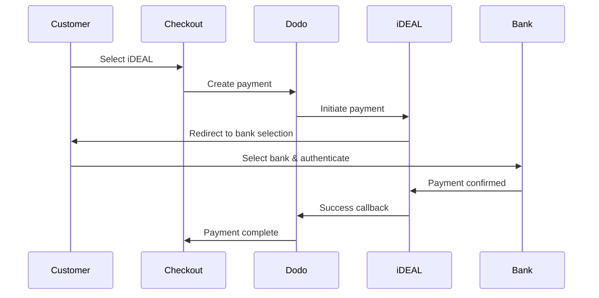

Europäische Kunden bevorzugen stark lokale Zahlungsmethoden, die sich in ihre Banksysteme integrieren. Diese Methoden anzubieten, kann die Konversionsraten in Zielmärkten um 20-40 % erhöhen.

## Warum lokale europäische Zahlungsmethoden?

<CardGroup cols={3}>
{/* LOCKED_PATTERN_efcf455d16a3d54177d3ce475c882342 */}
iDEAL erfasst ~60 % der niederländischen Online-Zahlungen. Wenn Sie es nicht anbieten, verlieren Sie Kunden.
</Card>

{/* LOCKED_PATTERN_6b22bf3bf0cf724ac8ed217c65843a32 */}
Bankauthentifizierte Zahlungen haben nahezu null Betrugsraten und keine Rückbuchungen.
</Card>

{/* LOCKED_PATTERN_4a1acead7202a8a596c7a76e46cacb00 */}
Die meisten europäischen Methoden liefern sofortige Zahlungsbestätigungen.
</Card>
</CardGroup>

## Unterstützte Methoden

| Methode | Land | Marktanteil | Währung | Abonnements |
| :----- | :------ | :----------- | :------- | :-----------: |
| **iDEAL** | Niederlande | ~60% | EUR | Nein |
| **Bancontact** | Belgien | ~50% | EUR | Nein |
| **EPS** | Österreich | ~30% | EUR | Nein |
| **Multibanco** | Portugal | ~40% | EUR | Nein |

## iDEAL (Niederlande)

iDEAL ist die dominierende Online-Zahlungsmethode in den Niederlanden und verbindet sich direkt mit allen großen niederländischen Banken.

### Funktionsweise



### Unterstützte Banken

Alle großen niederländischen Banken werden unterstützt:
- ABN AMRO
- ASN Bank
- Bunq
- ING
- Knab
- Rabobank
- RegioBank
- Revolut
- SNS
- Triodos Bank
- Van Lanschot

### Konfiguration

```javascript
const session = await client.checkoutSessions.create({
  product_cart: [{ product_id: 'prod_123', quantity: 1 }],
  allowed_payment_method_types: ['ideal', 'credit', 'debit'],
  billing_currency: 'EUR',
  billing_address: {
    country: 'NL',
    zipcode: '1012JS'
  },
  return_url: 'https://example.com/success'
});
```

## Bancontact (Belgien)

Bancontact ist das nationale Zahlungssystem Belgiens, das von nahezu allen belgischen Banken für Online-Zahlungen genutzt wird.

### Funktionen
- Funktioniert mit bestehenden belgischen Debitkarten
- Unterstützung durch Mobile Apps (Payconiq von Bancontact)
- Sofortige Zahlungsbestätigung
- Keine zusätzliche Registrierung für Kunden erforderlich

### Konfiguration

```javascript
const session = await client.checkoutSessions.create({
  product_cart: [{ product_id: 'prod_123', quantity: 1 }],
  allowed_payment_method_types: ['bancontact_card', 'credit', 'debit'],
  billing_currency: 'EUR',
  billing_address: {
    country: 'BE',
    zipcode: '1000'
  },
  return_url: 'https://example.com/success'
});
```

## EPS (Österreich)

EPS (Electronic Payment Standard) ermöglicht direkte Online-Banküberweisungen für österreichische Kunden.

### Funktionen
- Direkte Integration mit österreichischen Banken
- Echtzeit-Zahlungsbestätigung
- Hohe Vertrauenswürdigkeit bei österreichischen Verbrauchern
- Keine Rückbuchungen

### Unterstützte Banken

Wichtige österreichische Banken, darunter:
- Erste Bank
- Bank Austria
- Raiffeisen
- BAWAG
- Volksbank

### Konfiguration

```javascript
const session = await client.checkoutSessions.create({
  product_cart: [{ product_id: 'prod_123', quantity: 1 }],
  allowed_payment_method_types: ['eps', 'credit', 'debit'],
  billing_currency: 'EUR',
  billing_address: {
    country: 'AT',
    zipcode: '1010'
  },
  return_url: 'https://example.com/success'
});
```

## Multibanco (Portugal)

Multibanco ist Portugals Interbanken-Netzwerk, das sowohl Online-Zahlungen als auch Zahlungen über Geldautomaten anbietet.

### Zahlungsoptionen

1. **Online-Banking** — Direkte Banküberweisung über Internet-Banking
2. **Zahlung am Geldautomaten** — Kunde erhält eine Referenz, um an jedem Multibanco-Geldautomaten zu zahlen
3. **Mobile Banking** — Zahlung über Bank-Apps

### Funktionsweise der Geldautomaten-Zahlung

Bei Zahlungen am Geldautomaten erhält der Kunde eine Zahlungsreferenz:

```
Entity: 12345
Reference: 123 456 789
Amount: €50.00
Expiry: 24 hours
```

Der Kunde kann an jedem portugiesischen Geldautomaten oder über Internet-Banking mit dieser Referenz bezahlen.

### Konfiguration

```javascript
const session = await client.checkoutSessions.create({
  product_cart: [{ product_id: 'prod_123', quantity: 1 }],
  allowed_payment_method_types: ['multibanco', 'credit', 'debit'],
  billing_currency: 'EUR',
  billing_address: {
    country: 'PT',
    zipcode: '1000-001'
  },
  return_url: 'https://example.com/success'
});
```

<Note>
Multibanco-Geldautomaten-Zahlungen können eine Verzögerung zwischen Checkout und tatsächlicher Zahlung aufweisen. Überwachen Sie Webhooks zur Zahlungsbestätigung.
</Note>

## API-Methode Typen

| Typ | Methode | Land |
| :--- | :----- | :------ |
| `ideal` | iDEAL | Netherlands |
| `bancontact_card` | Bancontact | Belgium |
| `eps` | EPS | Austria |
| `multibanco` | Multibanco | Portugal |

## Multi-Länder europäischer Checkout

Für Unternehmen, die mehrere europäische Länder bedienen, schließen Sie alle regionalen Methoden ein:

```javascript
const session = await client.checkoutSessions.create({
  product_cart: [{ product_id: 'prod_123', quantity: 1 }],
  allowed_payment_method_types: [
    'ideal',           // Netherlands
    'bancontact_card', // Belgium
    'eps',             // Austria
    'multibanco',      // Portugal
    'credit',          // Fallback
    'debit'            // Fallback
  ],
  billing_currency: 'EUR',
  return_url: 'https://example.com/success'
});
```

Dodo zeigt automatisch nur die relevanten Methoden basierend auf dem Standort des Kunden an. Ein niederländischer Kunde sieht iDEAL; ein belgischer Kunde sieht Bancontact.

## Testen

Europäische Zahlungsmethoden können im Sandbox-Modus getestet werden. Der Testablauf simuliert den Bankauthentifizierungsprozess.

<Steps>
{/* LOCKED_PATTERN_540056f13df545529727751bb5b93f77 */}
Verwenden Sie Ihre Test-API-Schlüssel von Dodo Payments.
</Step>

{/* LOCKED_PATTERN_7920d15f7caeeea70ea62bd0d8d57403 */}
Setzen Sie das Land der Rechnungsadresse so, dass es zur Zahlungsmethode passt:
- `NL` für iDEAL
- `BE` für Bancontact
- `AT` für EPS
- `PT` für Multibanco
</Step>

{/* LOCKED_PATTERN_69cef9ebb6025284f3e6858b286f99d9 */}
Folgen Sie im Testumfeld dem simulierten Bankauthentifizierungsablauf.
</Step>
</Steps>

## Beste Praktiken

<AccordionGroup>
{/* LOCKED_PATTERN_6e39e352c5d82a18aefb4abc54215eac */}
Wenn Sie an niederländische Kunden verkaufen, schließen Sie iDEAL ein. Das Weglassen entspricht dem Nichtakzeptieren von Visa in den USA – Sie verlieren erhebliche Umsätze.
</Accordion>

{/* LOCKED_PATTERN_9c635a5b2c09ad8acceb0ae222fad819 */}
Europäische Zahlungsmethoden erfordern EUR. Stellen Sie sicher, dass Ihre Preisgestaltung Euro-Transaktionen unterstützt.
</Accordion>

{/* LOCKED_PATTERN_5a50cae3439b9921374aaa8c0461b4a3 */}
Alle europäischen Methoden leiten zu Bankseiten weiter. Sorgen Sie dafür, dass Ihre Rücksprung-URL robust ist und Nutzer berücksichtigt, die den Ablauf abbrechen.
</Accordion>

{/* LOCKED_PATTERN_3a32b87fb89df99c7fb6cbcd532fcd01 */}
Nicht allen europäischen Kunden stehen diese regionalen Methoden zur Verfügung (Touristen, Expats usw.). Bieten Sie immer `credit` und `debit` als Alternativen an.
</Accordion>

{/* LOCKED_PATTERN_f4321c6674f862219007fe7c6201edc2 */}
Multibanco-Geldautomaten-Zahlungen können Stunden dauern. Blockieren Sie die Erfüllung nicht wegen einer sofortigen Zahlung – verwenden Sie Webhooks für asynchrone Bestätigung.
</Accordion>
</AccordionGroup>

## Fehlersuche

<AccordionGroup>
{/* LOCKED_PATTERN_ccd66af742dc9530dea0480f544f049c */}
**Prüfen:**
1. Stimmt das Rechnungsland des Kunden mit dem Land der Methode überein?
2. Ist die Währung auf EUR eingestellt?
3. Ist die Methode in `allowed_payment_method_types` enthalten?

**Lösung:** Europäische Methoden sind streng regional. Ein Kunde mit Rechnungsland `DE` (Deutschland) sieht iDEAL nicht, da es ausschließlich für die Niederlande ist.
</Accordion>

{/* LOCKED_PATTERN_e65da29a30abf8b0bab16429c0abbf51 */}
**Ursachen:**
- Kunde hat während der Bankauthentifizierung abgebrochen
- Das Authentifizierungssystem der Bank war vorübergehend nicht verfügbar
- Kunde hat falsche Zugangsdaten eingegeben

**Lösung:** Kunde sollte erneut versuchen. Bei anhaltenden Problemen empfehlen Sie eine andere Zahlungsmethode.
</Accordion>

{/* LOCKED_PATTERN_6ec718ef8b359d908bb220922e56ef7a */}
**Ursachen:**
- Kunde hat den Browser während der Weiterleitung zur Bank geschlossen
- Netzwerkprobleme während der Authentifizierung
- Rücksprung-URL falsch konfiguriert

**Lösung:** Überprüfen Sie, ob die Rücksprung-URL korrekt und erreichbar ist. Stellen Sie sicher, dass sie sowohl Erfolg als auch Fehlerfälle behandelt.
</Accordion>

{/* LOCKED_PATTERN_fc8a3a43e2635e2d30bc6ced94d88e30 */}
**Ursache:** Kunde erhielt Zahlungsreferenz, hat aber noch nicht bezahlt.

**Lösung:** Das ist bei Zahlungen am Geldautomaten zu erwarten. Warten Sie auf Webhook-Bestätigung. Referenz läuft typischerweise nach 24–72 Stunden ab.
</Accordion>
</AccordionGroup>

## PSD2-Konformität

Alle europäischen Zahlungsmethoden entsprechen den PSD2 (Zahlungsdiensterichtlinie 2) Vorschriften:

- **Starke Kundenauthentifizierung (SCA)** — In den Bankauthentifizierungsablauf integriert
- **Sichere Kommunikation** — Alle Daten werden über sichere Kanäle übertragen
- **Verbraucherschutz** — Vollständige Einhaltung der Verbraucherrechte der EU

## Verwandte Seiten

<CardGroup cols={2}>
{/* LOCKED_PATTERN_014d7e4ef5d99df996cbbae24da710a6 */}
Alle unterstützten Zahlungsmethoden anzeigen.
</Card>

{/* LOCKED_PATTERN_0da642f750ba9399c6c82f3cf51c812c */}
Währungsunterstützung und automatische Umrechnung.
</Card>

{/* LOCKED_PATTERN_15f99901a394e4ce133a078d90e6360d */}
Vollständige Anleitung zur Checkout-Implementierung.
</Card>

<Card title="Webhooks" icon="webhook" href="/developer-resources/webhooks">
Behandeln Sie Zahlungsbestätigungen asynchron.
</Card>
</CardGroup>