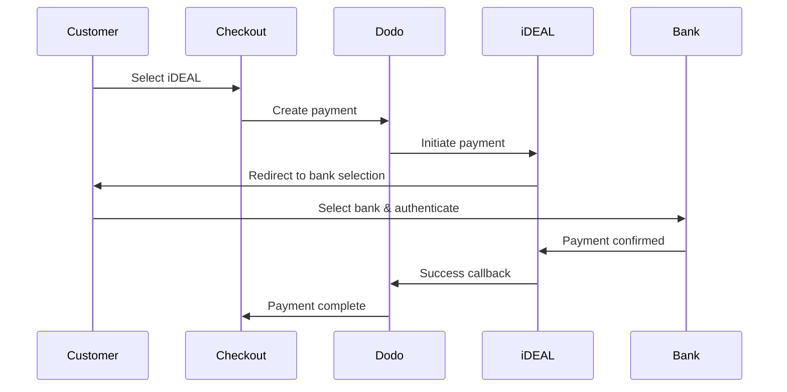

Europäische Kunden bevorzugen stark lokale Zahlungsmethoden, die sich in ihre Banksysteme integrieren. Diese Methoden anzubieten, kann die Konversionsraten in Zielmärkten um 20-40 % erhöhen.

## Warum lokale europäische Zahlungsmethoden?

<CardGroup cols={3}>
<Card title="Höhere Konversion" icon="chart-line">
Die iDEAL-Methode erfasst ~60 % der Online-Zahlungen in den Niederlanden. Sie nicht anzubieten bedeutet, Kunden zu verlieren.
</Card>

<Card title="Weniger Betrug" icon="shield-check">
Bank-authentifizierte Zahlungen haben nahezu null Betrugsraten und keine Rückbuchungen.
</Card>

<Card title="Echtzeit-Abwicklung" icon="bolt">
Die meisten europäischen Methoden bieten sofortige Zahlungsbestätigungen.
</Card>
</CardGroup>

## Unterstützte Methoden

| Methode | Land | Marktanteil | Währung | Abonnements |
| :----- | :------ | :----------- | :------- | :-----------: |
| **iDEAL** | Niederlande | ~60% | EUR | Nein |
| **Bancontact** | Belgien | ~50% | EUR | Nein |
| **EPS** | Österreich | ~30% | EUR | Nein |
| **Multibanco** | Portugal | ~40% | EUR | Nein |

## iDEAL (Niederlande)

iDEAL ist die dominierende Online-Zahlungsmethode in den Niederlanden und verbindet sich direkt mit allen großen niederländischen Banken.

### Funktionsweise



### Unterstützte Banken

Alle großen niederländischen Banken werden unterstützt:
- ABN AMRO
- ASN Bank
- Bunq
- ING
- Knab
- Rabobank
- RegioBank
- Revolut
- SNS
- Triodos Bank
- Van Lanschot

### Konfiguration

```javascript
const session = await client.checkoutSessions.create({
  product_cart: [{ product_id: 'prod_123', quantity: 1 }],
  allowed_payment_method_types: ['ideal', 'credit', 'debit'],
  billing_currency: 'EUR',
  billing_address: {
    country: 'NL',
    zipcode: '1012JS'
  },
  return_url: 'https://example.com/success'
});
```

## Bancontact (Belgien)

Bancontact ist das nationale Zahlungssystem Belgiens, das von nahezu allen belgischen Banken für Online-Zahlungen genutzt wird.

### Funktionen
- Funktioniert mit bestehenden belgischen Debitkarten
- Unterstützung durch Mobile Apps (Payconiq von Bancontact)
- Sofortige Zahlungsbestätigung
- Keine zusätzliche Registrierung für Kunden erforderlich

### Konfiguration

```javascript
const session = await client.checkoutSessions.create({
  product_cart: [{ product_id: 'prod_123', quantity: 1 }],
  allowed_payment_method_types: ['bancontact_card', 'credit', 'debit'],
  billing_currency: 'EUR',
  billing_address: {
    country: 'BE',
    zipcode: '1000'
  },
  return_url: 'https://example.com/success'
});
```

## EPS (Österreich)

EPS (Electronic Payment Standard) ermöglicht direkte Online-Banküberweisungen für österreichische Kunden.

### Funktionen
- Direkte Integration mit österreichischen Banken
- Echtzeit-Zahlungsbestätigung
- Hohe Vertrauenswürdigkeit bei österreichischen Verbrauchern
- Keine Rückbuchungen

### Unterstützte Banken

Wichtige österreichische Banken, darunter:
- Erste Bank
- Bank Austria
- Raiffeisen
- BAWAG
- Volksbank

### Konfiguration

```javascript
const session = await client.checkoutSessions.create({
  product_cart: [{ product_id: 'prod_123', quantity: 1 }],
  allowed_payment_method_types: ['eps', 'credit', 'debit'],
  billing_currency: 'EUR',
  billing_address: {
    country: 'AT',
    zipcode: '1010'
  },
  return_url: 'https://example.com/success'
});
```

## Multibanco (Portugal)

Multibanco ist Portugals Interbanken-Netzwerk, das sowohl Online-Zahlungen als auch Zahlungen über Geldautomaten anbietet.

### Zahlungsoptionen

1. **Online-Banking** — Direkte Banküberweisung über Internet-Banking
2. **Zahlung am Geldautomaten** — Kunde erhält eine Referenz, um an jedem Multibanco-Geldautomaten zu zahlen
3. **Mobile Banking** — Zahlung über Bank-Apps

### Funktionsweise der Geldautomaten-Zahlung

Bei Zahlungen am Geldautomaten erhält der Kunde eine Zahlungsreferenz:

```
Entity: 12345
Reference: 123 456 789
Amount: €50.00
Expiry: 24 hours
```

Der Kunde kann an jedem portugiesischen Geldautomaten oder über Internet-Banking mit dieser Referenz bezahlen.

### Konfiguration

```javascript
const session = await client.checkoutSessions.create({
  product_cart: [{ product_id: 'prod_123', quantity: 1 }],
  allowed_payment_method_types: ['multibanco', 'credit', 'debit'],
  billing_currency: 'EUR',
  billing_address: {
    country: 'PT',
    zipcode: '1000-001'
  },
  return_url: 'https://example.com/success'
});
```

<Note>
Zahlungen am Multibanco-Geldautomaten können eine Verzögerung zwischen Kaufabschluss und tatsächlicher Zahlung aufweisen. Überwachen Sie Webhooks zur Zahlungsbestätigung.
</Note>

## API-Methode Typen

| Typ | Methode | Land |
| :--- | :----- | :------ |
| `ideal` | iDEAL | Niederlande |
| `bancontact_card` | Bancontact | Belgien |
| `eps` | EPS | Österreich |
| `multibanco` | Multibanco | Portugal |

## Multi-Länder europäischer Checkout

Für Unternehmen, die mehrere europäische Länder bedienen, schließen Sie alle regionalen Methoden ein:

```javascript
const session = await client.checkoutSessions.create({
  product_cart: [{ product_id: 'prod_123', quantity: 1 }],
  allowed_payment_method_types: [
    'ideal',           // Netherlands
    'bancontact_card', // Belgium
    'eps',             // Austria
    'multibanco',      // Portugal
    'credit',          // Fallback
    'debit'            // Fallback
  ],
  billing_currency: 'EUR',
  return_url: 'https://example.com/success'
});
```

Dodo zeigt automatisch nur die relevanten Methoden basierend auf dem Standort des Kunden an. Ein niederländischer Kunde sieht iDEAL; ein belgischer Kunde sieht Bancontact.

## Testen

Europäische Zahlungsmethoden können im Sandbox-Modus getestet werden. Der Testablauf simuliert den Bankauthentifizierungsprozess.

<Steps>
<Step title="Testmodus aktivieren">
Verwenden Sie Ihre Dodo Payments-Test-API-Schlüssel.
</Step>

<Step title="Richtige Rechnungsadresse setzen">
Setzen Sie das Rechnungsland auf die Zahlungsmethode:
- `NL` für iDEAL
- `BE` für Bancontact
- `AT` für EPS
- `PT` für Multibanco
</Step>

<Step title="Testablauf abschließen">
Befolgen Sie den simulierten Bankauthentifizierungsablauf in der Testumgebung.
</Step>
</Steps>

## Beste Praktiken

<AccordionGroup>
<Accordion title="Immer regionale Methoden für Zielmärkte einbeziehen">
Wenn Sie an niederländische Kunden verkaufen, schließen Sie iDEAL ein. Das Nicht-Tun ist wie das Nicht-Akzeptieren von Visa in den USA — Sie werden erhebliche Verkäufe verlieren.
</Accordion>

<Accordion title="Währung an Region anpassen">
Europäische Zahlungsmethoden erfordern EUR. Stellen Sie sicher, dass Ihre Preisgestaltung Euro-Zahlungen unterstützt.
</Accordion>

<Accordion title="Umleitungen elegant handhaben">
Alle europäischen Methoden beinhalten Umleitungen zu Bankseiten. Stellen Sie sicher, dass Ihre Rück-URL-Verwaltung robust ist und Benutzer berücksichtigt, die mitten im Ablauf abbrechen.
</Accordion>

<Accordion title="Kartenausweichungen bereitstellen">
Nicht alle europäischen Kunden haben Zugang zu diesen regionalen Methoden (Touristen, Expats usw.). Schließen Sie immer `credit` und `debit` als Ausweichmöglichkeiten ein.
</Accordion>

<Accordion title="Multibanco-Zeit berücksichtigen">
Multibanco-Geldautomaten-Zahlungen können Stunden in Anspruch nehmen. Blockieren Sie die Erfüllung nicht bei sofortiger Zahlung — nutzen Sie Webhooks für asynchrone Bestätigung.
</Accordion>
</AccordionGroup>

## Fehlersuche

<AccordionGroup>
<Accordion title="Europäische Methode erscheint nicht">
**Überprüfen:**
1. Entspricht das Rechnungsland des Kunden dem Land der Methode?
2. Ist die Währung auf EUR gesetzt?
3. Ist die Methode in `allowed_payment_method_types` enthalten?

**Lösung:** Europäische Methoden sind strikt regional. Ein Kunde mit dem Rechnungsland `DE` (Deutschland) wird iDEAL nicht sehen, welches nur für die Niederlande verfügbar ist.
</Accordion>

<Accordion title="Bankauthentifizierung fehlgeschlagen">
**Ursachen:**
- Kunde hat während der Bankauthentifizierung abgebrochen
- Authentifizierungssystem der Bank war vorübergehend nicht verfügbar
- Kunde hat falsche Anmeldeinformationen eingegeben

**Lösung:** Der Kunde sollte es erneut versuchen. Falls das Problem besteht, schlagen Sie vor, eine andere Zahlungsmethode auszuprobieren.
</Accordion>

<Accordion title="Umleitung wird nicht abgeschlossen">
**Ursachen:**
- Kunde hat den Browser während der Bankumleitung geschlossen
- Netzwerkprobleme während der Authentifizierung
- Rück-URL falsch konfiguriert

**Lösung:** Überprüfen Sie, ob die Rück-URL korrekt und zugänglich ist. Stellen Sie sicher, dass sie sowohl den Erfolgs- als auch den Misserfolgsstatus behandelt.
</Accordion>

<Accordion title="Multibanco-Zahlung ausstehend">
**Ursache:** Der Kunde hat eine Zahlungsreferenz erhalten, aber noch nicht bezahlt.

**Lösung:** Dies ist für Zahlungen am Geldautomaten zu erwarten. Warten Sie auf die Webhook-Bestätigung. Die Referenz läuft normalerweise in 24-72 Stunden ab.
</Accordion>
</AccordionGroup>

## PSD2-Konformität

Alle europäischen Zahlungsmethoden entsprechen den PSD2 (Zahlungsdiensterichtlinie 2) Vorschriften:

- **Starke Kundenauthentifizierung (SCA)** — In den Bankauthentifizierungsablauf integriert
- **Sichere Kommunikation** — Alle Daten werden über sichere Kanäle übertragen
- **Verbraucherschutz** — Vollständige Einhaltung der Verbraucherrechte der EU

## Verwandte Seiten

<CardGroup cols={2}>
<Card title="Übersicht der Zahlungsmethoden" icon="credit-card" href="/features/payment-methods">
Alle unterstützten Zahlungsmethoden ansehen.
</Card>

<Card title="Adaptive Währung" icon="globe" href="/features/adaptive-currency">
Währungsunterstützung und automatische Umrechnung.
</Card>

<Card title="Checkout-Anleitung" icon="book" href="/developer-resources/checkout-session">
Vollständige Anleitung zur Implementierung des Checkouts.
</Card>

<Card title="Webhooks" icon="webhook" href="/developer-resources/webhooks">
Zahlungsbestätigungen asynchron verarbeiten.
</Card>
</CardGroup>