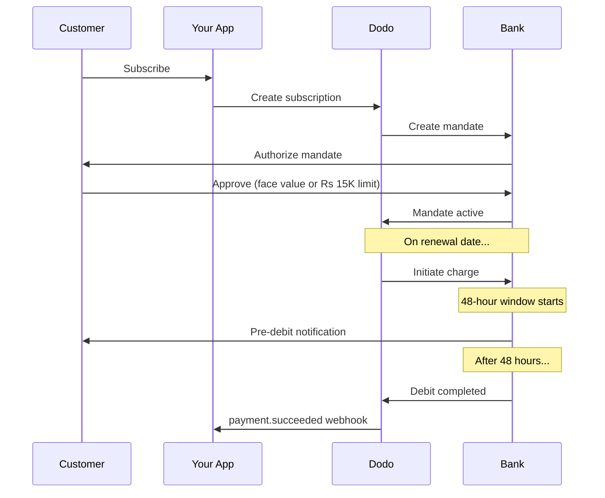

Indien hat eine einzigartige Zahlungsinfrastruktur, die von UPI (über 60 % der digitalen Transaktionen) und Rupay-Karten dominiert wird. Dodo Payments unterstützt beides mit voller RBI-Konformität für Abonnementmandate.

## Warum Zahlungsmethoden in Indien wichtig sind

<CardGroup cols={3}>
<Card title="UPI Dominance" icon="mobile">
UPI verarbeitet über 10 Milliarden Transaktionen pro Monat. Viele indische Kunden haben keine internationalen Karten.
</Card>

<Card title="Low Transaction Costs" icon="indian-rupee-sign">
UPI hat nahezu keine Transaktionsgebühren. Ideal für Transaktionen mit hohem Volumen und geringem Wert.
</Card>

<Card title="Subscription Support" icon="repeat">
Im Gegensatz zu den meisten alternativen Zahlungsmethoden unterstützen UPI und Rupay wiederkehrende Zahlungen über RBI-Mandate.
</Card>
</CardGroup>

## Unterstützte Methoden

| Methode | Typ | Abonnements | Mindestbetrag |
| :----- | :--- | :-----------: | :--------- |
| **UPI Collect** | QR-Code / VPA | Ja* | ₹1 |
| **Rupay Kredit** | Karte | Ja* | ₹1 |
| **Rupay Debit** | Karte | Ja* | ₹1 |

*Abonnements erfordern RBI-konforme Mandate mit speziellen Verarbeitungsregeln.

## Konfiguration

### API-Methodenarten

| Typ | Beschreibung |
| :--- | :---------- |
| `upi_collect` | UPI über QR-Code oder VPA-Eingabe |
| `credit` | Kreditkarten einschließlich Rupay |
| `debit` | Debitkarten einschließlich Rupay |

### Beispiel: Indien-fokussierter Checkout

```javascript
const session = await client.checkoutSessions.create({
  product_cart: [{ product_id: 'prod_123', quantity: 1 }],
  allowed_payment_method_types: [
    'upi_collect',
    'credit',
    'debit'
  ],
  billing_currency: 'INR',
  customer: {
    email: 'customer@example.in',
    name: 'Priya Sharma',
    phone_number: '+919876543210'
  },
  billing_address: {
    country: 'IN',
    zipcode: '560001'
  },
  return_url: 'https://example.com/success'
});
```

### Voraussetzungen für UPI

Damit UPI an der Kasse erscheint:
1. **Rechnungsland** muss Indien sein (`IN`)
2. **Währung** muss INR sein
3. Für nicht-indische Händler: **Adaptive Currency** muss aktiviert sein

<Warning>
Wenn Sie ein nicht-indischer Händler sind und Adaptive Currency nicht aktiviert ist, steht UPI Ihren Kunden nicht zur Verfügung.
</Warning>

## Abonnements mit RBI-Mandaten

Indische Zahlungsmethoden-Abonnements unterliegen den Vorschriften der RBI (Reserve Bank of India) mit speziellen Anforderungen.

### Wie RBI-Mandate funktionieren



### Mandatsarten

| Abonnementbetrag | Mandatsart | Limit |
| :------------------ | :----------- | :---- |
| **Unter 15.000 Rs** | Bedarfsmandat | Rs 15.000 |
| **15.000 Rs oder mehr** | Festbetragsmandat | Genau den Abonnementbetrag |

**Wichtig für Planänderungen:** Wenn ein Upgrade zu einer Gebühr führt, die das vorhandene Mandatslimit überschreitet, schlägt die Gebühr fehl und der Kunde muss erneut autorisieren.

### Die 48-Stunden-Bearbeitungsverzögerung

Dies ist der wichtigste Unterschied zu internationalen Kartenzahlungen:

<Steps>
<Step title="Charge Initiated (Day 0)">
Am geplanten Verlängerungsdatum initiiert Dodo die Abbuchung bei der Bank.
</Step>

<Step title="Pre-Debit Notification">
Der Kunde erhält eine Benachrichtigung von seiner Bank über die bevorstehende Abbuchung.
</Step>

<Step title="48-Hour Window">
Der Kunde kann das Mandat in diesem Zeitraum über seine Banking-App widerrufen.
</Step>

<Step title="Debit Completed (~48-51 hours)">
Nach 48 Stunden (plus bis zu 3 zusätzlichen Stunden für die Bankverarbeitung) werden die Gelder abgebucht.
</Step>

<Step title="Webhook Sent">
`payment.succeeded` webhook wird nach der tatsächlichen Abbuchung gesendet, nicht bei der Initiierung.
</Step>
</Steps>

<Warning>
**Gewähren Sie keine Vorteile bei der Initiierung der Abbuchung.** Warten Sie auf den `payment.succeeded` webhook, der ca. 48–51 Stunden nach dem geplanten Abbuchungsdatum eintrifft.
</Warning>

### Umgang mit dem 48-Stunden-Fenster

```javascript
// DON'T do this:
async function handleSubscriptionRenewal(subscription) {
  // ❌ Bad: Granting access immediately when charge is initiated
  grantPremiumAccess(subscription.customer_id);
}

// DO this:
async function handlePaymentWebhook(event) {
  if (event.type === 'payment.succeeded') {
    // ✅ Good: Only grant access after payment is confirmed
    grantPremiumAccess(event.data.customer_id);
  }
  
  if (event.type === 'payment.failed') {
    // Handle failed payment (mandate cancelled, insufficient funds)
    revokePremiumAccess(event.data.customer_id);
  }
}
```

### Webhook-Ereignisse für indische Abonnements

| Event | When | Action |
| :---- | :--- | :----- |
| `subscription.active` | Mandat autorisiert | Abonnementbeginn aufzeichnen |
| `payment.succeeded` | ~48 h nach Belastungsdatum | Zugang gewähren/fortsetzen |
| `payment.failed` | Lastschrift fehlgeschlagen | Kunde benachrichtigen, Zugang pausieren |
| `subscription.on_hold` | Zahlung fehlgeschlagen | Aufforderung zur Aktualisierung der Zahlungsmethode |
| `subscription.active` | Nach Zahlung reaktiviert | Zugang wiederherstellen |

## Tests

### UPI-Test-IDs

| Status | UPI ID |
| :----- | :----- |
| Success | `success@upi` |
| Failure | `failure@upi` |

### Indische Kartentestnummern

| Marke | Szenario | Kartennummer | Gültig bis | CVV |
| :---- | :------- | :---------- | :----- | :-- |
| Visa | Success | `4576238912771450` | 06/32 | 123 |
| Visa | Declined | `4706131211212123` | 06/32 | 123 |
| Mastercard | Success | `5409162669381034` | 06/32 | 123 |
| Mastercard | Declined | `5105105105105100` | 06/32 | 123 |

## Best Practices

<AccordionGroup>
<Accordion title="Plan for the 48-hour delay">
Bauen Sie Ihre Anwendung so, dass sie die Lücke zwischen Abbuchungsinitiierung und tatsächlicher Zahlung abdeckt. Berücksichtigen Sie:
- Kulanzzeiträume für den Abonnementzugang
- Klare Kommunikation an Kunden über die Verarbeitungszeit
- Webhook-gesteuerte Erfüllung, nicht datumsgesteuert
</Accordion>

<Accordion title="Handle mandate cancellations">
Kunden können Mandate jederzeit über ihre Banking-Apps kündigen. Überwachen Sie `subscription.on_hold` webhooks und fordern Sie Kunden auf, das Abonnement neu abzuschließen oder Zahlungsmethoden zu aktualisieren.
</Accordion>

<Accordion title="Set appropriate mandate amounts">
Bei variabler Preisgestaltung (z. B. nutzungsabhängig) prüfen Sie, ob ein Rs-15.000-On-Demand-Mandat ausreicht. Falls die Belastungen diesen Betrag überschreiten könnten, müssen Kunden erneut autorisieren.
</Accordion>

<Accordion title="Offer UPI prominently">
Für indische Kunden sollte UPI die primäre Zahlungsoption sein. Viele Nutzer bevorzugen es gegenüber Karten aufgrund von Vertrautheit und geringerem Reibungswiderstand.
</Accordion>
</AccordionGroup>

## Fehlersuche

<AccordionGroup>
<Accordion title="UPI not appearing at checkout">
**Überprüfen Sie:**
1. Ist das Rechnungsland auf `IN` gesetzt?
2. Ist die Währung auf `INR` gesetzt?
3. Falls nicht-indischer Händler: Ist Adaptive Currency aktiviert?
4. Ist `upi_collect` in `allowed_payment_method_types` enthalten?

**Lösung:** Vergewissern Sie sich, dass die Rechnungsadresse `country: "IN"` und `billing_currency: "INR"` enthält.
</Accordion>

<Accordion title="Subscription charge failed after upgrade">
**Ursache:** Neuer Betrag überschreitet das Limit des bestehenden Mandats (Schwelle Rs 15.000).

**Lösung:** Der Kunde muss die Zahlungsmethode aktualisieren, um ein neues Mandat mit dem richtigen Limit zu erstellen.
</Accordion>

<Accordion title="Subscription on hold but customer claims they didn't cancel">
**Ursache:** Der Kunde hat das Mandat im 48-Stunden-Fenster möglicherweise widerrufen oder seine Bank hat die Abbuchung abgelehnt.

**Lösung:** Der Kunde muss das Mandat erneut autorisieren oder seine Zahlungsmethode aktualisieren.
</Accordion>

<Accordion title="Payment deduction delayed beyond 48 hours">
**Ursache:** Verzögerungen durch die Bank-API können die Verarbeitung um 2-3 zusätzliche Stunden verlängern.

**Lösung:** Dies ist zu erwarten. Bauen Sie Ihr System so, dass es variable Verzögerungen von insgesamt bis zu ca. 51 Stunden handhabt.
</Accordion>

<Accordion title="Mandate cancelled but subscription still active">
**Ursache:** Sonderfall in den RBI-Vorschriften – die Mandatskündigung während des Verarbeitungszeitfensters führt nicht sofort zur Kündigung des Abonnements.

**Lösung:** Die nächste Abbuchung schlägt fehl und das Abonnement wechselt zu `on_hold`. Überwachen Sie Webhooks für `payment.failed`.
</Accordion>
</AccordionGroup>

## Verwandte Seiten

<CardGroup cols={2}>
<Card title="Payment Methods Overview" icon="credit-card" href="/features/payment-methods">
Alle unterstützten Zahlungsmethoden ansehen.
</Card>

<Card title="Subscriptions" icon="repeat" href="/features/subscription">
Vollständige Abonnementdokumentation einschließlich RBI-Mandaten.
</Card>

<Card title="Webhooks" icon="webhook" href="/developer-resources/webhooks">
Webhook-Verarbeitung für Zahlungsevents.
</Card>

<Card title="Testing Process" icon="flask" href="/miscellaneous/testing-process">
Alle Testdaten einschließlich UPI-IDs und indischen Karten.
</Card>
</CardGroup>