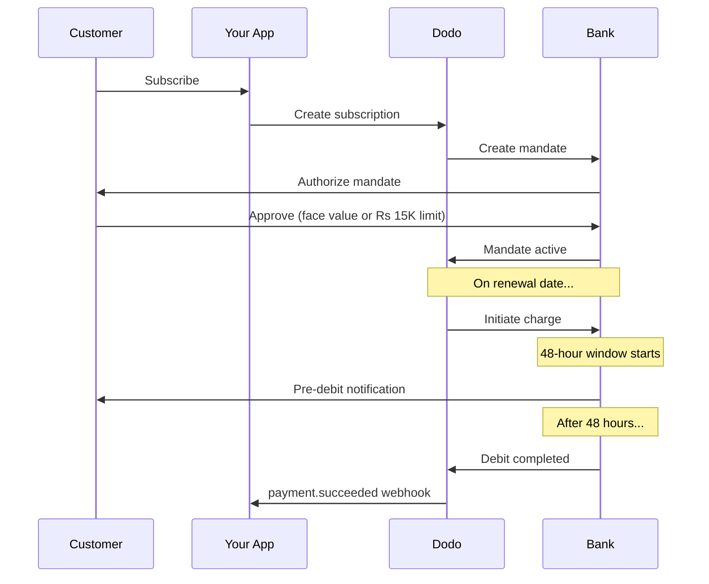

Indien hat eine einzigartige Zahlungsinfrastruktur, die von UPI (über 60 % der digitalen Transaktionen) und Rupay-Karten dominiert wird. Dodo Payments unterstützt beides mit voller RBI-Konformität für Abonnementmandate.

## Warum Zahlungsmethoden in Indien wichtig sind

<CardGroup cols={3}>
<Card title="UPI-Dominanz" icon="mobile">
UPI verarbeitet über 10 Mrd. Transaktionen pro Monat. Viele indische Kunden haben keine internationalen Karten.
</Card>

<Card title="Niedrige Transaktionskosten" icon="indian-rupee-sign">
UPI hat nahezu keine Transaktionsgebühren. Ideal für hochvolumige, niedrigwertige Transaktionen.
</Card>

<Card title="Abonnementunterstützung" icon="repeat">
Im Gegensatz zu den meisten alternativen Zahlungsmethoden unterstützen UPI und Rupay wiederkehrende Zahlungen über RBI-Mandate.
</Card>
</CardGroup>

## Unterstützte Methoden

| Methode | Typ | Abonnements | Mindestbetrag |
| :----- | :--- | :-----------: | :--------- |
| **UPI Collect** | QR-Code / VPA | Ja* | ₹1 |
| **Rupay Kredit** | Karte | Ja* | ₹1 |
| **Rupay Debit** | Karte | Ja* | ₹1 |

*Abonnements erfordern RBI-konforme Mandate mit speziellen Verarbeitungsregeln.

## Konfiguration

### API-Methodenarten

| Typ | Beschreibung |
| :--- | :---------- |
| `upi_collect` | UPI über QR-Code oder VPA-Eingabe |
| `credit` | Kreditkarten einschließlich Rupay |
| `debit` | Debitkarten einschließlich Rupay |

### Beispiel: Indien-fokussierter Checkout

```javascript
const session = await client.checkoutSessions.create({
  product_cart: [{ product_id: 'prod_123', quantity: 1 }],
  allowed_payment_method_types: [
    'upi_collect',
    'credit',
    'debit'
  ],
  billing_currency: 'INR',
  customer: {
    email: 'customer@example.in',
    name: 'Priya Sharma',
    phone_number: '+919876543210'
  },
  billing_address: {
    country: 'IN',
    zipcode: '560001'
  },
  return_url: 'https://example.com/success'
});
```

### Voraussetzungen für UPI

Damit UPI im Checkout angezeigt wird:
1. **Rechnungsland** muss Indien sein (`IN`)
2. **Währung** muss INR sein
3. Für nicht-indische Händler: **Adaptive Currency** muss aktiviert sein

<Warning>
Wenn Sie ein nicht-indischer Händler sind und **Adaptive Currency** nicht aktiviert ist, wird UPI Ihren Kunden nicht zur Verfügung stehen.
</Warning>

## Abonnements mit RBI-Mandaten

Indische Zahlungsmethoden-Abonnements unterliegen den Vorschriften der RBI (Reserve Bank of India) mit speziellen Anforderungen.

### Wie RBI-Mandate funktionieren



### Mandatsarten

| Abonnementbetrag | Mandatsart | Limit |
| :------------------ | :----------- | :---- |
| **Unter 15.000 Rs** | Bedarfsmandat | Rs 15.000 |
| **15.000 Rs oder mehr** | Festbetragsmandat | Genau den Abonnementbetrag |

**Wichtig für Planänderungen:** Wenn ein Upgrade zu einer Gebühr führt, die das vorhandene Mandatslimit überschreitet, schlägt die Gebühr fehl und der Kunde muss erneut autorisieren.

### Die 48-Stunden-Bearbeitungsverzögerung

Dies ist der wichtigste Unterschied zu internationalen Kartenzahlungen:

<Steps>
<Step title="Gebühr eingeleitet (Tag 0)">
Am geplanten Erneuerungsdatum leitet Dodo die Gebühr bei der Bank ein.
</Step>

<Step title="Vor-Debit-Benachrichtigung">
Der Kunde erhält eine Benachrichtigung von seiner Bank über das bevorstehende Debit.
</Step>

<Step title="48-Stunden-Fenster">
Der Kunde kann das Mandat während dieses Zeitraums über seine Banking-App stornieren.
</Step>

<Step title="Debit abgeschlossen (~48-51 Stunden)">
Nach 48 Stunden (plus bis zu 3 zusätzliche Stunden für die Bearbeitung durch die Bank) werden die Mittel debitiert.
</Step>

<Step title="Webhook gesendet">
`payment.succeeded` webhook wird nach dem tatsächlichen Debit gesendet, nicht bei der Initiierung.
</Step>
</Steps>

<Warning>
**Gewähren Sie keine Vorteile bei der Gebühreneinleitung.** Warten Sie auf den `payment.succeeded` Webhook, der ca. 48-51 Stunden nach dem geplanten Gebührentermin eintrifft.
</Warning>

### Umgang mit dem 48-Stunden-Fenster

```javascript
// DON'T do this:
async function handleSubscriptionRenewal(subscription) {
  // ❌ Bad: Granting access immediately when charge is initiated
  grantPremiumAccess(subscription.customer_id);
}

// DO this:
async function handlePaymentWebhook(event) {
  if (event.type === 'payment.succeeded') {
    // ✅ Good: Only grant access after payment is confirmed
    grantPremiumAccess(event.data.customer_id);
  }
  
  if (event.type === 'payment.failed') {
    // Handle failed payment (mandate cancelled, insufficient funds)
    revokePremiumAccess(event.data.customer_id);
  }
}
```

### Webhook-Ereignisse für indische Abonnements

| Ereignis | Wann | Aktion |
| :---- | :--- | :----- |
| `subscription.created` | Mandat autorisiert | Abonnementstart aufzeichnen |
| `payment.succeeded` | ~48h nach Gebührentermin | Zugang gewähren/fahren |
| `payment.failed` | Debit fehlgeschlagen | Kunden benachrichtigen, Zugang pausieren |
| `subscription.on_hold` | Zahlung fehlgeschlagen | Aufforderung zur Aktualisierung der Zahlungsmethode |
| `subscription.active` | Nach Zahlung reaktiviert | Zugang wiederherstellen |

## Tests

### UPI-Test-IDs

| Status | UPI-ID |
| :----- | :----- |
| Erfolg | `success@upi` |
| Fehler | `failure@upi` |

### Indische Kartentestnummern

| Marke | Szenario | Kartennummer | Ablauf | CVV |
| :---- | :------- | :---------- | :----- | :-- |
| Visa | Erfolg | `4576238912771450` | 06/32 | 123 |
| Visa | Abgelehnt | `4706131211212123` | 06/32 | 123 |
| Mastercard | Erfolg | `5409162669381034` | 06/32 | 123 |
| Mastercard | Abgelehnt | `5105105105105100` | 06/32 | 123 |

## Best Practices

<AccordionGroup>
<Accordion title="Planen Sie die 48-Stunden-Verzögerung">
Bauen Sie Ihre Anwendung so, dass die Lücke zwischen Gebühreneinleitung und tatsächlicher Zahlung berücksichtigt wird. Denken Sie an:
- Kulanzfristen für den Abonnementzugang
- Klare Kommunikation an die Kunden über die Bearbeitungszeit
- Webhook-gesteuerte Erfüllung, nicht terminbasierte
</Accordion>

<Accordion title="Umgang mit Mandatsstornierungen">
Kunden können Mandate jederzeit über ihre Bank-Apps stornieren. Überwachen Sie `subscription.on_hold` Webhooks und fordern Sie die Kunden auf, sich erneut anzumelden oder Zahlungsmethoden zu aktualisieren.
</Accordion>

<Accordion title="Angemessene Mandatsbeträge festlegen">
Für variable Preisgestaltung (z. B. nutzungsbasiert) prüfen Sie, ob ein Rs 15.000 Bedarfsmandat ausreichend ist. Wenn Gebühren über diesem Betrag liegen könnten, müssen die Kunden erneut autorisieren.
</Accordion>

<Accordion title="UPI prominent anbieten">
Für indische Kunden sollte UPI die primäre Zahlungsmethode sein. Viele Benutzer ziehen es aufgrund von Vertrautheit und geringerem Aufwand den Karten vor.
</Accordion>
</AccordionGroup>

## Fehlersuche

<AccordionGroup>
<Accordion title="UPI erscheint nicht im Checkout">
**Überprüfen:**
1. Ist das Rechnungsland auf `IN` eingestellt?
2. Ist die Währung auf `INR` eingestellt?
3. Wenn nicht-indischer Händler: Ist **Adaptive Currency** aktiviert?
4. Ist `upi_collect` in `allowed_payment_method_types` enthalten?

**Lösung:** Stellen Sie sicher, dass die Rechnungsadresse `country: "IN"` und `billing_currency: "INR"` hat.
</Accordion>

<Accordion title="Abonnementgebühr fehlgeschlagen nach Upgrade">
**Ursache:** Neuer Betrag überschreitet das vorhandene Mandatslimit (Schwelle von Rs 15.000).

**Lösung:** Der Kunde muss die Zahlungsmethode aktualisieren, um ein neues Mandat mit dem richtigen Limit zu erstellen.
</Accordion>

<Accordion title="Abonnement auf Hold, aber Kunde behauptet, er habe nicht storniert">
**Ursache:** Der Kunde hat möglicherweise das Mandat während des 48-Stunden-Fensters storniert oder seine Bank hat die Abbuchung abgelehnt.

**Lösung:** Der Kunde muss das Mandat erneut autorisieren oder seine Zahlungsmethode aktualisieren.
</Accordion>

<Accordion title="Zahlungsabzug verzögert sich über 48 Stunden hinaus">
**Ursache:** Verzögerungen in der Bank-API können die Bearbeitung um 2-3 zusätzliche Stunden verlängern.

**Lösung:** Das ist zu erwarten. Gestalten Sie Ihr System so, dass es variable Verzögerungen von bis zu ~51 Stunden insgesamt verarbeitet.
</Accordion>

<Accordion title="Mandat storniert, aber Abonnement bleibt aktiv">
**Ursache:** Grenzfall in den RBI-Vorschriften — die Stornierung des Mandats während des Verarbeitungsfensters führt nicht sofort zur Stornierung des Abonnements.

**Lösung:** Die nächste Gebühr wird fehlschlagen und das Abonnement wird in `on_hold` übergehen. Überwachen Sie Webhooks für `payment.failed`.
</Accordion>
</AccordionGroup>

## Verwandte Seiten

<CardGroup cols={2}>
<Card title="Übersicht der Zahlungsmethoden" icon="credit-card" href="/features/payment-methods">
Alle unterstützten Zahlungsmethoden anzeigen.
</Card>

<Card title="Abonnements" icon="repeat" href="/features/subscription">
Vollständige Abonnementdokumentation einschließlich RBI-Mandate.
</Card>

<Card title="Webhooks" icon="webhook" href="/developer-resources/webhooks">
Webhook-Verarbeitung für Zahlungsereignisse.
</Card>

<Card title="Testprozess" icon="flask" href="/miscellaneous/testing-process">
Alle Testdaten einschließlich UPI-IDs und indischen Karten.
</Card>
</CardGroup>