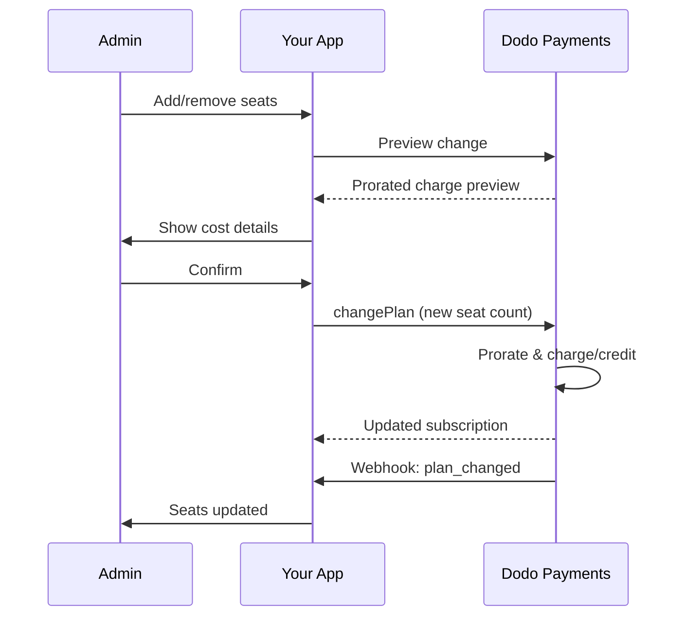

<Info>
Die Sitzplatzabrechnung ermöglicht es Ihnen, Kunden basierend auf der Anzahl der benötigten Nutzer, Teammitglieder oder Lizenzen zu berechnen. Es ist das Standardpreismodell für Team-Collaboration-Tools, Enterprise-Software und B2B-SaaS-Produkte.
</Info>

<CardGroup cols={2}>
<Card title="Implementation Tutorial" icon="code" href="/developer-resources/seat-based-pricing">
  Schritt-für-Schritt-Anleitung mit Codebeispielen.
</Card>

<Card title="Add-ons Documentation" icon="puzzle" href="/features/addons">
  Erfahren Sie mehr über das Add-on-System, das die Sitzplatzabrechnung antreibt.
</Card>

<Card title="Subscription Management" icon="repeat" href="/features/subscription">
  Verwalten Sie sitzplatzbasierte Abonnements und Tarifwechsel.
</Card>

<Card title="Webhooks" icon="bell" href="/developer-resources/webhooks/intents/subscription">
  Verfolgen Sie Sitzplatzänderungen über Abo-Webhooks.
</Card>
</CardGroup>

---

## Was ist sitzbasierte Abrechnung?

Die sitzbasierte Abrechnung (auch als nutzerbasierte oder sitzbasierte Preisgestaltung bezeichnet) berechnet Kunden basierend auf der Anzahl der Benutzer, die auf Ihr Produkt zugreifen. Anstelle einer Pauschalgebühr skaliert der Preis mit der Teamgröße.

### Häufige Anwendungsfälle

| Branche | Beispiel | Preisgestaltung |
|----------|---------|---------------|
| Team-Kollaboration | Slack, Notion, Asana | Pro aktiven Benutzer/Monat |
| Entwickler-Tools | GitHub, GitLab, Jira | Pro Sitz/Monat |
| CRM-Software | Salesforce, HubSpot | Pro Benutzerlizenz |
| Design-Tools | Figma, Canva | Pro Editor-Sitz |
| Sicherheitssoftware | 1Password, Okta | Pro Benutzer/Monat |
| Videokonferenzen | Zoom, Teams | Pro Host-Lizenz |

### Vorteile der sitzbasierten Preisgestaltung

**Für Ihr Unternehmen:**
- Umsatz skaliert natürlich, wenn Kunden wachsen
- Vorhersehbare Preise, die Kunden budgetieren können
- Klarer Upgrade-Pfad von Einzelpersonen zu Teams zu Unternehmen
- Höherer Lebenszeitwert, wenn Teams wachsen

**Für Ihre Kunden:**
- Nur für das bezahlen, was sie nutzen
- Einfach zu verstehende und vorhersehbare Kosten
- Flexibilität, Benutzer nach Bedarf hinzuzufügen/zu entfernen
- Faire Preise, die der Teamgröße entsprechen

---

## Wie die sitzbasierte Abrechnung bei Dodo Payments funktioniert

Dodo Payments implementiert die sitzbasierte Abrechnung mit dem **Add-ons**-System. So funktioniert es:

### Architekturübersicht

Ein Team-Pro-Abonnement kostet $99/Monat und beinhaltet 5 Sitze. Wenn Sie mehr als 5 Nutzer haben, zahlen Sie zusätzlich $15/Monat pro weiterem Sitz.

Zum Beispiel, wenn Ihr Team 15 Sitze benötigt:
- Basisplan: $99/Monat (beinhaltet 5 Sitze)
- Add-ons: 10 zusätzliche Sitze × $15/Monat = $150/Monat
- Gesamtkosten pro Monat: $99 + $150 = $249 für 15 Sitze

### Schlüsselkomponenten

| Komponente | Zweck | Beispiel |
|-----------|---------|---------|
| Basisprodukt | Kernabonnement mit enthaltenen Sitzen | "Team-Plan - 99 $/Monat (5 Sitze enthalten)" |
| Sitz-Add-On | Pro-Sitz-Gebühr für zusätzliche Benutzer | "Zusätzlicher Sitz - 15 $/Monat pro Stück" |
| Menge | Anzahl der gekauften zusätzlichen Sitze | 10 zusätzliche Sitze |

---

## Preisstrategien

Wählen Sie die sitzbasierte Preisstrategie, die zu Ihrem Unternehmen passt:

### Strategie 1: Basis + Pro-Sitz-Add-On

Fügen Sie eine festgelegte Anzahl von Sitzen im Basisplan hinzu und berechnen Sie zusätzliche Sitze.

**Beispiel:**

```
Starter Plan: $49/month
├── Includes: 3 seats
├── Extra seats: $10/month each
└── 8 total seats = $49 + (5 × $10) = $99/month
```

**Am besten geeignet für:** Produkte, bei denen kleine Teams mit dem Basisangebot arbeiten können.

### Strategie 2: Reine Pro-Sitz-Preisgestaltung

Berechnen Sie einen Festpreis pro Sitz ohne Basisgebühr.

**Beispiel:**

```
Per User: $12/month
├── 5 users = $60/month
├── 20 users = $240/month
└── 100 users = $1,200/month
```

**Implementierung:** Setzen Sie den Preis des Basisplans auf 0 $, verwenden Sie nur das Sitz-Add-On.

**Am besten geeignet für:** Einfache, transparente Preisgestaltung; nutzungsbasierte Modelle.

### Strategie 3: Gestaffelte Sitzpreisgestaltung

Verschiedene Basispläne mit unterschiedlichen Pro-Sitz-Sätzen.

**Beispiel:**

```
Starter: $0/month base + $15/seat
├── Lower features, higher per-seat cost

Professional: $99/month base + $10/seat
├── More features, lower per-seat cost

Enterprise: $499/month base + $7/seat
└── All features, volume discount on seats
```

**Implementierung:** Erstellen Sie separate Produkte für jede Stufe mit unterschiedlichen Add-On-Preisen.

**Am besten geeignet für:** Anreize für Upgrades auf höhere Stufen; Unternehmensverkäufe.

### Strategie 4: Sitzpakete

Verkaufen Sie Sitze in Paketen anstelle von einzeln.

**Beispiel:**

```
5-Seat Pack: $50/month ($10/seat)
10-Seat Pack: $80/month ($8/seat)
25-Seat Pack: $175/month ($7/seat)
```

**Implementierung:** Erstellen Sie mehrere Add-Ons für verschiedene Paketgrößen.

**Am besten geeignet für:** Vereinfachung von Kaufentscheidungen; Anreize für größere Verpflichtungen.

---

## Einrichtung der sitzbasierten Abrechnung

### Schritt 1: Planen Sie Ihre Preisgestaltung

Definieren Sie vor der Implementierung Ihre Preisstruktur:

<Steps>
<Step title="Define Base Plan">
Entscheiden Sie, was im Basisabonnement enthalten ist:
- Grundpreis (kann $0 für reine Sitzplatzpreise sein)
- Anzahl enthaltener Sitze
- Funktionen, die auf dieser Stufe verfügbar sind
</Step>

<Step title="Set Seat Pricing">
Bestimmen Sie die Kosten pro zusätzlichem Sitz:
- Preis pro zusätzlichem Sitz
- Mengenrabatte (über mehrere Add-ons)
- Maximale Anzahl an Sitzen (falls zutreffend)
</Step>

<Step title="Consider Billing Frequency">
Stimmen Sie die Sitzpreisgestaltung mit Ihrem Abrechnungszyklus ab:
- Monatliche Abonnements → monatliche Sitzkosten
- Jährliche Abonnements → jährliche Sitzkosten (oft rabattiert)
</Step>
</Steps>

### Schritt 2: Erstellen Sie das Sitz-Add-On

In Ihrem Dodo Payments-Dashboard:

1. Navigieren Sie zu **Produkte** → **Add-Ons**
2. Klicken Sie auf **Add-On erstellen**
3. Konfigurieren Sie das Add-On:

| Feld | Wert | Hinweise |
|-------|-------|-------|
| Name | "Zusätzlicher Sitz" oder "Teammitglied" | Klarer, benutzerfreundlicher Name |
| Beschreibung | "Fügen Sie ein weiteres Teammitglied zu Ihrem Arbeitsbereich hinzu" | Erklären Sie, was Kunden erhalten |
| Preis | Ihr Preis pro Sitz | z.B. 10,00 $ |
| Währung | Entspricht Ihrem Basisprodukt | Muss die gleiche Währung sein |
| Steuerkategorie | Die gleiche wie das Basisprodukt | Gewährleistet eine konsistente Steuerbehandlung |

<Tip>
Erstellen Sie aussagekräftige Add-on-Namen, die auf Rechnungen verständlich sind. „Zusätzlicher Team-Sitz" ist für Kunden, die ihre Rechnungen prüfen, klarer als „Seat Add-on".
</Tip>

### Schritt 3: Erstellen Sie das Basisabonnement

Erstellen Sie Ihr Abonnementprodukt:

1. Navigieren Sie zu **Produkte** → **Produkt erstellen**
2. Wählen Sie **Abonnement**
3. Konfigurieren Sie Preisgestaltung und Details
4. Fügen Sie im Abschnitt **Add-Ons** Ihr Sitz-Add-On hinzu

### Schritt 4: Fügen Sie das Add-On zum Produkt hinzu

Verknüpfen Sie das Sitz-Add-On mit Ihrem Abonnement:

1. Bearbeiten Sie Ihr Abonnementprodukt
2. Scrollen Sie zum Abschnitt **Add-Ons**
3. Klicken Sie auf **Add-Ons hinzufügen**
4. Wählen Sie Ihr Sitz-Add-On aus
5. Änderungen speichern

<Check>
Ihr Abonnementprodukt unterstützt jetzt Sitzplatzpreise. Kunden können während des Checkouts jede gewünschte Anzahl zusätzlicher Sitze erwerben.
</Check>

---

## Verwaltung von Sitzen

### Hinzufügen von Sitzen zu neuen Abonnements

Beim Erstellen einer Checkout-Sitzung geben Sie die Sitzanzahl an:

```typescript
const session = await client.checkoutSessions.create({
  product_cart: [{
    product_id: 'prod_team_plan',
    quantity: 1,
    addons: [{
      addon_id: 'addon_seat',
      quantity: 10  // 10 additional seats
    }]
  }],
  customer: { email: 'admin@company.com' },
  return_url: 'https://yourapp.com/success'
});
```

### Ändern der Sitzanzahl bei bestehenden Abonnements

Verwenden Sie die Change Plan API, um die Sitze anzupassen:

```typescript
// Add 5 more seats to existing subscription
await client.subscriptions.changePlan('sub_123', {
  product_id: 'prod_team_plan',
  quantity: 1,
  proration_billing_mode: 'prorated_immediately',
  addons: [{
    addon_id: 'addon_seat',
    quantity: 15  // New total: 15 additional seats
  }]
});
```

### Entfernen von Sitzen

Um die Sitzanzahl zu reduzieren, geben Sie die niedrigere Menge an:

```typescript
// Reduce from 15 to 8 additional seats
await client.subscriptions.changePlan('sub_123', {
  product_id: 'prod_team_plan',
  quantity: 1,
  proration_billing_mode: 'difference_immediately',
  addons: [{
    addon_id: 'addon_seat',
    quantity: 8  // Reduced to 8 additional seats
  }]
});
```

### Entfernen aller zusätzlichen Sitze

Übergeben Sie ein leeres Add-ons-Array, um alle Add-Ons zu entfernen:

```typescript
// Remove all additional seats, keep only base plan seats
await client.subscriptions.changePlan('sub_123', {
  product_id: 'prod_team_plan',
  quantity: 1,
  proration_billing_mode: 'difference_immediately',
  addons: []  // Removes all add-ons
});
```

---

## Pro-Rata-Abrechnung für Sitzänderungen

Wenn Kunden während des Abrechnungszyklus Sitze hinzufügen oder entfernen, bestimmt die Pro-Rata-Abrechnung, wie sie abgerechnet werden.



### Proration Modes

| Modus | Hinzufügen von Sitzen | Entfernen von Sitzen |
|------|-------------|----------------|
| `prorated_immediately` | Berechnen Sie die restlichen Tage im Zyklus | Gutschrift für ungenutzte Tage |
| `difference_immediately` | Volle Sitzpreis berechnen | Gutschrift für zukünftige Verlängerungen |
| `full_immediately` | Volle Sitzpreis berechnen, Abrechnungszyklus zurücksetzen | Keine Gutschrift |

### Proration Examples

**Szenario: 15 Tage verbleibender Abrechnungszyklus, 5 Sitze zu je $10 hinzufügen**

<Tabs>
<Tab title="prorated_immediately">

```
Prorated charge = ($10 × 5 seats) × (15 days / 30 days)
                = $50 × 0.5
                = $25 immediate charge
```

Der Kunde zahlt jetzt $25, dann $50/Monat bei der Verlängerung.
</Tab>

<Tab title="difference_immediately">

```
Immediate charge = $10 × 5 seats = $50
```

Der Kunde zahlt jetzt volle $50, unabhängig vom Zeitpunkt im Zyklus.
</Tab>

<Tab title="full_immediately">

```
Immediate charge = Full subscription + add-ons
Billing cycle resets to today
```

Der Kunde zahlt den vollen Betrag, der neue Abrechnungszyklus beginnt.
</Tab>
</Tabs>

**Szenario: Entfernen von 3 Sitzen in der Zyklusmitte mit prorated_immediately**

```
Current: Team Plan ($99/month) + 10 extra seats × $10/seat = $199/month
Change: Remove 3 seats (10 → 7 extra seats) on day 20 of 30-day cycle
Remaining: 10 days

Credit for removed seats:
  = ($10 × 3 seats) × (10 days / 30 days)
  = $30 × 0.333
  = $10.00 credit

→ $10.00 credit added to subscription
→ Next renewal: $99 + (7 × $10) = $169.00/month
→ Credit auto-applies: $169.00 − $10.00 = $159.00 on next invoice
```

<Tip>
**Auswahl eines Prorationsmodus bei Sitzänderungen**: Verwenden Sie `prorated_immediately` für eine faire tageweise Abrechnung, wenn Teams häufig Sitze anpassen. Nutzen Sie `difference_immediately` für einfachere Berechnungen, die den vollen Sitzpreis berechnen oder gutschreiben. Siehe den [Prorationsleitfaden](/developer-resources/subscription-upgrade-downgrade#proration-modes) für detaillierte Vergleiche.
</Tip>

### Vorschau vor Änderungen

Zeigen Sie die Proration immer vor Änderungen in der Vorschau an:

```typescript
const preview = await client.subscriptions.previewChangePlan('sub_123', {
  product_id: 'prod_team_plan',
  quantity: 1,
  proration_billing_mode: 'prorated_immediately',
  addons: [{ addon_id: 'addon_seat', quantity: 20 }]
});

console.log('Immediate charge:', preview.immediate_charge.summary);
// Show customer: "Adding 5 seats will cost $25 today"
```

---

## Sitzplätze mit Webhooks verfolgen

Überwachen Sie Sitzplatzänderungen, indem Sie auf Abonnement-Webhooks hören:

### Relevante Ereignisse

| Ereignis | Auslösezeitpunkt | Anwendungsfall |
|-------|----------------|----------|
| `subscription.active` | Neues Abonnement aktiviert | Initiale Sitze bereitstellen |
| `subscription.plan_changed` | Sitze hinzugefügt/entfernt | Aktualisieren Sie die Sitzanzahl in Ihrer App |
| `subscription.renewed` | Abonnement verlängert | Bestätigen Sie, dass sich die Sitzanzahl nicht geändert hat |
| `subscription.cancelled` | Abonnement gekündigt | Alle Sitze freigeben |

### Beispiel für einen Webhook-Handler

```typescript
app.post('/webhooks/dodo', async (req, res) => {
  const event = req.body;

  switch (event.type) {
    case 'subscription.active':
      // New subscription - provision seats
      const seats = calculateTotalSeats(event.data);
      await provisionSeats(event.data.customer_id, seats);
      break;

    case 'subscription.plan_changed':
      // Seats changed - update access
      const newSeats = calculateTotalSeats(event.data);
      await updateSeatCount(event.data.subscription_id, newSeats);
      break;

    case 'subscription.cancelled':
      // Subscription cancelled - deprovision
      await deprovisionAllSeats(event.data.subscription_id);
      break;
  }

  res.json({ received: true });
});

function calculateTotalSeats(subscriptionData) {
  const baseSeats = 5;  // Included in plan
  const addonSeats = subscriptionData.addons?.reduce(
    (total, addon) => total + addon.quantity, 0
  ) || 0;
  return baseSeats + addonSeats;
}
```

---

## Durchsetzen von Sitzplatzlimits

Ihre Anwendung muss Sitzplatzlimits durchsetzen. Dodo Payments übernimmt die Abrechnung, aber Sie steuern den Zugriff.

### Durchsetzungsstrategien

<Tabs>
<Tab title="Hard Limit">
Verhindern Sie strikt, dass Benutzer über die Sitzplatzanzahl hinaus hinzugefügt werden.

```typescript
async function inviteUser(teamId: string, email: string) {
  const team = await getTeam(teamId);
  const subscription = await getSubscription(team.subscriptionId);
  const totalSeats = calculateTotalSeats(subscription);
  const usedSeats = await countTeamMembers(teamId);

  if (usedSeats >= totalSeats) {
    throw new Error('No seats available. Please upgrade your plan.');
  }

  await sendInvitation(teamId, email);
}
```

</Tab>

<Tab title="Soft Limit with Warning">
Erlauben Sie eine Überschreitung mit Warnung und Kulanzfrist.

```typescript
async function inviteUser(teamId: string, email: string) {
  const team = await getTeam(teamId);
  const { totalSeats, usedSeats } = await getSeatInfo(team);

  if (usedSeats >= totalSeats) {
    // Allow but flag for billing
    await flagOverage(teamId, usedSeats - totalSeats + 1);
    await notifyAdmin(team.adminEmail, 'You have exceeded your seat limit');
  }

  await sendInvitation(teamId, email);
}
```

</Tab>

<Tab title="Auto-Upgrade">
Fügen Sie automatisch Sitze hinzu, wenn das Limit erreicht ist.

```typescript
async function inviteUser(teamId: string, email: string) {
  const team = await getTeam(teamId);
  const { totalSeats, usedSeats, subscriptionId } = await getSeatInfo(team);

  if (usedSeats >= totalSeats) {
    // Automatically add a seat
    await client.subscriptions.changePlan(subscriptionId, {
      product_id: team.productId,
      quantity: 1,
      proration_billing_mode: 'prorated_immediately',
      addons: [{ addon_id: 'addon_seat', quantity: totalSeats - baseSeats + 1 }]
    });

    await notifyAdmin(team.adminEmail, 'A new seat was added to your plan');
  }

  await sendInvitation(teamId, email);
}
```

</Tab>
</Tabs>

---

## Erweiterte Muster

### Unterschiedliche Sitzplatztypen

Bieten Sie verschiedene Sitzplatztypen mit unterschiedlichen Preisen an:

```
Full Seats: $20/month - Full access to all features
View-Only Seats: $5/month - Read-only access
Guest Seats: $0/month - Limited external collaborator access
```

**Implementierung:** Erstellen Sie separate Add-ons für jeden Sitzplatztyp.

```typescript
const session = await client.checkoutSessions.create({
  product_cart: [{
    product_id: 'prod_team_plan',
    quantity: 1,
    addons: [
      { addon_id: 'addon_full_seat', quantity: 10 },
      { addon_id: 'addon_viewer_seat', quantity: 25 },
      { addon_id: 'addon_guest_seat', quantity: 50 }
    ]
  }]
});
```

### Jährliche Sitzplatzrabatte

Bieten Sie rabattierte jährliche Sitzplatzpreise an:

```
Monthly: $15/seat/month
Annual: $12/seat/month (20% savings)
```

**Implementierung:** Erstellen Sie separate Produkte für monatliche und jährliche Pläne mit unterschiedlichen Add-on-Preisen.

### Mindestsitzplatzanforderungen

Erfordern Sie eine Mindestanzahl an Sitzen für bestimmte Pläne:

```typescript
async function validateSeatCount(planId: string, seatCount: number) {
  const minimums = {
    'prod_starter': 1,
    'prod_team': 5,
    'prod_enterprise': 25
  };

  if (seatCount < minimums[planId]) {
    throw new Error(`${planId} requires at least ${minimums[planId]} seats`);
  }
}
```

---

## Best Practices

### Best Practices für die Preisgestaltung
- **Klare Kommunikation**: Zeigen Sie die Preisgestaltung pro Sitzplatz deutlich auf Ihrer Preisseite an
- **Enthaltene Sitze**: Ziehen Sie in Betracht, einige Sitze im Grundpreis einzuschließen, um Reibungsverluste zu reduzieren
- **Mengenrabatte**: Bieten Sie niedrigere Sitzpreise für größere Teams, um Enterprise-Deals zu gewinnen
- **Jährliche Anreize**: Rabattieren Sie Jahrespläne, um Cashflow und Bindung zu verbessern

- **Echtzeit-Feedback**: Zeigen Sie die sofortige Kostenwirkung beim Anpassen von Sitzen an
- **Bestätigungsschritte**: Fordern Sie eine Bestätigung an, bevor Änderungen an der Abrechnung vorgenommen werden
- **Transparenz bei der Pro-Rata-Abrechnung**: Erklären Sie die pro-rata Gebühren klar, bevor Sie sie anwenden
- **Einfache Downgrades**: Machen Sie es nicht schwierig, die Sitze zu reduzieren (das schafft Vertrauen)

### Technische Best Practices
- **Sitzanzahlen cachen**: Speichern Sie Sitzanzahlen lokal im Cache, um API-Aufrufe bei jeder Anfrage zu vermeiden
- **Regelmäßig synchronisieren**: Synchronisieren Sie regelmäßig Ihre lokale Sitzanzahl über die API mit Dodo Payments
- **Fehler behandeln**: Wenn eine Sitzplatzänderung fehlschlägt, zeigen Sie klare Fehlermeldungen und Wiederholungsoptionen an
- **Audit-Trail**: Protokollieren Sie alle Sitzplatzänderungen für Abrechnungsstreitigkeiten und Compliance

## Fehlersuche

### Best Practices für die Benutzererfahrung
- **Echtzeit-Feedback**: Zeigen Sie sofortige Kostenfolgen beim Anpassen von Sitzen
- **Bestätigungsschritte**: Fordern Sie eine Bestätigung an, bevor Abrechnungsänderungen vorgenommen werden
- **Transparenz bei Proration**: Erklären Sie proratisierte Gebühren deutlich, bevor Sie sie anwenden
- **Einfache Downgrades**: Gestalten Sie das Reduzieren von Sitzen nicht schwierig (das schafft Vertrauen)

**Ursachen**:
- Webhook nicht empfangen oder verarbeitet
- Race Condition während der Sitzänderung
- Zwischengespeicherte Daten nicht aktualisiert

---

## Fehlerbehebung

<AccordionGroup>
<Accordion title="Seat count mismatch between app and billing">
**Symptom**: Ihre App zeigt eine andere Sitzanzahl als das Abonnement.

**Ursachen**:
- Webhook wurde nicht empfangen oder verarbeitet
- Race Condition während der Sitzplatzänderung
- Zwischengespeicherte Daten nicht aktualisiert

**Lösungen**:
1. Implementieren Sie Webhook-Handler für `subscription.plan_changed`
2. Fügen Sie eine Schaltfläche "Mit Abrechnung synchronisieren" hinzu, die das aktuelle Abonnement abruft
3. Setzen Sie die Cache-TTL, um regelmäßige Aktualisierungen sicherzustellen
</Accordion>

<Accordion title="Proration charges unexpected">
**Symptom**: Kunde ist vom Betrag der mid-cycle-Abrechnung verwirrt.

**Ursachen**:
- Der Prorationsmodus wurde nicht klar kommuniziert
- Der Kunde hat die Vorschau vor Bestätigung nicht gesehen

**Lösungen**:
1. Verwenden Sie stets `previewChangePlan`, bevor Sie Änderungen vornehmen
2. Zeigen Sie eine klare Aufschlüsselung: „Das Hinzufügen von X Sitzen = $Y heute (proratisiert für Z Tage)"
3. Dokumentieren Sie Ihre Prorationsrichtlinie im Help Center
</Accordion>

<Accordion title="Add-on not appearing in checkout">
**Symptom**: Sitzplatz-Add-on ist während des Checkouts nicht verfügbar.

**Ursachen**:
- Add-on ist nicht an das Produkt gebunden
- Add-on archiviert oder gelöscht
- Währungsinkongruenz zwischen Produkt und Add-on

**Lösungen**:
1. Vergewissern Sie sich, dass das Add-on in den Produkteinstellungen angehängt ist
2. Überprüfen Sie den Add-on-Status im Add-Ons-Dashboard
3. Stellen Sie sicher, dass die Währungen exakt übereinstimmen
</Accordion>

<Accordion title="Cannot reduce seats below current usage">
**Symptom**: Kunde möchte Sitze reduzieren, hat aber zugewiesene Benutzer.

**Lösungen**:
1. Zeigen Sie, welche Benutzer entfernt werden müssen, bevor Sitze reduziert werden
2. Implementieren Sie einen Workflow: Benutzer entfernen → Sitze reduzieren
3. Ziehen Sie eine Kulanzfrist in Betracht, bevor die Sitzplatzreduzierung durchgesetzt wird
</Accordion>
</AccordionGroup>

---

## Verwandte Dokumentation

<CardGroup cols={2}>
<Card title="Seat-Based Pricing Tutorial" icon="code" href="/developer-resources/seat-based-pricing">
  Vollständige Implementierungsanleitung mit Code.
</Card>

<Card title="Add-ons" icon="puzzle" href="/features/addons">
  Verstehen Sie das Add-on-System im Detail.
</Card>

<Card title="Plan Changes & Proration" icon="arrows-rotate" href="/developer-resources/subscription-upgrade-downgrade">
  Bearbeiten Sie Abo-Änderungen.
</Card>

<Card title="Subscription Webhooks" icon="bell" href="/developer-resources/webhooks/intents/subscription">
  Verfolgen Sie Abo-Ereignisse.
</Card>
</CardGroup>
