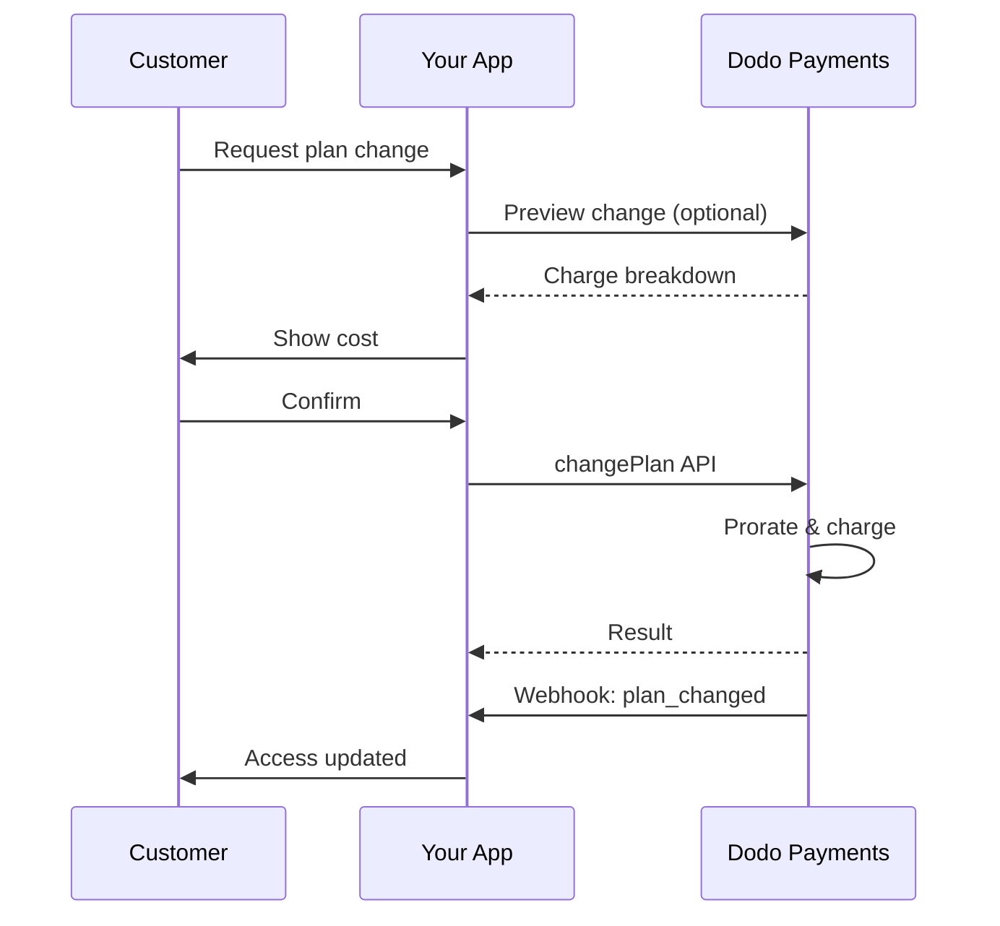
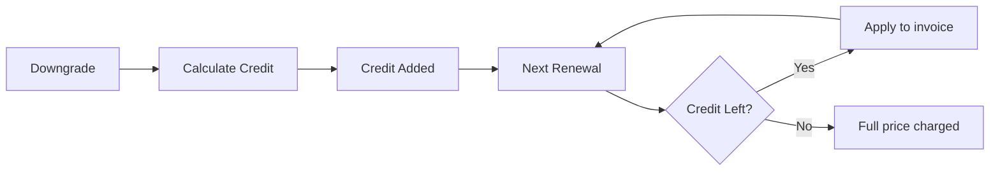

<Info>
Abonnements ermöglichen es, fortlaufenden Zugang mit automatischen Verlängerungen zu verkaufen. Verwende flexible Abrechnungszyklen, kostenlose Testphasen, Planänderungen und Add-ons, um die Preisgestaltung für jeden Kunden maßzuschneidern.
</Info>

<CardGroup cols={2}>
<Card title="Upgrade & Downgrade" icon="repeat" href="/developer-resources/subscription-upgrade-downgrade">
Steuere Planänderungen mit Proration und Mengenaktualisierungen.
</Card>

<Card title="On‑Demand Subscriptions" icon="bolt" href="/developer-resources/ondemand-subscriptions">
Erteile jetzt ein Mandat und buche später mit individuellen Beträgen ab.
</Card>

<Card title="Customer Portal" icon="id-card" href="/features/customer-portal">
Ermögliche es Kunden, Pläne, Abrechnung und Kündigungen selbst zu verwalten.
</Card>

<Card title="Subscription Webhooks" icon="code" href="/developer-resources/webhooks/intents/subscription">
Reagiere auf Lebenszyklusereignisse wie Erstellen, Verlängern und Kündigen.
</Card>
</CardGroup>

## Was sind Abonnements?

Abonnements sind wiederkehrende Produkte, die Kunden nach einem Zeitplan erwerben. Sie sind ideal für:

- **SaaS-Lizenzen**: Apps, APIs oder Plattformzugang
- **Mitgliedschaften**: Gemeinschaften, Programme oder Clubs
- **Digitale Inhalte**: Kurse, Medien oder Premium-Inhalte
- **Supportpläne**: SLAs, Erfolgspakete oder Wartung

## Wichtige Vorteile

- **Vorhersehbare Einnahmen**: Wiederkehrende Abrechnung mit automatischen Erneuerungen
- **Flexible Zyklen**: Monatlich, jährlich, benutzerdefinierte Intervalle und Testversionen
- **Planagilität**: Anteilige Abrechnung für Upgrades und Downgrades
- **Zusatzleistungen und Plätze**: Fügen Sie optionale, quantifizierbare Upgrades hinzu
- **Nahtloser Checkout**: Gehosteter Checkout und Kundenportal
- **Entwicklerfreundlich**: Klare APIs für Erstellung, Änderungen und Nutzungstracking

## Abonnements erstellen

Erstellen Sie Abonnementprodukte in Ihrem Dodo Payments-Dashboard und verkaufen Sie diese dann über den Checkout oder Ihre API. Die Trennung von Produkten und aktiven Abonnements ermöglicht es Ihnen, die Preisgestaltung zu versionieren, Zusatzleistungen anzuhängen und die Leistung unabhängig zu verfolgen.

### Erstellung von Abonnementprodukten

Konfigurieren Sie die Felder im Dashboard, um zu definieren, wie Ihr Abonnement verkauft, erneuert und abgerechnet wird. Die folgenden Abschnitte entsprechen direkt dem, was Sie im Erstellungsformular sehen.

#### Produktdetails

- **Produktname** (erforderlich): Der Anzeigename, der im Checkout, im Kundenportal und auf Rechnungen angezeigt wird.
- **Produktbeschreibung** (erforderlich): Eine klare Wertangabe, die im Checkout und auf Rechnungen erscheint.
- **Produktbild** (erforderlich): PNG/JPG/WebP bis zu 3 MB. Wird im Checkout und auf Rechnungen verwendet.
- **Marke**: Verknüpfen Sie das Produkt mit einer bestimmten Marke für das Design und E-Mails.
- **Steuerkategorie** (erforderlich): Wählen Sie die Kategorie (z. B. SaaS), um die Steuerregeln zu bestimmen.

<Tip>
Wähle die genaueste Steuerkategorie, um die korrekte Steuererhebung pro Region sicherzustellen.
</Tip>

#### Preisgestaltung

- **Preismodell**: Wählen Sie <b>Abonnement</b> (diese Anleitung). Alternativen sind Einmalzahlung und nutzungsbasierte Abrechnung.
- **Preis** (erforderlich): Basis wiederkehrender Preis mit Währung.
- **Anwendbarer Rabatt (%)**: Optionaler prozentualer Rabatt, der auf den Basispreis angewendet wird; wird im Checkout und auf Rechnungen angezeigt.
- **Wiederholungszahlung alle** (erforderlich): Intervall für Erneuerungen, z. B. alle 1 Monat. Wählen Sie die Frequenz (Monate oder Jahre) und die Menge.
- **Abonnementzeitraum** (erforderlich): Gesamtlaufzeit, für die das Abonnement aktiv bleibt (z. B. 10 Jahre). Nach Ablauf dieses Zeitraums enden die Erneuerungen, es sei denn, sie werden verlängert.
- **Testzeitraum in Tagen** (erforderlich): Legen Sie die Testdauer in Tagen fest. Verwenden Sie 0, um Tests zu deaktivieren. Die erste Abbuchung erfolgt automatisch, wenn der Testzeitraum endet.
- **Zusatzoption auswählen**: Fügen Sie bis zu 10 Zusatzoptionen hinzu, die Kunden zusammen mit dem Basisplan erwerben können.

<Warning>
Die Preisänderung eines aktiven Produkts betrifft neue Käufe. Bestehende Abonnements folgen deinen Planänderungs- und Prorations-Einstellungen.
</Warning>

<Info>
Add-ons eignen sich ideal für quantifizierbare Extras wie Plätze oder Speicher. Du kannst erlaubte Mengen und das Prorationsverhalten steuern, wenn Kunden diese ändern.
</Info>

#### Erweiterte Einstellungen

- **Steuerinklusivpreise**: Preise anzeigen, die die anwendbaren Steuern enthalten. Die endgültige Steuerberechnung variiert weiterhin je nach Kundenstandort.
- **Lizenzschlüssel generieren**: Geben Sie jedem Kunden nach dem Kauf einen eindeutigen Schlüssel. Siehe die <a href="/features/license-keys">Lizenzschlüssel</a>-Anleitung.
- **Lieferung digitaler Produkte**: Dateien oder Inhalte automatisch nach dem Kauf bereitstellen. Erfahren Sie mehr in <a href="/features/digital-product-delivery">Lieferung digitaler Produkte</a>.
- **Metadaten**: Fügen Sie benutzerdefinierte Schlüssel-Wert-Paare für interne Tagging- oder Kundenintegrationen hinzu. Siehe <a href="/api-reference/metadata">Metadaten</a>.

<Tip>
Verwende Metadaten, um Identifikatoren aus deinem System (z. B. accountId) zu speichern, damit du Ereignisse und Rechnungen später abgleichen kannst.
</Tip>

## Abonnement-Testversionen

Testversionen ermöglichen es Kunden, auf Abonnements ohne sofortige Zahlung zuzugreifen. Die erste Abbuchung erfolgt automatisch, wenn die Testversion endet.

### Testversionen konfigurieren

Lege **Trial Period Days** im Abschnitt zur Produktpreisgestaltung fest (verwende `0`, um es zu deaktivieren). Du kannst dies beim Erstellen von Abonnements überschreiben:

```typescript
// Via subscription creation
const subscription = await client.subscriptions.create({
  customer_id: 'cus_123',
  product_id: 'prod_monthly',
  trial_period_days: 14  // Overrides product's trial period
});

// Via checkout session
const session = await client.checkoutSessions.create({
  product_cart: [{ product_id: 'prod_monthly', quantity: 1 }],
  subscription_data: { trial_period_days: 14 }
});
```

<Warning>
Der `trial_period_days`-Wert muss zwischen 0 und 10.000 Tagen liegen.
</Warning>

### Teststatus erkennen

<Warning>
Derzeit gibt es kein direktes Feld zur Erkennung des Trial-Status. Die folgende Lösung erfordert Abfragen von Zahlungen, was ineffizient ist. Wir arbeiten an einer effizienteren Lösung.
</Warning>

Um festzustellen, ob sich ein Abonnement in der Testphase befindet, rufen Sie die Liste der Zahlungen für das Abonnement ab. Wenn es genau eine Zahlung mit dem Betrag 0 gibt, befindet sich das Abonnement in der Testphase:

```typescript
const subscription = await client.subscriptions.retrieve('sub_123');
const payments = await client.payments.list({
  subscription_id: subscription.subscription_id
});

// Check if subscription is in trial
const isInTrial = payments.items.length === 1 && 
                  payments.items[0].total_amount === 0;
```

### Testzeitraum aktualisieren

Verlängere die Testphase, indem du `next_billing_date` aktualisierst:

```typescript
await client.subscriptions.update('sub_123', {
  next_billing_date: '2025-02-15T00:00:00Z'  // New trial end date
});
```

<Warning>
Du kannst `next_billing_date` nicht auf eine vergangene Zeit setzen. Das Datum muss in der Zukunft liegen.
</Warning>

## Änderungen an Abonnementplänen

Änderungen an Plänen ermöglichen es Ihnen, Abonnements zu upgraden oder downgraden, Mengen anzupassen oder auf andere Produkte zu migrieren. Jede Änderung löst eine sofortige Abbuchung basierend auf dem von Ihnen ausgewählten anteiligen Abrechnungsmodus aus.

<Tip>
Du kannst Planänderungen und die Anpassung des nächsten Abrechnungsdatums direkt im Dodo Payments Dashboard vornehmen. Das bietet eine schnelle Möglichkeit, Abonnements für Kundensupportanfragen, werbliche Upgrades oder Planmigrationen anzupassen, ohne API-Aufrufe.
</Tip>

<Tip>
**Selbstbediente Planänderungen aktivieren:** Möchtest du, dass Kunden ihre Abonnements selbstständig über das Kundenportal upgraden oder downgraden können? Füge deine Abonnementprodukte einer Produktkollektion hinzu und aktiviere "Allow Subscription Updates" in deinen Abonnement-Einstellungen.
</Tip>



<Card title="Product Collections" icon="layer-group" href="/features/product-collections">
  Gruppiere verwandte Produkte in Kollektionen, um nahtlose Upgrade/Downgrade-Wege im Kundenportal zu ermöglichen.
</Card>

### Prorationsmodi

Wähle, wie Kunden beim Planwechsel abgerechnet werden:

<Info>
**Schneller Vergleich der drei Prorationsmodi:**

| | `prorated_immediately` | `difference_immediately` | `full_immediately` |
|---|---|---|---|
| **Upgrade** | Proratisierte Belastung für verbleibende Tage | Der volle Preisunterschied wird berechnet | Der volle neue Planpreis wird berechnet |
| **Downgrade** | Proratisiertes Guthaben für verbleibende Tage | Der volle Preisunterschied wird als Guthaben gutgeschrieben | Kein Guthaben, voller Betrag |
| **Abrechnungszyklus** | Bleibt gleich | Bleibt gleich | Setzt auf heute zurück |
| **Ideal für** | Faire zeitbasierte Abrechnung | Einfache Stufenwechsel | Zurücksetzen des Abrechnungszyklus |
</Info>

#### `prorated_immediately`
Berechnet den proratisierten Betrag basierend auf der verbleibenden Zeit im aktuellen Abrechnungszyklus. Ideal für faire Abrechnungen, die ungenutzte Zeit berücksichtigen.

```typescript
await client.subscriptions.changePlan('sub_123', {
  product_id: 'prod_pro',
  quantity: 1,
  proration_billing_mode: 'prorated_immediately'
});
```

#### `difference_immediately`
Berechnet sofort die Preisdifferenz (Upgrade) oder schreibt ein Guthaben für zukünftige Verlängerungen gut (Downgrade). Optimal für einfache Upgrade-/Downgrade-Szenarien.

```typescript
// Upgrade: charges $50 (difference between $30 and $80)
// Downgrade: credits remaining value, auto-applied to renewals
await client.subscriptions.changePlan('sub_123', {
  product_id: 'prod_pro',
  quantity: 1,
  proration_billing_mode: 'difference_immediately'
});
```

<Info>
Gutschriften aus Downgrades mit `difference_immediately` sind abonnementbezogen und werden automatisch auf zukünftige Verlängerungen angewendet. Sie unterscheiden sich von <a href="/features/credit-based-billing">Credit-Based Billing</a>-Berechtigungen.
</Info>

Wenn ein Kunde mit `difference_immediately` downgrades, wird der ungenutzte Wert zu einem abonnementspezifischen Guthaben, das zukünftige Verlängerungen automatisch kompensiert:



#### `full_immediately`
Berechnet sofort den vollen neuen Planbetrag, ohne verbleibende Zeit zu berücksichtigen. Ideal zum Zurücksetzen des Abrechnungszyklus.

```typescript
await client.subscriptions.changePlan('sub_123', {
  product_id: 'prod_monthly',
  quantity: 1,
  proration_billing_mode: 'full_immediately'
});
```

<AccordionGroup>
<Accordion title="Example: Prorated upgrade calculation">

**Szenario**: Kunde mit Basic ($30/Monat) wechselt am Tag 16 eines 30-Tage-Zyklus auf Pro ($80/Monat) mit `prorated_immediately`.

```
Unused credit from Basic = $30 × (15 remaining / 30 total) = $15.00
Prorated cost of Pro     = $80 × (15 remaining / 30 total) = $40.00
────────────────────────────────────────────────────────────────────
Immediate charge         = $40.00 − $15.00 = $25.00
```

Nächste Verlängerung zum ursprünglichen Abrechnungsdatum: **$80,00/Monat**.

<Tip>
Für detailliertere Berechnungsbeispiele und Randfälle sieh dir unseren vollständigen [Upgrade & Downgrade Guide](/developer-resources/subscription-upgrade-downgrade) an.
</Tip>

</Accordion>
<Accordion title="Example: Downgrade credit calculation">

**Szenario**: Kunde mit Pro ($80/Monat) downgrades auf Starter ($20/Monat) mit `difference_immediately`.

```
Credit = Old plan − New plan = $80 − $20 = $60.00
```

Die $60 werden automatisch auf zukünftige Verlängerungen angerechnet:
- Verlängerung 1: $20 − $20 (Guthaben) = **$0,00** ($40 Guthaben verbleibend)
- Verlängerung 2: $20 − $20 (Guthaben) = **$0,00** ($20 Guthaben verbleibend)  
- Verlängerung 3: $20 − $20 (Guthaben) = **$0,00** (Guthaben erschöpft)
- Verlängerung 4: **$20,00** (voller Preis)

<Info>
Erfahre mehr darüber, wie Guthaben im [Upgrade & Downgrade Guide](/developer-resources/subscription-upgrade-downgrade) verwaltet werden.
</Info>

</Accordion>
</AccordionGroup>

### Planänderungen mit Add-ons

Passe Add-ons beim Planwechsel an. Add-ons werden in die Prorationsberechnungen einbezogen:

```typescript
await client.subscriptions.changePlan('sub_123', {
  product_id: 'prod_pro',
  quantity: 1,
  proration_billing_mode: 'difference_immediately',
  addons: [{ addon_id: 'addon_extra_seats', quantity: 2 }]  // Add add-ons
  // addons: []  // Empty array removes all existing add-ons
});
```

<Info>
Planänderungen lösen sofortige Belastungen aus. Fehlgeschlagene Belastungen können das Abonnement in den `on_hold`-Status verschieben. Verfolge Änderungen über `subscription.plan_changed`-Webhooks.
</Info>

### Vorschau von Planänderungen

Sieh dir vor dem Commit die genaue Belastung und das resultierende Abonnement an:

```typescript
const preview = await client.subscriptions.previewChangePlan('sub_123', {
  product_id: 'prod_pro',
  quantity: 1,
  proration_billing_mode: 'prorated_immediately'
});

// Show customer the charge before confirming
console.log('You will be charged:', preview.immediate_charge.summary);
```

<Card title="Preview Change Plan API" icon="eye" href="/api-reference/subscriptions/preview-change-plan">
  Vorschau von Planänderungen, bevor du sie bestätigst.
</Card>

## Abonnementzustände

Abonnements können sich im Verlauf ihres Lebenszyklus in verschiedenen Zuständen befinden:

- **`active`**: Abonnement ist aktiv und erneuert sich automatisch
- **`on_hold`**: Abonnement ist aufgrund fehlgeschlagener Zahlung pausiert. Aktualisierung der Zahlungsmethode erforderlich, um es wieder zu aktivieren
- **`cancelled`**: Abonnement ist gekündigt und erneuert sich nicht
- **`expired`**: Abonnement hat sein Enddatum erreicht
- **`pending`**: Abonnement wird erstellt oder verarbeitet

### Zustand "On Hold"

Ein Abonnement wechselt in den `on_hold`-Zustand, wenn:

- Eine Verlängerungszahlung fehlschlägt (unzureichende Mittel, abgelaufene Karte usw.)
- Eine Planänderungslastung fehlschlägt
- Die Autorisierung der Zahlungsmethode fehlschlägt

<Warning>
Wenn sich ein Abonnement im `on_hold`-Zustand befindet, wird es sich nicht automatisch verlängern. Du musst die Zahlungsmethode aktualisieren, um das Abonnement wieder zu aktivieren.
</Warning>

### Reaktivierung aus "On Hold"

Um ein Abonnement aus dem `on_hold`-Zustand zu reaktivieren, aktualisiere die Zahlungsmethode. Dadurch wird automatisch:

1. Eine Belastung für ausstehende Beträge erstellt
2. Eine Rechnung generiert
3. Die Zahlung mit der neuen Zahlungsmethode verarbeitet
4. Das Abonnement nach erfolgreicher Zahlung in den `active`-Zustand reaktiviert

```typescript
// Reactivate subscription from on_hold
const response = await client.subscriptions.updatePaymentMethod('sub_123', {
  type: 'new',
  return_url: 'https://example.com/return'
});

// For on_hold subscriptions, a charge is automatically created
if (response.payment_id) {
  console.log('Charge created:', response.payment_id);
  // Redirect customer to response.payment_link to complete payment
  // Monitor webhooks for payment.succeeded and subscription.active
}
```

<Info>
Nach dem erfolgreichen Aktualisieren der Zahlungsmethode für ein `on_hold`-Abonnement erhältst du `payment.succeeded` gefolgt von `subscription.active`-Webhooks.
</Info>

## API-Verwaltung

<AccordionGroup>
<Accordion title="Create subscriptions">
Verwende `POST /subscriptions`, um Abonnements programmatisch aus Produkten zu erstellen, mit optionalen Testphasen und Add-ons.

<Card title="API Reference" icon="code" href="/api-reference/subscriptions/post-subscriptions">
Sieh dir die API zum Erstellen von Abonnements an.
</Card>
</Accordion>

<Accordion title="Update subscriptions">
Verwende `PATCH /subscriptions/{id}`, um Mengen zu aktualisieren, zum nächsten Abrechnungsdatum zu kündigen oder Metadaten zu ändern.

<Card title="API Reference" icon="code" href="/api-reference/subscriptions/patch-subscriptions">
Erfahre, wie du Abonnementdetails aktualisierst.
</Card>
</Accordion>

<Accordion title="Change plans (proration)">
Ändere das aktive Produkt und die Mengen mit Prorationskontrollen.

<Card title="API Reference" icon="code" href="/api-reference/subscriptions/change-plan">
Überprüfe Planänderungsoptionen.
</Card>
</Accordion>

<Accordion title="On‑demand charges">
Bei On-Demand-Abonnements kannst du bedarfsbasierte Beträge berechnen.

<Card title="API Reference" icon="code" href="/api-reference/subscriptions/create-charge">
Belaste ein On-Demand-Abonnement.
</Card>
</Accordion>

<Accordion title="List and retrieve">
Verwende `GET /subscriptions`, um alle Abonnements aufzulisten, und `GET /subscriptions/{id}`, um eines abzurufen.

<Card title="API Reference" icon="code" href="/api-reference/subscriptions/get-subscriptions">
Durchstöbere die APIs für Auflistung und Abruf.
</Card>
</Accordion>

<Accordion title="Usage history">
Rufe aufgezeichnete Nutzungsdaten für abgerechnete oder hybride Preismodelle ab.

<Card title="API Reference" icon="code" href="/api-reference/subscriptions/get-usage-history">
Sieh dir die API für Nutzungshistorien an.
</Card>
</Accordion>

<Accordion title="Update payment method">
Aktualisiere die Zahlungsmethode für ein Abonnement. Bei aktiven Abonnements wird die Zahlungsmethode für zukünftige Verlängerungen aktualisiert. Bei Abonnements im `on_hold`-Zustand reaktiviert dies das Abonnement, indem eine Belastung für ausstehende Beträge erstellt wird.

<Card title="API Reference" icon="code" href="/api-reference/subscriptions/update-payment-method">
Erfahre, wie du Zahlungsmethoden aktualisierst und Abonnements reaktivierst.
</Card>
</Accordion>
</AccordionGroup>

## Häufige Anwendungsfälle

- **SaaS und APIs:** gestufte Zugänge mit Add-ons für Plätze oder Nutzung
- **Inhalte und Medien:** monatlicher Zugang mit Einführungs-Testphasen
- **B2B-Supportpläne:** Jahresverträge mit Premium-Support-Add-ons
- **Tools und Plugins:** Lizenzschlüssel und versionierte Releases

## Integrationsbeispiele

### Checkout-Sitzungen (Abonnements)
Füge beim Erstellen von Checkout-Sitzungen dein Abonnementprodukt und optionale Add-ons hinzu:

```typescript
const session = await client.checkoutSessions.create({
  product_cart: [
    {
      product_id: 'prod_subscription',
      quantity: 1
    }
  ]
});
```

### Planänderungen mit Proration
Upgrade oder downgrade ein Abonnement und steuere das Prorationsverhalten:

```typescript
await client.subscriptions.changePlan('sub_123', {
  product_id: 'prod_new',
  quantity: 1,
  proration_billing_mode: 'difference_immediately'
});
```

### Kündigung zum nächsten Abrechnungsdatum
Plane eine Kündigung, die am Ende des aktuellen Abrechnungszeitraums wirksam wird:

```typescript
await client.subscriptions.update('sub_123', {
  cancel_at_next_billing_date: true
});
```

### On-Demand-Abonnements
Erstelle ein On-Demand-Abonnement und berechne später bei Bedarf:

```typescript
const onDemand = await client.subscriptions.create({
  customer_id: 'cus_123',
  product_id: 'prod_on_demand',
  on_demand: true
});

await client.subscriptions.createCharge(onDemand.id, {
  amount: 4900,
  currency: 'USD',
  description: 'Extra usage for September'
});
```

### Zahlungsmethode für aktives Abonnement aktualisieren
Aktualisiere die Zahlungsmethode für ein aktives Abonnement:

```typescript
// Update with new payment method
const response = await client.subscriptions.updatePaymentMethod('sub_123', {
  type: 'new',
  return_url: 'https://example.com/return'
});

// Or use existing payment method
await client.subscriptions.updatePaymentMethod('sub_123', {
  type: 'existing',
  payment_method_id: 'pm_abc123'
});
```

### Abonnement aus on_hold reaktivieren
Reaktiviere ein Abonnement, das aufgrund fehlgeschlagener Zahlung in den On-Hold-Zustand gewechselt ist:

```typescript
// Update payment method - automatically creates charge for remaining dues
const response = await client.subscriptions.updatePaymentMethod('sub_123', {
  type: 'new',
  return_url: 'https://example.com/return'
});

if (response.payment_id) {
  // Charge created for remaining dues
  // Redirect customer to response.payment_link
  // Monitor webhooks: payment.succeeded → subscription.active
}
```

## Abonnements mit RBI-konformen Mandaten

  UPI- und indische Kartenabonnements unterliegen den RBI-Vorschriften (Reserve Bank of India) mit spezifischen Mandatsanforderungen:

  ### Mandatsgrenzen

  Der Mandatstyp und Betrag hängen von der wiederkehrenden Belastung deines Abonnements ab:

  - **Belastungen unter Rs 15.000:** Wir erstellen ein On-Demand-Mandat für Rs 15.000 INR. Der Abonnementbetrag wird periodisch gemäß deiner Frequenz belastet, bis zum Mandatslimit.
  - **Belastungen ab Rs 15.000:** Wir erstellen ein Abonnement-Mandat (oder On-Demand-Mandat) für den genauen Abonnementbetrag.

Für detaillierte Informationen zu RBI-konformen Mandaten für indische Zahlungsmethoden siehe die Seite <a href="/features/payment-methods/india">India Payment Methods</a>.

  ### Überlegungen bei Upgrades und Downgrades

  **Wichtig:** Beachte bei Upgrades oder Downgrades die Mandatsgrenzen genau:

  - Falls ein Upgrade/Downgrade zu einem Betrag führt, der Rs 15.000 übersteigt und das bestehende On-Demand-Limit überschreitet, kann die Transaktion fehlschlagen.
  - In solchen Fällen muss der Kunde möglicherweise die Zahlungsmethode aktualisieren oder das Abonnement erneut ändern, um ein neues Mandat mit dem richtigen Limit zu erstellen.

  ### Autorisierung für hochpreisige Belastungen

  Bei Abonnementbelastungen ab Rs 15.000:

  - Die Bank fordert den Kunden zur Autorisierung der Transaktion auf.
  - Wenn der Kunde die Autorisierung verweigert, schlägt die Transaktion fehl und das Abonnement wird in den On-Hold-Zustand gesetzt.

  ### 48-Stunden-Verarbeitungsverzögerung

  **Verarbeitungszeitplan:** Wiederkehrende Belastungen für indische Karten und UPI-Abonnements folgen einem speziellen Muster:

  - Belastungen werden **am geplanten Datum** gemäß deiner Abonnementfrequenz **initiiert**.
  - Die tatsächliche **Abbuchung** vom Konto des Kunden erfolgt erst **48 Stunden** nach Initiierung.
  - Dieses 48-Stunden-Fenster kann sich je nach Bank-API-Antworten um **2–3 zusätzliche Stunden** verlängern.

  ### Mandatskündigungsfenster

  Während des 48-Stunden-Verarbeitungsfensters:

  - Kunden können das Mandat über ihre Banking-Apps kündigen.
  - Kündigt ein Kunde das Mandat in diesem Zeitraum, bleibt das Abonnement **aktiv** (dies ist ein spezieller Randfall für indische Karten- und UPI-AutoPay-Abonnements).
  - Die tatsächliche Abbuchung kann jedoch fehlschlagen, und in diesem Fall setzen wir das Abonnement **auf On Hold**.

  **Randfallbehandlung:** Wenn du Kunden sofort nach der Belastungsinitiierung Vorteile, Guthaben oder Abonnementnutzung bereitstellst, musst du dieses 48-Stunden-Fenster angemessen in deiner Anwendung behandeln. Erwäge:

  - Die Aktivierung von Vorteilen bis zur Zahlungsbestätigung zu verzögern
  - Kulanzzeiten oder vorübergehenden Zugang zu implementieren
  - Den Abonnementstatus auf Mandatskündigungen zu überwachen
  - On-Hold-Zustände in deiner Anwendungslogik zu behandeln

  <Tip>
  Überwache Abonnement-Webhooks, um Zahlungsstatusänderungen zu verfolgen und Randfälle zu behandeln, in denen Mandate während des 48-Stunden-Fensters gekündigt werden.
  </Tip>

## Best Practices

- **Starte mit klaren Stufen:** 2–3 Pläne mit deutlichen Unterschieden
- **Kommuniziere Preise:** Zeige Gesamtbeträge, Proration und nächste Verlängerung
- **Nutze Testphasen bedacht:** Konvertiere durch Onboarding, nicht nur durch Zeit
- **Nutze Add-ons:** Halte Basispläne einfach und upselle Extras
- **Teste Änderungen:** Validere Planänderungen und Proration im Testmodus

<Info>
Abonnements bilden ein flexibles Fundament für wiederkehrende Einnahmen. Starte einfach, teste gründlich und iteriere basierend auf Adoption, Churn und Expansionsmetriken.
</Info>