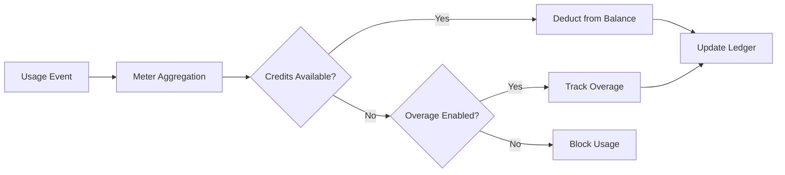

<Info>
Zähler wandeln Rohereignisse in abrechenbare Mengen um. Sie filtern Ereignisse und wenden Aggregationsfunktionen (Count, Sum, Max, Last) an, um die Nutzung pro Kunde zu berechnen.
</Info>

<Frame>

</Frame>

## API-Ressourcen

<AccordionGroup>
<Accordion title="View Meter API References">
<CardGroup cols={2}>
<Card title="Create Meter" icon="plus" href="/api-reference/meters/create-meter">
Erstellen Sie Zähler programmatisch über die API.
</Card>

<Card title="List Meters" icon="list" href="/api-reference/meters/get-meters">
Rufen Sie alle Zähler in Ihrem Konto ab.
</Card>

<Card title="Get Meter" icon="eye" href="/api-reference/meters/retrieve-meter">
Holen Sie Details für einen bestimmten Zähler anhand der ID.
</Card>

<Card title="Archive Meter" icon="arrow-rotate-right" href="/api-reference/meters/archive-meter">
Archivieren Sie einen Zähler, um die Nachverfolgung der Nutzung zu stoppen.
</Card>

<Card title="Unarchive Meter" icon="arrow-rotate-left" href="/api-reference/meters/unarchive-meter">
Stellen Sie einen archivierten Zähler wieder her, um die Nachverfolgung fortzusetzen.
</Card>
</CardGroup>
</Accordion>
</AccordionGroup>

## Einen Zähler erstellen

<Steps>
<Step title="Basic Information">
<ParamField path="Meter Name" type="string" required>
Beschreibender Name (z. B. „API Requests“, „Token Usage“)
</ParamField>

<ParamField path="Event Name" type="string" required>
Exakter Ereignisname, der übereinstimmen muss (Groß-/Kleinschreibung beachten). Beispiele: `api.call`, `image.generated`
</ParamField>
</Step>

<Step title="Aggregation">
<ParamField path="Aggregation Type" type="string" required>
Wählen Sie aus, wie Ereignisse aggregiert werden:

- **Count**: Gesamtanzahl von Ereignissen (API-Aufrufe, Uploads)
- **Sum**: Addition numerischer Werte (Tokens, Bytes)
- **Max**: Höchster Wert im Zeitraum (Spitzenbenutzer)
- **Last**: Aktuellster Wert
</ParamField>

<ParamField path="Over Property" type="string">
Metadaten-Schlüssel zur Aggregation (erforderlich für alle Typen außer Count). Beispiele: `tokens`, `bytes`, `duration_ms`
</ParamField>

<ParamField path="Measurement Unit" type="string" required>
Einheitenbezeichnung für Rechnungen. Beispiele: `calls`, `tokens`, `GB`, `hours`
</ParamField>
</Step>

<Step title="Filtering (Optional)">
<Frame>

</Frame>

Fügen Sie Bedingungen hinzu, um zu filtern, welche Ereignisse gezählt werden:
- **UND-Logik**: Alle Bedingungen müssen übereinstimmen
- **ODER-Logik**: Jede Bedingung kann übereinstimmen

**Vergleichsoperatoren**: gleich, ungleich, größer als, kleiner als, enthält

Aktivieren Sie Filter, wählen Sie die Logik, und fügen Sie Bedingungen mit Property-Key, Vergleichsoperator und Wert hinzu.
</Step>

<Step title="Create">
Überprüfen Sie die Konfiguration und klicken Sie auf **Create Meter**.
</Step>
</Steps>

## Analysen anzeigen

<Frame>

</Frame>

Ihr Zähler-Dashboard zeigt:
- **Übersicht**: Gesamtnutzung und Nutzungsgrafik
- **Ereignisse**: Einzelne empfangene Ereignisse
- **Kunden**: Nutzung und Gebühren pro Kunde

## Abrechnung in Credits statt Währung

Standardmäßig berechnen Meter Kunden pro Einheit in Dollar (oder deiner konfigurierten Währung). Du kannst stattdessen ein Meter so konfigurieren, dass es **vom Credit-Guthaben abzieht** – sodass Nutzung Credits verbraucht statt eine monetäre Gebühr zu erzeugen.

<Info>
Die kreditbasierte Abrechnung benötigt eine [Credit-Berechtigung](/features/credit-based-billing), die demselben Produkt zugeordnet ist. Lege zuerst deinen Credit an und verknüpfe ihn dann mit dem Meter.
</Info>

### Wann man kreditbasierte Abrechnung verwenden sollte

| Szenario | Standard (Währung) | Kreditbasiert |
|----------|-------------------|--------------|
| Einfache Preis pro Einheit ($0,01/Call) | ✅ Beste Wahl | Überflüssiger Mehraufwand |
| Prepaid-Credit-Pakete (10.000 Tokens kaufen, über Zeit nutzen) | ❌ Nicht darstellbar | ✅ Beste Wahl |
| Gebündelte Nutzung mit Abos (Pro-Plan enthält 100K Calls) | Möglich über kostenlosen Schwellenwert | ✅ Besser – Credits rollen über, verfallen, werden im Portal angezeigt |
| Produkte mit mehreren Metern, die einen Credit-Pool teilen | ❌ Jeder Meter rechnet separat ab | ✅ Alle Meter ziehen von einem Guthaben ab |

### Konfiguration eines Meters für Credit-Abzug

<Steps>
<Step title="Create a Credit Entitlement">
Erstelle zuerst einen Credit unter **Products → Credits**. Definiere die Einheit (z. B. „API Calls“, „Tokens“), die Genauigkeit und Lebenszyklus-Einstellungen (Ablauf, Übertragung, Überziehung).

Sieh dir den [Credit-Based Billing guide](/features/credit-based-billing) für detaillierte Anleitungen an.
</Step>

<Step title="Create or Edit a Usage-Based Product">
Gehe zu deinem nutzungsbasierten Produkt und öffne den Konfigurationsbereich **Meter**.
</Step>

<Step title="Add a Meter">
Klicke auf die **+**-Schaltfläche, um ein Meter anzufügen. Konfiguriere wie gewohnt den Ereignisnamen, den Aggregationstyp und die Messeinheit.
</Step>

<Step title="Enable 'Bill Usage in Credits'">
Aktiviere **Bill usage in Credits** in der Meter-Konfiguration. Dadurch werden die Credit-Einstellungen sichtbar:

<Frame caption="Toggle 'Bill usage in Credits' to switch from currency-based to credit-based deduction.">

</Frame>

<ParamField path="Credit Entitlement" type="string" required>
Wähle aus, von welcher Credit-Berechtigung dieses Meter abbuchen soll.
</ParamField>

<ParamField path="Meter units per credit" type="number" required>
Die Anzahl der Nutzungseinheiten, die benötigt werden, um 1 Credit abzuziehen. Beispielsweise:
- `1` = jedes Meter-Ereignis zieht 1 Credit ab
- `100` = 100 Meter-Ereignisse ziehen 1 Credit ab
- `1000` = 1.000 API-Aufrufe verbrauchen 1 Credit
</ParamField>
</Step>

<Step title="Set the Free Threshold">
Der **kostenlose Schwellenwert** gilt weiterhin – Ereignisse unterhalb dieses Schwellenwerts ziehen keine Credits ab.

**Beispiel**: Mit einem kostenlosen Schwellenwert von 1.000 und meter-units-per-credit von 1:
- Kunde nutzt 2.500 API-Aufrufe
- Die ersten 1.000 sind kostenlos
- Die verbleibenden 1.500 ziehen 1.500 Credits vom Guthaben ab
</Step>
</Steps>

### So funktioniert die Credit-Abrechnung

Sobald konfiguriert, läuft die Abzugs-Pipeline automatisch ab:

1. **Ereignisse treffen ein** – Deine Anwendung sendet Nutzungsevents über die [Event Ingestion API](/features/usage-based-billing/event-ingestion)
2. **Meter aggregiert** – Ereignisse werden gemäß deiner Meter-Konfiguration aggregiert (Count, Sum, Max, Last)
3. **Hintergrundprozesse** – Jede Minute holt ein Worker neue Ereignisse seit dem letzten Checkpoint
4. **Credits werden abgezogen** – Aggregierte Nutzung wird mit dem `meter_units_per_credit` Satz in Credits umgerechnet und nach **FIFO-Reihenfolge** abgebucht (älteste Grants zuerst)
5. **Überziehungen werden erfasst** – Wenn das Guthaben null erreicht und Überziehung aktiviert ist, läuft die Nutzung weiter und die Überziehung wird gemäß dem konfigurierten Verhalten behandelt (bei Reset erlassen, auf der nächsten Rechnung berechnet oder als Defizit vorgetragen)

<Warning>
Die Credit-Abrechnung läuft asynchron (etwa jede Minute). Zwischen Ereigniseinspeisung und Guthabenabzug kann es zu kurzen Verzögerungen kommen. Gestalte deine Anwendung so, dass sie diese Verzögerung berücksichtigt – verlasse dich nicht auf Echtzeit-Guthabenkontrollen für einzelne Anfragen.
</Warning>

### Mehrere Meter, ein Credit-Pool

Du kannst mehrere Meter desselben Produkts mit derselben **Credit-Berechtigung** verknüpfen. Alle Meter ziehen von einem gemeinsamen Guthaben ab.

**Beispiel**: Eine KI-Plattform mit zwei Metern:
- `text.generation` – 1 Credit pro 1.000 Tokens
- `image.generation` – 10 Credits pro Bild

Beide ziehen aus dem gleichen „AI Credits“-Pool. Der Kunde sieht ein einheitliches Guthaben in seinem Portal.

<Tip>
Nutze unterschiedliche `meter_units_per_credit` Sätze pro Meter, um relative Kosten auszudrücken. Teure Operationen (Bildgenerierung) verlangen weniger Meter-Einheiten pro Credit als günstige (Textvervollständigung).
</Tip>

<CardGroup cols={2}>
<Card title="List Customer Ledger" icon="scroll" href="/api-reference/credit-entitlements/list-customer-ledger">
Sieh dir den vollständigen Verlauf der Credit-Abzüge für einen Kunden an.
</Card>
<Card title="Get Customer Balance" icon="wallet" href="/api-reference/credit-entitlements/get-customer-balance">
Prüfe das aktuelle Credit-Guthaben eines Kunden über die API.
</Card>
</CardGroup>

## Fehlerbehebung

<AccordionGroup>
<Accordion title="Events not appearing">
- Der Ereignisname muss exakt übereinstimmen (Groß-/Kleinschreibung)
- Überprüfe, dass Meter-Filter Ereignisse nicht ausschließen
- Verifiziere, dass Kunden-IDs existieren
- Deaktiviere Filter vorübergehend zum Testen
</Accordion>

<Accordion title="Aggregation not working">
- Überprüfe, ob Over Property genau dem Metadaten-Schlüssel entspricht
- Verwende Zahlen, keine Strings: `tokens: 150` nicht `"150"`
- Füge erforderliche Eigenschaften in allen Ereignissen hinzu
</Accordion>

<Accordion title="Filters not working">
- Achte auf exakte Groß-/Kleinschreibung
- Verwende die korrekten Operatoren für den Datentyp
- Stelle sicher, dass Ereignisse gefilterte Eigenschaften enthalten
</Accordion>

<Accordion title="Wrong usage totals">
- Überprüfe den Events-Tab, um die tatsächlich empfangenen Ereignisse zu zählen
- Verifiziere den Aggregationstyp (Count vs Sum)
- Stelle sicher, dass Werte für Sum/Max numerisch sind
</Accordion>
</AccordionGroup>

## Nächste Schritte

<CardGroup cols={2}>

<Card title="Send Events" icon="bolt" href="/features/usage-based-billing/event-ingestion">
Beginne damit, Nutzungsevents aus deiner Anwendung an deine Meter zu senden.
</Card>

<Card title="View Blueprints" icon="copy" href="/features/usage-based-billing/ingestion-blueprints">
Nutze fertige Meter-Konfigurationen für gängige Anwendungsfälle.
</Card>
</CardGroup>
