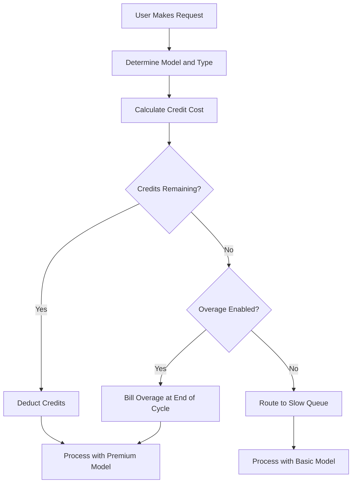

## How Cursor Bills

Cursor uses a hybrid model that combines a monthly subscription with a depleting credit pool. This approach provides a predictable price for users while managing the variable costs of different AI models.
1. **Pricing Tiers**: Cursor offers tiers from Hobby to Ultra, balancing premium and standard access to fit different workflows.


| Plan | Price | Premium Requests | Slow Requests |
| :--- | :--- | :--- | :--- |
| Hobby | Free | 50/month | Unlimited |
| Pro | \$20/month | 500/month | Unlimited |
| Pro+ | \$60/month | Unlimited premium | - |
| Ultra | \$200/month | Unlimited premium | - |

2. **Model-Weighted Depletion**: Different requests consume different amounts of credits based on the underlying model's cost. This allows Cursor to offer a single subscription that covers multiple providers while ensuring expensive operations are accounted for.


| Request Type | Model | Credit Cost |
| :--- | :--- | :--- |
| Tab Completion | Default | 0 |
| Chat | GPT-4o Mini | 1 |
| Chat | Claude 3.5 Sonnet | 1 |
| Composer | GPT-4o | 5 |
| Agent | Claude 3.5 Sonnet | 10 |
| Agent | o1-preview | 25 |

3. **Credit Exhaustion and Overages**: When credits run out, users move to a "Slow" queue with cheaper models instead of being cut off. Alternatively, they can enable usage-based overages to maintain premium access at a fixed per-request cost.




4. **Enterprise and Business**: Teams use pooled usage where the entire organization shares a single credit bucket. This simplifies management and ensures heavy users don't hit individual limits while others have unused capacity.


## What Makes It Unique

Cursor's model balances user experience with infrastructure costs by solving problems that traditional SaaS billing models struggle with.
- **Provider Abstraction**: A single subscription wraps multiple LLM providers like OpenAI and Anthropic, handling complex pricing and API keys behind the scenes.
- **Weighted Depletion**: Costs align with value by charging more for powerful models, making the pricing feel fair and transparent for all users.
- **Graceful Degradation**: The "Slow" queue prevents hard cutoffs, keeping users in the product and encouraging upgrades without being punitive.
- **Pooled Credits**: Team-level buckets reduce friction for enterprise customers by allowing efficient resource sharing across the entire organization.


## Build This with Dodo Payments

You can replicate this exact model using Dodo Payments' credit entitlements and usage-based billing. The following steps will guide you through the implementation.

<Steps>
  <Step title="Create a Custom Unit Credit Entitlement">
    First, define the credit system in the Dodo dashboard. This entitlement will represent the "Premium Requests" that users get with their subscription.

    *   **Credit Type:** Custom Unit
    *   **Unit Name:** "Premium Requests"
    *   **Precision:** 0 (since you can't use half a request)
    *   **Credit Expiry:** 30 days (this ensures credits reset each billing cycle)
    *   **Rollover:** Disabled (unused requests don't carry over to the next month)
    *   **Overage:** Enabled
    *   **Price Per Unit:** \$0.04 (the cost for each request after the initial pool is exhausted)
    *   **Overage Behavior:** Bill overage at billing (this adds the overage cost to the next invoice)

    This configuration ensures that users have a fixed pool of requests each month, with the option to pay for more if they need them. It's the foundation of the hybrid billing model.
  </Step>

  <Step title="Create Subscription Products">
    Create separate products for each tier. Attach the same credit entitlement to each product, but with different amounts. This allows you to manage all tiers with a single credit system, making it easy to upgrade or downgrade users.

    *   **Hobby:** \$0/month, 50 credits/cycle
    *   **Pro:** \$20/month, 500 credits/cycle
    *   **Pro+:** \$60/month, 5000 credits/cycle (effectively unlimited for most)
    *   **Ultra:** \$200/month, 50000 credits/cycle (effectively unlimited)

    When a user subscribes to one of these products, Dodo automatically allocates the corresponding number of credits to their account. This happens instantly, providing a seamless onboarding experience.
  </Step>

  <Step title="Create a Usage Meter Linked to Credits">
    Create a meter named `ai.request` with **Sum** aggregation on the `credit_cost` property. Link this meter to your credit entitlement by enabling the "Bill usage in Credits" toggle. Set the meter units per credit to 1.

    To handle model-weighted depletion, you'll manage the credit cost at the application level. When a user makes a request, your app determines the cost based on the model or action type.

    ```typescript
    import DodoPayments from 'dodopayments';
    
    /**
     * Determines the credit cost for a given request type and model.
     * This logic lives in your application and can be updated without
     * changing your billing configuration.
     */
    function getCreditCost(requestType: string, model: string): number {
      const costs: Record<string, Record<string, number>> = {
        'tab_completion': { 'default': 0 },
        'chat': { 'gpt-4o-mini': 1, 'gpt-4o': 1, 'claude-sonnet': 1 },
        'composer': { 'gpt-4o-mini': 2, 'gpt-4o': 5, 'claude-sonnet': 5 },
        'agent': { 'gpt-4o': 10, 'claude-sonnet': 10, 'o1': 25 }
      };
      
      // Default to 1 credit if the combination isn't found
      return costs[requestType]?.[model] ?? 1;
    }
    
    /**
     * Ingests usage events into Dodo Payments.
     * For weighted requests, we send multiple events or use a sum aggregation.
     */
    async function trackRequest(customerId: string, requestType: string, model: string) {
      const creditCost = getCreditCost(requestType, model);
      
      // Tab completions are free, so we don't need to track them for billing
      if (creditCost === 0) return;
      
      const client = new DodoPayments({
        bearerToken: process.env.DODO_PAYMENTS_API_KEY,
      });
      
      await client.usageEvents.ingest({
        events: [{
          event_id: `req_${Date.now()}_${Math.random().toString(36).slice(2)}`,
          customer_id: customerId,
          event_name: 'ai.request',
          timestamp: new Date().toISOString(),
          metadata: {
            request_type: requestType,
            model: model,
            credit_cost: creditCost
          }
        }]
      });
    }
    ```

    <Tip>
      If you want to use a single event for weighted requests, set your meter aggregation to **Sum** and use a property like `credit_cost` as the value to sum. This is often more efficient for high-volume ingestion and simplifies your application logic.
    </Tip>
  </Step>

  <Step title="Handle Credit Exhaustion (Slow Queue)">
    Listen for the `credit.balance_low` webhook from Dodo. When a user's credits are near zero, you can switch them to a slow queue in your application. This is where you implement the "graceful degradation" logic.

    ```typescript
    import DodoPayments from 'dodopayments';
    import express from 'express';
    
    const app = express();
    app.use(express.raw({ type: 'application/json' }));
    
    const client = new DodoPayments({
      bearerToken: process.env.DODO_PAYMENTS_API_KEY,
      webhookKey: process.env.DODO_PAYMENTS_WEBHOOK_KEY,
    });
    
    app.post('/webhooks/dodo', async (req, res) => {
      try {
        const event = client.webhooks.unwrap(req.body.toString(), {
          headers: {
            'webhook-id': req.headers['webhook-id'] as string,
            'webhook-signature': req.headers['webhook-signature'] as string,
            'webhook-timestamp': req.headers['webhook-timestamp'] as string,
          },
        });
        
        if (event.type === 'credit.balance_low') {
          const customerId = event.data.customer_id;
          await updateUserTier(customerId, 'slow');
          await notifyUser(customerId, 'You have used most of your premium requests. Switching to standard models.');
        }
        
        res.json({ received: true });
      } catch (error) {
        res.status(401).json({ error: 'Invalid signature' });
      }
    });
    
    /**
     * Routes a request based on the user's current tier.
     * This function is called before every AI request to determine the model and queue.
     */
    async function routeRequest(customerId: string, requestType: string) {
      const tier = await getUserTier(customerId);
      
      if (tier === 'slow') {
        // Route to a cheaper model and a lower priority queue
        // This saves costs while keeping the user active in the product
        return { model: 'gpt-4o-mini', queue: 'standard' };
      }
      
      // Premium routing for users with remaining credits
      // This provides the best possible performance and model quality
      return { model: 'claude-sonnet', queue: 'priority' };
    }
    ```
  </Step>

  <Step title="Create Checkout">
    Finally, generate a checkout session for the user to subscribe to a plan. Dodo handles the payment processing, tax compliance, and credit allocation automatically.

    ```typescript
    import DodoPayments from 'dodopayments';
    
    const client = new DodoPayments({
      bearerToken: process.env.DODO_PAYMENTS_API_KEY,
    });
    
    /**
     * Creates a checkout session for a new subscription.
     * This is typically called when a user clicks an "Upgrade" button.
     */
    const session = await client.checkoutSessions.create({
      product_cart: [
        { product_id: 'prod_cursor_pro', quantity: 1 }
      ],
      customer: { email: 'developer@example.com' },
      return_url: 'https://yourapp.com/dashboard'
    });
    ```
  </Step>
</Steps>

## Accelerate with the LLM Ingestion Blueprint

The credit-weighted billing above handles your core monetization. For deeper analytics on actual token consumption across providers, the [LLM Ingestion Blueprint](/developer-resources/ingestion-blueprints/llm) can run alongside your credit system.

```bash
npm install @dodopayments/ingestion-blueprints
```

```typescript
import { createLLMTracker } from '@dodopayments/ingestion-blueprints';
import OpenAI from 'openai';
import Anthropic from '@anthropic-ai/sdk';

// Track raw token usage for analytics alongside credit-weighted billing
const openaiTracker = createLLMTracker({
  apiKey: process.env.DODO_PAYMENTS_API_KEY,
  environment: 'live_mode',
  eventName: 'analytics.openai_tokens',
});

const anthropicTracker = createLLMTracker({
  apiKey: process.env.DODO_PAYMENTS_API_KEY,
  environment: 'live_mode',
  eventName: 'analytics.anthropic_tokens',
});

const openai = new OpenAI({ apiKey: process.env.OPENAI_API_KEY });
const anthropic = new Anthropic({ apiKey: process.env.ANTHROPIC_API_KEY });

// Wrap each provider separately
const trackedOpenAI = openaiTracker.wrap({ client: openai, customerId: 'customer_123' });
const trackedAnthropic = anthropicTracker.wrap({ client: anthropic, customerId: 'customer_123' });

// Token tracking is automatic, credit deduction still uses your weighted system
const response = await trackedOpenAI.chat.completions.create({
  model: 'gpt-4o',
  messages: [{ role: 'user', content: 'Hello!' }],
});
```

This gives you two layers of data: credit-weighted billing for monetization and raw token counts for cost analysis and margin tracking.

<Tip>
The LLM Blueprint supports OpenAI, Anthropic, Groq, Google Gemini, and more. See the [full blueprint documentation](/developer-resources/ingestion-blueprints/llm) for all supported providers.
</Tip>

## Pooled Team Credits (Enterprise)

Cursor's Business and Enterprise plans pool credits across a team. You can implement this with Dodo by creating a single subscription for the organization rather than individual users. This ensures that the team's usage is consolidated and managed as a single entity, which is a major requirement for larger customers.

### Implementation Strategy

1.  **Organization-Level Customer:** Create a single `customer_id` in Dodo for the entire organization. This customer represents the billing entity for the team and holds the shared credit pool. All invoices and credit allocations are tied to this ID.
2.  **Seat-Based Billing:** Use Dodo's add-ons to charge a per-user platform fee. When a team adds a new member, you update the quantity of the "Seat" add-on. This ensures your revenue scales with the number of users while keeping the credit pool separate. It's a clean way to handle multi-dimensional billing.
3.  **Shared Usage Tracking:** All team members' requests are ingested using the organization's `customer_id`. This ensures that every request from any team member depletes the same central credit pool. You can still track individual user usage by including a `user_id` in the event metadata for internal reporting and analytics.

This approach gives you the best of both worlds: a predictable per-user fee for the platform and a shared pool of credits for the expensive AI resources. It also simplifies the user experience for team members, as they don't have to manage their own individual limits.

## Comparison with Traditional SaaS Billing

Traditional SaaS billing usually involves flat-rate tiers (e.g., \$10/month for 100 units). If a user needs 101 units, they often have to jump to a \$50/month tier. This creates "cliff" effects that can frustrate users and lead to churn. It also doesn't account for the variable cost of different types of usage, which is critical in the AI space.

Cursor's model, powered by Dodo, is much more flexible and fair:

*   **No "Cliff" Effects:** Users don't have to upgrade just because they hit a limit. They can pay for overages or accept slower performance. This keeps them in the product and reduces friction, leading to higher customer satisfaction and lower churn.
*   **Cost Alignment:** Your revenue scales directly with your infrastructure costs. If a user uses expensive models, they pay more (either through credits or overages). This protects your margins and allows you to offer high-cost features sustainably without risking your business model.
*   **Better Retention:** By not cutting users off, you keep them engaged with your product even when they've reached their limit. They can continue to work, which builds long-term loyalty and increases the lifetime value of the customer. It's a win-win for both the user and the provider.

## Handling Model Updates and Evolution

One of the challenges with AI billing is that models are constantly being updated or replaced. New models might have different cost structures or performance characteristics. With Dodo's credit system, you can handle this gracefully at the application level without needing to migrate your billing data.

If you introduce a new, more expensive model, you simply update your `getCreditCost` function to assign it a higher cost. You don't need to change your billing configuration or update existing subscriptions. This decoupling of billing and application logic is a major advantage, as it allows you to iterate on your product at the speed of AI without being constrained by your billing system.

## User Notifications and Transparency

To provide a great user experience, it's important to keep users informed about their credit usage. Transparency builds trust and helps users manage their costs effectively. You can use Dodo's webhooks to trigger notifications at various thresholds (e.g., 50%, 80%, and 100% usage).

These notifications can be sent via email, in-app alerts, or Slack messages. By providing real-time feedback on usage, you encourage users to manage their consumption or upgrade their plan before they hit the "slow queue". This proactive approach reduces support tickets and improves the overall user experience, making your product feel more professional and user-centric.

## Security and Fraud Prevention

When implementing a credit-based system, it's important to consider security and fraud prevention. Since credits have a direct monetary value, they can be a target for abuse.

*   **Idempotency:** Always use unique `event_id`s when ingesting usage events to prevent double-counting. Dodo's ingestion API handles idempotency automatically if you provide a unique ID, ensuring that a network retry doesn't charge the user twice.
*   **Rate Limiting:** Implement rate limiting at the application level to prevent a single user from exhausting their credits (or your API budget) too quickly. This protects your infrastructure and the user's wallet.
*   **Monitoring:** Monitor usage patterns for anomalies that might indicate account sharing or automated abuse. Dodo's analytics can help you identify these patterns, allowing you to take action before they become a major problem.

## Best Practices for Credit Systems

When building a credit-based billing system, keep these best practices in mind:

1.  **Keep it Simple:** Don't make your credit system too complex. Users should be able to easily understand how much a request costs and how many credits they have left.
2.  **Provide Value:** Ensure that the credits provide real value to the user. If the cost of a request is too high, users will feel like they're being nickel-and-dimed.
3.  **Be Transparent:** Always show the user their current credit balance and usage history. This builds trust and reduces confusion.
4.  **Automate Everything:** Use Dodo's webhooks and APIs to automate as much of the billing process as possible. This reduces manual work and ensures that your billing is always accurate.

## Key Dodo Features Used

<CardGroup cols={2}>
  <Card title="Credit-Based Billing" icon="coins" href="/features/credit-based-billing">
    Manage depleting credit pools and overages with custom units.
  </Card>
  <Card title="Subscriptions" icon="calendar" href="/features/subscription">
    Set up recurring billing for different tiers with integrated credits.
  </Card>
  <Card title="Usage-Based Billing" icon="chart-line" href="/features/usage-based-billing/introduction">
    Track events and bill based on consumption in real-time.
  </Card>
  <Card title="Event Ingestion" icon="bolt" href="/features/usage-based-billing/event-ingestion">
    Send high-volume usage data to Dodo with low latency.
  </Card>
  <Card title="Webhooks" icon="webhook" href="/developer-resources/webhooks/intents/credit">
    React to credit balance changes and automate user tiering.
  </Card>
  <Card title="LLM Ingestion Blueprint" icon="brain-circuit" href="/developer-resources/ingestion-blueprints/llm">
    Automatic token tracking across multiple LLM providers.
  </Card>
</CardGroup>
