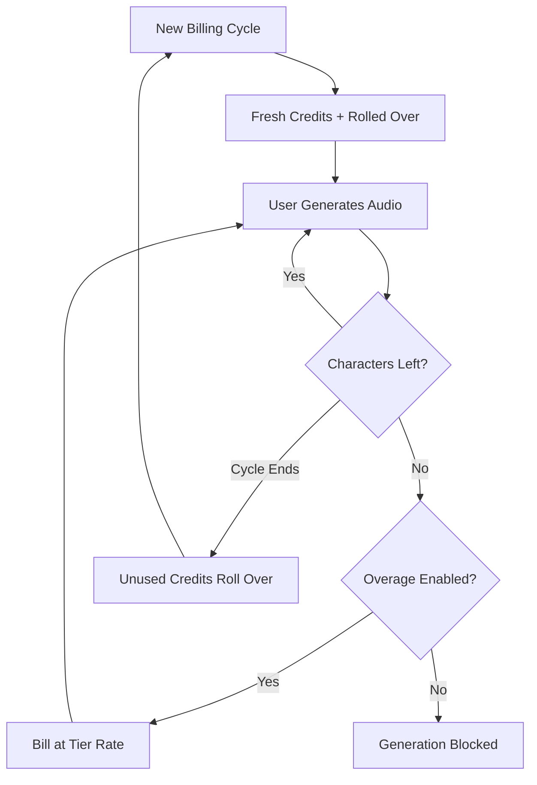

ElevenLabs has built a dominant position in the AI voice space by making their billing as fluid as their speech synthesis. Their model centers on a single unit of value: the character. Whether you are generating text-to-speech, cloning a voice, or dubbing a video, you consume from a unified pool of character credits.

## How ElevenLabs Bills

The ElevenLabs pricing structure uses fixed monthly quotas tied to subscription tiers. As users move to higher tiers, they get more characters and access to more advanced features like professional voice cloning or commercial rights.

| Plan | Price | Characters/Month | Overage Rate |
| :--- | :--- | :--- | :--- |
| Free | \$0 | 10,000 | Not available |
| Starter | \$5/month | 30,000 | ~\$0.30/1K chars |
| Creator | \$22/month | 100,000 | ~\$0.24/1K chars |
| Pro | \$99/month | 500,000 | ~\$0.15/1K chars |
| Scale | \$330/month | 2,000,000 | ~\$0.10/1K chars |

1. **Character-based pricing**: Characters are the universal currency across the platform. Text-to-Speech, Dubbing, and Voice Cloning all draw from this same balance, simplifying usage tracking.
2. **Rollover mechanics**: Unused characters roll over to the next billing cycle instead of expiring. ElevenLabs applies a cap to prevent infinite accumulation, ensuring users retain value from their subscription.
3. **Tiered overages**: Overages are handled based on the subscription tier. Lower plans have overages disabled by default for safety, while higher tiers allow opt-in charges to maintain service continuity.


## What Makes It Unique

Several strategic choices make the ElevenLabs billing model particularly effective for retaining users and encouraging upgrades.

- **Character Rollover**: Rollover credits reduce "use it or lose it" anxiety by carrying forward unused investment. This maintains subscription value even during periods of lower activity.
- **Tiered Overage Pricing**: Overage rates decrease as plan sizes increase, creating a strong incentive to upgrade. Users often find higher tiers more attractive due to the lower cost of additional usage.
- **Unified Consumption**: A single character pool for all services removes the cognitive burden of managing separate quotas. Users only need to track one number to understand their remaining capacity.
- **Opt-in Overages**: Professional users can enable overages for continuity, while casual users benefit from the safety of a hard cap.



## Build This with Dodo Payments

You can replicate this sophisticated model using Dodo Payments' credit-based billing and usage metering.

<Steps>
<Step title="Create a Custom Unit Credit Entitlement">
First, define the "Characters" unit that will serve as your platform's currency.

1. Go to **Entitlements** in your Dodo dashboard.
2. Create a new **Credit Entitlement**.
3. Set the **Credit Type** to **Custom Unit**.
4. Name the unit "Characters".
5. Set **Precision** to 0, as characters are always whole units.
6. Set **Credit Expiry** to 30 days to match the monthly billing cycle.
7. Enable **Rollover** with these settings:
    - **Max Rollover Percentage**: 100% (allows all unused characters to carry over).
    - **Rollover Timeframe**: 1 Month.
    - **Max Rollover Count**: 1 (credits can roll over once, then they expire).
</Step>

<Step title="Create Tiered Subscription Products">
Create five subscription products. You will attach the same "Characters" entitlement to each, but with different configurations for each tier.

| Product | Price | Credits/Cycle | Overage Enabled | Overage Price (per 1K chars) |
| :--- | :--- | :--- | :--- | :--- |
| Free | \$0/mo | 10,000 | No | - |
| Starter | \$5/mo | 30,000 | Yes (opt-in) | \$0.30 |
| Creator | \$22/mo | 100,000 | Yes | \$0.24 |
| Pro | \$99/mo | 500,000 | Yes | \$0.15 |
| Scale | \$330/mo | 2,000,000 | Yes | \$0.10 |

When you attach the credit entitlement to each product, uncheck **Import Default Credit Settings**. This allows you to set the specific **Price Per Unit** for overages on that specific tier. Set the **Overage Behavior** to **Bill overage at billing** and configure a **Low Balance Threshold** at 10% of the tier's quota.
</Step>

<Step title="Create a Usage Meter">
The usage meter connects your application's activity to the credit system.

1. Create a new meter named `tts.characters`.
2. Set the **Aggregation** to **Sum**. This will add up the `characters` property from every event you send.
3. Link this meter to your "Characters" credit entitlement.
4. Set **Meter units per credit** to 1. This ensures that one character used in your app equals one credit deducted from the balance.
</Step>

<Step title="Send Usage Events">
Integrate the usage tracking into your application code. Every time a user generates audio, send an event to Dodo.

```typescript
async function trackGeneration(
  customerId: string,
  text: string, 
  service: 'tts' | 'dubbing' | 'cloning'
) {
  const characterCount = text.length;
  
  await fetch('https://api.dodopayments.com/events/ingest', {
    method: 'POST',
    headers: {
      'Authorization': `Bearer ${process.env.DODO_API_KEY}`,
      'Content-Type': 'application/json'
    },
    body: JSON.stringify({
      events: [{
        event_id: `gen_${Date.now()}_${Math.random().toString(36).slice(2)}`,
        customer_id: customerId,
        event_name: 'tts.characters',
        timestamp: new Date().toISOString(),
        metadata: {
          characters: characterCount,
          service: service,
          voice_id: 'voice_abc123'
        }
      }]
    })
  });
}
```
</Step>

<Step title="Handle Low Balance and Overage">
Use webhooks to keep your users informed about their character usage.

```typescript
app.post('/webhooks/dodo', async (req, res) => {
  const event = req.body;
  
  switch (event.type) {
    case 'credit.balance_low':
      await notifyUser(event.data.customer_id, 
        'You are running low on characters. Consider upgrading your plan for more characters and lower overage rates.'
      );
      break;
      
    case 'credit.deducted':
      // Track usage for analytics
      await logUsage(event.data);
      break;
      
    case 'credit.overage_charged':
      await notifyUser(event.data.customer_id,
        'You have exceeded your character quota. Overage charges will appear on your next invoice.'
      );
      break;
  }
  
  res.json({ received: true });
});
```
</Step>

<Step title="Create Checkout">
When a user is ready to subscribe, create a checkout session for the chosen tier.

```typescript
const session = await client.checkoutSessions.create({
  product_cart: [
    { product_id: 'prod_elevenlabs_pro', quantity: 1 }
  ],
  customer: { email: 'creator@example.com' },
  return_url: 'https://yourapp.com/dashboard'
});
```
</Step>
</Steps>

## Upgrade Incentive: Tiered Overage Pricing

The most brilliant part of the ElevenLabs model is how it uses overage rates to drive upgrades. By making the cost per character cheaper on higher tiers, they change the conversation from "how much do I need?" to "how much can I save?".

| Tier | Included Chars | Overage (per 1K) | Effective Cost at 120K Chars |
| :--- | :--- | :--- | :--- |
| Creator | 100,000 | \$0.24 | \$22 + (20 * \$0.24) = \$26.80 |
| Pro | 500,000 | \$0.15 | \$99 (No overage) |

While the Pro plan is more expensive upfront, a user who frequently hits 120,000 characters on the Creator plan is already paying a premium. The lower overage rate on the Pro plan makes the jump feel like a logical business decision rather than just an added expense.

With Dodo Payments, you implement this by unchecking the **Import Default Credit Settings** box when attaching credits to your subscription products. This gives you full control over the **Price Per Unit** for each specific tier, allowing you to reward your highest-paying customers with the best rates.

## Key Dodo Features Used

<CardGroup cols={2}>
  <Card title="Credit-Based Billing" icon="coins" href="/features/credit-based-billing">
    Manage character quotas, rollovers, and expirations.
  </Card>
  <Card title="Subscriptions" icon="calendar" href="/features/subscription">
    Set up the recurring tiers that deliver monthly character allowances.
  </Card>
  <Card title="Usage-Based Billing" icon="chart-line" href="/features/usage-based-billing/introduction">
    Track real-time character consumption across your services.
  </Card>
  <Card title="Event Ingestion" icon="bolt" href="/features/usage-based-billing/event-ingestion">
    Send high-volume usage data to Dodo with minimal latency.
  </Card>
  <Card title="Webhooks" icon="webhook" href="/developer-resources/webhooks/intents/credit">
    React to low balances and overage events in real-time.
  </Card>
</CardGroup>
