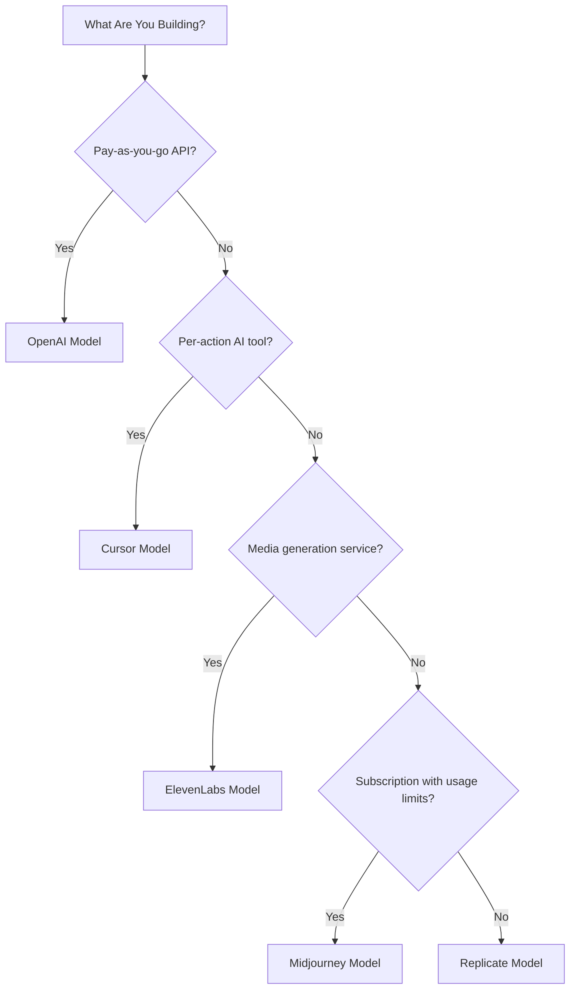

## The Five Models

| App | Primary Metric | Unique Innovation | Dodo Feature |
| :--- | :--- | :--- | :--- |
| OpenAI | Tokens (fiat-denominated) | Prepaid fiat credits with never-expiring balance | Credit-Based Billing (Fiat Credits) |
| Cursor | Premium Requests | Model-weighted credit depletion (different costs per model) | Credit-Based Billing (Custom Unit) |
| ElevenLabs | Characters | Character quotas with rollover + tiered overage pricing | Credit-Based Billing (Rollover + Overage) |
| Midjourney | GPU Time | "Relax Mode" unlimited fallback after quota | Subscription + Usage Meters |
| Replicate | Execution Seconds | Per-second hardware-specific pure metering | Pure Usage-Based Billing |

## Understanding Credit Patterns

| Pattern | Example | Dodo Feature | Unit Type |
| :--- | :--- | :--- | :--- |
| Prepaid fiat-denominated credits | OpenAI API (\$5 credit top-up, no withdrawal) | Credit-Based Billing (Fiat Credits) | Dollar-denominated virtual units |
| Virtual usage credits | Cursor Premium Requests, ElevenLabs Characters | Credit-Based Billing (Custom Unit) | Arbitrary units (requests, characters) |
| Pure consumption metering | Replicate per-second billing | Usage-Based Billing (Meters) | Direct measurement (seconds, bytes) |
| Subscription + metered overage | Midjourney Fast Hours with Relax fallback | Subscription + Usage Meters | Time-based with free threshold |

<Info>
Fiat Credits in Dodo's Credit-Based Billing represent platform-denominated dollar values with no monetary value outside your ecosystem. Customers can't withdraw them as cash.
</Info>

## Which Model Should You Use?

- Building a pay-as-you-go API platform: OpenAI model (Fiat Credits)
- Building an AI tool with per-action pricing: Cursor model (Custom Unit Credits)
- Building a media generation service: ElevenLabs model (Rollover Credits)
- Building a subscription service with usage limits: Midjourney model (Sub + Meters)
- Building an infrastructure/compute platform: Replicate model (Pure Metering)

<CardGroup cols={2}>
  <Card title="OpenAI" icon="/images/logos/openai.svg" href="/developer-resources/billing-deconstructions/openai">
    Replicate the token-based prepaid credit model.
  </Card>
  <Card title="Cursor" icon="/images/logos/cursor.svg" href="/developer-resources/billing-deconstructions/cursor">
    Build model-weighted usage limits.
  </Card>
  <Card title="ElevenLabs" icon="/images/logos/elevenlabs.svg" href="/developer-resources/billing-deconstructions/elevenlabs">
    Implement character quotas with rollover and overages.
  </Card>
  <Card title="Midjourney" icon="/images/logos/midjourney.svg" href="/developer-resources/billing-deconstructions/midjourney">
    Combine subscriptions with usage-based fallback.
  </Card>
  <Card title="Replicate" icon="/images/logos/replicate.svg" href="/developer-resources/billing-deconstructions/replicate">
    Set up pure per-second consumption metering.
  </Card>
</CardGroup>

## Dodo Features

<CardGroup cols={2}>
  <Card title="Credit-Based Billing" href="/features/credit-based-billing">
    Manage prepaid credits and virtual units.
  </Card>
  <Card title="Usage-Based Billing" href="/features/usage-based-billing/introduction">
    Meter consumption in real-time.
  </Card>
  <Card title="Subscriptions" href="/features/subscription">
    Handle recurring billing and plan management.
  </Card>
  <Card title="Hybrid Billing" href="/features/hybrid-billing">
    Combine multiple billing models for maximum flexibility.
  </Card>
</CardGroup>
