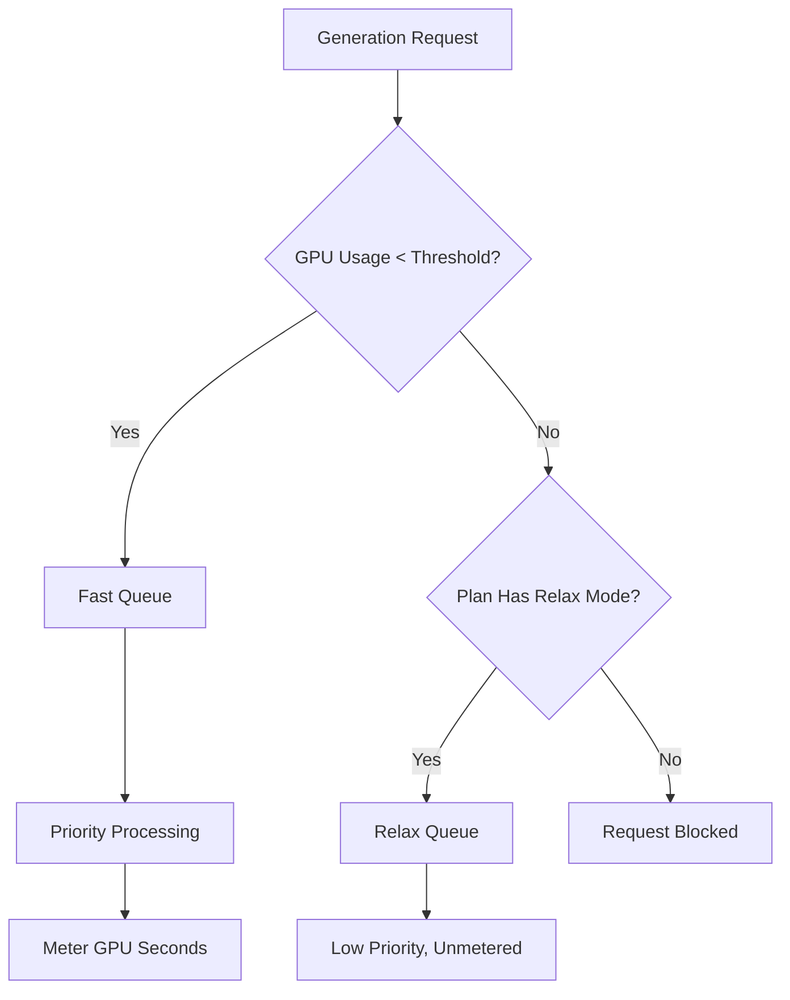

Midjourney is a generative AI platform that uses a unique billing model based on GPU time rather than a simple per-image count. This approach ensures that complex, high-resolution renders cost more than quick, low-resolution drafts.

## How Midjourney Bills

Midjourney's subscription plans grant users a specific number of "Fast GPU Hours" each month. These hours represent the actual computational time spent on your generations.

| Plan | Price | Fast GPU Hours | Relax Mode | Stealth Mode |
| :--- | :--- | :--- | :--- | :--- |
| Basic | \$10/month | ~3.3 hrs | No | No |
| Standard | \$30/month | 15 hrs | Unlimited | No |
| Pro | \$60/month | 30 hrs | Unlimited | Yes |
| Mega | \$120/month | 60 hrs | Unlimited | Yes |

1. **Pricing Tiers**: Midjourney offers four subscription levels ranging from \$10 to \$120 per month, each providing a set amount of Fast GPU hours.
2. **Relax Mode**: Standard and higher plans include unlimited generations through a low-priority queue once Fast hours are exhausted, ensuring users never hit a hard usage wall.
3. **Extra GPU Hours**: Users can purchase additional Fast GPU time for approximately \$4 per hour if they need immediate results after depleting their monthly allocation.
4. **Metering in GPU Seconds**: Usage is tracked by the actual computational time spent on generations, meaning complex renders cost more than simple drafts.
5. **Community Loop**: Active users can earn bonus GPU hours by rating images in the gallery, which helps train models while rewarding the community.
## What Makes It Unique

The Midjourney model is effective because it aligns cost with value and resource usage.

* **GPU-time billing** aligns cost with resource usage, ensuring complex renders are priced fairly compared to simple drafts.
* **Relax Mode** offers an unlimited fallback that reduces churn by maintaining service access even after monthly limits are reached.
* **The Fast vs Relax split** incentivizes upgrades by offering priority processing for users who value speed and instant results.
* **Extra GPU Hours** provide a flexible top-up option for power users who need additional high-priority capacity mid-month.

## Build This with Dodo Payments

You can replicate this model using Dodo Payments by combining subscriptions with usage meters and application-level logic.

<Steps>

<Step title="Create a Usage Meter">

First, create a meter to track the GPU seconds used by each customer.

* **Meter name**: `gpu.fast_seconds`
* **Aggregation**: **Sum** (sum the `gpu_seconds` property from each event)

You will only track events where the generation mode is "fast". Relax mode generations are not metered for billing purposes.

</Step>

<Step title="Create Subscription Products with Usage Pricing">

Create your subscription products and attach the usage meter with a free threshold.

| Product | Base Price | Free Threshold (seconds) | Overage Rate |
| :--- | :--- | :--- | :--- |
| Basic | \$10/month | 12,000 (3.3 hrs) | N/A (Hard Cap) |
| Standard | \$30/month | 54,000 (15 hrs) | \$0.00 (Relax Mode) |
| Pro | \$60/month | 108,000 (30 hrs) | \$0.00 (Relax Mode) |
| Mega | \$120/month | 216,000 (60 hrs) | \$0.00 (Relax Mode) |

For the Basic plan, you will disable overage to enforce a hard cap. For the other plans, the "Relax Mode" is handled by your application logic when the meter shows the threshold is exceeded.

</Step>

<Step title="Implement Application-Level Relax Mode">

The key insight is that Relax Mode is not a billing feature. It is your application routing requests to a slower queue when the Dodo usage meter shows the threshold is reached.

```typescript
async function handleGenerationRequest(customerId: string, prompt: string) {
  const usage = await getCustomerUsage(customerId, 'gpu.fast_seconds');
  const subscription = await getSubscription(customerId);
  const threshold = getThresholdForPlan(subscription.product_id);
  
  if (usage.current >= threshold) {
    if (subscription.product_id === 'prod_basic') {
      throw new Error('Fast GPU hours exhausted. Upgrade to Standard for Relax Mode.');
    }
    
    // Relax Mode. Route to low-priority queue
    return await queueGeneration(customerId, prompt, {
      priority: 'low',
      mode: 'relax',
      model: 'standard'
    });
  }
  
  // Fast Mode. Priority processing
  return await queueGeneration(customerId, prompt, {
    priority: 'high',
    mode: 'fast',
    model: 'premium'
  });
}
```

</Step>

<Step title="Send Usage Events (Fast Mode Only)">

Only send usage events to Dodo when a generation is performed in Fast mode.

```typescript
import DodoPayments from 'dodopayments';

async function trackFastGeneration(customerId: string, gpuSeconds: number, jobId: string) {
  // Only track Fast mode generations. Relax mode is free and unlimited
  const client = new DodoPayments({
    bearerToken: process.env.DODO_PAYMENTS_API_KEY,
  });

  await client.usageEvents.ingest({
    events: [{
      event_id: `gen_${jobId}`,
      customer_id: customerId,
      event_name: 'gpu.fast_seconds',
      timestamp: new Date().toISOString(),
      metadata: {
        gpu_seconds: gpuSeconds,
        resolution: '1024x1024',
        mode: 'fast'
      }
    }]
  });
}
```

</Step>

<Step title="Sell Extra Fast Hours (One-Time Top-Up)">

Create a one-time payment product for "Extra Fast GPU Hour" at \$4. When a customer purchases this, you can grant additional threshold or credits in your application.

```typescript
// After customer purchases extra hours
const session = await client.checkoutSessions.create({
  product_cart: [
    { product_id: 'prod_extra_gpu_hour', quantity: 5 }
  ],
  customer: { customer_id: customerId },
  return_url: 'https://yourapp.com/dashboard'
});
```

</Step>

<Step title="Create Checkout for Subscription">

Finally, create a checkout session for the subscription plan.

```typescript
const session = await client.checkoutSessions.create({
  product_cart: [
    { product_id: 'prod_mj_standard', quantity: 1 }
  ],
  customer: { email: 'artist@example.com' },
  return_url: 'https://yourapp.com/studio'
});
```

</Step>

</Steps>

## Accelerate with the Time Range Ingestion Blueprint

The [Time Range Ingestion Blueprint](/developer-resources/ingestion-blueprints/time-range) simplifies GPU time tracking by providing dedicated helpers for duration-based billing.

```bash
npm install @dodopayments/ingestion-blueprints
```

```typescript
import { Ingestion, trackTimeRange } from '@dodopayments/ingestion-blueprints';

const ingestion = new Ingestion({
  apiKey: process.env.DODO_PAYMENTS_API_KEY,
  environment: 'live_mode',
  eventName: 'gpu.fast_seconds',
});

// Track generation time after a Fast mode job completes
const startTime = Date.now();
const result = await runGeneration(prompt, settings);
const durationMs = Date.now() - startTime;

await trackTimeRange(ingestion, {
  customerId: customerId,
  durationMs: durationMs,
  metadata: {
    mode: 'fast',
    resolution: '1024x1024',
  },
});
```

The blueprint handles duration conversion and event formatting. You only need to provide the customer ID and the elapsed time.

<Tip>
The Time Range Blueprint supports milliseconds, seconds, and minutes. See the [full blueprint documentation](/developer-resources/ingestion-blueprints/time-range) for all duration options and best practices.
</Tip>

## The Fast vs Relax Architecture

The dual-queue system works by routing requests based on the current usage state.



1. All requests go through your application.
2. The application checks the Dodo usage meter against the plan's free threshold.
3. If the usage is under the threshold, the request goes to the Fast queue and is metered.
4. If the usage is over the threshold, the request goes to the Relax queue, which is unmetered and has lower priority.
5. The Basic plan has no Relax fallback, so requests are blocked once the limit is reached.

<Info>
Relax Mode is an application-level pattern, not a Dodo billing feature. Dodo tracks your Fast GPU usage and tells you when the threshold is exceeded. Your application decides whether to block the user or route them to a slower queue.
</Info>

## Key Dodo Features Used

<CardGroup cols={2}>
  <Card title="Subscriptions" icon="calendar" href="/features/subscription">
    Manage recurring billing and plan tiers.
  </Card>
  <Card title="Usage-Based Billing" icon="bolt" href="/features/usage-based-billing/introduction">
    Track and bill based on actual resource consumption.
  </Card>
  <Card title="Event Ingestion" icon="input-pipe" href="/features/usage-based-billing/event-ingestion">
    Send high-volume usage events to the Dodo API.
  </Card>
  <Card title="Meters" icon="gauge" href="/features/usage-based-billing/meters">
    Define how usage events are aggregated and billed.
  </Card>
  <Card title="One-Time Payments" icon="credit-card" href="/features/one-time-payment-products">
    Sell extra hours or top-ups as one-time purchases.
  </Card>
  <Card title="Time Range Blueprint" icon="clock" href="/developer-resources/ingestion-blueprints/time-range">
    Simplified GPU time tracking with duration-based helpers.
  </Card>
</CardGroup>
