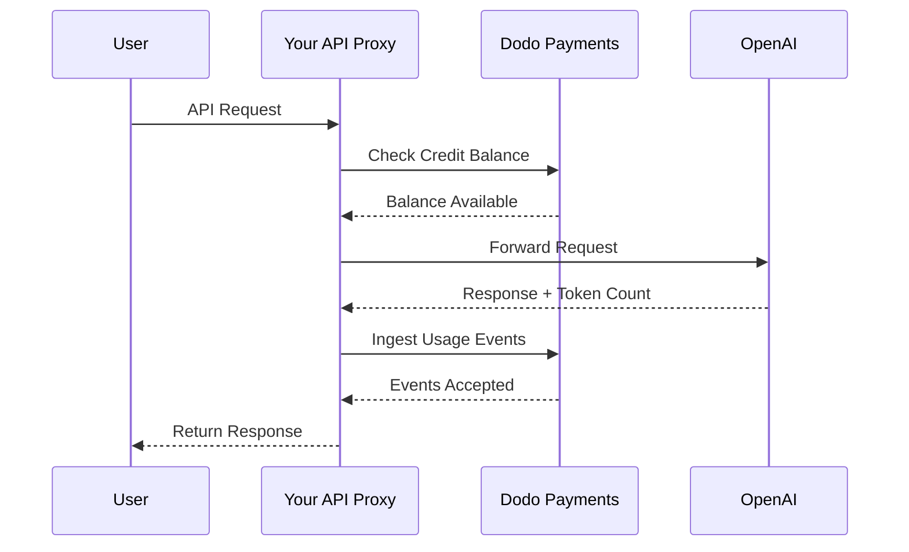
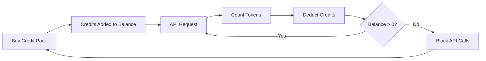

OpenAI's billing model is the gold standard for AI companies. It combines prepaid fiat credits for API usage with flat-rate subscriptions for consumer products. This hybrid approach ensures predictable revenue while allowing developers to scale their usage without friction.

## Why OpenAI's Model is the Standard

The AI industry faces unique challenges that traditional SaaS billing doesn't always address. OpenAI's model solves several of these problems simultaneously.

1. **Predictable Revenue and Low Risk**: By requiring prepaid credits for API usage, OpenAI eliminates the risk of users running up massive bills they can't pay. You get the money upfront, and the user gets the service as they use it.
2. **Scalability for Developers**: A \$5 top-up is a low barrier to entry. As their application grows, developers can automate top-ups or buy larger packs. The friction to start is almost zero, but the ceiling for growth is unlimited.
3. **User Psychology**: Denominating credits in fiat currency (USD) instead of abstract "tokens" or "points" makes the value clear. It feels like a bank account for AI services, which builds trust and makes budgeting easier for companies.

## How OpenAI Bills

OpenAI operates two distinct billing models that cater to different user needs.

1. **API (Pay-as-you-go)**: The API uses prepaid fiat-denominated credits. Users top up their accounts with \$5, \$10, \$50, or more. These credits show a dollar value but have no monetary value outside OpenAI. OpenAI bills per-token with different rates for input and output tokens. Credits never expire, and when a user's balance hits \$0, their API calls fail immediately.
2. **ChatGPT Plus, Team, and Enterprise**: These are flat-rate subscriptions. ChatGPT Plus costs \$20 per month, while the Team plan is \$25 per user per month. These plans have soft usage caps where users get downgraded to a smaller model instead of being blocked.
3. **Spend-based rate tiers**: As you spend more total money over time, you unlock higher API rate limits. This is a trust-based access scaling system tied directly to your billing history.

| Model | Pricing | Input Tokens | Output Tokens |
| :--- | :--- | :--- | :--- |
| GPT-4o | Usage-based | \$2.50 / 1M | \$10.00 / 1M |
| GPT-4o-mini | Usage-based | \$0.15 / 1M | \$0.60 / 1M |
| o1 | Usage-based | \$15.00 / 1M | \$60.00 / 1M |

| Plan | Price | Type |
| :--- | :--- | :--- |
| Free | \$0 | Limited access |
| Plus | \$20 / mo | Subscription with soft caps |
| Team | \$25 / user / mo | Per-seat subscription |
| Enterprise | Custom | Invoiced billing |
## What Makes It Unique

OpenAI's billing strategy has several key characteristics that make it effective for AI services.

- **Fiat-denominated credits**: Credits feel like money because they're denominated in USD. This makes pricing transparent and easy to understand for developers.
- **No expiry**: Never-expiring balances reduce the "use it or lose it" pressure. Users feel comfortable topping up larger amounts because they know the value won't disappear.
- **Multi-dimensional metering**: Input and output tokens are tracked separately but deduct from the same credit balance. This allows OpenAI to price expensive output tokens differently from cheaper input tokens.
- **Trust tiers**: Linking rate limits to total spend encourages users to stay on the platform and rewards long-term customers with better performance.
## Strategic Advantages

This model creates a powerful flywheel. Low entry costs bring in developers. Prepaid credits provide immediate cash flow. Usage-based scaling ensures that as the developers succeed, OpenAI succeeds. The subscription side provides a steady, predictable baseline of revenue from non-developers.

## Build This with Dodo Payments

You can replicate OpenAI's billing model using Dodo Payments. We'll use Credit-Based Billing for the API and standard subscriptions for the ChatGPT Plus side.

<Steps>
  <Step title="Create a Fiat Credit Entitlement">
    Start by creating a credit entitlement in your Dodo Payments dashboard. This will act as the central balance for your users.

    * **Credit Type:** Fiat Credits (USD)
    * **Credit Expiry:** Never
    * **Rollover:** Not needed (since they never expire)
    * **Overage:** Disabled

    Disabling overage ensures that API calls fail when the balance hits \$0, exactly like OpenAI.
  </Step>

  <Step title="Create Top-Up Products">
    Create one-time payment products for different credit packs. You might offer \$5, \$10, \$50, and \$100 options. Attach your fiat credit entitlement to each product.

    Set the credits issued per product in cents. For a \$50 pack, you'll issue 5000 credits.

    ```typescript
    import DodoPayments from 'dodopayments';

    const client = new DodoPayments({
      bearerToken: process.env.DODO_PAYMENTS_API_KEY,
    });

    const session = await client.checkoutSessions.create({
      product_cart: [
        { product_id: 'prod_credit_pack_50', quantity: 1 }
      ],
      customer: { email: 'developer@example.com' },
      return_url: 'https://yourapp.com/dashboard'
    });
    ```
  </Step>

  <Step title="Create Usage Meters">
    Create two separate meters to track token usage.

    * `llm.input_tokens`: Sum aggregation on the `tokens` property.
    * `llm.output_tokens`: Sum aggregation on the `tokens` property.

    Link both meters to your fiat credit entitlement. You'll need to configure the "Meter units per credit" for each.

    ### Calculating Meter Units per Credit

    To match OpenAI's GPT-4o pricing (\$2.50 per 1M input tokens), you need to calculate how many tokens equal \$1 (100 cents).

    * **Input Tokens:** 1,000,000 tokens / \$2.50 = 400,000 tokens per \$1.
    * **Output Tokens:** 1,000,000 tokens / \$10.00 = 100,000 tokens per \$1.

    In the Dodo dashboard, you would set the "Meter units per credit" to 400,000 for input and 100,000 for output.
  </Step>


  <Step title="Send Usage Events">
    After each LLM request, send the usage data to Dodo Payments. You can send both input and output events in a single request.

    ```typescript
    await client.usageEvents.ingest({
      events: [{
        event_id: `req_${requestId}`,
        customer_id: customerId,
        event_name: 'llm.input_tokens',
        timestamp: new Date().toISOString(),
        metadata: {
          model: 'gpt-4o',
          tokens: 1500
        }
      }, {
        event_id: `req_${requestId}_out`,
        customer_id: customerId,
        event_name: 'llm.output_tokens',
        timestamp: new Date().toISOString(),
        metadata: {
          model: 'gpt-4o',
          tokens: 800
        }
      }]
    });
    ```
  </Step>

  <Step title="Handle Balance Depletion">
    You should check the user's balance before processing an API request. If the balance is zero or negative, return a 402 error.

    ```typescript
    async function checkCreditsBeforeRequest(customerId: string) {
      const balance = await client.creditEntitlements.balances.retrieve(customerId, {
        credit_entitlement_id: 'credit_entitlement_id',
      });

      if (balance.available <= 0) {
        throw new Error('Insufficient credits. Please top up your account.');
      }
    }
    ```

    ### Handling Low Balance Webhooks

    Don't wait until the user hits \$0 to notify them. Use webhooks to trigger an email or in-app notification when their balance drops below a certain threshold.

    ```typescript
    import DodoPayments from 'dodopayments';
    import express from 'express';

    const app = express();
    app.use(express.raw({ type: 'application/json' }));

    const client = new DodoPayments({
      bearerToken: process.env.DODO_PAYMENTS_API_KEY,
      webhookKey: process.env.DODO_PAYMENTS_WEBHOOK_KEY,
    });

    app.post('/webhooks/dodo', async (req, res) => {
      try {
        const event = client.webhooks.unwrap(req.body.toString(), {
          headers: {
            'webhook-id': req.headers['webhook-id'] as string,
            'webhook-signature': req.headers['webhook-signature'] as string,
            'webhook-timestamp': req.headers['webhook-timestamp'] as string,
          },
        });

        if (event.type === 'credit.balance_low') {
          const { customer_id, available_balance } = event.data;
          await sendLowBalanceEmail(customer_id, available_balance);
        }

        res.json({ received: true });
      } catch (error) {
        res.status(401).json({ error: 'Invalid signature' });
      }
    });
    ```

    <Tip>
      OpenAI sends these emails when a user's balance is nearly exhausted, giving them time to top up without service interruption.
    </Tip>
  </Step>

  <Step title="Build the ChatGPT Subscription Side (Optional)">
    If you want to offer a subscription plan like ChatGPT Plus, create a separate subscription product in Dodo Payments. These don't need credit entitlements.

    For a Team plan, use seat-based billing by adding add-ons for each additional user.

    ```typescript
    const session = await client.checkoutSessions.create({
      product_cart: [
        { product_id: 'prod_plus_subscription', quantity: 1 }
      ],
      customer: { email: 'user@example.com' },
      return_url: 'https://yourapp.com/billing'
    });
    ```

    ### Implementing Soft Caps

    To replicate OpenAI's soft caps, you can track usage for your subscription users using the same meters but without linking them to a credit entitlement. In your application logic, check the usage for the current billing period.

    ```typescript
    async function checkSubscriptionUsage(customerId: string) {
      const usage = await getUsageForCurrentPeriod(customerId);
      
      if (usage > SOFT_CAP_THRESHOLD) {
        // Route to a smaller model instead of blocking
        return 'gpt-4o-mini';
      }
      
      return 'gpt-4o';
    }
    ```
  </Step>
</Steps>

## Accelerate with the LLM Ingestion Blueprint

The steps above show how to manually construct and send usage events. For production deployments, the [LLM Ingestion Blueprint](/developer-resources/ingestion-blueprints/llm) provides automatic token tracking that wraps your OpenAI client directly.

```bash
npm install @dodopayments/ingestion-blueprints
```

```typescript
import { createLLMTracker } from '@dodopayments/ingestion-blueprints';
import OpenAI from 'openai';

const openai = new OpenAI({ apiKey: process.env.OPENAI_API_KEY });

const tracker = createLLMTracker({
  apiKey: process.env.DODO_PAYMENTS_API_KEY,
  environment: 'live_mode',
  eventName: 'llm.chat_completion',
});

const trackedClient = tracker.wrap({
  client: openai,
  customerId: customerId,
});

// Every API call now automatically tracks token usage
const response = await trackedClient.chat.completions.create({
  model: 'gpt-4o',
  messages: [{ role: 'user', content: prompt }],
});

// inputTokens, outputTokens, and totalTokens are sent automatically
console.log('Tokens used:', response.usage);
```

The blueprint captures `inputTokens`, `outputTokens`, and `totalTokens` from every API response and sends them as event metadata. Configure your meter to aggregate on the appropriate token property.

<Tip>
The LLM Blueprint supports OpenAI, Anthropic, Groq, Google Gemini, OpenRouter, and the Vercel AI SDK. See the [full blueprint documentation](/developer-resources/ingestion-blueprints/llm) for provider-specific examples and advanced configuration.
</Tip>

## Implementing Spend-Based Rate Tiers

OpenAI's rate tiers are a powerful way to manage capacity. You can implement this by tracking the total lifetime spend of a customer.

1. **Track Lifetime Spend:** Listen for `payment.succeeded` webhooks and update a `total_spend` field in your database for that customer.
2. **Define Tiers:** Create a mapping of spend amounts to rate limits.
   * Tier 1: \$0 - \$50 spend -> 3 RPM
   * Tier 2: \$50 - \$250 spend -> 10 RPM
   * Tier 3: \$250+ spend -> 50 RPM
3. **Enforce Limits:** In your API middleware, check the customer's tier and enforce the corresponding rate limit.

```typescript
async function getRateLimitForCustomer(customerId: string) {
  const customer = await db.customers.findUnique({ where: { id: customerId } });
  const totalSpend = customer.total_spend;

  if (totalSpend >= 25000) return TIER_3_LIMITS; // $250.00
  if (totalSpend >= 5000) return TIER_2_LIMITS;  // $50.00
  return TIER_1_LIMITS;
}
```

## Full Implementation Example: The API Proxy

In a real-world scenario, you'll likely have an API proxy that sits between your users and the LLM provider. This proxy handles authentication, credit checks, and usage reporting.



```typescript
import DodoPayments from 'dodopayments';
import OpenAI from 'openai';

const client = new DodoPayments({
  bearerToken: process.env.DODO_PAYMENTS_API_KEY,
});
const openai = new OpenAI({ apiKey: process.env.OPENAI_API_KEY });

export async function handleApiRequest(req, res) {
  const { customerId, prompt, model } = req.body;

  try {
    // 1. Check credit balance
    const balance = await client.creditEntitlements.balances.retrieve(customerId, {
      credit_entitlement_id: 'credit_entitlement_id',
    });

    if (balance.available <= 0) {
      return res.status(402).json({ error: 'Insufficient credits. Please top up.' });
    }

    // 2. Call OpenAI
    const completion = await openai.chat.completions.create({
      model: model,
      messages: [{ role: 'user', content: prompt }],
    });

    const { prompt_tokens, completion_tokens } = completion.usage;

    // 3. Ingest usage events to Dodo
    await client.usageEvents.ingest({
      events: [
        {
          event_id: `req_${completion.id}_in`,
          customer_id: customerId,
          event_name: 'llm.input_tokens',
          timestamp: new Date().toISOString(),
          metadata: { model, tokens: prompt_tokens }
        },
        {
          event_id: `req_${completion.id}_out`,
          customer_id: customerId,
          event_name: 'llm.output_tokens',
          timestamp: new Date().toISOString(),
          metadata: { model, tokens: completion_tokens }
        }
      ]
    });

    // 4. Return response to user
    res.json(completion);

  } catch (error) {
    console.error('API Error:', error);
    res.status(500).json({ error: 'Internal server error' });
  }
}
```

## Handling Edge Cases

When building a billing system as complex as OpenAI's, you'll encounter several edge cases that need careful handling.

### Race Conditions

If a user has a very low balance and sends multiple requests simultaneously, they might exceed their credit limit before the first event is processed. To prevent this, you can implement a small "buffer" or use a distributed lock on the customer's balance during the request.

### Event Ingestion Latency

Dodo Payments processes events asynchronously. This means there might be a slight delay between an API call and the credit deduction. For most use cases, this is acceptable. If you need strict real-time enforcement, you can maintain a local cache of the user's balance and update it optimistically.

### Refund Handling

If you refund a credit pack purchase, Dodo Payments will automatically handle the credit entitlement if configured. However, you should ensure your application logic reflects this change immediately to prevent users from using credits they no longer have.

### Multi-Model Support

If you support multiple models with different pricing, you have two options:
1. **Separate Meters:** Create separate meters for each model (e.g., `gpt-4o.input_tokens`, `gpt-4o-mini.input_tokens`).
2. **Weighted Events:** Use a single meter but multiply the `tokens` value by a weight before sending it to Dodo. For example, if GPT-4o is 10x more expensive than GPT-4o-mini, you could send 10x the tokens for GPT-4o requests.

OpenAI uses the separate meter approach internally to maintain clear records of usage per model.


## Architecture Overview



The meters track tokens and deduct the corresponding value from the user's credit balance based on your configured rates.

## Conclusion

Replicating OpenAI's billing model with Dodo Payments gives you the best of both worlds: the flexibility of usage-based billing and the predictability of prepaid credits. By following this guide, you can build a billing system that scales with your users while protecting your margins.

Whether you're building the next big LLM or a niche AI tool, these patterns will help you create a professional, developer-friendly experience. This approach ensures that your billing infrastructure is as scalable and reliable as the AI models you're delivering to your customers.


## Key Dodo Features Used

Explore the features that make this implementation possible.

<CardGroup cols={2}>
  <Card title="Credit-Based Billing" icon="coins" href="/features/credit-based-billing">
    Manage prepaid fiat credits and entitlements for your users.
  </Card>
  <Card title="Usage-Based Billing" icon="chart-line" href="/features/usage-based-billing/introduction">
    Track granular usage like tokens and bill for it in real-time.
  </Card>
  <Card title="One-Time Payments" icon="credit-card" href="/features/one-time-payment-products">
    Sell credit packs and top-ups with a simple checkout flow.
  </Card>
  <Card title="Event Ingestion" icon="bolt" href="/features/usage-based-billing/event-ingestion">
    Send high-volume usage data to Dodo Payments with ease.
  </Card>
  <Card title="Webhooks" icon="webhook" href="/developer-resources/webhooks/intents/credit">
    Stay updated on credit balance changes and low balance alerts.
  </Card>
  <Card title="LLM Ingestion Blueprint" icon="brain-circuit" href="/developer-resources/ingestion-blueprints/llm">
    Automatic token tracking for OpenAI and other LLM providers.
  </Card>
</CardGroup>
