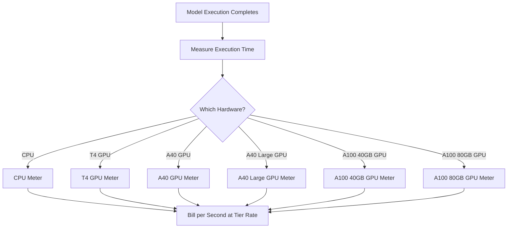

Replicate is a platform for running open-source machine learning models in the cloud. Their billing model is one of the purest examples of usage-based pricing in the AI industry. There is no monthly subscription fee and no flat rate per model run. Instead, they bill for the exact amount of compute time consumed, down to the second, with rates that vary based on the underlying hardware.

This approach works well for AI workloads because execution times are unpredictable. A single user might run a lightweight model for a few seconds or a massive generative model for several minutes. By tying cost to compute resources rather than the model itself, Replicate keeps pricing transparent and scalable.

## How Replicate Bills

Replicate's pricing is decoupled from the specific model being run. Whether you're generating an image with SDXL or running Llama 3, the billing is determined by the hardware tier and the duration of execution. This lets them host thousands of open-source models without needing a separate pricing plan for each one.

| Hardware | Price per Second | Price per Hour |
| :--- | :--- | :--- |
| NVIDIA CPU | \$0.000100 | \$0.36 |
| NVIDIA T4 GPU | \$0.000225 | \$0.81 |
| NVIDIA A40 GPU | \$0.000575 | \$2.07 |
| NVIDIA A40 (Large) GPU | \$0.000725 | \$2.61 |
| NVIDIA A100 (40GB) GPU | \$0.001150 | \$4.14 |
| NVIDIA A100 (80GB) GPU | \$0.001400 | \$5.04 |



1. **Hardware-Specific Rates**: The cost per second varies based on the compute resources required. Each hardware tier has a different price point.
2. **Pure Usage-Based Model**: There are no monthly fees, no overages, and no limits. Users are billed for exact compute time (e.g., "12.4 seconds on an A100") rather than per-generation.
3. **Per-Second Granularity**: Traditional cloud providers bill by the hour or minute, leading to waste on short-lived tasks. Per-second billing eliminates this inefficiency for both small experiments and large production workloads.

<Info>
Cold starts are also billable. The first request to a model often takes 10-30 seconds to load the model into memory. This loading time is billed at the same rate as execution time.
</Info>
## What Makes It Unique

* **Hardware-specific metering:** The same model costs more on better hardware. Users choose between speed and cost. A T4 GPU works for non-time-sensitive tasks, while an A100 handles real-time applications.
* **Per-second granularity:** Billing is calculated to the second, so users are never overcharged for short tasks.
* **No subscription:** Zero commitment to start. It scales infinitely with usage, making it ideal for startups and developers experimenting with different models.
* **Model-agnostic:** The billing logic stays the same regardless of task type (image generation, text processing, audio transcription, or video synthesis). This lets the platform support a vast model ecosystem without complex pricing tables.

## Build This with Dodo Payments

You can replicate this billing model using Dodo Payments' usage-based billing features. The key is to use multiple meters to track different hardware tiers and attach them to a single product.

<Steps>
  <Step title="Create Usage Meters (One Per Hardware Class)">
    Create separate meters for each hardware tier. Each hardware type has a different cost per second, so independent metering lets Dodo price each tier differently and provide itemized billing.

    | Meter Name | Event Name | Aggregation | Property |
    | :--- | :--- | :--- | :--- |
    | CPU Compute | `compute.cpu` | Sum | `execution_seconds` |
    | GPU T4 Compute | `compute.gpu_t4` | Sum | `execution_seconds` |
    | GPU A40 Compute | `compute.gpu_a40` | Sum | `execution_seconds` |
    | GPU A40 Large Compute | `compute.gpu_a40_large` | Sum | `execution_seconds` |
    | GPU A100 40GB Compute | `compute.gpu_a100_40` | Sum | `execution_seconds` |
    | GPU A100 80GB Compute | `compute.gpu_a100_80` | Sum | `execution_seconds` |

    The `Sum` aggregation on the `execution_seconds` property calculates total compute time per hardware tier over the billing period.
  </Step>

  <Step title="Create a Usage-Based Product">
    Create a new product in the Dodo Payments dashboard:

    * **Pricing type:** Usage Based Billing
    * **Base Price:** \$0/month (no subscription fee)
    * **Billing frequency:** Monthly

    Attach all meters with their per-unit pricing:

    | Meter | Price Per Unit (per second) |
    | :--- | :--- |
    | compute.cpu | \$0.000100 |
    | compute.gpu_t4 | \$0.000225 |
    | compute.gpu_a40 | \$0.000575 |
    | compute.gpu_a40_large | \$0.000725 |
    | compute.gpu_a100_40 | \$0.001150 |
    | compute.gpu_a100_80 | \$0.001400 |

    Set the **Free Threshold** to 0 for all meters. Every second of execution is billable.
  </Step>

  <Step title="Send Usage Events">
    Send usage events to Dodo whenever a model execution completes. Include a unique `event_id` for each prediction to ensure idempotency.

    ```typescript
    import DodoPayments from 'dodopayments';

    type HardwareTier = 'cpu' | 'gpu_t4' | 'gpu_a40' | 'gpu_a40_large' | 'gpu_a100_40' | 'gpu_a100_80';

    const client = new DodoPayments({
      bearerToken: process.env.DODO_PAYMENTS_API_KEY,
    });

    async function trackModelExecution(
      customerId: string,
      modelId: string,
      hardware: HardwareTier,
      executionSeconds: number,
      predictionId: string
    ) {
      const eventName = `compute.${hardware}`;

      await client.usageEvents.ingest({
        events: [{
          event_id: `pred_${predictionId}`,
          customer_id: customerId,
          event_name: eventName,
          timestamp: new Date().toISOString(),
          metadata: {
            execution_seconds: executionSeconds,
            model_id: modelId,
            hardware: hardware
          }
        }]
      });
    }

    // Example: SDXL image generation on A100
    await trackModelExecution(
      'cus_abc123',
      'stability-ai/sdxl',
      'gpu_a100_80',
      8.3,  // 8.3 seconds of A100 time
      'pred_xyz789'
    );
    ```
  </Step>

  <Step title="Measure Execution Time Precisely">
    Wrap your model execution with precise timing using `performance.now()`. Round to the nearest tenth of a second for billing.

    ```typescript
    async function runModelWithMetering(
      customerId: string,
      modelId: string,
      hardware: HardwareTier,
      input: Record<string, unknown>
    ) {
      const predictionId = `pred_${Date.now()}`;
      const startTime = performance.now();

      try {
        const result = await executeModel(modelId, input, hardware);
        const executionSeconds = (performance.now() - startTime) / 1000;
        const billedSeconds = Math.round(executionSeconds * 10) / 10;

        await trackModelExecution(
          customerId,
          modelId,
          hardware,
          billedSeconds,
          predictionId
        );

        return result;
      } catch (error) {
        // Still bill for compute time even on failure
        const executionSeconds = (performance.now() - startTime) / 1000;
        if (executionSeconds > 1) {
          await trackModelExecution(
            customerId,
            modelId,
            hardware,
            Math.round(executionSeconds * 10) / 10,
            predictionId
          );
        }
        throw error;
      }
    }
    ```
  </Step>

  <Step title="Create Checkout">
    When a user signs up, create a checkout session for the usage-based product. Dodo handles recurring billing and invoicing automatically.

    ```typescript
    const session = await client.checkoutSessions.create({
      product_cart: [
        { product_id: 'prod_compute_payg', quantity: 1 }
      ],
      customer: { email: 'ml-engineer@company.com' },
      return_url: 'https://yourplatform.com/dashboard'
    });
    ```
  </Step>
</Steps>

## Cost Estimation for Users

Since usage-based billing can be unpredictable, provide users with cost estimates before they run a model. This reduces surprise bills and builds trust.

### Example Cost Calculations

| Model | Hardware | Avg Time | Cost Per Run |
| :--- | :--- | :--- | :--- |
| SDXL (image) | A100 80GB | ~8 sec | ~\$0.0112 |
| Llama 3 (text) | A100 40GB | ~3 sec | ~\$0.0035 |
| Whisper (audio) | GPU T4 | ~15 sec | ~\$0.0034 |

### Building a Cost Calculator

```typescript
function estimateCost(hardware: HardwareTier, estimatedSeconds: number): number {
  const rates: Record<HardwareTier, number> = {
    'cpu': 0.000100,
    'gpu_t4': 0.000225,
    'gpu_a40': 0.000575,
    'gpu_a40_large': 0.000725,
    'gpu_a100_40': 0.001150,
    'gpu_a100_80': 0.001400
  };

  return Number((rates[hardware] * estimatedSeconds).toFixed(4));
}

// Show the user before running: "This will cost approximately $0.0098"
const estimate = estimateCost('gpu_a100_80', 8.5);
```

## Enterprise: Reserved Capacity

For enterprise customers who need guaranteed availability and no cold starts, Replicate offers "Private Instances" at a fixed hourly rate.

With Dodo Payments, model this as a subscription product:

* **Product Type:** Subscription
* **Price:** Fixed monthly price (e.g., "Reserved A100 Instance - \$500/month")
* **Billing Cycle:** Monthly

You can still send usage events for monitoring and analytics, but the subscription covers the cost. As a user's volume grows, switching from pay-as-you-go to reserved capacity often becomes more cost-effective.

## Advanced: Heartbeat Metering

For tasks that take several minutes or hours, sending a single event at the end is risky. If the process crashes, you lose the usage data. A better approach is to send usage events every 30-60 seconds during execution.

```typescript
async function runLongTaskWithHeartbeat(
  customerId: string,
  modelId: string,
  hardware: HardwareTier
) {
  const predictionId = `pred_${Date.now()}`;
  let totalSeconds = 0;

  const heartbeatInterval = setInterval(async () => {
    try {
      await trackModelExecution(
        customerId,
        modelId,
        hardware,
        30,
        `${predictionId}_${totalSeconds}`
      );
      totalSeconds += 30;
    } catch (error) {
      console.error('Heartbeat tracking failed:', error, { predictionId, totalSeconds });
    }
  }, 30000);

  try {
    await executeLongTask();
  } finally {
    clearInterval(heartbeatInterval);
  }
}
```

## Key Dodo Features Used

<CardGroup cols={2}>
  <Card title="Usage-Based Billing" icon="chart-line" href="/features/usage-based-billing/introduction">
    Set up products that bill based on consumption.
  </Card>
  <Card title="Meters" icon="gauge" href="/features/usage-based-billing/meters">
    Define the metrics you want to track and bill for.
  </Card>
  <Card title="Event Ingestion" icon="bolt" href="/features/usage-based-billing/event-ingestion">
    Send usage data to Dodo in real-time.
  </Card>
  <Card title="Subscriptions" icon="calendar" href="/features/subscription">
    Manage recurring billing for reserved capacity and enterprise plans.
  </Card>
</CardGroup>
