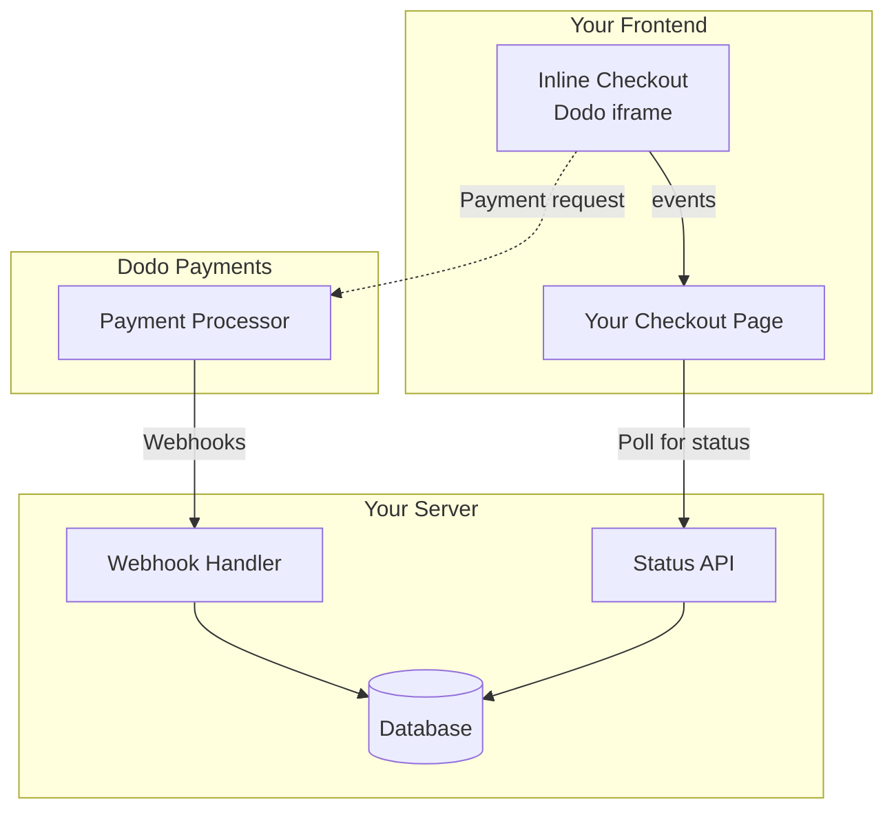

## Overview

Inline checkout lets you create fully integrated checkout experiences that blend seamlessly with your website or application. Unlike the [overlay checkout](/developer-resources/overlay-checkout), which opens as a modal on top of your page, inline checkout embeds the payment form directly into your page layout.

Using inline checkout, you can:

- Create checkout experiences that are fully integrated with your app or website
- Let Dodo Payments securely capture customer and payment information in an optimized checkout frame
- Display items, totals, and other information from Dodo Payments on your page
- Use SDK methods and events to build advanced checkout experiences

<Frame>
    
</Frame>

## How It Works

Inline checkout works by embedding a secure Dodo Payments frame into your website or app.

The checkout frame handles collecting customer information and capturing payment details. Your page displays the items list, totals, and options for changing what's on the checkout. The SDK lets your page and the checkout frame interact with each other.

Dodo Payments automatically creates a subscription when a checkout completes, ready for you to provision.

<Note>
The inline checkout frame securely handles all sensitive payment information, ensuring PCI compliance without additional certification on your end.
</Note>

## What Makes a Good Inline Checkout?

It's important that customers know who they're buying from, what they're buying, and how much they're paying.

To build an inline checkout that's compliant and optimized for conversion, your implementation must include:

<Frame caption="Example inline checkout layout showing required elements">
    
</Frame>

1. **Recurring information**: If recurring, how often it recurs and the total to pay on renewal. If a trial, how long the trial lasts.
2. **Item descriptions**: A description of what's being purchased.
3. **Transaction totals**: Transaction totals, including subtotal, total tax, and grand total. Be sure to include the currency too.
4. **Dodo Payments footer**: The full inline checkout frame, including the checkout footer that has information about Dodo Payments, our terms of sale, and our privacy policy.
5. **Refund policy**: A link to your refund policy, if it differs from the Dodo Payments standard refund policy.

<Warning>
Always display the complete inline checkout frame, including the footer. Removing or hiding legal information violates compliance requirements.
</Warning>

## Customer Journey

The checkout flow is determined by your checkout session configuration. Depending on how you configure the checkout session, customers will experience a checkout that may present all information on a single page or across multiple steps.

<Steps>
<Step title="Customer opens checkout">

You can open inline checkout by passing items or an existing transaction. Use the SDK to show and update on-page information, and SDK methods to update items based on customer interaction.
    


</Step>

<Step title="Customer enters their details">

Inline checkout first asks customers to enter their email address, select their country, and (where required) enter their ZIP or postal code. This step gathers all necessary information to determine taxes and available payment options.

You can prefill customer details and present saved addresses to streamline the experience.

</Step>

<Step title="Customer selects payment method">

After entering their details, customers are presented with available payment methods and the payment form. Options may include credit or debit card, PayPal, Apple Pay, Google Pay, and other local payment methods based on their location.

Display saved payment methods if available to speed up checkout.


</Step>

<Step title="Checkout completed">

Dodo Payments routes every payment to the best acquirer for that sale to get the best possible chance of success. Customers enter a success workflow that you can build.


</Step>

<Step title="Dodo Payments creates subscription">

Dodo Payments automatically creates a subscription for the customer, ready for you to provision. The payment method the customer used is held on file for renewals or subscription changes.


</Step>
</Steps>

## Quick Start

Get started with the Dodo Payments Inline Checkout in just a few lines of code:

```typescript
import { DodoPayments } from "dodopayments-checkout";

// Initialize the SDK for inline mode
DodoPayments.Initialize({
  mode: "test",
  displayType: "inline",
  onEvent: (event) => {
    console.log("Checkout event:", event);
  },
});

// Open checkout in a specific container
DodoPayments.Checkout.open({
  checkoutUrl: "https://test.dodopayments.com/session/cks_123",
  elementId: "dodo-inline-checkout" // ID of the container element
});
```

<Tip>
Ensure you have a container element with the corresponding `id` on your page: `<div id="dodo-inline-checkout"></div>`.
</Tip>

## Step-by-Step Integration Guide

<Steps>
<Step title="Install the SDK">

Install the Dodo Payments Checkout SDK:

<CodeGroup>
```bash npm
npm install dodopayments-checkout
```

```bash yarn
yarn add dodopayments-checkout
```

```bash pnpm
pnpm add dodopayments-checkout
```
</CodeGroup>

</Step>

<Step title="Initialize the SDK for Inline Display">

Initialize the SDK and specify `displayType: 'inline'`. You should also listen for the `checkout.breakdown` event to update your UI with real-time tax and total calculations.

```typescript
import { DodoPayments } from "dodopayments-checkout";

DodoPayments.Initialize({
  mode: "test",
  displayType: "inline",
  onEvent: (event) => {
    if (event.event_type === "checkout.breakdown") {
      const breakdown = event.data?.message;
      // Update your UI with breakdown.subTotal, breakdown.tax, breakdown.total, etc.
    }
  },
});
```

</Step>

<Step title="Create a Container Element">

Add an element to your HTML where the checkout frame will be injected:

```html
<div id="dodo-inline-checkout"></div>
```

</Step>

<Step title="Open the Checkout">

Call `DodoPayments.Checkout.open()` with the `checkoutUrl` and the `elementId` of your container:

```typescript
DodoPayments.Checkout.open({
  checkoutUrl: "https://test.dodopayments.com/session/cks_123",
  elementId: "dodo-inline-checkout"
});
```

</Step>

<Step title="Test Your Integration">

1. Start your development server:
```bash
npm run dev
```

2. Test the checkout flow:
   - Enter your email and address details in the inline frame.
   - Verify that your custom order summary updates in real-time.
   - Test the payment flow using test credentials.
   - Confirm redirects work correctly.

<Check>
You should see `checkout.breakdown` events logged in your browser console if you added a console log in the `onEvent` callback.
</Check>

</Step>

<Step title="Go Live">

When you're ready for production:

1. Change the mode to `'live'`:
```typescript
DodoPayments.Initialize({
  mode: "live",
  displayType: "inline",
  onEvent: (event) => {
    // Handle events
  }
});
```

2. Update your checkout URLs to use live checkout sessions from your backend.
3. Test the complete flow in production.

</Step>
</Steps>

## Complete React Example

This example demonstrates how to implement a custom order summary alongside the inline checkout, keeping them in sync using the `checkout.breakdown` event.

```tsx
"use client";

import { useEffect, useState } from 'react';
import { DodoPayments, CheckoutBreakdownData } from 'dodopayments-checkout';

export default function CheckoutPage() {
  const [breakdown, setBreakdown] = useState<Partial<CheckoutBreakdownData>>({});

  useEffect(() => {
    // 1. Initialize the SDK
    DodoPayments.Initialize({
      mode: 'test',
      displayType: 'inline',
      onEvent: (event) => {
        // 2. Listen for the 'checkout.breakdown' event
        if (event.event_type === "checkout.breakdown") {
          const message = event.data?.message as CheckoutBreakdownData;
          if (message) setBreakdown(message);
        }
      }
    });

    // 3. Open the checkout in the specified container
    DodoPayments.Checkout.open({
      checkoutUrl: 'https://test.dodopayments.com/session/cks_123',
      elementId: 'dodo-inline-checkout'
    });

    return () => DodoPayments.Checkout.close();
  }, []);

  const format = (amt: number | null | undefined, curr: string | null | undefined) => 
    amt != null && curr ? `${curr} ${(amt/100).toFixed(2)}` : '0.00';

  const currency = breakdown.currency ?? breakdown.finalTotalCurrency ?? '';

  return (
    <div className="flex flex-col md:flex-row min-h-screen">
      {/* Left Side - Checkout Form */}
      <div className="w-full md:w-1/2 flex items-center">
        <div id="dodo-inline-checkout" className='w-full' />
      </div>

      {/* Right Side - Custom Order Summary */}
      <div className="w-full md:w-1/2 p-8 bg-gray-50">
        <h2 className="text-2xl font-bold mb-4">Order Summary</h2>
        <div className="space-y-2">
          {breakdown.subTotal && (
            <div className="flex justify-between">
              <span>Subtotal</span>
              <span>{format(breakdown.subTotal, currency)}</span>
            </div>
          )}
          {breakdown.discount && (
            <div className="flex justify-between">
              <span>Discount</span>
              <span>{format(breakdown.discount, currency)}</span>
            </div>
          )}
          {breakdown.tax != null && (
            <div className="flex justify-between">
              <span>Tax</span>
              <span>{format(breakdown.tax, currency)}</span>
            </div>
          )}
          <hr />
          {(breakdown.finalTotal ?? breakdown.total) && (
            <div className="flex justify-between font-bold text-xl">
              <span>Total</span>
              <span>{format(breakdown.finalTotal ?? breakdown.total, breakdown.finalTotalCurrency ?? currency)}</span>
            </div>
          )}
        </div>
      </div>
    </div>
  );
}

```

## API Reference

### Configuration

#### Initialize Options

```typescript
interface InitializeOptions {
  mode: "test" | "live";
  displayType: "inline"; // Required for inline checkout
  onEvent: (event: CheckoutEvent) => void;
}
```

| Option | Type | Required | Description |
|--------|------|----------|-------------|
| `mode` | `"test" \| "live"` | Yes | Environment mode. |
| `displayType` | `"inline" \| "overlay"` | Yes | Must be set to `"inline"` to embed the checkout. |
| `onEvent` | `function` | Yes | Callback function for handling checkout events. |

#### Checkout Options

```typescript
export type FontSize = "xs" | "sm" | "md" | "lg" | "xl" | "2xl";
export type FontWeight = "normal" | "medium" | "bold" | "extraBold";

interface CheckoutOptions {
  checkoutUrl: string;
  elementId: string; // Required for inline checkout
  options?: {
    showTimer?: boolean;
    showSecurityBadge?: boolean;
    manualRedirect?: boolean;
    themeConfig?: ThemeConfig;
    payButtonText?: string;
    fontSize?: FontSize;
    fontWeight?: FontWeight;
  };
}
```

| Option | Type | Required | Description |
|--------|------|----------|-------------|
| `checkoutUrl` | `string` | Yes | Checkout session URL. |
| `elementId` | `string` | Yes | The `id` of the DOM element where the checkout should be rendered. |
| `options.showTimer` | `boolean` | No | Show or hide the checkout timer. Defaults to `true`. When disabled, you will receive the `checkout.link_expired` event when the session expires. |
| `options.showSecurityBadge` | `boolean` | No | Show or hide the security badge. Defaults to `true`. |
| `options.manualRedirect` | `boolean` | No | When enabled, the checkout will not automatically redirect after completion. Instead, you will receive `checkout.status` and `checkout.redirect_requested` events to handle the redirect yourself. |
| `options.themeConfig` | `ThemeConfig` | No | Custom theme configuration. |
| `options.payButtonText` | `string` | No | Custom text to display on the pay button. |
| `options.fontSize` | `FontSize` | No | Global font size for the checkout. |
| `options.fontWeight` | `FontWeight` | No | Global font weight for the checkout. |

### Methods

#### Open Checkout

Opens the checkout frame in the specified container.

```typescript
DodoPayments.Checkout.open({
  checkoutUrl: "https://test.dodopayments.com/session/cks_123",
  elementId: "dodo-inline-checkout"
});
```

You can also pass additional options to customize the checkout behavior:

```typescript
DodoPayments.Checkout.open({
  checkoutUrl: "https://test.dodopayments.com/session/cks_123",
  elementId: "dodo-inline-checkout",
  options: {
    showTimer: false,
    showSecurityBadge: false,
    manualRedirect: true,
    payButtonText: "Pay Now",
  },
});
```

When using `manualRedirect`, handle the checkout completion in your `onEvent` callback:

```typescript
DodoPayments.Initialize({
  mode: "test",
  displayType: "inline",
  onEvent: (event) => {
    if (event.event_type === "checkout.status") {
      const status = event.data?.message?.status;
      // Handle status: "succeeded", "failed", or "processing"
    }
    if (event.event_type === "checkout.redirect_requested") {
      const redirectUrl = event.data?.message?.redirect_to;
      // Redirect the customer manually
      window.location.href = redirectUrl;
    }
    if (event.event_type === "checkout.link_expired") {
      // Handle expired checkout session
    }
  },
});
```

#### Close Checkout

Programmatically removes the checkout frame and cleans up event listeners.

```typescript
DodoPayments.Checkout.close();
```

#### Check Status

Returns whether the checkout frame is currently injected.

```typescript
const isOpen = DodoPayments.Checkout.isOpen();
// Returns: boolean
```

### Events

The SDK provides real-time events through the `onEvent` callback. For inline checkout, `checkout.breakdown` is particularly useful for syncing your UI.

| Event Type | Description |
|------------|-------------|
| `checkout.opened` | Checkout frame has been loaded. |
| `checkout.form_ready` | Checkout form is ready to receive user input. Useful for hiding loading states and showing the checkout UI. |
| `checkout.breakdown` | Fired when prices, taxes, or discounts are updated. |
| `checkout.customer_details_submitted` | Customer details have been submitted. |
| `checkout.pay_button_clicked` | Fired when the customer clicks the pay button. Useful for analytics and tracking conversion funnels. |
| `checkout.redirect` | Checkout will perform a redirect (e.g., to a bank page). |
| `checkout.error` | An error occurred during checkout. |
| `checkout.link_expired` | Fired when the checkout session expires. Only received when `showTimer` is set to `false`. |
| `checkout.status` | Fired when `manualRedirect` is enabled. Contains the checkout status (`succeeded`, `failed`, or `processing`). |
| `checkout.redirect_requested` | Fired when `manualRedirect` is enabled. Contains the URL to redirect the customer to. |

#### Checkout Breakdown Data

The `checkout.breakdown` event provides the following data:

```typescript
interface CheckoutBreakdownData {
  subTotal?: number;          // Amount in cents
  discount?: number;         // Amount in cents
  tax?: number;              // Amount in cents
  total?: number;            // Amount in cents
  currency?: string;         // e.g., "USD"
  finalTotal?: number;       // Final amount including adjustments
  finalTotalCurrency?: string; // Currency for the final total
}
```

#### Checkout Status Event Data

When `manualRedirect` is enabled, you receive the `checkout.status` event with the following data:

```typescript
interface CheckoutStatusEventData {
  message: {
    status?: "succeeded" | "failed" | "processing";
  };
}
```

#### Checkout Redirect Requested Event Data

When `manualRedirect` is enabled, you receive the `checkout.redirect_requested` event with the following data:

```typescript
interface CheckoutRedirectRequestedEventData {
  message: {
    redirect_to?: string;
  };
}
```

#### Understanding the Breakdown Event

The `checkout.breakdown` event is the primary way to keep your application's UI in sync with the Dodo Payments checkout state.

**When it fires:**
- **On initialization**: Immediately after the checkout frame is loaded and ready.
- **On address change**: Whenever the customer selects a country or enters a postal code that results in a tax recalculation.

**Field Details:**

| Field | Description |
|-------|-------------|
| `subTotal` | The sum of all line items in the session before any discounts or taxes are applied. |
| `discount` | The total value of all applied discounts. |
| `tax` | The calculated tax amount. In `inline` mode, this updates dynamically as the user interacts with the address fields. |
| `total` | The mathematical result of `subTotal - discount + tax` in the session's base currency. |
| `currency` | The ISO currency code (e.g., `"USD"`) for the standard subtotal, discount, and tax values. |
| `finalTotal` | The actual amount the customer is charged. This may include additional foreign exchange adjustments or local payment method fees that aren't part of the basic price breakdown. |
| `finalTotalCurrency` | The currency in which the customer is actually paying. This can differ from `currency` if purchasing power parity or local currency conversion is active. |

**Key Integration Tips:**

1.  **Currency Formatting**: Prices are always returned as integers in the smallest currency unit (e.g., cents for USD, yen for JPY). To display them, divide by 100 (or the appropriate power of 10) or use a formatting library like `Intl.NumberFormat`.
2.  **Handling Initial States**: When the checkout first loads, `tax` and `discount` may be `0` or `null` until the user provides their billing information or applies a code. Your UI should handle these states gracefully (e.g., showing a dash `—` or hiding the row).
3.  **The "Final Total" vs "Total"**: While `total` gives you the standard price calculation, `finalTotal` is the source of truth for the transaction. If `finalTotal` is present, it reflects exactly what will be charged to the customer's card, including any dynamic adjustments.
4.  **Real-time Feedback**: Use the `tax` field to show users that taxes are being calculated in real-time. This provides a "live" feel to your checkout page and reduces friction during the address entry step.

## Implementation Options

### Package Manager Installation

Install via npm, yarn, or pnpm as shown in the [Step-by-Step Integration Guide](#step-by-step-integration-guide).

### CDN Implementation

For quick integration without a build step, you can use our CDN:

```html
<!DOCTYPE html>
<html lang="en">
<head>
    <meta charset="UTF-8">
    <meta name="viewport" content="width=device-width, initial-scale=1.0">
    <title>Dodo Payments Inline Checkout</title>
    
    <!-- Load DodoPayments -->
    <script src="https://cdn.jsdelivr.net/npm/dodopayments-checkout@latest/dist/index.js"></script>
    <script>
        // Initialize the SDK
        DodoPaymentsCheckout.DodoPayments.Initialize({
            mode: "test",
            displayType: "inline",
            onEvent: (event) => {
                console.log('Checkout event:', event);
            }
        });
    </script>
</head>
<body>
    <div id="dodo-inline-checkout"></div>

    <script>
        // Open the checkout
        DodoPaymentsCheckout.DodoPayments.Checkout.open({
            checkoutUrl: "https://test.dodopayments.com/session/cks_123",
            elementId: "dodo-inline-checkout"
        });
    </script>
</body>
</html>
```

### Theme Customization

You can customize the checkout appearance by passing a `themeConfig` object in the `options` parameter when opening checkout. The theme configuration supports both light and dark modes, allowing you to customize colors, borders, text, buttons, and border radius.

<Info>
This section covers **client-side** theme configuration using the Checkout SDK. You can also configure themes **server-side** when creating a checkout session via the API using the `theme_config` parameter. See [Checkout Theme Customization](/features/checkout#checkout-theme-customization) for API-level configuration.
</Info>

#### Basic Theme Configuration

```typescript
DodoPayments.Checkout.open({
  checkoutUrl: "https://checkout.dodopayments.com/session/cks_123",
  options: {
    themeConfig: {
      light: {
        bgPrimary: "#FFFFFF",
        textPrimary: "#344054",
        buttonPrimary: "#A6E500",
      },
      dark: {
        bgPrimary: "#0D0D0D",
        textPrimary: "#FFFFFF",
        buttonPrimary: "#A6E500",
      },
      radius: "8px",
    },
  },
});
```

#### Complete Theme Configuration

All available theme properties:

```typescript
DodoPayments.Checkout.open({
  checkoutUrl: "https://checkout.dodopayments.com/session/cks_123",
  options: {
    themeConfig: {
      light: {
        // Background colors
        bgPrimary: "#FFFFFF",        // Primary background color
        bgSecondary: "#F9FAFB",      // Secondary background color (e.g., tabs)
        
        // Border colors
        borderPrimary: "#D0D5DD",     // Primary border color
        borderSecondary: "#6B7280",  // Secondary border color
        inputFocusBorder: "#D0D5DD", // Input focus border color
        
        // Text colors
        textPrimary: "#344054",       // Primary text color
        textSecondary: "#6B7280",    // Secondary text color
        textPlaceholder: "#667085",  // Placeholder text color
        textError: "#D92D20",        // Error text color
        textSuccess: "#10B981",      // Success text color
        
        // Button colors
        buttonPrimary: "#A6E500",           // Primary button background
        buttonPrimaryHover: "#8CC500",      // Primary button hover state
        buttonTextPrimary: "#0D0D0D",       // Primary button text color
        buttonSecondary: "#F3F4F6",         // Secondary button background
        buttonSecondaryHover: "#E5E7EB",     // Secondary button hover state
        buttonTextSecondary: "#344054",     // Secondary button text color
      },
      dark: {
        // Background colors
        bgPrimary: "#0D0D0D",
        bgSecondary: "#1A1A1A",
        
        // Border colors
        borderPrimary: "#323232",
        borderSecondary: "#D1D5DB",
        inputFocusBorder: "#323232",
        
        // Text colors
        textPrimary: "#FFFFFF",
        textSecondary: "#909090",
        textPlaceholder: "#9CA3AF",
        textError: "#F97066",
        textSuccess: "#34D399",
        
        // Button colors
        buttonPrimary: "#A6E500",
        buttonPrimaryHover: "#8CC500",
        buttonTextPrimary: "#0D0D0D",
        buttonSecondary: "#2A2A2A",
        buttonSecondaryHover: "#3A3A3A",
        buttonTextSecondary: "#FFFFFF",
      },
      radius: "8px", // Border radius for inputs, buttons, and tabs
    },
  },
});
```

#### Light Mode Only

If you only want to customize the light theme:

```typescript
DodoPayments.Checkout.open({
  checkoutUrl: "https://checkout.dodopayments.com/session/cks_123",
  options: {
    themeConfig: {
      light: {
        bgPrimary: "#FFFFFF",
        textPrimary: "#000000",
        buttonPrimary: "#0070F3",
      },
      radius: "12px",
    },
  },
});
```

#### Dark Mode Only

If you only want to customize the dark theme:

```typescript
DodoPayments.Checkout.open({
  checkoutUrl: "https://checkout.dodopayments.com/session/cks_123",
  options: {
    themeConfig: {
      dark: {
        bgPrimary: "#000000",
        textPrimary: "#FFFFFF",
        buttonPrimary: "#0070F3",
      },
      radius: "12px",
    },
  },
});
```

#### Partial Theme Override

You can override only specific properties. The checkout will use default values for properties you don't specify:

```typescript
DodoPayments.Checkout.open({
  checkoutUrl: "https://checkout.dodopayments.com/session/cks_123",
  options: {
    themeConfig: {
      light: {
        buttonPrimary: "#FF6B6B", // Only override primary button color
      },
      radius: "16px", // Override border radius
    },
  },
});
```

#### Theme Configuration with Other Options

You can combine theme configuration with other checkout options:

```typescript
DodoPayments.Checkout.open({
  checkoutUrl: "https://checkout.dodopayments.com/session/cks_123",
  options: {
    showTimer: true,
    showSecurityBadge: true,
    manualRedirect: false,
    themeConfig: {
      light: {
        bgPrimary: "#FFFFFF",
        buttonPrimary: "#A6E500",
      },
      dark: {
        bgPrimary: "#0D0D0D",
        buttonPrimary: "#A6E500",
      },
      radius: "8px",
    },
  },
});
```

#### TypeScript Types

For TypeScript users, all theme configuration types are exported:

```typescript
import { ThemeConfig, ThemeModeConfig } from "dodopayments-checkout";

const themeConfig: ThemeConfig = {
  light: {
    bgPrimary: "#FFFFFF",
    // ... other properties
  },
  dark: {
    bgPrimary: "#0D0D0D",
    // ... other properties
  },
  radius: "8px",
};
```

## Update Payment Method

Inline checkout supports **payment method updates** for subscriptions. When a customer needs to update their payment method -- whether for an active subscription or to reactivate an on-hold subscription -- you can render the update flow directly within your page layout.

### How It Works

1. Call the [Update Payment Method API](/features/subscription#update-payment-method-for-active-subscription) to get a `payment_link`:

```typescript
const response = await client.subscriptions.updatePaymentMethod('sub_123', {
  type: 'new',
  return_url: 'https://example.com/return'
});
```

2. Pass the returned `payment_link` as the `checkoutUrl` to open inline checkout:

```typescript
DodoPayments.Checkout.open({
  checkoutUrl: response.payment_link,
  elementId: "dodo-inline-checkout"
});
```

The inline frame renders only the payment method collection form. Customers can enter new card details or select a saved payment method without leaving your page.

### For On-Hold Subscriptions

When updating the payment method for a subscription in `on_hold` status, Dodo Payments automatically creates a charge for any remaining dues. Monitor the `payment.succeeded` and `subscription.active` webhooks to confirm reactivation.

```typescript
const response = await client.subscriptions.updatePaymentMethod('sub_123', {
  type: 'new',
  return_url: 'https://example.com/return'
});

if (response.payment_id) {
  // Charge created for remaining dues
  // Open inline checkout for payment collection
  DodoPayments.Checkout.open({
    checkoutUrl: response.payment_link,
    elementId: "dodo-inline-checkout"
  });
}
```

<Tip>
You can also use an existing saved payment method instead of collecting new details by passing `type: 'existing'` with a `payment_method_id` to the Update Payment Method API.
</Tip>

## Error Handling

The SDK provides detailed error information through the event system. Always implement proper error handling in your `onEvent` callback:

```typescript
DodoPayments.Initialize({
  mode: "test",
  displayType: "inline",
  onEvent: (event: CheckoutEvent) => {
    if (event.event_type === "checkout.error") {
      console.error("Checkout error:", event.data?.message);
      // Handle error appropriately
    }
  }
});
```

<Warning>
Always handle the `checkout.error` event to provide a good user experience when issues occur.
</Warning>

## Best Practices

1. **Responsive Design**: Ensure your container element has enough width and height. The iframe will typically expand to fill its container.
2. **Synchronization**: Use the `checkout.breakdown` event to keep your custom order summary or pricing tables in sync with what the user sees in the checkout frame.
3. **Skeleton States**: Show a loading indicator in your container until the `checkout.opened` event fires.
4. **Cleanup**: Call `DodoPayments.Checkout.close()` when your component unmounts to clean up the iframe and event listeners.

<Info>
For dark mode implementations, it's recommended to use `#0d0d0d` as the background color for optimal visual integration with the inline checkout frame.
</Info>

## Payment Status Validation

<Warning>
Do not rely solely on inline checkout events to determine payment success or failure. Always implement server-side validation using webhooks and/or polling.
</Warning>

### Why Server-Side Validation is Essential

While inline checkout events like `checkout.status` provide real-time feedback, they should **not** be your only source of truth for payment status. Network issues, browser crashes, or users closing the page can cause events to be missed. To ensure reliable payment validation:

1. **Your server should listen to webhook events** - Dodo Payments sends webhooks for payment status changes
2. **Implement a polling mechanism** - Your frontend should poll your server for status updates
3. **Combine both approaches** - Use webhooks as the primary source and polling as a fallback

### Recommended Architecture



### Implementation Steps

**1. Listen for checkout events** - When the user clicks pay, start preparing to verify the status:

```typescript
onEvent: (event) => {
  if (event.event_type === 'checkout.status') {
    // Start polling your server for confirmed status
    startPolling();
  }
}
```

**2. Poll your server** - Create an endpoint that checks your database for the payment status (updated by webhooks):

```typescript
// Poll every 2 seconds until status is confirmed
const interval = setInterval(async () => {
  const { status } = await fetch(`/api/payments/${paymentId}/status`).then(r => r.json());
  if (status === 'succeeded' || status === 'failed') {
    clearInterval(interval);
    handlePaymentResult(status);
  }
}, 2000);
```

**3. Handle webhooks server-side** - Update your database when Dodo sends `payment.succeeded` or `payment.failed` webhooks. See our [Webhooks documentation](/developer-resources/webhooks) for details.

### Handling Redirects (3DS, Google Pay, UPI)

When using `manualRedirect: true`, certain payment methods require redirecting the user away from your page for authentication:

- **3D Secure (3DS)** - Card authentication
- **Google Pay** - Wallet authentication on some flows
- **UPI** - Indian payment method redirects

When a redirect is required, you'll receive the `checkout.redirect_requested` event. Redirect the user to the provided URL:

```typescript
if (event.event_type === 'checkout.redirect_requested') {
  const redirectUrl = event.data?.message?.redirect_to;
  // Save payment ID before redirect, then redirect
  sessionStorage.setItem('pendingPaymentId', paymentId);
  window.location.href = redirectUrl;
}
```

After authentication completes (success or failure), the user returns to your page. **Do not assume success just because the user returned.** Instead:

1. Check if the user is returning from a redirect (e.g., via `sessionStorage`)
2. Start polling your server for the confirmed payment status
3. Show a "Verifying payment..." state while polling
4. Display success/failure UI based on the server-confirmed status

<Tip>
Always verify payment status server-side after redirects. The user returning to your page only means authentication completed—it doesn't indicate whether the payment succeeded or failed.
</Tip>

## Troubleshooting

<AccordionGroup>
<Accordion title="Checkout frame is not appearing">
- Verify that `elementId` matches the `id` of a `div` that actually exists in the DOM.
- Ensure `displayType: 'inline'` was passed to `Initialize`.
- Check that the `checkoutUrl` is valid.
</Accordion>

<Accordion title="Taxes are not updating in my UI">
- Ensure you are listening for the `checkout.breakdown` event.
- Taxes are only calculated after the user enters a valid country and postal code in the checkout frame.
</Accordion>
</AccordionGroup>

## Enabling Digital Wallets

For detailed information about setting up Apple Pay, Google Pay, and other digital wallets, see the <a href="/features/payment-methods/digital-wallets">Digital Wallets</a> page.

### Quick Setup for Apple Pay

<Steps>
<Step title="Download domain association file">
Download the [Apple Pay domain association file](http://checkout.dodopayments.com/.well-known/apple-developer-merchantid-domain-association).
</Step>

<Step title="Request activation">
Email **support@dodopayments.com** with your production domain URL and request Apple Pay activation.
</Step>

<Step title="Test after confirmation">
Once confirmed, verify Apple Pay appears in checkout and test the complete flow.
</Step>
</Steps>

<Warning>
Apple Pay requires domain verification before it appears in production. Contact support before going live if you plan to offer Apple Pay.
</Warning>

## Browser Support

The Dodo Payments Checkout SDK supports the following browsers:

- Chrome (latest)
- Firefox (latest)
- Safari (latest)
- Edge (latest)
- IE11+

## Inline vs Overlay Checkout

Choose the right checkout type for your use case:

| Feature | Inline Checkout | Overlay Checkout |
|---------|-----------------|------------------|
| Integration depth | Fully embedded in page | Modal on top of page |
| Layout control | Full control | Limited |
| Branding | Seamless | Separate from page |
| Implementation effort | Higher | Lower |
| Best for | Custom checkout pages, high-conversion flows | Quick integration, existing pages |

<Tip>
Use **inline checkout** when you want maximum control over the checkout experience and seamless branding. Use **overlay checkout** for faster integration with minimal changes to your existing pages.
</Tip>

## Related Resources

<CardGroup cols={2}>
<Card title="Overlay Checkout" icon="layer-group" href="/developer-resources/overlay-checkout">
    Use the overlay checkout for quick modal-based integration.
</Card>

<Card title="Checkout Sessions API" icon="code" href="/api-reference/checkout-sessions/create">
    Create checkout sessions to power your checkout experiences.
</Card>

<Card title="Webhooks" icon="webhook" href="/developer-resources/webhooks">
    Handle payment events server-side with webhooks.
</Card>

<Card title="Integration Guide" icon="book" href="/developer-resources/integration-guide">
    Complete guide to integrating Dodo Payments.
</Card>
</CardGroup>

For more help, visit our [Discord community](https://discord.gg/bYqAp4ayYh) or contact our developer support team.
