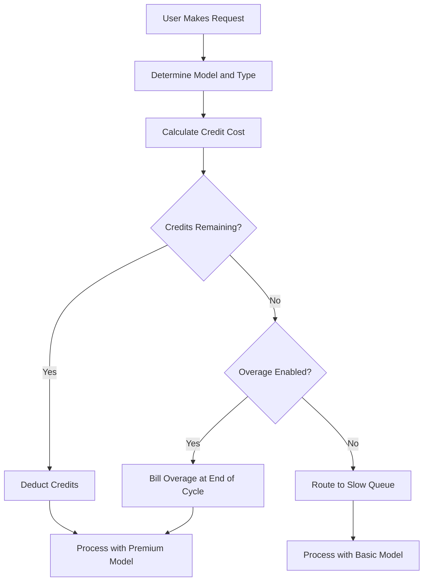

## Cómo factura Cursor

Cursor utiliza un modelo híbrido que combina una suscripción mensual con un grupo de créditos que se va agotando. Este enfoque ofrece un precio predecible para los usuarios mientras gestiona los costes variables de los distintos modelos de IA.

**Niveles de precios**: Cursor ofrece niveles que van desde Hobby hasta Ultra, equilibrando el acceso premium y estándar para adaptarse a diferentes flujos de trabajo.

| Plan | Precio | Solicitudes premium | Solicitudes lentas |
| :--- | :--- | :--- | :--- |
| Hobby | Gratis | 50/mes | Ilimitado |
| Pro | \$20/mes | 500/mes | Ilimitado |
| Pro+ | \$60/mes | Solicitudes premium ilimitadas | - |
| Ultra | \$200/mes | Solicitudes premium ilimitadas | - |

**Agotamiento ponderado por modelo**: Diferentes solicitudes consumen distintas cantidades de créditos según el coste del modelo subyacente. Esto permite a Cursor ofrecer una sola suscripción que cubre múltiples proveedores garantizando que las operaciones más caras se contabilicen.

| Tipo de solicitud | Modelo | Costo en créditos |
| :--- | :--- | :--- |
| Autocompletado de pestañas | Predeterminado | 0 |
| Chat | GPT-4o Mini | 1 |
| Chat | Claude 3.5 Sonnet | 1 |
| Compositor | GPT-4o | 5 |
| Agente | Claude 3.5 Sonnet | 10 |
| Agente | o1-preview | 25 |

**Agotamiento de créditos y sobrepasos**: Cuando los créditos se agotan, los usuarios pasan a una cola “lenta” con modelos más económicos en lugar de cortarlos. Alternativamente, pueden habilitar sobrepasos de uso para mantener el acceso premium con un coste fijo por solicitud.



4. **Enterprise y Business**: Los equipos usan el uso compartido donde toda la organización comparte un único depósito de créditos. Esto simplifica la gestión y evita que los usuarios intensivos alcancen límites individuales mientras otros tienen capacidad sin usar.

## Qué lo hace único

El modelo de Cursor equilibra la experiencia del usuario con los costes de la infraestructura al resolver problemas con los que los modelos tradicionales de facturación SaaS tienen dificultades.
- **Abstracción de proveedores**: Una sola suscripción engloba múltiples proveedores de LLM como OpenAI y Anthropic, gestionando precios complejos y claves de API en segundo plano.
- **Agotamiento ponderado**: Los costes se alinean con el valor al cobrar más por modelos potentes, haciendo que la tarificación parezca justa y transparente para todos los usuarios.
- **Degradación gradual**: La cola “lenta” evita cortes bruscos, manteniendo a los usuarios en el producto y fomentando actualizaciones sin ser punitivo.
- **Créditos compartidos**: Los depósitos a nivel de equipo reducen la fricción para clientes empresariales permitiendo compartir recursos de forma eficiente en toda la organización.

## Reproduce esto con Dodo Payments

Puedes replicar este modelo exacto usando los derechos de créditos de Dodo Payments y la facturación basada en uso. Los siguientes pasos te guiarán en la implementación.

<Steps>
  <Step title="Create a Custom Unit Credit Entitlement">
    Primero, define el sistema de créditos en el panel de Dodo. Este derecho representará las “Solicitudes premium” que los usuarios reciben con su suscripción.

    *   **Tipo de crédito:** Unidad personalizada
    *   **Nombre de unidad:** “Solicitudes premium”
    *   **Precisión:** 0 (ya que no se puede usar media solicitud)
    *   **Caducidad de créditos:** 30 días (esto asegura que los créditos se restablezcan cada ciclo de facturación)
    *   **Acumulación:** Desactivada (las solicitudes no usadas no se trasladan al siguiente mes)
    *   **Sobrepaso:** Activado
    *   **Precio por unidad:** \$0.04 (el coste por cada solicitud una vez agotada la reserva inicial)
    *   **Comportamiento de sobrepaso:** Facturar sobrepaso en la facturación (esto suma el coste del sobrepaso a la siguiente factura)

    Esta configuración asegura que los usuarios dispongan de un pool fijo de solicitudes cada mes, con la opción de pagar más si las necesitan. Es la base del modelo híbrido de facturación.
  </Step>

  <Step title="Create Subscription Products">
    Crea productos separados para cada nivel. Adjunta el mismo derecho de crédito a cada producto, pero con cantidades distintas. Esto te permite gestionar todos los niveles con un único sistema de créditos, facilitando la actualización o degradación de los usuarios.

    *   **Hobby:** \$0/mes, 50 créditos/ciclo
    *   **Pro:** \$20/mes, 500 créditos/ciclo
    *   **Pro+:** \$60/mes, 5000 créditos/ciclo (efectivamente ilimitado para la mayoría)
    *   **Ultra:** \$200/mes, 50000 créditos/ciclo (efectivamente ilimitado)

    Cuando un usuario se suscribe a uno de estos productos, Dodo asigna automáticamente la cantidad correspondiente de créditos a su cuenta. Esto ocurre al instante, proporcionando una experiencia de incorporación fluida.
  </Step>

  <Step title="Create a Usage Meter Linked to Credits">
    Crea un medidor llamado `ai.request` con agregación **Suma** sobre la propiedad `credit_cost`. Vincula este medidor a tu derecho de créditos activando el interruptor “Facturar uso en créditos”. Ajusta las unidades del medidor por crédito a 1.

    Para manejar el agotamiento ponderado por modelo, gestionarás el coste en créditos a nivel de aplicación. Cuando un usuario realiza una solicitud, tu aplicación determina el coste según el modelo o tipo de acción.

    ```typescript
    import DodoPayments from 'dodopayments';
    
    /**
     * Determines the credit cost for a given request type and model.
     * This logic lives in your application and can be updated without
     * changing your billing configuration.
     */
    function getCreditCost(requestType: string, model: string): number {
      const costs: Record<string, Record<string, number>> = {
        'tab_completion': { 'default': 0 },
        'chat': { 'gpt-4o-mini': 1, 'gpt-4o': 1, 'claude-sonnet': 1 },
        'composer': { 'gpt-4o-mini': 2, 'gpt-4o': 5, 'claude-sonnet': 5 },
        'agent': { 'gpt-4o': 10, 'claude-sonnet': 10, 'o1': 25 }
      };
      
      // Default to 1 credit if the combination isn't found
      return costs[requestType]?.[model] ?? 1;
    }
    
    /**
     * Ingests usage events into Dodo Payments.
     * For weighted requests, we send multiple events or use a sum aggregation.
     */
    async function trackRequest(customerId: string, requestType: string, model: string) {
      const creditCost = getCreditCost(requestType, model);
      
      // Tab completions are free, so we don't need to track them for billing
      if (creditCost === 0) return;
      
      const client = new DodoPayments({
        bearerToken: process.env.DODO_PAYMENTS_API_KEY,
      });
      
      await client.usageEvents.ingest({
        events: [{
          event_id: `req_${Date.now()}_${Math.random().toString(36).slice(2)}`,
          customer_id: customerId,
          event_name: 'ai.request',
          timestamp: new Date().toISOString(),
          metadata: {
            request_type: requestType,
            model: model,
            credit_cost: creditCost
          }
        }]
      });
    }
    ```

    <Tip>
      Si deseas usar un único evento para solicitudes ponderadas, establece la agregación del medidor en **Suma** y usa una propiedad como `credit_cost` como valor a sumar. Esto suele ser más eficiente para la ingestión de alto volumen y simplifica la lógica de tu aplicación.
    </Tip>
  </Step>

  <Step title="Handle Credit Exhaustion (Slow Queue)">
    Escucha el webhook `credit.balance_low` de Dodo. Cuando los créditos de un usuario estén cerca de cero, puedes pasarlo a una cola lenta en tu aplicación. Aquí implementas la lógica de “degradación gradual”.

    ```typescript
    import DodoPayments from 'dodopayments';
    import express from 'express';
    
    const app = express();
    app.use(express.raw({ type: 'application/json' }));
    
    const client = new DodoPayments({
      bearerToken: process.env.DODO_PAYMENTS_API_KEY,
      webhookKey: process.env.DODO_PAYMENTS_WEBHOOK_KEY,
    });
    
    app.post('/webhooks/dodo', async (req, res) => {
      try {
        const event = client.webhooks.unwrap(req.body.toString(), {
          headers: {
            'webhook-id': req.headers['webhook-id'] as string,
            'webhook-signature': req.headers['webhook-signature'] as string,
            'webhook-timestamp': req.headers['webhook-timestamp'] as string,
          },
        });
        
        if (event.type === 'credit.balance_low') {
          const customerId = event.data.customer_id;
          await updateUserTier(customerId, 'slow');
          await notifyUser(customerId, 'You have used most of your premium requests. Switching to standard models.');
        }
        
        res.json({ received: true });
      } catch (error) {
        res.status(401).json({ error: 'Invalid signature' });
      }
    });
    
    /**
     * Routes a request based on the user's current tier.
     * This function is called before every AI request to determine the model and queue.
     */
    async function routeRequest(customerId: string, requestType: string) {
      const tier = await getUserTier(customerId);
      
      if (tier === 'slow') {
        // Route to a cheaper model and a lower priority queue
        // This saves costs while keeping the user active in the product
        return { model: 'gpt-4o-mini', queue: 'standard' };
      }
      
      // Premium routing for users with remaining credits
      // This provides the best possible performance and model quality
      return { model: 'claude-sonnet', queue: 'priority' };
    }
    ```

  </Step>

  <Step title="Create Checkout">
    Por último, genera una sesión de pago para que el usuario se suscriba a un plan. Dodo se encarga automáticamente del procesamiento del pago, el cumplimiento fiscal y la asignación de créditos.

    ```typescript
    import DodoPayments from 'dodopayments';
    
    const client = new DodoPayments({
      bearerToken: process.env.DODO_PAYMENTS_API_KEY,
    });
    
    /**
     * Creates a checkout session for a new subscription.
     * This is typically called when a user clicks an "Upgrade" button.
     */
    const session = await client.checkoutSessions.create({
      product_cart: [
        { product_id: 'prod_cursor_pro', quantity: 1 }
      ],
      customer: { email: 'developer@example.com' },
      return_url: 'https://yourapp.com/dashboard'
    });
    ```

  </Step>
</Steps>

## Acelera con el LLM Ingestion Blueprint

La facturación ponderada por créditos anterior cubre tu monetización central. Para análisis más profundos sobre el consumo real de tokens entre proveedores, el [LLM Ingestion Blueprint](/developer-resources/ingestion-blueprints/llm) puede ejecutarse junto a tu sistema de créditos.

```bash
npm install @dodopayments/ingestion-blueprints
```

```typescript
import { createLLMTracker } from '@dodopayments/ingestion-blueprints';
import OpenAI from 'openai';
import Anthropic from '@anthropic-ai/sdk';

// Track raw token usage for analytics alongside credit-weighted billing
const openaiTracker = createLLMTracker({
  apiKey: process.env.DODO_PAYMENTS_API_KEY,
  environment: 'live_mode',
  eventName: 'analytics.openai_tokens',
});

const anthropicTracker = createLLMTracker({
  apiKey: process.env.DODO_PAYMENTS_API_KEY,
  environment: 'live_mode',
  eventName: 'analytics.anthropic_tokens',
});

const openai = new OpenAI({ apiKey: process.env.OPENAI_API_KEY });
const anthropic = new Anthropic({ apiKey: process.env.ANTHROPIC_API_KEY });

// Wrap each provider separately
const trackedOpenAI = openaiTracker.wrap({ client: openai, customerId: 'customer_123' });
const trackedAnthropic = anthropicTracker.wrap({ client: anthropic, customerId: 'customer_123' });

// Token tracking is automatic, credit deduction still uses your weighted system
const response = await trackedOpenAI.chat.completions.create({
  model: 'gpt-4o',
  messages: [{ role: 'user', content: 'Hello!' }],
});
```

Esto te ofrece dos capas de datos: facturación ponderada por créditos para monetización y conteos brutos de tokens para análisis de costes y seguimiento de márgenes.

<Tip>
El Blueprint de LLM admite OpenAI, Anthropic, Groq, Google Gemini y más. Consulta la [documentación completa del blueprint](/developer-resources/ingestion-blueprints/llm) para ver todos los proveedores compatibles.
</Tip>

## Créditos compartidos por equipo (Enterprise)

Los planes Business y Enterprise de Cursor combinan los créditos de todo el equipo. Puedes implementar esto en Dodo creando una sola suscripción para la organización en lugar de para usuarios individuales. Esto garantiza que el uso del equipo se consolide y gestione como una sola entidad, lo cual es un requisito esencial para clientes de mayor tamaño.

### Estrategia de implementación

1.  **Cliente a nivel de organización:** Crea un único `customer_id` en Dodo para toda la organización. Este cliente representa la entidad facturable del equipo y mantiene la reserva de créditos compartida. Todas las facturas y asignaciones de créditos están vinculadas a esta ID.
2.  **Facturación por asientos:** Utiliza los complementos (add-ons) de Dodo para cobrar una tarifa por usuario en la plataforma. Cuando un equipo agrega un nuevo miembro, actualizas la cantidad del complemento “Asiento”. Esto asegura que tus ingresos escalen con el número de usuarios mientras mantienes el pool de créditos separado. Es una forma limpia de gestionar la facturación multidimensional.
3.  **Seguimiento de uso compartido:** Todas las solicitudes de los miembros del equipo se ingieren usando la `customer_id` de la organización. Esto garantiza que cada solicitud de cualquier miembro agote el mismo pool central de créditos. Aun así puedes rastrear el uso individual incluyendo una `user_id` en los metadatos del evento para informes internos y análisis.

Este enfoque te da lo mejor de ambos mundos: una tarifa predecible por usuario para la plataforma y un pool de créditos compartido para los recursos de IA costosos. También simplifica la experiencia para los miembros del equipo, ya que no tienen que gestionar sus propios límites individuales.

## Comparación con la facturación SaaS tradicional

La facturación SaaS tradicional normalmente implica niveles de tarifa fija (por ejemplo, \$10/mes por 100 unidades). Si un usuario necesita 101 unidades, normalmente tiene que saltar a un nivel de \$50/mes. Esto crea efectos de “acantilado” que pueden frustrar a los usuarios y provocar churn. Tampoco considera el coste variable de los distintos tipos de uso, lo cual es crítico en el ámbito de la IA.

El modelo de Cursor, potenciado por Dodo, es mucho más flexible y justo:

*   **Sin efectos de “acantilado”:** Los usuarios no tienen que actualizar solo porque alcanzaron un límite. Pueden pagar sobrepasos o aceptar un rendimiento más lento. Esto los mantiene dentro del producto y reduce la fricción, lo que se traduce en mayor satisfacción del cliente y menor churn.
*   **Alineación de costes:** Tus ingresos escalan directamente con tus costes de infraestructura. Si un usuario usa modelos costosos, paga más (ya sea mediante créditos o sobrepasos). Esto protege tus márgenes y te permite ofrecer características de alto coste de forma sostenible sin arriesgar tu modelo de negocio.
*   **Mejor retención:** Al no cortar a los usuarios, los mantienes comprometidos con tu producto incluso cuando han alcanzado su límite. Pueden seguir trabajando, lo que genera lealtad a largo plazo y aumenta el valor de vida del cliente. Es un escenario beneficioso tanto para el usuario como para el proveedor.

## Gestión de actualizaciones y evolución de modelos

Uno de los desafíos de la facturación de IA es que los modelos están en constante actualización o reemplazo. Los modelos nuevos pueden tener estructuras de coste o características de rendimiento diferentes. Con el sistema de créditos de Dodo, puedes manejar esto con elegancia a nivel de aplicación sin necesidad de migrar tus datos de facturación.

Si introduces un modelo nuevo y más caro, simplemente actualizas tu función `getCreditCost` para asignarle un coste mayor. No necesitas cambiar la configuración de facturación ni actualizar suscripciones existentes. Esta separación entre la facturación y la lógica de la aplicación es una gran ventaja, ya que te permite iterar en tu producto a la velocidad de la IA sin quedar limitado por el sistema de cobro.

## Notificaciones al usuario y transparencia

Para ofrecer una excelente experiencia de usuario, es importante mantener a los usuarios informados sobre su uso de créditos. La transparencia genera confianza y ayuda a los usuarios a gestionar sus costes eficazmente. Puedes usar los webhooks de Dodo para disparar notificaciones en varios umbrales (por ejemplo, 50 %, 80 % y 100 % de uso).

Estas notificaciones pueden enviarse por correo electrónico, alertas dentro de la aplicación o mensajes de Slack. Al proporcionar retroalimentación en tiempo real sobre el uso, animas a los usuarios a gestionar su consumo o actualizar su plan antes de llegar a la “cola lenta”. Este enfoque proactivo reduce los tickets de soporte y mejora la experiencia general del usuario, haciendo que tu producto se sienta más profesional y centrado en el cliente.

## Seguridad y prevención de fraudes

Al implementar un sistema basado en créditos, es importante considerar la seguridad y la prevención de fraudes. Dado que los créditos tienen un valor monetario directo, pueden ser un objetivo de abuso.

*   **Idempotencia:** Siempre utiliza `event_id` únicos al ingerir eventos de uso para evitar contar dos veces. La API de ingestión de Dodo gestiona la idempotencia automáticamente si proporcionas un ID único, garantizando que una reintento en la red no cobre dos veces al usuario.
*   **Limitación de velocidad:** Implementa limitación de velocidad a nivel de aplicación para evitar que un solo usuario agote sus créditos (o tu presupuesto de API) demasiado rápido. Esto protege tu infraestructura y la cartera del usuario.
*   **Monitorización:** Supervisa los patrones de uso en busca de anomalías que puedan indicar compartición de cuentas o abuso automatizado. Los análisis de Dodo pueden ayudarte a identificar estos patrones, permitiéndote actuar antes de que se conviertan en un problema grave.

## Mejores prácticas para sistemas de créditos

Al construir un sistema de facturación basado en créditos, ten en cuenta estas mejores prácticas:

1.  **Mantenlo sencillo:** No hagas que tu sistema de créditos sea demasiado complejo. Los usuarios deberían poder entender fácilmente cuánto cuesta una solicitud y cuántos créditos les quedan.
2.  **Ofrece valor:** Asegúrate de que los créditos aporten valor real al usuario. Si el coste de una solicitud es demasiado alto, los usuarios sentirán que los están sangrando a pequeños cargos.
3.  **Sé transparente:** Siempre muestra al usuario su saldo de créditos actual e historial de uso. Esto genera confianza y reduce la confusión.
4.  **Automatiza todo:** Utiliza los webhooks y APIs de Dodo para automatizar tanto como sea posible el proceso de facturación. Esto reduce el trabajo manual y garantiza que tu facturación sea siempre precisa.

## Características clave de Dodo utilizadas

<CardGroup cols={2}>
  <Card title="Credit-Based Billing" icon="coins" href="/features/credit-based-billing">
    Gestiona pools de créditos que se agotan y sobrepasos con unidades personalizadas.
  </Card>
  <Card title="Subscriptions" icon="calendar" href="/features/subscription">
    Configura facturación recurrente para distintos niveles con créditos integrados.
  </Card>
  <Card title="Usage-Based Billing" icon="chart-line" href="/features/usage-based-billing/introduction">
    Rastrea eventos y factura según el consumo en tiempo real.
  </Card>
  <Card title="Event Ingestion" icon="bolt" href="/features/usage-based-billing/event-ingestion">
    Envía datos de uso de alto volumen a Dodo con baja latencia.
  </Card>
  <Card title="Webhooks" icon="webhook" href="/developer-resources/webhooks/intents/credit">
    Reacciona a los cambios en el saldo de créditos y automatiza la clasificación de usuarios.
  </Card>
  <Card title="LLM Ingestion Blueprint" icon="brain-circuit" href="/developer-resources/ingestion-blueprints/llm">
    Seguimiento automático de tokens a través de múltiples proveedores LLM.
  </Card>
</CardGroup>
