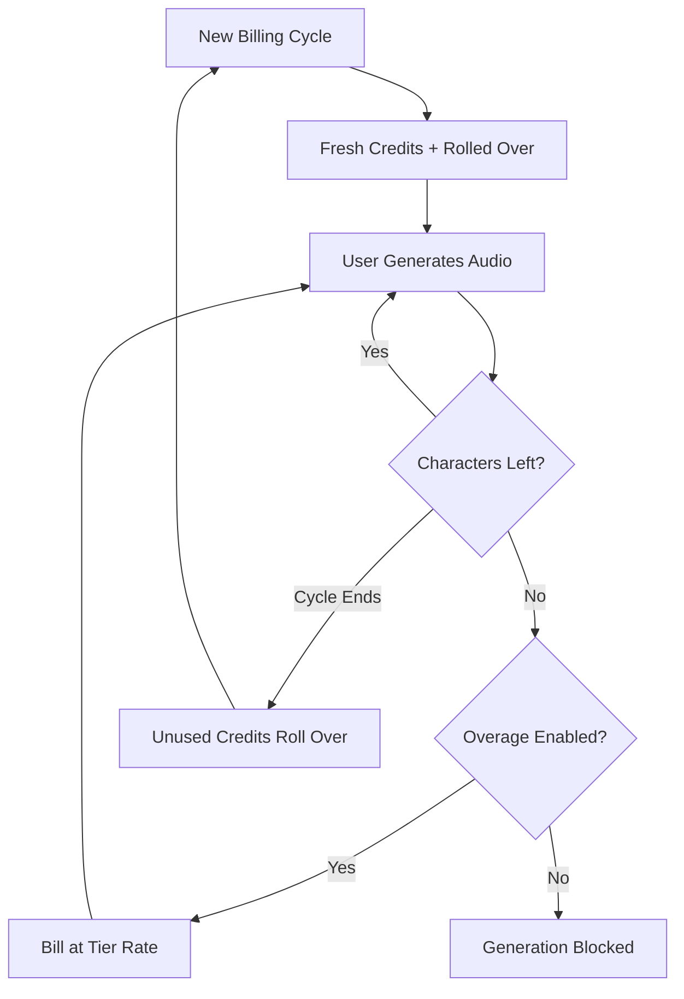

ElevenLabs ha consolidado una posición dominante en el espacio de voces de IA al hacer que su facturación sea tan fluida como su síntesis de voz. Su modelo gira en torno a una unidad de valor única: el carácter. Ya sea que estés generando texto a voz, clonando una voz o doblando un video, consumes de un mismo conjunto unificado de créditos de caracteres.

## Cómo factura ElevenLabs

La estructura de precios de ElevenLabs utiliza cuotas mensuales fijas vinculadas a niveles de suscripción. A medida que los usuarios pasan a niveles superiores, obtienen más caracteres y acceso a funciones más avanzadas como clonación profesional de voz o derechos comerciales.

| Plan | Price | Characters/Month | Overage Rate |
| :--- | :--- | :--- | :--- |
| Free | \$0 | 10,000 | Not available |
| Starter | \$5/month | 30,000 | ~\$0.30/1K chars |
| Creator | \$22/month | 100,000 | ~\$0.24/1K chars |
| Pro | \$99/month | 500,000 | ~\$0.15/1K chars |
| Scale | \$330/month | 2,000,000 | ~\$0.10/1K chars |

1. **Precios basados en caracteres**: Los caracteres son la moneda universal en toda la plataforma. Texto a voz, doblaje y clonación vocal consumen de ese mismo saldo, lo que simplifica el seguimiento del uso.
2. **Mecánica de transferencia**: Los caracteres no utilizados se trasladan al siguiente ciclo de facturación en lugar de expirar. ElevenLabs aplica un límite para evitar acumulaciones infinitas, garantizando que los usuarios conserven el valor de su suscripción.
3. **Excesos escalonados**: Los excedentes se gestionan según el nivel de suscripción. Los planes inferiores tienen los excesos deshabilitados de forma predeterminada por seguridad, mientras que los niveles superiores permiten cargos optativos para mantener la continuidad del servicio.

## Qué lo hace único

Varias decisiones estratégicas hacen que el modelo de facturación de ElevenLabs sea particularmente eficaz para retener usuarios y fomentar mejoras.

- **Transferencia de caracteres**: Los créditos transferidos reducen la ansiedad de "úsalo o piérdelo" al avanzar la inversión no utilizada. Esto mantiene el valor de la suscripción incluso durante periodos de menor actividad.
- **Precios escalonados por exceso**: Las tarifas por exceso disminuyen a medida que aumentan los planes, creando un incentivo sólido para mejorar. Los usuarios suelen encontrar los niveles más altos más atractivos gracias al menor costo de uso adicional.
- **Consumo unificado**: Un único conjunto de caracteres para todos los servicios elimina la carga cognitiva de gestionar cuotas separadas. Los usuarios solo necesitan seguir un número para entender su capacidad restante.
- **Excesos optativos**: Los usuarios profesionales pueden habilitar excesos para garantizar continuidad, mientras que los usuarios ocasionales se benefician de la seguridad de un límite rígido.



## Reproduce esto con Dodo Payments

Puedes replicar este modelo sofisticado usando la facturación basada en créditos y el monitoreo de uso de Dodo Payments.

<Steps>
<Step title="Create a Custom Unit Credit Entitlement">
Primero, define la unidad "Characters" que servirá como la moneda de tu plataforma.

1. Ve a **Entitlements** en tu panel de Dodo.
2. Crea un nuevo **Credit Entitlement**.
3. Establece el **Credit Type** en **Custom Unit**.
4. Nombra la unidad "Characters".
5. Configura la **Precisión** en 0, ya que los caracteres siempre son unidades enteras.
6. Establece la **Caducidad de créditos** en 30 días para coincidir con el ciclo de facturación mensual.
7. Habilita la **Transferencia** con estos ajustes:
    - **Porcentaje máximo de transferencia**: 100 % (permite que todos los caracteres no usados se acumulen).
    - **Marco de tiempo de transferencia**: 1 mes.
    - **Número máximo de transferencias**: 1 (los créditos pueden transferirse una vez y luego expiran).
</Step>

<Step title="Create Tiered Subscription Products">
Crea cinco productos de suscripción. Adjuntarás el mismo beneficio de "Characters" a cada uno, pero con configuraciones diferentes para cada nivel.

| Product | Price | Credits/Cycle | Overage Enabled | Overage Price (per 1K chars) |
| :--- | :--- | :--- | :--- | :--- |
| Free | \$0/mo | 10,000 | No | - |
| Starter | \$5/mo | 30,000 | Yes (opt-in) | \$0.30 |
| Creator | \$22/mo | 100,000 | Yes | \$0.24 |
| Pro | \$99/mo | 500,000 | Yes | \$0.15 |
| Scale | \$330/mo | 2,000,000 | Yes | \$0.10 |

Cuando adjuntes el beneficio de créditos a cada producto, desmarca **Import Default Credit Settings**. Esto te permite establecer el **Precio por unidad** específico para los excesos en ese nivel en particular. Configura el **Comportamiento de exceso** en **Facturar el exceso al momento de la facturación** y establece un **Umbral de saldo bajo** en el 10 % de la cuota del nivel.

<Step title="Create a Usage Meter">
El medidor de uso conecta la actividad de tu aplicación con el sistema de créditos.

1. Crea un nuevo medidor llamado `tts.characters`.
2. Establece la **Agregación** en **Sum**. Esto sumará la propiedad `characters` de cada evento que envíes.
3. Vincula este medidor a tu beneficio de crédito "Characters".
4. Establece **Unidades del medidor por crédito** en 1. Esto asegura que cada carácter usado en tu app equivalga a un crédito descontado del saldo.
</Step>

<Step title="Send Usage Events">
Integra el seguimiento de uso en el código de tu aplicación. Cada vez que un usuario genere audio, envía un evento a Dodo.

```typescript
import DodoPayments from 'dodopayments';

async function trackGeneration(
  customerId: string,
  text: string, 
  service: 'tts' | 'dubbing' | 'cloning'
) {
  const characterCount = text.length;

  const client = new DodoPayments({
    bearerToken: process.env.DODO_PAYMENTS_API_KEY,
  });

  await client.usageEvents.ingest({
    events: [{
      event_id: `gen_${Date.now()}_${Math.random().toString(36).slice(2)}`,
      customer_id: customerId,
      event_name: 'tts.characters',
      timestamp: new Date().toISOString(),
      metadata: {
        characters: characterCount,
        service: service,
        voice_id: 'voice_abc123'
      }
    }]
  });
}
```

</Step>

<Step title="Handle Low Balance and Overage">
Usa webhooks para mantener informados a tus usuarios sobre su consumo de caracteres.

```typescript
import DodoPayments from 'dodopayments';
import express from 'express';

const app = express();
app.use(express.raw({ type: 'application/json' }));

const client = new DodoPayments({
  bearerToken: process.env.DODO_PAYMENTS_API_KEY,
  webhookKey: process.env.DODO_PAYMENTS_WEBHOOK_KEY,
});

app.post('/webhooks/dodo', async (req, res) => {
  try {
    const event = client.webhooks.unwrap(req.body.toString(), {
      headers: {
        'webhook-id': req.headers['webhook-id'] as string,
        'webhook-signature': req.headers['webhook-signature'] as string,
        'webhook-timestamp': req.headers['webhook-timestamp'] as string,
      },
    });

    switch (event.type) {
      case 'credit.balance_low':
        await notifyUser(event.data.customer_id, 
          'You are running low on characters. Consider upgrading your plan for more characters and lower overage rates.'
        );
        break;
      case 'credit.deducted':
        await logUsage(event.data);
        break;
      case 'credit.overage_charged':
        await notifyUser(event.data.customer_id,
          'You have exceeded your character quota. Overage charges will appear on your next invoice.'
        );
        break;
    }

    res.json({ received: true });
  } catch (error) {
    res.status(401).json({ error: 'Invalid signature' });
  }
});
```

</Step>

<Step title="Create Checkout">
Cuando un usuario esté listo para suscribirse, crea una sesión de pago para el nivel elegido.

```typescript
const session = await client.checkoutSessions.create({
  product_cart: [
    { product_id: 'prod_elevenlabs_pro', quantity: 1 }
  ],
  customer: { email: 'creator@example.com' },
  return_url: 'https://yourapp.com/dashboard'
});
```

</Step>
</Steps>

## Acelera con el plano de ingestión de stream

Para monitorear la salida de audio junto con la facturación basada en caracteres, el [Stream Ingestion Blueprint](/developer-resources/ingestion-blueprints/stream) ofrece una forma eficiente de medir el consumo de ancho de banda.

```bash
npm install @dodopayments/ingestion-blueprints
```

```typescript
import { Ingestion, trackStreamBytes } from '@dodopayments/ingestion-blueprints';

const ingestion = new Ingestion({
  apiKey: process.env.DODO_PAYMENTS_API_KEY,
  environment: 'live_mode',
  eventName: 'tts.audio_bytes',
});

// After generating audio, track the output size
const audioBuffer = await generateSpeech(text, voiceId);

await trackStreamBytes(ingestion, {
  customerId: customerId,
  bytes: audioBuffer.byteLength,
  metadata: {
    voice_id: voiceId,
    service: 'tts',
    format: 'mp3',
  },
});
```

Utiliza el plano de stream para rastrear el ancho de banda del audio junto con tu sistema de créditos basado en caracteres. Esto te brinda visibilidad sobre los costos reales de infraestructura por generación.

<Tip>
El plano de stream también admite procesamiento por lotes para escenarios de alto volumen. Consulta la [documentación completa del plano](/developer-resources/ingestion-blueprints/stream) para patrones de uso avanzados.
</Tip>

## Incentivo de mejora: precios escalonados por exceso

La parte más brillante del modelo de ElevenLabs es cómo utiliza las tarifas de exceso para impulsar las mejoras. Al hacer que el costo por carácter sea más barato en niveles superiores, cambian la conversación de "¿cuánto necesito?" a "¿cuánto puedo ahorrar?".

| Tier | Included Chars | Overage (per 1K) | Effective Cost at 500K Chars |
| :--- | :--- | :--- | :--- |
| Creator | 100,000 | \$0.24 | \$22 + (400 * \$0.24) = \$118 |
| Pro | 500,000 | \$0.15 | \$99 (No overage) |

Un usuario que consume 500,000 caracteres regularmente en el plan Creator paga \$118 al mes entre suscripción y excesos. Pasarse al plan Pro cubre el mismo uso por \$99, ahorrando \$19 al mes. La tasa de exceso más baja en niveles superiores hace que, a medida que el uso crece, mejorar sea la decisión financiera evidente.

Con Dodo Payments, implementas esto desmarcando la casilla **Import Default Credit Settings** al adjuntar créditos a tus productos de suscripción. Esto te da control total sobre el **Precio por unidad** de cada nivel específico, permitiéndote premiar a tus clientes de mayor gasto con las mejores tarifas.

## Características clave de Dodo utilizadas

<CardGroup cols={2}>
  <Card title="Credit-Based Billing" icon="coins" href="/features/credit-based-billing">
    Gestiona las cuotas, transferencias y caducidades de caracteres.
  </Card>
  <Card title="Subscriptions" icon="calendar" href="/features/subscription">
    Configura los niveles recurrentes que entregan asignaciones mensuales de caracteres.
  </Card>
  <Card title="Usage-Based Billing" icon="chart-line" href="/features/usage-based-billing/introduction">
    Rastrea el consumo de caracteres en tiempo real en todos tus servicios.
  </Card>
  <Card title="Event Ingestion" icon="bolt" href="/features/usage-based-billing/event-ingestion">
    Envía datos de uso de alto volumen a Dodo con latencia mínima.
  </Card>
  <Card title="Webhooks" icon="webhook" href="/developer-resources/webhooks/intents/credit">
    Reacciona a saldos bajos y eventos de exceso en tiempo real.
  </Card>
  <Card title="Stream Ingestion Blueprint" icon="tower-broadcast" href="/developer-resources/ingestion-blueprints/stream">
    Rastrea el ancho de banda de transmisión de audio para facturación basada en uso.
  </Card>
</CardGroup>
