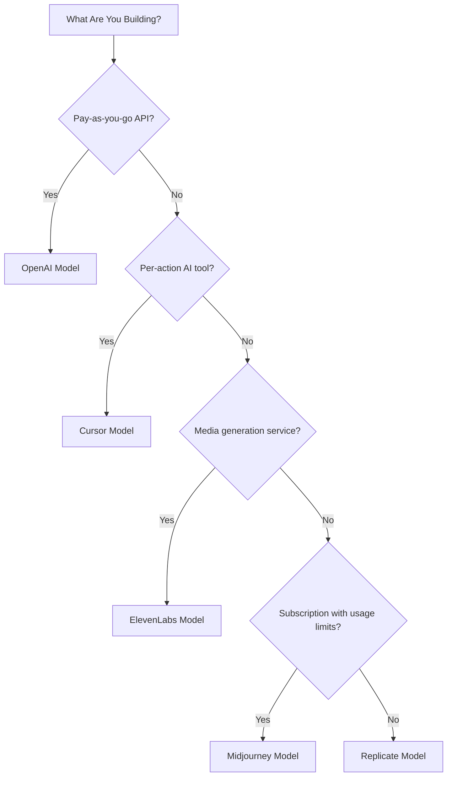

## Los cinco modelos

| Aplicación | Métrica principal | Innovación única | Función de Dodo |
| :--- | :--- | :--- | :--- |
| OpenAI | Tokens (denominados en fiat) | Créditos fiat prepago con saldo que nunca caduca | Facturación basada en créditos (Créditos fiat) |
| Cursor | Solicitudes premium | Agotamiento de créditos ponderado por modelo (costos distintos por modelo) | Facturación basada en créditos (Unidad personalizada) |
| ElevenLabs | Caracteres | Cuotas de caracteres con acumulación y precios escalonados por exceso | Facturación basada en créditos (Acumulación + exceso) |
| Midjourney | Tiempo de GPU | "Modo relajado" como alternativa ilimitada tras la cuota | Suscripción + medidores de uso |
| Replicate | Segundos de ejecución | Medición pura específica por hardware por segundo | Facturación puramente basada en uso |

## Comprendiendo patrones de créditos

| Patrón | Ejemplo | Función de Dodo | Tipo de unidad |
| :--- | :--- | :--- | :--- |
| Créditos prepago denominados en fiat | API de OpenAI (recarga de $5, sin retiro) | Facturación basada en créditos (Créditos fiat) | Unidades virtuales denominadas en dólares |
| Créditos virtuales de uso | Solicitudes premium de Cursor, caracteres de ElevenLabs | Facturación basada en créditos (Unidad personalizada) | Unidades arbitrarias (solicitudes, caracteres) |
| Medición de consumo puro | Facturación por segundo de Replicate | Facturación basada en uso (Medidores) | Medición directa (segundos, bytes) |
| Suscripción + exceso medido | Horas rápidas de Midjourney con alternativa Relax | Suscripción + medidores de uso | Basado en tiempo con umbral gratuito |

<Info>
Los créditos fiat en la facturación basada en créditos de Dodo representan valores denominados en la plataforma en dólares sin valor monetario fuera de tu ecosistema. Los clientes no pueden retirarlos como efectivo.
</Info>

## ¿Qué modelo deberías usar?

- Construir una plataforma API de pago por uso: modelo de OpenAI (Créditos fiat)
- Construir una herramienta de IA con precios por acción: modelo de Cursor (Créditos de unidad personalizada)
- Construir un servicio de generación de medios: modelo de ElevenLabs (Créditos acumulados)
- Construir un servicio de suscripción con límites de uso: modelo de Midjourney (Suscripción + medidores de uso)
- Construir una plataforma de infraestructura/cómputo: modelo de Replicate (Medición pura)

<CardGroup cols={2}>
  <Card title="OpenAI" icon="/images/logos/openai.svg" href="/developer-resources/billing-deconstructions/openai">
    Replica el modelo de créditos prepago basado en tokens.
  </Card>
  <Card title="Cursor" icon="/images/logos/cursor.svg" href="/developer-resources/billing-deconstructions/cursor">
    Crea límites de uso ponderados por modelo.
  </Card>
  <Card title="ElevenLabs" icon="/images/logos/elevenlabs.svg" href="/developer-resources/billing-deconstructions/elevenlabs">
    Implementa cuotas de caracteres con acumulación y excesos.
  </Card>
  <Card title="Midjourney" icon="/images/logos/midjourney.svg" href="/developer-resources/billing-deconstructions/midjourney">
    Combina suscripciones con alternativa basada en uso.
  </Card>
  <Card title="Replicate" icon="/images/logos/replicate.svg" href="/developer-resources/billing-deconstructions/replicate">
    Configura la medición pura de consumo por segundo.
  </Card>
</CardGroup>

## Funciones de Dodo

<CardGroup cols={2}>
  <Card title="Credit-Based Billing" href="/features/credit-based-billing">
    Gestiona créditos prepago y unidades virtuales.
  </Card>
  <Card title="Usage-Based Billing" href="/features/usage-based-billing/introduction">
    Mide el consumo en tiempo real.
  </Card>
  <Card title="Subscriptions" href="/features/subscription">
    Administra la facturación recurrente y la gestión de planes.
  </Card>
  <Card title="Hybrid Billing" href="/features/hybrid-billing">
    Combina múltiples modelos de facturación para la máxima flexibilidad.
  </Card>
</CardGroup>

## Planos de ingestión

Cada desconstrucción incluye integración con los [Planos de ingestión](/features/usage-based-billing/ingestion-blueprints) de Dodo, SDK preconstruidos que manejan el seguimiento de eventos automáticamente. En lugar de construir manualmente eventos de uso, usa un plano para obtener medición lista para producción en minutos.

<CardGroup cols={3}>
  <Card title="LLM Blueprint" icon="brain-circuit" href="/developer-resources/ingestion-blueprints/llm">
    Seguimiento automático de tokens para OpenAI, Anthropic, Groq y más.
  </Card>
  <Card title="Stream Blueprint" icon="tower-broadcast" href="/developer-resources/ingestion-blueprints/stream">
    Rastrea el ancho de banda de transmisión de audio y video.
  </Card>
  <Card title="Time Range Blueprint" icon="clock" href="/developer-resources/ingestion-blueprints/time-range">
    Cobra por duración de cómputo hasta el milisegundo.
  </Card>
</CardGroup>
