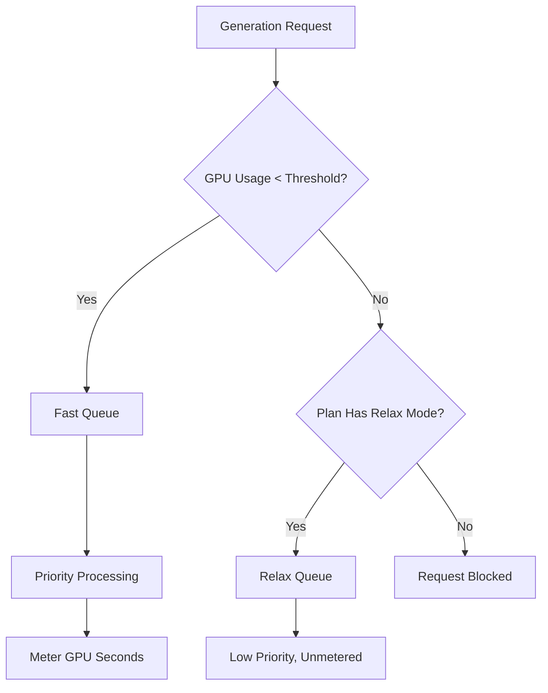

Midjourney es una plataforma de IA generativa que utiliza un modelo de facturación único basado en tiempo de GPU en lugar de un simple conteo por imagen. Este enfoque garantiza que los renderizados complejos y de alta resolución cuesten más que los borradores rápidos y de baja resolución.

## Cómo factura Midjourney

Los planes de suscripción de Midjourney otorgan a los usuarios una cantidad específica de "Horas rápidas de GPU" cada mes. Estas horas representan el tiempo computacional real utilizado en tus generaciones.

| Plan | Precio | Horas rápidas de GPU | Modo Relax | Modo Stealth |
| :--- | :--- | :--- | :--- | :--- |
| Básico | \$10/mes | ~3,3 h | No | No |
| Estándar | \$30/mes | 15 h | Ilimitado | No |
| Pro | \$60/mes | 30 h | Ilimitado | Sí |
| Mega | \$120/mes | 60 h | Ilimitado | Sí |

1. **Niveles de precios**: Midjourney ofrece cuatro niveles de suscripción que van desde \$10 hasta \$120 al mes, cada uno proporcionando una cantidad establecida de horas rápidas de GPU.
2. **Modo Relax**: Los planes Estándar y superiores incluyen generación ilimitada a través de una cola de baja prioridad una vez agotadas las horas rápidas, lo que garantiza que los usuarios nunca se topen con un límite rígido de uso.
3. **Horas extra de GPU**: Los usuarios pueden adquirir tiempo adicional de GPU rápido por aproximadamente \$4 la hora si necesitan resultados inmediatos después de agotar su asignación mensual.
4. **Medición en segundos de GPU**: El uso se rastrea por el tiempo computacional real empleado en las generaciones, lo que significa que los renderizados complejos cuestan más que los borradores sencillos.
5. **Circuito comunitario**: Los usuarios activos pueden ganar horas de GPU adicionales calificando imágenes en la galería, lo que ayuda a entrenar modelos mientras recompensa a la comunidad.
## Qué lo hace único

El modelo de Midjourney es efectivo porque alinea el costo con el valor y el uso de recursos.

* **Facturación por tiempo de GPU** alinea el costo con el uso de recursos, asegurando que los renderizados complejos tengan un precio justo en comparación con los borradores simples.
* **Modo Relax** ofrece una opción ilimitada que reduce la rotación al mantener el acceso al servicio incluso después de alcanzar los límites mensuales.
* **La división Fast vs Relax** incentiva las mejoras al ofrecer procesamiento prioritario para los usuarios que valoran la velocidad y los resultados instantáneos.
* **Horas extra de GPU** proporcionan una opción flexible de recarga para usuarios intensivos que necesitan capacidad adicional de alta prioridad a mitad de mes.

## Construye esto con Dodo Payments

Puedes replicar este modelo usando Dodo Payments combinando suscripciones con medidores de uso y lógica a nivel de aplicación.

<Steps>

<Step title="Create a Usage Meter">

Primero, crea un medidor para rastrear los segundos de GPU usados por cada cliente.

* **Nombre del medidor**: `gpu.fast_seconds`
* **Agregación**: **Suma** (suma la propiedad `gpu_seconds` de cada evento)

Solo rastrearás eventos donde el modo de generación sea "fast". Las generaciones en modo Relax no se meten para fines de facturación.

</Step>

<Step title="Create Subscription Products with Usage Pricing">

Crea tus productos de suscripción y adjunta el medidor de uso con un umbral gratuito.

| Producto | Precio base | Umbral gratuito (segundos) | Tarifa por exceso |
| :--- | :--- | :--- | :--- |
| Básico | \$10/mes | 12.000 (3,3 h) | N/A (límite rígido) |
| Estándar | \$30/mes | 54.000 (15 h) | \$0.00 (Modo Relax) |
| Pro | \$60/mes | 108.000 (30 h) | \$0.00 (Modo Relax) |
| Mega | \$120/mes | 216.000 (60 h) | \$0.00 (Modo Relax) |

Para el plan Básico, desactivarás el exceso para hacer cumplir un límite rígido. Para los demás planes, el “Modo Relax” lo maneja la lógica de tu aplicación cuando el medidor muestra que se supera el umbral.

</Step>

<Step title="Implement Application-Level Relax Mode">

La clave es que el Modo Relax no es una función de facturación. Es tu aplicación enroutando las solicitudes a una cola más lenta cuando el medidor de uso de Dodo indica que se alcanzó el umbral.

```typescript
async function handleGenerationRequest(customerId: string, prompt: string) {
  const usage = await getCustomerUsage(customerId, 'gpu.fast_seconds');
  const subscription = await getSubscription(customerId);
  const threshold = getThresholdForPlan(subscription.product_id);
  
  if (usage.current >= threshold) {
    if (subscription.product_id === 'prod_basic') {
      throw new Error('Fast GPU hours exhausted. Upgrade to Standard for Relax Mode.');
    }
    
    // Relax Mode. Route to low-priority queue
    return await queueGeneration(customerId, prompt, {
      priority: 'low',
      mode: 'relax',
      model: 'standard'
    });
  }
  
  // Fast Mode. Priority processing
  return await queueGeneration(customerId, prompt, {
    priority: 'high',
    mode: 'fast',
    model: 'premium'
  });
}
```

</Step>

<Step title="Send Usage Events (Fast Mode Only)">

Solo envía eventos de uso a Dodo cuando se realiza una generación en modo Fast.

```typescript
import DodoPayments from 'dodopayments';

async function trackFastGeneration(customerId: string, gpuSeconds: number, jobId: string) {
  // Only track Fast mode generations. Relax mode is free and unlimited
  const client = new DodoPayments({
    bearerToken: process.env.DODO_PAYMENTS_API_KEY,
  });

  await client.usageEvents.ingest({
    events: [{
      event_id: `gen_${jobId}`,
      customer_id: customerId,
      event_name: 'gpu.fast_seconds',
      timestamp: new Date().toISOString(),
      metadata: {
        gpu_seconds: gpuSeconds,
        resolution: '1024x1024',
        mode: 'fast'
      }
    }]
  });
}
```

</Step>

<Step title="Sell Extra Fast Hours (One-Time Top-Up)">

Crea un producto de pago único para "Hora extra de GPU rápida" a \$4. Cuando un cliente compra esto, puedes otorgar umbrales o créditos adicionales en tu aplicación.

```typescript
// After customer purchases extra hours
const session = await client.checkoutSessions.create({
  product_cart: [
    { product_id: 'prod_extra_gpu_hour', quantity: 5 }
  ],
  customer: { customer_id: customerId },
  return_url: 'https://yourapp.com/dashboard'
});
```

</Step>

<Step title="Create Checkout for Subscription">

Por último, crea una sesión de checkout para el plan de suscripción.

```typescript
const session = await client.checkoutSessions.create({
  product_cart: [
    { product_id: 'prod_mj_standard', quantity: 1 }
  ],
  customer: { email: 'artist@example.com' },
  return_url: 'https://yourapp.com/studio'
});
```

</Step>

</Steps>

## Acelera con el plano de ingestión Time Range

El [Time Range Ingestion Blueprint](/developer-resources/ingestion-blueprints/time-range) simplifica el seguimiento del tiempo de GPU al proporcionar ayudantes dedicados para la facturación basada en duración.

```bash
npm install @dodopayments/ingestion-blueprints
```

```typescript
import { Ingestion, trackTimeRange } from '@dodopayments/ingestion-blueprints';

const ingestion = new Ingestion({
  apiKey: process.env.DODO_PAYMENTS_API_KEY,
  environment: 'live_mode',
  eventName: 'gpu.fast_seconds',
});

// Track generation time after a Fast mode job completes
const startTime = Date.now();
const result = await runGeneration(prompt, settings);
const durationMs = Date.now() - startTime;

await trackTimeRange(ingestion, {
  customerId: customerId,
  durationMs: durationMs,
  metadata: {
    mode: 'fast',
    resolution: '1024x1024',
  },
});
```

El plano maneja la conversión de duración y el formato de eventos. Solo necesitas proporcionar el ID del cliente y el tiempo transcurrido.

<Tip>
El Time Range Blueprint admite milisegundos, segundos y minutos. Consulta la [documentación completa del blueprint](/developer-resources/ingestion-blueprints/time-range) para todas las opciones de duración y las mejores prácticas.
</Tip>

## La arquitectura Fast vs Relax

El sistema de doble cola funciona enrutando las solicitudes según el estado de uso actual.



1. Todas las solicitudes pasan por tu aplicación.
2. La aplicación verifica el medidor de uso de Dodo respecto al umbral gratuito del plan.
3. Si el uso está por debajo del umbral, la solicitud va a la cola Fast y se contabiliza.
4. Si el uso supera el umbral, la solicitud va a la cola Relax, que no se contabiliza y tiene menor prioridad.
5. El plan Básico no tiene respaldo de Relax, así que las solicitudes se bloquean una vez alcanzado el límite.

<Info>
El Modo Relax es un patrón a nivel de aplicación, no una característica de facturación de Dodo. Dodo rastrea tu uso de GPU rápida y te indica cuándo se excede el umbral. Tu aplicación decide si bloquea al usuario o lo enruta a una cola más lenta.
</Info>

## Principales funciones de Dodo utilizadas

<CardGroup cols={2}>
  <Card title="Subscriptions" icon="calendar" href="/features/subscription">
    Gestiona la facturación recurrente y los niveles de planes.
  </Card>
  <Card title="Usage-Based Billing" icon="bolt" href="/features/usage-based-billing/introduction">
    Rastrea y factura en función del consumo real de recursos.
  </Card>
  <Card title="Event Ingestion" icon="input-pipe" href="/features/usage-based-billing/event-ingestion">
    Envía eventos de uso de alto volumen a la API de Dodo.
  </Card>
  <Card title="Meters" icon="gauge" href="/features/usage-based-billing/meters">
    Define cómo se agregan y facturan los eventos de uso.
  </Card>
  <Card title="One-Time Payments" icon="credit-card" href="/features/one-time-payment-products">
    Vende horas extra o recargas como compras únicas.
  </Card>
  <Card title="Time Range Blueprint" icon="clock" href="/developer-resources/ingestion-blueprints/time-range">
    Seguimiento simplificado del tiempo de GPU con ayudantes basados en duración.
  </Card>
</CardGroup>
