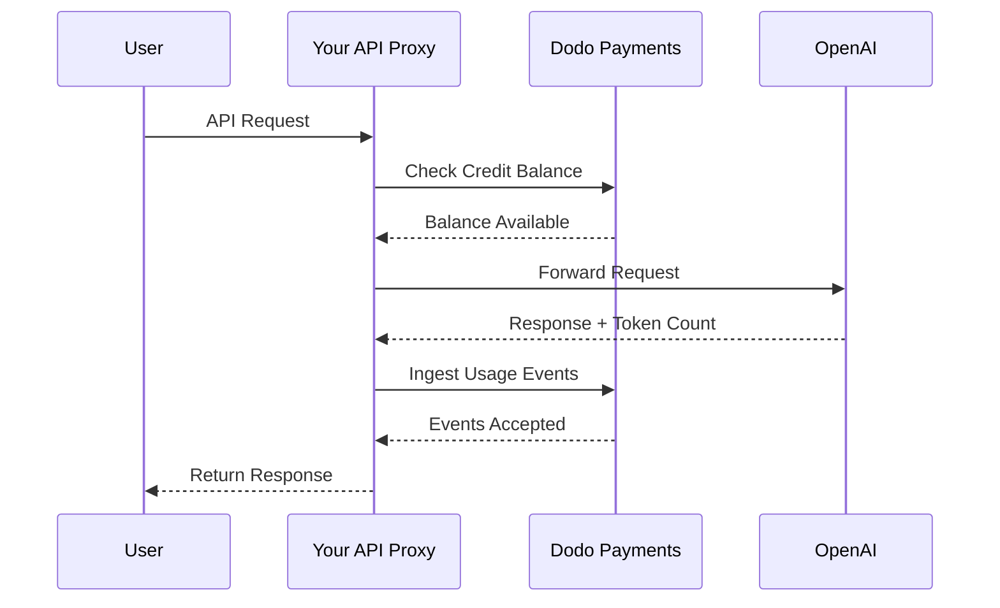
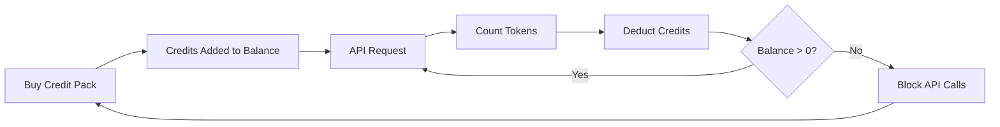

El modelo de facturación de OpenAI es el estándar de oro para las empresas de IA. Combina créditos prepago en moneda fiduciaria para el uso de la API con suscripciones de tarifa plana para productos de consumo. Este enfoque híbrido asegura ingresos predecibles mientras permite a los desarrolladores escalar su uso sin fricciones.

## Por qué el modelo de OpenAI es el estándar

La industria de la IA enfrenta desafíos únicos que la facturación SaaS tradicional no siempre aborda. El modelo de OpenAI resuelve varios de estos problemas al mismo tiempo.

1. **Ingresos predecibles y bajo riesgo**: Al exigir créditos prepago para el uso de la API, OpenAI elimina el riesgo de que los usuarios acumulen facturas enormes que no pueden pagar. Obtienes el dinero por adelantado y el usuario obtiene el servicio conforme lo usa.
2. **Escalabilidad para desarrolladores**: Una recarga de \$5 es una barrera de entrada baja. A medida que su aplicación crece, los desarrolladores pueden automatizar recargas o comprar paquetes más grandes. La fricción para empezar es casi nula, pero el potencial de crecimiento es ilimitado.
3. **Psicología del usuario**: Denominar los créditos en moneda fiduciaria (USD) en lugar de conceptos abstractos como “tokens” o “puntos” deja claro el valor. Se siente como una cuenta bancaria para servicios de IA, lo que genera confianza y facilita la planificación presupuestaria para las empresas.

## Cómo factura OpenAI

OpenAI opera dos modelos de facturación distintos que satisfacen necesidades diferentes de los usuarios.

1. **API (pago por uso)**: La API usa créditos prepago denominados en moneda fiduciaria. Los usuarios recargan sus cuentas con \$5, \$10, \$50 o más. Estos créditos muestran un valor en dólares, pero no tienen valor monetario fuera de OpenAI. OpenAI factura por token con tarifas diferentes para los tokens de entrada y de salida. Los créditos nunca expiran, y cuando el saldo de un usuario llega a \$0, sus llamadas a la API fallan inmediatamente.
2. **ChatGPT Plus, Team y Enterprise**: Son suscripciones de tarifa plana. ChatGPT Plus cuesta \$20 al mes, mientras que el plan Team es \$25 por usuario al mes. Estos planes tienen límites suaves de uso donde los usuarios se degradan a un modelo más pequeño en lugar de ser bloqueados.
3. **Niveles de tarifa basados en gasto**: A medida que gastas más dinero en total con el tiempo, desbloqueas límites de tasa más altos para la API. Este es un sistema de escalado basado en la confianza vinculado directamente a tu historial de facturación.

| Modelo | Precio | Tokens de entrada | Tokens de salida |
| :--- | :--- | :--- | :--- |
| GPT-4o | Basado en uso | \$2.50 / 1M | \$10.00 / 1M |
| GPT-4o-mini | Basado en uso | \$0.15 / 1M | \$0.60 / 1M |
| o1 | Basado en uso | \$15.00 / 1M | \$60.00 / 1M |

| Plan | Precio | Tipo |
| :--- | :--- | :--- |
| Gratis | \$0 | Acceso limitado |
| Plus | \$20 / mes | Suscripción con límites suaves |
| Team | \$25 / usuario / mes | Suscripción por asiento |
| Enterprise | Personalizado | Facturación mediante factura |
## Qué lo hace único

La estrategia de facturación de OpenAI tiene varias características clave que la hacen eficaz para servicios de IA.

- **Créditos denominados en moneda fiduciaria**: Los créditos se sienten como dinero porque están denominados en USD. Esto hace que los precios sean transparentes y fáciles de entender para los desarrolladores.
- **Sin vencimiento**: Los saldos que nunca expiran reducen la presión de “úsalo o piérdelo”. Los usuarios se sienten cómodos recargando cantidades mayores porque saben que el valor no desaparecerá.
- **Medición multidimensional**: Los tokens de entrada y de salida se rastrean por separado pero se deducen del mismo saldo de crédito. Esto permite que OpenAI fije precios distintos para los tokens de salida costosos frente a los tokens de entrada más baratos.
- **Niveles de confianza**: Vincular los límites de tasa al gasto total anima a los usuarios a permanecer en la plataforma y recompensa a los clientes a largo plazo con mejor rendimiento.
## Ventajas estratégicas

Este modelo crea un poderoso efecto de círculo virtuoso. Los bajos costos de entrada atraen a los desarrolladores. Los créditos prepago proporcionan flujo de caja inmediato. La escalabilidad basada en el uso asegura que, a medida que los desarrolladores tienen éxito, OpenAI también lo hace. El lado de suscripciones proporciona una base de ingresos constante y predecible provenientes de no desarrolladores.

## Construye esto con Dodo Payments

Puedes replicar el modelo de facturación de OpenAI usando Dodo Payments. Usaremos Credit-Based Billing para la API y suscripciones estándar para el lado de ChatGPT Plus.

<Steps>
  <Step title="Create a Fiat Credit Entitlement">
    Comienza creando una adjudicación de crédito en tu panel de Dodo Payments. Esto actuará como el saldo central de tus usuarios.

    * **Tipo de crédito:** Créditos fiduciarios (USD)
    * **Vencimiento del crédito:** Nunca
    * **Acumulación:** No es necesaria (ya que nunca expiran)
    * **Exceso:** Desactivado

    Desactivar el exceso asegura que las llamadas a la API fallen cuando el saldo llegue a \$0, exactamente como en OpenAI.
  </Step>

  <Step title="Create Top-Up Products">
    Crea productos de pago único para diferentes paquetes de créditos. Puedes ofrecer opciones de \$5, \$10, \$50 y \$100. Adjunta tu adjudicación de crédito fiduciario a cada producto.

    Establece los créditos emitidos por producto en centavos. Para un paquete de \$50, emitirás 5000 créditos.

    ```typescript
    import DodoPayments from 'dodopayments';

    const client = new DodoPayments({
      bearerToken: process.env.DODO_PAYMENTS_API_KEY,
    });

    const session = await client.checkoutSessions.create({
      product_cart: [
        { product_id: 'prod_credit_pack_50', quantity: 1 }
      ],
      customer: { email: 'developer@example.com' },
      return_url: 'https://yourapp.com/dashboard'
    });
    ```

  </Step>

  <Step title="Create Usage Meters">
    Crea dos medidores separados para rastrear el uso de tokens.

    * `llm.input_tokens`: Agregación de suma sobre la propiedad `tokens`.
    * `llm.output_tokens`: Agregación de suma sobre la propiedad `tokens`.
    Vincula ambos medidores a tu adjudicación de crédito fiduciario. Necesitarás configurar las “Unidades de medidor por crédito” para cada uno.

    ### Cálculo de unidades de medidor por crédito

    Para igualar los precios de GPT-4o de OpenAI (\$2.50 por 1M de tokens de entrada), necesitas calcular cuántos tokens equivalen a \$1 (100 centavos).

    * **Tokens de entrada:** 1.000.000 tokens / \$2.50 = 400.000 tokens por \$1.
    * **Tokens de salida:** 1.000.000 tokens / \$10.00 = 100.000 tokens por \$1.

    En el panel de Dodo, establecerías las “Unidades de medidor por crédito” en 400.000 para entrada y 100.000 para salida.
  </Step>

  <Step title="Send Usage Events">
    Después de cada solicitud al LLM, envía los datos de uso a Dodo Payments. Puedes enviar eventos de entrada y de salida en una sola solicitud.

    ```typescript
    await client.usageEvents.ingest({
      events: [{
        event_id: `req_${requestId}`,
        customer_id: customerId,
        event_name: 'llm.input_tokens',
        timestamp: new Date().toISOString(),
        metadata: {
          model: 'gpt-4o',
          tokens: 1500
        }
      }, {
        event_id: `req_${requestId}_out`,
        customer_id: customerId,
        event_name: 'llm.output_tokens',
        timestamp: new Date().toISOString(),
        metadata: {
          model: 'gpt-4o',
          tokens: 800
        }
      }]
    });
    ```

  </Step>

  <Step title="Handle Balance Depletion">
    Deberías verificar el saldo del usuario antes de procesar una solicitud a la API. Si el saldo es cero o negativo, devuelve un error 402.

    ```typescript
    async function checkCreditsBeforeRequest(customerId: string) {
      const balance = await client.creditEntitlements.balances.retrieve(customerId, {
        credit_entitlement_id: 'credit_entitlement_id',
      });

      if (balance.available <= 0) {
        throw new Error('Insufficient credits. Please top up your account.');
      }
    }
    ```

    ### Manejo de webhooks de saldo bajo

    No esperes hasta que el usuario llegue a \$0 para notificarle. Usa webhooks para activar un correo electrónico o notificación en la aplicación cuando su saldo caiga por debajo de cierto umbral.

    ```typescript
    import DodoPayments from 'dodopayments';
    import express from 'express';

    const app = express();
    app.use(express.raw({ type: 'application/json' }));

    const client = new DodoPayments({
      bearerToken: process.env.DODO_PAYMENTS_API_KEY,
      webhookKey: process.env.DODO_PAYMENTS_WEBHOOK_KEY,
    });

    app.post('/webhooks/dodo', async (req, res) => {
      try {
        const event = client.webhooks.unwrap(req.body.toString(), {
          headers: {
            'webhook-id': req.headers['webhook-id'] as string,
            'webhook-signature': req.headers['webhook-signature'] as string,
            'webhook-timestamp': req.headers['webhook-timestamp'] as string,
          },
        });

        if (event.type === 'credit.balance_low') {
          const { customer_id, available_balance } = event.data;
          await sendLowBalanceEmail(customer_id, available_balance);
        }

        res.json({ received: true });
      } catch (error) {
        res.status(401).json({ error: 'Invalid signature' });
      }
    });
    ```

    <Tip>
      OpenAI envía estos correos cuando el saldo de un usuario está casi agotado, dándoles tiempo para recargar sin interrupción del servicio.
    </Tip>
  </Step>

  <Step title="Build the ChatGPT Subscription Side (Optional)">
    Si deseas ofrecer un plan de suscripción como ChatGPT Plus, crea un producto de suscripción separado en Dodo Payments. Estos no necesitan adjudicaciones de crédito.

    Para un plan Team, usa facturación por asiento agregando complementos para cada usuario adicional.

    ```typescript
    const session = await client.checkoutSessions.create({
      product_cart: [
        { product_id: 'prod_plus_subscription', quantity: 1 }
      ],
      customer: { email: 'user@example.com' },
      return_url: 'https://yourapp.com/billing'
    });
    ```

    ### Implementación de límites suaves

    Para replicar los límites suaves de OpenAI, puedes rastrear el uso de tus usuarios de suscripción usando los mismos medidores pero sin vincularlos a una adjudicación de crédito. En la lógica de tu aplicación, verifica el uso del período de facturación actual.

    ```typescript
    async function checkSubscriptionUsage(customerId: string) {
      const usage = await getUsageForCurrentPeriod(customerId);
      
      if (usage > SOFT_CAP_THRESHOLD) {
        // Route to a smaller model instead of blocking
        return 'gpt-4o-mini';
      }
      
      return 'gpt-4o';
    }
    ```

  </Step>
</Steps>

## Acelera con el plano de ingestión de LLM

Los pasos anteriores muestran cómo construir y enviar manualmente eventos de uso. Para despliegues en producción, el [LLM Ingestion Blueprint](/developer-resources/ingestion-blueprints/llm) proporciona seguimiento automático de tokens que envuelve directamente tu cliente de OpenAI.

```bash
npm install @dodopayments/ingestion-blueprints
```

```typescript
import { createLLMTracker } from '@dodopayments/ingestion-blueprints';
import OpenAI from 'openai';

const openai = new OpenAI({ apiKey: process.env.OPENAI_API_KEY });

const tracker = createLLMTracker({
  apiKey: process.env.DODO_PAYMENTS_API_KEY,
  environment: 'live_mode',
  eventName: 'llm.chat_completion',
});

const trackedClient = tracker.wrap({
  client: openai,
  customerId: customerId,
});

// Every API call now automatically tracks token usage
const response = await trackedClient.chat.completions.create({
  model: 'gpt-4o',
  messages: [{ role: 'user', content: prompt }],
});

// inputTokens, outputTokens, and totalTokens are sent automatically
console.log('Tokens used:', response.usage);
```

El plano captura `inputTokens`, `outputTokens` e `totalTokens` de cada respuesta de la API y los envía como metadatos de evento. Configura tu medidor para agregar en la propiedad de token correspondiente.

<Tip>
El LLM Blueprint admite OpenAI, Anthropic, Groq, Google Gemini, OpenRouter y el SDK de Vercel AI. Consulta la [documentación completa del plano](/developer-resources/ingestion-blueprints/llm) para ejemplos específicos por proveedor y configuración avanzada.
</Tip>

## Implementación de niveles de tarifa basados en gasto

Los niveles de tarifa de OpenAI son una forma poderosa de gestionar la capacidad. Puedes implementarlo rastreando el gasto total de por vida de un cliente.

1. **Rastrea el gasto de por vida:** Escucha los webhooks `payment.succeeded` y actualiza un campo `total_spend` en tu base de datos para ese cliente.
2. **Define niveles:** Crea una asignación de montos gastados a límites de tasa.
   * Nivel 1: \$0 - \$50 gastados -> 3 RPM
   * Nivel 2: \$50 - \$250 gastados -> 10 RPM
   * Nivel 3: \$250+ gastados -> 50 RPM
3. **Aplica los límites:** En el middleware de tu API, verifica el nivel del cliente y aplica el límite de tasa correspondiente.

```typescript
async function getRateLimitForCustomer(customerId: string) {
  const customer = await db.customers.findUnique({ where: { id: customerId } });
  const totalSpend = customer.total_spend;

  if (totalSpend >= 25000) return TIER_3_LIMITS; // $250.00
  if (totalSpend >= 5000) return TIER_2_LIMITS;  // $50.00
  return TIER_1_LIMITS;
}
```

## Ejemplo completo de implementación: el proxy de API

En un escenario real, probablemente tendrás un proxy de API que se sitúe entre tus usuarios y el proveedor del LLM. Este proxy maneja la autenticación, las verificaciones de crédito y el reporte de uso.



```typescript
import DodoPayments from 'dodopayments';
import OpenAI from 'openai';

const client = new DodoPayments({
  bearerToken: process.env.DODO_PAYMENTS_API_KEY,
});
const openai = new OpenAI({ apiKey: process.env.OPENAI_API_KEY });

export async function handleApiRequest(req, res) {
  const { customerId, prompt, model } = req.body;

  try {
    // 1. Check credit balance
    const balance = await client.creditEntitlements.balances.retrieve(customerId, {
      credit_entitlement_id: 'credit_entitlement_id',
    });

    if (balance.available <= 0) {
      return res.status(402).json({ error: 'Insufficient credits. Please top up.' });
    }

    // 2. Call OpenAI
    const completion = await openai.chat.completions.create({
      model: model,
      messages: [{ role: 'user', content: prompt }],
    });

    const { prompt_tokens, completion_tokens } = completion.usage;

    // 3. Ingest usage events to Dodo
    await client.usageEvents.ingest({
      events: [
        {
          event_id: `req_${completion.id}_in`,
          customer_id: customerId,
          event_name: 'llm.input_tokens',
          timestamp: new Date().toISOString(),
          metadata: { model, tokens: prompt_tokens }
        },
        {
          event_id: `req_${completion.id}_out`,
          customer_id: customerId,
          event_name: 'llm.output_tokens',
          timestamp: new Date().toISOString(),
          metadata: { model, tokens: completion_tokens }
        }
      ]
    });

    // 4. Return response to user
    res.json(completion);

  } catch (error) {
    console.error('API Error:', error);
    res.status(500).json({ error: 'Internal server error' });
  }
}
```

## Manejo de casos extremos

Al construir un sistema de facturación tan complejo como el de OpenAI, te encontrarás con varios casos extremos que requieren una atención cuidadosa.

### Condiciones de carrera

Si un usuario tiene un saldo muy bajo y envía varias solicitudes simultáneamente, podría exceder su límite de crédito antes de que se procese el primer evento. Para evitarlo, puedes implementar un pequeño “colchón” o usar un bloqueo distribuido sobre el saldo del cliente durante la solicitud.

### Latencia en la ingestión de eventos

Dodo Payments procesa los eventos de forma asincrónica. Esto significa que puede haber un pequeño retraso entre una llamada a la API y la deducción del crédito. Para la mayoría de los casos de uso, esto es aceptable. Si necesitas una aplicación estricta en tiempo real, puedes mantener una caché local del saldo del usuario y actualizarla de forma optimista.

### Manejo de reembolsos

Si reembolsas la compra de un paquete de crédito, Dodo Payments gestionará automáticamente la adjudicación de crédito si está configurado. Sin embargo, debes asegurarte de que la lógica de tu aplicación refleje este cambio de inmediato para evitar que los usuarios utilicen créditos que ya no poseen.

### Compatibilidad con múltiples modelos

Si admites múltiples modelos con diferentes precios, tienes dos opciones:
1. **Medidores separados:** Crea medidores separados para cada modelo (por ejemplo, `gpt-4o.input_tokens`, `gpt-4o-mini.input_tokens`).
2. **Eventos ponderados:** Usa un único medidor pero multiplica el valor `tokens` por un peso antes de enviarlo a Dodo. Por ejemplo, si GPT-4o es 10 veces más caro que GPT-4o-mini, podrías enviar 10 veces los tokens para las solicitudes de GPT-4o.

OpenAI utiliza internamente el enfoque de medidor separado para mantener registros claros del uso por modelo.

## Visión general de la arquitectura



Los medidores rastrean los tokens y deducen el valor correspondiente del saldo de crédito del usuario según tus tarifas configuradas.

## Conclusión

Replicar el modelo de facturación de OpenAI con Dodo Payments te brinda lo mejor de ambos mundos: la flexibilidad de la facturación basada en uso y la previsibilidad de los créditos prepago. Siguiendo esta guía, puedes construir un sistema de facturación que crezca con tus usuarios mientras proteges tus márgenes.

Ya sea que estés construyendo el próximo gran LLM o una herramienta de IA de nicho, estos patrones te ayudarán a crear una experiencia profesional y amigable para desarrolladores. Este enfoque garantiza que tu infraestructura de facturación sea tan escalable y confiable como los modelos de IA que entregas a tus clientes.

## Funciones clave de Dodo utilizadas

Explora las funciones que hacen posible esta implementación.

<CardGroup cols={2}>
  <Card title="Credit-Based Billing" icon="coins" href="/features/credit-based-billing">
    Gestiona créditos prepago fiduciarios y adjudicaciones para tus usuarios.
  </Card>
  <Card title="Usage-Based Billing" icon="chart-line" href="/features/usage-based-billing/introduction">
    Rastrea el uso granular como los tokens y factúralo en tiempo real.
  </Card>
  <Card title="One-Time Payments" icon="credit-card" href="/features/one-time-payment-products">
    Vende paquetes de crédito y recargas con un flujo de pago sencillo.
  </Card>
  <Card title="Event Ingestion" icon="bolt" href="/features/usage-based-billing/event-ingestion">
    Envía datos de uso de alto volumen a Dodo Payments con facilidad.
  </Card>
  <Card title="Webhooks" icon="webhook" href="/developer-resources/webhooks/intents/credit">
    Mantente al tanto de los cambios en el saldo de crédito y de las alertas de saldo bajo.
  </Card>
  <Card title="LLM Ingestion Blueprint" icon="brain-circuit" href="/developer-resources/ingestion-blueprints/llm">
    Seguimiento automático de tokens para OpenAI y otros proveedores de LLM.
  </Card>
</CardGroup>

<CardGroup cols={2}>
  <Card title="Credit-Based Billing" icon="coins" href="/features/credit-based-billing">
    Manage prepaid fiat credits and entitlements for your users.
  </Card>
  <Card title="Usage-Based Billing" icon="chart-line" href="/features/usage-based-billing/introduction">
    Track granular usage like tokens and bill for it in real-time.
  </Card>
  <Card title="One-Time Payments" icon="credit-card" href="/features/one-time-payment-products">
    Sell credit packs and top-ups with a simple checkout flow.
  </Card>
  <Card title="Event Ingestion" icon="bolt" href="/features/usage-based-billing/event-ingestion">
    Send high-volume usage data to Dodo Payments with ease.
  </Card>
  <Card title="Webhooks" icon="webhook" href="/developer-resources/webhooks/intents/credit">
    Stay updated on credit balance changes and low balance alerts.
  </Card>
  <Card title="LLM Ingestion Blueprint" icon="brain-circuit" href="/developer-resources/ingestion-blueprints/llm">
    Automatic token tracking for OpenAI and other LLM providers.
  </Card>
</CardGroup>
