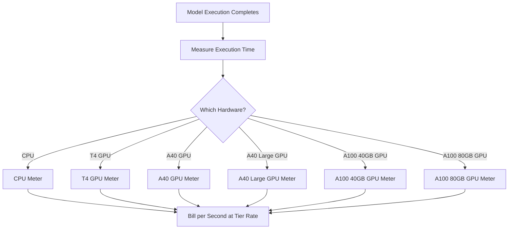

Replicate es una plataforma para ejecutar modelos de aprendizaje automático de código abierto en la nube. Su modelo de facturación es uno de los ejemplos más puros de precios basados en el uso en la industria de IA. No hay cuota mensual ni tarifa fija por ejecución de modelo. En su lugar, facturan la cantidad exacta de tiempo de cómputo consumido, hasta el segundo, con tarifas que varían según el hardware subyacente.

Este enfoque funciona bien para cargas de trabajo de IA porque los tiempos de ejecución son impredecibles. Un único usuario puede ejecutar un modelo ligero durante unos segundos o un modelo generativo masivo durante varios minutos. Al vincular el costo a los recursos de cómputo en lugar del modelo, Replicate mantiene los precios transparentes y escalables.

## Cómo factura Replicate

Los precios de Replicate están desacoplados del modelo específico que se ejecuta. Ya sea que estés generando una imagen con SDXL o ejecutando Llama 3, la facturación se determina por el nivel de hardware y la duración de la ejecución. Esto les permite alojar miles de modelos de código abierto sin necesitar un plan de precios separado para cada uno.

| Hardware | Precio por segundo | Precio por hora |
| :--- | :--- | :--- |
| NVIDIA CPU | \$0.000100 | \$0.36 |
| NVIDIA T4 GPU | \$0.000225 | \$0.81 |
| NVIDIA A40 GPU | \$0.000575 | \$2.07 |
| NVIDIA A40 (Large) GPU | \$0.000725 | \$2.61 |
| NVIDIA A100 (40GB) GPU | \$0.001150 | \$4.14 |
| NVIDIA A100 (80GB) GPU | \$0.001400 | \$5.04 |



1. **Tarifas específicas de hardware**: El costo por segundo varía según los recursos de cómputo requeridos. Cada nivel de hardware tiene un punto de precio diferente.
2. **Modelo puramente basado en el uso**: No hay tarifas mensuales, ni cargos por exceso, ni límites. Los usuarios pagan por el tiempo de cómputo exacto (por ejemplo, "12.4 segundos en un A100") en lugar de por generación.
3. **Granularidad por segundo**: Los proveedores tradicionales cobran por hora o por minuto, lo que genera desperdicio en tareas de corta duración. La facturación por segundo elimina esta ineficiencia tanto para experimentos pequeños como para cargas de producción grandes.

<Info>
Los arranques en frío también se facturan. La primera solicitud a un modelo suele tardar entre 10 y 30 segundos en cargar el modelo en memoria. Este tiempo de carga se factura a la misma tarifa que el tiempo de ejecución.
</Info>
## Qué lo hace único

* **Medición específica por hardware:** El mismo modelo cuesta más en mejor hardware. Los usuarios eligen entre velocidad y costo. Una GPU T4 funciona para tareas que no son sensibles al tiempo, mientras que una A100 maneja aplicaciones en tiempo real.
* **Granularidad por segundo:** La facturación se calcula por segundo, por lo que los usuarios nunca pagan de más por tareas cortas.
* **Sin suscripción:** Sin compromiso para comenzar. Escala infinitamente con el uso, lo que lo hace ideal para startups y desarrolladores que experimentan con diferentes modelos.
* **Agonista de modelos:** La lógica de facturación permanece igual sin importar el tipo de tarea (generación de imágenes, procesamiento de texto, transcripción de audio o síntesis de video). Esto permite que la plataforma soporte un vasto ecosistema de modelos sin tablas de precios complejas.

## Construye esto con Dodo Payments

Puedes replicar este modelo de facturación usando las funciones de facturación basada en el uso de Dodo Payments. La clave es usar múltiples medidores para rastrear diferentes niveles de hardware y adjuntarlos a un único producto.

<Steps>
  <Step title="Create Usage Meters (One Per Hardware Class)">
    Crea medidores separados para cada nivel de hardware. Cada tipo de hardware tiene un costo diferente por segundo, por lo que la medición independiente permite a Dodo establecer precios distintos para cada nivel y brindar facturación detallada.

    | Nombre del medidor | Nombre del evento | Agregación | Propiedad |
    | :--- | :--- | :--- | :--- |
    | CPU Compute | `compute.cpu` | Suma | `execution_seconds` |
    | GPU T4 Compute | `compute.gpu_t4` | Suma | `execution_seconds` |
    | GPU A40 Compute | `compute.gpu_a40` | Suma | `execution_seconds` |
    | GPU A40 Large Compute | `compute.gpu_a40_large` | Suma | `execution_seconds` |
    | GPU A100 40GB Compute | `compute.gpu_a100_40` | Suma | `execution_seconds` |
    | GPU A100 80GB Compute | `compute.gpu_a100_80` | Suma | `execution_seconds` |

    La agregación `Sum` sobre la propiedad `execution_seconds` calcula el tiempo total de cómputo por nivel de hardware durante el período de facturación.
  </Step>

  <Step title="Create a Usage-Based Product">
    Crea un nuevo producto en el panel de control de Dodo Payments:

    * **Tipo de precio:** Facturación basada en el uso
    * **Precio base:** \$0/mes (sin tarifa de suscripción)
    * **Frecuencia de facturación:** Mensual

    Adjunta todos los medidores con su precio por unidad:

    | Medidor | Precio por unidad (por segundo) |
    | :--- | :--- |
    | compute.cpu | \$0.000100 |
    | compute.gpu_t4 | \$0.000225 |
    | compute.gpu_a40 | \$0.000575 |
    | compute.gpu_a40_large | \$0.000725 |
    | compute.gpu_a100_40 | \$0.001150 |
    | compute.gpu_a100_80 | \$0.001400 |

    Establece el **Umbral gratuito** en 0 para todos los medidores. Cada segundo de ejecución se factura.
  </Step>

  <Step title="Send Usage Events">
    Envía eventos de uso a Dodo cada vez que finaliza una ejecución de modelo. Incluye un `event_id` único para cada predicción y garantizar la idempotencia.

    ```typescript
    import DodoPayments from 'dodopayments';

    type HardwareTier = 'cpu' | 'gpu_t4' | 'gpu_a40' | 'gpu_a40_large' | 'gpu_a100_40' | 'gpu_a100_80';

    const client = new DodoPayments({
      bearerToken: process.env.DODO_PAYMENTS_API_KEY,
    });

    async function trackModelExecution(
      customerId: string,
      modelId: string,
      hardware: HardwareTier,
      executionSeconds: number,
      predictionId: string
    ) {
      const eventName = `compute.${hardware}`;

      await client.usageEvents.ingest({
        events: [{
          event_id: `pred_${predictionId}`,
          customer_id: customerId,
          event_name: eventName,
          timestamp: new Date().toISOString(),
          metadata: {
            execution_seconds: executionSeconds,
            model_id: modelId,
            hardware: hardware
          }
        }]
      });
    }

    // Example: SDXL image generation on A100
    await trackModelExecution(
      'cus_abc123',
      'stability-ai/sdxl',
      'gpu_a100_80',
      8.3,  // 8.3 seconds of A100 time
      'pred_xyz789'
    );
    ```

  </Step>

  <Step title="Measure Execution Time Precisely">
    Envuelve tu ejecución de modelo con un cronometraje preciso usando `performance.now()`. Redondea al décimo de segundo más cercano para la facturación.

    ```typescript
    async function runModelWithMetering(
      customerId: string,
      modelId: string,
      hardware: HardwareTier,
      input: Record<string, unknown>
    ) {
      const predictionId = `pred_${Date.now()}`;
      const startTime = performance.now();

      try {
        const result = await executeModel(modelId, input, hardware);
        const executionSeconds = (performance.now() - startTime) / 1000;
        const billedSeconds = Math.round(executionSeconds * 10) / 10;

        await trackModelExecution(
          customerId,
          modelId,
          hardware,
          billedSeconds,
          predictionId
        );

        return result;
      } catch (error) {
        // Still bill for compute time even on failure
        const executionSeconds = (performance.now() - startTime) / 1000;
        if (executionSeconds > 1) {
          await trackModelExecution(
            customerId,
            modelId,
            hardware,
            Math.round(executionSeconds * 10) / 10,
            predictionId
          );
        }
        throw error;
      }
    }
    ```

  </Step>

  <Step title="Create Checkout">
    Cuando un usuario se registra, crea una sesión de pago para el producto basado en el uso. Dodo gestiona automáticamente la facturación y las facturas recurrentes.

    ```typescript
    const session = await client.checkoutSessions.create({
      product_cart: [
        { product_id: 'prod_compute_payg', quantity: 1 }
      ],
      customer: { email: 'ml-engineer@company.com' },
      return_url: 'https://yourplatform.com/dashboard'
    });
    ```

  </Step>
</Steps>
## Acelera con el Blueprint de ingestión por rango de tiempo

El [Blueprint de ingestión por rango de tiempo](/developer-resources/ingestion-blueprints/time-range) simplifica el seguimiento del cómputo por segundo. Crea una instancia de ingestión por cada nivel de hardware y usa `trackTimeRange` para una presentación de eventos más limpia.

```bash
npm install @dodopayments/ingestion-blueprints
```

```typescript
import { Ingestion, trackTimeRange } from '@dodopayments/ingestion-blueprints';

// Create one ingestion instance per hardware tier
function createHardwareIngestion(hardware: string) {
  return new Ingestion({
    apiKey: process.env.DODO_PAYMENTS_API_KEY,
    environment: 'live_mode',
    eventName: `compute.${hardware}`,
  });
}

const ingestions: Record<string, Ingestion> = {
  cpu: createHardwareIngestion('cpu'),
  gpu_t4: createHardwareIngestion('gpu_t4'),
  gpu_a40: createHardwareIngestion('gpu_a40'),
  gpu_a40_large: createHardwareIngestion('gpu_a40_large'),
  gpu_a100_40: createHardwareIngestion('gpu_a100_40'),
  gpu_a100_80: createHardwareIngestion('gpu_a100_80'),
};

// Track execution after a model run completes
const startTime = performance.now();
const result = await executeModel(modelId, input, hardware);
const durationMs = performance.now() - startTime;

await trackTimeRange(ingestions[hardware], {
  customerId: customerId,
  durationMs: durationMs,
  metadata: {
    model_id: modelId,
    hardware: hardware,
  },
});
```

El blueprint maneja el formato de duración y la construcción de eventos. Combinado con instancias de ingestión por hardware, este patrón se ajusta limpiamente al multimedidor de Replicate.

<Tip>
Para trabajos de larga ejecución, combina el Blueprint de rango de tiempo con el seguimiento de latidos por intervalos. Consulta la [documentación completa del blueprint](/developer-resources/ingestion-blueprints/time-range) para patrones avanzados.
</Tip>
## Estimación de costos para usuarios

Dado que la facturación basada en el uso puede ser impredecible, proporciona a los usuarios estimaciones de costos antes de que ejecuten un modelo. Esto reduce las facturas sorpresas y genera confianza.

### Ejemplos de cálculos de costos

| Modelo | Hardware | Tiempo promedio | Costo por ejecución |
| :--- | :--- | :--- | :--- |
| SDXL (imagen) | A100 80GB | ~8 seg | ~\$0.0112 |
| Llama 3 (texto) | A100 40GB | ~3 seg | ~\$0.0035 |
| Whisper (audio) | GPU T4 | ~15 seg | ~\$0.0034 |

### Construcción de un calculador de costos

```typescript
function estimateCost(hardware: HardwareTier, estimatedSeconds: number): number {
  const rates: Record<HardwareTier, number> = {
    'cpu': 0.000100,
    'gpu_t4': 0.000225,
    'gpu_a40': 0.000575,
    'gpu_a40_large': 0.000725,
    'gpu_a100_40': 0.001150,
    'gpu_a100_80': 0.001400
  };

  return Number((rates[hardware] * estimatedSeconds).toFixed(4));
}

// Show the user before running: "This will cost approximately $0.0098"
const estimate = estimateCost('gpu_a100_80', 8.5);
```

## Empresas: Capacidad reservada

Para clientes empresariales que necesitan disponibilidad garantizada y sin arranques en frío, Replicate ofrece "Instancias privadas" a una tarifa fija por hora.

Con Dodo Payments, modela esto como un producto de suscripción:

* **Tipo de producto:** Suscripción
* **Precio:** Precio mensual fijo (por ejemplo, "Instancia A100 reservada - \$500/mes")
* **Ciclo de facturación:** Mensual

Aún puedes enviar eventos de uso para monitoreo y análisis, pero la suscripción cubre el costo. A medida que aumenta el volumen de un usuario, pasar de pago por uso a capacidad reservada suele resultar más rentable.

## Avanzado: Medición por latidos

Para tareas que duran varios minutos u horas, enviar un único evento al final es arriesgado. Si el proceso falla, se pierde el dato de uso. Un enfoque mejor es enviar eventos de uso cada 30-60 segundos durante la ejecución.

```typescript
async function runLongTaskWithHeartbeat(
  customerId: string,
  modelId: string,
  hardware: HardwareTier
) {
  const predictionId = `pred_${Date.now()}`;
  let totalSeconds = 0;

  const heartbeatInterval = setInterval(async () => {
    try {
      await trackModelExecution(
        customerId,
        modelId,
        hardware,
        30,
        `${predictionId}_${totalSeconds}`
      );
      totalSeconds += 30;
    } catch (error) {
      console.error('Heartbeat tracking failed:', error, { predictionId, totalSeconds });
    }
  }, 30000);

  try {
    await executeLongTask();
  } finally {
    clearInterval(heartbeatInterval);
  }
}
```

## Características clave de Dodo utilizadas

<CardGroup cols={2}>
  <Card title="Usage-Based Billing" icon="chart-line" href="/features/usage-based-billing/introduction">
    Configura productos que facturan según el consumo.
  </Card>
  <Card title="Meters" icon="gauge" href="/features/usage-based-billing/meters">
    Define las métricas que deseas rastrear y facturar.
  </Card>
  <Card title="Event Ingestion" icon="bolt" href="/features/usage-based-billing/event-ingestion">
    Envía datos de uso a Dodo en tiempo real.
  </Card>
  <Card title="Subscriptions" icon="calendar" href="/features/subscription">
    Gestiona la facturación recurrente para la capacidad reservada y los planes empresariales.
  </Card>
  <Card title="Time Range Blueprint" icon="clock" href="/developer-resources/ingestion-blueprints/time-range">
    Seguimiento de cómputo por segundo con ayudantes de duración.
  </Card>
</CardGroup>

## Key Dodo Features Used

<CardGroup cols={2}>
  <Card title="Usage-Based Billing" icon="chart-line" href="/features/usage-based-billing/introduction">
    Set up products that bill based on consumption.
  </Card>
  <Card title="Meters" icon="gauge" href="/features/usage-based-billing/meters">
    Define the metrics you want to track and bill for.
  </Card>
  <Card title="Event Ingestion" icon="bolt" href="/features/usage-based-billing/event-ingestion">
    Send usage data to Dodo in real-time.
  </Card>
  <Card title="Subscriptions" icon="calendar" href="/features/subscription">
    Manage recurring billing for reserved capacity and enterprise plans.
  </Card>
  <Card title="Time Range Blueprint" icon="clock" href="/developer-resources/ingestion-blueprints/time-range">
    Per-second compute tracking with duration helpers.
  </Card>
</CardGroup>
