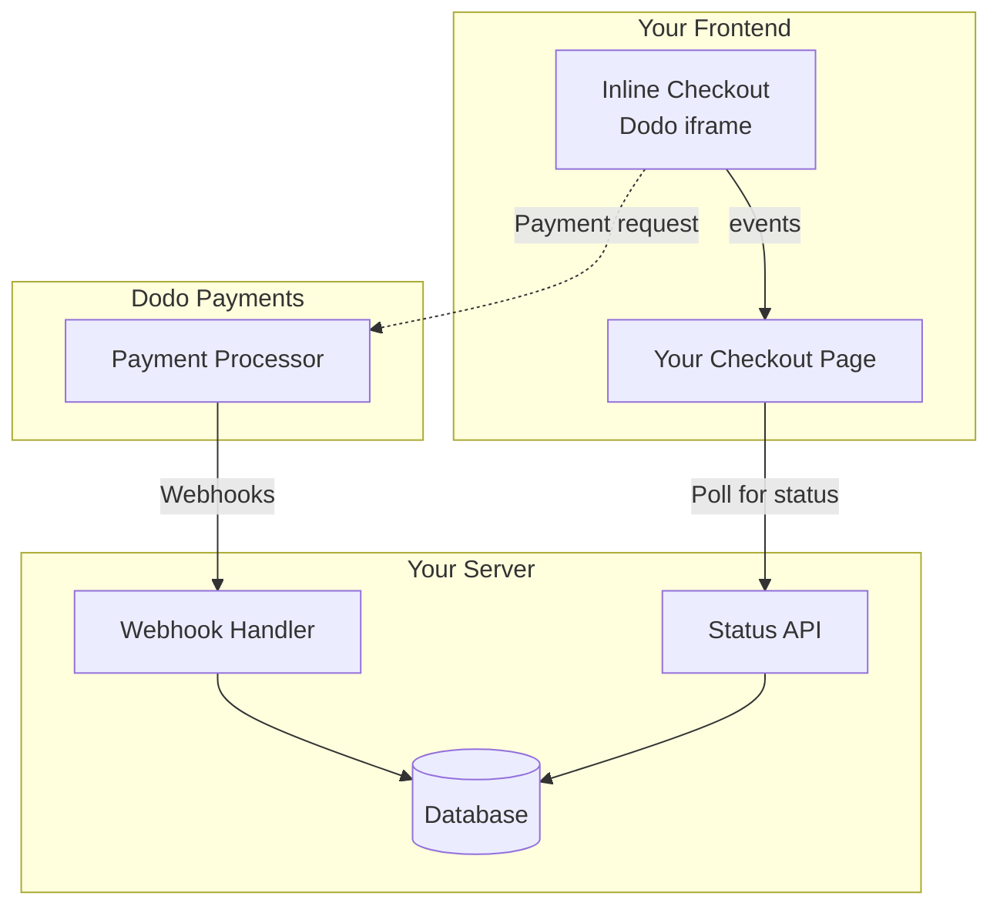

## Descripción general

El pago en línea te permite crear experiencias de pago completamente integradas que se mezclan sin problemas con tu sitio web o aplicación. A diferencia del [pago en superposición](/developer-resources/overlay-checkout), que se abre como un modal sobre tu página, el pago en línea incrusta el formulario de pago directamente en el diseño de tu página.

Usando el pago en línea, puedes:

- Crear experiencias de pago que están completamente integradas con tu aplicación o sitio web
- Permitir que Dodo Payments capture de forma segura la información del cliente y de pago en un marco de pago optimizado
- Mostrar artículos, totales y otra información de Dodo Payments en tu página
- Usar métodos y eventos del SDK para construir experiencias de pago avanzadas

<Frame>
    
</Frame>

## Cómo funciona

El pago en línea funciona incrustando un marco seguro de Dodo Payments en tu sitio web o aplicación.

El marco de pago se encarga de recopilar la información del cliente y capturar los detalles de pago. Tu página muestra la lista de artículos, totales y opciones para cambiar lo que hay en el pago. El SDK permite que tu página y el marco de pago interactúen entre sí.

Dodo Payments crea automáticamente una suscripción cuando se completa un pago, lista para que la provisionen.

<Note>
El marco de pago en línea maneja de forma segura toda la información sensible de pago, asegurando el cumplimiento de PCI sin certificación adicional de tu parte.
</Note>

## ¿Qué hace que un buen pago en línea?

Es importante que los clientes sepan de quién están comprando, qué están comprando y cuánto están pagando.

Para construir un pago en línea que sea conforme y optimizado para la conversión, tu implementación debe incluir:

<Frame caption="Ejemplo de diseño de pago en línea mostrando elementos requeridos">
    
</Frame>

1. **Información recurrente**: Si es recurrente, con qué frecuencia se repite y el total a pagar en la renovación. Si es una prueba, cuánto dura la prueba.
2. **Descripciones de artículos**: Una descripción de lo que se está comprando.
3. **Totales de transacción**: Totales de transacción, incluyendo subtotal, total de impuestos y total general. Asegúrate de incluir también la moneda.
4. **Pie de página de Dodo Payments**: El marco completo de pago en línea, incluyendo el pie de página de pago que tiene información sobre Dodo Payments, nuestros términos de venta y nuestra política de privacidad.
5. **Política de reembolso**: Un enlace a tu política de reembolso, si difiere de la política de reembolso estándar de Dodo Payments.

<Warning>
Siempre muestra el marco completo de pago en línea, incluyendo el pie de página. Eliminar o ocultar información legal viola los requisitos de cumplimiento.
</Warning>

## Viaje del cliente

El flujo de pago está determinado por la configuración de tu sesión de pago. Dependiendo de cómo configures la sesión de pago, los clientes experimentarán un pago que puede presentar toda la información en una sola página o a través de múltiples pasos.

<Steps>
<Step title="El cliente abre el pago">

Puedes abrir el pago en línea pasando artículos o una transacción existente. Usa el SDK para mostrar y actualizar la información en la página, y métodos del SDK para actualizar artículos basados en la interacción del cliente.
    

</Step>

<Step title="El cliente ingresa sus datos">

El pago en línea primero pide a los clientes que ingresen su dirección de correo electrónico, seleccionen su país y (donde sea necesario) ingresen su código postal. Este paso recopila toda la información necesaria para determinar impuestos y opciones de pago disponibles.

Puedes prellenar los detalles del cliente y presentar direcciones guardadas para agilizar la experiencia.

</Step>

<Step title="El cliente selecciona el método de pago">

Después de ingresar sus datos, se presentan a los clientes los métodos de pago disponibles y el formulario de pago. Las opciones pueden incluir tarjeta de crédito o débito, PayPal, Apple Pay, Google Pay y otros métodos de pago locales según su ubicación.

Muestra los métodos de pago guardados si están disponibles para acelerar el pago.


</Step>

<Step title="Pago completado">

Dodo Payments dirige cada pago al mejor adquirente para esa venta para obtener la mejor oportunidad de éxito. Los clientes ingresan a un flujo de éxito que puedes construir.


</Step>

<Step title="Dodo Payments crea la suscripción">

Dodo Payments crea automáticamente una suscripción para el cliente, lista para que la provisionen. El método de pago que utilizó el cliente se guarda para renovaciones o cambios de suscripción.


</Step>
</Steps>

## Inicio Rápido

Comienza con el Pago en Línea de Dodo Payments en solo unas pocas líneas de código:

```typescript
import { DodoPayments } from "dodopayments-checkout";

// Initialize the SDK for inline mode
DodoPayments.Initialize({
  mode: "test",
  displayType: "inline",
  onEvent: (event) => {
    console.log("Checkout event:", event);
  },
});

// Open checkout in a specific container
DodoPayments.Checkout.open({
  checkoutUrl: "https://test.dodopayments.com/session/cks_123",
  elementId: "dodo-inline-checkout" // ID of the container element
});
```

<Tip>
Asegúrate de tener un elemento contenedor con el correspondiente `id` en tu página: `<div id="dodo-inline-checkout"></div>`.
</Tip>

## Guía de Integración Paso a Paso

<Steps>
<Step title="Instalar el SDK">

Instala el SDK de Dodo Payments Checkout:

<CodeGroup>

```bash npm
npm install dodopayments-checkout
```

```bash yarn
yarn add dodopayments-checkout
```

```bash pnpm
pnpm add dodopayments-checkout
```

</CodeGroup>

</Step>

<Step title="Inicializar el SDK para Visualización en Línea">

Inicializa el SDK y especifica `displayType: 'inline'`. También debes escuchar el evento `checkout.breakdown` para actualizar tu UI con cálculos de impuestos y totales en tiempo real.

```typescript
import { DodoPayments } from "dodopayments-checkout";

DodoPayments.Initialize({
  mode: "test",
  displayType: "inline",
  onEvent: (event) => {
    if (event.event_type === "checkout.breakdown") {
      const breakdown = event.data?.message;
      // Update your UI with breakdown.subTotal, breakdown.tax, breakdown.total, etc.
    }
  },
});
```

</Step>

<Step title="Crear un Elemento Contenedor">

Agrega un elemento a tu HTML donde se inyectará el marco de pago:

```html
<div id="dodo-inline-checkout"></div>
```

</Step>

<Step title="Abrir el Pago">

Llama a `DodoPayments.Checkout.open()` con el `checkoutUrl` y el `elementId` de tu contenedor:

```typescript
DodoPayments.Checkout.open({
  checkoutUrl: "https://test.dodopayments.com/session/cks_123",
  elementId: "dodo-inline-checkout"
});
```

</Step>

<Step title="Prueba Tu Integración">

1. Inicia tu servidor de desarrollo:

```bash
npm run dev
```

2. Prueba el flujo de pago:
   - Ingresa tu correo electrónico y detalles de dirección en el marco en línea.
   - Verifica que tu resumen de pedido personalizado se actualice en tiempo real.
   - Prueba el flujo de pago usando credenciales de prueba.
   - Confirma que las redirecciones funcionen correctamente.

<Check>
Deberías ver eventos de `checkout.breakdown` registrados en la consola de tu navegador si agregaste un registro en la función de callback `onEvent`.
</Check>

</Step>

<Step title="Poner en Producción">

Cuando estés listo para producción:

1. Cambia el modo a `'live'`:

```typescript
DodoPayments.Initialize({
  mode: "live",
  displayType: "inline",
  onEvent: (event) => {
    // Handle events
  }
});
```

2. Actualiza tus URLs de pago para usar sesiones de pago en vivo desde tu backend.
3. Prueba el flujo completo en producción.

</Step>
</Steps>

## Ejemplo Completo en React

Este ejemplo demuestra cómo implementar un resumen de pedido personalizado junto con el pago en línea, manteniéndolos sincronizados utilizando el evento `checkout.breakdown`.

```tsx
"use client";

import { useEffect, useState } from 'react';
import { DodoPayments, CheckoutBreakdownData } from 'dodopayments-checkout';

export default function CheckoutPage() {
  const [breakdown, setBreakdown] = useState<Partial<CheckoutBreakdownData>>({});

  useEffect(() => {
    // 1. Initialize the SDK
    DodoPayments.Initialize({
      mode: 'test',
      displayType: 'inline',
      onEvent: (event) => {
        // 2. Listen for the 'checkout.breakdown' event
        if (event.event_type === "checkout.breakdown") {
          const message = event.data?.message as CheckoutBreakdownData;
          if (message) setBreakdown(message);
        }
      }
    });

    // 3. Open the checkout in the specified container
    DodoPayments.Checkout.open({
      checkoutUrl: 'https://test.dodopayments.com/session/cks_123',
      elementId: 'dodo-inline-checkout'
    });

    return () => DodoPayments.Checkout.close();
  }, []);

  const format = (amt: number | null | undefined, curr: string | null | undefined) => 
    amt != null && curr ? `${curr} ${(amt/100).toFixed(2)}` : '0.00';

  const currency = breakdown.currency ?? breakdown.finalTotalCurrency ?? '';

  return (
    <div className="flex flex-col md:flex-row min-h-screen">
      {/* Left Side - Checkout Form */}
      <div className="w-full md:w-1/2 flex items-center">
        <div id="dodo-inline-checkout" className='w-full' />
      </div>

      {/* Right Side - Custom Order Summary */}
      <div className="w-full md:w-1/2 p-8 bg-gray-50">
        <h2 className="text-2xl font-bold mb-4">Order Summary</h2>
        <div className="space-y-2">
          {breakdown.subTotal && (
            <div className="flex justify-between">
              <span>Subtotal</span>
              <span>{format(breakdown.subTotal, currency)}</span>
            </div>
          )}
          {breakdown.discount && (
            <div className="flex justify-between">
              <span>Discount</span>
              <span>{format(breakdown.discount, currency)}</span>
            </div>
          )}
          {breakdown.tax != null && (
            <div className="flex justify-between">
              <span>Tax</span>
              <span>{format(breakdown.tax, currency)}</span>
            </div>
          )}
          <hr />
          {(breakdown.finalTotal ?? breakdown.total) && (
            <div className="flex justify-between font-bold text-xl">
              <span>Total</span>
              <span>{format(breakdown.finalTotal ?? breakdown.total, breakdown.finalTotalCurrency ?? currency)}</span>
            </div>
          )}
        </div>
      </div>
    </div>
  );
}

```

## Referencia de API

### Configuración

#### Opciones de Inicialización

```typescript
interface InitializeOptions {
  mode: "test" | "live";
  displayType: "inline"; // Required for inline checkout
  onEvent: (event: CheckoutEvent) => void;
}
```

| Opción | Tipo | Requerido | Descripción |
|--------|------|----------|-------------|
| `mode` | `"test" \| "live"` | Sí | Modo de entorno. |
| `displayType` | `"inline" \| "overlay"` | Sí | Debe estar configurado en `"inline"` para incrustar el pago. |
| `onEvent` | `function` | Sí | Función de callback para manejar eventos de pago. |

#### Opciones de Pago

```typescript
export type FontSize = "xs" | "sm" | "md" | "lg" | "xl" | "2xl";
export type FontWeight = "normal" | "medium" | "bold" | "extraBold";

interface CheckoutOptions {
  checkoutUrl: string;
  elementId: string; // Required for inline checkout
  options?: {
    showTimer?: boolean;
    showSecurityBadge?: boolean;
    manualRedirect?: boolean;
    themeConfig?: ThemeConfig;
    payButtonText?: string;
    fontSize?: FontSize;
    fontWeight?: FontWeight;
  };
}
```

| Opción | Tipo | Requerido | Descripción |
|--------|------|----------|-------------|
| `checkoutUrl` | `string` | Sí | URL de la sesión de pago. |
| `elementId` | `string` | Sí | El `id` del elemento DOM donde se debe renderizar el pago. |
| `options.showTimer` | `boolean` | No | Mostrar u ocultar el temporizador de pago. Por defecto es `true`. Cuando está deshabilitado, recibirás el evento `checkout.link_expired` cuando la sesión expire. |
| `options.showSecurityBadge` | `boolean` | No | Mostrar u ocultar la insignia de seguridad. Por defecto es `true`. |
| `options.manualRedirect` | `boolean` | No | Cuando está habilitado, el pago no redirigirá automáticamente después de completarse. En su lugar, recibirás eventos de `checkout.status` y `checkout.redirect_requested` para manejar la redirección tú mismo. |
| `options.themeConfig` | `ThemeConfig` | No | Configuración de tema personalizada. |
| `options.payButtonText` | `string` | No | Texto personalizado para mostrar en el botón de pago. |
| `options.fontSize` | `FontSize` | No | Tamaño de fuente global para el pago. |
| `options.fontWeight` | `FontWeight` | No | Peso de fuente global para el pago. |

### Métodos

#### Abrir Pago

Abre el marco de pago en el contenedor especificado.

```typescript
DodoPayments.Checkout.open({
  checkoutUrl: "https://test.dodopayments.com/session/cks_123",
  elementId: "dodo-inline-checkout"
});
```

También puedes pasar opciones adicionales para personalizar el comportamiento del pago:

```typescript
DodoPayments.Checkout.open({
  checkoutUrl: "https://test.dodopayments.com/session/cks_123",
  elementId: "dodo-inline-checkout",
  options: {
    showTimer: false,
    showSecurityBadge: false,
    manualRedirect: true,
    payButtonText: "Pay Now",
  },
});
```

Al usar `manualRedirect`, maneja la finalización del pago en tu función de callback `onEvent`:

```typescript
DodoPayments.Initialize({
  mode: "test",
  displayType: "inline",
  onEvent: (event) => {
    if (event.event_type === "checkout.status") {
      const status = event.data?.message?.status;
      // Handle status: "succeeded", "failed", or "processing"
    }
    if (event.event_type === "checkout.redirect_requested") {
      const redirectUrl = event.data?.message?.redirect_to;
      // Redirect the customer manually
      window.location.href = redirectUrl;
    }
    if (event.event_type === "checkout.link_expired") {
      // Handle expired checkout session
    }
  },
});
```

#### Cerrar Pago

Elimina programáticamente el marco de pago y limpia los oyentes de eventos.

```typescript
DodoPayments.Checkout.close();
```

#### Verificar Estado

Devuelve si el marco de pago está actualmente inyectado.

```typescript
const isOpen = DodoPayments.Checkout.isOpen();
// Returns: boolean
```

### Eventos

El SDK proporciona eventos en tiempo real a través de la función de callback `onEvent`. Para el pago en línea, el evento `checkout.breakdown` es particularmente útil para sincronizar tu UI.

| Tipo de Evento | Descripción |
|----------------|-------------|
| `checkout.opened` | El marco de pago ha sido cargado. |
| `checkout.breakdown` | Se activa cuando se actualizan precios, impuestos o descuentos. |
| `checkout.customer_details_submitted` | Se han enviado los detalles del cliente. |
| `checkout.pay_button_clicked` | Se activa cuando el cliente hace clic en el botón de pago. Útil para análisis y seguimiento de embudos de conversión. |
| `checkout.redirect` | El pago realizará una redirección (por ejemplo, a una página bancaria). |
| `checkout.error` | Ocurrió un error durante el pago. |
| `checkout.link_expired` | Se activa cuando la sesión de pago expira. Solo se recibe cuando `showTimer` está configurado en `false`. |
| `checkout.status` | Se activa cuando `manualRedirect` está habilitado. Contiene el estado del pago (`succeeded`, `failed`, o `processing`). |
| `checkout.redirect_requested` | Se activa cuando `manualRedirect` está habilitado. Contiene la URL a la que redirigir al cliente. |

#### Datos de Desglose del Pago

El evento `checkout.breakdown` proporciona los siguientes datos:

```typescript
interface CheckoutBreakdownData {
  subTotal?: number;          // Amount in cents
  discount?: number;         // Amount in cents
  tax?: number;              // Amount in cents
  total?: number;            // Amount in cents
  currency?: string;         // e.g., "USD"
  finalTotal?: number;       // Final amount including adjustments
  finalTotalCurrency?: string; // Currency for the final total
}
```

#### Datos del Evento de Estado del Pago

Cuando `manualRedirect` está habilitado, recibes el evento `checkout.status` con los siguientes datos:

```typescript
interface CheckoutStatusEventData {
  message: {
    status?: "succeeded" | "failed" | "processing";
  };
}
```

#### Datos del Evento de Redirección del Pago Solicitada

Cuando `manualRedirect` está habilitado, recibes el evento `checkout.redirect_requested` con los siguientes datos:

```typescript
interface CheckoutRedirectRequestedEventData {
  message: {
    redirect_to?: string;
  };
}
```

#### Entendiendo el Evento de Desglose

El evento `checkout.breakdown` es la forma principal de mantener la UI de tu aplicación sincronizada con el estado del pago de Dodo Payments.

**Cuándo se activa:**
- **En la inicialización**: Inmediatamente después de que el marco de pago se carga y está listo.
- **En el cambio de dirección**: Cada vez que el cliente selecciona un país o ingresa un código postal que resulta en un recálculo de impuestos.

**Detalles del Campo:**

| Campo | Descripción |
|-------|-------------|
| `subTotal` | La suma de todos los artículos en la sesión antes de que se apliquen descuentos o impuestos. |
| `discount` | El valor total de todos los descuentos aplicados. |
| `tax` | El monto del impuesto calculado. En modo `inline`, esto se actualiza dinámicamente a medida que el usuario interactúa con los campos de dirección. |
| `total` | El resultado matemático de `subTotal - discount + tax` en la moneda base de la sesión. |
| `currency` | El código de moneda ISO (por ejemplo, `"USD"`) para los valores estándar de subtotal, descuento e impuesto. |
| `finalTotal` | La cantidad real que se cobra al cliente. Esto puede incluir ajustes adicionales de cambio de divisas o tarifas de métodos de pago locales que no son parte del desglose de precios básico. |
| `finalTotalCurrency` | La moneda en la que el cliente está pagando realmente. Esto puede diferir de `currency` si la paridad del poder adquisitivo o la conversión de moneda local están activas. |

**Consejos Clave de Integración:**

1.  **Formato de Moneda**: Los precios siempre se devuelven como enteros en la unidad de moneda más pequeña (por ejemplo, centavos para USD, yenes para JPY). Para mostrarlos, divide por 100 (o la potencia de 10 apropiada) o usa una biblioteca de formato como `Intl.NumberFormat`.
2.  **Manejo de Estados Iniciales**: Cuando el pago se carga por primera vez, `tax` y `discount` pueden ser `0` o `null` hasta que el usuario proporcione su información de facturación o aplique un código. Tu UI debe manejar estos estados de manera adecuada (por ejemplo, mostrando un guion `—` o ocultando la fila).
3.  **El "Total Final" vs "Total"**: Mientras que `total` te da el cálculo de precio estándar, `finalTotal` es la fuente de verdad para la transacción. Si `finalTotal` está presente, refleja exactamente lo que se cobrará a la tarjeta del cliente, incluidos cualquier ajuste dinámico.
4.  **Retroalimentación en Tiempo Real**: Usa el campo `tax` para mostrar a los usuarios que los impuestos se están calculando en tiempo real. Esto proporciona una sensación de "en vivo" a tu página de pago y reduce la fricción durante el paso de entrada de dirección.

## Opciones de Implementación

### Instalación a través de Gestores de Paquetes

Instala a través de npm, yarn o pnpm como se muestra en la [Guía de Integración Paso a Paso](#step-by-step-integration-guide).

### Implementación CDN

Para una integración rápida sin un paso de construcción, puedes usar nuestro CDN:

```html
<!DOCTYPE html>
<html lang="en">
<head>
    <meta charset="UTF-8">
    <meta name="viewport" content="width=device-width, initial-scale=1.0">
    <title>Dodo Payments Inline Checkout</title>
    
    <!-- Load DodoPayments -->
    <script src="https://cdn.jsdelivr.net/npm/dodopayments-checkout@latest/dist/index.js"></script>
    <script>
        // Initialize the SDK
        DodoPaymentsCheckout.DodoPayments.Initialize({
            mode: "test",
            displayType: "inline",
            onEvent: (event) => {
                console.log('Checkout event:', event);
            }
        });
    </script>
</head>
<body>
    <div id="dodo-inline-checkout"></div>

    <script>
        // Open the checkout
        DodoPaymentsCheckout.DodoPayments.Checkout.open({
            checkoutUrl: "https://test.dodopayments.com/session/cks_123",
            elementId: "dodo-inline-checkout"
        });
    </script>
</body>
</html>
```

### Personalización del Tema

Puedes personalizar la apariencia del pago pasando un objeto `themeConfig` en el parámetro `options` al abrir el pago. La configuración del tema admite modos claro y oscuro, lo que te permite personalizar colores, bordes, texto, botones y radio de borde.

#### Configuración Básica del Tema

```typescript
DodoPayments.Checkout.open({
  checkoutUrl: "https://checkout.dodopayments.com/session/cks_123",
  options: {
    themeConfig: {
      light: {
        bgPrimary: "#FFFFFF",
        textPrimary: "#344054",
        buttonPrimary: "#A6E500",
      },
      dark: {
        bgPrimary: "#0D0D0D",
        textPrimary: "#FFFFFF",
        buttonPrimary: "#A6E500",
      },
      radius: "8px",
    },
  },
});
```

#### Configuración Completa del Tema

Todas las propiedades del tema disponibles:

```typescript
DodoPayments.Checkout.open({
  checkoutUrl: "https://checkout.dodopayments.com/session/cks_123",
  options: {
    themeConfig: {
      light: {
        // Background colors
        bgPrimary: "#FFFFFF",        // Primary background color
        bgSecondary: "#F9FAFB",      // Secondary background color (e.g., tabs)
        
        // Border colors
        borderPrimary: "#D0D5DD",     // Primary border color
        borderSecondary: "#6B7280",  // Secondary border color
        inputFocusBorder: "#D0D5DD", // Input focus border color
        
        // Text colors
        textPrimary: "#344054",       // Primary text color
        textSecondary: "#6B7280",    // Secondary text color
        textPlaceholder: "#667085",  // Placeholder text color
        textError: "#D92D20",        // Error text color
        textSuccess: "#10B981",      // Success text color
        
        // Button colors
        buttonPrimary: "#A6E500",           // Primary button background
        buttonPrimaryHover: "#8CC500",      // Primary button hover state
        buttonTextPrimary: "#0D0D0D",       // Primary button text color
        buttonSecondary: "#F3F4F6",         // Secondary button background
        buttonSecondaryHover: "#E5E7EB",     // Secondary button hover state
        buttonTextSecondary: "#344054",     // Secondary button text color
      },
      dark: {
        // Background colors
        bgPrimary: "#0D0D0D",
        bgSecondary: "#1A1A1A",
        
        // Border colors
        borderPrimary: "#323232",
        borderSecondary: "#D1D5DB",
        inputFocusBorder: "#323232",
        
        // Text colors
        textPrimary: "#FFFFFF",
        textSecondary: "#909090",
        textPlaceholder: "#9CA3AF",
        textError: "#F97066",
        textSuccess: "#34D399",
        
        // Button colors
        buttonPrimary: "#A6E500",
        buttonPrimaryHover: "#8CC500",
        buttonTextPrimary: "#0D0D0D",
        buttonSecondary: "#2A2A2A",
        buttonSecondaryHover: "#3A3A3A",
        buttonTextSecondary: "#FFFFFF",
      },
      radius: "8px", // Border radius for inputs, buttons, and tabs
    },
  },
});
```

#### Solo Modo Claro

Si solo deseas personalizar el tema claro:

```typescript
DodoPayments.Checkout.open({
  checkoutUrl: "https://checkout.dodopayments.com/session/cks_123",
  options: {
    themeConfig: {
      light: {
        bgPrimary: "#FFFFFF",
        textPrimary: "#000000",
        buttonPrimary: "#0070F3",
      },
      radius: "12px",
    },
  },
});
```

#### Solo Modo Oscuro

Si solo deseas personalizar el tema oscuro:

```typescript
DodoPayments.Checkout.open({
  checkoutUrl: "https://checkout.dodopayments.com/session/cks_123",
  options: {
    themeConfig: {
      dark: {
        bgPrimary: "#000000",
        textPrimary: "#FFFFFF",
        buttonPrimary: "#0070F3",
      },
      radius: "12px",
    },
  },
});
```

#### Sobrescritura Parcial del Tema

Puedes sobrescribir solo propiedades específicas. El checkout usará valores predeterminados para las propiedades que no especifiques:

```typescript
DodoPayments.Checkout.open({
  checkoutUrl: "https://checkout.dodopayments.com/session/cks_123",
  options: {
    themeConfig: {
      light: {
        buttonPrimary: "#FF6B6B", // Only override primary button color
      },
      radius: "16px", // Override border radius
    },
  },
});
```

#### Configuración del Tema con Otras Opciones

Puedes combinar la configuración del tema con otras opciones de checkout:

```typescript
DodoPayments.Checkout.open({
  checkoutUrl: "https://checkout.dodopayments.com/session/cks_123",
  options: {
    showTimer: true,
    showSecurityBadge: true,
    manualRedirect: false,
    themeConfig: {
      light: {
        bgPrimary: "#FFFFFF",
        buttonPrimary: "#A6E500",
      },
      dark: {
        bgPrimary: "#0D0D0D",
        buttonPrimary: "#A6E500",
      },
      radius: "8px",
    },
  },
});
```

#### Tipos de TypeScript

Para usuarios de TypeScript, todos los tipos de configuración del tema están exportados:

```typescript
import { ThemeConfig, ThemeModeConfig } from "dodopayments-checkout";

const themeConfig: ThemeConfig = {
  light: {
    bgPrimary: "#FFFFFF",
    // ... other properties
  },
  dark: {
    bgPrimary: "#0D0D0D",
    // ... other properties
  },
  radius: "8px",
};
```

## Manejo de Errores

El SDK proporciona información detallada sobre errores a través del sistema de eventos. Siempre implementa un manejo de errores adecuado en tu función de callback `onEvent`:

```typescript
DodoPayments.Initialize({
  mode: "test",
  displayType: "inline",
  onEvent: (event: CheckoutEvent) => {
    if (event.event_type === "checkout.error") {
      console.error("Checkout error:", event.data?.message);
      // Handle error appropriately
    }
  }
});
```

<Warning>
Siempre maneja el evento `checkout.error` para proporcionar una buena experiencia de usuario cuando ocurren problemas.
</Warning>

## Mejores Prácticas

1. **Diseño Responsivo**: Asegúrate de que tu elemento contenedor tenga suficiente ancho y alto. El iframe generalmente se expandirá para llenar su contenedor.
2. **Sincronización**: Usa el evento `checkout.breakdown` para mantener tu resumen de pedido personalizado o tablas de precios sincronizadas con lo que el usuario ve en el marco de pago.
3. **Estados de Carga**: Muestra un indicador de carga en tu contenedor hasta que se active el evento `checkout.opened`.
4. **Limpieza**: Llama a `DodoPayments.Checkout.close()` cuando tu componente se desmonte para limpiar el iframe y los oyentes de eventos.

<Info>
Para implementaciones en modo oscuro, se recomienda usar `#0d0d0d` como color de fondo para una integración visual óptima con el marco de pago en línea.
</Info>

## Validación del Estado de Pago

<Warning>
No confíes únicamente en los eventos de pago en línea para determinar el éxito o fracaso del pago. Siempre implementa validación del lado del servidor utilizando webhooks y/o polling.
</Warning>

### Por qué la Validación del Lado del Servidor es Esencial

Mientras que los eventos de pago en línea como `checkout.status` proporcionan retroalimentación en tiempo real, **no** deben ser tu única fuente de verdad para el estado del pago. Problemas de red, fallos del navegador o usuarios que cierran la página pueden causar que se pierdan eventos. Para asegurar una validación de pago confiable:

1. **Tu servidor debe escuchar eventos de webhook** - Dodo Payments envía webhooks para cambios en el estado del pago.
2. **Implementa un mecanismo de polling** - Tu frontend debe hacer polling a tu servidor para actualizaciones de estado.
3. **Combina ambos enfoques** - Usa webhooks como la fuente principal y polling como respaldo.

### Arquitectura Recomendada



### Pasos de Implementación

**1. Escucha eventos de pago** - Cuando el usuario hace clic en pagar, comienza a prepararte para verificar el estado:

```typescript
onEvent: (event) => {
  if (event.event_type === 'checkout.status') {
    // Start polling your server for confirmed status
    startPolling();
  }
}
```

**2. Haz polling a tu servidor** - Crea un endpoint que verifique tu base de datos para el estado del pago (actualizado por webhooks):

```typescript
// Poll every 2 seconds until status is confirmed
const interval = setInterval(async () => {
  const { status } = await fetch(`/api/payments/${paymentId}/status`).then(r => r.json());
  if (status === 'succeeded' || status === 'failed') {
    clearInterval(interval);
    handlePaymentResult(status);
  }
}, 2000);
```

**3. Maneja webhooks del lado del servidor** - Actualiza tu base de datos cuando Dodo envíe webhooks de `payment.succeeded` o `payment.failed`. Consulta nuestra [documentación de Webhooks](/developer-resources/webhooks) para más detalles.

### Manejo de Redirecciones (3DS, Google Pay, UPI)

Al usar `manualRedirect: true`, ciertos métodos de pago requieren redirigir al usuario fuera de tu página para autenticación:

- **3D Secure (3DS)** - Autenticación de tarjeta
- **Google Pay** - Autenticación de billetera en algunos flujos
- **UPI** - Redirecciones de método de pago indio

Cuando se requiere una redirección, recibirás el evento `checkout.redirect_requested`. Redirige al usuario a la URL proporcionada:

```typescript
if (event.event_type === 'checkout.redirect_requested') {
  const redirectUrl = event.data?.message?.redirect_to;
  // Save payment ID before redirect, then redirect
  sessionStorage.setItem('pendingPaymentId', paymentId);
  window.location.href = redirectUrl;
}
```

Después de que se complete la autenticación (éxito o fracaso), el usuario regresa a tu página. **No asumas éxito solo porque el usuario regresó.** En su lugar:

1. Verifica si el usuario está regresando de una redirección (por ejemplo, a través de `sessionStorage`)
2. Comienza a hacer polling a tu servidor para el estado de pago confirmado
3. Muestra un estado de "Verificando pago..." mientras haces polling
4. Muestra la UI de éxito/fracaso basada en el estado confirmado por el servidor

<Tip>
Siempre verifica el estado del pago del lado del servidor después de las redirecciones. El regreso del usuario a tu página solo significa que la autenticación se completó; no indica si el pago tuvo éxito o falló.
</Tip>

## Solución de Problemas

<AccordionGroup>
<Accordion title="El marco de pago no aparece">
- Verifica que `elementId` coincida con el `id` de un `div` que realmente existe en el DOM.
- Asegúrate de que `displayType: 'inline'` se haya pasado a `Initialize`.
- Verifica que el `checkoutUrl` sea válido.
</Accordion>

<Accordion title="Los impuestos no se actualizan en mi UI">
- Asegúrate de que estás escuchando el evento `checkout.breakdown`.
- Los impuestos solo se calculan después de que el usuario ingresa un país y un código postal válidos en el marco de pago.
</Accordion>
</AccordionGroup>

## Habilitando Apple Pay

Apple Pay permite a los clientes completar pagos de manera rápida y segura utilizando sus métodos de pago guardados. Cuando está habilitado, los clientes pueden lanzar el modal de Apple Pay directamente desde la superposición de pago en dispositivos compatibles.

<Info>
Apple Pay es compatible con iOS 17+, iPadOS 17+ y Safari 17+ en macOS.
</Info>

Para habilitar Apple Pay para tu dominio en producción, sigue estos pasos:

<Steps>
<Step title="Descargar y subir el archivo de asociación de dominio de Apple Pay">

Descarga el [archivo de asociación de dominio de Apple Pay](http://checkout.dodopayments.com/.well-known/apple-developer-merchantid-domain-association).

Sube el archivo a tu servidor web en `/.well-known/apple-developer-merchantid-domain-association`. Por ejemplo, si tu sitio web es `example.com`, haz que el archivo esté disponible en `https://example.com/well-known/apple-developer-merchantid-domain-association`.

</Step>

<Step title="Solicitar activación de Apple Pay">

Envía un correo electrónico a **support@dodopayments.com** con la siguiente información:

- La URL de tu dominio de producción (por ejemplo, `https://example.com`)
- Solicitud para habilitar Apple Pay para tu dominio

<Check>
Recibirás confirmación dentro de 1-2 días hábiles una vez que Apple Pay haya sido habilitado para tu dominio.
</Check>

</Step>

<Step title="Verificar disponibilidad de Apple Pay">

Después de recibir la confirmación, prueba Apple Pay en tu pago:

1. Abre tu pago en un dispositivo compatible (iOS 17+, iPadOS 17+ o Safari 17+ en macOS)
2. Verifica que el botón de Apple Pay aparezca como una opción de pago
3. Prueba el flujo completo de pago

</Step>
</Steps>

<Warning>
Apple Pay debe estar habilitado para tu dominio antes de que aparezca como una opción de pago en producción. Contacta al soporte antes de ir en vivo si planeas ofrecer Apple Pay.
</Warning>

## Soporte de Navegadores

El SDK de Dodo Payments Checkout es compatible con los siguientes navegadores:

- Chrome (última versión)
- Firefox (última versión)
- Safari (última versión)
- Edge (última versión)
- IE11+

## Pago en Línea vs Pago en Superposición

Elige el tipo de pago adecuado para tu caso de uso:

| Característica | Pago en Línea | Pago en Superposición |
|----------------|-----------------|------------------|
| Profundidad de integración | Totalmente incrustado en la página | Modal sobre la página |
| Control de diseño | Control total | Limitado |
| Marca | Sin costuras | Separado de la página |
| Esfuerzo de implementación | Mayor | Menor |
| Mejor para | Páginas de pago personalizadas, flujos de alta conversión | Integración rápida, páginas existentes |

<Tip>
Usa **pago en línea** cuando desees el máximo control sobre la experiencia de pago y una marca sin costuras. Usa **pago en superposición** para una integración más rápida con cambios mínimos en tus páginas existentes.
</Tip>

## Recursos Relacionados

<CardGroup cols={2}>
<Card title="Pago en Superposición" icon="layer-group" href="/developer-resources/overlay-checkout">
    Usa el pago en superposición para una integración rápida basada en modal.
</Card>

<Card title="API de Sesiones de Pago" icon="code" href="/api-reference/checkout-sessions/create">
    Crea sesiones de pago para potenciar tus experiencias de pago.
</Card>

<Card title="Webhooks" icon="webhook" href="/developer-resources/webhooks">
    Maneja eventos de pago del lado del servidor con webhooks.
</Card>

<Card title="Guía de Integración" icon="book" href="/developer-resources/integration-guide">
    Guía completa para integrar Dodo Payments.
</Card>
</CardGroup>

Para más ayuda, visita nuestra [comunidad de Discord](https://discord.gg/bYqAp4ayYh) o contacta a nuestro equipo de soporte para desarrolladores.
