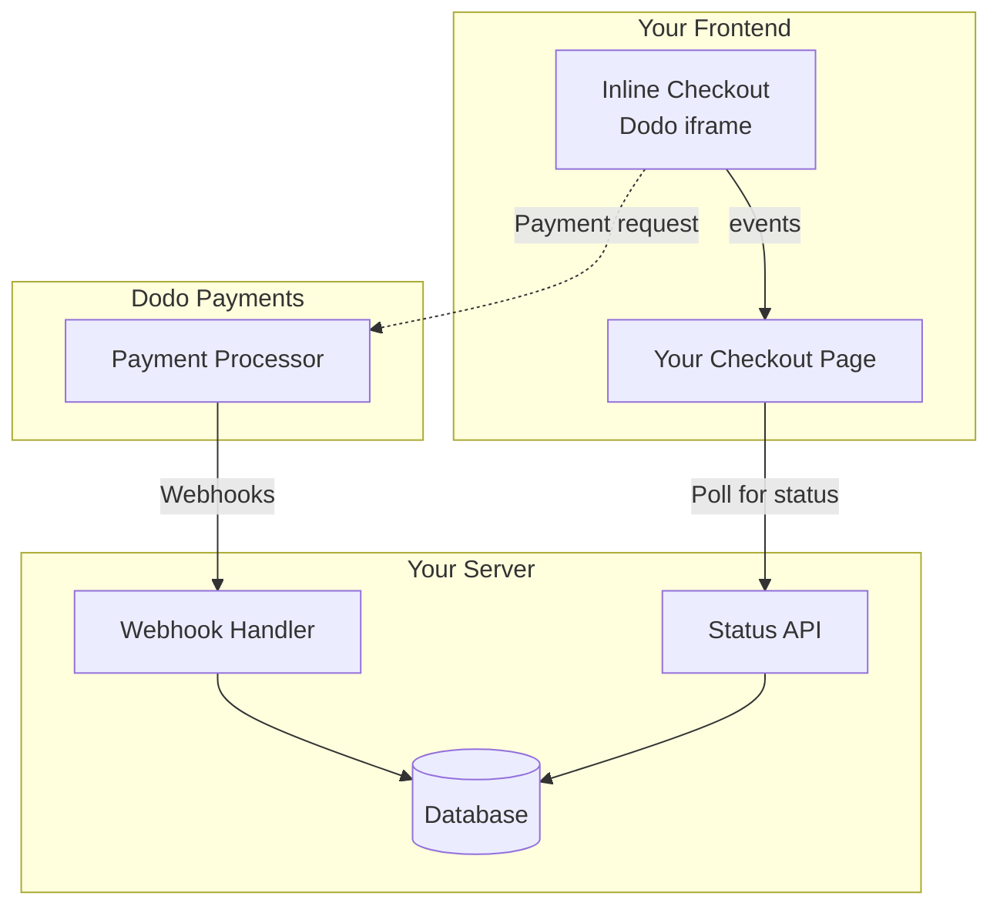

## Descripción general

El pago en línea te permite crear experiencias de pago completamente integradas que se mezclan sin problemas con tu sitio web o aplicación. A diferencia del [pago en superposición](/developer-resources/overlay-checkout), que se abre como un modal sobre tu página, el pago en línea incrusta el formulario de pago directamente en el diseño de tu página.

Usando el pago en línea, puedes:

- Crear experiencias de pago que están completamente integradas con tu aplicación o sitio web
- Permitir que Dodo Payments capture de forma segura la información del cliente y de pago en un marco de pago optimizado
- Mostrar artículos, totales y otra información de Dodo Payments en tu página
- Usar métodos y eventos del SDK para construir experiencias de pago avanzadas

<Frame>
    
</Frame>

## Cómo funciona

El pago en línea funciona incrustando un marco seguro de Dodo Payments en tu sitio web o aplicación.

El marco de pago se encarga de recopilar la información del cliente y capturar los detalles de pago. Tu página muestra la lista de artículos, totales y opciones para cambiar lo que hay en el pago. El SDK permite que tu página y el marco de pago interactúen entre sí.

Dodo Payments crea automáticamente una suscripción cuando se completa un pago, lista para que la provisionen.

<Note>
El marco de inline checkout gestiona de forma segura toda la información de pago sensible, garantizando el cumplimiento de PCI sin que necesites certificación adicional.
</Note>

## ¿Qué hace que un buen pago en línea?

Es importante que los clientes sepan de quién están comprando, qué están comprando y cuánto están pagando.

Para construir un pago en línea que sea conforme y optimizado para la conversión, tu implementación debe incluir:

<Frame caption="Example inline checkout layout showing required elements">
    
</Frame>

1. **Información recurrente**: Si es recurrente, con qué frecuencia se repite y el total a pagar en la renovación. Si es una prueba, cuánto dura la prueba.
2. **Descripciones de artículos**: Una descripción de lo que se está comprando.
3. **Totales de transacción**: Totales de transacción, incluyendo subtotal, total de impuestos y total general. Asegúrate de incluir también la moneda.
4. **Pie de página de Dodo Payments**: El marco completo de pago en línea, incluyendo el pie de página de pago que tiene información sobre Dodo Payments, nuestros términos de venta y nuestra política de privacidad.
5. **Política de reembolso**: Un enlace a tu política de reembolso, si difiere de la política de reembolso estándar de Dodo Payments.

<Warning>
Siempre muestra el marco completo de inline checkout, incluido el pie de página. Eliminar u ocultar la información legal incumple los requisitos de conformidad.
</Warning>

## Viaje del cliente

El flujo de pago está determinado por la configuración de tu sesión de pago. Dependiendo de cómo configures la sesión de pago, los clientes experimentarán un pago que puede presentar toda la información en una sola página o a través de múltiples pasos.

<Steps>
<Step title="Customer opens checkout">

Puedes abrir el pago en línea pasando artículos o una transacción existente. Usa el SDK para mostrar y actualizar la información en la página, y métodos del SDK para actualizar artículos basados en la interacción del cliente.
    

</Step>

<Step title="Customer enters their details">

El pago en línea primero pide a los clientes que ingresen su dirección de correo electrónico, seleccionen su país y (donde sea necesario) ingresen su código postal. Este paso recopila toda la información necesaria para determinar impuestos y opciones de pago disponibles.

Puedes prellenar los detalles del cliente y presentar direcciones guardadas para agilizar la experiencia.

</Step>

<Step title="Customer selects payment method">

Después de ingresar sus datos, se presentan a los clientes los métodos de pago disponibles y el formulario de pago. Las opciones pueden incluir tarjeta de crédito o débito, PayPal, Apple Pay, Google Pay y otros métodos de pago locales según su ubicación.

Muestra los métodos de pago guardados si están disponibles para acelerar el pago.


</Step>

<Step title="Checkout completed">

Dodo Payments dirige cada pago al mejor adquirente para esa venta para obtener la mejor oportunidad de éxito. Los clientes ingresan a un flujo de éxito que puedes construir.


</Step>

<Step title="Dodo Payments creates subscription">

Dodo Payments crea automáticamente una suscripción para el cliente, lista para que la provisionen. El método de pago que utilizó el cliente se guarda para renovaciones o cambios de suscripción.


</Step>
</Steps>

## Inicio Rápido

Comienza con el Pago en Línea de Dodo Payments en solo unas pocas líneas de código:

```typescript
import { DodoPayments } from "dodopayments-checkout";

// Initialize the SDK for inline mode
DodoPayments.Initialize({
  mode: "test",
  displayType: "inline",
  onEvent: (event) => {
    console.log("Checkout event:", event);
  },
});

// Open checkout in a specific container
DodoPayments.Checkout.open({
  checkoutUrl: "https://test.dodopayments.com/session/cks_123",
  elementId: "dodo-inline-checkout" // ID of the container element
});
```

<Tip>
Asegúrate de tener un elemento contenedor con el `id` correspondiente en tu página: `<div id="dodo-inline-checkout"></div>`.
</Tip>

## Guía de Integración Paso a Paso

<Steps>
<Step title="Install the SDK">

Instala el SDK de Dodo Payments Checkout:

<CodeGroup>

```bash npm
npm install dodopayments-checkout
```

```bash yarn
yarn add dodopayments-checkout
```

```bash pnpm
pnpm add dodopayments-checkout
```

</CodeGroup>

</Step>

<Step title="Initialize the SDK for Inline Display">

Inicializa el SDK y especifica `displayType: 'inline'`. También debes escuchar el evento `checkout.breakdown` para actualizar tu interfaz de usuario con los cálculos de impuestos y totales en tiempo real.

```typescript
import { DodoPayments } from "dodopayments-checkout";

DodoPayments.Initialize({
  mode: "test",
  displayType: "inline",
  onEvent: (event) => {
    if (event.event_type === "checkout.breakdown") {
      const breakdown = event.data?.message;
      // Update your UI with breakdown.subTotal, breakdown.tax, breakdown.total, etc.
    }
  },
});
```

</Step>

<Step title="Create a Container Element">

Agrega un elemento a tu HTML donde se inyectará el marco de pago:

```html
<div id="dodo-inline-checkout"></div>
```

</Step>

<Step title="Open the Checkout">

Llama a `DodoPayments.Checkout.open()` con el `checkoutUrl` y el `elementId` de tu contenedor:

```typescript
DodoPayments.Checkout.open({
  checkoutUrl: "https://test.dodopayments.com/session/cks_123",
  elementId: "dodo-inline-checkout"
});
```

</Step>

<Step title="Test Your Integration">

1. Inicia tu servidor de desarrollo:

```bash
npm run dev
```

2. Prueba el flujo de pago:
   - Ingresa tu correo electrónico y detalles de dirección en el marco en línea.
   - Verifica que tu resumen de pedido personalizado se actualice en tiempo real.
   - Prueba el flujo de pago usando credenciales de prueba.
   - Confirma que las redirecciones funcionen correctamente.

<Check>
Deberías ver eventos `checkout.breakdown` registrados en la consola del navegador si agregaste un console.log en la devolución `onEvent`.
</Check>

</Step>

<Step title="Go Live">

Cuando estés listo para producción:

1. Cambia el modo a `'live'`:

```typescript
DodoPayments.Initialize({
  mode: "live",
  displayType: "inline",
  onEvent: (event) => {
    // Handle events
  }
});
```

2. Actualiza tus URLs de pago para usar sesiones de pago en vivo desde tu backend.
3. Prueba el flujo completo en producción.

</Step>
</Steps>

## Ejemplo Completo en React

Este ejemplo muestra cómo implementar un resumen de pedido personalizado junto al inline checkout, manteniéndolos sincronizados mediante el evento `checkout.breakdown`.

```tsx
"use client";

import { useEffect, useState } from 'react';
import { DodoPayments, CheckoutBreakdownData } from 'dodopayments-checkout';

export default function CheckoutPage() {
  const [breakdown, setBreakdown] = useState<Partial<CheckoutBreakdownData>>({});

  useEffect(() => {
    // 1. Initialize the SDK
    DodoPayments.Initialize({
      mode: 'test',
      displayType: 'inline',
      onEvent: (event) => {
        // 2. Listen for the 'checkout.breakdown' event
        if (event.event_type === "checkout.breakdown") {
          const message = event.data?.message as CheckoutBreakdownData;
          if (message) setBreakdown(message);
        }
      }
    });

    // 3. Open the checkout in the specified container
    DodoPayments.Checkout.open({
      checkoutUrl: 'https://test.dodopayments.com/session/cks_123',
      elementId: 'dodo-inline-checkout'
    });

    return () => DodoPayments.Checkout.close();
  }, []);

  const format = (amt: number | null | undefined, curr: string | null | undefined) => 
    amt != null && curr ? `${curr} ${(amt/100).toFixed(2)}` : '0.00';

  const currency = breakdown.currency ?? breakdown.finalTotalCurrency ?? '';

  return (
    <div className="flex flex-col md:flex-row min-h-screen">
      {/* Left Side - Checkout Form */}
      <div className="w-full md:w-1/2 flex items-center">
        <div id="dodo-inline-checkout" className='w-full' />
      </div>

      {/* Right Side - Custom Order Summary */}
      <div className="w-full md:w-1/2 p-8 bg-gray-50">
        <h2 className="text-2xl font-bold mb-4">Order Summary</h2>
        <div className="space-y-2">
          {breakdown.subTotal && (
            <div className="flex justify-between">
              <span>Subtotal</span>
              <span>{format(breakdown.subTotal, currency)}</span>
            </div>
          )}
          {breakdown.discount && (
            <div className="flex justify-between">
              <span>Discount</span>
              <span>{format(breakdown.discount, currency)}</span>
            </div>
          )}
          {breakdown.tax != null && (
            <div className="flex justify-between">
              <span>Tax</span>
              <span>{format(breakdown.tax, currency)}</span>
            </div>
          )}
          <hr />
          {(breakdown.finalTotal ?? breakdown.total) && (
            <div className="flex justify-between font-bold text-xl">
              <span>Total</span>
              <span>{format(breakdown.finalTotal ?? breakdown.total, breakdown.finalTotalCurrency ?? currency)}</span>
            </div>
          )}
        </div>
      </div>
    </div>
  );
}

```

## Referencia de API

### Configuración

#### Opciones de Inicialización

```typescript
interface InitializeOptions {
  mode: "test" | "live";
  displayType: "inline"; // Required for inline checkout
  onEvent: (event: CheckoutEvent) => void;
}
```

| Opción | Tipo | Requerido | Descripción |
|--------|------|----------|-------------|
| `mode` | `"test" \| "live"` | Sí | Modo de entorno. |
| `displayType` | `"inline" \| "overlay"` | Sí | Debe establecerse en `"inline"` para incrustar el checkout. |
| `onEvent` | `function` | Sí | Función de devolución para manejar eventos del checkout. |

#### Opciones de Pago

```typescript
export type FontSize = "xs" | "sm" | "md" | "lg" | "xl" | "2xl";
export type FontWeight = "normal" | "medium" | "bold" | "extraBold";

interface CheckoutOptions {
  checkoutUrl: string;
  elementId: string; // Required for inline checkout
  options?: {
    showTimer?: boolean;
    showSecurityBadge?: boolean;
    manualRedirect?: boolean;
    themeConfig?: ThemeConfig;
    payButtonText?: string;
    fontSize?: FontSize;
    fontWeight?: FontWeight;
  };
}
```

| Opción | Tipo | Requerido | Descripción |
|--------|------|----------|-------------|
| `checkoutUrl` | `string` | Sí | URL de la sesión de checkout. |
| `elementId` | `string` | Sí | El `id` del elemento DOM donde debe renderizarse el checkout. |
| `options.showTimer` | `boolean` | No | Mostrar u ocultar el temporizador del checkout. Por defecto es `true`. Cuando está deshabilitado, recibirás el evento `checkout.link_expired` cuando expire la sesión. |
| `options.showSecurityBadge` | `boolean` | No | Mostrar u ocultar el distintivo de seguridad. Por defecto es `true`. |
| `options.manualRedirect` | `boolean` | No | Cuando se habilita, el checkout no redireccionará automáticamente después de completar. En su lugar, recibirás los eventos `checkout.status` e `checkout.redirect_requested` para manejar el redireccionamiento tú mismo. |
| `options.themeConfig` | `ThemeConfig` | No | Configuración de tema personalizada. |
| `options.payButtonText` | `string` | No | Texto personalizado para mostrar en el botón de pagar. |
| `options.fontSize` | `FontSize` | No | Tamaño global de fuente para el checkout. |
| `options.fontWeight` | `FontWeight` | No | Peso global de la fuente para el checkout. |

### Métodos

#### Abrir Pago

Abre el marco de pago en el contenedor especificado.

```typescript
DodoPayments.Checkout.open({
  checkoutUrl: "https://test.dodopayments.com/session/cks_123",
  elementId: "dodo-inline-checkout"
});
```

También puedes pasar opciones adicionales para personalizar el comportamiento del pago:

```typescript
DodoPayments.Checkout.open({
  checkoutUrl: "https://test.dodopayments.com/session/cks_123",
  elementId: "dodo-inline-checkout",
  options: {
    showTimer: false,
    showSecurityBadge: false,
    manualRedirect: true,
    payButtonText: "Pay Now",
  },
});
```

Cuando uses `manualRedirect`, maneja la finalización del checkout en tu callback `onEvent`:

```typescript
DodoPayments.Initialize({
  mode: "test",
  displayType: "inline",
  onEvent: (event) => {
    if (event.event_type === "checkout.status") {
      const status = event.data?.message?.status;
      // Handle status: "succeeded", "failed", or "processing"
    }
    if (event.event_type === "checkout.redirect_requested") {
      const redirectUrl = event.data?.message?.redirect_to;
      // Redirect the customer manually
      window.location.href = redirectUrl;
    }
    if (event.event_type === "checkout.link_expired") {
      // Handle expired checkout session
    }
  },
});
```

#### Cerrar Pago

Elimina programáticamente el marco de pago y limpia los oyentes de eventos.

```typescript
DodoPayments.Checkout.close();
```

#### Verificar Estado

Devuelve si el marco de pago está actualmente inyectado.

```typescript
const isOpen = DodoPayments.Checkout.isOpen();
// Returns: boolean
```

### Eventos

El SDK proporciona eventos en tiempo real a través del callback `onEvent`. Para el inline checkout, `checkout.breakdown` es especialmente útil para sincronizar tu UI.

| Tipo de evento | Descripción |
|------------|-------------|
| `checkout.opened` | El marco del checkout se ha cargado. |
| `checkout.form_ready` | El formulario del checkout está listo para recibir datos del usuario. Útil para ocultar estados de carga y mostrar la interfaz del checkout. |
| `checkout.breakdown` | Se dispara cuando se actualizan precios, impuestos o descuentos. |
| `checkout.customer_details_submitted` | Los datos del cliente han sido enviados. |
| `checkout.pay_button_clicked` | Se dispara cuando el cliente hace clic en el botón de pagar. Útil para analítica y seguimiento de embudos de conversión. |
| `checkout.redirect` | El checkout realizará una redirección (por ejemplo, a una página bancaria). |
| `checkout.error` | Ocurrió un error durante el checkout. |
| `checkout.link_expired` | Se dispara cuando expira la sesión del checkout. Solo se recibe cuando `showTimer` está establecido en `false`. |
| `checkout.status` | Se dispara cuando `manualRedirect` está habilitado. Contiene el estado del checkout (`succeeded`, `failed` o `processing`). |
| `checkout.redirect_requested` | Se dispara cuando `manualRedirect` está habilitado. Contiene la URL para redirigir al cliente. |

#### Datos de Desglose del Pago

El evento `checkout.breakdown` proporciona los siguientes datos:

```typescript
interface CheckoutBreakdownData {
  subTotal?: number;          // Amount in cents
  discount?: number;         // Amount in cents
  tax?: number;              // Amount in cents
  total?: number;            // Amount in cents
  currency?: string;         // e.g., "USD"
  finalTotal?: number;       // Final amount including adjustments
  finalTotalCurrency?: string; // Currency for the final total
}
```

#### Datos del Evento de Estado del Pago

Cuando `manualRedirect` está habilitado, recibes el evento `checkout.status` con los siguientes datos:

```typescript
interface CheckoutStatusEventData {
  message: {
    status?: "succeeded" | "failed" | "processing";
  };
}
```

#### Datos del Evento de Redirección del Pago Solicitada

Cuando `manualRedirect` está habilitado, recibes el evento `checkout.redirect_requested` con los siguientes datos:

```typescript
interface CheckoutRedirectRequestedEventData {
  message: {
    redirect_to?: string;
  };
}
```

#### Entendiendo el Evento de Desglose

El evento `checkout.breakdown` es la forma principal de mantener la UI de tu aplicación sincronizada con el estado del checkout de Dodo Payments.

**Cuándo se activa:**
- **En la inicialización**: Inmediatamente después de que el marco de pago se carga y está listo.
- **En el cambio de dirección**: Cada vez que el cliente selecciona un país o ingresa un código postal que resulta en un recálculo de impuestos.

**Detalles del Campo:**

| Campo | Descripción |
|-------|-------------|
| `subTotal` | La suma de todos los artículos de la sesión antes de aplicar descuentos o impuestos. |
| `discount` | El valor total de todos los descuentos aplicados. |
| `tax` | El importe de impuestos calculado. En el modo `inline`, esto se actualiza dinámicamente según el usuario interactúa con los campos de dirección. |
| `total` | El resultado matemático de `subTotal - discount + tax` en la moneda base de la sesión. |
| `currency` | El código ISO de la moneda (por ejemplo, `"USD"`) para los valores estándar de subtotal, descuento e impuesto. |
| `finalTotal` | El importe real que se cobra al cliente. Esto puede incluir ajustes de cambio o tarifas de métodos de pago locales que no forman parte del desglose básico del precio. |
| `finalTotalCurrency` | La moneda en la que el cliente paga realmente. Esto puede diferir de `currency` si se aplica paridad de poder adquisitivo o conversión a moneda local. |

**Consejos Clave de Integración:**

1.  **Formato de moneda**: Los precios siempre se devuelven como enteros en la unidad monetaria más pequeña (por ejemplo, centavos para USD, yenes para JPY). Para mostrarlos, divide entre 100 (o la potencia de 10 correspondiente) o usa una biblioteca de formateo como `Intl.NumberFormat`.
2.  **Manejo de estados iniciales**: Cuando el checkout se carga por primera vez, `tax` e `discount` pueden estar `0` o `null` hasta que el usuario proporcione su información de facturación o aplique un código. Tu UI debe manejar estos estados con elegancia (por ejemplo, mostrando un guion `—` u ocultando la fila).
3.  **El “Total final” vs “Total”**: Mientras que `total` te ofrece el cálculo estándar del precio, `finalTotal` es la fuente de verdad para la transacción. Si `finalTotal` está presente, refleja exactamente lo que se cobrará en la tarjeta del cliente, incluidos los ajustes dinámicos.
4.  **Retroalimentación en tiempo real**: Usa el campo `tax` para mostrar a los usuarios que los impuestos se calculan en tiempo real. Esto otorga una sensación “en vivo” a tu página de checkout y reduce la fricción durante el paso de ingreso de dirección.

## Opciones de Implementación

### Instalación a través de Gestores de Paquetes

Instala a través de npm, yarn o pnpm como se muestra en la [Guía de Integración Paso a Paso](#step-by-step-integration-guide).

### Implementación CDN

Para una integración rápida sin un paso de construcción, puedes usar nuestro CDN:

```html
<!DOCTYPE html>
<html lang="en">
<head>
    <meta charset="UTF-8">
    <meta name="viewport" content="width=device-width, initial-scale=1.0">
    <title>Dodo Payments Inline Checkout</title>
    
    <!-- Load DodoPayments -->
    <script src="https://cdn.jsdelivr.net/npm/dodopayments-checkout@latest/dist/index.js"></script>
    <script>
        // Initialize the SDK
        DodoPaymentsCheckout.DodoPayments.Initialize({
            mode: "test",
            displayType: "inline",
            onEvent: (event) => {
                console.log('Checkout event:', event);
            }
        });
    </script>
</head>
<body>
    <div id="dodo-inline-checkout"></div>

    <script>
        // Open the checkout
        DodoPaymentsCheckout.DodoPayments.Checkout.open({
            checkoutUrl: "https://test.dodopayments.com/session/cks_123",
            elementId: "dodo-inline-checkout"
        });
    </script>
</body>
</html>
```

### Personalización del Tema

Puedes personalizar la apariencia del checkout pasando un objeto `themeConfig` en el parámetro `options` al abrir el checkout. La configuración de tema admite modos claro y oscuro, lo que te permite personalizar colores, bordes, texto, botones y radio de borde.

<Info>
Esta sección cubre la configuración de temas **del lado del cliente** usando el Checkout SDK. También puedes configurar temas **del lado del servidor** al crear una sesión de checkout mediante la API usando el parámetro `theme_config`. Consulta [Checkout Theme Customization](/features/checkout#checkout-theme-customization) para la configuración a nivel de API.
</Info>

#### Configuración básica del tema

```typescript
DodoPayments.Checkout.open({
  checkoutUrl: "https://checkout.dodopayments.com/session/cks_123",
  options: {
    themeConfig: {
      light: {
        bgPrimary: "#FFFFFF",
        textPrimary: "#344054",
        buttonPrimary: "#A6E500",
      },
      dark: {
        bgPrimary: "#0D0D0D",
        textPrimary: "#FFFFFF",
        buttonPrimary: "#A6E500",
      },
      radius: "8px",
    },
  },
});
```

#### Configuración completa del tema

Todas las propiedades de tema disponibles:

```typescript
DodoPayments.Checkout.open({
  checkoutUrl: "https://checkout.dodopayments.com/session/cks_123",
  options: {
    themeConfig: {
      light: {
        // Background colors
        bgPrimary: "#FFFFFF",        // Primary background color
        bgSecondary: "#F9FAFB",      // Secondary background color (e.g., tabs)
        
        // Border colors
        borderPrimary: "#D0D5DD",     // Primary border color
        borderSecondary: "#6B7280",  // Secondary border color
        inputFocusBorder: "#D0D5DD", // Input focus border color
        
        // Text colors
        textPrimary: "#344054",       // Primary text color
        textSecondary: "#6B7280",    // Secondary text color
        textPlaceholder: "#667085",  // Placeholder text color
        textError: "#D92D20",        // Error text color
        textSuccess: "#10B981",      // Success text color
        
        // Button colors
        buttonPrimary: "#A6E500",           // Primary button background
        buttonPrimaryHover: "#8CC500",      // Primary button hover state
        buttonTextPrimary: "#0D0D0D",       // Primary button text color
        buttonSecondary: "#F3F4F6",         // Secondary button background
        buttonSecondaryHover: "#E5E7EB",     // Secondary button hover state
        buttonTextSecondary: "#344054",     // Secondary button text color
      },
      dark: {
        // Background colors
        bgPrimary: "#0D0D0D",
        bgSecondary: "#1A1A1A",
        
        // Border colors
        borderPrimary: "#323232",
        borderSecondary: "#D1D5DB",
        inputFocusBorder: "#323232",
        
        // Text colors
        textPrimary: "#FFFFFF",
        textSecondary: "#909090",
        textPlaceholder: "#9CA3AF",
        textError: "#F97066",
        textSuccess: "#34D399",
        
        // Button colors
        buttonPrimary: "#A6E500",
        buttonPrimaryHover: "#8CC500",
        buttonTextPrimary: "#0D0D0D",
        buttonSecondary: "#2A2A2A",
        buttonSecondaryHover: "#3A3A3A",
        buttonTextSecondary: "#FFFFFF",
      },
      radius: "8px", // Border radius for inputs, buttons, and tabs
    },
  },
});
```

#### Solo modo claro

Si solo quieres personalizar el tema claro:

```typescript
DodoPayments.Checkout.open({
  checkoutUrl: "https://checkout.dodopayments.com/session/cks_123",
  options: {
    themeConfig: {
      light: {
        bgPrimary: "#FFFFFF",
        textPrimary: "#000000",
        buttonPrimary: "#0070F3",
      },
      radius: "12px",
    },
  },
});
```

#### Solo modo oscuro

Si solo quieres personalizar el tema oscuro:

```typescript
DodoPayments.Checkout.open({
  checkoutUrl: "https://checkout.dodopayments.com/session/cks_123",
  options: {
    themeConfig: {
      dark: {
        bgPrimary: "#000000",
        textPrimary: "#FFFFFF",
        buttonPrimary: "#0070F3",
      },
      radius: "12px",
    },
  },
});
```

#### Anulación parcial del tema

Puedes anular solo propiedades específicas. El checkout usará valores predeterminados para las propiedades que no especifiques:

```typescript
DodoPayments.Checkout.open({
  checkoutUrl: "https://checkout.dodopayments.com/session/cks_123",
  options: {
    themeConfig: {
      light: {
        buttonPrimary: "#FF6B6B", // Only override primary button color
      },
      radius: "16px", // Override border radius
    },
  },
});
```

#### Configuración del tema con otras opciones

Puedes combinar la configuración del tema con otras opciones del checkout:

```typescript
DodoPayments.Checkout.open({
  checkoutUrl: "https://checkout.dodopayments.com/session/cks_123",
  options: {
    showTimer: true,
    showSecurityBadge: true,
    manualRedirect: false,
    themeConfig: {
      light: {
        bgPrimary: "#FFFFFF",
        buttonPrimary: "#A6E500",
      },
      dark: {
        bgPrimary: "#0D0D0D",
        buttonPrimary: "#A6E500",
      },
      radius: "8px",
    },
  },
});
```

#### Tipos de TypeScript

Para usuarios de TypeScript, todos los tipos de configuración del tema están exportados:

```typescript
import { ThemeConfig, ThemeModeConfig } from "dodopayments-checkout";

const themeConfig: ThemeConfig = {
  light: {
    bgPrimary: "#FFFFFF",
    // ... other properties
  },
  dark: {
    bgPrimary: "#0D0D0D",
    // ... other properties
  },
  radius: "8px",
};
```

## Actualizar método de pago

El inline checkout admite **actualizaciones del método de pago** para suscripciones. Cuando un cliente necesita actualizar su método de pago, ya sea para una suscripción activa o para reactivar una suscripción en espera, puedes renderizar el flujo de actualización directamente dentro del diseño de tu página.

### Cómo funciona

1. Llama a la [Update Payment Method API](/features/subscription#update-payment-method-for-active-subscription) para obtener un `payment_link`:

```typescript
const response = await client.subscriptions.updatePaymentMethod('sub_123', {
  type: 'new',
  return_url: 'https://example.com/return'
});
```

2. Pasa el `payment_link` devuelto como `checkoutUrl` para abrir el inline checkout:

```typescript
DodoPayments.Checkout.open({
  checkoutUrl: response.payment_link,
  elementId: "dodo-inline-checkout"
});
```

El marco inline renderiza solo el formulario de recopilación del método de pago. Los clientes pueden ingresar nuevos datos de tarjeta o seleccionar un método guardado sin salir de tu página.

### Para suscripciones en espera

Al actualizar el método de pago para una suscripción con estado `on_hold`, Dodo Payments crea automáticamente un cargo por cualquier saldo pendiente. Supervisa los webhooks `payment.succeeded` e `subscription.active` para confirmar la reactivación.

```typescript
const response = await client.subscriptions.updatePaymentMethod('sub_123', {
  type: 'new',
  return_url: 'https://example.com/return'
});

if (response.payment_id) {
  // Charge created for remaining dues
  // Open inline checkout for payment collection
  DodoPayments.Checkout.open({
    checkoutUrl: response.payment_link,
    elementId: "dodo-inline-checkout"
  });
}
```

<Tip>
También puedes usar un método de pago guardado existente en lugar de recopilar nuevos datos pasando `type: 'existing'` con un `payment_method_id` a la Update Payment Method API.
</Tip>

## Manejo de errores

El SDK proporciona información detallada sobre errores a través del sistema de eventos. Implementa siempre un manejo adecuado de errores en tu callback `onEvent`:

```typescript
DodoPayments.Initialize({
  mode: "test",
  displayType: "inline",
  onEvent: (event: CheckoutEvent) => {
    if (event.event_type === "checkout.error") {
      console.error("Checkout error:", event.data?.message);
      // Handle error appropriately
    }
  }
});
```

<Warning>
Siempre maneja el evento `checkout.error` para ofrecer una buena experiencia cuando ocurren problemas.
</Warning>

## Mejores prácticas

1. **Diseño responsivo**: Asegúrate de que tu elemento contenedor tenga suficiente ancho y alto. El iframe normalmente se expandirá para llenar su contenedor.
2. **Sincronización**: Usa el evento `checkout.breakdown` para mantener tu resumen de pedido personalizado o tablas de precios sincronizadas con lo que el usuario ve en el marco del checkout.
3. **Estados de esqueleto**: Muestra un indicador de carga en tu contenedor hasta que se dispare el evento `checkout.opened`.
4. **Limpieza**: Llama a `DodoPayments.Checkout.close()` cuando tu componente se desmonte para limpiar el iframe y los listeners de eventos.

<Info>
Para las implementaciones en modo oscuro, se recomienda usar `#0d0d0d` como color de fondo para una integración visual óptima con el marco de inline checkout.
</Info>

## Validación del estado de pago

<Warning>
No dependas únicamente de los eventos del inline checkout para determinar el éxito o fracaso de un pago. Implementa siempre validación del lado del servidor usando webhooks y/o sondeos.
</Warning>

### Por qué es esencial la validación del lado del servidor

Aunque eventos del inline checkout como `checkout.status` proporcionan retroalimentación en tiempo real, **no** deben ser tu única fuente de verdad para el estado de pago. Problemas de red, caídas del navegador o usuarios cerrando la página pueden provocar que se omitan eventos. Para asegurar una validación confiable del pago:

1. **Tu servidor debe escuchar eventos de webhook** - Dodo Payments envía webhooks para cambios en el estado del pago
2. **Implementa un mecanismo de sondeo** - Tu frontend debe sondear a tu servidor en busca de actualizaciones de estado
3. **Combina ambos enfoques** - Usa los webhooks como fuente principal y el sondeo como respaldo

### Arquitectura recomendada



### Pasos de implementación

**1. Escucha los eventos del checkout** - Cuando el usuario haga clic en pagar, comienza a prepararte para verificar el estado:

```typescript
onEvent: (event) => {
  if (event.event_type === 'checkout.status') {
    // Start polling your server for confirmed status
    startPolling();
  }
}
```

**2. Sondea tu servidor** - Crea un endpoint que consulte tu base de datos para obtener el estado del pago (actualizado por los webhooks):

```typescript
// Poll every 2 seconds until status is confirmed
const interval = setInterval(async () => {
  const { status } = await fetch(`/api/payments/${paymentId}/status`).then(r => r.json());
  if (status === 'succeeded' || status === 'failed') {
    clearInterval(interval);
    handlePaymentResult(status);
  }
}, 2000);
```

**3. Maneja los webhooks del lado del servidor** - Actualiza tu base de datos cuando Dodo envíe webhooks `payment.succeeded` o `payment.failed`. Consulta nuestra [documentación de Webhooks](/developer-resources/webhooks) para más detalles.

### Manejo de redirecciones (3DS, Google Pay, UPI)

Al usar `manualRedirect: true`, ciertos métodos de pago requieren redirigir al usuario fuera de tu página para autenticación:

- **3D Secure (3DS)** - Autenticación con tarjeta
- **Google Pay** - Autenticación de cartera en algunos flujos
- **UPI** - Redirecciones para métodos de pago indios

Cuando se requiere una redirección, recibirás el evento `checkout.redirect_requested`. Redirige al usuario a la URL proporcionada:

```typescript
if (event.event_type === 'checkout.redirect_requested') {
  const redirectUrl = event.data?.message?.redirect_to;
  // Save payment ID before redirect, then redirect
  sessionStorage.setItem('pendingPaymentId', paymentId);
  window.location.href = redirectUrl;
}
```

Después de que la autenticación se complete (éxito o fracaso), el usuario regresa a tu página. **No asumas el éxito solo porque el usuario regresó.** En su lugar:

1. Comprueba si el usuario está regresando de una redirección (por ejemplo, mediante `sessionStorage`)
2. Comienza a sondear a tu servidor para conocer el estado confirmado del pago
3. Muestra un estado de “Verificando pago...” mientras se realiza el sondeo
4. Muestra una UI de éxito/fracaso basada en el estado confirmado por el servidor

<Tip>
Siempre verifica el estado del pago del lado del servidor después de redirecciones. El retorno del usuario a tu página solo significa que la autenticación se completó; no indica si el pago tuvo éxito o fracasó.
</Tip>

## Resolución de problemas

<AccordionGroup>
<Accordion title="Checkout frame is not appearing">
- Verifica que `elementId` coincida con el `id` de un `div` que realmente exista en el DOM.
- Asegúrate de que `displayType: 'inline'` se haya pasado a `Initialize`.
- Comprueba que el `checkoutUrl` sea válido.
</Accordion>

<Accordion title="Taxes are not updating in my UI">
- Asegúrate de que estás escuchando el evento `checkout.breakdown`.
- Los impuestos solo se calculan después de que el usuario ingrese un país y código postal válidos en el marco del checkout.
</Accordion>
</AccordionGroup>

## Activación de billeteras digitales

Para obtener información detallada sobre la configuración de Apple Pay, Google Pay y otras billeteras digitales, consulta la página de <a href="/features/payment-methods/digital-wallets">Carteras digitales</a>.

### Configuración rápida para Apple Pay

<Steps>
<Step title="Download domain association file">
Descarga el [archivo de asociación de dominios de Apple Pay](http://checkout.dodopayments.com/.well-known/apple-developer-merchantid-domain-association).
</Step>

<Step title="Request activation">
Envía un correo a **support@dodopayments.com** con la URL de tu dominio de producción y solicita la activación de Apple Pay.
</Step>

<Step title="Test after confirmation">
Una vez confirmado, verifica que Apple Pay aparezca en el checkout y prueba el flujo completo.
</Step>
</Steps>

<Warning>
Apple Pay requiere verificación de dominio antes de aparecer en producción. Contacta soporte antes de salir en vivo si planeas ofrecer Apple Pay.
</Warning>

## Compatibilidad con navegadores

El Checkout SDK de Dodo Payments es compatible con los siguientes navegadores:

- Chrome (última versión)
- Firefox (última versión)
- Safari (última versión)
- Edge (última versión)
- IE11+

## Inline vs overlay checkout

Elige el tipo de checkout adecuado según tu caso de uso:

| Característica | Inline Checkout | Overlay Checkout |
|---------|-----------------|------------------|
| Profundidad de integración | Integrado completamente en la página | Modal sobre la página |
| Control del diseño | Control total | Limitado |
| Branding | Fluido | Separado de la página |
| Esfuerzo de implementación | Mayor | Menor |
| Ideal para | Páginas de checkout personalizadas, flujos de alta conversión | Integración rápida, páginas existentes |

<Tip>
Usa **inline checkout** cuando quieras tener el control máximo sobre la experiencia y un branding uniforme. Usa **overlay checkout** para una integración más rápida con cambios mínimos en tus páginas existentes.
</Tip>

## Recursos relacionados

<CardGroup cols={2}>
<Card title="Overlay Checkout" icon="layer-group" href="/developer-resources/overlay-checkout">
    Usa el overlay checkout para una integración rápida basada en modales.
</Card>

<Card title="Checkout Sessions API" icon="code" href="/api-reference/checkout-sessions/create">
    Crea sesiones de checkout para alimentar tus experiencias de pago.
</Card>

<Card title="Webhooks" icon="webhook" href="/developer-resources/webhooks">
    Maneja eventos de pago del lado del servidor con webhooks.
</Card>

<Card title="Integration Guide" icon="book" href="/developer-resources/integration-guide">
    Guía completa para integrar Dodo Payments.
</Card>
</CardGroup>

Para obtener más ayuda, visita nuestra [comunidad de Discord](https://discord.gg/bYqAp4ayYh) o contacta con nuestro equipo de soporte para desarrolladores.
