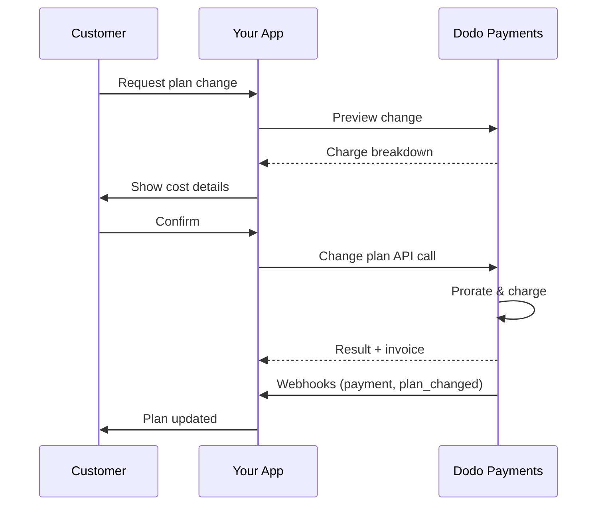
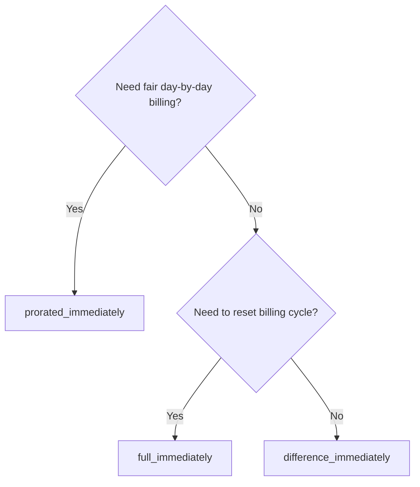
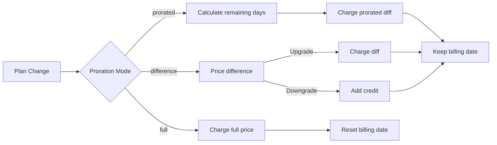

{/* LOCKED_PATTERN_6d744560e4135463c359b094ae69cd5f */}
{/* LOCKED_PATTERN_e019618386b2aca726eb1801e3e74076 */}
  Documentación completa de la API para actualizar suscripciones.
</Card>
{/* LOCKED_PATTERN_1e8b2499d330dcc44e5e284a3600fd11 */}
  Consulta los importes de cobro antes de cambiar de plan.
</Card>
{/* LOCKED_PATTERN_782a37ccd4cc5a4159c5497e7f1d4c54 */}
  Configuración paso a paso de la suscripción.
</Card>
</CardGroup>

## ¿Qué es una actualización o degradación de suscripción?

Cambiar de plan te permite mover a un cliente entre niveles de suscripción o cantidades. Úsalo para:
- Alinear los precios con el uso o las funciones
- Pasar de mensual a anual (o viceversa)
- Ajustar la cantidad en productos basados en asientos

<Info>
Los cambios de plan pueden generar un cargo inmediato según el modo de prorrateo que elijas.
</Info>

## Cuándo usar cambios de plan

- Actualiza cuando un cliente necesita más funciones, uso o asientos
- Degrada cuando el uso disminuye
- Migra usuarios a un nuevo producto o precio sin cancelar su suscripción

## Flujo de cambio de plan



## Requisitos previos

Antes de implementar cambios en el plan de suscripción, asegúrate de tener:

- Una cuenta de comerciante de Dodo Payments con productos de suscripción activos
- Credenciales de API (clave de API y clave secreta de webhook) desde el panel de control
- Una suscripción activa existente para modificar
- Un endpoint de webhook configurado para manejar eventos de suscripción

<Info>
Para instrucciones detalladas de configuración, consulta nuestra [Guía de integración](/developer-resources/integration-guide#dashboard-setup).
</Info>

## Guía de Implementación Paso a Paso

Sigue esta guía completa para implementar cambios en el plan de suscripción en tu aplicación:

<Steps>
{/* LOCKED_PATTERN_b0d6d45bb453480975a9fb2d18d04caf */}
Antes de implementar, determina:
- Qué productos de suscripción se pueden cambiar por cuáles otros
- Qué modo de prorrateo encaja con tu modelo de negocio
- Cómo manejar los cambios de plan fallidos con elegancia
- Qué eventos de webhook rastrear para la gestión del estado

<Tip>
Prueba a fondo los cambios de plan en modo de prueba antes de implementarlos en producción.
</Tip>
</Step>

{/* LOCKED_PATTERN_44f780199a4b76d6c063b33d8f599e9a */}
Selecciona el enfoque de facturación que se alinee con las necesidades de tu negocio:

<Tabs>
<Tab title="prorated_immediately">
Ideal para: aplicaciones SaaS que quieren cobrar de forma justa por el tiempo no usado
- Calcula la cantidad prorrateada exacta según el tiempo restante del ciclo
- Cobra una cantidad prorrateada basada en el tiempo no usado restante del ciclo
- Proporciona una facturación transparente a los clientes
</Tab>

<Tab title="difference_immediately">
Ideal para: escenarios claros de actualización/degradación
- Actualización: cobra la diferencia inmediata (p. ej., $30→$80 = cobra $50)
- Degradación: acredita el valor restante para renovaciones futuras
- Simplifica la lógica de facturación y la comunicación con el cliente
</Tab>

<Tab title="full_immediately">
Ideal para: cuando deseas reiniciar el ciclo de facturación
- Cobra el importe completo del nuevo plan inmediatamente
- Ignora el tiempo restante del plan anterior
- Útil para transiciones de anual a mensual
</Tab>
</Tabs>
</Step>

{/* LOCKED_PATTERN_62685552c5becb87cfeddbb400a3e69b */}
Usa la API Change Plan para modificar los detalles de la suscripción:

<ParamField path="subscription_id" type="string" required>
El ID de la suscripción activa a modificar.
</ParamField>

<ParamField path="product_id" type="string" required>
El nuevo ID de producto al que cambiar la suscripción.
</ParamField>

<ParamField path="quantity" type="integer" default="1">
Número de unidades para el nuevo plan (para productos basados en asientos).
</ParamField>

<ParamField path="proration_billing_mode" type="string" required>
Cómo manejar la facturación inmediata: `prorated_immediately`, `full_immediately` o `difference_immediately`.
</ParamField>

<ParamField path="addons" type="array">
Complementos opcionales para el nuevo plan. Dejar esto vacío elimina cualquier complemento existente.
</ParamField>

{/* LOCKED_PATTERN_dbe6ce0c854d65ccfe8e10a6cd58e3a8 */}
Controla el comportamiento cuando falla el pago del cambio de plan:
- `prevent_change`: Mantiene la suscripción en el plan actual hasta que el pago tenga éxito
- `apply_change` (predeterminado): Aplica el cambio de plan inmediatamente sin importar el resultado del pago

Si no se especifica, se usa la configuración predeterminada a nivel empresarial.
</ParamField>
</Step>

{/* LOCKED_PATTERN_5c8c73c93c2f49c93ec60fbfa164dd3a */}
Configura el manejo de webhooks para rastrear los resultados de los cambios de plan:

- `subscription.active`: Cambio de plan exitoso, suscripción actualizada
- `subscription.plan_changed`: Plan de suscripción cambiado (actualización/degradación/actualización de complemento)
- `subscription.on_hold`: Falló el cargo del cambio de plan, suscripción pausada
- `payment.succeeded`: Cargo inmediato por cambio de plan exitoso
- `payment.failed`: Falló el cargo inmediato

<Warning>
Verifica siempre las firmas de los webhooks e implementa el procesamiento idempotente de eventos.
</Warning>
</Step>

{/* LOCKED_PATTERN_df7c84793753eaba82a0d637e200faa6 */}
Según los eventos de webhook, actualiza tu aplicación:
- Concede/revoca funciones según el nuevo plan
- Actualiza el panel del cliente con los detalles del nuevo plan
- Envía correos de confirmación sobre los cambios de plan
- Registra los cambios de facturación para fines de auditoría
</Step>

{/* LOCKED_PATTERN_bee75f9c04c9720f2dc211cbed62a7c6 */}
Prueba a fondo tu implementación:
- Prueba todos los modos de prorrateo con distintos escenarios
- Verifica que el manejo de webhooks funcione correctamente
- Monitorea las tasas de éxito de los cambios de plan
- Configura alertas para cambios de plan fallidos

<Check>
Tu implementación de cambio de plan de suscripción ya está lista para producción.
</Check>
</Step>
</Steps>

## Vista previa de cambios de plan

Antes de comprometerte con un cambio de plan, usa la API de vista previa para mostrar a los clientes exactamente lo que se les cobrará:

<Tabs>
<Tab title="Node.js SDK">

```javascript
const preview = await client.subscriptions.previewChangePlan('sub_123', {
  product_id: 'prod_pro',
  quantity: 1,
  proration_billing_mode: 'prorated_immediately'
});

// Show customer the charge before confirming
console.log('Immediate charge:', preview.immediate_charge.summary);
console.log('New plan details:', preview.new_plan);
```

</Tab>

<Tab title="Python SDK">

```python
preview = client.subscriptions.preview_change_plan(
    subscription_id="sub_123",
    product_id="prod_pro",
    quantity=1,
    proration_billing_mode="prorated_immediately"
)

# Show customer the charge before confirming
print("Immediate charge:", preview.immediate_charge.summary)
print("New plan details:", preview.new_plan)
```

</Tab>
</Tabs>

<Tip>
Usa la API de vista previa para crear cuadros de diálogo de confirmación que muestren a los clientes el importe exacto que se les cobrará antes de confirmar un cambio de plan.
</Tip>

## API Change Plan

Usa la API Change Plan para modificar el producto, la cantidad y el comportamiento de prorrateo de una suscripción activa.

### Ejemplos de inicio rápido

<Tabs>
  <Tab title="Node.js SDK">

    ```javascript
    import DodoPayments from 'dodopayments';

    const client = new DodoPayments({
      bearerToken: process.env.DODO_PAYMENTS_API_KEY,
      environment: 'test_mode', // defaults to 'live_mode'
    });

    async function changePlan() {
      const result = await client.subscriptions.changePlan('sub_123', {
        product_id: 'prod_new',
        quantity: 3,
        proration_billing_mode: 'prorated_immediately',
        on_payment_failure: 'prevent_change', // Optional: control behavior on payment failure
      });
      console.log(result.status, result.invoice_id, result.payment_id);
    }

    changePlan();
    ```

  </Tab>
  <Tab title="Python SDK">

    ```python
    import os
    from dodopayments import DodoPayments

    client = DodoPayments(
        bearer_token=os.environ.get("DODO_PAYMENTS_API_KEY"),
        environment="test_mode",  # defaults to "live_mode"
    )

    result = client.subscriptions.change_plan(
        subscription_id="sub_123",
        product_id="prod_new",
        quantity=3,
        proration_billing_mode="prorated_immediately",
        on_payment_failure="prevent_change",  # Optional: control behavior on payment failure
    )
    print(result.status, result.get("invoice_id"), result.get("payment_id"))
    ```

  </Tab>
  <Tab title="Go SDK">

    ```go
    package main

    import (
      "context"
      "fmt"
      "github.com/dodopayments/dodopayments-go"
      "github.com/dodopayments/dodopayments-go/option"
    )

    func main() {
      client := dodopayments.NewClient(option.WithBearerToken("YOUR_TOKEN"))
      res, err := client.Subscriptions.ChangePlan(context.TODO(), dodopayments.SubscriptionChangePlanParams{
        SubscriptionID: dodopayments.F("sub_123"),
        ProductID:             dodopayments.F("prod_new"),
        Quantity:              dodopayments.F(int64(3)),
        ProrationBillingMode:  dodopayments.F(dodopayments.SubscriptionChangePlanParamsProrationBillingModeProratedImmediately),
        OnPaymentFailure:      dodopayments.F(dodopayments.OnPaymentFailurePreventChange), // Optional
      })
      if err != nil { panic(err) }
      fmt.Println(res.Status, res.InvoiceID, res.PaymentID)
    }
    ```

  </Tab>
  <Tab title="HTTP">

    ```bash
    curl -X POST "$DODO_API_BASE/subscriptions/sub_123/change-plan" \
      -H "Authorization: Bearer $DODO_PAYMENTS_API_KEY" \
      -H "Content-Type: application/json" \
      -d '{
        "product_id": "prod_new",
        "quantity": 3,
        "proration_billing_mode": "prorated_immediately",
        "on_payment_failure": "prevent_change"
      }'
    ```

  </Tab>
</Tabs>

```json Success
{
  "status": "processing",
  "subscription_id": "sub_123",
  "invoice_id": "inv_789",
  "payment_id": "pay_456",
  "proration_billing_mode": "prorated_immediately"
}
```

<Note>
Campos como <code>invoice_id</code> y <code>payment_id</code> se devuelven solo cuando se crea un cargo inmediato y/o una factura durante el cambio de plan. Confía siempre en los eventos de webhook (por ejemplo, <code>payment.succeeded</code>, <code>subscription.plan_changed</code>) para confirmar los resultados.
</Note>

<Warning>
Si el cargo inmediato falla, la suscripción puede pasar a `subscription.on_hold` hasta que el pago tenga éxito.
</Warning>

## Gestión de complementos

Al cambiar planes de suscripción, también puedes modificar complementos:

```javascript
// Add addons to the new plan
await client.subscriptions.changePlan('sub_123', {
  product_id: 'prod_new',
  quantity: 1,
  proration_billing_mode: 'difference_immediately',
  addons: [
    { addon_id: 'addon_123', quantity: 2 }
  ]
});

// Remove all existing addons
await client.subscriptions.changePlan('sub_123', {
  product_id: 'prod_new',
  quantity: 1,
  proration_billing_mode: 'difference_immediately',
  addons: [] // Empty array removes all existing addons
});
```

<Info>
Los complementos se incluyen en el cálculo de prorrateo y se cobrarán según el modo de prorrateo seleccionado.
</Info>

## Modos de prorrateo

Elige cómo cobrar al cliente al cambiar de plan:

#### `prorated_immediately`
- Cobra la diferencia parcial en el ciclo actual
- Si está en periodo de prueba, cobra inmediatamente y cambia al nuevo plan ahora
- Degradación: puede generar un crédito prorrateado aplicado a renovaciones futuras

#### `full_immediately`
- Cobra el importe completo del nuevo plan inmediatamente
- Ignora el tiempo restante del plan anterior

<Info>
Los créditos creados por degradaciones usando <code>difference_immediately</code> tienen alcance de suscripción y son distintos de los <a href="/features/customer-credit">Créditos para clientes</a>. Se aplican automáticamente a renovaciones futuras de la misma suscripción y no son transferibles entre suscripciones.
</Info>

#### `difference_immediately`
- Actualización: cobra de inmediato la diferencia de precio entre el plan antiguo y el nuevo
- Degradación: añade el valor restante como crédito interno a la suscripción y se aplica automáticamente en renovaciones

| Característica | `prorated_immediately` | `difference_immediately` | `full_immediately` |
|---------|----------------------|------------------------|-------------------|
| **Cobro de actualización** | Diferencia prorrateada para los días restantes | Diferencia de precio completa entre planes | Precio completo del nuevo plan |
| **Crédito de degradación** | Crédito prorrateado por los días restantes | Diferencia de precio completa como crédito | Sin crédito |
| **Ciclo de facturación** | Sin cambios | Sin cambios | Se reinicia hoy |
| **Comportamiento de la prueba** | Termina la prueba, cobra inmediatamente | Termina la prueba, cobra inmediatamente | Termina la prueba, cobra el importe completo |
| **Ideal para** | Facturación justa basada en el tiempo | Matemáticas sencillas de actualización/degradación | Reiniciar ciclos de facturación |
| **Complejidad** | Media (cálculo diario) | Baja (resta simple) | Baja (cobro completo) |



### Escenarios de ejemplo

Utiliza estos números canónicos de forma consistente:
- Plan actual: **Basic** en **$30/mes**
- Objetivo de actualización: **Pro** en **$80/mes**
- Objetivo de degradación (desde Pro): **Starter** en **$20/mes**
- Ciclo de facturación: **30 días**, iniciado el **1 de enero**
- El cambio de plan ocurre el **16 de enero** (15 días restantes, 15 días usados)

<AccordionGroup>
  {/* LOCKED_PATTERN_1a58b4dbcc060de029ff28c82c80a6fe */}

    ```
    Step 1: Calculate unused credit from current plan
      Unused days = 15 out of 30 days
      Credit = $30 × (15/30) = $15.00

    Step 2: Calculate prorated cost of new plan
      Remaining days = 15 out of 30 days
      New plan cost = $80 × (15/30) = $40.00

    Step 3: Calculate immediate charge
      Charge = New plan cost − Credit
      Charge = $40.00 − $15.00 = $25.00

    → Customer pays $25.00 now
    → Next renewal (Feb 1): $80.00/month
    ```

    ```javascript
    await client.subscriptions.changePlan('sub_123', {
      product_id: 'prod_pro',
      quantity: 1,
      proration_billing_mode: 'prorated_immediately'
    })
    ```

  </Accordion>

  {/* LOCKED_PATTERN_807a82fa1b52ee9a606ce1f9c1d8b613 */}

    ```
    Step 1: Calculate unused credit from current plan
      Unused days = 15 out of 30 days
      Credit = $80 × (15/30) = $40.00

    Step 2: Calculate prorated cost of new plan
      Remaining days = 15 out of 30 days
      New plan cost = $20 × (15/30) = $10.00

    Step 3: Calculate credit balance
      Credit = $40.00 − $10.00 = $30.00

    → No charge — $30.00 credit added to subscription
    → Credit auto-applies to future renewals
    → Next renewal (Feb 1): $20.00 − $30.00 credit = $0.00
    → Following renewal (Mar 1): $20.00 − $10.00 remaining credit = $10.00
    ```

    ```javascript
    await client.subscriptions.changePlan('sub_123', {
      product_id: 'prod_starter',
      quantity: 1,
      proration_billing_mode: 'prorated_immediately'
    })
    ```

  </Accordion>

  {/* LOCKED_PATTERN_67905dd0e892a1412bd0f1a567dd0a62 */}

    ```
    Immediate charge = New plan price − Old plan price
                     = $80 − $30
                     = $50.00

    → Customer pays $50.00 now (regardless of cycle position)
    → Next renewal (Feb 1): $80.00/month
    ```

    ```javascript
    await client.subscriptions.changePlan('sub_123', {
      product_id: 'prod_pro',
      quantity: 1,
      proration_billing_mode: 'difference_immediately'
    })
    ```

  </Accordion>

  {/* LOCKED_PATTERN_b17ed67d3062fadb798904adf781b844 */}

    ```
    Credit = Old plan price − New plan price
           = $80 − $20
           = $60.00

    → No charge — $60.00 credit added to subscription
    → Credit auto-applies to future renewals
    → Next renewal: $20.00 − $20.00 (from credit) = $0.00
    → Following renewal: $20.00 − $20.00 (from credit) = $0.00
    → Third renewal: $20.00 − $20.00 (from remaining credit) = $0.00
    ```

    ```javascript
    await client.subscriptions.changePlan('sub_123', {
      product_id: 'prod_starter',
      quantity: 1,
      proration_billing_mode: 'difference_immediately'
    })
    ```

  </Accordion>

  {/* LOCKED_PATTERN_0cb1a5657302a3970059ca925841dcd5 */}

    ```
    Immediate charge = Full new plan price = $80.00

    → Customer pays $80.00 now
    → No credit for unused time on old plan
    → Billing cycle resets to today (January 16)
    → Next renewal: February 16 at $80.00/month
    ```

    ```javascript
    await client.subscriptions.changePlan('sub_123', {
      product_id: 'prod_pro',
      quantity: 1,
      proration_billing_mode: 'full_immediately'
    })
    ```

  </Accordion>

  {/* LOCKED_PATTERN_6edab7762bdaeaf6cef5f85bafdb8832 */}

    ```
    Current: Basic plan ($30/month), no add-ons
    New: Pro plan ($80/month) + Extra Seats add-on ($10/seat × 3 seats = $30/month)
    Change on day 16 of 30 (15 days remaining)

    Step 1: Credit from current plan
      Credit = $30 × (15/30) = $15.00

    Step 2: Prorated cost of new plan + add-ons
      New plan = $80 × (15/30) = $40.00
      Add-ons = $30 × (15/30) = $15.00
      Total new = $55.00

    Step 3: Immediate charge
      Charge = $55.00 − $15.00 = $40.00

    → Customer pays $40.00 now
    → Next renewal: $80.00 + $30.00 = $110.00/month
    ```

    ```javascript
    await client.subscriptions.changePlan('sub_123', {
      product_id: 'prod_pro',
      quantity: 1,
      proration_billing_mode: 'prorated_immediately',
      addons: [
        { addon_id: 'addon_seats', quantity: 3 }
      ]
    })
    ```

  </Accordion>
</AccordionGroup>

### Cómo procesa cada modo la facturación



<Tip>
Elige `prorated_immediately` para una contabilidad justa del tiempo; selecciona `full_immediately` para reiniciar la facturación; usa `difference_immediately` para actualizaciones sencillas y crédito automático en degradaciones.
</Tip>

## Manejo de fallos de pago

Controla lo que ocurre cuando falla el pago de un cambio de plan usando el parámetro `on_payment_failure`.

### Modos de fallo de pago

<Tabs>
{/* LOCKED_PATTERN_9a289e347ae0d2762cd8b5bae425d96d */}
**Comportamiento**: Mantiene la suscripción en su plan actual hasta que el pago tenga éxito.

- El cambio de plan se marca como "pendiente"
- El cliente conserva el acceso a su plan actual
- La suscripción pasa al estado `active` solo después de que el pago sea exitoso
- Útil cuando quieres asegurar el pago antes de otorgar funciones mejoradas

```javascript
await client.subscriptions.changePlan('sub_123', {
  product_id: 'prod_pro',
  quantity: 1,
  proration_billing_mode: 'prorated_immediately',
  on_payment_failure: 'prevent_change'
});
```

</Tab>

{/* LOCKED_PATTERN_389bf4efb62466ceba65070629169973 */}
**Comportamiento**: Aplica el cambio de plan inmediatamente sin importar el resultado del pago.

- El cambio de plan se aplica incluso si el pago falla
- El cliente obtiene acceso inmediato al nuevo plan
- La suscripción puede pasar al estado `on_hold` si el pago falla
- Ideal para actualizaciones no críticas o cuando confías en el cliente

```javascript
await client.subscriptions.changePlan('sub_123', {
  product_id: 'prod_pro',
  quantity: 1,
  proration_billing_mode: 'prorated_immediately',
  on_payment_failure: 'apply_change' // This is the default
});
```

</Tab>
</Tabs>

<Info>
Si no se especifica, el parámetro `on_payment_failure` usa la configuración predeterminada a nivel empresarial que configuraste en el panel.
</Info>

### Cuándo usar cada modo

| Escenario | Modo recomendado | Razón |
|----------|------------------|--------|
| Actualizar a funciones premium | `prevent_change` | Asegurar el pago antes de otorgar acceso |
| Aumento de cantidad (más asientos) | `prevent_change` | Prevenir uso sin pago |
| Degradación de planes | `apply_change` | El cliente reduce gasto |
| Clientes empresariales confiables | `apply_change` | Menor riesgo de impago |
| Conversión de prueba a pago | `prevent_change` | Momento crítico de pago |

## Manejo de webhooks

Rastrea el estado de la suscripción mediante webhooks para confirmar cambios de plan y pagos.

### Tipos de eventos que debes manejar
- `subscription.active`: suscripción activada
- `subscription.plan_changed`: plan de suscripción cambiado (actualizaciones/degradaciones/cambios de complemento)
- `subscription.on_hold`: cargo fallido, suscripción pausada
- `subscription.renewed`: renovación exitosa
- `payment.succeeded`: pago por cambio de plan o renovación exitoso
- `payment.failed`: pago fallido

<Info>
Recomendamos basar tu lógica de negocio en los eventos de suscripción y usar los eventos de pago para confirmación y conciliación.
</Info>

### Verifica firmas y maneja intenciones

<Tabs>
  {/* LOCKED_PATTERN_ad56e9578b99d8d029bf3ec794be6fc4 */}

    ```javascript
    import { NextRequest, NextResponse } from 'next/server';
    
    export async function POST(req) {
      const webhookId = req.headers.get('webhook-id');
      const webhookSignature = req.headers.get('webhook-signature');
      const webhookTimestamp = req.headers.get('webhook-timestamp');
      const secret = process.env.DODO_WEBHOOK_SECRET;
    
      const payload = await req.text();
      // verifySignature is a placeholder – in production, use a Standard Webhooks library
      const { valid, event } = await verifySignature(
        payload,
        { id: webhookId, signature: webhookSignature, timestamp: webhookTimestamp },
        secret
      );
      if (!valid) return NextResponse.json({ error: 'Invalid signature' }, { status: 400 });
    
      switch (event.type) {
        case 'subscription.active':
          // mark subscription active in your DB
          break;
        case 'subscription.plan_changed':
          // refresh entitlements and reflect the new plan in your UI
          break;
        case 'subscription.on_hold':
          // notify user to update payment method
          break;
        case 'subscription.renewed':
          // extend access window
          break;
        case 'payment.succeeded':
          // reconcile payment for plan change
          break;
        case 'payment.failed':
          // log and alert
          break;
        default:
          // ignore unknown events
          break;
      }
    
      return NextResponse.json({ received: true });
    }
    ```

  </Tab>
  <Tab title="Express.js">

    ```javascript
    import express from 'express';
    
    const app = express();
    app.post('/webhooks/dodo', express.raw({ type: 'application/json' }), async (req, res) => {
      const webhookId = req.header('webhook-id');
      const webhookSignature = req.header('webhook-signature');
      const webhookTimestamp = req.header('webhook-timestamp');
      const secret = process.env.DODO_WEBHOOK_SECRET;
      const payload = req.body.toString('utf8');
    
      const { valid, event } = await verifySignature(
        payload,
        { id: webhookId, signature: webhookSignature, timestamp: webhookTimestamp },
        secret
      );
      if (!valid) return res.status(400).send('Invalid signature');
    
      // handle events like above
      res.json({ received: true });
    });
    
    app.listen(3000);
    ```

  </Tab>
</Tabs>

<Note>
Para esquemas completos de payload, consulta los <a href="/developer-resources/webhooks/intents/subscription">payloads de webhook de suscripción</a> y los <a href="/developer-resources/webhooks/intents/payment">payloads de webhook de pago</a>.
</Note>

## Mejores prácticas

Sigue estas recomendaciones para cambios de plan de suscripción confiables:

### Estrategia de cambio de plan
- **Prueba a fondo**: Siempre prueba los cambios de plan en modo de prueba antes de producción
- **Elige el prorrateo con cuidado**: Selecciona el modo de prorrateo que se alinea con tu modelo de negocio
- **Maneja errores con elegancia**: Implementa un manejo adecuado de errores y lógica de reintentos
- **Monitorea tasas de éxito**: Rastrea las tasas de éxito/fracaso de cambios de plan e investiga los problemas

### Implementación de webhooks
- **Verifica firmas**: Siempre valida las firmas de los webhooks para garantizar autenticidad
- **Implementa idempotencia**: Maneja duplicados de eventos de webhook con elegancia
- **Procesa de forma asíncrona**: No bloquees las respuestas de webhook con operaciones pesadas
- **Registra todo**: Mantén registros detallados para depuración y auditoría

### Experiencia del usuario
- **Comunica claramente**: Informa a los clientes sobre los cambios de facturación y los plazos
- **Proporciona confirmaciones**: Envía confirmaciones por correo electrónico para cambios de plan exitosos
- **Maneja casos límite**: Considera periodos de prueba, prorrateos y pagos fallidos
- **Actualiza la interfaz inmediatamente**: Refleja los cambios de plan en la interfaz de tu aplicación

## Problemas comunes y soluciones

Resuelve problemas típicos durante los cambios de plan de suscripción:

<AccordionGroup>
{/* LOCKED_PATTERN_112861435a085998aa537e347e24f368 */}
**Síntomas**: La llamada a la API tiene éxito pero la suscripción permanece en el plan antiguo

**Causas comunes**:
- El procesamiento de webhooks falló o se retrasó
- El estado de la aplicación no se actualizó después de recibir los webhooks
- Problemas de transacción en la base de datos durante la actualización del estado

**Soluciones**:
- Implementa un manejo robusto de webhooks con lógica de reintentos
- Usa operaciones idempotentes para las actualizaciones de estado
- Añade monitoreo para detectar y alertar sobre eventos de webhook perdidos
- Verifica que el endpoint de webhook sea accesible y responda correctamente
</Accordion>

{/* LOCKED_PATTERN_653656c823b0f191581a523ab18f0f3f */}
**Síntomas**: El cliente se degrada pero no ve el saldo de crédito

**Causas comunes**:
- Expectativas del modo de prorrateo: las degradaciones acreditan la diferencia de precio completa con `difference_immediately`, mientras que `prorated_immediately` crea un crédito prorrateado basado en el tiempo restante del ciclo
- Los créditos están vinculados a la suscripción y no se transfieren entre suscripciones
- El saldo de crédito no es visible en el panel del cliente

**Soluciones**:
- Usa `difference_immediately` para degradaciones cuando quieras créditos automáticos
- Explica a los clientes que los créditos se aplican a renovaciones futuras de la misma suscripción
- Implementa un portal de clientes que muestre los saldos de crédito
- Consulta la vista previa de la próxima factura para ver los créditos aplicados
</Accordion>

{/* LOCKED_PATTERN_1b0516ec68b4083dc4d6ae9b330f3f1a */}
**Síntomas**: Los eventos de webhook son rechazados debido a firma inválida

**Causas comunes**:
- Clave secreta de webhook incorrecta
- El cuerpo bruto de la solicitud se modificó antes de verificar la firma
- Algoritmo de verificación de firma incorrecto

**Soluciones**:
- Verifica que estés usando la `DODO_WEBHOOK_SECRET` correcta del panel
- Lee el cuerpo bruto de la solicitud antes de cualquier middleware de análisis JSON
- Usa la biblioteca estándar de verificación de webhooks para tu plataforma
- Prueba la verificación de firmas de webhook en el entorno de desarrollo
</Accordion>

{/* LOCKED_PATTERN_638d7c911003cceda8c7d34ff8a2c381 */}
**Síntomas**: La API devuelve un error 422 Unprocessable Entity

**Causas comunes**:
- ID de suscripción o ID de producto inválido
- La suscripción no está en estado activo
- Faltan parámetros obligatorios
- Producto no disponible para cambios de plan

**Soluciones**:
- Verifica que la suscripción exista y esté activa
- Comprueba que el ID de producto sea válido y esté disponible
- Asegura que todos los parámetros obligatorios estén incluidos
- Revisa la documentación de la API para los requisitos de parámetros
</Accordion>

{/* LOCKED_PATTERN_7917a64bf4b26c933f2e4649e9278a56 */}
**Síntomas**: Cambio de plan iniciado pero el cargo inmediato falla

**Causas comunes**:
- Fondos insuficientes en el método de pago del cliente
- Método de pago caducado o inválido
- El banco rechazó la transacción
- La detección de fraude bloqueó el cargo

**Soluciones**:
- Maneja adecuadamente los eventos `payment.failed`
- Notifica al cliente para que actualice el método de pago
- Implementa lógica de reintentos para fallos temporales
- Considera permitir cambios de plan con cargos inmediatos fallidos
</Accordion>

{/* LOCKED_PATTERN_20276630e99e95ac9f5cdd0b347713bb */}
**Síntomas**: El cargo del cambio de plan falla y la suscripción pasa al estado `on_hold`

**Qué ocurre**:
Cuando falla el cargo del cambio de plan, la suscripción se coloca automáticamente en el estado `on_hold`. La suscripción no se renovará automáticamente hasta que se actualice el método de pago.

**Solución**: Actualiza el método de pago para reactivar la suscripción

Para reactivar una suscripción desde el estado `on_hold` después de un cambio de plan fallido:

1. **Actualiza el método de pago** usando la API Update Payment Method
2. **Creación automática de cargo**: La API crea automáticamente un cargo por los importes pendientes
3. **Generación de factura**: Se genera una factura por el cargo
4. **Procesamiento del pago**: El pago se procesa con el nuevo método de pago
5. **Reactivación**: Tras el pago exitoso, la suscripción se reactiva al estado `active`

<CodeGroup>

```javascript Node.js
// Reactivate subscription from on_hold after failed plan change
async function reactivateAfterFailedPlanChange(subscriptionId) {
  // Update payment method - automatically creates charge for remaining dues
  const response = await client.subscriptions.updatePaymentMethod(subscriptionId, {
    type: 'new',
    return_url: 'https://example.com/return'
  });
  
  if (response.payment_id) {
    console.log('Charge created for remaining dues:', response.payment_id);
    console.log('Payment link:', response.payment_link);
    
    // Redirect customer to payment_link to complete payment
    // Monitor webhooks for:
    // 1. payment.succeeded - charge succeeded
    // 2. subscription.active - subscription reactivated
  }
  
  return response;
}

// Or use existing payment method if available
async function reactivateWithExistingPaymentMethod(subscriptionId, paymentMethodId) {
  const response = await client.subscriptions.updatePaymentMethod(subscriptionId, {
    type: 'existing',
    payment_method_id: paymentMethodId
  });
  
  // Monitor webhooks for payment.succeeded and subscription.active
  return response;
}
```

```python Python
# Reactivate subscription from on_hold after failed plan change
def reactivate_after_failed_plan_change(subscription_id):
    # Update payment method - automatically creates charge for remaining dues
    response = client.subscriptions.update_payment_method(
        subscription_id=subscription_id,
        type="new",
        return_url="https://example.com/return"
    )
    
    if response.payment_id:
        print("Charge created for remaining dues:", response.payment_id)
        print("Payment link:", response.payment_link)
        
        # Redirect customer to payment_link to complete payment
        # Monitor webhooks for:
        # 1. payment.succeeded - charge succeeded
        # 2. subscription.active - subscription reactivated
    
    return response

# Or use existing payment method if available
def reactivate_with_existing_payment_method(subscription_id, payment_method_id):
    response = client.subscriptions.update_payment_method(
        subscription_id=subscription_id,
        type="existing",
        payment_method_id=payment_method_id
    )
    
    # Monitor webhooks for payment.succeeded and subscription.active
    return response
```

</CodeGroup>

**Eventos de webhook a monitorear**:
- `subscription.on_hold`: Suscripción puesta en espera (se recibe cuando falla el cargo del cambio de plan)
- `payment.succeeded`: Pago por importes pendientes exitoso (después de actualizar el método de pago)
- `subscription.active`: Suscripción reactivada tras el pago exitoso

**Mejores prácticas**:
- Notifica a los clientes inmediatamente cuando falla un cargo por cambio de plan
- Proporciona instrucciones claras sobre cómo actualizar su método de pago
- Monitorea eventos de webhook para seguir el estado de reactivación
- Considera implementar lógica de reintentos automática para fallos temporales de pago

{/* LOCKED_PATTERN_d215ea1d00e95d5e9d5b4b6085f2443f */}
Consulta la documentación completa de la API para actualizar métodos de pago y reactivar suscripciones.
</Card>
</Accordion>
</AccordionGroup>

## Prueba tu implementación

Sigue estos pasos para probar a fondo tu implementación de cambios de plan de suscripción:

<Steps>
{/* LOCKED_PATTERN_f5ce79c6f425de558f6fdd6cea5793f5 */}
- Usa claves API de prueba y productos de prueba
- Crea suscripciones de prueba con distintos tipos de plan
- Configura un endpoint de webhook de prueba
- Configura monitoreo y registros
</Step>

{/* LOCKED_PATTERN_3705b8701c8873992c57281c42adf8d6 */}
- Prueba `prorated_immediately` con varias posiciones del ciclo de facturación
- Prueba `difference_immediately` para actualizaciones y degradaciones
- Prueba `full_immediately` para reiniciar los ciclos de facturación
- Verifica que los cálculos de crédito sean correctos
</Step>

{/* LOCKED_PATTERN_9fb1eaf73e8951f61d7daf19366cdfdf */}
- Verifica que se reciban todos los eventos de webhook relevantes
- Prueba la verificación de firmas de webhook
- Maneja con elegancia eventos duplicados de webhook
- Prueba escenarios de fallo en el procesamiento de webhooks
</Step>

{/* LOCKED_PATTERN_7d448c9309210902a86e740b08deae34 */}
- Prueba con IDs de suscripción inválidos
- Prueba con métodos de pago vencidos
- Prueba fallos de red y timeouts
- Prueba con fondos insuficientes
</Step>

{/* LOCKED_PATTERN_099bec4eb7633497929a085e7b0160cd */}
- Configura alertas para cambios de plan fallidos
- Monitorea los tiempos de procesamiento de webhooks
- Rastrea las tasas de éxito de cambios de plan
- Revisa los tickets de soporte al cliente sobre problemas de cambios de plan
</Step>
</Steps>

## Manejo de errores

Maneja los errores comunes de la API con elegancia en tu implementación:

### Códigos de estado HTTP

<AccordionGroup>
<Accordion title="200 OK">
Solicitud de cambio de plan procesada con éxito. La suscripción se está actualizando y el procesamiento del pago ha comenzado.
</Accordion>

<Accordion title="400 Bad Request">
Parámetros de solicitud inválidos. Verifica que todos los campos obligatorios estén incluidos y correctamente formateados.
</Accordion>

{/* LOCKED_PATTERN_618fe88bddcc0059b0b92c4342a4dcfc */}
Clave API inválida o faltante. Verifica que tu `DODO_PAYMENTS_API_KEY` sea correcta y tenga los permisos adecuados.
</Accordion>

<Accordion title="404 Not Found">
ID de suscripción no encontrado o que no pertenece a tu cuenta.
</Accordion>

<Accordion title="422 Unprocessable Entity">
La suscripción no se puede cambiar (por ejemplo, ya cancelada, producto no disponible, etc.).
</Accordion>

<Accordion title="500 Internal Server Error">
Ocurrió un error en el servidor. Reintenta la solicitud después de un breve retraso.
</Accordion>
</AccordionGroup>

### Formato de respuesta de error

```json
{
  "error": {
    "code": "subscription_not_found",
    "message": "The subscription with ID 'sub_123' was not found",
    "details": {
      "subscription_id": "sub_123"
    }
  }
}
```

## Próximos pasos

- Revisa la <a href="/api-reference/subscriptions/change-plan">API Change Plan</a>
- Explora <a href="/features/customer-credit">Créditos para clientes</a>
- Implementa alertas para `subscription.on_hold`
- Consulta nuestra <a href="/developer-resources/webhooks">Guía de integración de webhooks</a>
