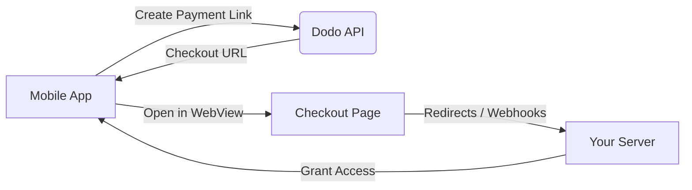

## Introducción

Dodo Payments empodera a los desarrolladores para vender bienes y servicios digitales en aplicaciones iOS, manejando aspectos complejos como el cumplimiento fiscal, la conversión de divisas y los pagos. Esta guía completa detalla cómo integrar Dodo Payments en tu aplicación iOS, específicamente para herramientas SaaS, suscripciones de contenido y utilidades digitales.

## Descripción General

Dodo Payments actúa como tu **Merchant of Record (MoR)**, gestionando aspectos críticos de tu negocio digital:

<Tabs>
- Cobro y transferencia de impuestos (IVA, GST y otros impuestos regionales)
- Pagos globales según políticas y métodos locales
- Conversión de divisas y cambio extranjero
- Contracargos y prevención de fraudes
- Facturación y recibos al cliente final
- Cumplimiento con regulaciones regionales
</Tab>

{/* LOCKED_PATTERN_da399a11cc5287c02436800c294d28be */}
- Una API unificada para plataformas web y móviles
- Soporte para pagos dentro de la aplicación (UPI, tarjetas, monederos, BNPL)
- Soporte de pagos globales (Payoneer, Wise, transferencias bancarias locales)
- Panel de análisis e informes
- Procesamiento seguro de pagos
</Tab>
</Tabs>

## Casos de Uso

<CardGroup cols={2}>
{/* LOCKED_PATTERN_25273516451e819dcf5729a5b31c3fb9 */}
- Acceso a contenido o funciones premium
- Facturación recurrente con opciones flexibles, pruebas gratuitas, prorrateo o actualizaciones y degradaciones
</Card>

{/* LOCKED_PATTERN_032df751886a698341277e548837215d */}
- Acceso por curso
- Paquetes de contenido agrupado
- Licencias perpetuas o renovables
- Integración de seguimiento de progreso
</Card>

{/* LOCKED_PATTERN_88cb7887605391efc00e89ceac393617 */}
- Compras únicas (PDFs, música, herramientas)
- Entrega de activos digitales
- Gestión de claves de licencia
</Card>

{/* LOCKED_PATTERN_53b689678a845fbab7f78be1484fe51d */}
- Suscripciones SaaS
- Facturación basada en uso
- Planes para equipos y empresas
</Card>
</CardGroup>

## Flujo de Integración

Puedes integrar Dodo Payments en tu aplicación utilizando nuestra solución de pago alojado o navegador dentro de la aplicación.

### Pasos de Integración

<Steps>
{/* LOCKED_PATTERN_eaf7186d297d5feae774885072c1deff */}
El proceso comienza con la aplicación móvil creando un enlace de pago al interactuar con la API de Dodo.
</Step>

{/* LOCKED_PATTERN_b32fbf0225071fa4e66b7da8eafe9ef9 */}
La API de Dodo responde proporcionando una URL de pago a la aplicación móvil.
</Step>

{/* LOCKED_PATTERN_d976b5e50a0a8a20a8206d907f16914f */}
Luego la aplicación móvil abre esta URL de pago dentro de un WebView, llevando al usuario a la página de pago.
</Step>

{/* LOCKED_PATTERN_44d5bb8ba746348cda77bbdfc76b7fa5 */}
Al completar el proceso de pago, la página de pago se comunica con su servidor mediante redireccionamientos o webhooks.
</Step>

{/* LOCKED_PATTERN_5f4ad8be947cf24adc5f501029294d3c */}
Finalmente, su servidor concede acceso al contenido o servicio adquirido, completando el ciclo de la transacción en la aplicación móvil.
</Step>
</Steps>

{/* LOCKED_PATTERN_b9b6430ebe2f8c301db006aee204f66d */}
Para un recorrido completo para desarrolladores, explore nuestra Guía de Integración Móvil.
</Card>

## Disponibilidad Regional

Dodo Payments habilita flujos de compra dentro de la aplicación alternativos solo en regiones de la App Store donde Apple permite explícitamente pagos externos, o donde un regulador o una orden judicial lo exige.

### Regiones Soportadas

<AccordionGroup>
{/* LOCKED_PATTERN_2d6a072cfe841357c870b65ab28b5291 */}
Compatible en la medida permitida por las órdenes judiciales vigentes y las directrices actualizadas de Apple.

- Disponible bajo disposiciones judiciales específicas
- Sujeto a que Apple cumpla con los requisitos legales
- Debe seguir las pautas de implementación de Apple
</Accordion>

{/* LOCKED_PATTERN_4ec7a4d0b0e955daa950f2acd6b96083 */}
Compatible mediante los Términos Alternativos de Apple para la UE y la Autorización de Compra Externa.

- Habilitado a través de los Términos Alternativos de Apple para la UE
- Requiere aprobación de la Autorización de Compra Externa
- Debe cumplir con los requisitos de la Ley de Mercados Digitales de la UE
</Accordion>

{/* LOCKED_PATTERN_6bb22099c6c9aa7ba0a1c7dba319d124 */}
Compatible a través de la Autorización de Compra Externa de StoreKit para binarios exclusivos de Corea.

- Disponible a través de la Autorización de Compra Externa de StoreKit
- Requiere un binario de aplicación específico para Corea
- Debe cumplir con la ley de telecomunicaciones coreana
</Accordion>
</AccordionGroup>

<Warning>
Revise siempre y cumpla con los derechos específicos por región de Apple y los requisitos de App Store Connect antes de habilitar Dodo Payments para cualquier escaparate. El uso de flujos de pago alternativos en regiones no compatibles puede resultar en el rechazo o la eliminación de la aplicación.
</Warning>

<Note>
Para algunos modelos de negocio, como servicios o ciertas categorías de contenido, Apple puede no requerir el uso de compras dentro de la aplicación (IAP). Dodo Payments también es compatible con estos modelos. Verifique siempre la clasificación de su aplicación y las directrices más recientes de Apple para determinar si IAP es obligatorio para su caso de uso.
</Note>

### Aprende Más

Para un desglose detallado de políticas globales, precedentes legales y enfoques estratégicos para eludir las tarifas de la App Store, consulta nuestra guía completa:

{/* LOCKED_PATTERN_4c4ef7dc147bdbe9f5385b01ed7a302b */}
Aprenda dónde y cómo puede implementar legalmente flujos de pago alternativos, con orientación regional actualizada y consejos de cumplimiento.
</Card>