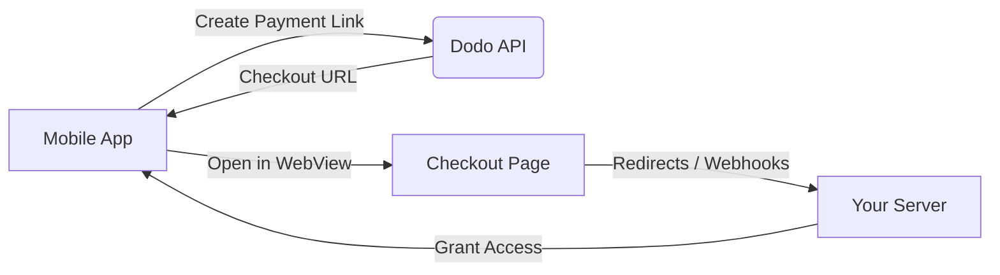

## Introducción

Dodo Payments empodera a los desarrolladores para vender bienes y servicios digitales en aplicaciones iOS, manejando aspectos complejos como el cumplimiento fiscal, la conversión de divisas y los pagos. Esta guía completa detalla cómo integrar Dodo Payments en tu aplicación iOS, específicamente para herramientas SaaS, suscripciones de contenido y utilidades digitales.

## Descripción General

Dodo Payments actúa como tu **Merchant of Record (MoR)**, gestionando aspectos críticos de tu negocio digital:

<Tabs>
<Tab title="Lo Que Manejamos">
- Recaudación y remisión de impuestos (IVA, GST y otros impuestos regionales)
- Pagos globales según políticas y métodos de pago locales
- Conversión de divisas y cambio de moneda
- Devoluciones y prevención de fraudes
- Facturación y recibos para el cliente final
- Cumplimiento de regulaciones regionales
</Tab>

<Tab title="Lo Que Obtienes">
- Una API unificada para plataformas web y móviles
- Soporte para pagos dentro de la aplicación (UPI, tarjetas, billeteras, BNPL)
- Soporte global para pagos (Payoneer, Wise, transferencias bancarias locales)
- Panel de análisis e informes
- Procesamiento de pagos seguro
</Tab>
</Tabs>

## Casos de Uso

<CardGroup cols={2}>
<Card title="Suscripciones" icon="repeat">
- Acceso a contenido o características premium
- Facturación recurrente con opciones flexibles, pruebas gratuitas, prorrateo o actualizaciones y degradaciones
</Card>

<Card title="Cursos y Aprendizaje" icon="graduation-cap">
- Acceso por curso
- Paquetes de contenido agrupados
- Licencias de por vida o renovables
- Integración de seguimiento de progreso
</Card>

<Card title="Descargas Digitales" icon="download">
- Compras únicas (PDFs, música, herramientas)
- Entrega de activos digitales
- Gestión de claves de licencia
</Card>

<Card title="Herramientas SaaS" icon="screwdriver-wrench">
- Suscripciones de Software como Servicio
- Facturación basada en uso
- Planes para equipos y empresas
</Card>
</CardGroup>

## Flujo de Integración

Puedes integrar Dodo Payments en tu aplicación utilizando nuestra solución de pago alojado o navegador dentro de la aplicación.

### Pasos de Integración

<Steps>
<Step title="Aplicación Móvil a Dodo API">
El proceso comienza con la aplicación móvil creando un enlace de pago al interactuar con la Dodo API.
</Step>

<Step title="Dodo API a Aplicación Móvil">
La Dodo API responde proporcionando una URL de pago de vuelta a la aplicación móvil.
</Step>

<Step title="Aplicación Móvil a Página de Pago">
La aplicación móvil luego abre esta URL de pago dentro de un WebView, llevando al usuario a la página de pago.
</Step>

<Step title="Página de Pago a Tu Servidor">
Al completar el proceso de pago, la página de pago se comunica con tu servidor a través de redirecciones o webhooks.
</Step>

<Step title="Tu Servidor a Aplicación Móvil">
Finalmente, tu servidor otorga acceso al contenido o servicio adquirido, completando el ciclo de transacción de vuelta en la aplicación móvil.
</Step>
</Steps>

<Card title="Guía de Integración Móvil" icon="mobile" href="/developer-resources/mobile-integration">
Para un recorrido completo para desarrolladores, explora nuestra Guía de Integración Móvil.
</Card>

## Disponibilidad Regional

Dodo Payments habilita flujos de compra dentro de la aplicación alternativos solo en regiones de la App Store donde Apple permite explícitamente pagos externos, o donde un regulador o una orden judicial lo exige.

### Regiones Soportadas

<AccordionGroup>
<Accordion title="Estados Unidos">
Soportado en la medida permitida por las órdenes judiciales actuales y las pautas actualizadas de Apple.

- Disponible bajo disposiciones específicas ordenadas por la corte
- Sujeto al cumplimiento de Apple con los requisitos legales
- Debe seguir las pautas de implementación de Apple
</Accordion>

<Accordion title="App Store de la Unión Europea (UE)">
Soportado a través de los Términos Alternativos de la UE de Apple y el Derecho de Compra Externa.

- Habilitado a través de los Términos Alternativos de la UE de Apple
- Requiere aprobación del Derecho de Compra Externa
- Debe cumplir con los requisitos de la Ley de Mercados Digitales de la UE
</Accordion>

<Accordion title="Corea del Sur">
Soportado a través del Derecho de Compra Externa de StoreKit para binarios solo de Corea.

- Disponible a través del Derecho de Compra Externa de StoreKit
- Requiere un binario de aplicación específico para Corea
- Debe cumplir con la ley de telecomunicaciones de Corea
</Accordion>
</AccordionGroup>

<Warning>
Siempre revisa y cumple con los derechos específicos de la región de Apple y los requisitos de App Store Connect antes de habilitar Dodo Payments para cualquier tienda. Usar flujos de pago alternativos en regiones no soportadas puede resultar en el rechazo o eliminación de la aplicación.
</Warning>

<Note>
Para algunos modelos de negocio, como servicios o ciertas categorías de contenido, Apple puede no requerir el uso de compras dentro de la aplicación (IAP) en absoluto. Dodo Payments también soporta estos modelos. Siempre verifica la clasificación de tu aplicación y las últimas pautas de Apple para determinar si IAP es obligatorio para tu caso de uso.
</Note>

### Aprende Más

Para un desglose detallado de políticas globales, precedentes legales y enfoques estratégicos para eludir las tarifas de la App Store, consulta nuestra guía completa:

<Card title="Eludiendo Tarifas de la App Store y Play Store: Un Manual Estratégico y Legal" icon="shield-check" href="/features/bypassing-app-store-fees">
Descubre dónde y cómo puedes implementar legalmente flujos de pago alternativos, con orientación regional actualizada y consejos de cumplimiento.
</Card>