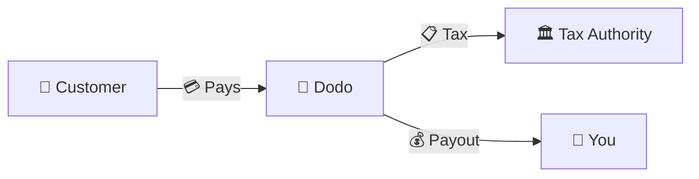
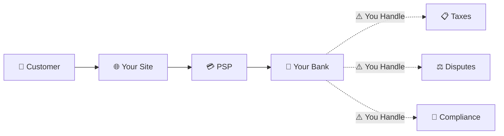
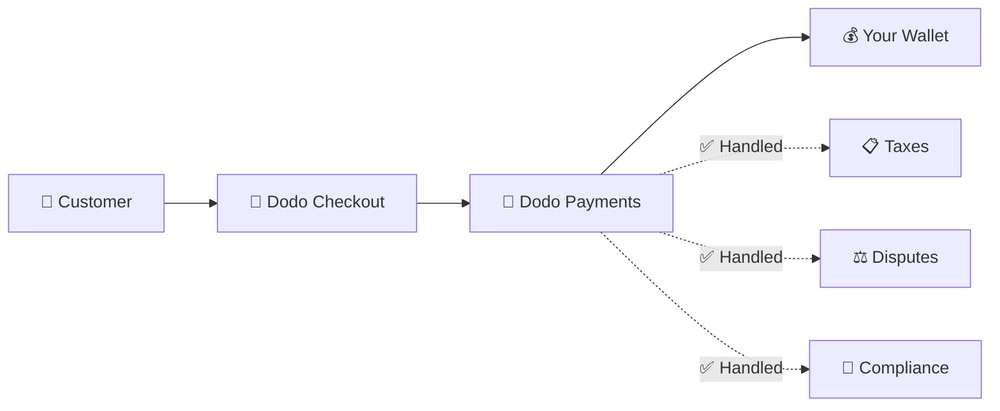
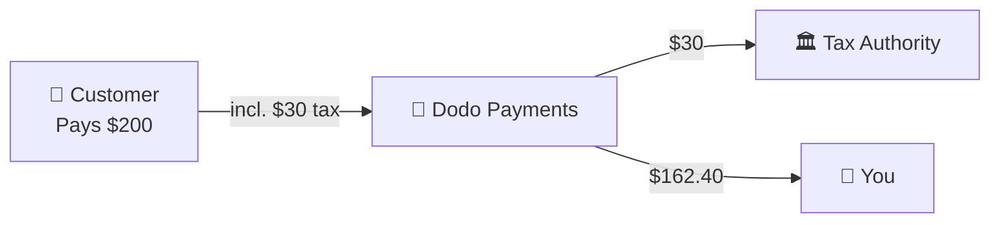

Dodo Payments opera como un **Merchant of Record (MoR)** — nos convertimos en el vendedor legal de tus productos digitales, asumiendo la responsabilidad de pagos, impuestos, fraudes y cumplimiento para que puedas concentrarte completamente en construir tu producto.

<CardGroup cols={3}>
{/* LOCKED_PATTERN_0dfe8c9e68953181aad63120292193bb */}
Cumplimiento tributario gestionado automáticamente
</Card>

{/* LOCKED_PATTERN_a7f32ee62695527a537b82d99f01c4bc */}
Tarjetas, billeteras y métodos locales
</Card>

{/* LOCKED_PATTERN_cb6e35d755bb02c3f1254b1c5a9c4c73 */}
Nos encargamos de todas las remesas
</Card>
</CardGroup>

## ¿Qué es un Merchant of Record?

Un **Merchant of Record** es la entidad legal que aparece en el estado de cuenta de la tarjeta de crédito de tu cliente y asume la responsabilidad de la transacción. Cuando usas Dodo Payments como tu MoR:

- **Nosotros somos el vendedor legal** — Dodo aparece en los estados de cuenta y recibos bancarios
- **Tú eres el creador del producto** — Tú construyes, pones precio y entregas tu producto
- **Nosotros manejamos la parte administrativa** — Impuestos, disputas, cumplimiento y soporte de facturación
- **Tú recibes pagos netos** — Ingresos depositados directamente en tu cuenta

<Note>
Piense en un Merchant of Record como contratar un equipo financiero global que se encarga de facturación, impuestos y cobros en cada país, sin que usted tenga que mover un dedo.
</Note>

## ¿Por qué usar un Merchant of Record?

Vender productos digitales a nivel global significa navegar por el IVA en Europa, GST en Australia, Impuesto sobre Ventas en EE. UU. y innumerables otros requisitos. Cada jurisdicción tiene diferentes reglas, tasas, umbrales y plazos de presentación.

| Tu Responsabilidad | Sin MoR | Con Dodo como MoR |
|---------------------|:-----------:|:----------------:|
| Registro de IVA/GST | ❌ Tú | ✅ Dodo |
| Cálculo de Impuestos | ❌ Tú | ✅ Dodo |
| Presentación y Remesa de Impuestos | ❌ Tú | ✅ Dodo |
| Responsabilidad por Cargos Reversos | ❌ Tú | ✅ Dodo |
| Cumplimiento PCI | ❌ Tú | ✅ Dodo |
| Soporte Multimoneda | ❌ Complejo | ✅ Integrado |
| Métodos de Pago Locales | ❌ Integrar Cada Uno | ✅ 30+ Incluidos |

<Tip>
**Ejemplo**: ¿Vender una suscripción de €50/mes a un cliente francés?

**Sin MoR**: Registrarse para el IVA francés, cobrar €60 (20% IVA), presentar declaraciones trimestrales francesas, manejar auditorías—en francés.

**Con Dodo**: Recaudamos €60, remitimos €10 de IVA a Francia y te pagamos €50 menos las tarifas. Tú escribes el código.
</Tip>

## PSP vs. MoR: Diferencias Clave

Entender la diferencia entre un **Proveedor de Servicios de Pago** (como Stripe) y un **Merchant of Record** es esencial.

### Proveedor de Servicios de Pago (PSP)

Un PSP procesa transacciones pero te deja como el vendedor legal:

<Warning>
Con un PSP, **tú** eres responsable del registro fiscal, la recaudación, la presentación y la remisión de impuestos en cada jurisdicción donde tengas clientes.
</Warning>

### Merchant of Record (Dodo)

Un MoR se convierte en el vendedor legal, manejando el cumplimiento de principio a fin:

<Check>
Con Dodo como MoR, nos encargamos de impuestos, disputas y cumplimiento. Recibes pagos netos sin papeleo.
</Check>

### Comparación Lado a Lado

| Aspecto | PSP (Stripe, etc.) | MoR (Dodo) |
|--------|:------------------:|:----------:|
| Vendedor Legal | Tu Empresa | Dodo |
| En el Estado de Cuenta del Cliente | Tu Nombre | Dodo |
| Registro de Impuestos | ❌ Tú | ✅ Dodo |
| Cálculo de Impuestos | ❌ Tú | ✅ Dodo |
| Remesa de Impuestos | ❌ Tú | ✅ Dodo |
| Riesgo de Cargos Reversos | ❌ Tú | ✅ Dodo |
| Cumplimiento PCI | ❌ Tú | ✅ Dodo |
| Configuración para Global | Complejo | Simple |

<Info>
**Importante**: Tanto los PSP como los MoR procesan pagos. La diferencia clave es **quién es legalmente responsable** del cumplimiento fiscal y la responsabilidad de las transacciones.
</Info>

## Cómo Funciona el Cumplimiento Fiscal

Dodo maneja todo el ciclo de vida fiscal automáticamente:

<Steps>
{/* LOCKED_PATTERN_9939f53f87faa28f5e85c7bcd4aa5d90 */}
Detectamos el país del cliente y determinamos qué normativas fiscales aplican: IVA, GST, Sales Tax u otros requisitos locales.
</Step>

{/* LOCKED_PATTERN_70142fc485c0e1d535a43e599b490143 */}
La tasa impositiva correcta se calcula según el tipo de producto, la ubicación del cliente y el estado B2B/B2C. Los clientes empresariales de la UE con número de IVA válido obtienen la aplicación del reverse charge.
</Step>

{/* LOCKED_PATTERN_44b82b1d71e9f255cf562f67916ee9b7 */}
El impuesto se muestra claramente y se cobra en el proceso de pago. Los clientes ven exactamente lo que están pagando.
</Step>

{/* LOCKED_PATTERN_1a778e95cb3812007334c0b47194f9ac */}
Presentamos declaraciones y pagamos los impuestos recaudados a las autoridades correspondientes según el calendario. Nunca ves un formulario fiscal.
</Step>
</Steps>

## Flujo de Ingresos

Así es como el dinero se mueve del cliente a tu cuenta:

### Ejemplo de Desglose de Pagos

| Concepto | Monto |
|-----------|-------:|
| Pago del Cliente | $200.00 |
| Impuesto sobre Ventas (15% IVA) | −$30.00 |
| Tarifa de Plataforma Dodo (4%) | −$8.00 |
| Procesamiento de Pagos | −$0.60 |
| **Tu Pago** | **$162.40** |

## Cuándo Elegir MoR vs. PSP

<Tabs>
{/* LOCKED_PATTERN_1d2e428d12b1ee53f2d946d9302bede1 */}
**Dodo Payments es ideal si:**

- Vendes productos digitales, SaaS o suscripciones
- Tienes clientes en varios países
- Quieres evitar dolores de cabeza con el registro fiscal
- Prefieres un cumplimiento externalizado y predecible
- Valoras la rapidez de salida al mercado más que el control máximo
- No quieres gestionar disputas y fraudes
</Tab>

{/* LOCKED_PATTERN_9020967e8e2c9a3ebc575f4072e18e76 */}
**Un PSP podría adaptarse a ti si:**

- Operas principalmente en un país
- Cuentas con equipos financieros y de cumplimiento internos
- Necesitas control absoluto sobre la experiencia de pago
- Trabajas con márgenes extremadamente ajustados
- Vendes bienes físicos (los MoR se centran en digitales)
</Tab>
</Tabs>

<Note>
Muchas empresas comienzan con un PSP y migran a un MoR al escalar internacionalmente. Dodo ofrece soporte de migración para que esta transición sea fluida.
</Note>

## Preguntas Frecuentes

<AccordionGroup>
{/* LOCKED_PATTERN_03db007d1397fc75cc7c059a12f7514d */}
Dodo Payments aparece como el comerciante. Incluimos tu referencia de producto/marca cuando los límites de caracteres lo permiten, y los clientes reciben recibos detallados con la información de tu producto.
</Accordion>

{/* LOCKED_PATTERN_14efbd55af6b9971cc9bb290118d1ce5 */}
Sí. Tú controlas los precios, la marca, la entrega del producto y la comunicación directa. Dodo gestiona la mecánica de facturación, pero los clientes saben que están comprando contigo. Tu marca aparece de forma destacada en el pago, correos electrónicos y facturas.
</Accordion>

{/* LOCKED_PATTERN_5e87ff5ce15f8c25ec293008878ec1c8 */}
Para ventas B2B en la UE, los clientes pueden ingresar su número de IVA al pagar. Lo validamos y aplicamos el reverse charge automáticamente: el impuesto se traslada a la declaración del comprador en lugar de cobrarse.
</Accordion>

{/* LOCKED_PATTERN_828a96aed23c294d40585d542017c689 */}
Dodo opera como una solución completa utilizando nuestra infraestructura de pagos. Esta integración es lo que nos permite asumir la responsabilidad fiscal y por fraude. Estamos trabajando para ofrecer una integración con otros procesadores de pagos en el futuro.
</Accordion>

{/* LOCKED_PATTERN_7d718a1b657f28e952148f962ca6593e */}
Inicia reembolsos desde tu panel. Procesamos el reembolso en el método de pago y moneda original del cliente. Los montos fiscales se ajustan automáticamente y se concilian.
</Accordion>

{/* LOCKED_PATTERN_dc7f113144600495109fc2c229c89f70 */}
Dodo gestiona los **impuestos sobre ventas** (IVA, GST, Sales Tax) en las transacciones con clientes. Tú sigues siendo responsable del impuesto sobre la renta de tu negocio, el impuesto corporativo y las obligaciones fiscales sobre los pagos que recibes.
</Accordion>

{/* LOCKED_PATTERN_04ec30ba2875e1ca25e9a1ae1dcc112d */}
Aceptamos pagos de más de 220 países y regiones, y seguimos expandiéndonos. Consulta la lista completa:

{/* LOCKED_PATTERN_1baa59aa331aff639990872bb61046bd */}
Consulta todos los más de 220 países y regiones donde aceptamos pagos.
</Card>
</Accordion>
</AccordionGroup>

## Comenzar

<CardGroup cols={2}>
{/* LOCKED_PATTERN_a6e00712f4bf1e0645985bccec8d5def */}
Regístrate gratis y acepta pagos globales en minutos.
</Card>

{/* LOCKED_PATTERN_d858044e80838a32f52c51b21b17f5eb */}
Comparación detallada con ejemplos y casos de uso.
</Card>

{/* LOCKED_PATTERN_4e501d9df0a1b75ab7c08a16b87219c5 */}
Descubre qué empresas apoyamos.
</Card>

{/* LOCKED_PATTERN_6053eaa23d9fa4210c02c58e94af8536 */}
Obtén orientación personalizada de nuestro equipo.
</Card>
</CardGroup>
