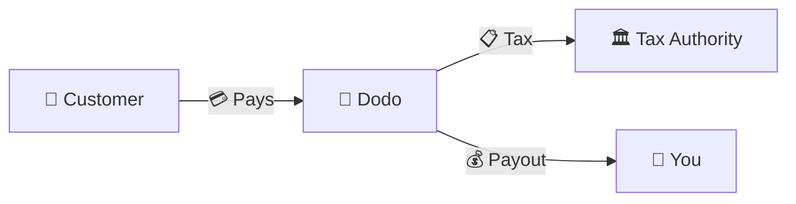
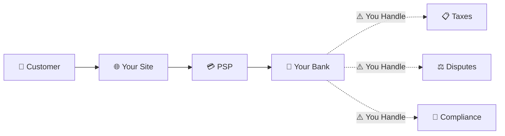
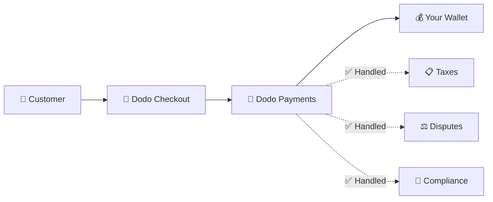
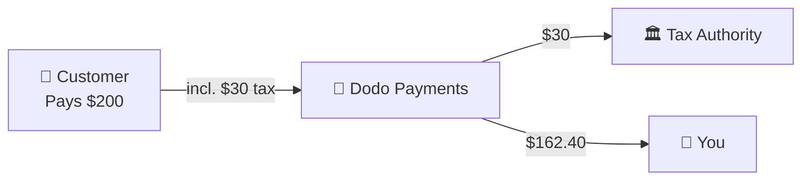

Dodo Payments opera como un **Merchant of Record (MoR)** — nos convertimos en el vendedor legal de tus productos digitales, asumiendo la responsabilidad de pagos, impuestos, fraudes y cumplimiento para que puedas concentrarte completamente en construir tu producto.

<CardGroup cols={3}>
<Card title="220+ Regiones" icon="globe">
Cumplimiento fiscal manejado automáticamente
</Card>

<Card title="30+ Métodos de Pago" icon="credit-card">
Tarjetas, billeteras y métodos locales
</Card>

<Card title="Cero Declaraciones de Impuestos" icon="file-invoice">
Nosotros manejamos todas las remesas
</Card>
</CardGroup>

## ¿Qué es un Merchant of Record?

Un **Merchant of Record** es la entidad legal que aparece en el estado de cuenta de la tarjeta de crédito de tu cliente y asume la responsabilidad de la transacción. Cuando usas Dodo Payments como tu MoR:

- **Nosotros somos el vendedor legal** — Dodo aparece en los estados de cuenta y recibos bancarios
- **Tú eres el creador del producto** — Tú construyes, pones precio y entregas tu producto
- **Nosotros manejamos la parte administrativa** — Impuestos, disputas, cumplimiento y soporte de facturación
- **Tú recibes pagos netos** — Ingresos depositados directamente en tu cuenta

<Note>
Piensa en un Merchant of Record como contratar un equipo financiero global que maneja la facturación, impuestos y cobros en cada país — sin que tú levantes un dedo.
</Note>

## ¿Por qué usar un Merchant of Record?

Vender productos digitales a nivel global significa navegar por el IVA en Europa, GST en Australia, Impuesto sobre Ventas en EE. UU. y innumerables otros requisitos. Cada jurisdicción tiene diferentes reglas, tasas, umbrales y plazos de presentación.

| Tu Responsabilidad | Sin MoR | Con Dodo como MoR |
|---------------------|:-----------:|:----------------:|
| Registro de IVA/GST | ❌ Tú | ✅ Dodo |
| Cálculo de Impuestos | ❌ Tú | ✅ Dodo |
| Presentación y Remesa de Impuestos | ❌ Tú | ✅ Dodo |
| Responsabilidad por Cargos Reversos | ❌ Tú | ✅ Dodo |
| Cumplimiento PCI | ❌ Tú | ✅ Dodo |
| Soporte Multimoneda | ❌ Complejo | ✅ Integrado |
| Métodos de Pago Locales | ❌ Integrar Cada Uno | ✅ 30+ Incluidos |

<Tip>
**Ejemplo**: ¿Vender una suscripción de €50/mes a un cliente francés?

**Sin MoR**: Registrarse para el IVA francés, cobrar €60 (20% IVA), presentar declaraciones trimestrales francesas, manejar auditorías—en francés.

**Con Dodo**: Nosotros cobramos €60, remitimos €10 de IVA a Francia y te pagamos €50 menos tarifas. Tú escribes código.
</Tip>

## PSP vs. MoR: Diferencias Clave

Entender la diferencia entre un **Proveedor de Servicios de Pago** (como Stripe) y un **Merchant of Record** es esencial.

### Proveedor de Servicios de Pago (PSP)

Un PSP procesa transacciones pero te deja como el vendedor legal:

<Warning>
Con un PSP, **tú** eres responsable del registro de impuestos, la recaudación, la presentación y la remesa en cada jurisdicción donde tengas clientes.
</Warning>

### Merchant of Record (Dodo)

Un MoR se convierte en el vendedor legal, manejando el cumplimiento de principio a fin:

<Check>
Con Dodo como MoR, manejamos impuestos, disputas y cumplimiento. Tú recibes pagos netos sin papeleo.
</Check>

### Comparación Lado a Lado

| Aspecto | PSP (Stripe, etc.) | MoR (Dodo) |
|--------|:------------------:|:----------:|
| Vendedor Legal | Tu Empresa | Dodo |
| En el Estado de Cuenta del Cliente | Tu Nombre | Dodo |
| Registro de Impuestos | ❌ Tú | ✅ Dodo |
| Cálculo de Impuestos | ❌ Tú | ✅ Dodo |
| Remesa de Impuestos | ❌ Tú | ✅ Dodo |
| Riesgo de Cargos Reversos | ❌ Tú | ✅ Dodo |
| Cumplimiento PCI | ❌ Tú | ✅ Dodo |
| Configuración para Global | Complejo | Simple |

<Info>
**Importante**: Tanto los PSP como los MoR manejan el procesamiento de pagos. La diferencia clave es **quién es legalmente responsable** del cumplimiento fiscal y la responsabilidad de la transacción.
</Info>

## Cómo Funciona el Cumplimiento Fiscal

Dodo maneja todo el ciclo de vida fiscal automáticamente:

<Steps>
<Step title="Ubicación del Cliente">
Detectamos el país del cliente y determinamos qué reglas fiscales se aplican — IVA, GST, Impuesto sobre Ventas u otros requisitos locales.
</Step>

<Step title="Cálculo de Tarifas">
La tasa de impuesto correcta se calcula en función del tipo de producto, la ubicación del cliente y el estado B2B/B2C. Los clientes comerciales de la UE con números de IVA válidos obtienen la aplicación de la inversión del cargo.
</Step>

<Step title="Recaudación en el Checkout">
El impuesto se muestra claramente y se recauda en el checkout. Los clientes ven exactamente lo que están pagando.
</Step>

<Step title="Presentación y Remesa">
Presentamos declaraciones y pagamos los impuestos recaudados a las autoridades correspondientes según lo programado. Nunca verás un formulario de impuestos.
</Step>
</Steps>

## Flujo de Ingresos

Así es como el dinero se mueve del cliente a tu cuenta:

### Ejemplo de Desglose de Pagos

| Concepto | Monto |
|-----------|-------:|
| Pago del Cliente | $200.00 |
| Impuesto sobre Ventas (15% IVA) | −$30.00 |
| Tarifa de Plataforma Dodo (4%) | −$8.00 |
| Procesamiento de Pagos | −$0.60 |
| **Tu Pago** | **$162.40** |

## Cuándo Elegir MoR vs. PSP

<Tabs>
<Tab title="Elegir Dodo (MoR)">
**Dodo Payments es ideal si tú:**

- Vendes productos digitales, SaaS o suscripciones
- Tienes clientes en múltiples países
- Quieres evitar dolores de cabeza con el registro fiscal
- Prefieres un cumplimiento predecible y externalizado
- Valoras la rapidez en el mercado sobre el control máximo
- No quieres gestionar disputas y fraudes
</Tab>

<Tab title="Considerar un PSP">
**Un PSP podría ser adecuado si tú:**

- Operas principalmente en un país
- Tienes equipos internos de finanzas y cumplimiento
- Necesitas control absoluto sobre la experiencia de checkout
- Trabajas con márgenes extremadamente ajustados
- Vendes bienes físicos (los MoRs se centran en lo digital)
</Tab>
</Tabs>

<Note>
Muchas empresas comienzan con un PSP y cambian a un MoR a medida que escalan internacionalmente. Dodo ofrece soporte de migración para hacer esta transición sin problemas.
</Note>

## Preguntas Frecuentes

<AccordionGroup>
<Accordion title="¿Qué aparece en el estado de cuenta de la tarjeta de crédito de mi cliente?">
Dodo Payments aparece como el comerciante. Incluimos tu referencia de producto/marca donde los límites de caracteres lo permiten, y los clientes reciben recibos detallados que muestran la información de tu producto.
</Accordion>

<Accordion title="¿Todavía poseo la relación con el cliente?">
Sí. Tú controlas los precios, la marca, la entrega del producto y la comunicación directa. Dodo maneja la mecánica de facturación, pero los clientes saben que están comprando de ti. Tu marca aparece de manera prominente en el checkout, correos electrónicos y facturas.
</Accordion>

<Accordion title="¿Cómo funciona la inversión del cargo del IVA B2B?">
Para ventas B2B en la UE, los clientes pueden ingresar su número de IVA en el checkout. Lo validamos y aplicamos la inversión del cargo automáticamente — el impuesto se traslada a la declaración de IVA del comprador en lugar de ser recaudado.
</Accordion>

<Accordion title="¿Puedo usar mi propio procesador de pagos?">
Dodo opera como una solución completa utilizando nuestra infraestructura de pagos. Esta integración es lo que nos permite asumir la responsabilidad fiscal y de fraude. Estamos trabajando en proporcionar una integración con otros procesadores de pagos en el futuro.
</Accordion>

<Accordion title="¿Cómo funcionan los reembolsos?">
Inicia reembolsos desde tu panel de control. Procesamos el reembolso en el método de pago y moneda originales del cliente. Los montos de impuestos se ajustan y concilian automáticamente.
</Accordion>

<Accordion title="¿Qué pasa con mi impuesto sobre la renta?">
Dodo maneja **impuestos sobre ventas** (IVA, GST, Impuesto sobre Ventas) en las transacciones de los clientes. Tú sigues siendo responsable del impuesto sobre la renta de tu negocio, impuesto corporativo y obligaciones fiscales sobre los pagos que recibes.
</Accordion>

<Accordion title="¿A qué países puedo vender?">
Aceptamos pagos de más de 220 países y regiones con expansión continua. Consulta la lista completa:

<Card title="Regiones Soportadas" icon="globe" href="/miscellaneous/list-of-countries-we-accept-payments-from">
Ver todos los 220+ países y regiones donde aceptamos pagos.
</Card>
</Accordion>
</AccordionGroup>

## Comenzar

<CardGroup cols={2}>
<Card title="Crear Cuenta" icon="rocket" href="https://app.dodopayments.com/signup">
Regístrate gratis y acepta pagos globales en minutos.
</Card>

<Card title="Profundización en MoR vs PG" icon="scale-balanced" href="/features/mor-vs-pg">
Comparación detallada con ejemplos y casos de uso.
</Card>

<Card title="Política de Aceptación" icon="building-shield" href="/miscellaneous/merchant-acceptance">
Aprende qué negocios apoyamos.
</Card>

<Card title="Habla con Nosotros" icon="envelope" href="mailto:founders@dodopayments.com">
Obtén orientación personalizada de nuestro equipo.
</Card>
</CardGroup>
