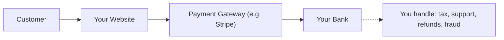
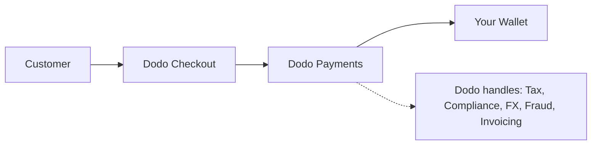

## Introducción

Esta guía compara el modelo MoR con el enfoque tradicional de Payment Gateway, ayudándote a entender las ventajas que Dodo Payments aporta a tu negocio.

## La Diferencia Principal

| Característica                     | MoR (Dodo Payments)         | Payment Gateway (PG Tradicional)           |
|------------------------------------|--------------------------------------------|--------------------------------------------|
| Vendedor Legal                     | Dodo Payments (MoR)                        | Tu Empresa                                 |
| Recaudación y Remisión de Impuestos| Manejado por Dodo                            | Tú eres responsable                         |
| Carga de Cumplimiento y Regulatoria| Dodo asume la responsabilidad              | Tú manejas las leyes locales y los contracargos |
| Moneda de Liquidación              | USD, EUR, INR y más de 25 otras soportadas | Depende de tu cuenta de comerciante        |
| Gestión de Riesgos                 | Protección contra fraudes y contracargos integrada | Tú configuras tus propias herramientas (por ejemplo, Stripe Radar) |
| Pagos                             | Pagos globales agregados y simplificados    | Directo del PG a ti, con configuración bancaria |

## Lo Que Significa Para Ti

Con **Dodo como MoR**, nos convertimos en el vendedor legal para tus clientes, permitiéndote:

- Omitir la configuración de entidades locales
- Evitar manejar IVA, GST o impuestos sobre ventas
- Ofrecer más métodos de pago a nivel global
- Reducir el riesgo legal
- Lanzar más rápido en nuevos mercados

<Note>
Imagina vender una suscripción digital a un usuario en Francia. Con Dodo Payments, cobramos el pago, declaramos el IVA ante las autoridades francesas y te enviamos los ingresos netos. Sin dolores de cabeza fiscales. Sin abogados. Solo crecimiento.
</Note>

Además, el modelo MoR simplifica toda tu oficina administrativa. Como tu MoR, Dodo maneja el cumplimiento PCI, la detección de fraudes, la conversión de divisas e incluso el soporte de facturación al cliente, liberando a tu equipo para que se enfoque en el producto y el crecimiento.

## Comparación Visual

**Flujo de Ingresos: Payment Gateway**

**Flujo de Ingresos: Merchant of Record (Dodo)**

## Por Qué Es Importante para SaaS y Empresas Digitales

A medida que tu negocio crece, gestionar impuestos, cumplimiento y preferencias de pago globales puede volverse abrumador. Con un payment gateway, eres responsable de:

- Registro y presentación de IVA/GST en múltiples jurisdicciones
- Manejo de conversión de divisas y contracargos
- Proporcionar un proceso de pago y métodos de pago localizados

Con Dodo Payments como tu MoR:
- Te expandes globalmente sin configurar entidades locales
- Los impuestos son calculados, recaudados y remitidos en tu nombre
- Obtienes acceso a una biblioteca de métodos de pago adaptados a tus clientes
- Actuamos como tu buffer legal y socio operativo

<Tip>
"Imagina una pasarela de pago como un túnel. Ahora imagina que el Comerciante de Registro es un túnel, tren, conductor y personal de emisión de billetes todo en uno."
</Tip>

## ¿Quién Debería Usar MoR?

Dodo Payments es perfecto para:
- Empresas de SaaS y productos digitales
- Creadores independientes y emprendedores solitarios
- Negocios globales con clientes en más de 100 países
- Empresas que no quieren gestionar impuestos y cumplimiento internamente

Si estás expandiéndote internacionalmente, vendiendo suscripciones o simplemente quieres reducir dolores de cabeza operativos, MoR es la opción más inteligente.

## Cuándo Usar un Payment Gateway en Su Lugar

Hay casos en los que usar solo un payment gateway puede tener sentido:
- Tu negocio opera solo en un país
- Ya tienes recursos internos de finanzas y cumplimiento
- Requieres control total sobre la experiencia de facturación del cliente
- Eres muy sensible a los costos con márgenes delgados a gran escala

<Note>
Para muchas startups, usar una pasarela puede ser suficiente al principio; pero a medida que la complejidad crece, cambiar a un MoR puede ahorrar tiempo, reducir riesgos y acelerar el crecimiento internacional.
</Note>

## Por Qué Elegir Dodo Payments

Dodo Payments ofrece:
- Una solución integral de pagos, impuestos y cumplimiento
- Soporte en tiempo real para FX y múltiples divisas
- Acceso a más de 30 métodos de pago
- Facturación basada en asientos, suscripciones y pagos únicos
- Manejo automatizado de impuestos en más de 150 países
- Prevención de fraudes integrada y cumplimiento PCI

Ya seas un fundador solitario o un equipo de SaaS en crecimiento, Dodo simplifica las complejidades de vender a nivel global.

## Aprende Más

<CardGroup cols={2}>
<Card title="Adaptive Currency Support" icon="money-bill-wave" href="/features/adaptive-currency">
Descubre cómo Dodo presenta automáticamente los precios en las divisas locales de tus clientes
</Card>

<Card title="Supported Payment Methods" icon="credit-card" href="/features/payment-methods">
Descubre los más de 30 métodos de pago disponibles a través de Dodo Payments
</Card>
</CardGroup>

## ¿Listo para Cambiar?

Únete a más de 3,000 negocios digitales que utilizan Dodo Payments para vender a nivel global, sin fronteras ni cuellos de botella.

<CardGroup cols={2}>
<Card title="Sign Up Free" icon="user-plus" href="https://app.dodopayments.com/signup">
Crea tu cuenta de Dodo Payments y comienza a vender globalmente hoy mismo
</Card>

<Card title="Talk to Sales" icon="envelope" href="mailto:founders@dodopayments.com">
Obtén orientación personalizada de nuestro equipo
</Card>
</CardGroup>

<Tip>
Deja que Dodo se encargue de lo difícil para que tú puedas concentrarte en crear un gran producto.
</Tip>