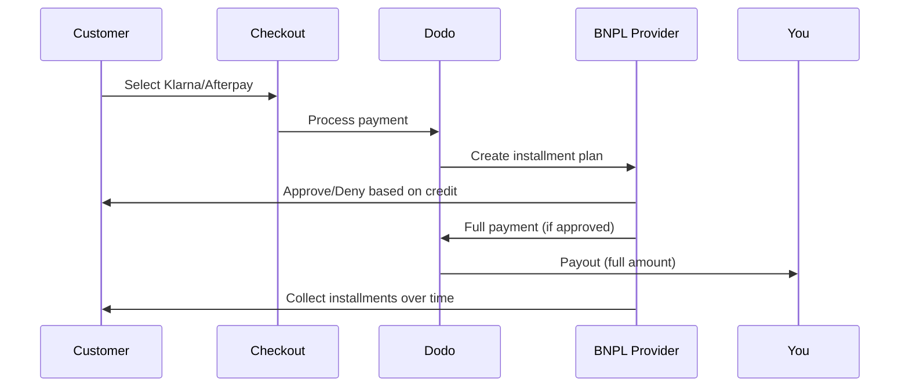

Compra Ahora, Paga Después (BNPL) permite a los clientes dividir compras en cuotas sin intereses, aumentando el valor promedio del pedido en un 20-50% y las tasas de conversión en un 10-30% para transacciones elegibles.

## ¿Por qué ofrecer BNPL?

<CardGroup cols={3}>
<Card title="Mayor AOV" icon="chart-line">
Los clientes gastan más cuando pueden distribuir los pagos en el tiempo. El valor promedio del pedido aumenta entre 20 y 50%.
</Card>

<Card title="Mejor Conversión" icon="percent">
Eliminando la fricción de pago al finalizar la compra. Las tasas de conversión mejoran entre 10 y 30% para artículos de alto precio.
</Card>

<Card title="Cero Riesgo" icon="shield-check">
Los proveedores de BNPL manejan el riesgo crediticio y las cobranzas. Recibes el pago completo por adelantado.
</Card>
</CardGroup>

## Proveedores Soportados

### Klarna

| Característica | Detalles |
| :------ | :------ |
| **Disponibilidad** | EE. UU. + 19 países europeos |
| **Monedas** | USD, EUR, GBP, DKK, NOK, SEK, CZK, RON, PLN, CHF |
| **Mínimo** | $50.01 (o equivalente) |
| **Suscripciones** | No |

**Países Soportados:** Austria, Bélgica, República Checa, Dinamarca, Finlandia, Francia, Alemania, Grecia, Irlanda, Italia, Países Bajos, Noruega, Polonia, Portugal, Rumanía, España, Suecia, Suiza, Reino Unido, Estados Unidos

**Opciones de Pago:**
- **Paga en 4** — Divide en 4 pagos sin intereses
- **Paga en 30 días** — El pago total vence en 30 días
- **Financiamiento** — Planes de pago a largo plazo

### Afterpay (Clearpay)

| Característica | Detalles |
| :------ | :------ |
| **Disponibilidad** | EE. UU., Reino Unido |
| **Monedas** | USD, GBP |
| **Mínimo** | $50.01 (o equivalente) |
| **Suscripciones** | No |

**Opciones de Pago:**
- **Paga en 4** — 4 pagos sin intereses cada 2 semanas

<Note>
En el Reino Unido, Afterpay opera como "Clearpay" pero utiliza el mismo tipo de API (`afterpay_clearpay`).
</Note>

### Billie

| Característica | Detalles |
| :------ | :------ |
| **Disponibilidad** | Global |
| **Monedas** | GBP |
| **Mínimo** | Ninguno |
| **Suscripciones** | No |

**Acerca de Billie:**
Billie es una solución B2B de Compra Ahora, Paga Después que permite a las empresas ofrecer términos de pago flexibles a sus clientes. Está diseñada para transacciones entre empresas donde los compradores necesitan opciones de pago basadas en facturas.

**Opciones de Pago:**
- **Pago por Factura** — Pagar dentro de los términos de pago acordados
- **Términos Flexibles** — Horarios de pago amigables para negocios

## Configuración

### Tipos de Métodos API

| Tipo | Proveedor |
| :--- | :------- |
| `klarna` | Klarna |
| `afterpay_clearpay` | Afterpay / Clearpay |
| `billie` | Billie (B2B) |

### Ejemplo

```javascript
const session = await client.checkoutSessions.create({
  product_cart: [{ product_id: 'prod_123', quantity: 1 }],
  allowed_payment_method_types: [
    'klarna',
    'afterpay_clearpay',
    'credit',
    'debit'
  ],
  customer: {
    email: 'customer@example.com',
    name: 'Jane Smith'
  },
  billing_address: {
    country: 'US',
    zipcode: '10001'
  },
  return_url: 'https://example.com/success'
});
```

<Warning>
Siempre incluye `credit` y `debit` como alternativas. No todos los clientes son elegibles para BNPL, y las transacciones por debajo de $50.01 no calificarán.
</Warning>

## Monto Mínimo de Transacción

**Tanto Klarna como Afterpay requieren un mínimo de $50.01 USD** (o equivalente en monedas soportadas).

Las transacciones por debajo de este umbral:
- Las opciones de BNPL no aparecerán en la caja
- No se genera un error: las opciones simplemente no aparecen
- Los pagos con tarjeta siguen disponibles

Este comportamiento es esperado. No incluyas BNPL en `allowed_payment_method_types` para productos de menos de $50.

## Cómo Funciona las Instalaciones



**Puntos clave:**
- Recibes el **pago completo por adelantado** del proveedor de BNPL
- El proveedor de BNPL maneja el **riesgo crediticio y las cobranzas**
- El cliente paga directamente al proveedor en **4 cuotas** (típicamente)
- **Sin contracargos** por fallos en las cuotas — ese es el riesgo del proveedor

## Pruebas

### Datos de Prueba de Klarna

Utiliza estos detalles en modo prueba:

| Campo | Aprobado | Denegado |
| :---- | :------- | :----- |
| **Fecha de Nacimiento** | 07-10-1970 | 07-10-1970 |
| **Nombre** | Prueba | Prueba |
| **Apellido** | Persona-us | Persona-us |
| **Email** | customer@email.us | customer+denied@email.us |
| **Calle** | Amsterdam Ave | Amsterdam Ave |
| **Número de Casa** | 509 | 509 |
| **Ciudad** | Nueva York | Nueva York |
| **Estado** | Nueva York | Nueva York |
| **Código Postal** | 10024-3941 | 10024-3941 |
| **Teléfono** | +13106683312 | +13106354386 |

<Note>
La transacción debe ser de al menos $50 para que Klarna aparezca como una opción.
</Note>

### Pruebas de Afterpay

<Steps>
<Step title="Seleccionar Afterpay">
Elige Afterpay en la caja y haz clic en Pagar.
</Step>

<Step title="Pago exitoso">
Utiliza cualquier email y dirección de envío válidos.
</Step>

<Step title="Fallo en la autenticación">
Para probar la falla: cierra el modal de Afterpay en la página de redirección. El estado de pago cambia a `requires_payment_method`.
</Step>
</Steps>

## Mejores Prácticas

<AccordionGroup>
<Accordion title="Orientar artículos de alto costo">
BNPL funciona mejor para productos de $100-$1000. La propuesta de valor de "pagar a plazos" es más convincente en este rango.
</Accordion>

<Accordion title="Mostrar montos de cuotas">
"4 pagos de $25" es más atractivo que "$100 con Klarna". Muestra el monto por pago cuando sea posible.
</Accordion>

<Accordion title="No forzar BNPL para productos de bajo valor">
Por debajo de $50, BNPL no aparecerá de todos modos. Por debajo de $100, la mayoría de los clientes prefieren tarjetas. Enfoca la promoción de BNPL en artículos de precio más alto.
</Accordion>

<Accordion title="Recopilar dirección de facturación">
Los proveedores de BNPL requieren información de facturación para verificaciones de crédito. Asegúrate de que tu caja recopile detalles completos de dirección.
</Accordion>

<Accordion title="Establecer expectativas claras">
Los clientes deben entender que están ingresando en un acuerdo crediticio con Klarna/Afterpay, no contigo.
</Accordion>
</AccordionGroup>

## Limitaciones

### Sin Suscripciones
Los métodos de pago de BNPL **no soportan pagos recurrentes**. Para productos de suscripción, utiliza tarjetas u otros métodos compatibles con recurrentes.

### Aprobación Basada en Crédito
Los proveedores de BNPL realizan verificaciones de crédito instantáneas. No todos los clientes serán aprobados. Las tasas de aprobación varían por:
- Historia crediticia del cliente con el proveedor
- Monto de la transacción
- Ubicación del cliente

### Restricciones de Monedas
| Proveedor | Monedas |
| :------- | :--------- |
| Klarna | USD, EUR, GBP, DKK, NOK, SEK, CZK, RON, PLN, CHF |
| Afterpay | USD, GBP |

## Solución de Problemas

<AccordionGroup>
<Accordion title="BNPL no aparece en la caja">
**Verifica:**
1. ¿Monto de transacción al menos $50.01?
2. ¿Ubicación del cliente en país soportado?
3. ¿Moneda soportada por el proveedor de BNPL?
4. ¿Método de BNPL incluido en `allowed_payment_method_types`?

**Solución:** La mayoría de las veces, la transacción está por debajo del mínimo. Verifica que el monto cumpla con el umbral de $50.01.
</Accordion>

<Accordion title="Cliente denegado por proveedor de BNPL">
**Causas:**
- Historia crediticia insuficiente con el proveedor
- Demasiados planes de instalación activos
- Fallo en la verificación de identidad

**Solución:** Esto es esperado para algunos clientes. Asegúrate de que las alternativas con tarjeta estén disponibles. No expongas razones específicas de denegación.
</Accordion>

<Accordion title="Pago atrapado en pendiente">
**Causa:** El cliente no completó el proceso de autenticación con el proveedor de BNPL.

**Solución:** El pago se agota y falla. El cliente puede reintentar o usar un método diferente.
</Accordion>
</AccordionGroup>

## Páginas Relacionadas

<CardGroup cols={2}>
<Card title="Visión General de Métodos de Pago" icon="credit-card" href="/features/payment-methods">
Consulta todos los métodos de pago soportados.
</Card>

<Card title="Guía de Finalización" icon="book" href="/developer-resources/checkout-session">
Guía completa de implementación de la caja.
</Card>

<Card title="Proceso de Pruebas" icon="flask" href="/miscellaneous/testing-process">
Todos los datos de prueba para métodos de pago.
</Card>

<Card title="Moneda Adaptativa" icon="globe" href="/features/adaptive-currency">
Soporte y conversión de moneda.
</Card>
</CardGroup>