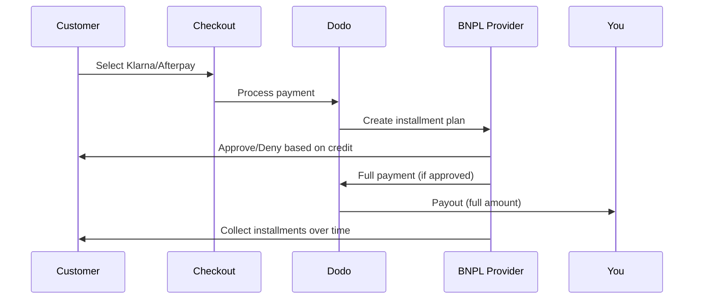

Compra Ahora, Paga Después (BNPL) permite a los clientes dividir compras en cuotas sin intereses, aumentando el valor promedio del pedido en un 20-50% y las tasas de conversión en un 10-30% para transacciones elegibles.

## ¿Por qué ofrecer BNPL?

<CardGroup cols={3}>
Los clientes gastan más cuando pueden distribuir los pagos en el tiempo. El valor promedio de pedido aumenta entre 20 y 50%.
</Card>

{/* LOCKED_PATTERN_b8dc04ad87db956cb850399b43c82817 */}
Eliminar la fricción de pago en el checkout. Las tasas de conversión mejoran entre 10 y 30% para artículos de alto valor.
</Card>

{/* LOCKED_PATTERN_e1c4683cab6a6bdfa91140cb62e2921c */}
Los proveedores BNPL manejan el riesgo crediticio y la cobranza. Usted recibe el pago completo por adelantado.
</Card>
</CardGroup>

## Proveedores Soportados

### Klarna

| Característica | Detalles |
| :------ | :------ |
| **Disponibilidad** | EE. UU. + 19 países europeos |
| **Monedas** | USD, EUR, GBP, DKK, NOK, SEK, CZK, RON, PLN, CHF |
| **Mínimo** | $50.01 (o equivalente) |
| **Suscripciones** | No |

**Países Soportados:** Austria, Bélgica, República Checa, Dinamarca, Finlandia, Francia, Alemania, Grecia, Irlanda, Italia, Países Bajos, Noruega, Polonia, Portugal, Rumanía, España, Suecia, Suiza, Reino Unido, Estados Unidos

**Opciones de Pago:**
- **Paga en 4** — Divide en 4 pagos sin intereses
- **Paga en 30 días** — El pago total vence en 30 días
- **Financiamiento** — Planes de pago a largo plazo

### Afterpay (Clearpay)

| Característica | Detalles |
| :------ | :------ |
| **Disponibilidad** | EE. UU., Reino Unido |
| **Monedas** | USD, GBP |
| **Mínimo** | $50.01 (o equivalente) |
| **Suscripciones** | No |

**Opciones de Pago:**
- **Paga en 4** — 4 pagos sin intereses cada 2 semanas

<Note>
En el Reino Unido, Afterpay opera como "Clearpay" pero utiliza el mismo tipo de API (`afterpay_clearpay`).
</Note>

### Billie

| Característica | Detalles |
| :------ | :------ |
| **Disponibilidad** | Global |
| **Monedas** | GBP |
| **Mínimo** | Ninguno |
| **Suscripciones** | No |

**Acerca de Billie:**
Billie es una solución B2B de Compra Ahora, Paga Después que permite a las empresas ofrecer términos de pago flexibles a sus clientes. Está diseñada para transacciones entre empresas donde los compradores necesitan opciones de pago basadas en facturas.

**Opciones de Pago:**
- **Pago por Factura** — Pagar dentro de los términos de pago acordados
- **Términos Flexibles** — Horarios de pago amigables para negocios

## Configuración

### Tipos de Métodos API

| Tipo | Proveedor |
| :--- | :------- |
| `klarna` | Klarna |
| `afterpay_clearpay` | Afterpay / Clearpay |
| `billie` | Billie (B2B) |

### Ejemplo

```javascript
const session = await client.checkoutSessions.create({
  product_cart: [{ product_id: 'prod_123', quantity: 1 }],
  allowed_payment_method_types: [
    'klarna',
    'afterpay_clearpay',
    'credit',
    'debit'
  ],
  customer: {
    email: 'customer@example.com',
    name: 'Jane Smith'
  },
  billing_address: {
    country: 'US',
    zipcode: '10001'
  },
  return_url: 'https://example.com/success'
});
```

<Warning>
Incluya siempre `credit` e `debit` como alternativas. No todos los clientes son elegibles para BNPL, y las transacciones inferiores a $50.01 no califican.
</Warning>

## Monto Mínimo de Transacción

**Tanto Klarna como Afterpay requieren un mínimo de $50.01 USD** (o equivalente en monedas soportadas).

Las transacciones por debajo de este umbral:
- Las opciones de BNPL no aparecerán en la caja
- No se genera un error: las opciones simplemente no aparecen
- Los pagos con tarjeta siguen disponibles

Este es un comportamiento esperado. No incluya BNPL en `allowed_payment_method_types` para productos inferiores a $50.

## Cómo Funciona las Instalaciones



**Puntos clave:**
- Recibes el **pago completo por adelantado** del proveedor de BNPL
- El proveedor de BNPL maneja el **riesgo crediticio y las cobranzas**
- El cliente paga directamente al proveedor en **4 cuotas** (típicamente)
- **Sin contracargos** por fallos en las cuotas — ese es el riesgo del proveedor

## Pruebas

### Datos de Prueba de Klarna

Utiliza estos detalles en modo prueba:

| Campo | Aprobado | Denegado |
| :---- | :------- | :----- |
| **Fecha de Nacimiento** | 07-10-1970 | 07-10-1970 |
| **Nombre** | Prueba | Prueba |
| **Apellido** | Persona-us | Persona-us |
| **Email** | customer@email.us | customer+denied@email.us |
| **Calle** | Amsterdam Ave | Amsterdam Ave |
| **Número de Casa** | 509 | 509 |
| **Ciudad** | Nueva York | Nueva York |
| **Estado** | Nueva York | Nueva York |
| **Código Postal** | 10024-3941 | 10024-3941 |
| **Teléfono** | +13106683312 | +13106354386 |

<Note>
La transacción debe ser al menos $50 para que Klarna aparezca como opción.
</Note>

### Pruebas de Afterpay

<Steps>
{/* LOCKED_PATTERN_50be67b06aca0719749c0148b14ededb */}
Elija Afterpay en el checkout y haga clic en Pagar.
</Step>

{/* LOCKED_PATTERN_e69c9723c2cfe705ec0ec6c279278116 */}
Use cualquier correo electrónico y dirección de envío válidos.
</Step>

{/* LOCKED_PATTERN_f705651ecb928289d18b7053fe33fbad */}
Para probar una falla: cierre el modal de Afterpay en la página de redirección. El estado del pago cambia a `requires_payment_method`.
</Step>
</Steps>

## Mejores Prácticas

<AccordionGroup>
{/* LOCKED_PATTERN_fbd77987b33e84be7392d40b156b399b */}
BNPL funciona mejor para productos de $100 a $1000. La propuesta de valor de "pagar a plazos" es más atractiva en este rango.
</Accordion>

{/* LOCKED_PATTERN_73212def30811547cb4565bbe3cf9728 */}
"4 pagos de $25" es más atractivo que "$100 con Klarna". Muestre el importe por pago cuando sea posible.
</Accordion>

{/* LOCKED_PATTERN_b91d7612271491e0d73908c4d5f59440 */}
Por debajo de $50, BNPL no aparece de todos modos. Por debajo de $100, la mayoría de los clientes prefieren tarjetas. Centre la promoción de BNPL en artículos de mayor valor.
</Accordion>

{/* LOCKED_PATTERN_09f1d72b973f5ae340cb9d61176e092c */}
Los proveedores BNPL requieren información de facturación para las verificaciones de crédito. Asegúrese de que su checkout recoja los detalles completos de la dirección.
</Accordion>

{/* LOCKED_PATTERN_40dceba4d9d5358ae7f9b7ccd887c8b1 */}
Los clientes deben entender que están entrando en un contrato de crédito con Klarna/Afterpay, no con usted.
</Accordion>
</AccordionGroup>

## Limitaciones

### Sin Suscripciones
Los métodos de pago de BNPL **no soportan pagos recurrentes**. Para productos de suscripción, utiliza tarjetas u otros métodos compatibles con recurrentes.

### Aprobación Basada en Crédito
Los proveedores de BNPL realizan verificaciones de crédito instantáneas. No todos los clientes serán aprobados. Las tasas de aprobación varían por:
- Historia crediticia del cliente con el proveedor
- Monto de la transacción
- Ubicación del cliente

### Mapeo de monedas y países

Cada moneda está restringida a su región correspondiente:

| Moneda | Países compatibles |
| :------- | :------------------ |
| **USD** | United States only |
| **EUR** | All supported European countries (Austria, Belgium, Czech Republic, Denmark, Finland, France, Germany, Greece, Ireland, Italy, Netherlands, Norway, Poland, Portugal, Romania, Spain, Sweden, Switzerland) |
| **GBP** | United Kingdom and all supported European countries |

Otras monedas compatibles con Klarna (DKK, NOK, SEK, CZK, RON, PLN, CHF) funcionan en sus respectivos países.

{/* LOCKED_PATTERN_6fa96040307d68e9fa44436559d63ee8 */}
Por ejemplo, una transacción en USD solo mostrará opciones BNPL a clientes en Estados Unidos. Una transacción en EUR mostrará opciones BNPL en todos los países europeos compatibles. Una transacción en GBP mostrará opciones BNPL a clientes en el Reino Unido y en todos los países europeos compatibles.
{/* LOCKED_PATTERN_07427f62e4e59df6149fbd24d60de439 */}

| Proveedor | Monedas compatibles |
| :------- | :------------------- |
| Klarna | USD, EUR, GBP, DKK, NOK, SEK, CZK, RON, PLN, CHF |
| Afterpay | USD (US), GBP (UK) |

## Solución de problemas

<AccordionGroup>
{/* LOCKED_PATTERN_4de1f796f92552e68d790659c1400cdb */}
**Verificar:**
1. ¿Monto de la transacción al menos $50.01?
2. ¿Ubicación del cliente en un país compatible?
3. ¿Moneda compatible con el proveedor BNPL?
4. ¿Método BNPL incluido en `allowed_payment_method_types`?

**Solución:** Por lo general, la transacción está por debajo del mínimo. Verifique que el monto cumpla el umbral de $50.01.
</Accordion>

{/* LOCKED_PATTERN_d83228e73178d33af019cc137eea6331 */}
**Causas:**
- Historial crediticio insuficiente con el proveedor
- Demasiados planes de cuotas activos
- Verificación de identidad fallida

**Solución:** Esto es esperable para algunos clientes. Asegúrese de que haya alternativas con tarjeta disponibles. No revele razones específicas del rechazo.
</Accordion>

{/* LOCKED_PATTERN_b83fcfa7ee1d57953629ef78553f40c7 */}
**Causa:** El cliente no completó el flujo de autenticación con el proveedor BNPL.

**Solución:** El pago agotará el tiempo y fallará. El cliente puede reintentar o usar otro método.
</Accordion>
</AccordionGroup>

## Páginas relacionadas

<CardGroup cols={2}>
{/* LOCKED_PATTERN_014d7e4ef5d99df996cbbae24da710a6 */}
Vea todos los métodos de pago compatibles.
</Card>

{/* LOCKED_PATTERN_15f99901a394e4ce133a078d90e6360d */}
Guía completa de implementación del checkout.
</Card>

{/* LOCKED_PATTERN_969f11f876a6712c92c3c11cb433bf1f */}
Todos los datos de prueba para los métodos de pago.
</Card>

{/* LOCKED_PATTERN_0da642f750ba9399c6c82f3cf51c812c */}
Compatibilidad de monedas y conversión.
</Card>
</CardGroup>