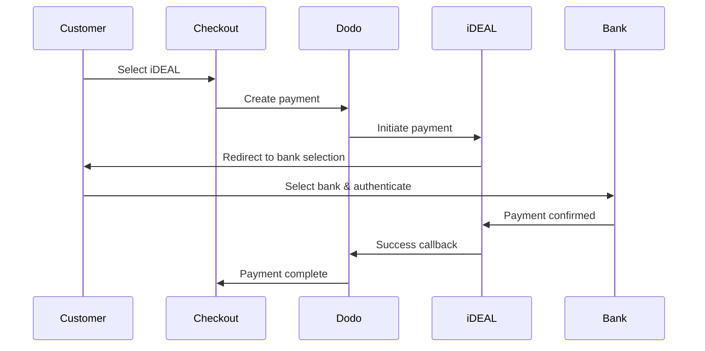

Los clientes europeos prefieren en gran medida los métodos de pago locales que se integran con sus sistemas bancarios. Ofrecer estos métodos puede aumentar las tasas de conversión entre un 20 y un 40 % en los mercados objetivo.

## ¿Por qué Métodos de Pago Europeos Locales?

<CardGroup cols={3}>
{/* LOCKED_PATTERN_efcf455d16a3d54177d3ce475c882342 */}
iDEAL captura ~60 % de los pagos online en los Países Bajos. No ofrecerlo implica perder clientes.
</Card>

{/* LOCKED_PATTERN_6b22bf3bf0cf724ac8ed217c65843a32 */}
Los pagos autenticados por el banco tienen tasas de fraude casi nulas y no generan contracargos.
</Card>

{/* LOCKED_PATTERN_4a1acead7202a8a596c7a76e46cacb00 */}
La mayoría de los métodos europeos proporcionan confirmación de pago instantánea.
</Card>
</CardGroup>

## Métodos Soportados

| Método | País | Cuota de Mercado | Moneda | Suscripciones |
| :----- | :------ | :----------- | :------- | :-----------: |
| **iDEAL** | Países Bajos | ~60% | EUR | No |
| **Bancontact** | Bélgica | ~50% | EUR | No |
| **EPS** | Austria | ~30% | EUR | No |
| **Multibanco** | Portugal | ~40% | EUR | No |

## iDEAL (Países Bajos)

iDEAL es el método de pago en línea dominante en los Países Bajos, conectándose directamente a todos los principales bancos neerlandeses.

### Cómo Funciona



### Bancos Soportados

Todos los principales bancos neerlandeses son compatibles:
- ABN AMRO
- ASN Bank
- Bunq
- ING
- Knab
- Rabobank
- RegioBank
- Revolut
- SNS
- Triodos Bank
- Van Lanschot

### Configuración

```javascript
const session = await client.checkoutSessions.create({
  product_cart: [{ product_id: 'prod_123', quantity: 1 }],
  allowed_payment_method_types: ['ideal', 'credit', 'debit'],
  billing_currency: 'EUR',
  billing_address: {
    country: 'NL',
    zipcode: '1012JS'
  },
  return_url: 'https://example.com/success'
});
```

## Bancontact (Bélgica)

Bancontact es el esquema de pago nacional de Bélgica, utilizado por prácticamente todos los bancos belgas para pagos en línea.

### Características
- Funciona con las tarjetas de débito belgas existentes
- Soporte de aplicación móvil (Payconiq de Bancontact)
- Confirmación instantánea del pago
- No se necesita registro adicional para los clientes

### Configuración

```javascript
const session = await client.checkoutSessions.create({
  product_cart: [{ product_id: 'prod_123', quantity: 1 }],
  allowed_payment_method_types: ['bancontact_card', 'credit', 'debit'],
  billing_currency: 'EUR',
  billing_address: {
    country: 'BE',
    zipcode: '1000'
  },
  return_url: 'https://example.com/success'
});
```

## EPS (Austria)

EPS (Estándar de Pago Electrónico) permite transferencias bancarias en línea directas para clientes austriacos.

### Características
- Integración directa con bancos austriacos
- Confirmación de pago en tiempo real
- Alta confianza entre los consumidores austriacos
- Sin contracargos

### Bancos Soportados

Bancos austriacos importantes, incluyendo:
- Erste Bank
- Bank Austria
- Raiffeisen
- BAWAG
- Volksbank

### Configuración

```javascript
const session = await client.checkoutSessions.create({
  product_cart: [{ product_id: 'prod_123', quantity: 1 }],
  allowed_payment_method_types: ['eps', 'credit', 'debit'],
  billing_currency: 'EUR',
  billing_address: {
    country: 'AT',
    zipcode: '1010'
  },
  return_url: 'https://example.com/success'
});
```

## Multibanco (Portugal)

Multibanco es la red interbancaria de Portugal, que ofrece tanto pagos en línea como pagos basados en cajeros automáticos.

### Opciones de Pago

1. **Banca en Línea** — Transferencia bancaria directa a través de la banca por internet
2. **Pago en Cajero Automático** — El cliente recibe una referencia para pagar en cualquier cajero automático Multibanco
3. **Banca Móvil** — Pago a través de aplicaciones móviles de bancos

### Cómo Funciona el Pago en Cajero Automático

Para los pagos en cajero automático, los clientes reciben una referencia de pago:

```
Entity: 12345
Reference: 123 456 789
Amount: €50.00
Expiry: 24 hours
```

El cliente puede pagar en cualquier cajero automático portugués o a través de la banca en línea utilizando esta referencia.

### Configuración

```javascript
const session = await client.checkoutSessions.create({
  product_cart: [{ product_id: 'prod_123', quantity: 1 }],
  allowed_payment_method_types: ['multibanco', 'credit', 'debit'],
  billing_currency: 'EUR',
  billing_address: {
    country: 'PT',
    zipcode: '1000-001'
  },
  return_url: 'https://example.com/success'
});
```

<Note>
Los pagos con Multibanco desde cajeros pueden tener un retraso entre el pago en el carrito y el pago real. Supervisa los webhooks para confirmar el pago.
</Note>

## Tipos de Métodos API

| Tipo | Método | País |
| :--- | :----- | :------ |
| `ideal` | iDEAL | Países Bajos |
| `bancontact_card` | Bancontact | Bélgica |
| `eps` | EPS | Austria |
| `multibanco` | Multibanco | Portugal |

## Checkout Europeo Multipaís

Para empresas que atienden a múltiples países europeos, incluye todos los métodos regionales:

```javascript
const session = await client.checkoutSessions.create({
  product_cart: [{ product_id: 'prod_123', quantity: 1 }],
  allowed_payment_method_types: [
    'ideal',           // Netherlands
    'bancontact_card', // Belgium
    'eps',             // Austria
    'multibanco',      // Portugal
    'credit',          // Fallback
    'debit'            // Fallback
  ],
  billing_currency: 'EUR',
  return_url: 'https://example.com/success'
});
```

Dodo muestra automáticamente solo los métodos relevantes según la ubicación del cliente. Un cliente neerlandés verá iDEAL; un cliente belga verá Bancontact.

## Pruebas

Los métodos de pago europeos pueden probarse en el modo sandbox. El flujo de prueba simula el proceso de autenticación bancaria.

<Steps>
{/* LOCKED_PATTERN_540056f13df545529727751bb5b93f77 */}
Usa tus claves de API de prueba de Dodo Payments.
</Step>

{/* LOCKED_PATTERN_7920d15f7caeeea70ea62bd0d8d57403 */}
Configura el país de la dirección de facturación para que coincida con el método de pago:
- `NL` para iDEAL
- `BE` para Bancontact
- `AT` para EPS
- `PT` para Multibanco
</Step>

{/* LOCKED_PATTERN_69cef9ebb6025284f3e6858b286f99d9 */}
Sigue el flujo simulado de autenticación bancaria en el entorno de pruebas.
</Step>
</Steps>

## Mejores Prácticas

<AccordionGroup>
{/* LOCKED_PATTERN_6e39e352c5d82a18aefb4abc54215eac */}
Si vendes a clientes neerlandeses, incluye iDEAL. No hacerlo es como no aceptar Visa en EE. UU.: perderás ventas significativas.
</Accordion>

{/* LOCKED_PATTERN_9c635a5b2c09ad8acceb0ae222fad819 */}
Los métodos de pago europeos requieren EUR. Asegúrate de que tus precios admitan transacciones en euros.
</Accordion>

{/* LOCKED_PATTERN_5a50cae3439b9921374aaa8c0461b4a3 */}
Todos los métodos europeos implican redirecciones a sitios bancarios. Asegúrate de que el manejo de la URL de retorno sea sólido y tenga en cuenta a los usuarios que abandonen el flujo a mitad.
</Accordion>

{/* LOCKED_PATTERN_3a32b87fb89df99c7fb6cbcd532fcd01 */}
No todos los clientes europeos tienen acceso a estos métodos regionales (turistas, expatriados, etc.). Siempre incluye `credit` e `debit` como alternativas.
</Accordion>

{/* LOCKED_PATTERN_f4321c6674f862219007fe7c6201edc2 */}
Los pagos desde cajeros Multibanco pueden tardar horas en completarse. No bloquees el cumplimiento porque el pago no sea inmediato: usa webhooks para la confirmación asíncrona.
</Accordion>
</AccordionGroup>

## Resolución de Problemas

<AccordionGroup>
{/* LOCKED_PATTERN_ccd66af742dc9530dea0480f544f049c */}
**Verifica:**
1. ¿El país de facturación del cliente coincide con el del método?
2. ¿La moneda está configurada en EUR?
3. ¿El método está incluido en `allowed_payment_method_types`?

**Solución:** Los métodos europeos son estrictamente regionales. Un cliente con país de facturación `DE` (Alemania) no verá iDEAL, que es exclusivo de los Países Bajos.
</Accordion>

{/* LOCKED_PATTERN_e65da29a30abf8b0bab16429c0abbf51 */}
**Causas:**
- El cliente canceló durante la autenticación bancaria
- El sistema de autenticación del banco estuvo temporalmente no disponible
- El cliente ingresó credenciales incorrectas

**Solución:** El cliente debe intentarlo nuevamente. Si persiste, sugiérele probar con otro método de pago.
</Accordion>

{/* LOCKED_PATTERN_6ec718ef8b359d908bb220922e56ef7a */}
**Causas:**
- El cliente cerró el navegador durante la redirección bancaria
- Problemas de red durante la autenticación
- URL de retorno mal configurada

**Solución:** Verifica que la URL de retorno sea correcta y accesible. Asegúrate de que maneje tanto los estados de éxito como de fallo.
</Accordion>

{/* LOCKED_PATTERN_fc8a3a43e2635e2d30bc6ced94d88e30 */}
**Causa:** El cliente recibió la referencia de pago pero aún no ha pagado.

**Solución:** Esto es esperado para pagos basados en cajeros. Espera la confirmación del webhook. La referencia generalmente caduca entre 24 y 72 horas.
</Accordion>
</AccordionGroup>

## Cumplimiento PSD2

Todos los métodos de pago europeos cumplen con las regulaciones PSD2 (Directiva de Servicios de Pago 2):

- **Autenticación Fuerte de Clientes (SCA)** — Integrada en el flujo de autenticación bancaria
- **Comunicación Segura** — Todos los datos transmitidos a través de canales seguros
- **Protección del Consumidor** — Cumplimiento completo de los derechos del consumidor de la UE

## Páginas Relacionadas

<CardGroup cols={2}>
{/* LOCKED_PATTERN_014d7e4ef5d99df996cbbae24da710a6 */}
Consulta todos los métodos de pago compatibles.
</Card>

{/* LOCKED_PATTERN_0da642f750ba9399c6c82f3cf51c812c */}
Compatibilidad de monedas y conversión automática.
</Card>

{/* LOCKED_PATTERN_15f99901a394e4ce133a078d90e6360d */}
Guía completa de implementación del proceso de pago.
</Card>

<Card title="Webhooks" icon="webhook" href="/developer-resources/webhooks">
Gestiona las confirmaciones de pago de forma asíncrona.
</Card>
</CardGroup>