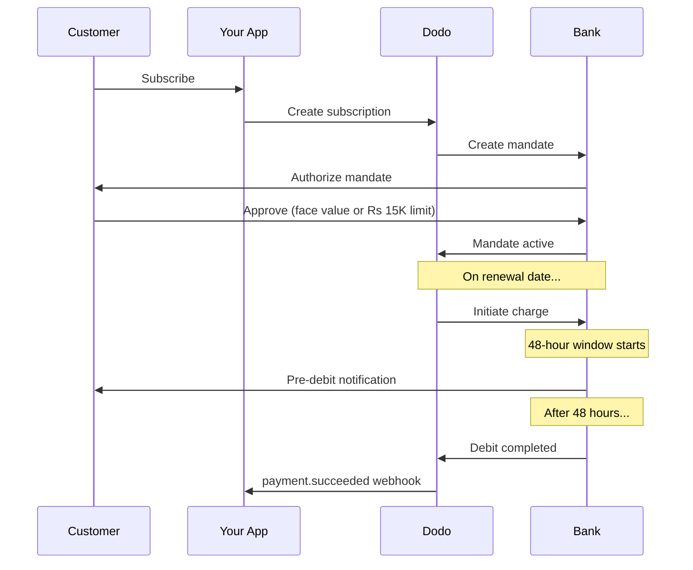

India tiene una infraestructura de pago única dominada por UPI (más del 60% de las transacciones digitales) y tarjetas Rupay. Dodo Payments soporta ambos con plena conformidad con RBI para los mandatos de suscripción.

## Por qué importan los métodos de pago en India

<CardGroup cols={3}>
<Card title="Dominio de UPI" icon="mobile">
UPI procesa más de 10B transacciones al mes. Muchos clientes indios no tienen tarjetas internacionales.
</Card>

<Card title="Bajos Costos de Transacción" icon="signo-de-rupia-india">
UPI tiene tarifas de transacción casi nulas. Excelente para transacciones de bajo valor y alto volumen.
</Card>

<Card title="Soporte para Suscripciones" icon="repeat">
A diferencia de la mayoría de los métodos de pago alternativos, UPI y Rupay soportan pagos recurrentes a través de mandatos de RBI.
</Card>
</CardGroup>

## Métodos Soportados

| Método | Tipo | Suscripciones | Monto Mínimo |
| :----- | :--- | :-----------: | :--------- |
| **UPI Collect** | Código QR / VPA | Sí* | ₹1 |
| **Rupay Credit** | Tarjeta | Sí* | ₹1 |
| **Rupay Debit** | Tarjeta | Sí* | ₹1 |

*Las suscripciones requieren mandatos cumplidos con RBI con reglas de procesamiento especiales.

## Configuración

### Tipos de Métodos API

| Tipo | Descripción |
| :--- | :---------- |
| `upi_collect` | UPI vía código QR o entrada de VPA |
| `credit` | Tarjetas de crédito incluyendo Rupay |
| `debit` | Tarjetas de débito incluyendo Rupay |

### Ejemplo: Pago Enfocado en India

```javascript
const session = await client.checkoutSessions.create({
  product_cart: [{ product_id: 'prod_123', quantity: 1 }],
  allowed_payment_method_types: [
    'upi_collect',
    'credit',
    'debit'
  ],
  billing_currency: 'INR',
  customer: {
    email: 'customer@example.in',
    name: 'Priya Sharma',
    phone_number: '+919876543210'
  },
  billing_address: {
    country: 'IN',
    zipcode: '560001'
  },
  return_url: 'https://example.com/success'
});
```

### Requisitos para UPI

Para que UPI aparezca en el pago:
1. **El país de facturación** debe ser India (`IN`)
2. **La moneda** debe ser INR
3. Para comerciantes no indios: **La moneda adaptativa** debe estar habilitada

<Warning>
Si eres un comerciante no indio y la moneda adaptativa no está habilitada, UPI no estará disponible para tus clientes.
</Warning>

## Suscripciones con Mandatos de RBI

Las suscripciones de métodos de pago indios operan bajo las regulaciones del RBI (Banco de Reserva de India) con requisitos únicos.

### Cómo Funcionan los Mandatos de RBI



### Tipos de Mandatos

| Monto de Suscripción | Tipo de Mandato | Límite |
| :------------------ | :----------- | :---- |
| **Menos de Rs 15,000** | Mandato bajo demanda | Rs 15,000 |
| **Rs 15,000 o más** | Mandato de monto fijo | Monto exacto de suscripción |

**Importante para cambios de plan:** Si una actualización resulta en un cargo que excede el límite del mandato existente, el cargo fallará y el cliente deberá re-autorización.

### El Retraso de Procesamiento de 48 Horas

Esta es la diferencia más importante con respecto a los pagos con tarjetas internacionales:

<Steps>
<Step title="Cargo Iniciado (Día 0)">
En la fecha programada de renovación, Dodo inicia el cargo con el banco.
</Step>

<Step title="Notificación Pre-Débito">
El cliente recibe notificación de su banco sobre el próximo débito.
</Step>

<Step title="Ventana de 48 Horas">
El cliente puede cancelar el mandato durante este período a través de su aplicación bancaria.
</Step>

<Step title="Débito Completo (~48-51 horas)">
Después de 48 horas (más hasta 3 horas adicionales para el procesamiento bancario), se debitan los fondos.
</Step>

<Step title="Webhook Enviado">
`payment.succeeded` el webhook se envía después del débito real, no en la iniciación.
</Step>
</Steps>

<Warning>
**No otorgues beneficios en la iniciación del cargo.** Espera al webhook de `payment.succeeded`, que llega aproximadamente 48-51 horas después de la fecha programada del cargo.
</Warning>

### Manejo de la Ventana de 48 Horas

```javascript
// DON'T do this:
async function handleSubscriptionRenewal(subscription) {
  // ❌ Bad: Granting access immediately when charge is initiated
  grantPremiumAccess(subscription.customer_id);
}

// DO this:
async function handlePaymentWebhook(event) {
  if (event.type === 'payment.succeeded') {
    // ✅ Good: Only grant access after payment is confirmed
    grantPremiumAccess(event.data.customer_id);
  }
  
  if (event.type === 'payment.failed') {
    // Handle failed payment (mandate cancelled, insufficient funds)
    revokePremiumAccess(event.data.customer_id);
  }
}
```

### Eventos de Webhook para Suscripciones en India

| Evento | Cuándo | Acción |
| :---- | :--- | :----- |
| `subscription.created` | Mandato autorizado | Registrar inicio de suscripción |
| `payment.succeeded` | ~48h después de la fecha de cargo | Otorgar/continuar acceso |
| `payment.failed` | Débito fallido | Notificar al cliente, pausar acceso |
| `subscription.on_hold` | Pago fallido | Solicitar actualización del método de pago |
| `subscription.active` | Reactivado después del pago | Restaurar acceso |

## Pruebas

### ID de Prueba de UPI

| Estado | ID de UPI |
| :----- | :----- |
| Éxito | `success@upi` |
| Fallo | `failure@upi` |

### Números de Prueba de Tarjeta India

| Marca | Escenario | Número de Tarjeta | Expiración | CVV |
| :---- | :------- | :---------- | :----- | :-- |
| Visa | Éxito | `4576238912771450` | 06/32 | 123 |
| Visa | Rechazado | `4706131211212123` | 06/32 | 123 |
| Mastercard | Éxito | `5409162669381034` | 06/32 | 123 |
| Mastercard | Rechazado | `5105105105105100` | 06/32 | 123 |

## Mejores Prácticas

<AccordionGroup>
<Accordion title="Planifica el retraso de 48 horas">
Construye tu aplicación para manejar la brecha entre la iniciación del cargo y el pago real. Considera:
- Períodos de gracia para el acceso a suscripciones
- Comunicación clara a los clientes sobre el tiempo de procesamiento
- Cumplimiento basado en webhooks, no en fechas
</Accordion>

<Accordion title="Manejar cancelaciones de mandatos">
Los clientes pueden cancelar mandatos a través de sus aplicaciones bancarias en cualquier momento. Monitorea los webhooks de `subscription.on_hold` y solicita a los clientes que se re-suscriban o actualicen sus métodos de pago.
</Accordion>

<Accordion title="Establecer montos de mandato apropiados">
Para precios variables (por ejemplo, basados en el uso), considera si un mandato bajo demanda de Rs 15,000 es suficiente. Si los cargos pueden exceder esto, los clientes necesitarán re-autorización.
</Accordion>

<Accordion title="Ofrecer UPI de manera destacada">
Para los clientes indios, UPI debe ser la opción de pago principal. Muchos usuarios lo prefieren sobre las tarjetas debido a la familiaridad y menor fricción.
</Accordion>
</AccordionGroup>

## Solución de Problemas

<AccordionGroup>
<Accordion title="UPI no aparece en el pago">
**Verifica:**
1. ¿El país de facturación está establecido en `IN`?
2. ¿La moneda está establecida en `INR`?
3. Si es un comerciante no indio: ¿¿moneda adaptativa habilitada??
4. ¿`upi_collect` incluido en `allowed_payment_method_types`?

**Solución:** Verifica que la dirección de facturación tenga `country: "IN"` y `billing_currency: "INR"`.
</Accordion>

<Accordion title="Fallo de cargo de suscripción después de actualizar">
**Causa:** El nuevo monto del cargo excede el límite del mandato existente (umbral de Rs 15,000).

**Solución:** El cliente debe actualizar el método de pago para establecer un nuevo mandato con el límite correcto.
</Accordion>

<Accordion title="Suscripción en espera pero el cliente afirma que no canceló">
**Causa:** El cliente puede haber cancelado el mandato durante la ventana de 48 horas, o su banco rechazó el débito.

**Solución:** El cliente necesita re-autorizar el mandato o actualizar su método de pago.
</Accordion>

<Accordion title="Deducción de pago retrasada más allá de 48 horas">
**Causa:** Los retrasos en la API del banco pueden extender el procesamiento por 2-3 horas adicionales.

**Solución:** Esto es esperado. Construye tu sistema para manejar retrasos variables de hasta ~51 horas en total.
</Accordion>

<Accordion title="Mandato cancelado pero la suscripción sigue activa">
**Causa:** Caso límite en las regulaciones del RBI: la cancelación del mandato durante la ventana de procesamiento no cancela inmediatamente la suscripción.

**Solución:** El próximo cargo fallará y la suscripción se moverá a `on_hold`. Monitorea los webhooks para `payment.failed`.
</Accordion>
</AccordionGroup>

## Páginas Relacionadas

<CardGroup cols={2}>
<Card title="Visión General de Métodos de Pago" icon="credit-card" href="/features/payment-methods">
Ver todos los métodos de pago soportados.
</Card>

<Card title="Suscripciones" icon="repeat" href="/features/subscription">
Documentación completa de suscripciones incluyendo mandatos de RBI.
</Card>

<Card title="Webhooks" icon="webhook" href="/developer-resources/webhooks">
Manejo de webhooks para eventos de pago.
</Card>

<Card title="Proceso de Pruebas" icon="flask" href="/miscellaneous/testing-process">
Todos los datos de prueba incluyendo IDs de UPI y tarjetas indias.
</Card>
</CardGroup>