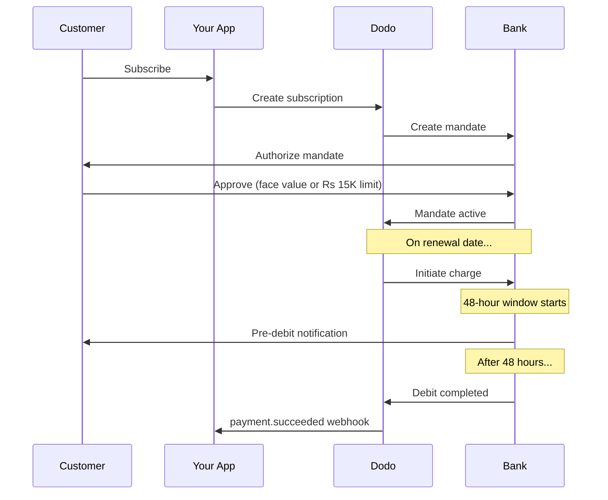

India tiene una infraestructura de pago única dominada por UPI (más del 60% de las transacciones digitales) y tarjetas Rupay. Dodo Payments soporta ambos con plena conformidad con RBI para los mandatos de suscripción.

## Por qué importan los métodos de pago en India

<CardGroup cols={3}>
{/* LOCKED_PATTERN_fef1794963d9b6cdb65542c69efa8053 */}
UPI procesa 10B+ transacciones/mes. Muchos clientes indios no tienen tarjetas internacionales.
</Card>

{/* LOCKED_PATTERN_b5f6c506ac5b1c8b661845e44f7fdc6c */}
UPI tiene tarifas de transacción prácticamente nulas. Excelente para transacciones de alto volumen y bajo valor.
</Card>

{/* LOCKED_PATTERN_4d6aa00708c7fde98b8f2cfed63c3234 */}
A diferencia de la mayoría de los métodos de pago alternativos, UPI y Rupay admiten pagos recurrentes mediante mandatos del RBI.
</Card>
</CardGroup>

## Métodos Soportados

| Método | Tipo | Suscripciones | Monto Mínimo |
| :----- | :--- | :-----------: | :--------- |
| **UPI Collect** | Código QR / VPA | Sí* | ₹1 |
| **Rupay Credit** | Tarjeta | Sí* | ₹1 |
| **Rupay Debit** | Tarjeta | Sí* | ₹1 |

*Las suscripciones requieren mandatos cumplidos con RBI con reglas de procesamiento especiales.

## Configuración

### Tipos de Métodos API

| Tipo | Descripción |
| :--- | :---------- |
| `upi_collect` | UPI mediante código QR o entrada de VPA |
| `credit` | Tarjetas de crédito, incluidas Rupay |
| `debit` | Tarjetas de débito, incluidas Rupay |

### Ejemplo: Pago Enfocado en India

```javascript
const session = await client.checkoutSessions.create({
  product_cart: [{ product_id: 'prod_123', quantity: 1 }],
  allowed_payment_method_types: [
    'upi_collect',
    'credit',
    'debit'
  ],
  billing_currency: 'INR',
  customer: {
    email: 'customer@example.in',
    name: 'Priya Sharma',
    phone_number: '+919876543210'
  },
  billing_address: {
    country: 'IN',
    zipcode: '560001'
  },
  return_url: 'https://example.com/success'
});
```

### Requisitos para UPI

Para que UPI aparezca en el checkout:
1. **El país de facturación** debe ser India (`IN`)
2. **La moneda** debe ser INR
3. Para comerciantes no indios: **Adaptive Currency** debe estar habilitado

<Warning>
Si eres un comerciante no indio y Adaptive Currency no está habilitada, UPI no estará disponible para tus clientes.
</Warning>

## Suscripciones con Mandatos de RBI

Las suscripciones de métodos de pago indios operan bajo las regulaciones del RBI (Banco de Reserva de India) con requisitos únicos.

### Cómo Funcionan los Mandatos de RBI



### Tipos de Mandatos

| Monto de Suscripción | Tipo de Mandato | Límite |
| :------------------ | :----------- | :---- |
| **Menos de Rs 15,000** | Mandato bajo demanda | Rs 15,000 |
| **Rs 15,000 o más** | Mandato de monto fijo | Monto exacto de suscripción |

**Importante para cambios de plan:** Si una actualización resulta en un cargo que excede el límite del mandato existente, el cargo fallará y el cliente deberá re-autorización.

### El Retraso de Procesamiento de 48 Horas

Esta es la diferencia más importante con respecto a los pagos con tarjetas internacionales:

<Steps>
{/* LOCKED_PATTERN_1168a75869d212ca7106c3911617bd37 */}
En la fecha de renovación programada, Dodo inicia el cargo con el banco.
</Step>

{/* LOCKED_PATTERN_303e0505fa00f1fe9b5d2ed06a9b7975 */}
El cliente recibe una notificación de su banco sobre el próximo débito.
</Step>

{/* LOCKED_PATTERN_ccf36ccdabfae2684bf414d6b78bda31 */}
El cliente puede cancelar el mandato durante este período a través de su aplicación bancaria.
</Step>

{/* LOCKED_PATTERN_171b46159c8bf2894fdd8df12890dd5f */}
Después de 48 horas (más hasta 3 horas adicionales por el procesamiento bancario), se debitan los fondos.
</Step>

{/* LOCKED_PATTERN_183bd9c4ee3d030e8b4107a7afb42a77 */}
`payment.succeeded` webhook se envía después del débito real, no al iniciar.
</Step>
</Steps>

<Warning>
**No otorgues beneficios al iniciar el cargo.** Espera el webhook `payment.succeeded`, que llega aproximadamente 48-51 horas después de la fecha programada de cobro.
</Warning>

### Manejo de la Ventana de 48 Horas

```javascript
// DON'T do this:
async function handleSubscriptionRenewal(subscription) {
  // ❌ Bad: Granting access immediately when charge is initiated
  grantPremiumAccess(subscription.customer_id);
}

// DO this:
async function handlePaymentWebhook(event) {
  if (event.type === 'payment.succeeded') {
    // ✅ Good: Only grant access after payment is confirmed
    grantPremiumAccess(event.data.customer_id);
  }
  
  if (event.type === 'payment.failed') {
    // Handle failed payment (mandate cancelled, insufficient funds)
    revokePremiumAccess(event.data.customer_id);
  }
}
```

### Eventos de Webhook para Suscripciones en India

| Evento | Cuándo | Acción |
| :---- | :--- | :----- |
| `subscription.created` | Mandato autorizado | Registra el inicio de la suscripción |
| `payment.succeeded` | ~48 horas después de la fecha de cobro | Otorga/continúa el acceso |
| `payment.failed` | Débito fallido | Notifica al cliente, pausa el acceso |
| `subscription.on_hold` | Pago fallido | Solicita actualización del método de pago |
| `subscription.active` | Reactivado tras el pago | Restaura el acceso |

## Pruebas

### ID de Prueba de UPI

| Estado | UPI ID |
| :----- | :----- |
| Éxito | `success@upi` |
| Fallo | `failure@upi` |

### Números de Prueba de Tarjeta India

| Marca | Escenario | Número de tarjeta | Expiración | CVV |
| :---- | :------- | :---------- | :----- | :-- |
| Visa | Éxito | `4576238912771450` | 06/32 | 123 |
| Visa | Rechazada | `4706131211212123` | 06/32 | 123 |
| Mastercard | Éxito | `5409162669381034` | 06/32 | 123 |
| Mastercard | Rechazada | `5105105105105100` | 06/32 | 123 |

## Mejores Prácticas

<AccordionGroup>
{/* LOCKED_PATTERN_221aaba4b8e7504ee0b95e31b042b2fd */}
Construye tu aplicación para manejar la brecha entre la iniciación del cobro y el pago real. Considera:
- Períodos de gracia para el acceso a la suscripción
- Comunicación clara a los clientes sobre el tiempo de procesamiento
- Cumplimiento impulsado por webhooks, no por fechas
</Accordion>

{/* LOCKED_PATTERN_ba2df03fe2862fb850b01eef0893fa6f */}
Los clientes pueden cancelar los mandatos a través de sus aplicaciones bancarias en cualquier momento. Supervisa los webhooks `subscription.on_hold` y solicita a los clientes que vuelvan a suscribirse o actualicen sus métodos de pago.
</Accordion>

{/* LOCKED_PATTERN_e710fb81847c744d4006e4fca6c121cf */}
Para precios variables (por ejemplo, basados en el uso), considera si un mandato bajo demanda de Rs 15,000 es suficiente. Si los cargos podrían superar ese monto, los clientes tendrán que volver a autorizarlo.
</Accordion>

{/* LOCKED_PATTERN_3761baecc3c28c65031747389aa832d0 */}
Para clientes indios, UPI debe ser la opción de pago principal. Muchos usuarios lo prefieren a las tarjetas debido a la familiaridad y la menor fricción.
</Accordion>
</AccordionGroup>

## Solución de Problemas

<AccordionGroup>
{/* LOCKED_PATTERN_13ae9b97a0d5eeadd371a86881f06ee7 */}
**Verifica:**
1. ¿El país de facturación está establecido en `IN`?
2. ¿La moneda está configurada en `INR`?
3. Si eres un comerciante no indio: ¿Adaptive Currency está habilitada?
4. ¿`upi_collect` está incluido en `allowed_payment_method_types`?

**Solución:** Verifica que la dirección de facturación tenga `country: "IN"` y `billing_currency: "INR"`.
</Accordion>

{/* LOCKED_PATTERN_1f64fa5b04b26f30c279116fbd022060 */}
**Causa:** El nuevo monto del cobro supera el límite del mandato existente (umbral de Rs 15,000).

**Solución:** El cliente debe actualizar el método de pago para establecer un nuevo mandato con el límite correcto.
</Accordion>

{/* LOCKED_PATTERN_69921150c2a11d99e3416ff7a65f0f34 */}
**Causa:** El cliente pudo haber cancelado el mandato durante la ventana de 48 horas, o su banco rechazó el débito.

**Solución:** El cliente necesita volver a autorizar el mandato o actualizar su método de pago.
</Accordion>

{/* LOCKED_PATTERN_36c4e373527e46486381ecf56059b96b */}
**Causa:** Las demoras en la API del banco pueden extender el procesamiento de 2 a 3 horas adicionales.

**Solución:** Esto es esperado. Diseña tu sistema para manejar demoras variables de hasta ~51 horas en total.
</Accordion>

{/* LOCKED_PATTERN_8c8856d83fe8bccc50ae2ce27bf29465 */}
**Causa:** Caso límite en las regulaciones del RBI: la cancelación del mandato durante la ventana de procesamiento no cancela inmediatamente la suscripción.

**Solución:** El siguiente cobro fallará y la suscripción pasará a `on_hold`. Supervisa los webhooks `payment.failed`.
</Accordion>
</AccordionGroup>

## Páginas Relacionadas

<CardGroup cols={2}>
{/* LOCKED_PATTERN_014d7e4ef5d99df996cbbae24da710a6 */}
Consulta todos los métodos de pago compatibles.
</Card>

{/* LOCKED_PATTERN_a10e92592ab9390be911120f2bcecbd0 */}
Documentación completa de suscripciones, incluidos los mandatos del RBI.
</Card>

<Card title="Webhooks" icon="webhook" href="/developer-resources/webhooks">
Manejo de webhooks para eventos de pago.
</Card>

{/* LOCKED_PATTERN_969f11f876a6712c92c3c11cb433bf1f */}
Todos los datos de prueba, incluidos UPI IDs y tarjetas indias.
</Card>
</CardGroup>