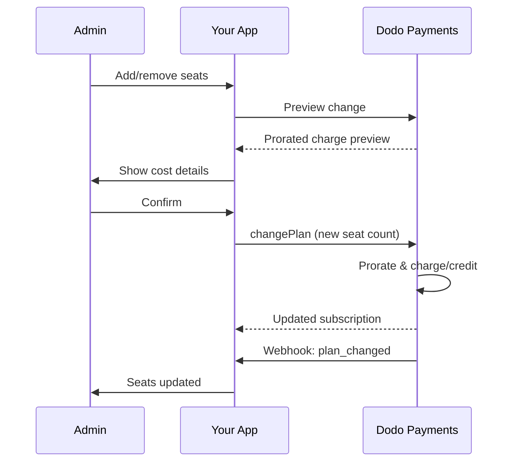

<Info>
La facturación basada en asientos te permite cobrar a los clientes según la cantidad de usuarios, miembros del equipo o licencias que necesiten. Es el modelo de precios estándar para herramientas de colaboración en equipo, software empresarial y productos SaaS B2B.
</Info>

<CardGroup cols={2}>
<Card title="Implementation Tutorial" icon="code" href="/developer-resources/seat-based-pricing">
  Guía paso a paso con ejemplos de código.
</Card>

<Card title="Add-ons Documentation" icon="puzzle" href="/features/addons">
  Conoce el sistema de complementos que impulsa la facturación basada en asientos.
</Card>

<Card title="Subscription Management" icon="repeat" href="/features/subscription">
  Gestiona suscripciones basadas en asientos y cambios de plan.
</Card>

<Card title="Webhooks" icon="bell" href="/developer-resources/webhooks/intents/subscription">
  Rastrea los cambios de asientos con webhooks de suscripción.
</Card>
</CardGroup>

---

## ¿Qué es la Facturación por Asiento?

La facturación por asiento (también llamada precios por usuario o por asiento) cobra a los clientes en función del número de usuarios que acceden a tu producto. En lugar de una tarifa fija, el precio se ajusta según el tamaño del equipo.

### Casos de Uso Comunes

| Industria | Ejemplo | Modelo de Precios |
|----------|---------|---------------|
| Colaboración en Equipo | Slack, Notion, Asana | Por usuario activo/mes |
| Herramientas para Desarrolladores | GitHub, GitLab, Jira | Por asiento/mes |
| Software CRM | Salesforce, HubSpot | Por licencia de usuario |
| Herramientas de Diseño | Figma, Canva | Por asiento de editor |
| Software de Seguridad | 1Password, Okta | Por usuario/mes |
| Videoconferencias | Zoom, Teams | Por licencia de anfitrión |

### Beneficios de la Facturación por Asiento

**Para Tu Negocio:**
- Los ingresos escalan naturalmente a medida que los clientes crecen
- Precios predecibles que los clientes pueden presupuestar
- Ruta de actualización clara de individual a equipo a empresarial
- Mayor valor de vida útil a medida que los equipos se expanden

**Para Tus Clientes:**
- Pagar solo por lo que utilizan
- Fácil de entender y prever costos
- Flexibilidad para agregar/quitar usuarios según sea necesario
- Precios justos que coinciden con el tamaño del equipo

---

## Cómo Funciona la Facturación por Asiento en Dodo Payments

Dodo Payments implementa la facturación por asiento utilizando el sistema de **Complementos**. Así es como funciona:

### Resumen de Arquitectura

Una suscripción Team Pro cuesta $99/mes e incluye 5 asientos. Si tienes más de 5 usuarios, pagas $15/mes adicionales por cada asiento extra.

Por ejemplo, si tu equipo necesita 15 asientos:
- Plan base: $99/mes (incluye 5 asientos)
- Complementos: 10 asientos adicionales × $15/mes = $150/mes
- Costo mensual total: $99 + $150 = $249 por 15 asientos

### Componentes Clave

| Componente | Propósito | Ejemplo |
|-----------|---------|---------|
| Producto Base | Suscripción principal con asientos incluidos | "Plan de Equipo - $99/mes (5 asientos incluidos)" |
| Complemento de Asiento | Cargo por asiento para usuarios adicionales | "Asiento Extra - $15/mes cada uno" |
| Cantidad | Número de asientos adicionales comprados | 10 asientos extra |

---

## Estrategias de Precios

Elige la estrategia de precios por asiento que se ajuste a tu negocio:

### Estrategia 1: Base + Complemento por Asiento

Incluye un número fijo de asientos en el plan base, cobra por asientos adicionales.

**Ejemplo:**

```
Starter Plan: $49/month
├── Includes: 3 seats
├── Extra seats: $10/month each
└── 8 total seats = $49 + (5 × $10) = $99/month
```

**Mejor para:** Productos donde equipos pequeños pueden funcionar con la oferta base.

### Estrategia 2: Precios Puro por Asiento

Cobra una tarifa fija por asiento sin tarifa base.

**Ejemplo:**

```
Per User: $12/month
├── 5 users = $60/month
├── 20 users = $240/month
└── 100 users = $1,200/month
```

**Implementación:** Establece el precio del plan base en $0, usa solo el complemento por asiento.

**Mejor para:** Precios simples y transparentes; modelos basados en uso.

### Estrategia 3: Precios por Asiento por Niveles

Diferentes planes base con diferentes tarifas por asiento.

**Ejemplo:**

```
Starter: $0/month base + $15/seat
├── Lower features, higher per-seat cost

Professional: $99/month base + $10/seat
├── More features, lower per-seat cost

Enterprise: $499/month base + $7/seat
└── All features, volume discount on seats
```

**Implementación:** Crea productos separados para cada nivel con diferentes precios de complemento.

**Mejor para:** Fomentar actualizaciones a niveles superiores; ventas empresariales.

### Estrategia 4: Paquetes de Asientos

Vende asientos en paquetes en lugar de individualmente.

**Ejemplo:**

```
5-Seat Pack: $50/month ($10/seat)
10-Seat Pack: $80/month ($8/seat)
25-Seat Pack: $175/month ($7/seat)
```

**Implementación:** Crea múltiples complementos para diferentes tamaños de paquete.

**Mejor para:** Simplificar decisiones de compra; fomentar compromisos más grandes.

---

## Configuración de la Facturación por Asiento

### Paso 1: Planifica Tu Estructura de Precios

Antes de la implementación, define tu estructura de precios:

<Steps>
<Step title="Define Base Plan">
Decide qué incluye la suscripción base:
- Precio base (puede ser $0 para un modelo puramente por asiento)
- Número de asientos incluidos
- Funcionalidades disponibles en este nivel
</Step>

<Step title="Set Seat Pricing">
Determina el costo del complemento por asiento:
- Precio por cada asiento adicional
- Cualquier descuento por volumen (mediante múltiples complementos)
- Número máximo de asientos permitidos (si aplica)
</Step>

<Step title="Consider Billing Frequency">
Alinea el precio por asiento con tu ciclo de facturación:
- Suscripciones mensuales → cargos mensuales por asiento
- Suscripciones anuales → cargos anuales por asiento (a menudo con descuento)
</Step>
</Steps>

### Paso 2: Crea el Complemento por Asiento

En tu panel de Dodo Payments:

1. Navega a **Productos** → **Complementos**
2. Haz clic en **Crear Complemento**
3. Configura el complemento:

| Campo | Valor | Notas |
|-------|-------|-------|
| Nombre | "Asiento Adicional" o "Miembro del Equipo" | Nombre claro y fácil de entender |
| Descripción | "Agrega otro miembro del equipo a tu espacio de trabajo" | Explica lo que obtienen los clientes |
| Precio | Tu precio por asiento | p. ej., $10.00 |
| Moneda | Coincide con tu producto base | Debe ser la misma moneda |
| Categoría de Impuestos | Igual que el producto base | Asegura un manejo de impuestos consistente |

<Tip>
Crea nombres descriptivos para los complementos que tengan sentido en las facturas. "Asiento adicional de equipo" es más claro que "Complemento de asiento" para los clientes que revisan sus facturas.
</Tip>

### Paso 3: Crea el Producto de Suscripción

Crea tu producto de suscripción:

1. Navega a **Productos** → **Crear Producto**
2. Selecciona **Suscripción**
3. Configura precios y detalles
4. En la sección de **Complementos**, adjunta tu complemento por asiento

### Paso 4: Adjunta el Complemento al Producto

Vincula el complemento por asiento a tu suscripción:

1. Edita tu producto de suscripción
2. Desplázate a la sección de **Complementos**
3. Haz clic en **Agregar Complementos**
4. Selecciona tu complemento por asiento
5. Guarda los cambios

<Check>
Tu producto de suscripción ahora admite precios basados en asientos. Los clientes pueden adquirir cualquier cantidad de asientos adicionales durante el pago.
</Check>

---

## Gestión de Asientos

### Agregando Asientos a Nuevas Suscripciones

Al crear una sesión de pago, especifica la cantidad de asientos:

```typescript
const session = await client.checkoutSessions.create({
  product_cart: [{
    product_id: 'prod_team_plan',
    quantity: 1,
    addons: [{
      addon_id: 'addon_seat',
      quantity: 10  // 10 additional seats
    }]
  }],
  customer: { email: 'admin@company.com' },
  return_url: 'https://yourapp.com/success'
});
```

### Cambiando la Cantidad de Asientos en Suscripciones Existentes

Utiliza la API de Cambio de Plan para ajustar los asientos:

```typescript
// Add 5 more seats to existing subscription
await client.subscriptions.changePlan('sub_123', {
  product_id: 'prod_team_plan',
  quantity: 1,
  proration_billing_mode: 'prorated_immediately',
  addons: [{
    addon_id: 'addon_seat',
    quantity: 15  // New total: 15 additional seats
  }]
});
```

### Eliminando Asientos

Para reducir la cantidad de asientos, especifica la cantidad menor:

```typescript
// Reduce from 15 to 8 additional seats
await client.subscriptions.changePlan('sub_123', {
  product_id: 'prod_team_plan',
  quantity: 1,
  proration_billing_mode: 'difference_immediately',
  addons: [{
    addon_id: 'addon_seat',
    quantity: 8  // Reduced to 8 additional seats
  }]
});
```

### Eliminando Todos los Asientos Adicionales

Pasa un array de complementos vacío para eliminar todos los complementos:

```typescript
// Remove all additional seats, keep only base plan seats
await client.subscriptions.changePlan('sub_123', {
  product_id: 'prod_team_plan',
  quantity: 1,
  proration_billing_mode: 'difference_immediately',
  addons: []  // Removes all add-ons
});
```

---

## Prorrateo por Cambios de Asiento

Cuando los clientes agregan o eliminan asientos a mitad de ciclo, el prorrateo determina cómo se les factura.



### Modos de prorrateo

| Modo | Agregar asientos | Eliminar asientos |
|------|------------------|-------------------|
| `prorated_immediately` | Cobrar por los días restantes del ciclo | Acreditar los días no usados |
| `difference_immediately` | Cobrar el precio completo del asiento | Crédito aplicado a renovaciones futuras |
| `full_immediately` | Cobrar el precio completo del asiento y reiniciar el ciclo de facturación | Sin crédito |

### Ejemplos de prorrateo

**Escenario: quedan 15 días del ciclo de facturación, se agregan 5 asientos a $10/asiento**

<Tabs>
<Tab title="prorated_immediately">

```
Prorated charge = ($10 × 5 seats) × (15 days / 30 days)
                = $50 × 0.5
                = $25 immediate charge
```

El cliente paga $25 ahora y luego $50/mes en la renovación.
</Tab>

<Tab title="difference_immediately">

```
Immediate charge = $10 × 5 seats = $50
```

El cliente paga los $50 completos ahora, independientemente de la posición en el ciclo.
</Tab>

<Tab title="full_immediately">

```
Immediate charge = Full subscription + add-ons
Billing cycle resets to today
```

El cliente paga el monto completo y comienza un nuevo ciclo de facturación.
</Tab>
</Tabs>

**Escenario: eliminar 3 asientos a mitad de ciclo con prorated_immediately**

```
Current: Team Plan ($99/month) + 10 extra seats × $10/seat = $199/month
Change: Remove 3 seats (10 → 7 extra seats) on day 20 of 30-day cycle
Remaining: 10 days

Credit for removed seats:
  = ($10 × 3 seats) × (10 days / 30 days)
  = $30 × 0.333
  = $10.00 credit

→ $10.00 credit added to subscription
→ Next renewal: $99 + (7 × $10) = $169.00/month
→ Credit auto-applies: $169.00 − $10.00 = $159.00 on next invoice
```

<Tip>
**Elegir un modo de prorrateo para los cambios de asiento**: Usa `prorated_immediately` para una facturación justa basada en días cuando los equipos ajustan frecuentemente los asientos. Usa `difference_immediately` para cálculos más sencillos que cobran o acreditan el precio completo del asiento. Consulta la [Guía de prorrateo](/developer-resources/subscription-upgrade-downgrade#proration-modes) para comparaciones detalladas.
</Tip>

### Vista previa antes de cambiar

Siempre previsualiza el prorrateo antes de hacer cambios:

```typescript
const preview = await client.subscriptions.previewChangePlan('sub_123', {
  product_id: 'prod_team_plan',
  quantity: 1,
  proration_billing_mode: 'prorated_immediately',
  addons: [{ addon_id: 'addon_seat', quantity: 20 }]
});

console.log('Immediate charge:', preview.immediate_charge.summary);
// Show customer: "Adding 5 seats will cost $25 today"
```

---

## Seguimiento de asientos con webhooks

Monitorea los cambios de asientos escuchando los webhooks de suscripción:

### Eventos relevantes

| Evento | Cuándo se activa | Caso de uso |
|--------|------------------|------------|
| `subscription.active` | Nueva suscripción activada | Aprovisiona los asientos iniciales |
| `subscription.plan_changed` | Asientos agregados/eliminados | Actualiza el conteo de asientos en tu app |
| `subscription.renewed` | Suscripción renovada | Confirma que el conteo de asientos no cambió |
| `subscription.cancelled` | Suscripción cancelada | Desaprovisiona todos los asientos |

### Ejemplo de manejador de webhook

```typescript
app.post('/webhooks/dodo', async (req, res) => {
  const event = req.body;

  switch (event.type) {
    case 'subscription.active':
      // New subscription - provision seats
      const seats = calculateTotalSeats(event.data);
      await provisionSeats(event.data.customer_id, seats);
      break;

    case 'subscription.plan_changed':
      // Seats changed - update access
      const newSeats = calculateTotalSeats(event.data);
      await updateSeatCount(event.data.subscription_id, newSeats);
      break;

    case 'subscription.cancelled':
      // Subscription cancelled - deprovision
      await deprovisionAllSeats(event.data.subscription_id);
      break;
  }

  res.json({ received: true });
});

function calculateTotalSeats(subscriptionData) {
  const baseSeats = 5;  // Included in plan
  const addonSeats = subscriptionData.addons?.reduce(
    (total, addon) => total + addon.quantity, 0
  ) || 0;
  return baseSeats + addonSeats;
}
```

---

## Haciendo cumplir los límites de asientos

Tu aplicación debe hacer cumplir los límites de asientos. Dodo Payments gestiona la facturación, pero tú controlas el acceso.

### Estrategias de cumplimiento

<Tabs>
<Tab title="Hard Limit">
Evita estrictamente agregar usuarios más allá del número de asientos.


```typescript
async function inviteUser(teamId: string, email: string) {
  const team = await getTeam(teamId);
  const subscription = await getSubscription(team.subscriptionId);
  const totalSeats = calculateTotalSeats(subscription);
  const usedSeats = await countTeamMembers(teamId);

  if (usedSeats >= totalSeats) {
    throw new Error('No seats available. Please upgrade your plan.');
  }

  await sendInvitation(teamId, email);
}
```

</Tab>

<Tab title="Soft Limit with Warning">
Permite exceder con una advertencia y un periodo de gracia.


```typescript
async function inviteUser(teamId: string, email: string) {
  const team = await getTeam(teamId);
  const { totalSeats, usedSeats } = await getSeatInfo(team);

  if (usedSeats >= totalSeats) {
    // Allow but flag for billing
    await flagOverage(teamId, usedSeats - totalSeats + 1);
    await notifyAdmin(team.adminEmail, 'You have exceeded your seat limit');
  }

  await sendInvitation(teamId, email);
}
```

</Tab>

<Tab title="Auto-Upgrade">
Agrega asientos automáticamente cuando se alcanza el límite.


```typescript
async function inviteUser(teamId: string, email: string) {
  const team = await getTeam(teamId);
  const { totalSeats, usedSeats, subscriptionId } = await getSeatInfo(team);

  if (usedSeats >= totalSeats) {
    // Automatically add a seat
    await client.subscriptions.changePlan(subscriptionId, {
      product_id: team.productId,
      quantity: 1,
      proration_billing_mode: 'prorated_immediately',
      addons: [{ addon_id: 'addon_seat', quantity: totalSeats - baseSeats + 1 }]
    });

    await notifyAdmin(team.adminEmail, 'A new seat was added to your plan');
  }

  await sendInvitation(teamId, email);
}
```

</Tab>
</Tabs>

---

## Patrones avanzados

### Diferentes tipos de asientos

Ofrece distintos tipos de asientos con precios diferentes:

```
Full Seats: $20/month - Full access to all features
View-Only Seats: $5/month - Read-only access
Guest Seats: $0/month - Limited external collaborator access
```

**Implementación:** Crea complementos separados para cada tipo de asiento.

```typescript
const session = await client.checkoutSessions.create({
  product_cart: [{
    product_id: 'prod_team_plan',
    quantity: 1,
    addons: [
      { addon_id: 'addon_full_seat', quantity: 10 },
      { addon_id: 'addon_viewer_seat', quantity: 25 },
      { addon_id: 'addon_guest_seat', quantity: 50 }
    ]
  }]
});
```

### Descuentos por asientos anuales

Ofrece precios anuales con descuento por asiento:

```
Monthly: $15/seat/month
Annual: $12/seat/month (20% savings)
```

**Implementación:** Crea productos separados para planes mensuales y anuales con precios distintos en los complementos.

### Requisitos mínimos de asientos

Requiere un número mínimo de asientos para ciertos planes:

```typescript
async function validateSeatCount(planId: string, seatCount: number) {
  const minimums = {
    'prod_starter': 1,
    'prod_team': 5,
    'prod_enterprise': 25
  };

  if (seatCount < minimums[planId]) {
    throw new Error(`${planId} requires at least ${minimums[planId]} seats`);
  }
}
```

---

## Mejores prácticas

### Mejores prácticas de precios

- **Comunicación clara**: Muestra el precio por asiento de forma destacada en tu página de precios
- **Asientos incluidos**: Considera incluir algunos asientos en el precio base para reducir la fricción
- **Descuentos por volumen**: Ofrece tarifas por asiento más bajas para equipos grandes y ganar acuerdos empresariales
- **Incentivos anuales**: Descuenta los planes anuales para mejorar el flujo de caja y la retención

### Mejores prácticas técnicas

- **Almacena en caché los conteos de asientos**: Guarda localmente los conteos de asientos de las suscripciones para evitar llamadas a la API en cada solicitud
- **Sincroniza regularmente**: Sincroniza periódicamente tu conteo local de asientos con Dodo Payments mediante la API
- **Maneja los fallos**: Si un cambio de asientos falla, muestra mensajes de error claros y opciones para reintentar
- **Registro de auditoría**: Registra todos los cambios de asientos para disputas de facturación y cumplimiento

### Mejores prácticas de experiencia de usuario

- **Retroalimentación en tiempo real**: Muestra el impacto inmediato en el costo al ajustar asientos
- **Pasos de confirmación**: Requiere confirmación antes de los cambios de facturación
- **Transparencia en el prorrateo**: Explica claramente los cargos prorrateados antes de aplicarlos
- **Reducciones sencillas**: No dificultes reducir asientos (eso genera confianza)

---

## Resolución de problemas

<AccordionGroup>
<Accordion title="Seat count mismatch between app and billing">
**Síntoma**: Tu app muestra un conteo de asientos diferente al de la suscripción.


**Causas**:
- Webhook no recibido o procesado
- Condición de carrera durante el cambio de asientos
- Datos en caché no actualizados

**Soluciones**:
1. Implementa manejadores de webhook para `subscription.plan_changed`
2. Agrega un botón "Sincronizar con facturación" que obtenga la suscripción actual
3. Establece un TTL en la caché para garantizar actualizaciones regulares
</Accordion>

<Accordion title="Proration charges unexpected">
**Síntoma**: El cliente está confundido por el monto cobrado a mitad de ciclo.


**Causas**:
- El modo de prorrateo no se comunicó claramente
- El cliente no vio la vista previa antes de confirmar

**Soluciones**:
1. Siempre usa `previewChangePlan` antes de hacer cambios
2. Muestra un desglose claro: "Agregar X asientos = $Y hoy (prorrateado por Z días)"
3. Documenta tu política de prorrateo en el centro de ayuda
</Accordion>

<Accordion title="Add-on not appearing in checkout">
**Síntoma**: El complemento de asiento no está disponible durante el pago.


**Causas**:
- Complemento no adjunto al producto
- Complemento archivado o eliminado
- Desajuste de moneda entre el producto y el complemento

**Soluciones**:
1. Verifica que el complemento esté adjunto en la configuración del producto
2. Revisa el estado del complemento en el panel de complementos
3. Asegura que las monedas coincidan exactamente
</Accordion>

<Accordion title="Cannot reduce seats below current usage">
**Síntoma**: El cliente quiere reducir asientos pero tiene usuarios asignados.


**Soluciones**:
1. Muestra qué usuarios deben eliminarse antes de reducir asientos
2. Implementa un flujo: eliminar usuarios → reducir asientos
3. Considera un periodo de gracia antes de aplicar la reducción de asientos
</Accordion>
</AccordionGroup>

---

## Documentación relacionada

<CardGroup cols={2}>
<Card title="Seat-Based Pricing Tutorial" icon="code" href="/developer-resources/seat-based-pricing">
  Guía completa de implementación con código.
</Card>

<Card title="Add-ons" icon="puzzle" href="/features/addons">
  Comprende el sistema de complementos en profundidad.
</Card>

<Card title="Plan Changes & Proration" icon="arrows-rotate" href="/developer-resources/subscription-upgrade-downgrade">
  Maneja las modificaciones de suscripciones.
</Card>

<Card title="Subscription Webhooks" icon="bell" href="/developer-resources/webhooks/intents/subscription">
  Rastrea los eventos de suscripción.
</Card>
</CardGroup>
