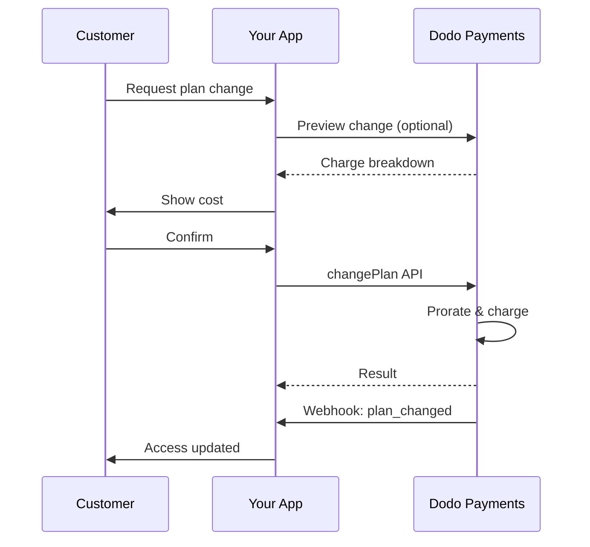
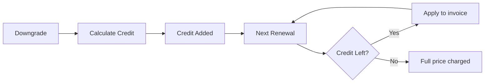

<Info>
Las suscripciones te permiten vender acceso continuo con renovaciones automáticas. Usa ciclos de facturación flexibles, pruebas gratuitas, cambios de plan y complementos para adaptar los precios a cada cliente.
</Info>

<CardGroup cols={2}>
{/* LOCKED_PATTERN_e9c6633804a4afc7b38ae988f7ecf803 */}
Controla los cambios de plan con prorrateo y actualizaciones de cantidad.
</Card>

{/* LOCKED_PATTERN_318ae84db3b63552ee4c3b3e5131957c */}
Autoriza un mandato ahora y cobra después con importes personalizados.
</Card>

{/* LOCKED_PATTERN_97c52f9aea0902ad308a569911ddfd12 */}
Permite que los clientes administren planes, facturación y cancelaciones.
</Card>

{/* LOCKED_PATTERN_1cd9a7ac4415843b5e77e9a9493bae92 */}
Reacciona a eventos del ciclo de vida como creado, renovado y cancelado.
</Card>
</CardGroup>

## ¿Qué Son las Suscripciones?

Las suscripciones son productos recurrentes que los clientes compran en un horario. Son ideales para:

- **Licencias de SaaS**: Aplicaciones, APIs o acceso a plataformas
- **Membresías**: Comunidades, programas o clubes
- **Contenido digital**: Cursos, medios o contenido premium
- **Planes de soporte**: SLA, paquetes de éxito o mantenimiento

## Beneficios Clave

- **Ingresos predecibles**: Facturación recurrente con renovaciones automáticas
- **Ciclos flexibles**: Mensuales, anuales, intervalos personalizados y pruebas
- **Agilidad del plan**: Prorrateo para actualizaciones y degradaciones
- **Complementos y asientos**: Adjunta mejoras opcionales y cuantificables
- **Checkout sin problemas**: Checkout alojado y portal del cliente
- **Desarrollador primero**: APIs claras para creación, cambios y seguimiento de uso

## Creando Suscripciones

Crea productos de suscripción en tu panel de Dodo Payments, luego véndelos a través de checkout o tu API. Separar productos de suscripciones activas te permite versionar precios, adjuntar complementos y rastrear el rendimiento de manera independiente.

### Creación de productos de suscripción

Configura los campos en el panel para definir cómo se vende, renueva y factura tu suscripción. Las secciones a continuación se corresponden directamente con lo que ves en el formulario de creación.

#### Detalles del producto

- **Nombre del Producto** (requerido): El nombre que se muestra en el checkout, portal del cliente y facturas.
- **Descripción del Producto** (requerido): Una declaración de valor clara que aparece en el checkout y las facturas.
- **Imagen del Producto** (requerido): PNG/JPG/WebP de hasta 3 MB. Usada en el checkout y las facturas.
- **Marca**: Asocia el producto con una marca específica para temas y correos electrónicos.
- **Categoría Fiscal** (requerido): Elige la categoría (por ejemplo, SaaS) para determinar las reglas fiscales.

<Tip>
Elige la categoría fiscal más precisa para garantizar la recaudación correcta de impuestos por región.
</Tip>

#### Precios

- **Tipo de Precio**: Elija <b>Suscripción</b> (esta guía). Las alternativas son Pago Único y Facturación Basada en Uso.
- **Precio** (requerido): Precio base recurrente con moneda.
- **Descuento Aplicable (%)**: Porcentaje de descuento opcional aplicado al precio base; reflejado en el pago y en las facturas.
- **Repetir pago cada** (requerido): Intervalo para renovaciones, por ejemplo, cada 1 Mes. Seleccione la cadencia (meses o años) y la cantidad.
- **Período de Suscripción** (requerido): Término total durante el cual la suscripción permanece activa (por ejemplo, 10 Años). Después de que finalice este período, las renovaciones se detienen a menos que se extiendan.
- **Días del Período de Prueba** (requerido): Establezca la duración de la prueba en días. Use 0 para deshabilitar pruebas. El primer cargo ocurre automáticamente cuando finaliza la prueba.
- **Seleccionar complemento**: Adjunte hasta 10 complementos que los clientes pueden comprar junto con el plan base.

<Warning>
Cambiar los precios de un producto activo afecta las compras nuevas. Las suscripciones existentes siguen tus ajustes de cambio de plan y prorrateo.
</Warning>

<Info>
Los complementos son ideales para extras cuantificables como puestos o almacenamiento. Puedes controlar las cantidades permitidas y el comportamiento de prorrateo cuando los clientes los modifican.
</Info>

#### Configuraciones avanzadas

- **Precios Incluidos Impuestos**: Muestra precios incluidos impuestos aplicables. El cálculo final de impuestos aún varía según la ubicación del cliente.
- **Generar claves de licencia**: Emite una clave única a cada cliente después de la compra. Consulta la guía de <a href="/features/license-keys">Claves de Licencia</a>.
- **Entrega de Producto Digital**: Entrega archivos o contenido automáticamente después de la compra. Aprende más en <a href="/features/digital-product-delivery">Entrega de Producto Digital</a>.
- **Metadatos**: Adjunta pares clave-valor personalizados para etiquetado interno o integraciones de clientes. Consulta <a href="/api-reference/metadata">Metadatos</a>.

<Tip>
Usa metadatos para guardar identificadores de tu sistema (por ejemplo, accountId) y poder conciliar eventos e facturas después.
</Tip>

## Pruebas de Suscripción

Las pruebas permiten a los clientes acceder a suscripciones sin pago inmediato. El primer cargo ocurre automáticamente cuando termina la prueba.

### Configurando Pruebas

Configura **Días del período de prueba** en la sección de precios del producto (usa `0` para deshabilitar). Puedes sobrescribir esto al crear suscripciones:

```typescript
// Via subscription creation
const subscription = await client.subscriptions.create({
  customer_id: 'cus_123',
  product_id: 'prod_monthly',
  trial_period_days: 14  // Overrides product's trial period
});

// Via checkout session
const session = await client.checkoutSessions.create({
  product_cart: [{ product_id: 'prod_monthly', quantity: 1 }],
  subscription_data: { trial_period_days: 14 }
});
```

<Warning>
El valor `trial_period_days` debe estar entre 0 y 10 000 días.
</Warning>

### Detectando el Estado de Prueba

<Warning>
Actualmente, no hay un campo directo para detectar el estado de prueba. La siguiente es una solución provisional que requiere consultar pagos, lo cual es ineficiente. Estamos trabajando en una solución más eficiente.
</Warning>

Para determinar si una suscripción está en prueba, recupera la lista de pagos para la suscripción. Si hay exactamente un pago con monto 0, la suscripción está en período de prueba:

```typescript
const subscription = await client.subscriptions.retrieve('sub_123');
const payments = await client.payments.list({
  subscription_id: subscription.subscription_id
});

// Check if subscription is in trial
const isInTrial = payments.items.length === 1 && 
                  payments.items[0].total_amount === 0;
```

### Actualizando el Período de Prueba

Extiende la prueba actualizando `next_billing_date`:

```typescript
await client.subscriptions.update('sub_123', {
  next_billing_date: '2025-02-15T00:00:00Z'  // New trial end date
});
```

<Warning>
No puedes establecer `next_billing_date` en una fecha pasada. La fecha debe estar en el futuro.
</Warning>

## Cambios en el Plan de Suscripción

Los cambios de plan te permiten actualizar o degradar suscripciones, ajustar cantidades o migrar a diferentes productos. Cada cambio desencadena un cargo inmediato basado en el modo de prorrateo que selecciones.

<Tip>
Puedes cambiar planes de suscripción y actualizar la próxima fecha de facturación directamente desde el panel de Dodo Payments. Esto ofrece una forma rápida de ajustar suscripciones para solicitudes de soporte al cliente, mejoras promocionales o migraciones de plan sin realizar llamadas a la API.
</Tip>

<Tip>
**Habilita cambios de plan de autoservicio:** ¿Quieres que los clientes mejoren o degraden sus propias suscripciones mediante el Portal del Cliente? Agrega tus productos de suscripción a una Colección de Productos y activa "Permitir actualizaciones de suscripción" en tus Ajustes de Suscripciones.
</Tip>



{/* LOCKED_PATTERN_cbe0de1faffb3a1f552c6ce10c001527 */}
  Agrupa productos relacionados en colecciones para habilitar rutas de mejora/degradación fluidas en el Portal del Cliente.
</Card>

### Modos de prorrateo

Elige cómo se factura a los clientes al cambiar de plan:

<Info>
**Comparación rápida de los tres modos de prorrateo:**

| | `prorated_immediately` | `difference_immediately` | `full_immediately` |
|---|---|---|---|
| **Mejora** | Cobro prorrateado por los días restantes | Se cobra la diferencia completa de precio | Se cobra el precio total del nuevo plan |
| **Degradación** | Crédito prorrateado por los días restantes | Diferencia completa de precio como crédito | Sin crédito, cargo completo |
| **Ciclo de facturación** | Permanece igual | Permanece igual | Se reinicia a hoy |
| **Recomendado para** | Facturación justa basada en el tiempo | Cambios de nivel simples | Reinicio de ciclo de facturación |
</Info>

#### `prorated_immediately`
Cobra el monto prorrateado según el tiempo restante en el ciclo de facturación actual. Ideal para una facturación justa que considera el tiempo no utilizado.

```typescript
await client.subscriptions.changePlan('sub_123', {
  product_id: 'prod_pro',
  quantity: 1,
  proration_billing_mode: 'prorated_immediately'
});
```

#### `difference_immediately`
Cobra la diferencia de precio inmediatamente (mejora) o agrega crédito para renovaciones futuras (degradación). Ideal para escenarios simples de mejora/degradación.

```typescript
// Upgrade: charges $50 (difference between $30 and $80)
// Downgrade: credits remaining value, auto-applied to renewals
await client.subscriptions.changePlan('sub_123', {
  product_id: 'prod_pro',
  quantity: 1,
  proration_billing_mode: 'difference_immediately'
});
```

<Info>
Los créditos de las degradaciones con `difference_immediately` son exclusivos de la suscripción y se aplican automáticamente a renovaciones futuras. Son distintos de <a href="/features/customer-credit">Customer Credits</a>.
</Info>

Cuando un cliente realiza una degradación con `difference_immediately`, el valor no utilizado se convierte en un crédito específico de la suscripción que compensa automáticamente las renovaciones futuras:



#### `full_immediately`
Cobra el importe total del nuevo plan de inmediato, sin considerar el tiempo restante. Ideal para reiniciar los ciclos de facturación.

```typescript
await client.subscriptions.changePlan('sub_123', {
  product_id: 'prod_monthly',
  quantity: 1,
  proration_billing_mode: 'full_immediately'
});
```

<AccordionGroup>
{/* LOCKED_PATTERN_77fa8030551e310988f32a1810cb0d32 */}

**Escenario**: Un cliente con Basic ($30/mes) mejora a Pro ($80/mes) en el día 16 de un ciclo de 30 días usando `prorated_immediately`.

```
Unused credit from Basic = $30 × (15 remaining / 30 total) = $15.00
Prorated cost of Pro     = $80 × (15 remaining / 30 total) = $40.00
────────────────────────────────────────────────────────────────────
Immediate charge         = $40.00 − $15.00 = $25.00
```

La próxima renovación en la fecha de facturación original: **$80.00/mes**.

<Tip>
Para ejemplos de cálculo más detallados y casos límite, consulta nuestra [Guía de mejoras y degradaciones](/developer-resources/subscription-upgrade-downgrade).
</Tip>

</Accordion>
{/* LOCKED_PATTERN_6272a737f845c6ce57dfe1823485561c */}

**Escenario**: Un cliente con Pro ($80/mes) degrada a Starter ($20/mes) usando `difference_immediately`.

```
Credit = Old plan − New plan = $80 − $20 = $60.00
```

El crédito de $60 se aplica automáticamente a renovaciones futuras:
- Renovación 1: $20 − $20 (crédito) = **$0.00** ($40 de crédito restante)
- Renovación 2: $20 − $20 (crédito) = **$0.00** ($20 de crédito restante)  
- Renovación 3: $20 − $20 (crédito) = **$0.00** (crédito agotado)
- Renovación 4: **$20.00** (precio completo)

<Info>
Aprende más sobre cómo se gestionan los créditos en la [Guía de mejoras y degradaciones](/developer-resources/subscription-upgrade-downgrade).
</Info>

</Accordion>
</AccordionGroup>

### Cambios de plan con complementos

Modifica complementos al cambiar planes. Los complementos se incluyen en los cálculos de prorrateo:

```typescript
await client.subscriptions.changePlan('sub_123', {
  product_id: 'prod_pro',
  quantity: 1,
  proration_billing_mode: 'difference_immediately',
  addons: [{ addon_id: 'addon_extra_seats', quantity: 2 }]  // Add add-ons
  // addons: []  // Empty array removes all existing add-ons
});
```

<Info>
Los cambios de plan generan cargos inmediatos. Los cargos fallidos pueden mover la suscripción al estado `on_hold`. Rastrea los cambios mediante eventos webhook `subscription.plan_changed`.
</Info>

### Vista previa de cambios de plan

Antes de confirmar un cambio de plan, obtén una vista previa del cargo exacto y de la suscripción resultante:

```typescript
const preview = await client.subscriptions.previewChangePlan('sub_123', {
  product_id: 'prod_pro',
  quantity: 1,
  proration_billing_mode: 'prorated_immediately'
});

// Show customer the charge before confirming
console.log('You will be charged:', preview.immediate_charge.summary);
```

{/* LOCKED_PATTERN_4cf51d80aab5581e90ca5178574dd95f */}
  Previsualiza los cambios de plan antes de confirmarlos.
</Card>

## Estados de suscripción

Las suscripciones pueden estar en diferentes estados a lo largo de su ciclo de vida:

- **`active`**: La suscripción está activa y se renovará automáticamente
- **`on_hold`**: La suscripción está pausada debido a pago fallido. Se requiere actualizar el método de pago para reactivarla
- **`cancelled`**: La suscripción está cancelada y no se renovará
- **`expired`**: La suscripción alcanzó su fecha final
- **`pending`**: La suscripción se está creando o procesando

### Estado en espera

Una suscripción entra en el estado `on_hold` cuando:

- Falla un pago de renovación (fondos insuficientes, tarjeta vencida, etc.)
- Falla un cargo por cambio de plan
- Falla la autorización del método de pago

<Warning>
Cuando una suscripción está en el estado `on_hold`, no se renovará automáticamente. Debes actualizar el método de pago para reactivar la suscripción.
</Warning>

### Reactivar desde en espera

Para reactivar una suscripción desde el estado `on_hold`, actualiza el método de pago. Esto automáticamente:

1. Genera un cargo por los importes restantes
2. Genera una factura
3. Procesa el pago usando el nuevo método de pago
4. Reactiva la suscripción al estado `active` tras el pago exitoso

```typescript
// Reactivate subscription from on_hold
const response = await client.subscriptions.updatePaymentMethod('sub_123', {
  type: 'new',
  return_url: 'https://example.com/return'
});

// For on_hold subscriptions, a charge is automatically created
if (response.payment_id) {
  console.log('Charge created:', response.payment_id);
  // Redirect customer to response.payment_link to complete payment
  // Monitor webhooks for payment.succeeded and subscription.active
}
```

<Info>
Después de actualizar con éxito el método de pago para una suscripción `on_hold`, recibirás eventos webhook `payment.succeeded` seguidos de `subscription.active`.
</Info>

## Gestión de API

<AccordionGroup>
{/* LOCKED_PATTERN_90c830137a1db85369b1d7f3d01ae82f */}
Usa `POST /subscriptions` para crear suscripciones programáticamente desde productos, con pruebas opcionales y complementos.
{/* LOCKED_PATTERN_80e2d112f65019b30c4a8db2b540611a */}
Mira la API de creación de suscripciones.
</Card>
</Accordion>

```typescript
const session = await client.checkoutSessions.create({
  product_cart: [
    {
      product_id: 'prod_subscription',
      quantity: 1
    }
  ]
});
```

{/* LOCKED_PATTERN_7db9c1f9990c40bba57aa6671f00c67e */}
Usa `PATCH /subscriptions/{id}` para actualizar cantidades, cancelar en la próxima fecha de facturación o modificar metadatos.
{/* LOCKED_PATTERN_adf0aff0c53ede544a3b9267991da09d */}
Aprende cómo actualizar detalles de suscripción.
</Card>
</Accordion>

```typescript
await client.subscriptions.changePlan('sub_123', {
  product_id: 'prod_new',
  quantity: 1,
  proration_billing_mode: 'difference_immediately'
});
```

{/* LOCKED_PATTERN_c014ed82995c82db7ff5269f5df46531 */}
Cambia el producto activo y las cantidades con controles de prorrateo.
{/* LOCKED_PATTERN_afa3d1700c97ae5510a3b95972626011 */}
Revisa las opciones de cambio de plan.
</Card>
</Accordion>

```typescript
await client.subscriptions.update('sub_123', {
  cancel_at_period_end: true
});
```

{/* LOCKED_PATTERN_e4be3d5898d68fb2f2f5f0e8fdf83e30 */}
Para suscripciones bajo demanda, cobra importes específicos bajo demanda.
{/* LOCKED_PATTERN_6a5c708696bc00ef7568a4d6821875e9 */}
Cobra una suscripción bajo demanda.
</Card>
</Accordion>

```typescript
const onDemand = await client.subscriptions.create({
  customer_id: 'cus_123',
  product_id: 'prod_on_demand',
  on_demand: true
});

await client.subscriptions.createCharge(onDemand.id, {
  amount: 4900,
  currency: 'USD',
  description: 'Extra usage for September'
});
```

{/* LOCKED_PATTERN_ea724d9cdc0d6cfdcd00675dcff1781c */}
Usa `GET /subscriptions` para listar todas las suscripciones y `GET /subscriptions/{id}` para recuperar una.
{/* LOCKED_PATTERN_4728f8e0407f9ffad5b85b7c77f6a7a1 */}
Explora las APIs de listado y recuperación.
</Card>
</Accordion>

```typescript
// Update with new payment method
const response = await client.subscriptions.updatePaymentMethod('sub_123', {
  type: 'new',
  return_url: 'https://example.com/return'
});

// Or use existing payment method
await client.subscriptions.updatePaymentMethod('sub_123', {
  type: 'existing',
  payment_method_id: 'pm_abc123'
});
```

{/* LOCKED_PATTERN_7f09c790a6d7f4120accee35e87f16ba */}
Obtén el uso registrado para modelos de precios medidos o híbridos.
{/* LOCKED_PATTERN_f3047e02844ecc96a820a081613f8e53 */}
Consulta la API de historial de uso.
</Card>
</Accordion>

```typescript
// Update payment method - automatically creates charge for remaining dues
const response = await client.subscriptions.updatePaymentMethod('sub_123', {
  type: 'new',
  return_url: 'https://example.com/return'
});

if (response.payment_id) {
  // Charge created for remaining dues
  // Redirect customer to response.payment_link
  // Monitor webhooks: payment.succeeded → subscription.active
}
```

{/* LOCKED_PATTERN_ccdbd0043049c6f6310fb5a44a412ebf */}
Actualiza el método de pago para una suscripción. Para suscripciones activas, esto actualiza el método de pago para renovaciones futuras. Para suscripciones en estado `on_hold`, esto reactiva la suscripción creando un cargo por los importes restantes.
{/* LOCKED_PATTERN_d8ea2b81f4bc1c8e6e864e29c8b258c6 */}
Aprende cómo actualizar métodos de pago y reactivar suscripciones.
</Card>
</Accordion>
</AccordionGroup>

  Las suscripciones de UPI y tarjetas indias operan bajo regulaciones del RBI (Banco de Reserva de la India) con requisitos de mandato específicos:

## Casos de uso comunes

- **SaaS y API**: Acceso por niveles con complementos para puestos o uso
- **Contenido y medios**: Acceso mensual con pruebas introductorias
- **Planes de soporte B2B**: Contratos anuales con complementos de soporte premium
- **Herramientas y complementos**: Claves de licencia y versiones con lanzamiento

## Ejemplos de integración

### Sesiones de Checkout (suscripciones)
Al crear sesiones de checkout, incluye tu producto de suscripción y complementos opcionales:

```typescript
const session = await client.checkoutSessions.create({
  product_cart: [
    {
      product_id: 'prod_subscription',
      quantity: 1
    }
  ]
});
```

### Cambios de plan con prorrateo
Mejora o degrada una suscripción y controla el comportamiento de prorrateo:

```typescript
await client.subscriptions.changePlan('sub_123', {
  product_id: 'prod_new',
  quantity: 1,
  proration_billing_mode: 'difference_immediately'
});
```

### Cancelar en la próxima fecha de facturación
Programa una cancelación que se haga efectiva al final del período de facturación actual:

```typescript
await client.subscriptions.update('sub_123', {
  cancel_at_next_billing_date: true
});
```

### Suscripciones bajo demanda
Crea una suscripción bajo demanda y cobra después según sea necesario:

```typescript
const onDemand = await client.subscriptions.create({
  customer_id: 'cus_123',
  product_id: 'prod_on_demand',
  on_demand: true
});

await client.subscriptions.createCharge(onDemand.id, {
  amount: 4900,
  currency: 'USD',
  description: 'Extra usage for September'
});
```

### Actualizar método de pago para suscripción activa
Actualiza el método de pago para una suscripción activa:

```typescript
// Update with new payment method
const response = await client.subscriptions.updatePaymentMethod('sub_123', {
  type: 'new',
  return_url: 'https://example.com/return'
});

// Or use existing payment method
await client.subscriptions.updatePaymentMethod('sub_123', {
  type: 'existing',
  payment_method_id: 'pm_abc123'
});
```

### Reactivar suscripción desde en espera
Reactiva una suscripción que quedó en espera debido a un pago fallido:

```typescript
// Update payment method - automatically creates charge for remaining dues
const response = await client.subscriptions.updatePaymentMethod('sub_123', {
  type: 'new',
  return_url: 'https://example.com/return'
});

if (response.payment_id) {
  // Charge created for remaining dues
  // Redirect customer to response.payment_link
  // Monitor webhooks: payment.succeeded → subscription.active
}
```

## Suscripciones con mandatos compatibles con la RBI

  Las suscripciones con UPI y tarjetas indias operan bajo las regulaciones de la RBI (Reserva del Banco de la India) con requisitos específicos de mandato:

  ### Límites de mandato

  El tipo de mandato y el monto dependen del cargo recurrente de tu suscripción:

  - **Cargos por debajo de Rs 15,000:** Creamos un mandato bajo demanda por Rs 15,000 INR. El monto de la suscripción se cobra periódicamente según la frecuencia de tu suscripción, hasta el límite del mandato.
  - **Cargos de Rs 15,000 o más:** Creamos un mandato de suscripción (o un mandato bajo demanda) por el monto exacto de la suscripción.

Para información detallada sobre mandatos compatibles con la RBI para métodos de pago indios, consulta la página <a href="/features/payment-methods/india">India Payment Methods</a>.

  ### Consideraciones para mejoras y degradaciones

  **Importante:** Al mejorar o degradar suscripciones, considera cuidadosamente los límites del mandato:

  - Si una mejora o degradación da como resultado un cargo que supera Rs 15,000 y excede el límite de pago bajo demanda existente, el cargo de la transacción puede fallar.
  - En tales casos, el cliente puede necesitar actualizar su método de pago o cambiar la suscripción nuevamente para establecer un nuevo mandato con el límite correcto.

  ### Autorización para cargos de alto valor

  Para cargos de suscripción de Rs 15,000 o más:

  - El banco del cliente solicitará que autorice la transacción.
  - Si el cliente no autoriza la transacción, esta fallará y la suscripción quedará en espera.

  ### Retraso de procesamiento de 48 horas

  **Cronograma de procesamiento:** Los cargos recurrentes en tarjetas indias y suscripciones UPI siguen un patrón de procesamiento único:

  - Los cargos se **inician** en la fecha programada según la frecuencia de tu suscripción.
  - La **deducción** real de la cuenta del cliente ocurre solo después de **48 horas** desde el inicio del pago.
  - Esta ventana de 48 horas puede extenderse hasta **2-3 horas adicionales** según las respuestas de la API del banco.

  ### Ventana de cancelación del mandato

  Durante la ventana de procesamiento de 48 horas:

  - Los clientes pueden cancelar el mandato desde sus apps bancarias.
  - Si un cliente cancela el mandato durante este período, la suscripción permanecerá **activa** (esto es un caso extremo específico de suscripciones AutoPay con tarjeta india y UPI).
  - Sin embargo, la deducción real puede fallar y, en ese caso, pondremos la suscripción **en espera**.

  **Manejo de casos extremos:** Si ofreces beneficios, créditos o uso de suscripción de inmediato al iniciar el cargo, debes manejar adecuadamente esta ventana de 48 horas en tu aplicación. Considera:

  - Retrasar la activación de beneficios hasta confirmar el pago
  - Implementar períodos de gracia o acceso temporal
  - Supervisar el estado de la suscripción por cancelaciones de mandato
  - Gestionar los estados de suscripción en espera en la lógica de tu app

  <Tip>
  Supervisa los webhooks de suscripción para rastrear cambios en el estado de pagos y manejar casos extremos donde los mandatos se cancelan durante la ventana de 48 horas.
  </Tip>

## Mejores prácticas

- **Comienza con niveles claros**: 2–3 planes con diferencias obvias
- **Comunica los precios**: Muestra totales, prorrateo y próxima renovación
- **Utiliza pruebas de forma consciente**: Convierte con incorporación, no solo con tiempo
- **Aprovecha los complementos**: Mantén los planes base simples y vende extras
- **Prueba los cambios**: Valida los cambios de plan y el prorrateo en modo de prueba

<Info>
Las suscripciones son una base flexible para ingresos recurrentes. Empieza simple, prueba a fondo e itera según métricas de adopción, abandono y expansión.
</Info>