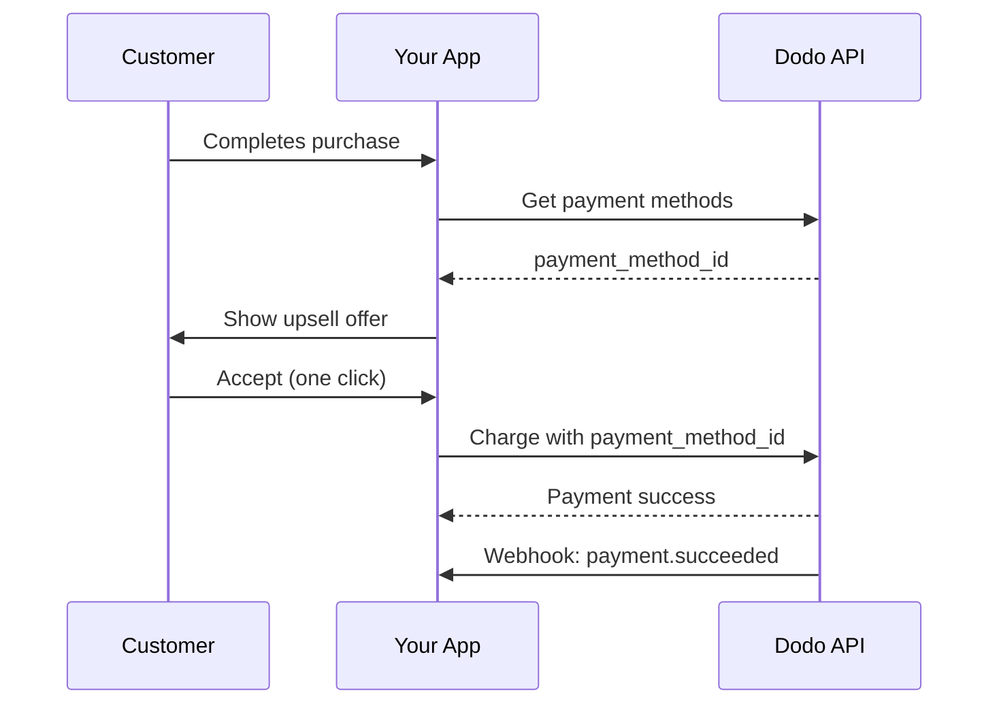
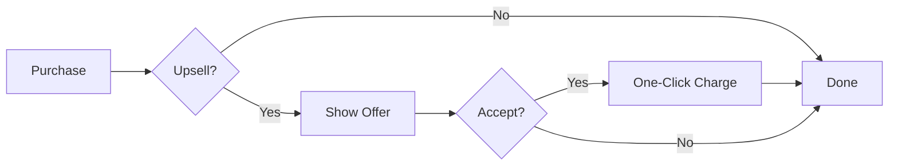
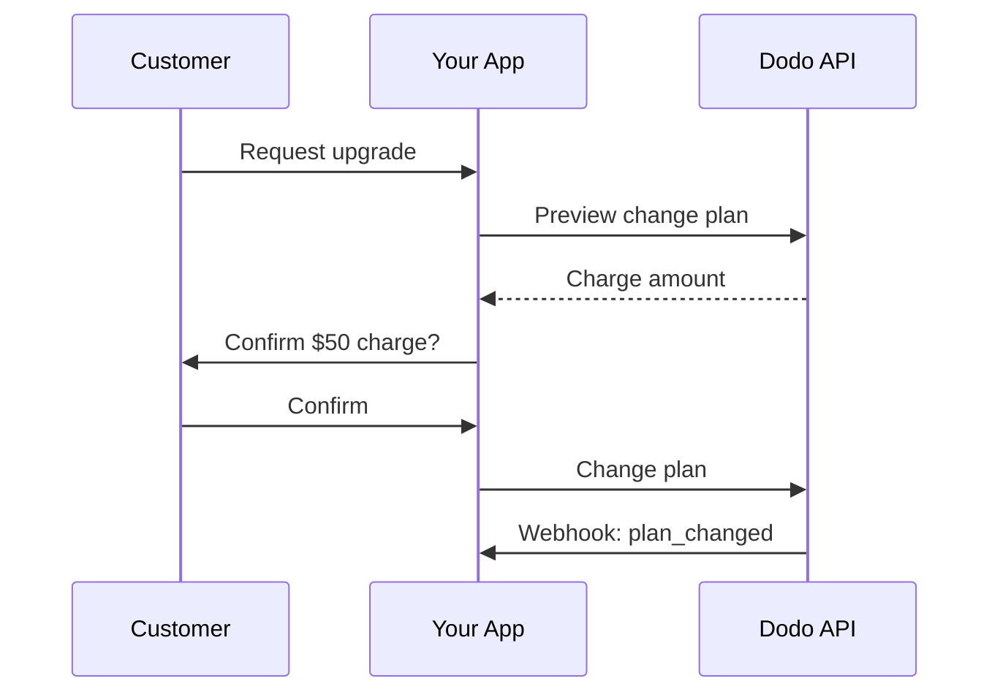
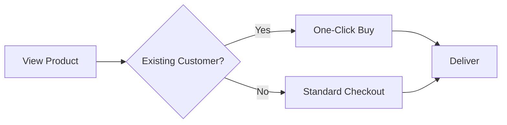

<Info>
Los upsells y downsells te permiten ofrecer productos adicionales o cambios de plan a los clientes utilizando sus métodos de pago guardados. Esto habilita compras de un clic que omiten la recopilación de pagos, mejorando drásticamente las tasas de conversión.
</Info>

<CardGroup cols={3}>
<Card title="Upsells Post-Pedido" icon="cart-plus">
  Ofrece productos complementarios inmediatamente después de la compra con compra de un clic.
</Card>

<Card title="Actualizaciones de Suscripción" icon="arrow-up">
  Mueve a los clientes a niveles más altos con prorrateo automático y facturación instantánea.
</Card>

<Card title="Ventas Cruzadas" icon="grid-2-plus">
  Agrega productos relacionados a clientes existentes sin necesidad de reingresar detalles de pago.
</Card>
</CardGroup>

## Descripción General

Los upsells y downsells son poderosas estrategias de optimización de ingresos:

- **Upsells**: Ofrecer un producto o actualización de mayor valor (por ejemplo, plan Pro en lugar de Básico)
- **Downsells**: Ofrecer una alternativa de menor precio cuando un cliente rechaza o degrada
- **Ventas Cruzadas**: Sugerir productos complementarios (por ejemplo, complementos, artículos relacionados)

Dodo Payments habilita estos flujos a través del `payment_method_id` parámetro, que te permite cargar el método de pago guardado de un cliente sin requerir que reingrese los detalles de la tarjeta.

### Beneficios Clave

| Beneficio | Impacto |
|-----------|--------|
| **Compras de un clic** | Omitir completamente el formulario de pago para clientes recurrentes |
| **Mayor conversión** | Reducir la fricción en el momento de la decisión |
| **Procesamiento instantáneo** | Los cargos se procesan inmediatamente con `confirm: true` |
| **Experiencia de usuario sin interrupciones** | Los clientes permanecen en tu aplicación durante todo el flujo |

## Cómo Funciona



## Requisitos Previos

Antes de implementar upsells y downsells, asegúrate de tener:

<Steps>
<Step title="Cliente con Método de Pago Guardado">
  Los clientes deben haber completado al menos una compra. Los métodos de pago se guardan automáticamente cuando los clientes terminan el proceso de compra.
</Step>

<Step title="Productos Configurados">
  Crea tus productos de upsell en el panel de control de Dodo Payments. Estos pueden ser pagos únicos, suscripciones o complementos.
</Step>

<Step title="Webhook Endpoint">
  Configura webhooks para manejar los eventos `payment.succeeded`, `payment.failed` y `subscription.plan_changed`.
</Step>
</Steps>

## Obtener Métodos de Pago del Cliente

Antes de ofrecer un upsell, recupera los métodos de pago guardados del cliente:

<Tabs>
<Tab title="TypeScript">

```typescript
import DodoPayments from 'dodopayments';

const client = new DodoPayments({
  bearerToken: process.env.DODO_PAYMENTS_API_KEY,
  environment: 'live_mode',
});

async function getPaymentMethods(customerId: string) {
  const paymentMethods = await client.customers.listPaymentMethods(customerId);
  
  // Returns array of saved payment methods
  // Each has: payment_method_id, type, card (last4, brand, exp_month, exp_year)
  return paymentMethods;
}

// Example usage
const methods = await getPaymentMethods('cus_123');
console.log('Available payment methods:', methods);

// Use the first available method for upsell
const primaryMethod = methods[0]?.payment_method_id;
```

</Tab>

<Tab title="Python">

```python
import os
from dodopayments import DodoPayments

client = DodoPayments(
    bearer_token=os.environ.get("DODO_PAYMENTS_API_KEY"),
    environment="live_mode",
)

def get_payment_methods(customer_id: str):
    payment_methods = client.customers.list_payment_methods(customer_id)
    
    # Returns list of saved payment methods
    # Each has: payment_method_id, type, card (last4, brand, exp_month, exp_year)
    return payment_methods

# Example usage
methods = get_payment_methods("cus_123")
print("Available payment methods:", methods)

# Use the first available method for upsell
primary_method = methods[0].payment_method_id if methods else None
```

</Tab>

<Tab title="Go">

```go
package main

import (
    "context"
    "fmt"
    "github.com/dodopayments/dodopayments-go"
    "github.com/dodopayments/dodopayments-go/option"
)

func getPaymentMethods(customerID string) ([]dodopayments.PaymentMethod, error) {
    client := dodopayments.NewClient(
        option.WithBearerToken(os.Getenv("DODO_PAYMENTS_API_KEY")),
    )
    
    methods, err := client.Customers.ListPaymentMethods(
        context.TODO(),
        customerID,
    )
    if err != nil {
        return nil, err
    }
    
    return methods, nil
}

func main() {
    methods, err := getPaymentMethods("cus_123")
    if err != nil {
        panic(err)
    }
    
    fmt.Println("Available payment methods:", methods)
    
    // Use the first available method for upsell
    if len(methods) > 0 {
        primaryMethod := methods[0].PaymentMethodID
        fmt.Println("Primary method:", primaryMethod)
    }
}
```

</Tab>
</Tabs>

<Info>
Los métodos de pago se guardan automáticamente cuando los clientes completan el proceso de compra. No necesitas guardarlos explícitamente.
</Info>

## Upsells de Uno-Clic Post-PCompra

Ofrece productos adicionales inmediatamente después de una compra exitosa. El cliente puede aceptarlo con un solo clic ya que su método de pago ya está guardado.



### Implementación

<Tabs>
<Tab title="TypeScript">

```typescript
import DodoPayments from 'dodopayments';

const client = new DodoPayments({
  bearerToken: process.env.DODO_PAYMENTS_API_KEY,
  environment: 'live_mode',
});

async function createOneClickUpsell(
  customerId: string,
  paymentMethodId: string,
  upsellProductId: string
) {
  // Create checkout session with saved payment method
  // confirm: true processes the payment immediately
  const session = await client.checkoutSessions.create({
    product_cart: [
      {
        product_id: upsellProductId,
        quantity: 1
      }
    ],
    customer: {
      customer_id: customerId
    },
    payment_method_id: paymentMethodId,
    confirm: true,  // Required when using payment_method_id
    return_url: 'https://yourapp.com/upsell-success',
    feature_flags: {
      redirect_immediately: true  // Skip success page
    },
    metadata: {
      upsell_source: 'post_purchase',
      original_order_id: 'order_123'
    }
  });

  return session;
}

// Example: Offer premium add-on after initial purchase
async function handlePostPurchaseUpsell(customerId: string) {
  // Get customer's payment methods
  const methods = await client.customers.listPaymentMethods(customerId);
  
  if (methods.length === 0) {
    console.log('No saved payment methods available');
    return null;
  }

  // Create the upsell with one-click checkout
  const upsell = await createOneClickUpsell(
    customerId,
    methods[0].payment_method_id,
    'prod_premium_addon'
  );

  console.log('Upsell processed:', upsell.session_id);
  return upsell;
}
```

</Tab>

<Tab title="Python">

```python
import os
from dodopayments import DodoPayments

client = DodoPayments(
    bearer_token=os.environ.get("DODO_PAYMENTS_API_KEY"),
    environment="live_mode",
)

def create_one_click_upsell(
    customer_id: str,
    payment_method_id: str,
    upsell_product_id: str
):
    """Create a one-click upsell using saved payment method."""
    
    # Create checkout session with saved payment method
    # confirm=True processes the payment immediately
    session = client.checkout_sessions.create(
        product_cart=[
            {
                "product_id": upsell_product_id,
                "quantity": 1
            }
        ],
        customer={
            "customer_id": customer_id
        },
        payment_method_id=payment_method_id,
        confirm=True,  # Required when using payment_method_id
        return_url="https://yourapp.com/upsell-success",
        feature_flags={
            "redirect_immediately": True  # Skip success page
        },
        metadata={
            "upsell_source": "post_purchase",
            "original_order_id": "order_123"
        }
    )
    
    return session

def handle_post_purchase_upsell(customer_id: str):
    """Offer premium add-on after initial purchase."""
    
    # Get customer's payment methods
    methods = client.customers.list_payment_methods(customer_id)
    
    if not methods:
        print("No saved payment methods available")
        return None
    
    # Create the upsell with one-click checkout
    upsell = create_one_click_upsell(
        customer_id=customer_id,
        payment_method_id=methods[0].payment_method_id,
        upsell_product_id="prod_premium_addon"
    )
    
    print(f"Upsell processed: {upsell.session_id}")
    return upsell
```

</Tab>

<Tab title="Go">

```go
package main

import (
    "context"
    "fmt"
    "os"
    
    "github.com/dodopayments/dodopayments-go"
    "github.com/dodopayments/dodopayments-go/option"
)

func createOneClickUpsell(
    customerID string,
    paymentMethodID string,
    upsellProductID string,
) (*dodopayments.CheckoutSession, error) {
    client := dodopayments.NewClient(
        option.WithBearerToken(os.Getenv("DODO_PAYMENTS_API_KEY")),
    )
    
    // Create checkout session with saved payment method
    // Confirm: true processes the payment immediately
    session, err := client.CheckoutSessions.Create(context.TODO(), dodopayments.CheckoutSessionCreateParams{
        ProductCart: dodopayments.F([]dodopayments.CheckoutSessionCreateParamsProductCart{
            {
                ProductID: dodopayments.F(upsellProductID),
                Quantity:  dodopayments.F(int64(1)),
            },
        }),
        Customer: dodopayments.F(dodopayments.CheckoutSessionCreateParamsCustomer{
            CustomerID: dodopayments.F(customerID),
        }),
        PaymentMethodID: dodopayments.F(paymentMethodID),
        Confirm:         dodopayments.F(true), // Required when using payment_method_id
        ReturnURL:       dodopayments.F("https://yourapp.com/upsell-success"),
        FeatureFlags: dodopayments.F(dodopayments.CheckoutSessionCreateParamsFeatureFlags{
            RedirectImmediately: dodopayments.F(true), // Skip success page
        }),
        Metadata: dodopayments.F(map[string]string{
            "upsell_source":     "post_purchase",
            "original_order_id": "order_123",
        }),
    })
    
    return session, err
}

func handlePostPurchaseUpsell(customerID string) (*dodopayments.CheckoutSession, error) {
    client := dodopayments.NewClient(
        option.WithBearerToken(os.Getenv("DODO_PAYMENTS_API_KEY")),
    )
    
    // Get customer's payment methods
    methods, err := client.Customers.ListPaymentMethods(context.TODO(), customerID)
    if err != nil {
        return nil, err
    }
    
    if len(methods) == 0 {
        fmt.Println("No saved payment methods available")
        return nil, nil
    }
    
    // Create the upsell with one-click checkout
    upsell, err := createOneClickUpsell(
        customerID,
        methods[0].PaymentMethodID,
        "prod_premium_addon",
    )
    if err != nil {
        return nil, err
    }
    
    fmt.Printf("Upsell processed: %s\n", upsell.SessionID)
    return upsell, nil
}
```

</Tab>
</Tabs>

<Warning>
Al usar `payment_method_id`, debes establecer `confirm: true` y proporcionar un `customer_id` existente. El método de pago debe pertenecer a ese cliente.
</Warning>

## Actualizaciones de Suscripción

Mueve a los clientes a planes de suscripción de nivel superior con manejo automático del prorrateo.



### Vista Previa Antes de Confirmar

Siempre visualiza los cambios de plan para mostrar a los clientes exactamente lo que se les cobrará:

<Tabs>
<Tab title="TypeScript">

```typescript
async function previewUpgrade(
  subscriptionId: string,
  newProductId: string
) {
  const preview = await client.subscriptions.previewChangePlan(subscriptionId, {
    product_id: newProductId,
    quantity: 1,
    proration_billing_mode: 'difference_immediately'
  });

  return {
    immediateCharge: preview.immediate_charge?.summary,
    newPlan: preview.new_plan,
    effectiveDate: preview.effective_date
  };
}

// Show customer the charge before confirming
const preview = await previewUpgrade('sub_123', 'prod_pro_plan');
console.log(`Upgrade will charge: ${preview.immediateCharge}`);
```

</Tab>

<Tab title="Python">

```python
def preview_upgrade(subscription_id: str, new_product_id: str):
    preview = client.subscriptions.preview_change_plan(
        subscription_id=subscription_id,
        product_id=new_product_id,
        quantity=1,
        proration_billing_mode="difference_immediately"
    )
    
    return {
        "immediate_charge": preview.immediate_charge.summary if preview.immediate_charge else None,
        "new_plan": preview.new_plan,
        "effective_date": preview.effective_date
    }

# Show customer the charge before confirming
preview = preview_upgrade("sub_123", "prod_pro_plan")
print(f"Upgrade will charge: {preview['immediate_charge']}")
```

</Tab>

<Tab title="Go">

```go
func previewUpgrade(subscriptionID string, newProductID string) (map[string]interface{}, error) {
    client := dodopayments.NewClient(
        option.WithBearerToken(os.Getenv("DODO_PAYMENTS_API_KEY")),
    )
    
    preview, err := client.Subscriptions.PreviewChangePlan(
        context.TODO(),
        subscriptionID,
        dodopayments.SubscriptionPreviewChangePlanParams{
            ProductID:             dodopayments.F(newProductID),
            Quantity:              dodopayments.F(int64(1)),
            ProrationBillingMode:  dodopayments.F(dodopayments.ProrationBillingModeDifferenceImmediately),
        },
    )
    if err != nil {
        return nil, err
    }
    
    return map[string]interface{}{
        "immediate_charge": preview.ImmediateCharge.Summary,
        "new_plan":         preview.NewPlan,
        "effective_date":   preview.EffectiveDate,
    }, nil
}
```

</Tab>
</Tabs>

### Ejecutar la Actualización

<Tabs>
<Tab title="TypeScript">

```typescript
async function upgradeSubscription(
  subscriptionId: string,
  newProductId: string,
  prorationMode: 'prorated_immediately' | 'difference_immediately' | 'full_immediately' = 'difference_immediately'
) {
  const result = await client.subscriptions.changePlan(subscriptionId, {
    product_id: newProductId,
    quantity: 1,
    proration_billing_mode: prorationMode
  });

  return {
    status: result.status,
    subscriptionId: result.subscription_id,
    paymentId: result.payment_id,
    invoiceId: result.invoice_id
  };
}

// Upgrade from Basic ($30) to Pro ($80)
// With difference_immediately: charges $50 instantly
const upgrade = await upgradeSubscription('sub_123', 'prod_pro_plan');
console.log('Upgrade status:', upgrade.status);
```

</Tab>

<Tab title="Python">

```python
def upgrade_subscription(
    subscription_id: str,
    new_product_id: str,
    proration_mode: str = "difference_immediately"
):
    result = client.subscriptions.change_plan(
        subscription_id=subscription_id,
        product_id=new_product_id,
        quantity=1,
        proration_billing_mode=proration_mode
    )
    
    return {
        "status": result.status,
        "subscription_id": result.subscription_id,
        "payment_id": result.payment_id,
        "invoice_id": result.invoice_id
    }

# Upgrade from Basic ($30) to Pro ($80)
# With difference_immediately: charges $50 instantly
upgrade = upgrade_subscription("sub_123", "prod_pro_plan")
print(f"Upgrade status: {upgrade['status']}")
```

</Tab>

<Tab title="Go">

```go
func upgradeSubscription(
    subscriptionID string,
    newProductID string,
    prorationMode dodopayments.ProrationBillingMode,
) (*dodopayments.SubscriptionChangePlanResponse, error) {
    client := dodopayments.NewClient(
        option.WithBearerToken(os.Getenv("DODO_PAYMENTS_API_KEY")),
    )
    
    result, err := client.Subscriptions.ChangePlan(
        context.TODO(),
        subscriptionID,
        dodopayments.SubscriptionChangePlanParams{
            ProductID:            dodopayments.F(newProductID),
            Quantity:             dodopayments.F(int64(1)),
            ProrationBillingMode: dodopayments.F(prorationMode),
        },
    )
    
    return result, err
}

// Upgrade from Basic ($30) to Pro ($80)
// With DifferenceImmediately: charges $50 instantly
upgrade, err := upgradeSubscription(
    "sub_123",
    "prod_pro_plan",
    dodopayments.ProrationBillingModeDifferenceImmediately,
)
if err != nil {
    panic(err)
}
fmt.Printf("Upgrade status: %s\n", upgrade.Status)
```

</Tab>
</Tabs>

### Modos de Prorrateo

Elige cómo se facturan los clientes al actualizar:

| Modo | Comportamiento | Mejor Para |
|------|----------------|--------------|
| `difference_immediately` | Carga la diferencia de precio al instante ($30→$80 = $50) | Actualizaciones simples |
| `prorated_immediately` | Carga basada en el tiempo restante en el ciclo de facturación | Facturación justa basada en el tiempo |
| `full_immediately` | Carga el precio completo del nuevo plan, ignora el tiempo restante | El ciclo de facturación se reinicia |

<Tip>
Usa `difference_immediately` para flujos de actualización sencillos. Usa `prorated_immediately` cuando quieras tener en cuenta el tiempo no utilizado en el plan actual.
</Tip>

## Ventas Cruzadas

Agrega productos complementarios para clientes existentes sin requerir que reingresen detalles de pago.



### Implementación

<Tabs>
<Tab title="TypeScript">

```typescript
async function createCrossSell(
  customerId: string,
  paymentMethodId: string,
  productId: string,
  quantity: number = 1
) {
  // Create a one-time payment using saved payment method
  const payment = await client.payments.create({
    product_cart: [
      {
        product_id: productId,
        quantity: quantity
      }
    ],
    customer_id: customerId,
    payment_method_id: paymentMethodId,
    return_url: 'https://yourapp.com/purchase-complete',
    metadata: {
      purchase_type: 'cross_sell',
      source: 'product_recommendation'
    }
  });

  return payment;
}

// Example: Customer bought a course, offer related ebook
async function offerRelatedProduct(customerId: string, relatedProductId: string) {
  const methods = await client.customers.listPaymentMethods(customerId);
  
  if (methods.length === 0) {
    // Fall back to standard checkout
    return client.checkoutSessions.create({
      product_cart: [{ product_id: relatedProductId, quantity: 1 }],
      customer: { customer_id: customerId },
      return_url: 'https://yourapp.com/purchase-complete'
    });
  }

  // One-click purchase
  return createCrossSell(customerId, methods[0].payment_method_id, relatedProductId);
}
```

</Tab>

<Tab title="Python">

```python
def create_cross_sell(
    customer_id: str,
    payment_method_id: str,
    product_id: str,
    quantity: int = 1
):
    """Create a one-time payment using saved payment method."""
    
    payment = client.payments.create(
        product_cart=[
            {
                "product_id": product_id,
                "quantity": quantity
            }
        ],
        customer_id=customer_id,
        payment_method_id=payment_method_id,
        return_url="https://yourapp.com/purchase-complete",
        metadata={
            "purchase_type": "cross_sell",
            "source": "product_recommendation"
        }
    )
    
    return payment

def offer_related_product(customer_id: str, related_product_id: str):
    """Offer related product with one-click purchase if possible."""
    
    methods = client.customers.list_payment_methods(customer_id)
    
    if not methods:
        # Fall back to standard checkout
        return client.checkout_sessions.create(
            product_cart=[{"product_id": related_product_id, "quantity": 1}],
            customer={"customer_id": customer_id},
            return_url="https://yourapp.com/purchase-complete"
        )
    
    # One-click purchase
    return create_cross_sell(customer_id, methods[0].payment_method_id, related_product_id)
```

</Tab>

<Tab title="Go">

```go
func createCrossSell(
    customerID string,
    paymentMethodID string,
    productID string,
    quantity int64,
) (*dodopayments.Payment, error) {
    client := dodopayments.NewClient(
        option.WithBearerToken(os.Getenv("DODO_PAYMENTS_API_KEY")),
    )
    
    payment, err := client.Payments.Create(context.TODO(), dodopayments.PaymentCreateParams{
        ProductCart: dodopayments.F([]dodopayments.PaymentCreateParamsProductCart{
            {
                ProductID: dodopayments.F(productID),
                Quantity:  dodopayments.F(quantity),
            },
        }),
        CustomerID:      dodopayments.F(customerID),
        PaymentMethodID: dodopayments.F(paymentMethodID),
        ReturnURL:       dodopayments.F("https://yourapp.com/purchase-complete"),
        Metadata: dodopayments.F(map[string]string{
            "purchase_type": "cross_sell",
            "source":        "product_recommendation",
        }),
    })
    
    return payment, err
}

func offerRelatedProduct(customerID string, relatedProductID string) (interface{}, error) {
    client := dodopayments.NewClient(
        option.WithBearerToken(os.Getenv("DODO_PAYMENTS_API_KEY")),
    )
    
    methods, err := client.Customers.ListPaymentMethods(context.TODO(), customerID)
    if err != nil {
        return nil, err
    }
    
    if len(methods) == 0 {
        // Fall back to standard checkout
        return client.CheckoutSessions.Create(context.TODO(), dodopayments.CheckoutSessionCreateParams{
            ProductCart: dodopayments.F([]dodopayments.CheckoutSessionCreateParamsProductCart{
                {ProductID: dodopayments.F(relatedProductID), Quantity: dodopayments.F(int64(1))},
            }),
            Customer:  dodopayments.F(dodopayments.CheckoutSessionCreateParamsCustomer{CustomerID: dodopayments.F(customerID)}),
            ReturnURL: dodopayments.F("https://yourapp.com/purchase-complete"),
        })
    }
    
    // One-click purchase
    return createCrossSell(customerID, methods[0].PaymentMethodID, relatedProductID, 1)
}
```

</Tab>
</Tabs>

## Downgrades de Suscripción

Cuando los clientes quieran moverse a un plan de nivel inferior, maneja la transición de manera suave con créditos automáticos.

### Cómo Funcionan los Downgrades

1. El cliente solicita un downgrade (Pro → Básico)
2. El sistema calcula el valor restante del plan actual
3. Se agregan créditos a la suscripción para futuras renovaciones
4. El cliente se mueve al nuevo plan inmediatamente

<Tabs>
<Tab title="TypeScript">

```typescript
async function downgradeSubscription(
  subscriptionId: string,
  newProductId: string
) {
  // Preview the downgrade first
  const preview = await client.subscriptions.previewChangePlan(subscriptionId, {
    product_id: newProductId,
    quantity: 1,
    proration_billing_mode: 'difference_immediately'
  });

  console.log('Credit to be applied:', preview.credit_amount);

  // Execute the downgrade
  const result = await client.subscriptions.changePlan(subscriptionId, {
    product_id: newProductId,
    quantity: 1,
    proration_billing_mode: 'difference_immediately'
  });

  // Credits are automatically applied to future renewals
  return result;
}

// Downgrade from Pro ($80) to Basic ($30)
// $50 credit added to subscription, auto-applied on next renewal
const downgrade = await downgradeSubscription('sub_123', 'prod_basic_plan');
```

</Tab>

<Tab title="Python">

```python
def downgrade_subscription(subscription_id: str, new_product_id: str):
    # Preview the downgrade first
    preview = client.subscriptions.preview_change_plan(
        subscription_id=subscription_id,
        product_id=new_product_id,
        quantity=1,
        proration_billing_mode="difference_immediately"
    )
    
    print(f"Credit to be applied: {preview.credit_amount}")
    
    # Execute the downgrade
    result = client.subscriptions.change_plan(
        subscription_id=subscription_id,
        product_id=new_product_id,
        quantity=1,
        proration_billing_mode="difference_immediately"
    )
    
    # Credits are automatically applied to future renewals
    return result

# Downgrade from Pro ($80) to Basic ($30)
# $50 credit added to subscription, auto-applied on next renewal
downgrade = downgrade_subscription("sub_123", "prod_basic_plan")
```

</Tab>

<Tab title="Go">

```go
func downgradeSubscription(subscriptionID string, newProductID string) (*dodopayments.SubscriptionChangePlanResponse, error) {
    client := dodopayments.NewClient(
        option.WithBearerToken(os.Getenv("DODO_PAYMENTS_API_KEY")),
    )
    
    // Preview the downgrade first
    preview, err := client.Subscriptions.PreviewChangePlan(
        context.TODO(),
        subscriptionID,
        dodopayments.SubscriptionPreviewChangePlanParams{
            ProductID:            dodopayments.F(newProductID),
            Quantity:             dodopayments.F(int64(1)),
            ProrationBillingMode: dodopayments.F(dodopayments.ProrationBillingModeDifferenceImmediately),
        },
    )
    if err != nil {
        return nil, err
    }
    
    fmt.Printf("Credit to be applied: %v\n", preview.CreditAmount)
    
    // Execute the downgrade
    result, err := client.Subscriptions.ChangePlan(
        context.TODO(),
        subscriptionID,
        dodopayments.SubscriptionChangePlanParams{
            ProductID:            dodopayments.F(newProductID),
            Quantity:             dodopayments.F(int64(1)),
            ProrationBillingMode: dodopayments.F(dodopayments.ProrationBillingModeDifferenceImmediately),
        },
    )
    
    return result, err
}
```

</Tab>
</Tabs>

<Info>
Los créditos de los downgrades usando `difference_immediately` son específicos de la suscripción y se aplican automáticamente a futuras renovaciones. Son distintos de los [Créditos de Cliente](/features/customer-credit).
</Info>

## Ejemplo Completo: Flujo de Upsell Post-PCompra

Aquí tienes una implementación completa que muestra cómo ofrecer un upsell después de una compra exitosa:

<Tabs>
<Tab title="TypeScript">

```typescript
import DodoPayments from 'dodopayments';
import express from 'express';

const client = new DodoPayments({
  bearerToken: process.env.DODO_PAYMENTS_API_KEY,
  environment: 'live_mode',
});

const app = express();

// Store for tracking upsell eligibility (use your database in production)
const eligibleUpsells = new Map<string, { customerId: string; productId: string }>();

// Webhook handler for initial purchase success
app.post('/webhooks/dodo', express.raw({ type: 'application/json' }), async (req, res) => {
  const event = JSON.parse(req.body.toString());
  
  switch (event.type) {
    case 'payment.succeeded':
      // Check if customer is eligible for upsell
      const customerId = event.data.customer_id;
      const productId = event.data.product_id;
      
      // Define upsell rules (e.g., bought Basic, offer Pro)
      const upsellProduct = getUpsellProduct(productId);
      
      if (upsellProduct) {
        eligibleUpsells.set(customerId, {
          customerId,
          productId: upsellProduct
        });
      }
      break;
      
    case 'payment.failed':
      console.log('Payment failed:', event.data.payment_id);
      // Handle failed upsell payment
      break;
  }
  
  res.json({ received: true });
});

// API endpoint to check upsell eligibility
app.get('/api/upsell/:customerId', async (req, res) => {
  const { customerId } = req.params;
  const upsell = eligibleUpsells.get(customerId);
  
  if (!upsell) {
    return res.json({ eligible: false });
  }
  
  // Get payment methods
  const methods = await client.customers.listPaymentMethods(customerId);
  
  if (methods.length === 0) {
    return res.json({ eligible: false, reason: 'no_payment_method' });
  }
  
  // Get product details for display
  const product = await client.products.retrieve(upsell.productId);
  
  res.json({
    eligible: true,
    product: {
      id: product.product_id,
      name: product.name,
      price: product.price,
      currency: product.currency
    },
    paymentMethodId: methods[0].payment_method_id
  });
});

// API endpoint to accept upsell
app.post('/api/upsell/:customerId/accept', async (req, res) => {
  const { customerId } = req.params;
  const upsell = eligibleUpsells.get(customerId);
  
  if (!upsell) {
    return res.status(400).json({ error: 'No upsell available' });
  }
  
  try {
    const methods = await client.customers.listPaymentMethods(customerId);
    
    // Create one-click purchase
    const session = await client.checkoutSessions.create({
      product_cart: [{ product_id: upsell.productId, quantity: 1 }],
      customer: { customer_id: customerId },
      payment_method_id: methods[0].payment_method_id,
      confirm: true,
      return_url: `${process.env.APP_URL}/upsell-success`,
      feature_flags: { redirect_immediately: true },
      metadata: { upsell: 'true', source: 'post_purchase' }
    });
    
    // Clear the upsell offer
    eligibleUpsells.delete(customerId);
    
    res.json({ success: true, sessionId: session.session_id });
  } catch (error) {
    console.error('Upsell failed:', error);
    res.status(500).json({ error: 'Upsell processing failed' });
  }
});

// Helper function to determine upsell product
function getUpsellProduct(purchasedProductId: string): string | null {
  const upsellMap: Record<string, string> = {
    'prod_basic_plan': 'prod_pro_plan',
    'prod_starter_course': 'prod_complete_bundle',
    'prod_single_license': 'prod_team_license'
  };
  
  return upsellMap[purchasedProductId] || null;
}

app.listen(3000);
```

</Tab>

<Tab title="Python">

```python
import os
from flask import Flask, request, jsonify
from dodopayments import DodoPayments

client = DodoPayments(
    bearer_token=os.environ.get("DODO_PAYMENTS_API_KEY"),
    environment="live_mode",
)

app = Flask(__name__)

# Store for tracking upsell eligibility (use your database in production)
eligible_upsells = {}

@app.route('/webhooks/dodo', methods=['POST'])
def webhook_handler():
    event = request.json
    
    if event['type'] == 'payment.succeeded':
        # Check if customer is eligible for upsell
        customer_id = event['data']['customer_id']
        product_id = event['data']['product_id']
        
        # Define upsell rules
        upsell_product = get_upsell_product(product_id)
        
        if upsell_product:
            eligible_upsells[customer_id] = {
                'customer_id': customer_id,
                'product_id': upsell_product
            }
    
    elif event['type'] == 'payment.failed':
        print(f"Payment failed: {event['data']['payment_id']}")
    
    return jsonify({'received': True})

@app.route('/api/upsell/<customer_id>', methods=['GET'])
def check_upsell(customer_id):
    upsell = eligible_upsells.get(customer_id)
    
    if not upsell:
        return jsonify({'eligible': False})
    
    # Get payment methods
    methods = client.customers.list_payment_methods(customer_id)
    
    if not methods:
        return jsonify({'eligible': False, 'reason': 'no_payment_method'})
    
    # Get product details for display
    product = client.products.retrieve(upsell['product_id'])
    
    return jsonify({
        'eligible': True,
        'product': {
            'id': product.product_id,
            'name': product.name,
            'price': product.price,
            'currency': product.currency
        },
        'payment_method_id': methods[0].payment_method_id
    })

@app.route('/api/upsell/<customer_id>/accept', methods=['POST'])
def accept_upsell(customer_id):
    upsell = eligible_upsells.get(customer_id)
    
    if not upsell:
        return jsonify({'error': 'No upsell available'}), 400
    
    try:
        methods = client.customers.list_payment_methods(customer_id)
        
        # Create one-click purchase
        session = client.checkout_sessions.create(
            product_cart=[{'product_id': upsell['product_id'], 'quantity': 1}],
            customer={'customer_id': customer_id},
            payment_method_id=methods[0].payment_method_id,
            confirm=True,
            return_url=f"{os.environ['APP_URL']}/upsell-success",
            feature_flags={'redirect_immediately': True},
            metadata={'upsell': 'true', 'source': 'post_purchase'}
        )
        
        # Clear the upsell offer
        del eligible_upsells[customer_id]
        
        return jsonify({'success': True, 'session_id': session.session_id})
    
    except Exception as error:
        print(f"Upsell failed: {error}")
        return jsonify({'error': 'Upsell processing failed'}), 500

def get_upsell_product(purchased_product_id: str) -> str:
    """Determine upsell product based on purchased product."""
    upsell_map = {
        'prod_basic_plan': 'prod_pro_plan',
        'prod_starter_course': 'prod_complete_bundle',
        'prod_single_license': 'prod_team_license'
    }
    return upsell_map.get(purchased_product_id)

if __name__ == '__main__':
    app.run(port=3000)
```

</Tab>
</Tabs>

## Mejores Prácticas

<AccordionGroup>
<Accordion title="Sincroniza tus Upsells Estratégicamente">
El mejor momento para ofrecer un upsell es inmediatamente después de una compra exitosa, cuando los clientes están en una mentalidad de compra. Otros momentos efectivos:
- Después de alcanzar hitos de uso de funciones
- Cuando se acercan a los límites del plan
- Durante la finalización del onboarding
</Accordion>

<Accordion title="Valida la Elegibilidad del Método de Pago">
Antes de intentar un cargo de un clic, verifica el método de pago:
- Es compatible con la moneda del producto
- No ha caducado
- Pertenece al cliente

La API validará esto, pero verificar proactivamente mejora la experiencia del usuario.
</Accordion>

<Accordion title="Maneja Fallos con Gracia">
Cuando los cargos de un clic fallan:
1. Vuelve al flujo estándar de compra
2. Notifica al cliente con un mensaje claro
3. Ofrece actualizar el método de pago
4. No intentes cargas fallidas repetidamente
</Accordion>

<Accordion title="Proporciona una Propuesta de Valor Clara">
Los upsells convierten mejor cuando los clientes entienden el valor:
- Muestra lo que están obteniendo frente al plan actual
- Destaca la diferencia de precio, no el precio total
- Usa prueba social (por ejemplo, "Actualización más popular")
</Accordion>

<Accordion title="Respeta la Elección del Cliente">
- Siempre proporciona una forma fácil de rechazar
- No muestres el mismo upsell repetidamente después de un rechazo
- Rastrea y analiza qué upsells se convierten para optimizar las ofertas
</Accordion>
</AccordionGroup>

## Webhooks para Monitorear

Rastrea estos eventos de webhook para los flujos de upsell y downgrade:

| Evento | Disparador | Acción |
|-------|---------|--------|
| `payment.succeeded` | Pago de upsell/venta cruzada completado | Entregar producto, actualizar acceso |
| `payment.failed` | Fallo en el cargo de un clic | Mostrar error, ofrecer reintentar o recurrir |
| `subscription.plan_changed` | Actualización/downgrade completado | Actualizar características, enviar confirmación |
| `subscription.active` | Suscripción reactivada después del cambio de plan | Otorgar acceso al nuevo nivel |

<Card title="Guía de Integración de Webhooks" icon="webhook" href="/developer-resources/webhooks">
  Aprende cómo configurar y verificar endpoints de webhook.
</Card>

## Recursos Relacionados

<CardGroup cols={2}>
<Card title="Guía de Actualización de Suscripciones" icon="arrows-rotate" href="/developer-resources/subscription-upgrade-downgrade">
  Guía detallada sobre cambios de planes, modos de prorrateo y manejo de fallas.
</Card>

<Card title="Sesiones de Pago" icon="cart-shopping" href="/developer-resources/checkout-session">
  Referencia completa para crear sesiones de pago con todas las opciones.
</Card>

<Card title="API de Métodos de Pago del Cliente" icon="credit-card" href="/api-reference/customers/get-customer-payment-methods">
  Referencia de la API para listar los métodos de pago de los clientes.
</Card>

<Card title="Complementos" icon="puzzle-piece" href="/features/addons">
  Mejora las suscripciones con complementos flexibles para ingresos adicionales.
</Card>
</CardGroup>
