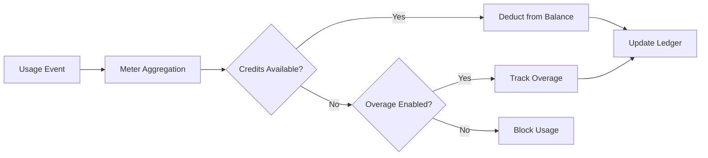

<Info>
Los medidores convierten eventos sin procesar en cantidades facturables. Filtran eventos y aplican funciones de agregación (Count, Sum, Max, Last) para calcular el uso por cliente.
</Info>

<Frame>

</Frame>

## Recursos de API

<AccordionGroup>
<Accordion title="View Meter API References">
<CardGroup cols={2}>
<Card title="Create Meter" icon="plus" href="/api-reference/meters/create-meter">
Crea medidores programáticamente mediante la API.
</Card>

<Card title="List Meters" icon="list" href="/api-reference/meters/get-meters">
Recupera todos los medidores de tu cuenta.
</Card>

<Card title="Get Meter" icon="eye" href="/api-reference/meters/retrieve-meter">
Obtén detalles de un medidor específico por ID.
</Card>

<Card title="Archive Meter" icon="arrow-rotate-right" href="/api-reference/meters/archive-meter">
Archiva un medidor para dejar de rastrear el uso.
</Card>

<Card title="Unarchive Meter" icon="arrow-rotate-left" href="/api-reference/meters/unarchive-meter">
Restaura un medidor archivado para reanudar el seguimiento.
</Card>
</CardGroup>
</Accordion>
</AccordionGroup>

## Creando un Medidor

<Steps>
<Step title="Basic Information">
<ParamField path="Meter Name" type="string" required>
Nombre descriptivo (p. ej., "API Requests", "Token Usage")
</ParamField>

<ParamField path="Event Name" type="string" required>
Nombre exacto del evento que debe coincidir (sensible a mayúsculas). Ejemplos: `api.call`, `image.generated`
</ParamField>
</Step>

<Step title="Aggregation">
<ParamField path="Aggregation Type" type="string" required>
Elige cómo se agregan los eventos:

- **Count**: Número total de eventos (llamadas a la API, cargas)
- **Sum**: Suma valores numéricos (tokens, bytes)
- **Max**: Valor más alto en el periodo (usuarios máximos)
- **Last**: Valor más reciente
</ParamField>

<ParamField path="Over Property" type="string">
Clave de metadatos para agregar (obligatoria para todos los tipos excepto Count). Ejemplos: `tokens`, `bytes`, `duration_ms`
</ParamField>

<ParamField path="Measurement Unit" type="string" required>
Etiqueta de unidad para facturas. Ejemplos: `calls`, `tokens`, `GB`, `hours`
</ParamField>
</Step>

<Step title="Filtering (Optional)">
<Frame>

</Frame>

Agrega condiciones para filtrar qué eventos se cuentan:
- **Lógica AND**: Todas las condiciones deben coincidir
- **Lógica OR**: Cualquier condición puede coincidir

**Comparadores**: igual, no igual, mayor que, menor que, contiene

Activa el filtrado, elige la lógica, añade condiciones con clave de propiedad, comparador y valor.
</Step>

<Step title="Create">
Revisa la configuración y haz clic en **Create Meter**.
</Step>
</Steps>

## Visualizando Analíticas

<Frame>

</Frame>

Tu panel de medidores muestra:
- **Resumen**: Uso total y gráfico de uso
- **Eventos**: Eventos individuales recibidos
- **Clientes**: Uso y cargos por cliente

## Facturación en créditos en lugar de moneda

Por defecto, los medidores cobran a los clientes por unidad en dólares (o la moneda configurada). En cambio, puedes configurar un medidor para **deducir de un saldo de créditos**; de ese modo, el uso consume créditos en lugar de generar un cargo monetario.

<Info>
La deducción basada en créditos requiere una [Asignación de créditos](/features/credit-based-billing) adjunta al mismo producto. Crea primero tu crédito y luego vincúlalo al medidor.
</Info>

### Cuándo usar la deducción basada en créditos

| Escenario | Estándar (moneda) | Basado en créditos |
|----------|-------------------|-------------------|
| Precios simples por unidad ($0.01/llamada) | ✅ Mejor opción | Sobrecarga innecesaria |
| Paquetes de créditos prepago (comprar 10K tokens, usar con el tiempo) | ❌ No se puede expresar | ✅ Mejor opción |
| Uso incluido con suscripciones (plan Pro incluye 100K llamadas) | Posible mediante umbral gratuito | ✅ Mejor - los créditos se acumulan, expiran y se muestran en el portal |
| Productos con múltiples medidores que comparten una reserva de créditos | ❌ Cada medidor factura por separado | ✅ Todos los medidores deducen de un mismo saldo |

### Configurar un medidor para deducir créditos

<Steps>
<Step title="Create a Credit Entitlement">
Primero, crea un crédito en **Productos → Créditos**. Define la unidad (por ejemplo, “Llamadas a la API”, “Tokens”), la precisión y los ajustes del ciclo de vida (caducidad, acumulación, excedente).

Consulta la [guía de facturación basada en créditos](/features/credit-based-billing) para obtener instrucciones detalladas.
</Step>

<Step title="Create or Edit a Usage-Based Product">
Ve a tu producto basado en uso y abre la sección de configuración del **Medidor**.
</Step>

<Step title="Add a Meter">
Haz clic en el botón **+** para adjuntar un medidor. Configura el nombre del evento, el tipo de agregación y la unidad de medida como de costumbre.
</Step>

<Step title="Enable 'Bill Usage in Credits'">
Activa **Facturar uso en Créditos** en la configuración del medidor. Esto muestra los ajustes de crédito:

<Frame caption="Toggle 'Bill usage in Credits' to switch from currency-based to credit-based deduction.">

</Frame>

<ParamField path="Credit Entitlement" type="string" required>
Selecciona de qué asignación de créditos debe deducir este medidor.
</ParamField>

<ParamField path="Meter units per credit" type="number" required>
El número de unidades de uso necesarias para deducir 1 crédito. Por ejemplo:
- `1` = cada evento del medidor deduce 1 crédito
- `100` = 100 eventos del medidor deducen 1 crédito
- `1000` = 1.000 llamadas a la API consumen 1 crédito
</ParamField>
</Step>

<Step title="Set the Free Threshold">
El **Umbral gratuito** sigue aplicándose: los eventos por debajo de ese umbral no deducen créditos.

**Ejemplo**: Con un umbral gratuito de 1.000 y unidades del medidor por crédito de 1:
- El cliente usa 2.500 llamadas a la API
- Las primeras 1.000 son gratis
- Las 1.500 restantes deducen 1.500 créditos de su saldo
</Step>
</Steps>

### Cómo funciona la deducción de créditos

Una vez configurado, la canalización de deducción se ejecuta automáticamente:

1. **Llegan eventos** - Tu aplicación envía eventos de uso a través de la [API de ingestión de eventos](/features/usage-based-billing/event-ingestion)
2. **El medidor agrega** - Los eventos se agregan según la configuración del medidor (Count, Sum, Max, Last)
3. **Procesos en segundo plano** - Cada minuto, un trabajador obtiene los nuevos eventos desde el último punto de control
4. **Se deducen créditos** - El uso agregado se convierte en créditos usando la tarifa `meter_units_per_credit` y se deduce mediante **orden FIFO** (primero se consumen los créditos más antiguos)
5. **Se registra el exceso** - Si el saldo llega a cero y el exceso está habilitado, el uso continúa y el exceso se gestiona según el comportamiento configurado (perdonado al restablecer, facturado en la siguiente factura o trasladado como déficit)

<Warning>
La deducción de créditos se ejecuta de forma asíncrona (cada ~1 minuto). Puede haber una breve demora entre la ingestión del evento y la deducción del saldo. Diseña tu aplicación para manejar esta demora: no dependas de verificaciones de saldo en tiempo real para el control de acceso de solicitudes individuales.
</Warning>

### Múltiples medidores, una reserva de créditos

Puedes vincular múltiples medidores en el mismo producto a la **misma asignación de créditos**. Todos los medidores deducen de un saldo compartido.

**Ejemplo**: Una plataforma de IA con dos medidores:
- `text.generation` - 1 crédito por 1.000 tokens
- `image.generation` - 10 créditos por imagen

Ambos deducen del mismo fondo de “Créditos de IA”. El cliente ve un saldo unificado en su portal.

<Tip>
Usa diferentes tarifas `meter_units_per_credit` entre medidores para expresar costos relativos. Las operaciones costosas (generación de imágenes) requieren menos unidades del medidor por crédito que las operaciones baratas (completado de texto).
</Tip>

<CardGroup cols={2}>
<Card title="List Customer Ledger" icon="scroll" href="/api-reference/credit-entitlements/list-customer-ledger">
Consulta el historial completo de deducción de créditos de un cliente.
</Card>
<Card title="Get Customer Balance" icon="wallet" href="/api-reference/credit-entitlements/get-customer-balance">
Consulta el saldo de créditos actual de un cliente mediante la API.
</Card>
</CardGroup>

## Solución de problemas

<AccordionGroup>
<Accordion title="Events not appearing">
- El nombre del evento debe coincidir exactamente (sensible a mayúsculas)
- Verifica que los filtros del medidor no estén excluyendo eventos
- Comprueba que existan los ID de cliente
- Desactiva temporalmente los filtros para hacer pruebas
</Accordion>

<Accordion title="Aggregation not working">
- Verifica que la propiedad Over coincida exactamente con la clave de metadatos
- Usa números, no cadenas: `tokens: 150` no `"150"`
- Incluye las propiedades requeridas en todos los eventos
</Accordion>

<Accordion title="Filters not working">
- Coincide exactamente con mayúsculas y minúsculas
- Usa los operadores correctos para el tipo de datos
- Asegura que los eventos incluyan las propiedades filtradas
</Accordion>

<Accordion title="Wrong usage totals">
- Revisa la pestaña Eventos para contar los eventos realmente recibidos
- Verifica el tipo de agregación (Count vs Sum)
- Asegura que los valores sean numéricos para Sum/Max
</Accordion>
</AccordionGroup>

## Próximos pasos

<CardGroup cols={2}>

<Card title="Send Events" icon="bolt" href="/features/usage-based-billing/event-ingestion">
Comienza a enviar eventos de uso desde tu aplicación a tus medidores.
</Card>

<Card title="View Blueprints" icon="copy" href="/features/usage-based-billing/ingestion-blueprints">
Utiliza configuraciones de medidor ya preparadas para casos de uso comunes.
</Card>
</CardGroup>
